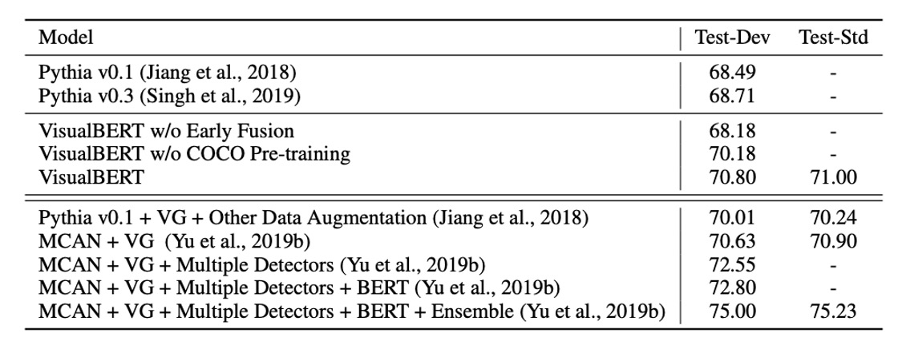

## 序章における凝視

[**VisualBERT: A Simple and Performant Baseline for Vision and Language**](https://arxiv.org/abs/1908.03557)

---

2015 年頃には、多くのクロスモーダルモデルが試みられており、その多くは LSTM ベースのアーキテクチャでした。

時が進み、2017 年には Transformer が NLP の分野で大きな成功を収め、その後、注意機構はクロスモーダル分野でも注目され、言語と視覚の統合が再び研究の焦点となりました。

このような活気ある出来事を見逃すわけにはいきません。

著者はこの影響を受けて、注意機構を使って画像内の隠れた関係を捉え、事前学習によってこれらの関係を効果的に学習できると考えました。

## 問題の定義

先行研究を踏まえ、著者は現段階でのいくつかの問題をまとめました：

- **視覚と言語の統一的なモデルアーキテクチャ**：現在、多くのモデルは特定の視覚と言語のタスクに特化して設計されていますが、さまざまなタスクに対応できる汎用的なモデルが欠けています。
- **事前学習の重要性**：BERT は事前学習の重要性を示しましたが、クロスモーダルの領域ではその重要性が十分に探求されていません。
- **画像の意味理解の課題**：画像と言語はまだ十分に関連付けられていません。

## 問題の解決

### モデルアーキテクチャ

<figure style={{"width": "80%"}}>

</figure>

VisualBERT の核心的な考え方は、Transformer の自己注意機構を再利用し、入力されたテキストの要素と画像内の領域を自動的に整列させることです。

これは BERT モデルに基づいており、「$F$」と呼ばれる視覚的埋め込みを追加し、画像を表現します。各$f \in F$は、物体検出器（Object Detector）によって導出された画像内のバウンディングボックスに対応します。

各視覚的埋め込み$f$は、以下の 3 つの埋め込みを加算して作成されます：

1. **領域特徴埋め込み** ($f_o$)：そのバウンディングボックス領域の視覚的特徴を表し、畳み込みニューラルネットワークで計算されます。
2. **セグメント埋め込み** ($f_s$)：この埋め込みが画像埋め込みであることを示し、テキスト埋め込みとは異なります。
3. **位置埋め込み** ($f_p$)：入力にテキストとバウンディングボックス領域の整列情報が提供された場合、この埋め込みは整列された位置を示し、対応するテキスト位置埋め込みの合計として設定されます。

視覚的埋め込みを元のテキスト埋め込みと一緒に複数の Transformer 層に入力し、モデルが 2 つの入力間で有用な整列関係を自動的に発見し、新しい共同表現特徴を生成します。

:::tip
これは比較的初期の論文であるため、クロスモーダル処理がやや生硬に感じられるかもしれませんが、それでも非常に良いスタートとなっています。
:::

### 事前学習メカニズム

VisualBERT の訓練目標は、言語と視覚の 2 つの入力を処理できるように学習することで、COCO データセットを使用しています。COCO は複数のペアデータを含んでおり、各画像には 5 つの独立した注釈があります。

訓練は 3 つの主要な段階に分かれます：

まず、タスクに依存しない事前学習で、モデルは COCO データセットで事前学習され、2 つの視覚に関連する言語モデルタスクを完了することを目指します：

1. **マスクされた言語モデリング**：テキスト入力の一部をランダムにマスクし、モデルにそのマスクされた単語を予測させますが、対応する画像領域のベクトルはマスクされません。
2. **文-画像ペア予測**：COCO データセットの各画像に対して複数の注釈が対応しています。モデルは 2 つの注釈を受け取り、そのうち 1 つは画像を説明し、もう 1 つは 50%の確率で対応する注釈、残り 50%はランダムに選ばれた注釈となります。モデルはこの 2 つを識別する必要があります。

次に、特定のタスクに向けた事前学習で、モデルは特定のタスクのデータセットで事前学習され、目標領域により適応できるように訓練されます。下流タスクの微調整前に、このタスクのデータセットと「マスクされた言語モデリングと画像」目標を使用して追加訓練が行われます。

最後に微調整が行われ、モデルは特定のタスクの入力、出力、および目標に結びつけられ、そのタスクでの性能を最大化するよう訓練されます。

## 討論

### VQA でのパフォーマンス

<figure style={{"width": "85%"}}>

</figure>

VQA タスクは、画像と質問が与えられたときにモデルがその質問に正しく答えることを求めます。ここでは VQA 2.0 データセットを使用し、COCO からの 100 万件以上の画像に関する質問が含まれています。

モデルは最も一般的な 3,129 の答えを予測するように訓練されます。画像の特徴は ResNeXt ベースの Faster R-CNN から来ており、このモデルは Visual Genome で事前学習されています。

実験結果は上表に示されており、3 つの方法をカバーしています：

1. 同じ視覚特徴とバウンディングボックス数を使用したベースライン方法。
2. 本研究のモデル。
3. 比較不可の方法（Visual Genome の追加問答ペア、多重検出器、およびモデルの統合を含む）。

VisualBERT は比較可能な設定で、既存の方法を上回るパフォーマンスを示しました。

:::tip
他にも VCR や$\text{NLVR}^2$などのデータセットとタスクがありますが、ここでは詳細には触れていません。
:::

### 消融実験

<figure style={{"width": "60%"}}>

</figure>

著者は NLVR2 データセットで消融実験を行い、VisualBERT の 2 つの消融モデルと 4 つの追加変種をテストしました。計算を簡素化するため、すべてのモデルは各画像の 36 個の特徴（完全なモデルを含む）のみを使用しました。

実験では、以下の 4 つの VisualBERT の主要なコンポーネントの寄与を分析しました：

1. **C1: タスク無関係の事前学習 (Task-agnostic Pre-training)**：

   - タスク無関係の事前学習の影響を調べるため、2 つの変種を設計しました：
     - 事前学習を行わないモデル (VisualBERT w/o COCO Pre-training)。
     - COCO のテキストのみ（画像なし）で事前学習を行ったモデル (VisualBERT w/o Grounded Pre-training)。
   - 結果は、これら 2 つの変種が低いパフォーマンスを示し、視覚と言語のペアデータでの事前学習が非常に重要であることを示しました。

2. **C2: 早期融合 (Early Fusion)**：

   - 早期融合を行わない変種 (VisualBERT w/o Early Fusion) を含め、視覚と言語の特徴の早期相互作用の重要性を検証しました。実験結果は、視覚と言語の多層的な相互作用がパフォーマンスに大きな貢献をしていることを確認しました。

3. **C3: BERT 初期化 (BERT Initialization)**：

   - すべてのモデルは事前学習済みの BERT モデルで初期化されました。BERT 初期化の寄与を理解するために、ランダム初期化されたパラメータの変種を設計し、完全なモデルのように訓練しました。結果は、言語事前学習済みの BERT ウェイトのみでもパフォーマンスに貢献しているが、COCO 事前学習で有用な視覚と言語の関連知識が学習されていることを示唆しています。

4. **C4: 句-画像ペア予測目標 (Sentence-Image Prediction Objective)**：
   - 句-画像ペア予測目標を含まない変種 (VisualBERT w/o Objective 2) を導入し、この目標がタスク無関係事前学習での影響を調べました。結果は、この目標がパフォーマンスに対して正の影響を与えることを示しましたが、他のコンポーネントと比べるとその効果は小さいことがわかりました。

実験結果は、最も重要な設計選択肢は**タスク無関係の事前学習 (C1)**と**視覚と言語の早期融合 (C2)**であることを証明しました。事前学習段階で、COCO データと共に画像と注釈を使用することが最も重要な部分です。

## 結論

VisualBERT は、モデルの性能を証明するだけでなく、内蔵された注意機構を通じて、情報を理解するための解釈可能で直感的な方法を提供します。

しかし、どうしても避けられないことがあります：

- 物体検出モデルを組み合わせようとすると、モデルのアーキテクチャはすぐに非常に複雑で使いにくくなります。
- 複雑すぎる設計は、実際のアプリケーションにおけるモデルの潜在能力を抑制し、デプロイの難易度を増加させます。

したがって、このアーキテクチャを最適化し、簡素化することは、今後の重要な研究方向として考慮されるべきです。
