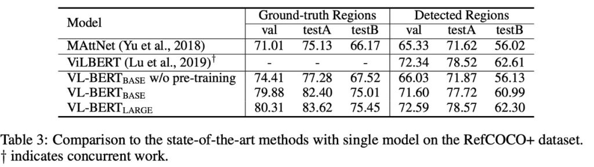

## 幕間の視聴者

[**VL-BERT: Pre-training of Generic Visual-Linguistic Representations**](https://arxiv.org/abs/1908.08530)

---

以前、VisualBERT について触れましたが、これは One-Tower Encoder のアーキテクチャにあたります。ただし、訓練中には画像に対する監視は行っておらず、テキスト部分のみが監視されました。

また、ViLBERT についても触れましたが、これは Two-Tower Encoder のアーキテクチャであり、テキストと画像にはそれぞれ専用の Encoder が用意され、クロスアテンション機構によってお互いの情報を交換しますが、少し複雑です。

- **ええ、待って！One-Tower、Two-Tower って何？**

この用語についてはこれまで特に触れていませんでした。主に意味があまりないため、わざわざ使う必要はないからです。しかし、今や異なるアーキテクチャを比較する必要が出てきたので、ちょうど説明する良い機会です。

視覚と言語のマルチモーダル学習モデルを議論するとき、よく One-Tower と Two-Tower という二つの主要なアーキテクチャに出会います（実際にはこれだけでなく、後でまた出てきます）。

これらの二つのアーキテクチャは、異なるモダリティの情報をどのように統合し、相互作用させるかを説明しています。

1. **Single-Tower Architecture (One-Tower)**

   このアーキテクチャでは、単一の Transformer エンコーダが視覚およびテキスト入力表現の接続を処理します。

   利点としては、視覚とテキストのトークンが単一の入力に埋め込まれており、モダリティ間の相互作用が制約なく自由である点が挙げられます。また、Two-Tower アーキテクチャと比べて、より少ないパラメータで済みます。

   一般的なモデルには、ViLT、VL-BERT、UNITER、OSCAR などがあります。これらの多くのモデルは、VisualBERT や VL-BERT のように、BERT モデルを基にしています。

2. **Two-Tower Architecture (Dual-Tower)**

   このアーキテクチャでは、視覚とテキストの入力を直接接続することはなく、それぞれのモダリティに対して個別の Transformer スタックでエンコードします。その後、これらのモダリティ間の相互作用はクロスアテンション機構を通じて実現されます。

   利点としては、このアーキテクチャがモダリティ間の相互作用をより明確かつ秩序立てて行えることです。この構造は、各モダリティに専用のエンコーダがあるため、理解しやすいです。

   一般的なモデルには、ViLBERT、LXMERT、BridgeTower などがあります。

## 問題の定義

これら二つの異なるアーキテクチャに直面すると、混乱することがあります。

一方では、One-Tower Encoder アーキテクチャは直感的な訓練方法を提供しますが、視覚とテキスト間の関連性を十分に掘り下げることができない可能性があります。もう一方では、Two-Tower Encoder はこの二つの関係を深く掘り下げる能力がありますが、その過程は比較的複雑であり、計算リソースも多く必要です。

この論文の著者は、これら二つのアーキテクチャの利点を統合し、実際に汎用的な視覚と言語の表現を作成しようとしています。この表現は、単一の視覚と言語タスクに対応するだけでなく、複数の視覚と言語タスクにも優れた性能を発揮します。

## 問題の解決

### モデルアーキテクチャ

<figure style={{"width": "80%"}}>

</figure>

BERT からのインスピレーションを受けて、VL-BERT モデルの基本は元の BERT アーキテクチャであり、これは多層の双方向 Transformer エンコーダに基づいています。この設計により、モデルはすべての入力要素間の依存関係を捉えることができます。

視覚と言語の入力を同時に受け取るために、モデルの入力は特殊な`[CLS]`トークンから始まり、その後に言語要素、視覚要素が続き、最後に`[END]`トークンで終了します。言語と視覚の情報を明確に区別するために、ここでは言語要素と視覚要素の間に`[SEP]`トークンが挿入されています。

VL-BERT の各入力要素のエンコードされた特徴は、4 種類のエンコードタイプで構成されています：トークンエンコード、視覚特徴エンコード、セグメントエンコード、シーケンス位置エンコード。中でも、視覚特徴エンコードは視覚的手がかりを捉えるために特別に導入されていますが、他の 3 つのエンコードタイプは元の BERT 設計に基づいています。

視覚特徴エンコードには視覚的外観特徴が含まれており、これは Faster R-CNN から RoI（Region of Interest）を抽出することによって得られます。さらに、画像内の要素の位置を示す視覚的幾何学的特徴も含まれています。

### 事前学習メカニズム

<figure style={{"width": "80%"}}>

</figure>

本論文では、著者は特定の事前学習タスクを設計することによって、VL-BERT を効果的に事前学習させ、視覚と言語間の関係を捉えることができるようにしました。

- **タスク#1**：視覚的手がかりを用いたマスク言語モデル：これは BERT のマスク言語モデル（MLM）の改良版です。例えば、「小狗が[MASK]で遊んでいる」という文があり、対応する画像には池の中で遊ぶ小犬が映っている場合、モデルは隠された単語「池」を予測する必要があります。
- **タスク#2**：言語的手がかりを用いたマスク RoI 分類：例えば、画像に空を飛ぶ鳥が映っていますが、鳥の部分がマスクされている場合、モデルは画像の他の部分や「鳥が晴れた[MASK]の中で飛んでいる」という可能性のある記述に基づいて、隠された RoI が何であるかを予測する必要があります。ここでは「空」であるべきです。

## 討論

### 他のモデルとの比較

使用されたデータセットは VQA v2.0 で、COCO 画像セットに基づいています。このデータセットには、訓練セット、検証セット、テストセットが含まれ、それぞれ 83k、41k、81k の画像と、444k、214k、448k の質問があります。

事前学習を施した VL-BERT は VQA タスクで 1.6%の性能向上を達成しました。BUTD（このタスクのために設計された人気のあるモデル）と比較すると、VL-BERT の精度は BUTD よりも 5%以上高いです。その他の同時期の作品と比較しても、VL-BERT は良好なパフォーマンスを示し、LXMERT に次いでいますが、LXMERT はより大規模なデータセットで事前学習が行われています。

この実験は、特に視覚的質問応答タスクにおいて、事前学習の重要性を確認しました。VL-BERT の訓練データセットは LXMERT ほど豊富ではありませんが、それでも最先端のモデルと同等の性能を示しました。

### モデルは自然言語を理解できるか？

この質問に答えるために、著者は RefCOCO+データセットを選びました。

RefCOCO+は、参照物体検索（referential object retrieval）のためのデータセットであり、視覚的な基盤での参照理解を目的としています。すなわち、画像と一つの記述（通常は自然言語での記述）が与えられ、システムはその記述が参照する特定の物体を画像内で位置づけたり識別したりする必要があります。

実験結果は、事前学習された VL-BERT が指示表現の理解において顕著な性能向上を示し、事前学習戦略がこのタスクにおいて効果的であることを証明しました。

MAttNet のような他の有名なモデルと比較した場合、VL-BERT はその簡潔で強力な性能を発揮しました。VL-BERT はアーキテクチャがよりシンプルで、特定のタスクに特化したモジュールを持たないにもかかわらず、その効果は ViLBERT のような最先端モデルに匹敵します。

### アブレーション実験

著者はさまざまな実験を行い、モデルのパフォーマンスに対する異なる設計選択の影響をテストしました。

1. **事前学習の重要性**

   「事前学習なし」と VL-BERT-BASE の設定を比較した場合、事前学習が全ての三つの下流タスクの性能に明らかな向上をもたらすことが確認されました。これにより、事前学習がモデル設計において中心的な役割を果たすことが示されました。

2. **タスク特有の利益**

   異なる事前学習タスクが異なる下流タスクに異なる影響を与えます。例えば、言語的手がかりを伴う MASK RoI 分類タスクは RefCOCO+に特に効果的ですが、他のタスクでは最適ではない可能性があります。

3. **文-画像関係の影響**

   文と画像の関係予測は有益と考えられていましたが、全ての三つの下流タスクにおいてその性能に負の影響を与えました。これは、全ての事前学習タスクが全ての下流タスクに有益であるわけではないという重要な設計上の考慮を示唆しています。

4. **純テキストコーパスの追加**

   純粋なテキストコーパスをさらに追加することで、全ての下流タスクに良い効果が見られ、特に複雑な文を含む VCR タスクでは顕著でした。これは、言語情報が視覚と言語モデルにおいて重要であることを強調しています。

5. **エンドツーエンドの訓練**

   視覚特徴を生成する Fast R-CNN 部分を含むネットワーク全体をエンドツーエンドで微調整することで、全ての下流タスクの性能をさらに向上させることができました。これにより、視覚と言語部分の統合と調整の重要性が強調されました。

実験結果に基づき、著者は VL-BERT モデルの最も重要な設計はその事前学習戦略であると考えています。これにより、特定のタスクでの性能が向上するだけでなく、複数の下流タスクにおいて優れた汎化能力を示しました。また、モデルの設計は異なる事前学習タスクが下流性能に与える影響を考慮しており、エンドツーエンドの訓練を通じてその性能をさらに最適化しています。

## 結論

VL-BERT の最大の強みは、その Transformer ベースのアーキテクチャを採用し、特定のタスクに依存する一時的なモジュールを避けることで、シンプルかつ効率的な結果を得られる点です。大規模な概念字幕データセットや純テキストコーパスを使用した事前学習は、視覚と言語の手がかりの整合性を強化する結果となりました。

著者は、さらに多くの事前学習タスクを探求することで、今後の研究者に対する研究の方向性を提供しています。
