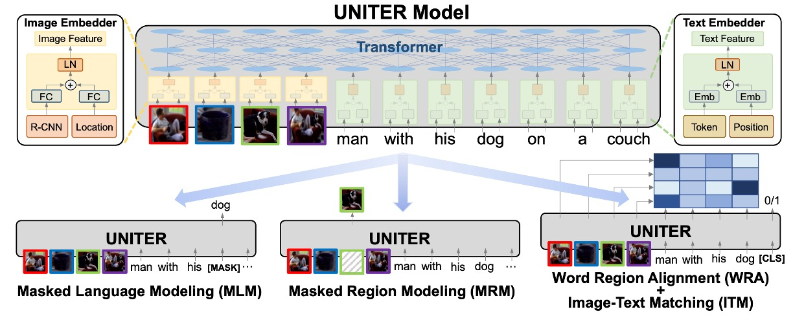
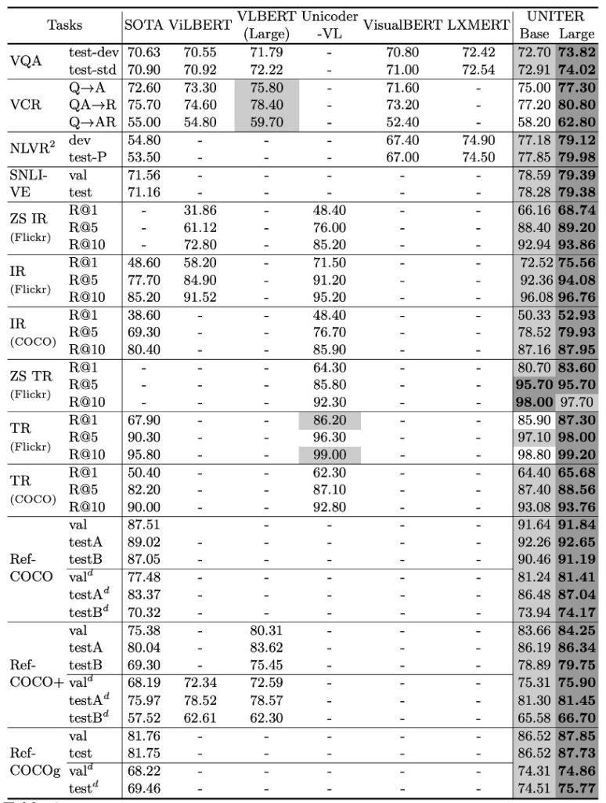

# [19.09] UNITER

## 団結者の歌

[**UNITER: UNiversal Image-TExt Representation Learning**](https://arxiv.org/abs/1909.11740)

---

これまでの論文では、「シングルストリームモデル」から「デュアルタワーモデル」、そして「ダブルストリームモデル」へと進化してきました。

要するに、跨モダリティ情報をまとめて計算するか、別々に計算するかです。

もし別々に計算するなら、その後の人々はそれをまとめて計算し、あなたを超えようとするでしょう。

もし一緒に計算するなら、その後の人々はそれを別々に計算し、あなたを超えようとするでしょう。

最初はただ軽く論文を読もうと思っただけなのに、人生の道理まで見つけてしまったようです。

さて、UNITER に戻りましょう。

視覚と言語（V+L）の研究分野では、画像とテキスト間の意味的ギャップを解決するために、共同のマルチモーダルエンコーディングが広く使われています。しかし、これらのマルチモーダルエンコーディングの手法と表現は、通常、特定のタスクに特化して作られています。つまり、特定の V+L タスクに特化した方法を設計する場合、その方法は他の関連タスクに適応するのが難しいことがあります。この現象はマルチモーダル研究でよく見られ、全体的な研究コミュニティが汎用的な解決策を見つけるのに苦労しています。

以前の研究、例えば MCB、BAN、DFAF、SCAN、MAttNet などは、それぞれの領域で優れた方法を提案しました。しかし、これらのモデルのアーキテクチャは多種多様で、学習された表現が高度にタスク特化しているため、広範な V+L タスクにおける応用には制限があります。

## 問題の定義

著者は、現在の研究が特定のタスクにおいて成功を収めている一方で、マルチモーダルな汎用的な表現学習、効果的なマスキング戦略、そして最適化された整合技術において多くの問題と課題が残っていると考えています：

1. **特定タスクのマルチモーダルエンコーディング**：既存の視覚と言語のマルチモーダルエンコーディング手法は通常、特定のタスク向けに設計されています。この特化性は、他の V+L タスクへのモデルの汎用性を制限します。

2. **モデルアーキテクチャと表現の多様性**：以前の研究（MCB、BAN など）は、特定の領域で独自のアーキテクチャと表現方法を持っています。しかし、これらのアーキテクチャと表現の多様性により、広範な V+L タスクに適応するのは難しくなっています。

3. **NLP の成功戦略の直接的な適用**：Transformer や BERT は NLP の分野で大きな成功を収めましたが、これらの戦略を V+L 分野に直接適用するのは最適な解決策ではないかもしれません。V+L タスクでの成功を確保するためには、特定の戦略と事前学習タスクが必要です。

4. **マスキング戦略の限界**：現在のマルチモーダル事前学習方法には、マスキング戦略に関する課題があります。異なるマスキング戦略は、モデルが学習する表現に影響を与え、さらにその下流タスクでの性能にも影響を与える可能性があります。

5. **意味的整合技術の課題**：画像と言語間の意味的整合を確保することは、マルチモーダル研究における核心的な課題です。以前の研究でいくつかの方法が提案されましたが、微細な整合性を達成することには依然として難しさがあります。

ここで著者は、次の核心的な疑問を提起します：

- **全ての V+L タスクに対して、本当に汎用的な画像と言語の表現を学習することはできるのでしょうか？**

## 解決のためのアプローチ

### UNITER モデル設計

UNITER モデルは、視覚と言語のタスク向けに設計された解決策として、画像と言語間の意味的ギャップを効果的に埋めることを目指しています。以下は、このモデルの主要な設計要素とコンセプトに対する深い洞察です。

1. **モデルアーキテクチャ**

   - UNITER の基本的な構造は、画像エンコーダ、テキストエンコーダ、そして多層の Transformer から成り立っています。これにより、モデルは画像とテキストから複雑な特徴をそれぞれ抽出し、その後、Transformer を通じて深い相互作用と統合を行います。

2. **エンコーディング戦略**

   - 画像に関して、UNITER は Faster R-CNN を使用して視覚的特徴を抽出し、7 次元のベクトルを使って各領域の位置的特徴をエンコードします。これらの特徴は全結合層を通じて統合され、位置情報と視覚情報が共に考慮されます。
   - テキストに関しては、UNITER は BERT の戦略に従い、WordPieces によってトークン化し、その後、各トークンに対してエンコーディングを行います。これにより、語彙の意味と文脈情報が効果的にエンコードされます。

3. **自己注意機構**

   - UNITER の Transformer は自己注意機構を使用して文脈的なエンコーディングの学習を行い、これにより異なるモダリティ間で深い関連を構築することができます。明確にエンコードされたトークンと領域の位置情報を通じて、モデルはより詳細な文脈情報を捕えることができます。

4. **事前学習タスク**

   - UNITER の大きな特徴の一つは、多様な事前学習タスクを取り入れていることです。これには、画像に基づいたマスク言語モデリング、テキストに基づいたマスク領域モデリング、画像-テキストの一致、単語領域の整合性などが含まれます。これらのタスクは、モデルのマルチモーダル学習能力を強化することを目指しています。

5. **条件付きマスキング戦略**

   - 他の事前学習手法と異なり、UNITER はマスキング戦略として一つのモダリティのみをマスクし、もう一方はそのままにしておくことを選択しています。この戦略は、学習過程で潜在的なモダリティの不一致を防ぎ、モデルが画像と言語をより正確に対応させることを確保します。

6. **単語領域整合戦略**

   - 最適輸送に基づいた単語領域整合の事前学習タスクを導入することにより、UNITER は単語と画像領域間の精緻な整合を積極的に促進しようとしています。この戦略は、モデルがクロスモーダルな意味的整合を効果的に最適化できるようにします。

### 事前学習戦略

UNITER モデルの事前学習戦略は、その成功の核心であり、クロスモーダル学習の独特な課題を解決するように設計されています。これらの戦略は、モデルの能力を最適化し、画像とテキスト間の相互関係を深く理解し統合できるようにします。

それでは、これらの事前学習戦略を一つ一つ見ていきましょう：

- **マスク付き言語モデル (MLM)**

  マスク付き言語モデル（MLM）は、深層学習モデルの事前学習戦略の一つで、モデルの言語理解とクロスモーダル学習能力を強化することを目的としています。MLM の仕組みは、入力されたテキストの中からランダムにいくつかの単語をマスク（通常 15％の単語）し、コンテキストと関連する補助情報（例えば画像）を用いて、そのマスクされた単語を予測するというものです。

  例えば、「小犬が[MASK]で遊んでいる」という文と、緑の草地で小犬が楽しそうに遊んでいる画像が一緒に与えられた場合、モデルは画像から視覚的な情報（小犬が草地で遊んでいるシーン）を利用して、[MASK]の位置に適切な単語（「草地」）を予測する必要があります。

  この方法は単なる空白を埋めるゲームではありません。背後にある考え方は、モデルがテキストのコンテキストを理解するだけでなく、画像の視覚的内容とそのテキストとの関連性も理解することを強制することです。モデルがこの予測タスクを最適化するように訓練されることで、テキストと画像の深く細緻な理解が学習されます。

- **画像とテキストの一致 (ITM)**

  画像とテキストの一致（ITM）は、モデルがテキストの記述と画像のマッチングを評価するための戦略です。このタスクは、単に一致する項目を見つけることにとどまらず、テキストと画像間の深い意味的な関連性を評価することに関わっています。

  このタスクを実行するために、モデルは入力内で[CLS]という特殊なトークンを使用します。このトークンの目的は、画像とテキストの融合された表現を生成させることです。この融合された表現を用いて、モデルは画像とテキストが一致しているかどうかを判断します。

  例えば、「夕日の海岸」という記述と、夕日が海岸に沈んでいる画像が与えられた場合、これらが入力されると、モデルは[CLS]トークンを使って融合された表現を生成します。その後、この表現は全結合層（FC 層）とシグモイド関数を通じて、0 から 1 の間のスコアを生成し、このスコアでテキストと画像がどれだけ一致しているかを示します。

  訓練中は、正しい一致を持つ画像とテキストのペアだけでなく、「負のペア」も使用されます。これは、正しい一致を持たない画像とテキストの組み合わせで、例えば「夕日の海岸」の記述が山の画像とペアになることです。このような負のペアは、他のサンプルからランダムに画像やテキストを選んで作成されます。

  モデルの目標は、正しいペアと負のペアの予測誤差を最小化することです。通常、これは二項交差エントロピー損失を使用して達成されます。

- **単語と領域の整合 (WRA)**

  単語と領域の整合（WRA）は、最適輸送法（Optimal Transport、OT）を使用して、テキスト（単語やフレーズ）と画像領域間の関連性を最適化する高度な戦略です。この戦略の主な目的は、モデルがテキスト記述と対応する画像の部分を正確に一致させることです。

  例えば、「赤いリンゴ」という記述と、複数の色のリンゴが映っている画像が与えられた場合、WRA は、「赤いリンゴ」の記述を画像内の赤いリンゴの部分に正確に対応させることを目指します。

  OT は、次の特性を持つ強力な数学的フレームワークを提供します：

  - **正規化**：すべての移動値の合計が 1 になるため、データ間の整合性が正規化されます。
  - **疎性**：OT は、最も関連性の高いマッチングに主眼を置き、より精度高く解釈可能な整合を提供します。
  - **効率性**：従来の最適輸送法が複雑な計算を必要とする場合でも、効果的に解決策を見つける方法があり、大規模な事前学習モデルに特に有用です。

  OT は、2 つの分布間の距離を評価し、「輸送計画」を最適化して、1 つの分布から別の分布に移行する方法を記述します。本論文の状況では、これらの分布はテキストと画像です。この輸送計画が得られると、それは損失関数として使用され、モデルパラメータの更新に役立ち、テキストと画像の整合を改善します。

- **マスク付き領域モデリング (MRM)**

  マスク付き領域モデリング（MRM）は、UNITER モデルで重要な戦略で、特に画像領域の視覚的特徴に焦点を当てています。MLM と同様に、この戦略は画像領域の特徴を 15％の確率でランダムにマスクします。例えば、空を飛んでいる複数の鳥が描かれた画像において、MRM はランダムに何羽かの鳥の特徴をマスクし、残りの視覚情報と関連するテキストを用いて、これらのマスクされた鳥の特徴を再構築または予測するタスクです。

  この戦略には 3 つの主なバリエーションがあります：

  - **マスクされた領域特徴回帰 (MRFR)**

    これは最も直感的な戦略で、マスクされた視覚特徴を再構築することが目的です。

  - **マスクされた領域分類 (MRC)**

    より抽象的な戦略で、マスクされた領域がどのカテゴリや特徴を持つかを予測します。

  - **KL ダイバージェンスを使用したマスク領域分類 (MRC-kl)**

    MRC の進化版で、硬いラベルや最も可能性の高い答えに完全に依存せず、複数の可能性を考慮します。物体検出器の出力をソフトラベルとして使用し、物体カテゴリの可能性を示します。

### 事前学習データセット

本論文では、著者は四大有名な V+L データセットを元に、精緻に設計された事前学習データセットを使用しています：

- COCO
- Visual Genome (VG)
- Conceptual Captions (CC)
- SBU Captions

これらのデータセットの組み合わせは、モデルが事前学習段階で多様で豊かなデータに触れ、その後のタスクでの性能向上を目指しています。しかし、これらのデータセットは単に均等に使用されるわけではなく、それぞれのデータセットが事前学習に与える影響を考慮して、分類と戦略が取られています。

## 討論

### 事前学習タスクのパフォーマンス

著者が提案したマルチモーダル事前学習戦略の効果を深く掘り下げていく中で、彼らは四つの代表的な V+L ベンチマークを評価基準として選びました。それらは VQA、NLVR2、Flickr30K、RefCOCO+です。さらに、彼らは全体の指標 Meta-Sum も導入し、全てのベンチマークのスコアの合計を使用して、総合的な評価視点を提供しています。

1. **ベースライン設定**

   著者は最初に 2 つのベースラインを確立しました。最初のベースライン（L1）は事前学習を行わない設定で、2 番目のベースライン（L2）はテキストのみで事前学習された MLM の重みを使用した設定です。結果として、テキストのみでの事前学習でも Meta-Sum スコアが L1 に比べて顕著に向上したことが示されました。

2. **単一事前学習タスクの効果**

   次に、著者は単一の事前学習タスクの効果を調べました。具体的には、モデルが ITM（L4）または MLM（L5）のみで事前学習を行った場合、L1 および L2 のベースラインに対してすべてのタスクで顕著な性能向上が見られました。

3. **事前学習タスクの組み合わせ**

   著者はさらに、異なる事前学習タスクを組み合わせると、例えば MLM と ITM（L6）の場合、どちらか一方だけで使用するよりも効果的であることを発見しました。MLM、ITM、MRM を一緒に訓練した場合、モデルはすべてのベンチマークテストで安定した性能向上を見せました。

4. **細粒度の整合性**

   WRA 事前学習タスクを追加した後（L11）、VQA や RefCOCO+などの特定のタスクで性能が顕著に向上しました。これは、事前学習期間中に学習されたテキストと領域間の細粒度の整合性が、領域レベルでの識別や推論を必要とする下流タスクに非常に有益であることを強く示唆しています。

5. **条件付きマスキング戦略**

   異なるマスキング戦略を比較した結果、著者は条件付きマスキング戦略がモデルにより良い画像とテキストの共同表現を学習させるのに効果的であることを発見しました。

6. **事前学習データセットの影響**

   最後に、著者は異なる事前学習データセットの効果を調べました。結果として、ドメイン外データで事前学習を行っても、データが下流タスクに類似していれば、モデルの性能が向上することが示されました。ドメイン内とドメイン外のデータで一緒に事前学習を行った場合、さらに性能が向上しました。

著者はこの一連の実験を通じて、異なる事前学習設定の効果を詳細に分析し、マルチモーダル事前学習の深層メカニズムをよりよく理解するための貴重な洞察を提供しました。

### 下流タスクのパフォーマンス

著者は複数の下流タスクにおいて UNITER モデルのパフォーマンスを詳細にテストしました。以下はその主な発見です：

1. **全体的な性能**

   UNITER モデルは、すべての下流タスクで優れた成果を上げました。特に、UNITER-large モデルはすべてのベンチマークテストで最新技術レベルに達しました。このモデルは、いくつかのタスクでは現在の最良技術を上回る成果を達成しました。

2. **特定タスクモデルとの比較**

   MCAN、MaxEnt、B2T2 などの特定タスク向けのモデルと比較して、UNITER ベースのモデルはほとんどのタスクで優れたパフォーマンスを示しました。例えば、VCR タスクでは、UNITER モデルは現在の最良技術を約 2.8％上回りました。

3. **他の事前学習モデルとの比較**

   ViLBERT、LXMERT などの他のマルチモーダル事前学習モデルと比較して、UNITER はほとんどのタスクでより良いパフォーマンスを示しました。特に、VQA では他のすべての画像とテキストのペアに対して事前学習されたモデルを上回り、効果は 1.5％以上向上しました。

4. **シングルストリームとダブルストリームモデル**

   ViLBERT や LXMERT のような先行研究では、ダブルストリームモデルがシングルストリームモデルよりも優れていることが観察されていますが、著者はシングルストリーム UNITER モデルも事前学習設定下で最新技術レベルに達し、モデルのパラメータが少ないことを発見しました。

5. **二段階事前学習法**

   VCR のようなタスクに対して、著者は二段階の事前学習方法を提案しました。まず標準データセットで事前学習を行い、その後、下流の VCR データセットに対して事前学習を行う方法です。この戦略は、新しい下流タスクにおいて有効であることが証明されました。

6. **NLVR2 の適応性**

   NLVR2 のような特別なタスクに対して、著者はモデルの適応性を確保するために異なる設定を試しました。彼らは、双方向の注意機構が画像間の相互作用を補完し、より良い結果を生み出すことができると発見しました。

これらの結果は、UNITER モデルがマルチモーダルタスクで強力な能力を発揮することを再確認させます。最先端の事前学習戦略を組み合わせることで、モデルは複数の下流タスクで卓越したパフォーマンスを実現し、視覚と言語の融合分野でのリーダーシップを示しています。

### モデルが学んだことは？

UNITER モデルでは、著者は注意機構の可視化を通じてモデルの学習行動を深く分析しました。

この可視化は、モデルがどのようにして異なるモダリティの情報を理解し、関連付けているかを明らかにしています。以下は主な観察結果です：

- **垂直モード**

  このモードは、モデルが主に特定のトークン、例えば[CLS]や[SEP]に注目しているときに現れます。これは、モデルがその位置で全体のコンテキストや要約情報を探していることを意味します。もしこのモードが頻繁に現れる場合、モデルがこれらの特殊なトークンに過度に依存している可能性があり、それはモデルの過剰パラメータ化や訓練データの不足が原因であるかもしれません。

- **対角線モード**

  モデルがトークンや領域、その周辺に注意を向けているときにこのモードが現れます。これは、モデルが現在のコンテキスト内で局所的な情報を解析していることを示しており、予想される正常なモードです。

- **垂直+対角線モード**

  これは前述の二つのモードが融合したもので、モデルが全体の情報を解釈しながら、同時に局所的なコンテキストにも注意を払っていることを意味します。

- **ブロックモード**

  このモードでは、モデルの注意が主にその自身のモダリティ、例えばテキストや視覚に集中しており、クロスモダリティには注目していません。これは、モデルがその時点でモダリティ固有の推論を内部で行っていることを示している可能性があります。

- **異質モード**

  このモードは、モデルの注意が多様であり、モデルが現在の入力状況に応じて異なる視点から情報を理解しようとしていることを示しています。

- **逆ブロックモード**

  このモードでは、モデルの注意がクロスモダリティに向かっており、テキストと画像の関連を識別しようとしています。このモードの存在は、モデルが視覚と言語の情報を密接に結びつけていることを示しています。

## 結論

この論文を振り返ると、数年前の研究者たちが視覚と言語の融合に対する深い興味を持ち続けていたことがわかります。この研究では、UNITER という大規模な事前学習モデルが提案され、その目的は強力かつ汎用的な画像-テキスト表現を構築することでした。消失研究を通じて、著者たちは提案された四つの事前学習タスクの効果を明確に評価しました。

ドメイン内外のデータセットを使った訓練により、UNITER は当時、特に視覚と言語の多くのタスクにおいて優れたパフォーマンスを発揮しました。研究が提供した洞察は、画像と文の相互作用、より効率的な事前学習戦略など、探索に値する方向を指摘しています。

この論文は、視覚と言語の融合領域の歴史的な進展と発展をより良く理解するための振り返りの機会を提供してくれました。
