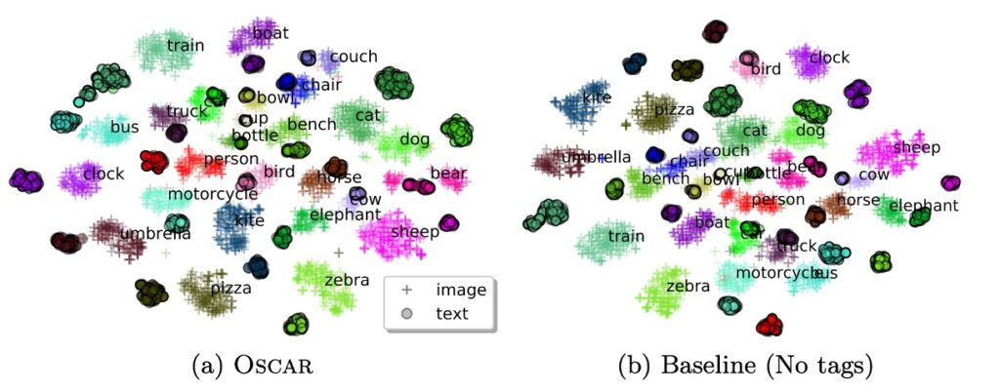
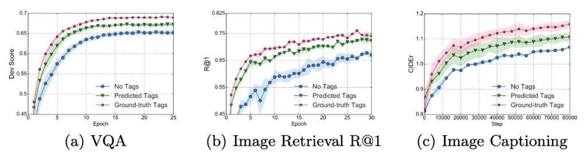

# [20.04] Oscar

## オスカーのアンカーポイント

[**Oscar: Object-Semantics Aligned Pre-training for Vision-Language Tasks**](https://arxiv.org/abs/2004.06165)

---

視覚言語(V+L)の分野では、曖昧性の問題が常に克服すべき障害となっており、特に複数の物体の画像領域が重なる場合、正確な視覚領域の特徴を抽出することが非常に困難です。簡単な例を挙げると、画像に猫と犬が同時に現れ、それらが互いに重なり合っている場合、対応する領域特徴は曖昧になり、意味的整合性においてかなりの挑戦を受けます。このような重なり合う領域で明確で意味のある表現を見つけ、それを言語と正確に整合させる方法が、Oscar が解決しようとする問題です。

Oscar の動作メカニズムは簡単に言うと、次のようになります。もし画像にリンゴとバナナが含まれ、両者が部分的に重なっている場合、通常であれば、重なった視覚領域から特徴を抽出すると、得られる情報はそれらの「混合体」になるため、後続の意味的整合に困難が生じます。

Oscar ではここに巧妙な戦略を導入しており、重なった視覚領域だけを重視するのではなく、物体ラベル、「リンゴ」や「バナナ」といったラベルを使用して、意味的整合のためのアンカーポイントとして活用します。

この構造において、各トレーニングサンプルは三項組として定義され、1 つの単語列、1 組の物体ラベル、および 1 組の画像領域特徴が含まれます。この戦略によって、物体の視覚領域特徴が曖昧な場合でも、著者は物体ラベルを使って効果的な意味的整合を行い、後続の V+L タスクに対して比較的安定した基盤を提供します。

## 問題の定義

著者は文中で視覚-言語の事前学習(V+L pre-training、または VLP)モデルに関する 2 つの主要な問題を明確に提起しています：

1. **曖昧性 (Ambiguity)**

   - 問題：2 つ以上の物体の画像領域が重なると、抽出される視覚領域特徴が曖昧になり、区別がつきにくくなる可能性があります。
   - 例：図 2(a)において、「dog」と「couch」という 2 つの物体の視覚領域が重なり、これらの視覚領域特徴が区別しづらくなります。
   - 結果として生じる問題：複雑な画像-テキスト対応タスクを処理する際に、モデルが正確なクロスモーダル整合を構築することが難しくなる可能性があります。

2. **位置付けの欠如 (Lack of Grounding)**
   - 問題記述：VLP は弱い監督学習問題であり、画像内の領域や物体とテキスト内の単語やフレーズの対応関係が明確に示されていません。
   - 背景分析：例えば「dog」と「couch」のような物体が画像と対応するテキストの両方に登場するにもかかわらず、明確な対応ラベルがないため、モデルは物体とテキスト単位間の意味的対応関係を正確に学習できない可能性があります。

## 問題の解決

### Oscar モデル設計

1. **三項組入力表現 (w, q, v)**

   Oscar モデルは、各画像-テキストペアを三項組（w, q, v）として表現します。

   - **w (単語エンコード列)**

     これはテキスト入力から得られた単語エンコード列であり、各単語やフレーズが変換されたベクトル表現です。

   - **q (物体ラベルの単語エンコード列)**

     これは画像内で認識された物体ラベルの単語エンコード列です。これらのラベルは通常、画像内の物体に関連しており、画像認識モデル（おそらく Faster R-CNN を基盤にしたもの）によって生成されます。

   - **v (領域ベクトル集合)**

     これは画像内で認識された領域の特徴ベクトル集合で、これらの特徴ベクトルはその領域の視覚的意味や位置情報を含んでいる可能性があります。

   :::tip
   ここで一時停止します。

   続きを見る前に、w、q、v の 3 つの入力表現の概念を覚えておいてください。論文の後半では wqv の組み合わせに関する研究が多く登場します。
   :::

2. **物体ラベルを整合のアンカーポイントとして使用**

   Oscar は物体ラベル q をアンカーポイントとして利用し、画像とテキスト間の整合学習を簡素化します。画像内の重要な物体は通常、それに対応するテキストの記述にも登場するため、q を使用することで、画像とテキストの間の関連性を強化し、モデルの理解と学習を進めます。学習過程で、モデルは視覚空間でおそらく曖昧に表現された画像物体を、言語空間で明確で独特な実体表現に整合させ、視覚と言語のモダリティ間での整合学習を強化します。

3. **意味空間の共有と注意機構**

   BERT モデルを利用することで、モデルはテキスト内での q と w の整合を容易に識別できます。この基盤の上で、モデルはテキストの意味に関連する画像領域により多くの注意を割り当てることができます。q の意味に関連する単語を使って検索すると、モデルはこれらの特定の画像領域に高い注意重みを割り当てます。

4. **v と q の生成**

   K 個の物体領域を含む画像が与えられた場合、Oscar モデルは Faster R-CNN を使用して各領域から視覚的意味を抽出し、それを(v’, z)として表現します。ここで v’は P 次元のベクトル（領域特徴）、z は領域位置の R 次元ベクトルです。

   - v は v’と z を結合して位置に敏感な領域特徴ベクトルを形成し、線形投影を通じてさらに変換され、単語エンコードと同じ次元のベクトルになります。
   - 同時に、物体ラベルの単語エンコード列 q も、同じ Faster R-CNN を使用して画像から得られます。

### 事前学習目標

Oscar モデルの入力は、2 つの異なる視点から見ることができます。ここでは、x はテキストと画像の表現を区別するモダリティの視点であり、x'は辞書の視点で、異なる意味空間を区別するために使用されます。

1. **辞書視点：マスクトークン損失(Masked Token Loss)**

   異なる辞書を使用して、異なるサブシーケンスの意味空間を定義します。簡単に言うと、物体ラベルと単語トークンは同じ言語意味空間を共有しており、画像領域の特徴は視覚的意味空間にあります。事前学習の過程で、著者は「マスクトークン損失」（Masked Token Loss、略して MTL）を使用しています。

   各トレーニングイテレーションで、シーケンス内の約 15％の入力トークン（つまり、[MASK]トークンに置き換えられる）をランダムにマスクします。トレーニングの目標は、周囲のトークンとすべての画像特徴に基づいて、これらのマスクされたトークンを予測することです。

   このプロセスは、BERT で使用されるマスクされた言語モデルと非常に似ています。なぜなら、周囲の文脈からマスクされた単語やラベルを回復しなければならないからです。同時に、追加の画像情報を使用して、学習した単語エンコードが視覚的な文脈の中で位置を見つけるのを助けます。

   :::tip
   例えば、次の文を考えましょう：「これはかわいい犬です」と、犬の画像があります。

   事前学習中に、「犬」という単語がマスクされる可能性があり、文は「これはかわいい [MASK]」になります。
   :::

   モデルの仕事は、他のマスクされていない単語と犬の画像を文脈として使い、この[MASK]の正しい内容、つまり「犬」を予測することです。このプロセスで、画像情報はモデルがマスクされた単語をより正確に予測できるように支援します。なぜなら、視覚情報は追加の文脈情報を提供するからです。

2. **モダリティ視点：対比損失(Contrastive Loss)**

   各入力の三項組を表現するために、著者は[ h', [q, v] ]を画像モダリティとして処理し、( w )を言語モダリティとして処理します。

   ここで面白い実験プロセスがあります：著者は 50％の確率で、データセットからランダムに抽出された異なるラベルシーケンスを使用して(q)を置き換え、「汚染」された画像表現を作成します。次に、特殊な[CLS]トークンでのエンコーダー出力は（( h', w )）の融合した視覚-言語表現であり、その上にバイナリ分類器として全結合層を使用して、このペアが元の画像表現（つまり、( y = 1 )）を含んでいるか、あるいは「汚染」された表現（つまり、( y = 0 )）を含んでいるかを予測します。

   :::tip
   上記の説明が理解しづらい場合、このプロセスをゲームとして想像してみてください：

   あなたの友達があなたに画像といくつかのテキスト説明を渡します。

   しかし、罠があります：テキスト説明は正しくない可能性があります（例えば、「赤いリンゴ」を示す画像が「青いバックパック」と説明されている場合）。あなたの任務は、これらの説明が本当に正しいかどうかを判別することです。Oscar の状況では、モデルも同じようなゲームを行っており、数学と機械学習の技術を使って、与えられたテキスト説明が画像と本当に一致するかどうかを見分けています。
   :::

   クロスモーダルな事前学習の過程全体で、著者は物体ラベルを画像の代理として使用し、BERT の単語エンコード空間を調整します。モデルが学習する単語表現が対応する画像（または画像内で検出された物体ラベル）と似ており、「汚染された」表現と対比されることを期待しています。

## 討論

### パラメータ効率の比較

著者はまず、Oscar の視覚+言語（V+L）タスクにおける性能と効率について議論し、Oscar と 3 種類の異なる既存の SoTA モデルとの性能とパラメータ効率を比較しました。Oscar は、他の大規模なモデルに比べて、多くのタスクで優れたパラメータ効率と性能を示しました。

### モデル性能の比較

1. **Oscar モデルの総合的な性能**

   - Oscar は、ほとんどの V+L（視覚+言語）タスクで強力な性能を発揮しました。
   - 7 つのタスクで、Oscar はすべての既存の VLP（視覚言語事前学習）方法を上回りました。
   - この 7 つのタスクのうち、6 つのタスクで新たな最良状態（SoTA）を達成しました。

2. **他のモデルとの比較**

   - 神経状態機械（NSM）と比較して、Oscar は GQA タスクで若干の不足が見られるかもしれませんが、NSM の構造的先験知を組み合わせることで強化できます。
   - 複数タスクモデルである 12-in-1 と比較して、OscarB はほとんどのタスクで優れた性能を示し、NLVR2 の Test-P でのみ結果が劣りました。

3. **方法と訓練戦略**

   - キャプションタスクでは、自己批判的なシーケンストレーニング（SCST）を使用して Oscar をさらに微調整し、シーケンスレベルの学習を改善する能力を示しました。
   - 表 2 (e)部分では、Oscar が BLEU@4 および CIDEr 指標において他の方法と比較して 2 点以上および 10 点以上の改善を示したことが示されています。

4. **一般化能力の展示**
   - NoCaps の実験では、モデルが COCO キャプションのトレーニングセットのみを使用することが求められ、Oscar はこの規定に従い、限られたトレーニングデータで強力なパフォーマンスと一般化能力を発揮しました。
   - 表 2 (f)部分では、Oscar の変種と先行する SoTA 手法 UpDown の比較が示され、近域および域外の異なる状況での Oscar の優位性が強調されています。

Oscar は物体ラベルをアンカーポイントとして使用することで、画像とテキスト間の意味的整合学習を大幅に簡素化し、これがその高効率と強力な性能の鍵となっています。特定のタスクやシナリオでは、Oscar の方法とモデル構造を他の既存の強力な技術や先験知識と組み合わせることで、さらに性能を向上させることができます。

Oscar はほとんどのタスクで強力な性能を発揮していますが、特定のタスクや指標においては最適化の余地があるか、限界がある可能性があります。例えば、NLVR2 の Test-P におけるパフォーマンスです。

### 定性研究

本研究では、t-SNE 技術を使用して COCO テストセットにおける画像とテキストのペアリングの学習された意味的特徴空間を 2D マップ上で視覚化しました。分析を通じて、著者は以下の点を提案しています：

1. **クラス内一貫性**

   - 物体ラベルを使用することで、視覚とテキストの表現間で同じ物体の距離が大幅に縮小されました。
   - Oscar モデルでは、特定の物体（例えば「人」や「シマウマ」）の視覚とテキストの表現が、ベースライン方法に比べてより近くなっています。

2. **クラス間差異性**

   - ラベルを追加すると、意味的に関連する物体クラスがさらに近づきますが、それでも区別は可能です。
   - ベースライン方法では、クラス（例えば、動物、家具、交通機関）の混合が見られますが、ラベルを追加することでこれらのクラス（例えば「人」、「シマウマ」、「羊」、「鳥」、「椅子」、「ソファ」、「ベンチ」、「バス」、「電車」、「トラック」、「バイク」、「車」）をより精確に区別できるようになります。

3. **物体ラベルの重要性**
   - 物体ラベルは、意味的整合学習において非常に重要な役割を果たしており、クロスモーダル特徴学習のリンクおよび正則化として機能しています。

### アブレーション研究

上記の図からいくつかの重要な点が観察できます：

- 物体ラベルを微調整に使用した学習曲線は、ラベルを使用しない VLP 方法よりもすべてのタスクで速く、より良く収束します。
- VQA（視覚質問応答）および画像検索タスクでは、ラベルを使用して訓練することで、ベースライン方法の半分のトレーニング時間で最終的な性能に到達します。

これらの発見は、Oscar が物体ラベルを活用してこれらの視覚タスクで優れた効率的な性能を示し、ラベルを使用した訓練が短時間で無ラベルの方法を超える性能を達成できることを示しています。

- 物体ラベルを使用することで、モデルの性能が向上したことが示されました。これは、完全な注意と部分的な注意（w-v）のモデルを比較することによって得られた結論であり、物体ラベルを追加することがモデルに有益であることを示しています。
- 領域特徴は、画像表現において物体ラベルよりも多くの情報を提供し、w-v（物体領域とテキスト間の関係）および v-q（物体ラベルと質問間の関係）の比較において示されています。

Oscar モデルは、物体ラベルを活用することで、複数の下流タスクにおける性能を大幅に向上させ、物体ラベルを使用した訓練は、より短い訓練時間で無ラベルのベースライン性能を達成または超えることができます。物体ラベルと領域特徴は、モデルの注意機構における相互作用において重要な役割を果たし、事前学習段階で異なる物体ラベルセットを使用することがモデル性能に影響を与えることが示されています。

## 結論

実際、これは知識グラフを導入する手法の一つでもあります。

ラベルも人間が与えたものです。モデルにラベルを与えることは、明確な指針を与えることになりますが、この指針は本当に正しいのでしょうか？この指針は本当に十分なのでしょうか？もしかしたら、モデルの発揮を制限してしまう可能性はないでしょうか？

Oscar モデルは、物体ラベルをアンカーポイントとして使用することで、物体ラベルの正確さと品質に依存しています。物体ラベルが十分に正確または多様でない場合、モデルは誤った、または過度に狭い特徴を学習してしまい、その結果、事前学習の効果や下流タスクのパフォーマンスに影響を与える可能性があります。結局のところ、人間の言語には無限の可能性がありますが、ラベルの内容は限られています。限られた概念を使って無限に広げることは非常に困難な挑戦です。

とはいえ、Oscar は多モーダル事前学習モデルの研究領域を豊かにし、視覚と言語を統合するための新たな有効な道を示しました。精巧に設計された事前学習戦略と実験検証を通じて、この研究は今後の研究者たちがさらに革新的なアイデアや応用を探求し、視覚と言語統合技術の発展を推進する基盤を提供することでしょう。
