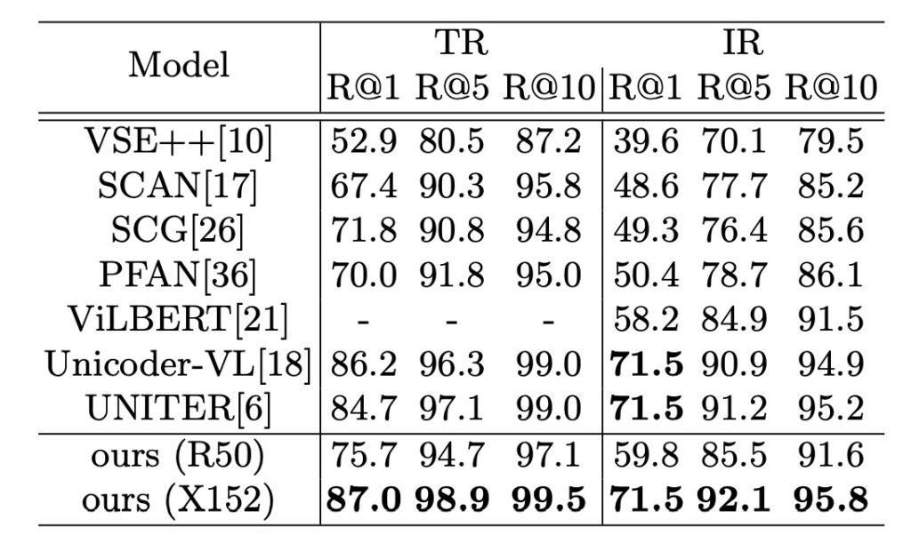

## ピクセルの言語

[**Pixel-BERT: Aligning Image Pixels with Text by Deep Multi-Modal Transformers**](https://arxiv.org/abs/2004.00849)

---

これまで、視覚と言語モデルの統合について話す際、多くの研究者は以下の標準的なプロセスを採用してきました：

1. まず、Faster R-CNN のような物体検出モデルを使用して画像から領域特徴を抽出します。
2. 次に、言語モデルを組み合わせてクロスモーダル学習を行います。
3. 最後に、クロスモーダル学習の設計方法について探求を始めます。

では……

なぜ「物体検出モデル」を画像のエンコードプロセスの最初に組み込むことが決まっているのでしょうか？

おそらく、誰も決めたわけではなく、知らず知らずのうちに皆がそうしてきたのです。

もしあなたが研究者であれば、理解できるでしょう：研究論文を発表する比較的簡単な方法の一つは、先人の足跡に従って改良を加え、パフォーマンスを 1 ～ 3％向上させることができれば、それが優れた論文となるのです。

このような状況は、革新的な方法が提案されたり、評価データセットの効果が飽和したりするまでは続き、その後、次の進化が始まります。

おそらく数年後、新しい世代の研究者たちはこう疑問を抱くでしょう：なぜ「昔」の人々はあんなに Transformer を使うことが好きだったのでしょうか？

本論文の著者は、物体検出モデルの設計が最初から誤っていた可能性があると考えています。

物体検出モデルは通常、特定の視覚タスクに合わせて設計されるため、特に物体検出モデルの視覚表現能力が特定のタスクのカテゴリに制限されている場合、言語理解と一致しないバイアスを引き起こす可能性があります。

Pixel-BERT は新たな視点を提供します。従来の事前学習された物体検出モデルに依存するのではなく、画像のピクセルから直接視覚的なエンコードを学習します。これにより、モデルは「ピクセルレベル」で視覚情報を直接捉えることができ、形状、テクスチャ、空間的関係など、物体検出モデルでは失われる可能性のある情報を保持します。そして、言語エンコード部分と組み合わせることで、このモデルは視覚と言語の微妙な相互作用を効果的に捉え、より豊かで詳細なクロスモーダル表現を学習することができます。

## 定義問題

著者は本論文で以下の問題を観察し、定義しました：

1. **クロスモーダル意味ギャップ**

   現在のクロスモーダル学習（特に視覚と語彙間）は、視覚と言語の間の意味ギャップという課題に直面しています。

2. **視覚特徴の限界**

   従来の手法は、物体検出モデルから抽出された特徴など、領域ベースの視覚特徴を使用する傾向があります。しかし、これらの領域ベースの特徴抽出器は、特定の視覚タスクのために設計されているため、言語理解との間に情報ギャップが生じます。例えば、物体の形状、重なり合う物体間の空間的関係、物体の状態などの重要な視覚情報が失われる可能性があります。

3. **既存の視覚特徴の限界**

   現在使用されている領域ベースの視覚特徴は、視覚的意味の表現において限界があります。例えば、物体検出モデルは、シーンや感情など、より広範な視覚的意味情報を捉えることができない場合があります。

## 問題解決

### Pixel-BERT モデル設計

初期の視覚と言語の統合モデルでは、物体検出モデル（例えば、Faster R-CNN）を使用して画像から領域特徴を抽出することが一般的でした。これにより、モデルは画像内の特定の物体や主体を検索し、各物体の位置にバウンディングボックスを描画し、そのボックス内のピクセル値を特徴量として使用し、さらにモデル学習に利用します。

しかし、この方法には限界があります：

- **情報の損失**：バウンディングボックスには、無関係な背景が含まれることがあり、重要な物体の部分が無視される可能性があるため、情報が損なわれます。
- **特定タスクの制限**：これらの物体検出モデルは特定の視覚タスクのために設計されており、他のクロスモーダルタスクには適さない可能性があります。

### ピクセル特徴のエンコード

上述の制限を克服するために、Pixel-BERT は異なるアプローチを採用しています。物体のバウンディングボックスに依存するのではなく、直接ピクセル自体から視覚的エンコードを学習します。

1. **ピクセル学習**：ResNet のような CNN を使用して、画像全体から直接学習します。これにより、モデルは画像内の各ピクセルを考慮し、バウンディングボックスで囲まれた部分だけでなく、全体のピクセルを利用します。
2. **特徴抽出**：
   - **Image 入力**：入力された画像はまずモデルに送られます。
   - **CNN Backbone**：これは、入力画像から視覚的特徴を抽出するための事前学習済みのニューラルネットワークです。
   - **Convolution (Conv)**：畳み込み層を通じて特徴をさらに処理します。
   - **Pooling**：このステップでは、特徴マップをダウンサンプリングし、通常は空間的サイズを減少させます。
   - **Random Sample**：これらの特徴からいくつかの特徴点をランダムに選択し、計算効率とランダム性を維持します。
3. **意味エンコード**：各ピクセル特徴には、意味エンコードベクトル sv が追加されます。これは、視覚的エンコードと語彙的エンコードの違いを区別するための特別なベクトルです。すべてのピクセル特徴がこの同じ sv を共有しているため、これは CNN のバックボーンに加えられるバイアス項として捉えることができます。（上図の Semantic Embedding 部分）

### 句子特徴のエンコード

モデルは BERT のアプローチを使用して、文の言語情報をエンコードします。

1. **文の分割**

   まず、文が入力として与えられ、単語のシーケンスに分割されます。これは自然言語処理における標準的なステップであり、文を構成する語彙要素に分割します。

2. **単語トークン化**

   各単語は、BERT で一般的に使用されるトークン化方法である WordPiece モデルを使ってトークン化されます。このトークン化方法は、単語をより小さな認識可能な断片やサブワードに分解でき、特に稀な単語やコーパスに現れない単語の処理に有用です。

3. **エンコード行列変換**

   次に、各トークン（またはサブワード）はベクトルにエンコードされます。これはエンコード行列を通じて行われ、各ユニークなトークンやサブワードを固定次元のベクトル空間にマッピングします。

4. **位置エンコード**

   語彙エンコードに加えて、位置情報も非常に重要です。特に Transformer のようなモデルにおいては、位置エンコードが各トークンの位置情報をエンコードするために追加されます。BERT と同様に、Pixel-BERT も位置エンコードを追加しています。

5. **組み合わせたエンコード特徴**

   このステップでは、語彙エンコードと位置エンコードが組み合わされます。論文では、LayerNorm(wi + pi + sw)という式が使用されています。ここで、wi は語彙エンコード、pi は位置エンコード、sw は意味エンコードベクトルです。しかし、実装ではこの sw 項は省略されていることが言及されています。

6. **最終的な言語表現：**

   組み合わせたエンコード特徴 [w^1, w^2, ..., w^n] は文の最終的な言語表現となり、後続のモデル部分で使用されます。

### クロスモーダル学習

モデルは Transformer を使用して、特に画像ピクセルと言語トークン間のクロスモーダルアテンションを学習します。すべてのエンコードされた特徴は一緒に組み合わされ、長い入力シーケンスを形成し、[CLS]や[SEP]のような特殊なトークンがその構造を識別します。この設計により、モデルはエンドツーエンドで学習でき、視覚と言語の間のギャップを効果的に解消できます。

### 事前学習方法

著者は、視覚と言語に関連するタスクのために一般的な視覚と文の表現を学習するために、大規模な統合データセットで事前学習を行う自己監督法を採用しました。

- **マスク言語モデル (MLM)**

  マスク言語モデリングのプロセスでは、入力トークンの約 15%がランダムに選ばれ、マスクされます。マスクの意図は、特定のトークンの元の値を隠すことで、モデルがそれを直接見ることができないようにすることです。その後、モデルの仕事はこれらのマスクされたトークンの元の値を復元しようとすることです。復元する際には、他の非マスクされた言語トークンや提供された視覚トークンに依存します。

  従来の BERT モデルは単一モーダルであり、言語トークンの中でマスク予測を行いますが、Pixel-BERT はそのクロスモーダル性により、言語モーダルだけでなく、視覚トークンを利用して予測を行うことができます。これにより、Pixel-BERT は、単に言語コンテキストからは説明が難しい、または曖昧な状況を扱う際に、より強力な予測能力を発揮します。例えば、言語の中のマスクされたトークンが画像の特定の物体やシーンに関連している場合、視覚トークンが重要なコンテキスト情報を提供し、モデルが正しい予測をする手助けになります。

- **画像とテキストのマッチング (ITM)**

  画像とテキストのマッチング（ITM）は、モデルが画像とそれに対応するテキスト記述の間の深い意味的関連を理解する能力を評価するために設計された複雑な戦略です。これは単に直接的なマッチングを探すのではなく、両者間の微細な接続を確認することが重要です。

  Pixel-BERT モデルでは、このタスクに[CLS]トークンが使用され、画像とテキストの融合の代表点として機能します。このトークンを通じて、モデルはテキストと画像の統合された意味を反映した融合表現を生成します。例えば、「春の桜の木の下」というテキストの記述と、桜の花が満開の公園の画像が与えられた場合、[CLS]トークンを通じてモデルは関連性の高い融合表現を生成します。この表現は、全結合層とシグモイド関数を通じて変換され、最終的には 1 に近いスコアを生成し、画像とテキストが高度にマッチしていることを示します。

  しかし、モデルの識別能力を向上させるために、訓練中には「ネガティブペア」も導入され、これは画像とテキストが関連しないペアです。例えば、「春の桜の木の下」というテキストの記述と、砂漠の風景を示す画像がペアにされることがあります。この設計は、モデルが画像とテキストが一致しない場合を学習するためです。正のペアと負のペアの訓練組み合わせを通じて、モデルは実際のアプリケーションでの画像とテキストの一致度をより正確に評価できるようになります。

- **ピクセルランダムサンプリング (Pixel Random Sampling)**

  これは Pixel-BERT で採用された独自の戦略であり、主に特徴学習時のモデルの堅牢性を高め、モデルが各ピクセルに過度に依存することを防ぎ、過学習のリスクを減らすことを目的としています。

  モデルの訓練過程では、ピクセル特徴が抽出されるたびに、すべてのピクセル特徴を直接使用するのではなく、ランダムサンプリングを行い、ピクセルの一部をモデルの入力として選択します。これにより、各イテレーションでモデルがわずかに異なる画像入力を見ることになります。

  これにはいくつかの利点があります：

  - **堅牢性の強化**：ランダムサンプリングを通じて、モデルは部分的なデータから重要な視覚情報を抽出することを学び、いくつかのピクセルが失われたり遮蔽されたりしても、良好な性能を維持できます。
  - **効率の向上**：モデルに入力されるピクセルの数を減らすことで、モデルが処理するデータ量が減少し、計算コストを低減し、訓練過程全体の速度を加速できます。
  - **過学習の防止**：モデルの入力が頻繁に変更されるため、特定の入力パターンを記憶することがなくなり、一般化能力が向上します。

  注意すべき点は、このピクセルランダムサンプリングの方法は主に事前学習段階で使用されるということです。微調整段階では、モデルが特定のタスクに最適化されることを目的としており、この段階では完全な画像データを使用して最良の性能を確保する必要があります。したがって、微調整時にはピクセルランダムサンプリングは使用されず、訓練およびテスト段階でモデルの入力が一貫していることが保証され、すべての利用可能なピクセル情報を最大限に活用します。

## 討論

### VQA の表現

- ResNet-50 を視覚的バックボーンとして使用した Pixel-BERT は、VQA のテスト分割で 71.35 のスコアを達成しました。この結果は、ResNet-101 や ResNeXt を使用した ViLBERT や VisualBERT よりも優れています。
- ResNeXt-152 をバックボーンとして使用した場合、Pixel-BERT はテストで 74.45 のスコアを達成し、test-std 分割で 74.55 に到達しました。これらのスコアは他の先進的な方法を上回っています。
- Pixel-BERT の結果は、24 層 Transformer を使用した UNITER (Large) モデルを超えており、VQA の test-std 分割で 73.40 のスコアを得ています。

Pixel-BERT の顕著な進歩は、画像のピクセルレベルで視覚と言語のアテンションを学習することが非常に有益であることを証明しています。これは、視覚エンコーダーの表現を強化するだけでなく、その後の視覚と言語エンコーディング学習を強化するのにも役立ちます。

### NLVR2 の表現

実世界の視覚推論自然言語（NLVR2）タスクでは、言語記述が提供された画像ペアと一致するかどうかを予測することを目的としています。Pixel-BERT は、2 つの画像と言語ペアを入力として、[CLS] トークンから 2 つのエンコードベクトルを取得します。これらのベクトルは連結され、交差エントロピー損失を通じて「真」または「偽」の分類器を学習します。

Pixel-BERT は、NLVR2 の開発分割で 76.5 の精度を達成し、test-P 分割で 77.2 の精度を達成しました。結果から、Pixel-BERT の 2 つの画像と言語ペアを組み合わせる方法は、LXMERT や UNITER の「Pair」設定などの他のモデルよりも優れていることが分かります。

Pixel-BERT の効果は、VQA タスクで優れたパフォーマンスを示すだけでなく、2 つの画像と言語記述の関連性を評価する必要がある NLVR2 タスクでも優れた結果を示していることを証明しています。これらの結果は、Pixel-BERT がさまざまな入力形式に柔軟に適応し、処理できることを示しています。

### 画像-テキスト検索

- Pixel-BERT は主に Unicoder-VL と UNITER と比較され、どちらも 12 層の Transformer を言語モジュールとして使用しています。
- 画像からテキストへの検索で、Pixel-BERT は MS-COCO 1K テストセットで recall@1 を 0.6 向上させ、MS-COCO 5K テストセットでは 0.3 向上しました。
- テキストから画像への検索では、Unicoder-VL と UNITER と比較して、Pixel-BERT は MS-COCO 1K テストセットで少なくとも 1.9 向上し、MS-COCO 5K テストセットでは少なくとも 1.7 向上しました。

Pixel-BERT は画像テキスト検索タスクで優れたパフォーマンスを示しました。その特別な設計戦略により、特にテキストから画像の検索において、他の最先端のモデルと比較して顕著なパフォーマンス向上を実現しています。これらの結果は、Pixel-BERT が視覚言語タスクでのパフォーマンスと可能性を証明しています。

### モデルの重要な設計は何か？

著者は、Pixel-BERT の有効性と卓越したパフォーマンスの一因として、いくつかの重要な設計を分析しました：

1. **事前学習タスクの選択**

   アブレーション実験により、MLM と ITM が事前学習で重要であることが明確に示されています。これらのタスクは、下流タスクに顕著なパフォーマンス向上をもたらし、特に NLVR2 タスクは MLM に依存しています。

2. **異なる事前学習タスクの組み合わせ**

   MLM と ITM を組み合わせることで、これらの共同効果がモデルのパフォーマンスに顕著な正の影響を与え、複数の事前学習タスクの使用が下流タスクの効果をさらに高めることを証明しています。

3. **ランダムピクセルサンプリング**

   これは Pixel-BERT の独自の設計で、モデルの堅牢性を強化し、過学習を防ぐことを目的としています。アブレーション実験では、この戦略が VQA、検索タスク、そして NLVR2 に正の貢献をしたことが確認されています。

4. **視覚バックボーンの選択**

   モデルのパフォーマンスは、選択した視覚バックボーンにも依存しています。強力な ResNeXt-152 を視覚バックボーンとして使用した場合、モデルのパフォーマンスは顕著に向上し、Pixel-BERT モデルと強力な視覚バックボーンの組み合わせ能力を示しています。

## 結論

最後に、著者はモデルの可視化結果を提供しました。上図のように、Pixel-BERT の可視化アテンションマップは、モデルの理解能力を示すだけでなく、テキストと画像の間の意味的関連を正確に捉える能力を確認できます。モデルのアテンションメカニズムは、可視化を通じて深いクロスモーダル学習効果を示しています。これにより、Pixel-BERT のパフォーマンスが証明され、視覚と言語エンコーディングの信頼性が確認されました。

最近の研究開発では、事前学習モデルが視覚と言語領域で注目すべき効果を上げています。領域ベースの視覚表現による制約を解決するために、著者は CNN ベースの視覚エンコーダーを導入し、それをマルチモーダル Transformer と巧妙に組み合わせて Pixel-BERT モデルを作成しました。

Pixel-BERT は、ピクセルとテキストの関連を深く探求し、視覚言語エンコーディングの精度と深さを示しました。ランダムピクセルサンプリングなどの学習戦略は、モデルの堅牢性をさらに強化しました。Visual Genome や MSCOCO などの主流データセットで、このモデルは印象的な事前学習成果を示しています。さらに注目すべきことは、著者がさらに多くのデータセットで事前学習を行い、自己監視の視覚コンテンツタスクを組み合わせてモデルの性能をさらに向上させることを計画している点です。

:::tip
著者自身の結論を無視しても、私は「物体検出モデル」をこの部分から取り除いた場合、SOTA 作品である UNITER のパフォーマンスと並ぶ、またはそれを超える可能性があると考えています。これこそが最大の貢献です！

つまり、もう「重い」「追加で事前学習が必要な」Faster R-CNN（または他のアーキテクチャ）を組み合わせる必要がなくなり、この部分はエンジニアにとって間違いなく非常に喜ばしい出来事です！
:::
