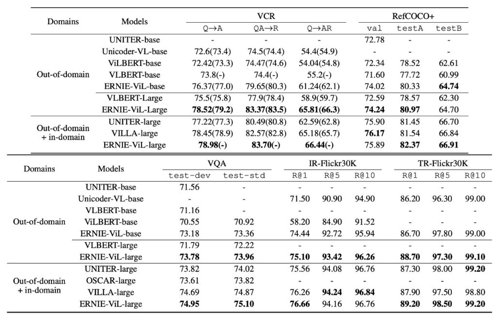
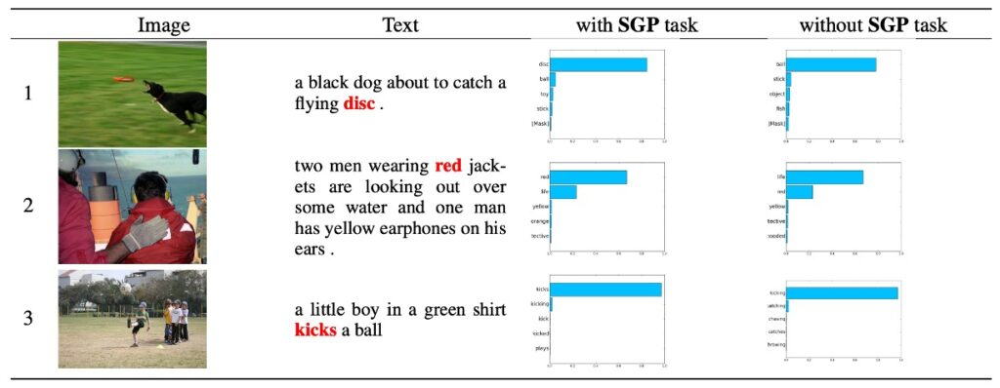

## 知識的双刃劍

[**ERNIE-ViL: シーングラフを通じた知識強化された視覚言語表現**](https://arxiv.org/abs/2006.16934)

---

BERT 以降の多くの話は、あなたもおそらく耳にしたことがあるでしょう。いくつかの違いについても言及できるかもしれません。例えば：

ERNIE モデルは、事前学習時に豊富な先験的知識を統合し、実体知識グラフなどを利用して、より優れた意味理解を得ています。さらに、ERNIE はフラグメント単位のマスキングを採用しています。一般的な Masked Language Model (MLM)タスクに加えて、ERNIE は他の事前学習タスクも取り入れ、モデルの表現力をさらに向上させています。

ERNIE が BERT を最適化したのですから、研究者たちはこの最適化のアプローチを他の分野に応用しようとするのは自然な流れです。

## 定義問題

著者は視覚と言語の事前学習モデルに関する問題に焦点を当て、特に現在のモデルが詳細な意味の整合性において不足している点を指摘しています。

現在のモデルは、一般的な単語と、物体、属性物体、物体間の関係など、詳細な意味を表現する単語を区別できないことが多いです。このため、これらのモデルは現実のシーンを処理する際に、微細な意味を効果的に表現したり捉えたりすることが難しいです。

著者が定義し、解決しようとしているいくつかの重要な点は以下の通りです：

1. **現在の視覚と言語事前学習モデルの不足**

   現在のモデルは、ランダムなマスキングとサブワードの予測に基づいており、物体、属性物体、物体間の関係など、詳細な意味を表現する単語と一般的な単語を効果的に区別していません。

2. **詳細な意味の整合性の重要性**

   現在の方法は、視覚と言語を跨ぐ詳細な意味の整合性の構築の重要性を無視していることが多いです。これにより、モデルが現実のシーンを処理する際に、微細な意味の違いを十分に捉えて表現できない可能性があります。

3. **視覚と言語事前学習のデータソース問題**

   文字の事前学習モデルとは異なり、視覚と言語モデルは、高品質で整合した画像と言語のデータが必要であり、これらのデータは通常、入手が難しいです。

## 解決問題

### ERNIE-ViL モデル設計

### 双流クロスモーダルネットワーク

双流クロスモーダル Transformer 構造は、これら二つのモーダル情報が効果的に組み合わさることを保証し、包括的で統一的な視覚と言語の表現を提供します。

1. **双流構造**

   「双流」とは、二つの独立したデータストリームまたは経路が存在することを意味します。ERNIE-ViL の文脈では、この二つの流れはテキスト（または言語）と画像です。これらの二つのモーダルは、それぞれ専用の Transformer 構造を持ち、モデルはそれぞれのモーダルの特定の特徴に集中することができます。これにより、両者を一緒に混ぜ合わせることなく、各モーダルを個別に処理できます。

2. **テキストと画像データの処理**

   視覚と語彙データは性質が大きく異なるため（例：テキストはシーケンシャルで、画像は二次元）、それぞれを別々に処理することで、モデルは各モーダルの特性に専念でき、これらのデータを解析・学習するための専門的な方法を使用できます。

3. **クロスモーダル Transformer ブロック**

   これらのブロックは、視覚と語彙データ間の相互作用と整合性を促進することを目的としています。テキストと画像がそれぞれの Transformer 構造によって処理された後、クロスモーダルブロックが動作を開始し、これら二つのモーダルの情報を融合します。これはアテンションメカニズムや他の特定の戦略を通じて行われ、テキストと画像間の関連性とコンテキストを見つけることを目的としています。

この双流構造の主な目的は、画像と関連する文や記述の間の関係性を理解できるようにすることです。例えば、テキストが「赤いボール」と言うとき、モデルは画像の中の赤いボールを認識できるようになるべきです。

### シーングラフ予測タスク

シーングラフ（Scene Graph）は、学習可能なモデルではなく、データ構造または表現方法です。これは、画像内の物体の存在、物体間の関係、物体の特定の属性を記述するために使用されます。

シーングラフは視覚的な表現であり、画像内の物体の存在、物体間の関係、物体の特定の属性を記述します。例えば、「赤いリンゴがテーブルの上にある」という画像の場合、シーングラフには「リンゴ」という物体、「テーブル」という物体、リンゴの属性「赤色」、そしてリンゴとテーブルの関係「上にある」などが含まれます。

三つの主要な予測タスク：

1. **物体予測**：この部分の目的は、テキストで言及された特定の物体を予測または識別することです。例えば、「赤いリンゴがテーブルの上にある」という文では、「リンゴ」と「テーブル」が主要な物体として識別されるべきです。
2. **属性予測**：この部分は物体の特定の特徴や記述に焦点を当てます。上記の例では、物体「リンゴ」の属性は「赤色」です。この部分の目的は、これらの属性を識別し予測することです。
3. **関係予測**：この部分の目標は、物体間の関係を識別することです。例えば、「リンゴがテーブルの上にある」という文では、リンゴとテーブルの関係は「上にある」です。

これら三つの予測タスクを通じて、ERNIE-ViL は視覚（画像）と語彙（テキスト記述）の間で意味を深くモデリングすることができます。これにより、モデルは単に画像内の物体とその記述を識別するだけでなく、物体間の関係やそれらの特定の属性を理解し、より豊かで深い視覚と言語の表現を提供できます。

### セマンティックアライメント

ERNIE-ViL の核心的な目標の一つは、視覚（つまり画像）と言語（つまりテキスト）間で深いセマンティックアライメントを確保することです。セマンティックアライメントは、モデルが画像内の物体とその文中での意味的な記述との間で深い理解を持つことを意味します。

例えば、画像に猫が車の上にいる場合、モデルは画像内の「猫」と「車」を識別するだけでなく、「上にある」という関係を理解する必要があります。このような意味的な理解により、モデルは記述と画像の間で正しい接続を構築できます。

物体、属性、関係の予測タスクは、このプロセスで重要な役割を果たします。これらのタスクは、モデルが画像内の物体とその属性を識別するだけでなく、物体間の関係を理解することを要求し、強力なクロスモーダル理解を構築するのに役立ちます。

### エンコード方法

エンコーディングは、機械学習における技術で、高次元の入力データを低次元に変換することを目的とし、モデルがデータをより良く理解し処理するのを助けます。ERNIE-ViL は、入力となるテキストと画像データを処理するためにいくつかの高度なエンコーディング技術を使用しています：

1. **文のエンコード**

   - WordPiece 法を使用して文を分解します。これは単語を小さなサブユニットや断片に分解する方法です。例えば、「playing」を「play」と「ing」に分解します。
   - 各サブワードのエンコードは、複数の情報源の組み合わせに基づいています。これには、元の単語のエンコード（単語の意味に基づく）、セグメントエンコード（異なる文や段落を区別する）、およびシーケンス位置エンコード（文中の単語の位置を特定する）が含まれます。

2. **画像のエンコード**
   - 事前学習された物体検出器を使用して、画像内の主要な物体や特徴を識別します。例えば、「猫」や「車」を識別します。
   - 識別された物体や領域ごとに、画像内での位置情報をエンコードします。これにより、モデルは物体間の相対的な位置関係を理解できます（例えば、「猫」が「車」の上にある）。

### 事前学習タスク

深層学習の分野で、事前学習タスクは一般的な戦略であり、大量の未ラベルデータを使用してモデルを事前に訓練し、特定のタスクでの一般化能力を向上させることを目的としています。ERNIE-ViL は、視覚と言語モデルに特化した一連の事前学習タスクを提案しており、物体予測、属性予測、関係予測、マスク言語モデリングなど、各タスクの特徴と意義についてさらに探求します。

1. **物体予測**

   物体は視覚的シーンの核心的な要素であり、その重要性は非常に高いです。例えば、リンゴとテーブルだけの画像があった場合、リンゴがマスクされると画像の主要な要素が隠れ、モデルの理解が困難になります。物体予測の事前学習タスクでは、物体がマスクされ、モデルが他の可視的な視覚とテキスト情報に基づいて予測することを要求されます。これにより、モデルは画像とテキストの間で接続を構築し、シーンの全体的な認識を高めます。

2. **属性予測**

   物体には、色、大きさ、形状など、基本的な概念に加えて、多くの関連属性があります。例えば、「赤いリンゴ」の場合、「赤い」がリンゴの属性です。属性予測タスクは、物体のこれらの属性を予測することを要求し、モデルが画像内の物体をより正確に理解し、説明することを助けます。

3. **関係予測**

   物体間の関係は、シーン情報をさらに提供します。例えば、「リンゴがテーブルの上にある」という文では、「上にある」という相対的位置関係が示されています。関係予測タスクでは、モデルが画像からこれらの関係を識別し、テキスト記述に正しくマッピングする方法を学び、視覚シーンに対する深い理解を提供します。

4. **マスク言語モデリング (MLM)**

   MLM は、テキストの事前学習タスクです。例えば、「リンゴは赤い」の文から「赤い」をマスクし、モデルに欠損部分を補完させるものです。ERNIE-ViL はこの戦略を通じて、テキストの構文と意味の情報を学習し、その後のタスクにおける強力な言語処理能力を確保します。

5. **マスク領域予測と画像テキストマッチング**

   これらのタスクは、画像の一部に焦点を当てます。ITM（画像-テキストマッチング）や MRM（マスク領域モデリング）などの事前学習タスクです。例えば、画像には「赤いリンゴ」と「木製のテーブル」が含まれ、モデルはリンゴの部分をマスクして、テーブルと関連するテキスト記述を基に予測することがあります。このような事前学習タスクは、単一モーダルの理解を強化するだけでなく、クロスモーダルの関係を強化し、真のシーンで視覚と言語の情報を統合するのに役立ちます。

## 討論

ERNIE-ViL の実験結果は、さまざまな視覚と言語のタスクにおいて優れた性能を示しており、特に他の先進的なクロスモーダル事前学習モデルと比較した際に顕著な成果を上げています。以下は、著者がこのモデルに関する主要な観察と議論です：

### ドメイン外訓練データの利点

上の表のデータに基づき、ERNIE-ViL モデルは多くの視覚と言語タスクで優れた性能を示しました。特に、ドメイン外の大規模なデータセット CC と SBU での事前学習が行われた場合に、その性能が際立っています。

以下は主なポイントです：

1. 他のモデルと比較して、ERNIE-ViL は 5 つの主要なタスクで最良のパフォーマンスを記録しました。
2. 視覚推論タスクにおいて、ERNIE-ViL-large は VLBERT-large に比べ、VCR タスクで 6.60%の向上を見せ、VQA タスクでは 1.74%の改善を達成しました。
3. 視覚基盤タスクでは、ERNIE-ViL-large が RefCOCO+の testA と testB でそれぞれ 2.40%の向上を示し、VLBERT-large を超えました。
4. クロスモーダル検索タスクでは、ERNIE-ViLbase が画像検索とテキスト検索タスクでそれぞれ 2.94%と 0.50%の向上を見せ、Unicoder-VL-base を上回りました。
5. ドメイン外およびドメイン内の全データセットで事前学習を行った場合、ERNIE-ViL-large は UNITER、OSCAR、VILLA などの先進的なモデルを複数のタスクで超えました。

### シーングラフ予測の重要性

シーングラフ予測（Scene Graph Prediction, SGP）タスクは、モデルのパフォーマンスにおいて重要な役割を果たしています。実験からは以下のような観察が得られました：

1. **シーングラフ予測の導入**
   - ERNIE-ViL は SGP タスクを導入した後、全体的なパフォーマンスが大幅に向上しました。この結果は、事前学習段階での SGP の価値を示しています。
2. **特定タスクへの改善**
   - 基本的な参照表現タスクにおいて、特に詳細な意味の整合性が必要な部分で、SGP は RefCOCO+での精度を 0.69%向上させました。
   - 画像検索タスクにおいて、Flickr30K データセットで R@1 が 2.22%向上しました。
3. **ERNIE 2.0 の影響**
   - ERNIE 2.0 からのテキスト初期化は、モデルの性能をさらに向上させました。特に視覚推論タスク（VCR）ではその効果が顕著でした。これは、ERNIE 2.0 が事前学習過程でより多くの常識知識を学習したためと考えられます。

ERNIE-ViL は SGP タスクを導入した後、特に詳細な意味の整合性が求められるタスク、例えば基礎的な参照表現やクロスモーダル検索での性能向上が顕著であり、シーングラフのモデリングが画像とテキストの関係性を理解する上で重要であることを示しています。

### 完形填空テスト

視覚モダリティを条件にした言語完形填空テストを使用して、SGP タスクの効果を評価しました。このテストでは、モデルがテキストと画像のコンテキストに基づいて隠された詳細な意味的トークンを推測する必要があります。

1. **データセット構築**
   - Flickr30K データセットからランダムに 15,000 の画像テキストペアを選びました。それぞれ 5,000 の物体、属性、関係トークンを隠されたターゲットとして選定しました。
2. **評価指標**
   - 前の精度（ACC@1）と前 5 の精度（ACC@5）を評価基準として使用しました。
3. **比較結果（表 3 に基づく）**
   - SGP 事前学習を行ったモデルは、SGP を使用しないモデルに比べて ACC@1 で顕著な改善を示しました：物体の精度が 1.20%、関係の精度が 3.08%、属性の精度が 1.84%向上しました。
   - 両方のモデルのテキストパラメータは BERT で初期化されました。
4. **観察結果**
   - いくつかのケースでは、SGP タスク事前学習を行わなかったモデルが正しく予測できなかったことがあり、詳細な意味の整合性を学習しておらず、事前学習中に一般的な単語と詳細な意味の単語を区別できなかったことが原因です。別のケースでは、SGP タスク事前学習を行ったモデルに比べて予測の信頼度が低かったことが確認されました。

完形填空テストから、SGP タスクを導入することで ERNIE-ViL モデルがクロスモーダルの詳細な意味的整合性を効果的に学習できることが示されました。

## 結論

ERNIE アーキテクチャは、マルチモーダル学習の過程で知識を効果的に抽出できる一方、計算量とストレージの要求が比較的大きいことが課題となります。これにより、特定のデバイスやシチュエーションではリソースが制約される可能性があります。さらに、ERNIE は事前に学習した知識を活用する能力を持っていますが、特定の稀なクロスモーダルシーンにおいては、汎化能力の強化が必要な場合があります。

ERNIE-ViL では、シーングラフ予測タスクを導入してクロスモーダルの詳細な意味的整合性を最適化しましたが、それと同時に新たな課題も生じました。例えば、シーングラフで物体間の関係が誤って「座っている」とマークされると、この誤認識がモデルの下流タスクに影響を与える可能性があります。

:::tip
シーングラフの正確性と完全性は、モデルの性能に直接影響します！
:::

このような誤解は、実際のアプリケーションで不確実性を引き起こす可能性があります。さらに、写真にぼやけた背中や重複する物体が含まれている場合、モデルがそれを「人」や「影」などと正確に識別できないことがあります。これらの複雑でぼやけたシーンに直面すると、モデルは解釈の困難に直面し、特定のシチュエーションでの適用性が制限されることがあります。

シーングラフを使用するということは、人間が世界を理解する方法を模倣することを意味しており、これはモデルの理解を深めることに寄与する一方、課題も伴います。

しかし、ERNIE-ViL はクロスモーダル事前学習の分野で注目すべき利点を示しており、詳細な意味の整合性を最適化するだけでなく、視覚からのシーングラフを統合し、グラフニューラルネットワーク（GNN）を活用して、さらに構造化された知識を統合する新しい方向性を提供しています。これは技術的な進歩の象徴であり、今後の研究者に新たな研究方向と考えるべき課題を提供します。
