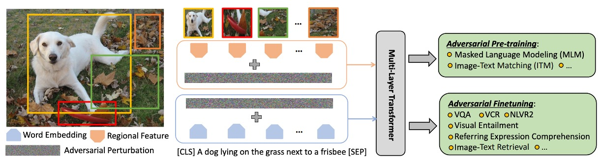
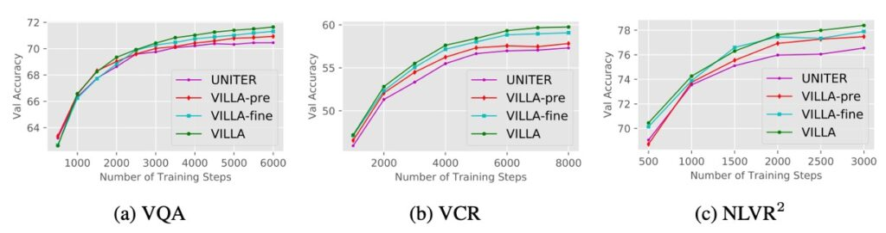

## 別荘の中の魅影

[**Large-Scale Adversarial Training for Vision-and-Language Representation Learning**](https://arxiv.org/abs/2006.06195)

---

今回は興味深い論文を見ていきます。

著者はこの論文で敵対的訓練の概念を導入していますが、この概念はノイズ除去（Denoising）と混同しやすいです。

そこで、敵対的訓練とノイズ除去の違いについて少し話してみましょう。

1. **ノイズ除去 (Denoising)**

   目的は画像やデータ内のノイズを取り除き、元のノイズのないデータを復元することです。

   もしノイズが影響を与えた画像があるとしましょう。ノイズ除去の過程では、これらのノイズを取り除こうとし、画像を元のきれいな状態に近づけます。

2. **敵対的訓練 (Adversarial Training)**

   目的はモデルが「敵対的攻撃」に直面したときでも、正確に予測できるようにすることです。

   もしあなたがモデルを持っていて、そのモデルが特意に作られた、モデルを誤った予測に導く可能性のあるデータに直面したとしましょう。敵対的訓練の目的は、モデルがこれらの状況に対応できるよう学ばせ、一般化能力を高めることです。

ノイズ除去は主に、元のきれいなデータをどのように回復するかに関心がありますが、敵対的訓練の目的はモデルの一般化能力を強化し、敵意のある、モデルを欺こうとする入力に対抗できるようにすることです。また、ノイズ除去は通常、既知のノイズパターンに関わり、それを取り除こうとします。一方、敵対的訓練は意図的に新しい「敵意のある」入力を作り出し、これがモデルを誤らせる可能性があります。

モデルを訓練する際には、標準的で慣れた画像やテキストだけを見せるのではなく、「想像上の敵」つまり、「モデルを惑わせるために特意に変更された」入力データも与えます。これらの「想像上の敵」は訓練中に突如現れる挑戦のようなもので、モデルにさまざまな状況に対応する能力を学ばせます。

## 定義の問題

これまで、VLM の事前学習モデルに敵対的訓練を導入する試みはありませんでした。これは明らかな問題です！

著者は、敵対的訓練の概念をどのように効果的にマルチモーダルタスクに適用するか、しかも効果的に実行する方法を探りたいと考えています。

モデルの堅牢性を向上させるだけでなく、クリーンデータに対する一般化能力を維持または強化する必要があります。これは非常に挑戦的な問題であり、敵対的訓練は通常、高い計算コストと時間の消費を伴います。

## 問題の解決

ここでは少し難しくなりますが、一緒に読んでみましょう。

著者は、モデル全体を構築するために三つの部分に分けています。

### VILLA モデル設計

この段階の主な目的は、異なる下流タスクで適用可能な汎用的な画像とテキストの表現を学習することです。

1. **データセット**

   データセット（論文内では、事前学習データセットを Dp で表現）が使用され、画像とテキストのペア（X_img, X_txt）で構成されています。

2. **特徴表現**

   - 画像（X_img）はまず、下から上へ特徴抽出器 (g_bu(·)) を通じて特徴ベクトルに変換されます。
   - テキスト（X_txt）は、学習可能な単語埋め込み関数 (g_emb(·)) を通じて特徴ベクトルに変換されます。

3. **マルチモーダル統合**

   画像とテキストの特徴を統合するために、複数の層からなる Transformer 構造が使用されます。この構造は、自然言語処理や他のマルチモーダルタスクで非常に人気があります。ここで、[CLS]トークンには特別な意味があり、そのエンコードされた内容がマルチモーダルタスクの統合表現として使用されます。

### 事前学習タスク

その中で、MLM（Masked Language Modeling）と ITM（Image-Text Matching）は、以前の論文で何度も触れましたので、ここでは簡単に触れるだけで、MRM（Masked Region Modeling）の戦略について詳しく説明します。

- **マスク付き言語モデル (MLM)**

  マスク付き言語モデルの過程では、モデルの入力トークンの約 15%がランダムに選ばれ、マスクされます。マスクの意味は、特定のトークンの元の値を隠すことで、モデルがそれを直接見ることができないようにすることです。その後、モデルの仕事は、これらのマスクされたトークンの実際の値を回復しようとすることです。モデルは、他のマスクされていない言語トークンや提供された視覚トークンに依存して回復予測を行う必要があります。

- **画像テキスト一致 (ITM)**

  画像テキスト一致（ITM）は、モデルが画像とそれに対応するテキスト記述との深い意味的関連を理解する能力を評価するための複雑な戦略です。

- **マスク付き領域モデル (MRM)**

  MRM の主な目的は、モデルが完全な画像情報に基づいて隠された部分を推測する方法を学習することです。この能力は、後続のタスクで画像のさまざまな部分をより良く理解し、識別するのに役立ち、言語特徴と効果的に統合されます。この方法は自然言語処理での「マスク付き言語モデル」（MLM）に似ていますが、これはテキストのトークンではなく、画像領域に適用されます。

  画像データ X_img 内で、特定の領域（ランダムに選ばれることもあれば、何らかの戦略に基づいて選ばれることもある）を選び、その特徴をゼロにするか、他の方法でマスクします。これらのマスクされた領域は、モデルが「埋めなければならない」部分と見なされます。

  他のマスクされていないマルチモーダル情報（画像の他の部分や関連するテキスト記述など）を与えられた場合、モデルの仕事はマスクされた領域の正しい内容を予測することです。この予測は、交差エントロピー損失、KL ダイバージェンス損失、または対照学習などで量化できます。

  :::tip
  これは、あなたが子供向けの塗り絵本を持っているようなものです。その中のページに、部分的に完成したリンゴの絵があり、その一部が消されているか隠されています。仮にリンゴの右側の 1/4 が隠されているとしましょう。今、リンゴの 3/4 しか見えませんが、以前に多くの完成したリンゴを見たことがあるので、隠れている部分のリンゴがどう見えるかを推測することができます。
  :::

### 二段階の敵対的訓練

ここで言う二段階とは、事前学習と微調整のことを指します。

この部分では、事前学習と微調整の二つの段階でどのように敵対的訓練を行うか、その関係について議論されています。

1. **事前学習と微調整の接続**

   事前学習と微調整は、ほとんどの深層学習プロセスにおける二つの主要な段階です。事前学習段階は、モデルの基本的な理解と基本的な特徴抽出能力を得るためのものです。微調整段階では、特定のタスクに対する専門的な訓練が行われます。この二つの段階は密接に関連しており、事前学習が微調整段階に必要な基盤を提供します。

2. **クロスモーダルな統合理解の重要性**

   モデルは、MLM や VQA などの異なるタスクにおいて、画像とテキストの内容を同時に理解するクロスモーダルな理解を行う必要があります。例えば、画像に犬が写っている場合、モデルはその視覚情報を「犬」というテキストと関連付ける必要があります。

3. **敵対的訓練の仮定**

   - 最初の仮定は、敵対的事前学習がモデルの一般化能力を強化でき、それが微調整段階に有益であるというものです。一般化能力とは、モデルが未見のデータに対してどのようにパフォーマンスを発揮するかということです。
   - 二番目の仮定は、微調整段階で特定のタスクに対する訓練データを用いて再度敵対的訓練を行うことで、モデルのパフォーマンスをさらに向上させることができるというものです。

4. **共有された数学的な公式**

   事前学習と微調整の二つの段階は数学的に似ているため、同じ敵対的訓練方法を使用できます。

ここで強調したいのは、二つの段階でともに敵対的訓練を行うことで、モデルの一般化能力と敵対的攻撃に対する耐性を高めることができるという点です。

敵対的訓練は、事前学習段階でモデルの基本的な一般化能力を強化し、微調整段階では特定のタスクに合わせてさらにモデルのパフォーマンスを向上させることができます。

### 擾乱（Perturbations）

この部分では、画像とテキストの埋め込み空間に敵対的擾乱を加えて敵対的訓練を行う方法について探求しています。

1. **画像モーダルの擾乱**

   最先端の V+L モデルでは、モデルは通常、事前学習された目標検出器から得られた画像特徴を入力として使用します。従来のようにピクセル空間に擾乱を加える方法とは異なり、ここでは特徴の埋め込み空間で直接敵対的擾乱を加える方法が選ばれています。例えば、犬の画像を考えた場合、ここでは画像のピクセルに対して微調整を行うのではなく、その画像がモデル内で持つ特徴表現に微小な擾乱を加えます。この方法の主な利点は、特徴量をより精密に操作できることです。

2. **テキストモーダルの擾乱**

   画像のピクセルの連続的な値とは異なり、テキストのトークンは離散的であり、そのため操作が難しくなります。従来、テキストモーダルで意味を保持したまま敵対的な例を作成することは困難でした。しかし、本文では単語の埋め込み空間に擾乱を加える方法を選んでいます。これにより、元のテキスト内容を直接変更せずに、モデルの予測に影響を与えることができます。

   例えば、「The dog barks.」という文を考えた場合、著者はその中の単語を置き換えたり変更したりするのではなく、「dog」という単語の埋め込み表現に微小な調整を加え、その結果、モデル内で「dog」に似ているがわずかに異なる表現に対応させます。

3. **位置エンコーディング**

   事前学習された V+L モデルでは、位置エンコーディングが画像領域やサブワードトークンの位置をエンコードするために使用されています。ここでの敵対的訓練方法では、画像と単語のエンコーディングのみを変更し、その他の特徴は変更しません。

4. **同時擾乱の考慮**

   著者は、一度に一つのモーダル（画像またはテキスト）のみに擾乱を加えることを推奨しています。これは、画像とテキストの特性と違いに基づいています。擾乱を加えた後、目標はモデルの予測が変わらないように、すなわち元の意味を保持することです。

### マルチモーダル「自由」敵対的訓練

このセクションでは、VILLA モデルで使用されているマルチモーダル「自由」敵対的訓練法について説明しています。これにはいくつかの数学的公式と技術的詳細が含まれており、詳細に見ていきましょう。

- **訓練目標**

  VILLA モデルにおける「敵対的訓練」は、モデルがわずかな入力の擾乱に対しても安定した予測性能を維持できるようにするための核心的な技術です。この訓練法は、外部のノイズや微小な変動にモデルが影響されにくくする強化手段として理解できます。これにより、モデルは訓練データだけでなく、見たことのない新しいデータに対しても信頼性のある予測を行えるようになります。

  この目標を達成するために、訓練過程では以下の三つの主要な損失項が考慮されます：

  1. **標準的な交差エントロピー損失（L-std）**

     これはほとんどの分類問題で使用される基本的な損失関数で、モデルの予測と真のラベルの差を測定します。交差エントロピー損失が小さいほど、モデルの予測は真実に近いことを意味します。

  2. **ラベル保持の敵対的訓練損失（R-at）**

     これは、入力データにわずかな擾乱が加えられた場合でも、モデルが元の入力と同じラベルを予測し続けることを保証します。言い換えれば、画像やテキストに微小な変化があったとしても、モデルは同じ予測を出すべきです。

  3. **細粒度の敵対的正則化項（R-kl）**

     これは、より複雑な損失項で、モデルが擾乱された入力に対してラベルを保持するだけでなく、モデルの予測の信頼度や確率分布も元の入力と近いものに保つことを求めます。これにより、モデルはラベルレベルだけでなく、予測の詳細においても一般化されることが保証されます。

- **マルチモーダルの敵対的擾乱**

  VILLA モデルは訓練時に、元の画像とテキストのエンコーディングだけでなく、これらのエンコーディングにも敵対的な擾乱を加えています。これらの擾乱は、モデルの一般化能力をテストし、微小なノイズや変動に直面しても正しく動作することを保証するために故意に導入された小さな変化として理解できます。

  しかし、これらの敵対的擾乱は無作為に加えられるものではありません。それらには明確な「ノルム制限」があり、これらの擾乱の強度や大きさは、モデルが識別できないほどの重大な変動を引き起こさないように制御されています。

  次に、モデルの訓練には二つの主要な最適化ステップが含まれます：外部の最小化と内部の最大化です。外部の最小化は、全体の訓練過程においてモデルの予測エラー（つまり損失）をできるだけ小さくすることを目的としており、このステップは一般的な勾配降下法（SGD など）を使用して達成されます。内部の最大化は、敵対的擾乱を探索する際に、これらの擾乱がモデルの損失を最大化することを目指し、最もモデルに干渉する擾乱を見つけることを目指しています。この最適化は、PGD（Projected Gradient Descent）という手法で行われます。

  画像モーダルを考慮すると、PGD は擾乱が損失に与える影響を計算するために、損失の勾配を求めます。そして、損失を最大化する新しい擾乱を見つけるために、その勾配方向に小さなステップを踏みます。このプロセスは繰り返し行われ、指定された反復回数または擾乱の大きさの制限に達するまで続けられます。

  あなたが機械学習モデルを訓練していて、その仕事が「犬」か「猫」の写真を区別することであると想像してください。元の画像エンコーディングは、その写真から抽出された特徴や情報です。

  1. **敵対的擾乱の追加**

     訓練中に、誰かが故意にいくつかの写真のピクセルを微調整して、猫を犬に似せたり、犬を猫に似せたりする場合があります。これらの微調整が「敵対的擾乱」です。

  2. **ノルム制限**

     しかし、これらの微調整は無作為に行われるものではありません。それらには制限があります。例えば、擾乱の大きさは、猫の顔が完全に変形しない程度で、モデルを混乱させるのに十分な微調整に過ぎません。

  3. **最適化**

     訓練の各反復で、モデルはこれらの微調整がどのように行われるかを特定し、それらを無視する方法を学んで、実際に「犬」と「猫」を区別する特徴に集中できるようにします。SGD を使用して、モデルはこれらの微調整の影響に基づいてパラメータを調整し、微調整された画像でのエラー率を減らします。そして、PGD を使用して、モデルは最も自分を間違えさせる可能性のある微調整を見つけ、最悪のシナリオに基づいて学習と調整を行います。

- **敵対的正則化のさらに強化**

  敵対的正則化は、機械学習における技術で、モデルの一般化能力を高め、敵対的擾乱に対しても正しい予測を行えるようにします。ある状況では、敵対的擾乱がモデルの予測に大きな偏差を引き起こすことがありますが、この正則化技術はその偏差を制限しようとします。

  この強化された敵対的正則化は、単にモデルが擾乱に直面しても正しく分類することを要求するだけでなく、モデルの予測確率分布が擾乱前後で類似していることを要求します。これにより、モデルは「猫」や「犬」を確定的に予測するだけでなく、その予測の信頼性や確率も擾乱前後で大きく変わらないようにします。

  :::tip
  Kullback-Leibler ダイバージェンスは、二つの確率分布の違いを測定するツールです。この場合、擾乱前後のモデルの予測確率分布の類似性を比較するために使用されます。二つの分布が非常に似ていれば、Kullback-Leibler ダイバージェンスは 0 に近くなります。逆に、二つの分布が大きく異なると、その値は増加します。
  :::

  :::tip
  例：

  モデルが、擾乱がない場合に写真に写っている動物を「猫」と予測する確率が 90%であるとしましょう。しかし、この写真が敵対的擾乱を受けた後、モデルの予測確率は 60%に減少します。これは擾乱がモデルの確定性に影響を与え、「猫」の予測に対する自信が低下したことを意味します。この信頼性の変化、すなわち二つの確率分布の違いは、Kullback-Leibler ダイバージェンスによって捉えられます。正則化項は、この差異を最小化し、擾乱に直面しても予測の信頼性を維持することを促します。
  :::

### 自由な敵対的訓練戦略

敵対的訓練（Adversarial Training、略して AT）は、モデルの一般化能力を強化する方法であり、通常は擾乱データを用いて訓練し、モデルが敵対的攻撃に対して耐性を持つようにします。ここで、著者は「Free」と呼ばれる敵対的訓練戦略について言及しています。（原文では「free」と記載されていますが、無料または自由に翻訳するべきかは悩ましいところです。意味的にはどちらも適切に思えます。）

- **K-step PGD の計算コスト**

  PGD（Projected Gradient Descent）は敵対的訓練でよく使用される手法です。K-step PGD を使用する場合、モデルを K 回の前向きと逆向きの伝播を通じて計算する必要があり、非常に時間がかかります。さらに、K ステップ後の最後のステップで生成される擾乱のみがモデルの訓練に使用されるため、それ以前のすべてのステップは最終的な擾乱を生成するためだけに行われます。

- **解決方法：FreeLB**

  上記の計算問題を克服し、大規模な訓練を効率的に実行するために、著者は FreeLB という手法を採用しています。FreeLB の方法では、PGD の複数のイテレーションを行い、敵対的なエンコーディングを生成するだけでなく、各イテレーションで「自由」なパラメータの勾配 ∇θL も累積します。つまり、各イテレーション後にモデルのパラメータを更新するのではなく、複数回のイテレーション後に累積された勾配を使用して一度に更新を行います。

  この戦略の利点は、より大きな「仮想的」なミニバッチ（mini-batch）をシミュレートできることです。言い換えれば、K 倍のサイズのミニバッチを効果的にシミュレートし、各更新がより豊かで多様になることを意味します。

比喩を使って説明すると：

自転車を組み立てていると想像してください。各ステップで特定の部品を取り付ける必要があります。

- **従来の K-step PGD 方法**

  これは、自転車の組み立ての各ステップごとに、その部分が正常に機能するかどうかを確認するようなものです。例えば、ペダルを取り付けた後に少し乗ってみて、次にチェーンを取り付けてまた少し乗り、再度確認する。このようにして、各部品を取り付けるたびにテストを行います。これにより、各部品が正しく取り付けられていることを確認できますが、非常に時間がかかります。

  しかし、最終的に重要なのは、すべての部品を組み立てた後のその一回のテストです。このテストが、全体の自転車が正しく組み立てられたかどうかを教えてくれます。

- **FreeLB 戦略**

  では、別の組み立て戦略を想像してみましょう。

  あなたは引き続き自転車を段階的に組み立てますが、各ステップでテストを行うことはありません。その代わりに、各部品を取り付けるたびに、遭遇する可能性のある問題や考慮すべき点を記録していきます（これが累積された勾配に相当します）。すべての部品を取り付け終わった後、累積されたすべての問題や考慮事項を基に、最後に一度だけ全体のテストと調整を行います。

  この方法では、各ステップでテストを行う時間を無駄にせず、最後の全面的な調整に集中することができるため、より効率的に組み立てを行うことができます。

もちろん、すべての比喩には限界があり、目標となる概念に完璧に対応することはできませんが、この説明が感覚をつかむ助けとなることを願っています。

## 討論

この論文の焦点は実際には敵対的訓練の設計に集中しています。

しかし、この設計が良いのか、どれほど良いのかを見ていく必要があります。

### 実験設定

VILLA の機能と効果を検証するために、著者は一連の実験を行いました。これらの実験は主に V+L の事前学習モデルに集中しており、さまざまな下流タスクの総合的な評価が行われました。これらのタスクには、視覚質問応答（VQA）、視覚常識推論（VCR）、引用表現（RE）圧縮、視覚的包含、画像テキスト検索、および NLVR2 が含まれます。

主な検証プロセスは二段階に分かれています。最初に、著者は VILLA を現在の最先端の UNITER モデルに組み込み、下流タスクの評価と消融分析を行いました。次に、VILLA の広範な適用性を示すために、著者は別の V+L モデルである LXMERT を選び、さらに包括的なテストを行いました。

もしこれらのモデルについてまだ見ていない場合は、以下を参照してください：

- **リンク： [LXMERT](../1908-lxmert/index.md)、[UNITER](../1909-uniter/index.md)**
- **主要なモデル設定：UNITER と LXMERT**

  - **UNITER**

    - UNITER-base：これは単一ストリームモデルで、12 層があり、各層には 768 の隠れユニットと 12 のアテンションヘッドがあります。
    - UNITER-large：より大きなバージョンで、24 層があり、各層には 1024 の隠れユニットと 16 のアテンションヘッドがあります。
    - BERT の構造と同様ですが、その入力は二種類のモーダル（視覚と言語）の混合シーケンスを結合しています。

  - **LXMERT**
    - LXMERT は二重ストリームモデルで、まず各モーダルで独立した自己注意を使用して複数の層で処理を行い（テキストは 9 層、画像は 5 層）、その後、二つのストリームの出力を融合し、さらに 5 層の処理を行います。これには交差注意と自己注意が含まれます。

- **設定の詳細**
  - UNITER の実験では、著者は四つの主要な大規模データセットを使用して事前学習を行いました。これらは COCO、Visual Genome（VG）、Conceptual Captions、SBU Captions です。
  - VILLA は MLM と ITM の事前学習タスクにも適用可能で、著者は UNITER-base と UNITER-large に対して異なる訓練ステップを提供し、公平な比較を確保するとともに訓練時間も考慮しました。

### VILLA の UNITER での効果と分析

1. **VILLA と他の事前学習 V+L モデルの比較**

   - VILLA はすべてのテスト基準において最先端の技術水準を達成しました。
   - VILLA-base モデルの効果向上：

2. **VQA での結果：UNITER-base に対して+0.76 の向上**

   - VCR の Q→AR：UNITER-base に対して+2.4 の向上
   - NLVR2：UNITER-base に対して+1.45 の向上
   - SNLI-VE：UNITER-base を上回る
   - Flickr30k 画像/テキスト検索：UNITER-base に対して+2.22/+0.70（R@1）の向上
   - 3 つの RE データセットの平均で+0.99 の向上。

3. **VILLA-large モデルの効果向上**
   - 全体的なパフォーマンスにおいて、同様の向上傾向が見られました。
   - VCR の Q→AR 指標：絶対値で+2.9 ポイント向上。このタスクは特に画像内で隠れた社会的ダイナミクスの理解に焦点を当てています。
   - VQA の基準：74.02 から 74.87 に向上。
   - 統合戦略を通じて、VILLA-large のパフォーマンスはさらに向上し、75.85 に達しました。

### VILLA の詳細な分析

1. **事前学習 vs. 微調整**

   

   UNITER-base モデルを使用して、事前学習と微調整段階での敵対的訓練の効果を研究しています。

   - UNITER (reimp.)：標準訓練で再実装された UNITER-base モデル。
   - VILLA-pre vs. VILLA-fine：それぞれ事前学習または微調整段階でのみ敵対的訓練が適用されたモデル。
   - 結果：VILLA-pre と VILLA-fine は、6 つの評価タスクでそれぞれ+0.51 および+0.82 のパフォーマンス向上をもたらしました。両者を組み合わせることで+1.15 の向上が得られました。

   

   上のグラフからわかるように、訓練が進むにつれて、強化された敵対的訓練を受けたモデルとオリジナルの UNITER モデルとのギャップが広がっていくのが確認できます。

2. **画像 vs. テキストモーダル（表 3a）**

   

   敵対的例とは、人間にとっては元の入力とあまり違いがないように見えるように設計された入力ですが、モデルに誤った予測をさせる可能性のあるものを指します。ここでは、画像とテキストの二つのモーダルに対して、敵対的擾乱を追加することに焦点を当てています。

   - 実験結果
     - 画像の独立した擾乱：画像特徴に対して単独で擾乱を加えると、モデルのパフォーマンスが顕著に向上します。これは伝統的な認識とは逆である可能性があり、画像領域では、敵対的訓練が清潔な画像のモデル精度に負の影響を与えることがよくあります。
     - 直感と実際の結果：最初は、画像とテキストの両方のモードに擾乱を加えることで、敵対的例の多様性が増し、より多くの利益が得られると考えられるかもしれません。しかし、実際には、一方のモーダルにのみ擾乱を加えるだけで顕著な効果の向上が得られることが確認されました。

   VCR（視覚常識推論）タスクは、モデルが画像の中で複雑な社会的ダイナミクスを理解し、常識的な推論を行うことを要求するため、比較的挑戦的です。このタスクにおけるパフォーマンスの向上は、他のタスクよりも顕著に見えるようです。これは、より挑戦的なタスクにおいて、敵対的訓練がより大きな利益をもたらす可能性があることを示唆しています。

3. **FreeLB vs. VILLA（表 3b）**

   

   著者は、FreeLB と VILLA を VQA と VCR という代表的で挑戦的な V+L タスクにおける効果で比較しました。追加された細粒度の敵対的正則化項により、VILLA はこれら二つのベンチマークテストにおいて FreeLB を上回っています。

   ***

   しかし、ちょっと待ってください。以前、VILLA が採用している戦略は FreeLB だと言っていませんでしたか？それではなぜ再び比較しているのでしょうか？

   VILLA は確かに FreeLB の戦略を使用して敵対的訓練を行っていますが、それが VILLA がただの FreeLB であることを意味するわけではありません。VILLA は、いくつかの追加的な戦略や正則化手法を組み込んだ、より包括的なフレームワークです。例えば、モデルの効果を最適化・強化するための細粒度の敵対的正則化項がその一例です。

   「FreeLB vs. VILLA」の部分では、VILLA が FreeLB の戦略を採用しているとはいえ、さらに他の強化戦略が加わったことで、FreeLB 単体よりもパフォーマンスが向上していることを示したいのです。言い換えれば、この部分は VILLA が FreeLB を基盤としてどのように改善を加え、どのようなパフォーマンス向上をもたらしたかを強調する部分です。

   比較の目的は、VILLA が FreeLB をその核心として使用しているにもかかわらず、他の最適化と強化戦略によって、特定のタスクにおいて FreeLB 単独よりも優れていることを証明することです。

4. **LXMERT での結果**

   

   著者は、VILLA が UNITER にのみ効果があるのではなく、LXMERT にも適用可能であることを示しました。上の表から見ると、LXMERT は VILLA の適用後、UNITER-base を超えるパフォーマンスを達成しました！

   著者は VILLA の汎用性を証明し、三つの評価タスクにおいて+0.88 の平均的なパフォーマンス向上を提供しました。

## 結論

深層学習モデルの堅牢性を探る分野で、敵対的攻撃は重要で注目すべき領域です。本研究は特に、視覚と言語モデル（V+L モデル）の敵対的堅牢性について探求しています。この分野はまだ新しいものであり、これらのモデルに対してどのように敵対的攻撃を行うかについての戦略はまだ比較的少ないのが現状です。特に、マルチモーダル Transformer モデルから CNN バックボーンに勾配を逆伝播して画像の敵対的攻撃を生成する方法や、視覚的な状況に合ったテキストの敵対的生成方法は現在の課題です。

VILLA は視覚と言語の表現学習を強化するために設計された新しい敵対的訓練フレームワークであり、その特異な点は、事前学習段階だけでなく、微調整段階にも敵対的訓練を採用していることです。さらに、エンコーディング空間に敵対的擾乱を追加することで、VILLA はさまざまな評価基準において一貫したパフォーマンス向上を実現しています。

ここで見て取れるのは、著者が VILLA を「プラグイン」の概念として捉えていることです。つまり、モデルの構造を変更することなく、最終段階で VILLA が指導する敵対的訓練技術を加えるだけで、モデルのパフォーマンスを 1〜3 パーセント向上させることができるということです。

最後に、著者は VILLA の効果が顕著である一方で、敵対的訓練の時間がかかることが一つの大きな課題であることにも触れています。今後、著者はより効率的な敵対的訓練方法を見つけ出し、大規模な事前学習を日常的な実践でより実行可能にすることを期待しています。
