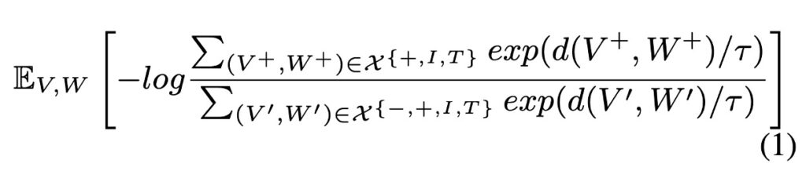

## 錯綜の糸口

[**UNIMO: Towards Unified-Modal Understanding and Generation via Cross-Modal Contrastive Learning**](https://arxiv.org/abs/2012.15409)

---

国語の授業をしばらく受けていない気がしませんか？「錯綜」とは何でしょうか？覚えていますか？

なんだか文の雰囲気が違うように感じますが、大丈夫です。まずは復習から始めましょう。

### 錯綜

1. **語順の交錯（語順変換）**

   - 元の文の語順を調整して、新たな意味や感覚を生み出す。
   - 原文：「陟罰臧否」→ 錯綜：「陟臧罰否」

2. **語句の置換（単語変換）**

   - 同義語を使用して、文に変化や新鮮さをもたらす。
   - 原文：「南山烈烈，飄風發發」 → 修正：「南山律律，飄風弗弗」

3. **文の伸縮（文字数変換）**

   - 意図的に文の長さを変更して、リズム感を演出する。
   - 原文：「於山見終南嵩華之高，於水見黃河之大且深」 → 修正：「於山見高，於水見大且深」

4. **文型の変化（句型変換）**

   - 口調や文型を変化させる。例えば、肯定を否定に、陳述を疑問に変えるなど。
   - 原文：「徐公何能及君也？」 → 修正：「徐公能及君也嗎？」

「錯綜」は、元の言語構造や語順を変化させ、言語の動的な特性や構造の変化に重点を置きます。

さて、本題に戻ります。

この論文、つまり UNIMO の主な貢献は、マルチモーダルモデルの訓練において、「語句の置換」という修辞技法を使用し、大量のポジティブペアとネガティブペアのデータを生成した点です。

「語句の置換」だけで、他の修辞技法は使用していないのですか？

その通りです。ここまで読んで、あなたもこの論文の今後の開発方向について考えられるようになったのではないでしょうか。

## 定義の問題

先行研究における事前学習の分野を探る中で、著者は単一モーダルとマルチモーダル事前学習の二大分類を特定しました。これらの手法は、それぞれの領域に特化する傾向があり、単一の視覚または言語モデル、あるいはマルチモーダルタスクを対象とするモデルにおいて、それぞれに固有の制約が存在します。

1. **単一モーダル学習の課題**

   現在の学習モデルと研究は、単一のモーダル（テキストまたは画像）に焦点を当てることが多く、このような偏りがマルチモーダルな場面（テキストと画像の結合）での性能を低下させています。このアプローチは、異なるモーダル（視覚と言語など）の情報を統合的に活用することを妨げています。

2. **マルチモーダル事前学習データの限界**

   ViLBERT、VisualBERT、UNITER などのマルチモーダル事前学習手法の存在は確認されていますが、これらの手法は限られた画像とテキストの対応データに過度に依存しており、単一モーダルの場面では安定した性能を発揮できません。このような手法には、単一モーダルタスクへの汎用性の制約があります。

3. **マルチモーダルデータのセマンティック空間整合の課題**

   テキストや画像といった異なる種類のデータに対して、統一されたセマンティック空間を構築し、マルチモーダル学習においてそれらを整合させて結合することは依然として課題です。この問題は、異なるモーダル間で学習された表現の移行性や普遍性に大きく影響を与えています。

4. **クロスモーダル表現学習の効率性への疑問**

   現行のクロスモーダル事前学習戦略は、限られた画像-テキストペアに基づき、基本的な画像-テキストマッチングやマスク言語モデルの戦略を使用してクロスモーダル表現を学習します。このような手法は、視覚およびテキストの包括的な表現を学習する点や、単一モーダルタスクへの汎化能力において不十分です。

5. **クロスモーダル理解と生成の課題**

   マルチモーダルな状況では、視覚と言語の知識を拡張して理解と生成能力を向上させる方法が顕著な課題となっています。これには、言語モデルと視覚モデルが協調して機能し、マルチモーダル環境における情報の理解と生成を強化することが必要です。

## 解決の問題

### UNIMO モデル設計

UNIMO はクロスモーダル事前学習手法であり、異なるモーダル間のセマンティックレベルでのモーダル不変情報を捉え、学習することを目的としています。このモデルの中核的な概念は、人間が多様な感覚を通じて世界を認識する方法に着想を得ています。

その主な設計理念は以下の通りです：

1. **マルチモーダル学習**

   - UNIMO は画像、テキスト、および画像-テキストペアといった異なる種類のデータから学習し、セマンティックレベルでモーダル不変の情報を捕捉します。これにより、テキストと視覚入力のより堅牢で汎用的な表現を実現します。

2. **Transformer アーキテクチャの採用**

   - UNIMO は多層の自己注意 Transformer 構造を使用して、テキストおよび視覚データの統一されたセマンティック表現を学習します。
   - テキスト入力は、Byte Pair Encoding (BPE) によりサブワード列に分割され、自己注意メカニズムを通じてコンテキスト化されたトークン表現を学習します。
   - 画像入力については、Faster R-CNN を用いて注目すべき画像領域を検出し、それぞれの領域の視覚的特徴を抽出します。

3. **Cross-Modal Contrastive Learning (CMCL)**

   - CMCL は、異なるレベルのテキストおよび視覚表現を整合し、統一されたセマンティック空間に統合することを目的としています。
   - 基本的なアイデアは、ペアとなる画像とテキストの表現を表現空間内で近づけ、ペアではない表現は遠ざけることです。
   - 正の画像-テキストペア $X^+$ および負の画像-テキストペア $X^-$ を生成するために、一連のテキストリライト技術を使用します。また、単一モーダルデータから関連する画像 $X_I$ およびテキスト $X_T$ を取得するために画像およびテキスト検索を活用します。
   - 同一の統一モーダル Transformer を使用してこれらをペアまたは単独でエンコードし、画像およびテキストの表現を抽出してコントラスト損失を計算します。

4. **単一モーダルとマルチモーダルの統合学習**
   - UNIMO は、大量の画像データセット、テキストコーパス、および画像-テキストペア上で事前学習を行い、マスキング予測を通じて汎用的な視覚およびテキスト表現を学習し、それらを統一されたセマンティック空間に統合します。
   - 視覚知識、言語知識、および視覚と言語間のクロスモーダル知識を統合的に学習することで、視覚と言語の理解および生成能力を向上させるだけでなく、学習過程においてテキスト知識と視覚知識が相互に促進し合い、統一されたセマンティック空間を形成します。

### CMCL

CMCL（Cross-Modal Contrastive Learning）の基本理念は、統一されたセマンティック空間内で、類似した（正の）サンプル間の距離を縮め、不類似な（負の）サンプル間の距離を広げることにあります。このアイデアを数式で表すと以下のようになります：

<figure style={{"width": "70%"}}>

</figure>

この数式における各要素は以下の通りです：

- $d(V, W)$：画像 $V$ とテキスト $W$ 間のセマンティック空間での距離を測定する関数。正のサンプルの距離が小さくなるように、負のサンプルの距離が大きくなるよう設計されています。
- $\tau$：温度パラメータであり、softmax 関数のシャープネスを制御します。$\tau$ が小さい場合、モデルは大きな値に敏感になり、$\tau$ が大きい場合は値の分布が均等化されます。
- $X[+, I, T]$：正のサンプルの集合で、ここでは画像 $V^+$ とテキスト $W^+$ が意味的に関連または一致しているものを指します。
- $X[-, +, I, T]$：負のサンプルの集合で、画像 $V'$ とテキスト $W'$ が関連していない、または一致しないものを指します。
- $\mathbb{E}_{V,W}$：期待値であり、すべての可能な $V$ と $W$ の平均を取ります。

この損失関数は、コントラスト学習の基本的な思想を反映しています。すなわち、モデルは意味的に類似または関連のある画像とテキスト（正のサンプル）を近くにマッピングし、不関連な画像とテキスト（負のサンプル）をより遠くにマッピングするよう促されます。

- **分子**：正のサンプルに対して、モデルはこれらの距離の指数を最大化しようとします。画像 $V^+$ とテキスト $W^+$ が近いほど、この値は増大します。
- **分母**：負のサンプルに対して、モデルはこれらの距離の指数を最小化しようとします。画像 $V'$ とテキスト $W'$ が遠いほど、この値は増大します。

この比率を最大化することで、モデルはマルチモーダルなセマンティック空間において正のサンプルと負のサンプルを区別する能力を学習します。

### 多粒度セマンティックアライメント

#### **Text Rewriting**

テキストリライティングは、画像とテキスト間のセマンティックアライメントを多粒度で強化する重要な役割を担います。画像のキャプションや説明を文単位、句単位、単語単位でリライトし、モデルに豊富な学習環境を提供することで、画像と言語のセマンティクスをより精確に整合させることを目指します。

1. **文単位でのリライト**

   - **正のサンプル生成**：バックトランスレーション技術を使用。各画像のキャプションを別の言語に翻訳し、その後元の言語に再翻訳します。この手法により、モデルは一つの画像に対して意味的には類似しているが、文法や語彙がわずかに異なる複数のキャプションを正のサンプルとして得ることができます。
   - **負のサンプル生成**：TF-IDF に基づく類似性検索を使用し、他の画像のキャプションを取得します。これらのキャプションは、元の画像のキャプションに非常に類似しているものの、正確には元の画像を表現していないため、ハードな負のサンプルとして利用されます。

2. **句単位・単語単位でのリライト**

   - 画像キャプションをシーングラフ（画像内の物体、属性、それらの関係を描写するグラフ表現）に変換し、シーングラフ内の物体、属性、または関係ノードを対応する語彙リストの別の物体、属性、または関係にランダムに置換します。このプロセスにより、句単位や単語単位でセマンティクスを変化させます。

テキストリライティングは、従来の手法で一般的に行われていたランダムサンプリングの負のサンプルとは異なり、セマンティクス的に正のサンプルに近いが微妙な違いを持つハードな負のサンプルを生成することで、モデルにさらなる挑戦を与えます。

このようなリライティング戦略により、モデルは異なる粒度での画像とテキスト間のセマンティクスアライメントを学習します。正のサンプルと負のサンプルを比較することで、モデルはセマンティクス的に類似した画像とテキストを整合させ、セマンティクス的に一致しない画像とテキストを区別する能力を向上させます。

#### **Image/Text Retrieval**

この手法の主な目標は、クロスモーダル学習過程に単一モーダルの情報を統合し、セマンティクスアライメントの学習効果を向上させることです。

1. **単一モーダル情報の拡張**

   各画像-テキストペアは、単一モーダルデータ（画像のみ、またはテキストのみのデータ）から取得した関連する画像やテキストを通じて拡張されます。

   - **画像の拡張**：元の画像と視覚的に高い類似性を持つ画像を選択します。特に、元の画像とオブジェクトが高度に重複する画像を選びます。これらの画像は、元画像に関連する視覚情報を提供します。
   - **テキストの拡張**：セマンティクス的な類似性に基づき、テキストデータから元のキャプションと意味的に関連する文を抽出し、追加の言語的背景情報を提供します。

2. **拡張された情報のエンコード**

   単一モーダルの画像およびテキスト情報はエンコードされ、クロスモーダルコントラスト損失の計算に使用されます。

   - **単一モーダルの Transformer エンコーディング**：拡張された画像とテキストは、それぞれ統一されたモーダルの Transformer を通じてエンコードされます。これにより、モデルはこれらの単一モーダルデータを共有のセマンティック空間にマッピングし、画像とテキストの関連性を促進します。
   - **クロスモーダルコントラスト損失の計算**：セマンティック空間内で、拡張された単一モーダル情報の表現を抽出し、前述のクロスモーダルコントラスト損失の計算に利用します。

3. **単一モーダル情報を活用したクロスモーダル学習の向上**

   拡張された画像およびテキストは豊富な背景情報を提供します。これにより、モデルは視覚と言語間のセマンティクスアライメントをより深く理解し、学習効率と性能を向上させます。

   :::tip
   画像とテキストに関する追加のセマンティクス情報を提供することで、モデルは画像とテキスト間のセマンティクス的な関連性をより正確に識別・理解できるようになり、複雑なセマンティクスアライメントタスクでのパフォーマンスが向上します。
   :::

### 実験設計

このセクションでは、著者が多モーダル事前学習モデル UNIMO の実験設計について詳しく探討しており、事前学習と微調整実験の設定が含まれています。

1. **事前学習データセットと実装の詳細**

   - **事前学習データセット**

     - テキストコーパス：BookWiki と OpenWebText が主要なテキストソースとして使用されました。
     - 画像コレクション：OpenImages と COCO の未ラベルデータセットのサブセットが含まれており、テキスト説明がない純粋な画像データです。
     - 画像とテキストのペア：COCO、Visual Genome、Conceptual Captions、SBU Captions の 4 つの多モーダルデータセットを統合しています。

   - **実装の詳細**
     - モデルの規模：UNIMO は 2 つのサイズのモデルを提供しています – UNIMO-base（12 層の Transformer）と UNIMO-large（24 層の Transformer）。
     - 事前学習：モデルはそれぞれ RoBERTa-base および RoBERTa-large から初期化され、少なくとも 500K ステップのトレーニングが行われました。
     - 最適化とハードウェア：Adam オプティマイザ、float16 混合精度トレーニングが使用され、Nvidia Tesla V100 32GB GPU でモデルのトレーニングが行われました。

2. **微調整タスクと実験設定**

   - **単一モーダルタスク**

     - 生成タスク：生成会話質問応答（CoQA）、質問生成（SQuAD 1.1）、抽象要約（CNN/DailyMail）、文圧縮（Gigaword）が含まれます。
     - 理解タスク：感情分類（SST-2）、自然言語推論（MNLI）、言語受容性分析（CoLA）、意味的類似性分析（STS-B）が含まれます。

   - **多モーダルタスク**

     - 視覚的質問応答（VQA v2.0）、画像キャプション（Microsoft COCO Captions）、視覚言語自然言語推論（SNLI-VE）、画像文検索（Flickr30k）が含まれます。

UNIMO の訓練プロセスでは、視覚領域の特徴抽出には VisualGenome データセットで事前学習された Faster R-CNN が選ばれ、領域のクラス検出と選択に対する明確な基準が設定されました。さらに、CMCL 設定では、正のサンプルとハードネガティブサンプルの作成と選択が慎重に行われました。

## 討論

### 多モーダルタスクの表現

多モーダルタスクの表現に関して、UNIMO は安定した競争力を示しました。特に、ViLBERT、VLP、UNITER、Oscar などの現在の先駆的なモデルと比較した場合に顕著です。UNIMO-large は、いくつかの重要なテスト項目で以前の先駆的なモデルを上回り、特に画像検索やテキスト検索タスクにおいて、ERNIE-ViL-large と比較して R@1 指標でそれぞれ 1.34 点および 1.3 点の向上を示しました。これは、画像とテキストの検索タスクにおけるこのモデルの改善が顕著であることを示しています。

同時に、画像キャプションタスクにおいても、UNIMO は BLUE4 スコアで以前優れた性能を示していた Oscar をわずかに上回りました。総合的に見て、UNIMO は多モーダル理解および生成タスクにおいて、その効果的かつバランスの取れたモデルアーキテクチャの性能を示し、統一的なモーダル学習アーキテクチャの実用性を証明しました。

### 単一モーダルタスクの表現

UNIMO は単一モーダルタスクにおいても堅牢な適応性を示しました。BERT、RoBERTa、XLNet、UniLM などの複数の既存の事前学習済み言語モデルと比較した場合、UNIMO は多くの言語理解および生成タスクで相対的に同等またはわずかに優れた結果を示しました。UniLM（自然言語理解および生成のために特別に設計されたモデル）との比較により、UNIMO は単一モーダルシナリオにおけるパフォーマンスを示し、多モーダルタスクおよび単一モーダルタスクの両方において信頼できる競争力を持つことを明らかにしました。

このような成果は、UNIMO が採用した統一的なモーダル学習アーキテクチャの構築に起因しています。このアーキテクチャは、大規模な単一モーダルの画像とテキストを巧妙に活用し、クロスモーダル学習を実現し、多モーダルタスクと単一モーダルタスクの間で円滑な転送と学習を可能にしました。しかし、いくつかの利点を示したにもかかわらず、この統一的なモーダル学習アーキテクチャは、異なる領域およびタスクへの適応性や深層的な最適化については、さらに探究と検証が必要です。

### 誰の貢献？

テキストと視覚情報を融合させた多モーダル学習の分野では、テキストと視覚の二つのデータ形式がどのように相互作用し、それぞれが学習過程に与える影響が、常に研究の焦点となっています。

著者は、UNIMO モデルフレームワークの下で、テキストと視覚データがどのように相互に強化されるかについて特に探究しています：

- **テキストの影響：視覚にコンテキストを提供**

  

  アブレーション研究を通じて、UNIMO からテキスト学習プロセスを除外した場合（表 3 参照）、モデルが多モーダル理解および生成タスクで顕著な性能低下を示すことが観察されました。これは、テキストコーパスの知識がクロスモーダル学習を強化する役割を示すだけでなく、モデルの意味理解と生成におけるテキストの重要な役割を強調しています。特に、視覚と言語のタスクを強化するためにより多くのコンテキスト情報を提供する際、テキストの知識は不可欠であることが示されました。

- **視覚の貢献：言語表現を豊かにし強化**

  

  逆に、視覚的な知識は言語学習にも深い影響を与えました。事前学習データセットから画像と画像-テキストペアを除外した場合（表 4 参照）、モデルはほとんどの言語理解タスクとすべての言語生成タスクで顕著に性能が低下しました。これらの発見は、視覚データがモデルの言語表現を豊かにするだけでなく、統一された意味空間でより一般化された表現を学習することを可能にし、言語タスクのパフォーマンスを向上させることを強く示唆しています。

  テキストと視覚情報の相互作用とその補完性は、多モーダル学習の新しい研究視点を開き、今後の可能な発展方向を示唆しています。本研究の結果から、これらの情報は統一的な意味空間で「ウィンウィン」の協力関係を形成し、それぞれの独自の貢献を通じて全体的な学習効果を強化しています。テキストデータは視覚要素にコンテキストと意味的枠組みを提供し、視覚データは言語表現に生き生きとした具象的内容と現実的なシーン情報を注入しています。

:::tip
この論文では、著者はまず CMCL の方法を使用して多モーダルの意味空間を整合させることを提案し、次に「多粒度意味整合性」を考慮すべきだと述べ、再構築とデータ拡張を提案しました。しかし、残念ながらそれに対応する議論の章やアブレーション研究はありませんでした。私たちは、このアプローチがどの程度具体的な貢献をもたらすかについて非常に興味を持っています。
:::

## 結論

前述の議論において、「多粒度意味整合性」は疑いなく重要な概念であり、特にテキストと視覚情報が異なる意味的層でどのように整合し、相互作用するかを探る上で重要です。それでは、なぜこの重要そうな特徴が実験部分で十分に分析され、検証されなかったのでしょうか？これは、UNIMO の実際の応用において、「多粒度意味整合性」の役割が十分に発揮されていない、またはその効果が期待したほど顕著ではないことを意味するのでしょうか？

例えば、アブレーション研究を通じて、モデルが細粒度の意味整合性を行わない場合、その性能がどれほど変化するかを観察できるはずでした。これにより、「多粒度意味整合性」がモデル内で実際に果たす役割を検証でき、今後の研究に向けた示唆や方向性を得ることができます。例えば、特定のタスクやシナリオにおいて、より精緻な意味整合性戦略が必要なのか？あるいは、細粒度の意味整合性を行わなくても、モデルが依然として受け入れられるパフォーマンスを達成できる場合もあるのでしょうか？

これらの潜在的な問題と課題は、今後の研究でさらに探求し、検証する必要があります。この問題が、特に「多粒度意味整合性」の概念に関して、私たちに深い考察と探求を促し、この分野のさらなる発展と革新を推進することを願っています。
