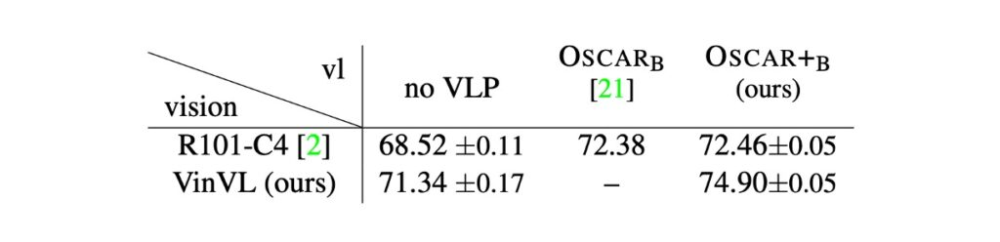
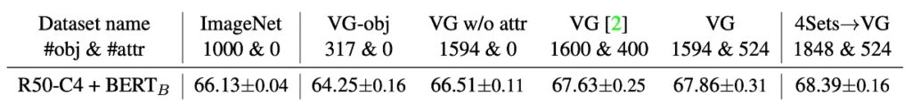
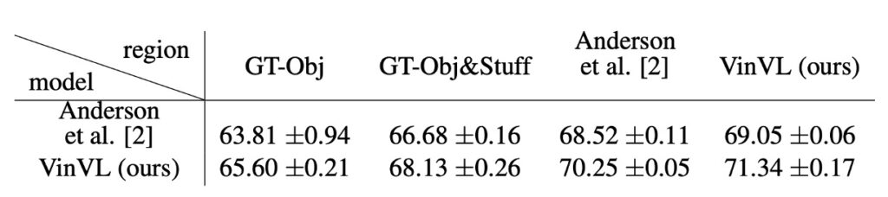

# [21.01] VinVL

## 再訪オスカー

[**VinVL: Revisiting Visual Representations in Vision-Language Models**](https://arxiv.org/abs/2101.00529)

---

前回のオスカーを読んだ後、続く研究がすぐに登場しました。

- リンク：[**Oscar**](../2004-oscar/index.md)

この論文の著者は、オスカーが良いモデルであることは認めつつも、視覚表現の探求が十分ではないという点を指摘しています。

では、どのようなアプローチが「十分に深い」と言えるのでしょうか？

この論文を詳しく見ていきましょう。

## 定義問題

著者は視覚言語事前学習（VLP）の分野に注力し、特に物体検出（OD）モデルの視覚表現の改善に焦点を当てています。多くの視覚言語（VL）タスクにおいて、視覚的特徴の有効性と豊かさは、モデルの性能に直接的に関わります。以下は、いくつかの主要な問題点です：

1. **豊かな視覚表現の必要性**

   現在の VLP 方法は通常、物体検出モデルが提供する視覚表現に大きく依存しています。著者は、これらのモデルが様々な VL タスクにおいて価値のある視覚情報を提供しているものの、特に複雑で多様な、そして意味が豊かな画像シーンを処理する上で改善の余地があると指摘しています。

2. **クロスモーダル融合モデルの効果**

   VLP は通常、事前学習された物体検出モデルと視覚と言語特徴を結合するためのクロスモーダル融合モデルの 2 つの部分で構成されています。多くの研究がクロスモーダルモデルの改善に焦点を当てていますが、著者は、より強力で意味豊かな視覚表現が同様に重要であることを強調しています。

3. **既存の物体検出モデルの限界**

   著者は、現在広く使用されている OD モデルが、一部の文献で「ブラックボックス」として扱われていることを明確に指摘しています。これらのモデルは、その訓練データセットやターゲットに限界があり、そのため様々な VL タスクにおける効果に影響を与える可能性があります。

4. **視覚的物体と概念の多様性**

   多くの実際のアプリケーションでは、モデルは画像内のさまざまな視覚物体や概念を認識し、理解する能力を持つ必要があります。現在のモデル、特に Open Images で訓練されたモデルは、これらの豊かで多様な視覚的コンテンツを十分に捉え、表現できていない可能性があります。

## 問題の解決

この論文では、著者は新しいアーキテクチャを提案するのではなく、以前の Oscar アーキテクチャの視覚特徴の最適化に焦点を当てています。

視覚言語モデルは通常、2 つの主要な部分で構成されます：画像理解モジュール（Vision）とクロスモーダル理解モジュール（VL）。Vision モジュールは画像を意味的な表現（q）（例：ラベルや検出されたオブジェクト）と高次元潜在空間での分布表現（v）（例：事前学習された Faster-RCNN モデルによって生成されたもの）に変換します。

その後、これらの視覚特徴は言語入力と一緒にさまざまな VL タスクに使用されます。本稿では、特に物体検出の事前学習と属性情報の注入に焦点を当て、画像理解モジュールの改善方法について詳しく探求しています。以下は、いくつかの重要な点です：

### 物体検出事前学習

- **データ処理**

  目標検出モデルの事前学習には、COCO、OpenImagesV5、Objects365V1、Visual Genome という 4 つの主要な公開データセットを使用しました。これらのデータセットは、さまざまなサイズと多様性を持つ画像とラベルデータを含んでいます。具体的には、クラス認識サンプリングや不均衡なデータセットへの貢献のバランスを取るなど、統一された大規模なコーパスを構築するために複数の戦略を使用しました。

- **モデルアーキテクチャ**

  モデルアーキテクチャに関しては、特徴金字塔ネットワーク（FPN）が目標検出タスクでは C4 モデルより優れているものの、C4 モデルは VL タスクに対してより効果的な領域特徴を提供します。

  :::tip
  **C4 モデルとは？**

  初めて見たとき、私も混乱しましたが、論文を参照してさらに調べた結果、C4 モデルとは、CNN アーキテクチャから抽出された 1/2^4（つまり 1/16）の特徴マップを指していることがわかりました！

  この参照文献内では、1/16 スケールの特徴マップが FPN よりも VL タスクのパフォーマンスを向上させると述べられており、この議論が本論文の著者によって採用され、ここで「C4 モデル」という用語が登場しています。
  :::

- **事前学習戦略**

  著者は、モデルのパフォーマンスを向上させるために、古典的および経験的な手法を組み合わせた一連の戦略を採用しています。

  - モデルの初期レイヤーをロック（freeze）し、最初の畳み込み層、最初の残差ブロック、およびすべてのバッチ正規化層を固定することで、低レベルの視覚特徴を保持し、初期の訓練中にこれらが破壊されるのを防ぎます。
  - データセットを拡張し、モデルの汎化能力を高めるために、水平反転やマルチスケール訓練など、さまざまなデータ増強技術を適用しました。

  著者が選んだ目標検出モデルの基本アーキテクチャは「X152-C4 アーキテクチャ」です。初期モデルのバックボーンの重みは、ImageNet-5K データセットで訓練されたモデルを基に初期化され、16 枚の画像のバッチサイズで 1.8M 回の反復訓練が行われました。

### 属性注入

目標検出モデル（OD）の訓練と微調整において、重要な方向の一つは、追加の情報や特徴をモデルに統合し、予測能力を向上させる方法です。

- **事前学習モデルと属性分岐**

  - 事前学習された OD モデル：基本的に、大規模なデータセットで物体検出モデルを訓練し、一般的な視覚特徴と物体検出の基本的な能力を学習させます。
  - 属性分岐の追加：この事前学習された OD モデルに、新たに物体の属性を予測する分岐を追加することで、物体検出を行いながらも、物体のいくつかの属性を識別し予測できるようにします。

- **Visual Genome（VG）データセットでの微調整**
  - 属性情報：ここでの属性とは、物体の色、形、サイズなどの特徴や特性を指し、VG データセットは 524 の属性分類を提供しています。
  - 微調整戦略：属性分岐をモデルに追加した後、VG データセットで微調整を行い、モデルがこれらの属性に関連する視覚特徴を学習し、物体検出タスクでこれらの属性の予測能力を高めるようにします。
  - 属性損失の重み調整：以前の研究よりも大きな属性損失重み（0.5 -> 1.25）を選択し、微調整プロセスで属性学習の重要性を強調し、最終的なモデルで物体属性のより精密な予測を実現します。

この方法は、VG データセットにおいて、モデルが物体を検出するだけでなく、物体の複数の属性を識別し予測できるようにし、従来のモデルと比較して顕著な優位性を示しました。

### 効率の向上

視覚言語タスクでは、物体の視覚的特徴や属性の豊富さが計算上の課題をもたらします。特に、特徴抽出の過程でその影響が顕著です。

- **非極大値抑制（NMS）の課題**

  視覚物体と属性の多様性により、クラス感知型の非極大値抑制（NMS）を後処理段階で使用すると、重なり合った境界ボックスを排除するために大量の計算リソースを消費し、特徴抽出の過程が非常に遅くなります。

- **効率向上の戦略**

  - クラス非感知型 NMS の使用：1 回の NMS 操作のみを実行するクラス非感知型 NMS を使用することで、計算の複雑さを削減し、操作の効率を維持します。
  - 畳み込み層の設定変更：元々 dilation=2 に設定されていた畳み込み層を、拡張を行わない畳み込み層に置き換えることで、計算効率を最適化します。

これら 2 つの主要な調整と変更により、領域特徴抽出の速度が顕著に向上し、VL タスクの下流での精度においても低下は見られませんでした。

:::tip
**空洞畳み込みとは？**

原文は Dilated Convolution で、畳み込みカーネル内に間隔（空洞）を挿入することで感受域を拡大する技術です。dilation > 1 の場合、畳み込みカーネルは入力をより疎にサンプリングし、出力特徴は入力特徴のより広範囲な領域から計算されます。これにより広範囲の情報を捕えることができますが、計算の複雑さも増します。
:::

## 討論

### 下游任務の表現

1. モデルのパラメータ効率を評価するため、最先端のモデル（SoTA）は三つのカテゴリに分けられます：

   - **SoTAS**: 小型モデル、Transformer ベースの VLP モデルが最適なパフォーマンスを達成する前のモデル。
   - **SoTAB**: BERT ベースに似たサイズの VLP モデルで最適なパフォーマンスを発揮するもの。
   - **SoTAL**: BERT Large に似たサイズの VLP モデルで最適なパフォーマンスを発揮するもの。

2. **OSCAR+**と**VINVL**は、7 つの視覚言語タスクで以前の SoTA を上回る結果を示しました。多くの場合、既存のモデルを大きく超えています。
3. **VQA**：OSCAR+B モデルは、VQA ランキングで最適なモデルを上回っています。
4. **GQA**：OSCAR+B と VINVL の組み合わせは、神経状態機械（NSM）を超えた最初の VLP モデルです。
5. **画像キャプション**：OSCAR+B モデルは COCO 画像キャプションランキングでトップを獲得し、263 のモデルを超えました。
6. **NoCaps**：VLP を使用せず、BERT ベースのモデルに新しい視覚特徴（VinVL）を加えることで、人間の CIDEr 性能を超えました。さらに VIVO での事前学習後、パフォーマンスは向上し、新しい SoTA を達成しました。

### 視覚特徴の重要性

著者は、二つの異なる視覚モデル（R101-C4 と X152-C4）および異なる視覚言語前処理（VLP）手法（VLP なし、OSCAR）が視覚問答（VQA）タスクでどのように機能するかを分析しました。X152-C4 と R101-C4 モデルは、それぞれ異なる視覚モデルアーキテクチャを表し、VinVL（4 つのデータセットを含む事前学習モデル）と他の VLP 方法が事前学習に使用されました。

1. **モデル比較とパフォーマンス向上**

   - **OSCAR vs. OSCAR+**：R101-C4 特徴を使用した OSCAR モデルをベースラインとして、X152-C4 特徴を使用した OSCAR+モデルに変更した結果、絶対精度は 72.38 から 74.90 に向上しました。
   - **貢献分析**：OSCAR+の事前学習は精度に 5%の向上を提供し、視覚特徴の改善による視覚事前学習は 95%の精度向上に貢献しました。

2. **視覚表現の重要性**
   - モデル比較を通じて、視覚表現が VLP と下流タスクにおいて重要な役割を果たすことが示されました。視覚モデルと VLP 方法は、結果の改善に顕著な貢献をしました。
   - VinVL と VLP の効果は加算的であり、視覚事前学習と VLP がそれぞれ視覚モデルと VL モデルに独立して改善をもたらしたことを示しています。

### 視覚概念多様性の影響

記事は、物体や属性の語彙の多様性が、特に視覚問答（VQA）タスクにおける視覚言語モデルに与える影響について探求しています。

- **視覚概念語彙の豊富さ**

  

  - より豊かな物体語彙は VQA 結果と正の相関関係にあります：モデルは、物体語彙がより豊富なデータセットで通常より良い VQA 結果を得ます。たとえば、VG w/o attr でのパフォーマンスは、VG-obj や ImageNet に比べて優れています。
  - 物体語彙と視覚概念の完全性：特定の視覚概念（例：「空」や「水」）は VQA タスクに非常に影響を与えることが証明されており、これによりより包括的な物体語彙がモデルパフォーマンスにおいて有利であることが明らかになりました。
  - 属性の使用は VQA 結果にとって極めて重要です。モデルが属性を識別するように訓練されている場合（VG または 4Sets→VG データセットで）、それらは訓練されていないモデルよりも優れたパフォーマンスを示します。
  - より小さな視覚モデル（例：R50-C4）でも、視覚事前学習は VQA パフォーマンスを向上させ、視覚事前学習の普遍的な効果を証明しています。

- **豊かな視覚意味が視覚言語タスクに与える影響**

  

  - COCO の groundtruth（GT-Obj および GT-Obj&Stuff）は物体位置の特定で優れたパフォーマンスを示しますが、語彙が限られています。対照的に、VG で訓練されたモデルは物体位置特定では COCO groundtruth より劣るかもしれませんが、より豊かな語彙を持っているため、VQA タスクにおいてはより有利です。
  - 従来の物体検出（OD）タスクに比べ、視覚言語（VL）内での OD タスクは豊かな視覚意味に依存しています。VL タスクで求められる視覚意味は、言語モダリティ内の豊かな意味と一致する必要があり、VL タスクにおける豊かな視覚語彙の重要性を強調しています。

## 結論

VinVL は、より多くの視覚特徴を導入しようとしていますが、依然としてクラスの概念に縛られています。選択された物体および属性クラスが十分に豊かでない、またはある程度の偏りが含まれている場合、モデルはすべての視覚概念を完全に捉えることができず、その結果、より広範な分野での応用可能性に制限を与えることになります。

また、モデルの規模と複雑さも顕著な問題であることが明らかです。著者はその問題を理解しており、推論速度の改善方法を示すセクションを特別に設けています。

VinVL モデルの大規模なアーキテクチャと複雑な計算過程は、高い計算リソースとストレージ能力を要求し、リソースが限られた応用シナリオにおける適用性と普及の範囲に制約を与える可能性があります。

最後に、属性と視覚概念の統合に関する問題も無視できません。モデルは、広範な視覚概念と属性をカバーするために複数のデータセットで訓練する必要があります。しかし、これらの異質なデータソースを統合し、一貫性を保ちながらその利点を最大限に引き出す方法は、非常に重要な課題であり、広範で一貫した応用可能性を持つモデルを実現するためにはまだ解決すべき大きな問題です。

VinVL モデルは、複数のデータセットでの訓練を通じて、物体認識と視覚属性の理解において非常に強力な能力と可能性を示しています。モデルはまだいくつかの課題に直面していますが、複数のタスクにおける優れたパフォーマンスとその広範な応用可能性は、視覚言語事前学習モデルとしての価値を示しています。
