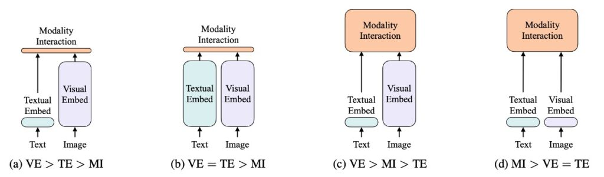
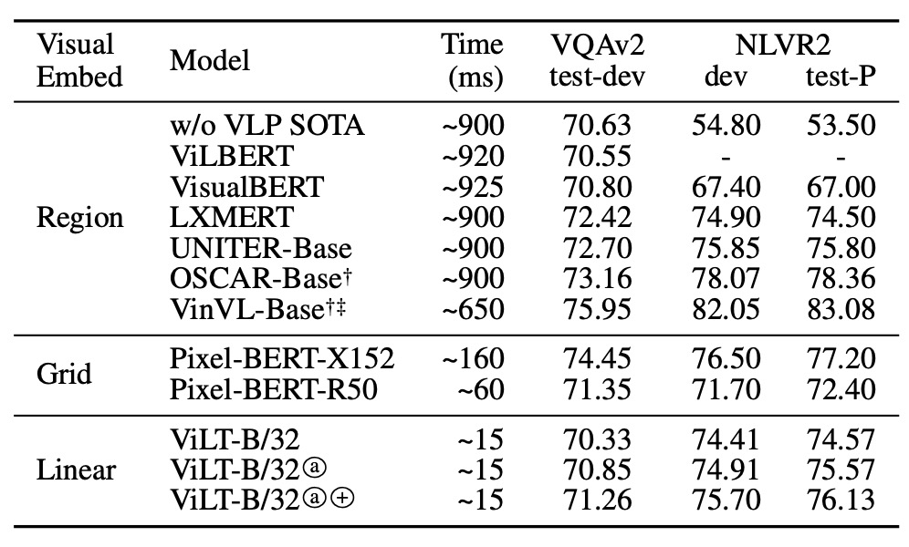

## あなたが歌い終わった後に私が登場

[**ViLT: Vision-and-Language Transformer Without Convolution or Region Supervision**](https://arxiv.org/abs/2102.03334)

---

Transformer が発表されたのは 2017 年のことです。

画像に特化した Vision Transformer（ViT）は 2020 年の終わりに登場し、その間に 3 年以上の時間がありました。

今回、そんなに待つ必要はありません。半年も経たないうちに、ViT は VLP（視覚と言語前処理）の視覚アーキテクチャとして採用されました。

過去数年間の研究では、主に VL モデルの視覚表現能力を向上させ、モデルの全体的なパフォーマンスを改善することに焦点を当ててきました。しかし、誰もが直面する現実は、物体検出の事前学習モデルが本当に重いということです！

そして、ViLT の著者は言っています。「この問題はそうあるべきではない、私たちはこのアーキテクチャ設計を完全に放棄すべきだ！」

## 定義された問題

著者が定義した問題と課題は、概ね以下のポイントにまとめることができます：

1. **複雑な視覚エンコードプロセス**

   現在の視覚と言語事前学習（VLP）モデルは、視覚エンコードを処理する際に深層畳み込みネットワークや事前学習された物体検出器を使用することが一般的です。このプロセスは通常非常に複雑で計算集約的であり、特に大量の画像を処理する必要がある場合、計算資源と実行時間に大きな課題をもたらします。

2. **重い視覚エンコーダの使用**

   現存の VLP モデルは、通常、画像の特徴を抽出するために重い視覚エンコーダに依存しています。これは計算資源にとって重大な負担となります。学術実験では、地域特徴の抽出プロセスを事前にキャッシュする方法でこの負担を軽減できますが、実際のアプリケーションでは、特に現場でのリアルタイムクエリ処理が必要な場合、この方法は実行不可能です。

3. **エンコード効率とパフォーマンスのバランス**

   多くの研究で、モデルのパフォーマンスを維持しつつ、エンコードの効率を高め、計算とストレージのコストを削減する方法を見つけることが課題となっています。また、過去のほとんどの研究は、視覚と言語タスクにおいて良好なパフォーマンスを実現しながら、より軽量で高速なエンコード方法やモデルアーキテクチャを提供することに重点を置いていませんでした。

4. **従来のモデルアーキテクチャの限界**

   従来の VLP モデルは視覚入力の処理に深層で畳み込みを使用したエンコード方法を用いています。これにより、モデルの複雑度と実行時間が増加し、ある程度はモデルの柔軟性と適応性を制限することになります。

## 解決問題

### ViLT 設計理念

:::tip
この図はクラシックな分析図です、見逃さないでください！
:::

著者は、視覚と言語モデルを以下の 2 つの次元で分類しました：

- 2 つのモダリティ（視覚と言語）が均等な表現レベルを持つかどうか（専用のパラメータおよび/または計算）。
- これら 2 つのモダリティが深層ネットワークで相互作用するかどうか。

これらの 2 点を組み合わせて、著者は 4 つのプロトタイプを導き出しました：

- **(a) タイプ**：視覚意味エンコーディング（VSE）モデル、例えば VSE++や SCAN。視覚と言語のエンコーダが分離されており、不均等であり、2 つのモダリティ間の相互作用は比較的浅いもので、通常は単純な点積や浅い注意層に基づいています。
- **(b) タイプ**：CLIP のようなモデル。2 つのモダリティに対して、別々で計算上等しいエンコーダを使用し、相対的に浅い層で相互作用を行います。
- **(c) タイプ**：深層相互作用型モデル。例えば、一部の最新の VLP モデルでは、深層変換器モデルを使用して 2 つのモダリティ間の相互作用を深層でモデル化しますが、視覚情報のエンコーディングには依然として計算集約的な畳み込みニューラルネットワークに依存しています。
- **(d) タイプ**：ViLT モデル。計算リソースのほとんどをモダリティ間の相互作用のモデリングに集中させ、原画像のエンコーディング層は比較的浅く、計算量が軽く、テキスト処理と似た計算量で処理されます。

これらの 4 つのモデルプロトタイプは、それぞれ異なる設計と計算のトレードオフを反映しています：

- **(a) タイプ**：計算量は比較的軽いですが、モダリティ間の深い相互作用能力が犠牲になります。
- **(b) タイプ**：視覚と言語のエンコーディングに計算資源を均等に分配していますが、相互作用は浅層にとどまります。
- **(c) タイプ**：モダリティ間の相互作用に多くの計算リソースを投入していますが、視覚入力の処理で計算集約的な畳み込みニューラルネットワークに過度に依存する可能性があります。
- **(d) タイプ**：計算資源を均等に分配し、深い相互作用を重視しています。

それぞれの設計選択には異なる利点と課題が伴います。例えば、2b タイプのモデル（CLIP のようなモデル）は、ゼロショット学習のシナリオでは優れたパフォーマンスを発揮しますが、深いモダリティ間相互作用が求められるタスクでは限界があるかもしれません。これらの分類は、視覚と言語モデルの設計の枠組みを提供し、異なる設計選択と方法が実際のアプリケーションで持つ可能性のある長所と短所を示唆しています。当然、実際のアプリケーションでは、具体的なシーンとニーズに応じてモデルを選択し、設計する必要があることを示唆しています。

### ViLT 設計細節

ViLT は視覚エンコードプロセスを簡素化することを目指し、Patch 投影戦略を採用し、視覚特徴処理能力を持つ ViT から初期化されています。このアプローチにより、VLP タスクでより効率的でリソース消費の少ないパフォーマンスを達成することを目指しています。全体的なモデルアーキテクチャは、パフォーマンスを保ちつつ計算の複雑さとリソースの必要性をできるだけ減らすことに重点を置き、軽量な多モーダル学習戦略を示しています。

1. **視覚エンコーディングの方法**

   ViLT は他の視覚と言語の事前学習（VLP）モデルと同様のテキストエンコーディング方法を使用していますが、視覚エンコーディングには違いがあります。一般的に BERT のトークナイザーとエンコーディング技術が採用されていますが、ViLT は視覚エンコーディングを簡素化しています。以下のいくつかの戦略を比較してみましょう：

   - **Region Feature**

   従来の方法では、物体検出器（例えば Faster R-CNN）から得られる地域特徴がよく使用されますが、ViLT はこの方法に依存せず、より直接的でシンプルなアプローチを取っています。

   - **Grid Feature**

   グリッド特徴は、畳み込みニューラルネットワーク（CNN）の出力特徴マップを視覚特徴として利用する方法ですが、ViLT ではこれを主要な特徴として使用していません。

   - **Patch Projection**

   ViLT は ViT（Vision Transformer）によって導入された Patch 投影エンコーディング方法を採用しています。この方法では、画像を小さなパッチに分割し、それらを線形投影することで、視覚エンコーディングを大幅に簡素化し、最小限の計算とパラメータで良好な結果を得ることができます。この方法では、わずか 2.4M のパラメータしか必要とせず、実行時間も無視できる程度です。

2. **モデルアーキテクチャ**

   - ViLT はシンプルなアーキテクチャを持ち、視覚エンコーディングにおいて単一ストリーム方式を採用しています。
   - 従来の多くの VLP モデルが BERT の重みを初期化に使用するのに対し、ViLT は ViT からインタラクション変換器の重みを初期化しています。これは、ViT が既に視覚特徴を処理する能力を持っていることを考慮し、ViT の特徴を活用してモデルのパフォーマンスを最適化することを目的としています。
   - ViT のスタック構成は、マルチヘッド自己注意（MSA）層と MLP 層を含み、ViLT はこの構成を基にテキスト情報を組み合わせて多モーダル事前学習を行います。
   - ViLT は 32×32 のパッチ投影を使用し、ImageNet で ViT-B/32 の事前学習済み重みを用い、微調整後に多モーダル学習タスクに適用します。

3. **エンコーディングの詳細**

   - 入力テキストには、トークンエンコーディング行列と位置エンコーディング行列が加算されます。
   - 入力画像はパッチに分割され、フラット化されてから線形投影と位置エンコーディングが行われます。
   - テキストと画像のエンコーディングとモダリティタイプエンコーディングベクトルは、連結（concat）され、組み合わせたシーケンスとして多層変換層を通じて最終的なコンテキストシーケンスが得られます。

### 事前学習戦略

著者は、画像と言語の特徴を組み合わせた複数の事前学習戦略を採用し、VLP モデルのパフォーマンスを向上させることを目指しました。

1. **画像と言語一致（Image Text Matching, ITM）**

   - **ランダムな画像の置き換え**：モデルの識別能力を強化するために、0.5 の確率で一致する画像をランダムに置き換えます。つまり、画像とその対応するテキスト記述が一致しない場合が 50％の確率で発生します。
   - **ITM ヘッド**：モデルは単一の線形層を使用して、プールされた特徴を 2 クラス分類に投影し、実際の一致の類似度を計算します。最終目標は、この一致に対する負の対数尤度損失を最小化することです。

2. **単語パッチ一致（WPA）**

   画像が「リンゴを食べている男」を示している場合、そのテキスト記述は「A man is eating an apple」になります。通常の画像と言語一致（ITM）では、モデルは画像全体とテキスト全体の関連性に注目します。

   一方、WPA は視覚とテキストの情報をより微細なレベルで一致させることに重点を置きます。つまり、画像の特定の領域（「リンゴ」）とテキスト記述の対応する単語（「apple」）を一致させることです。これにより、モデルは視覚と言語の対応関係を理解しやすくなり、後続のタスクでのパフォーマンス向上が期待されます。

   :::tip
   **IPOT（Inexact Proximal Transport）**

   IPOT は最適化された転送方法を指します。この文脈では、画像内の各小領域（パッチ）をテキストの特定の単語に最適に対応させる方法を示しています。IPOT アルゴリズムを使用して、画像領域の特徴を対応するテキスト特徴にマッピングする最適な転送計画を見つけます。転送過程での Wasserstein 距離を最小化する方法です。この距離は、2 つの分布の不一致度を反映します。
   :::

3. **マスクされた言語モデル（Masked Language Modeling, MLM）**

   - **ランダムマスク**：BERT から着想を得て、モデルはテキストの一部をランダムにマスクし、そのコンテキストに基づいてマスクされた部分を予測します。実験では、テキストの 15％がランダムにマスクされます。
   - **MLM ヘッド**：モデルは 2 層の MLP を使用してマスクされたトークンを予測し、最終的な目標は予測と実際のトークンとの負の対数尤度損失を最小化することです。

4. **全単語マスク（Whole Word Masking）**

   - これは、単語全体をマスクする戦略で、単語の一部やサブワードではなく、単語全体をマスクします。例えば、「giraffe」という単語は、BERT のトークナイザーで「[“gi”, “##raf”, “##fe”]」のように分割されるかもしれません。全単語マスクでは、「giraffe」全体をマスクし、部分的にではなく単語全体を隠します。これにより、モデルは画像情報をより適切に活用できます。
   - この操作は、[**Pre-training with whole word masking for Chinese BERT**](https://arxiv.org/abs/1906.08101)に基づいています。

5. **画像拡張（Image Augmentation）**

   画像拡張は視覚モデルの汎化能力を向上させることが示されています。著者は、RandAugment を使用して画像拡張を行いましたが、色の反転や切り取り戦略は除外しています。色の反転は、テキスト内にも色に関する情報が含まれているため使用されず、切り取りは画像内の重要な小物体を削除する可能性があるため使用されていません。

これらの戦略を組み合わせることによって、著者は画像と言語の相互作用を最大限に活用し、より強力で包括的な VLP 事前学習法を提供しようとしています。

## 討論

本研究では、モデルが複数のデータセット（MSCOCO、Visual Genome、SBU Captions、Google Conceptual Captions）で事前学習され、豊富な画像と言語の特徴をキャプチャすることを目的としました。

訓練中、ViLT は AdamW オプティマイザーを使用し、学習率のウォームアップと線形減衰戦略を適用して、学習率を適応的に調整しました。画像入力は元のアスペクト比を維持したまま、リサイズと対応するセグメント選択を行い、テキスト入力は BERT トークナイザーを使用して処理し、テキスト関連のパラメータをゼロから学習しました。

事前学習後、モデルはさまざまな視覚と言語の下流タスク（VQAv2、NLVR2 を使用した分類タスク、MSCOCO および Flickr30K を使用した検索タスク）で評価されました。実験では、モデルの出力を複数回実行して分析し、平均スコアと標準偏差を記録して、モデルのパフォーマンスに関する包括的なビューを提供しました。

この全過程は、64 台の NVIDIA V100 GPU 上で実行され、事前学習プロセスは 100K または 200K ステップをカバーし、下流タスクの訓練は 10 エポックで行われ、視覚と言語タスクの性能最適化を目指しました。

### パフォーマンスはどうだったか？

VQAv2 のシナリオにおいて、ViLT-B/32 は微調整を行い試験されたものの、他の複雑な視覚エンコーダを使用した VLP モデルと比較して、最適な VQA スコアには達しませんでした。分析によると、VQA タスクでは、質問が物体に関連している場合が多く、物体検出器を使用して生成された分離された物体表現が VQA 訓練を簡素化する可能性があるため、物体レベルの分析に特化したモデルがこのタスクでより高い精度を達成できる可能性があると指摘されています。

NLVR2 タスクでは、ViLT-B/32 モデルは、2 つの異なる画像からの情報を処理し、それに基づいて自然言語の質問に対して二項分類を行うという課題に直面しました。ペアリング戦略を通じて、モデルは各画像と質問を単一の入力ペアに組み合わせ、これらの入力ペアを処理します。ヘッド部では、異なる画像からの 2 つのプールされた表現を連結し、最終的な二項予測を行います。かなり複雑なシナリオにもかかわらず、ViLT-B/32 は両方のデータセットで競争力のあるパフォーマンスを示し、優れた推論速度を持つことから、性能と効率のバランスが取れたモデルとして評価されています。

:::tip
著者は VQA の結果を見た後、テキストからも失望が伝わってきます。論文内でもその点については簡単に触れられています。

他の説明を加えると：

VQA タスクにおけるモデルのパフォーマンスを深掘りすると、特定の観察と戦略が明確になります。VQA タスクでは、システムは通常、画像内の物体の特性や関係、または物体に関連するその他の属性に関する質問を受けます。たとえば、「この物体の色は何ですか？」や「画像の中に特定の物体がいくつありますか？」といった質問です。したがって、画像内の物体とその属性を理解することが、このタスクを解決するための鍵となります。

ここで提案されているように、物体検出器を使用して生成された分離された物体表現は、モデルが画像全体ではなく、画像内の個々の物体を認識し、その特徴（例：タイプ、サイズ、色など）を正確に分析する能力を高めます。

なぜこれが重要なのか？

VQA の典型的な質問を考慮すると、多くの質問は画像内の特定の物体について詳細に分析できるモデルを必要とします。例えば、「ボールは何色ですか？」という質問に答えるためには、モデルが画像内で「ボール」を認識し、その色を理解して説明する必要があります。物体検出器を使って物体の分離された表現を生成できれば、モデルはその物体をより正確に特定し、特徴を分析して正しい答えを出すことができます。

つまり、物体レベルの分析に焦点を当てたモデルは、画像全体の理解に基づいて推測するのではなく、各物体に関連する情報をより精密にキャプチャし、より正確にその物体に関する質問に答えることができるということです。このことが、物体レベルの分析に特化したモデルが VQA タスクで高い精度を達成する理由を説明しており、物体レベルの表現と理解を強化することで、VQA におけるパフォーマンスを最適化する道を示唆しています。
:::

### 最も重要な貢献

上の表に基づき、著者は 3 つの主要な操作を提案しました：

1. **より多くの訓練ステップ**

   モデルが長期間訓練されると、パフォーマンスが継続的に向上することが示されています。これは、他の条件が同じ場合、訓練ステップやイテレーション数を増やすことで、モデルの学習過程にポジティブな影響を与えることを示唆しています。モデルにもっと学習し、パラメータを最適化する機会を与えることで、訓練データにより良くフィットできるようになります。

2. **全単語マスク**

   マスク戦略は、モデルのパフォーマンス向上に貢献しているようです。この戦略は、モデルがコンテキストから語彙の意味情報を学習することを強制し、モデルの言語理解能力と生成能力を強化する可能性があります。

3. **画像拡張**

   画像拡張は、モデルの微調整段階でもパフォーマンス向上に貢献しました。画像拡張は、さまざまな画像処理技術（例えば、回転、切り取り、スケーリングなど）を用いてデータセットを拡張することにより、モデルがより堅牢な視覚特徴を学習し、その汎化能力を改善するのに役立ちます。

### 複雑度の分析

VLP モデルの複雑度分析は、いくつかの異なる観点から行うことができます。具体的には、パラメータ数、浮動小数点演算（FLOP）数、推論遅延などに関連しています。以下は、いくつかの重要な点についての詳細な議論です：

1. **パラメータ数**

   モデルのパラメータ数は通常、その複雑度と表現力に比例します。パラメータが多いモデルは、理論的にはより多くのパターンや規則を学習することができますが、過剰適合しやすく、訓練と推論の計算負担も大きくなります。

2. **FLOPs（浮動小数点演算）数**

   FLOPs の数は、モデルが一度の前向き伝播を実行するための計算コストを見積もるためによく使用されます。リソースが限られた環境で運用される場合（例えば、モバイルデバイスやエッジデバイス）、FLOPs の数が重要な関心事となります。画像解像度やシーケンス長さが FLOPs の数に影響を与えるため、モデルの計算複雑度はその入力データの大きさと関連しています。

3. **推論遅延**

   推論遅延は、モデルの予測効率を評価するための重要な指標であり、特にリアルタイムのフィードバックを必要とするアプリケーションで重要です。ViT および Transformer の推論遅延は、異なるハードウェア（例えば、Xeon E5-2650 CPU および NVIDIA P40 GPU）で顕著に異なり、モデルをデプロイする際の効率に対するハードウェア選択の影響が重要であることを示しています。

4. **入力解像度と長さ**

   異なる VLP モデルは異なる画像解像度を使用しており、これはモデルの設計目標と適用されるアプリケーションシーンに基づいています。解像度が高いほど、通常はより多くの詳細を含みますが、計算コストも大きくなります。

5. **入力シーケンスの処理**

   モデルが異なる長さの入力シーケンスを処理する場合、その効率とパフォーマンスは変化する可能性があります。シーケンス長さが 300 以下の入力に対して、Transformer の実行時間の変化は小さいことが示され、モデルの拡張性がある範囲内で高いことを示しています。

これらの複雑度の要素を総合的に考慮すると、VLP モデルの複雑度は計算コストやリソース使用に関連するだけでなく、モデルの適用シーンやパフォーマンスにも関連しています。これらの複雑度の起源と影響を理解することは、モデルの選択、最適化、そして実際のアプリケーションへのデプロイにとって非常に重要な指針となります。

## 結論

本論文が発表された時点では、ViT（Vision Transformer）がつい最近発表されたばかりで、多くの事柄や理論がまだ模索されている段階でした。

ViT が発表されてからは、多くの議論と改善の論文が登場し、トレーニング効率の向上や精度向上に関する研究や理論の議論が長期間続きました。

:::tip
この論文では、ViT アーキテクチャをすでに成熟した物体検出モデルと交換するという、リスクと機会に満ちた冒険的なアプローチが取られています。VQA タスクにおいて、この変更は技術指標の大幅な後退を招き、そのパフォーマンスは期待に届かなかったと言えます。
:::

しかし、ViLT は一部のアプリケーションシーンにおいて優れたパフォーマンスを発揮し、特に ViT が推論速度で驚異的な向上を示しました。リアルタイムアプリケーションにおいて、推論速度の向上は極めて重要であり、これによってモデルの現実のシーンでの適用性が大幅に向上し、将来的なアプリケーションの拡張への道が開けるでしょう。

ViLT の提案は、現在のモデル設計と事前学習に新たな方向性を示すものであり、また、将来の研究に対して非常に明確な要求を投げかけています。それは、モデルの規模を単に拡張するのではなく、内部のモダリティ間相互作用により注力するべきだということです。この新しいアプローチは、計算負担を増やすことなく、モデルのパフォーマンス向上を実現する可能性を示唆しています。

このようなモデルは、モダリティ間の相互作用と内部構造の最適化に焦点を当てた発展の方向性を指し示しており、将来的な研究は ViLT の潜在能力と限界を探るだけでなく、より多くの革新的なモデルやアプリケーション戦略を生み出すためのインスピレーションを提供するでしょう。
