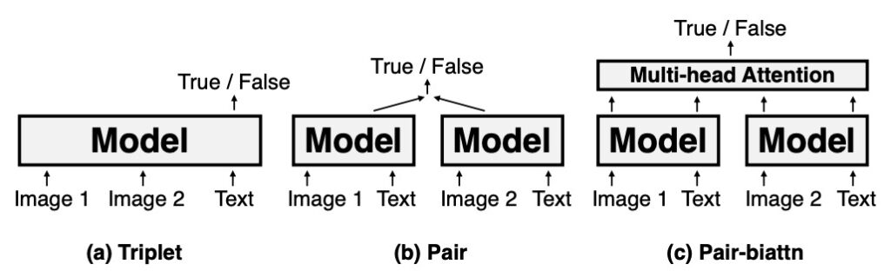
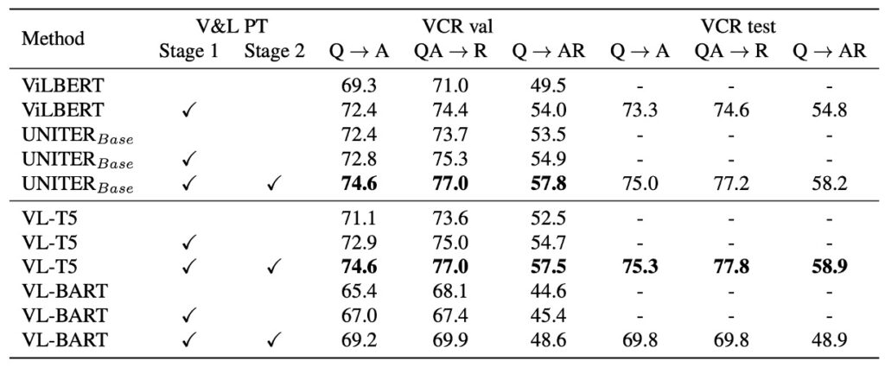

# [21.02] VL-T5

## 出力は整然としていること

[**Unifying Vision-and-Language Tasks via Text Generation**](https://arxiv.org/abs/2102.02779)

---

論文はすでにいくつか読んでいますが、いくつかのダウンストリームタスクの予測方法について、多少は理解していると思います。

まずは二つの例を見てみましょう：

最初の例は VQA（Visual Question Answering）です。一般的に、VQA タスクを実行する方法は図の (a) の通りです：

1. **物体検出**：最初に、物体検出器から画像中の物体結果を取得します。このステップは、画像中の主要な物体と特徴を識別し、位置を特定するために使用されます。

2. **Token 入力**：物体検出器から得られた結果をトークン形式に変換し、入力シーケンスの前に配置します。その後、質問もトークン形式に変換し、入力シーケンスの後ろに配置します。

3. **Transformer モデル**：画像と質問を統合したトークンシーケンスを Transformer モデルに入力します。Transformer モデルは深い自己注意計算を行い、コンテキスト情報を取得し、入力シーケンス全体の内容を表現するエンコードを生成します。

4. **予測ヘッドと Sigmoid 関数**：Transformer モデルの出力（通常は[CLS]トークンのエンコード）を専用の予測ヘッドに送ります。このヘッドは、各答え候補に対してスコアを計算します。その後、各スコアは sigmoid 関数を通じて 0 から 1 の間に圧縮され、これはモデルがその答えが正解である確率として解釈できます。

5. **Top-k 答えの選択**：モデルは各答えのスコアを高い順に並べ替え、スコアが最も高い Top-k の答えを最終的な出力として選びます。

多くの VQA データセット、特に選択肢付きのものは、予め定義された答えセットに制約される場合があります。これは、より適切な答えがあっても、モデルが答えセットに含まれていない場合、その詳細や情報を見逃す可能性があることを意味します。また、ある種の質問には複数の妥当な答えが存在する場合があり、この場合、モデルが評価時にうまくいかないことがあります。たとえその答えが特定の文脈では合理的であったとしてもです。

次の例は分類タスクです。分類タスクの実行方法は図の (b) の通りです：

1. **物体検出**：最初に、物体検出器から画像中の物体結果を取得します。このステップは、画像中の主要な物体と特徴を識別し、位置を特定するために使用されます。

2. **Token 入力**：物体検出器から得られた結果をトークン形式に変換し、入力シーケンスの前に配置します。その後、質問もトークン形式に変換し、入力シーケンスの後ろに配置します。

3. **Transformer モデル**：画像と質問を統合したトークンシーケンスを Transformer モデルに入力します。Transformer モデルは深い自己注意計算を行い、コンテキスト情報を取得し、入力シーケンス全体の内容を表現するエンコードを生成します。

4. **Softmax 予測ヘッド**：すべての画像トークンのエンコードを取得し、スコアを計算します。

5. **答えの選択**：分類の答えとして画像の中から一つを選びます。

この方法では、追加で画像分類用のヘッドを調整する必要があります。著者の観点から見ると、これは非常に手間がかかると考えています。

## 問題の定義

著者は現在の方法が視覚と言語のさまざまなタスクに対応する際、タスク固有のアーキテクチャと目的関数を設計する必要があると考えています。これにより、モデルの複雑性が増し、その汎用性と効果が制限されることになります：

1. **統一されたタスクアーキテクチャ**

   - 従来の視覚と言語の Transformer モデルは、異なる事前学習やダウンストリームタスクに直面する際、タスク固有の個別にパラメータ化されたアーキテクチャを設計する必要があることが多いです。これにより、モデルの設計と微調整が比較的複雑になります。
   - 新しいタスクが登場するたびに、モデルを再設計または微調整する必要があり、これが作業量と複雑さを増大させます。
   - 多くの視覚と言語のタスクに必要な推論能力は、大きな重なりがあります。

2. **オープンエンドな答えの生成**

   - 異なるタスクは、それぞれのラベルを異なる方法で表現する必要があります。例えば、現在の視覚質問応答法では答えを固定された集合の中の多クラス分類問題として扱いますが、実際には答えはすでに自然言語のテキストです。
   - 判別的手法はオープンエンドな質問に答える際に制約を受けます。なぜなら、事前に定義された答えのセットから選ぶことしかできず、オープンエンドな自然言語の答えを生成することができないからです。

3. **マルチタスク学習と汎用能力**
   - 現在の事前学習法は、タスク固有のアーキテクチャと目的関数を必要とし、これがその汎用性と効果を制限する可能性があります。
   - 従来の方法は、訓練過程で稀な答えに直面した場合、特に視覚質問応答における稀な答えに関して汎化能力に挑戦を受けます。

## 問題の解決

### VL-T5 モデルの設計

:::tip
T5 とは何ですか？

T5 (Text-to-Text Transfer Transformer) は自然言語処理のモデルで、その核心となるアイデアは、すべての言語処理タスクを、1 つのテキストを別のテキストに変換する課題として捉えることです。テキスト分類、翻訳、要約など、どんな目的であっても、T5 はそれを入力として 1 つのテキストを与え、関連する別のテキストを生成するものと考えます。このユニークな設計により、T5 はさまざまなタスクで優れたパフォーマンスを発揮し、同時にモデルの設計と適応性を簡素化しました。その仕組みや詳細に興味のある読者には、元の論文を直接参照することをお勧めします：

T5 論文リンク：**[Exploring the Limits of Transfer Learning with a Unified Text-to-Text Transformer (2019.10)](https://arxiv.org/abs/1910.10683)**
:::

VL-T5 の主な設計目的は、視覚と語彙の問題を統一して、多モーダル条件付きのテキスト生成にすることです。以下はその主な設計ポイントです：

1. **事前学習された Transformer モデルに基づく**

   - VL-T5 は、2 種類の事前学習された Transformer 言語モデル：T5Base に基づいています。
   - モデルが視覚入力を処理できるように、著者はそのテキストエンコーダを拡張し、画像領域を追加入力としてエンコードすることで、多モーダルエンコーダを作成しました。

2. **視覚エンコーディング（Visual Embeddings）**

   - Faster R-CNN に由来する画像表現を使用し、36 のオブジェクト領域を使って入力画像を表現します。
   - 各画像領域の特徴は、4 つの情報から構成されています：RoI オブジェクト特徴、RoI 境界ボックス座標、画像 ID、領域 ID。
   - 特徴エンコーディングに使用される方法には、線形層と学習エンコーディングが含まれ、画像 ID を使用して複数画像入力のシナリオを区別します。

3. **テキストエンコーディング（Text Embeddings）**

   - 多様なタスクに対応するため、特定のタスク専用のアーキテクチャを設計することなく、モデルは入力されたテキストに特定のプレフィックスを追加します。
   - エンコードされたパラメータは、エンコーダ、デコーダ、および言語モデルヘッドで共有されます。さらに、視覚的なタグも導入され、これらは画像の領域に対応し、クエリ、ラベル、オブジェクト間の対応関係を確立するのに役立ちます。

4. **エンコーダ-デコーダ構造**

   - Transformer のエンコーダ-デコーダ構造を使用して、視覚およびテキストの入力をエンコードし、ラベルテキストを生成します。
   - エンコーダは、テキストと視覚埋め込みを連結して入力として受け取り、その文脈の結合表現を出力します。
   - デコーダは、以前に生成されたラベルとエンコーダの出力に焦点を当て、テキスト生成を行います。

5. **出力形式は整然としている**

   - **統一フレームワーク vs. タスク特化型アプローチ**

     - 従来の方法は、特定のタスクに対して専用のアーキテクチャや目標を開発することが多いです。
     - VL-T5 は、新しいタスクごとにモデルを設計することなく、統一されたフレームワークを提供します。

   - **視覚的質問応答（Visual Question Answering）**

     - 従来のモデルは、視覚的質問応答を処理する際に、通常、上部に多層パーセプトロン（MLP）の多ラベル分類器ヘッドを導入します。これらのモデルは、二項交差エントロピー損失を使用して、Transformer 本体と一緒にトレーニングされ、VQA スコアで加重されます。
     - VL-T5 は、質問と回答をテキストとして扱い、同じ言語モデル目標を使用して視覚的質問応答の課題を解決します。

   - **参照表現理解（Referential Expression Comprehension）**
     - 従来の方法（例えば、UNITER）は、この問題に対するアプローチとして、画像領域の出力表現に MLP 領域評価ヘッドを追加し、通常は多クラスまたは二項分類の戦略を採用します。
     - VL-T5 は再びテキスト中心のアプローチを選択し、タスクのラベルを対応するテキストとして扱い、そのラベルを予測するために言語モデル目標を使用します。

### データセットの使用

- **MS COCO**

  これは目標検出、意味的ピクセル分割、画像キャプションなどのタスクに主に使用される人気のあるデータセットです。COCO の正式名称は「Common Objects in Context」であり、これは画像が単にオブジェクトを示すだけでなく、オブジェクトが実際の環境における文脈を提供していることを意味します。これは、深層学習とコンピュータビジョン分野での訓練と検証に広く使用されています。

- **Visual Genome (VG)**

  VG は、画像内のオブジェクト、属性、および関係を深く理解することを目的としたもう一つの人気のあるデータセットです。これは単にオブジェクトをラベル付けするだけでなく、オブジェクト間の相互作用や関係を含んでいます。

- **データセットの規模と詳細**
  - これら 2 つのデータセットには合計 18 万枚の異なる画像が含まれています。これにより、これらの画像は多数のシーン、オブジェクト、および状況を網羅しており、モデルを訓練するための豊富な視覚的情報を提供します。
  - 18 万枚の画像には 918 万の画像-テキストペアが含まれています。これは、各画像が単一の記述やラベルにとどまらず、複数のテキスト記述や情報と関連していることを意味します。これにより、画像とテキスト間の関連を理解するための豊富なコンテキストと詳細が提供されます。

### 事前訓練タスク

1. **多モーダル言語モデリング (MLM)**

   VL-T5 は、T5 (Text-to-Text Transfer Transformer) アーキテクチャを基にした多モーダルモデルのバージョンです。

   このモデルでは、モデルがテキストを理解して生成できるようにするため、ランダムに 15％のテキストトークンをマスク（または削除）し、「sentinel tokens」に置き換えます。事前訓練の主な目的は、マスクされたトークンを予測することです。このマスクと予測の方法は、モデルが文脈を理解し、関連するテキストを生成するのに役立ちます。

   この用語はどう翻訳すべきでしょうか？実際、私も確信はありませんが、文字通りに訳すと「哨兵トークン」になるのでしょうか？

   Sentinel tokens は、入力シーケンスでマスクされた部分を示す特殊なトークンです。これらは T5 の非監視型ノイズ除去訓練で重要な役割を果たします。入力シーケンスの一部がマスクされると、これらの sentinel tokens がその部分の代わりに使われ、出力シーケンスでは、これらの sentinel tokens と実際にマスクされた部分が共に現れます。

   :::tip
   例を挙げると：

   - 元の文：”The cute dog walks in the park”。
   - 「cute dog」と「the」がマスクされる場合、プロセスは次のようになります：
   - 入力シーケンス：”The [extra_id_1] walks in [extra_id_2] park”。
   - 出力シーケンス：”[extra_id_1] cute dog [extra_id_2] the”。
     :::

   この設計の理念は、非監視学習のシナリオで、特定のトークンを使用してマスクされた部分を示し、再構築することにあります。これは従来の [MASK] メソッドとは異なります。

   BERT モデルの [MASK] メソッドでは、すべてのマスクされた部分が同じ [MASK] トークンに置き換えられますが、T5 の sentinel tokens メソッドでは、各マスク部分に一意のトークン（例えば [extra_id_1]、[extra_id_2] など）が割り当てられます。これにより、モデルはマスクされた各部分をより正確に識別し、再構築することができます。

   [MASK] メソッドは、BERT のようなモデルの訓練に使用され、文脈を理解し、マスクされた部分を予測する能力を高めます。一方、sentinel tokens は T5 のテキストからテキストへの設計に合わせて作られたもので、この設計では、すべての NLP タスクが入力テキストから出力テキストの形式に変換されます。

   Sentinel tokens 自体は固定されていますが、それらが示す具体的な内容は動的であり、現在の文脈とモデルの予測に依存します。つまり、異なるコンテンツで同じ sentinel token が共有されても、意味が曖昧になることはなく、その意味はモデルの訓練または予測プロセスで明確に解釈され再構築されます。

2. **視覚的質問応答 (Visual Question Answering)**

   従来の VQA 方法では、通常、あらかじめ定義された答えの選択肢（例えば、固定の答えの語彙）があり、モデルはその中から最も適切な答えを選びます。この方法の制限は、定義された答えセットに存在しない答えを生成することができないことです。しかし、著者の提案する方法では、モデルが答えの元のテキストを直接生成することを可能にし、これによりモデルは定義された答えを選ぶのではなく、もっと柔軟にオープンエンドの質問に答えることができます。

3. **画像-テキスト一致 (Image-text Matching)**

   これは、画像とテキストの関連性や一致を判断するタスクです。例えば、ある画像が公園で遊ぶ犬であり、それに対応するテキストが「犬が草地でボールを追いかけている」というものであれば、これらの要素（画像とテキスト）が同じ内容や状況を表していれば、それらは一致していると言えます。

   画像-テキスト一致訓練を行う際には、通常、以下の 2 種類のペアが使用されます：

   - **正しいペア**：これは元々正しい画像とテキストのペアで、現実世界で一致していることを示します。
   - **誤ったペア**：これは意図的に作られた、画像とテキストが一致しないペアです。通常、画像と別のランダムに選ばれたテキストをペアにすることで作成されます。

   モデルのタスクは、各画像とテキストのペアが「真」（一致している）か「偽」（一致していない）かを予測することです。これは基本的に二項分類問題であり、モデルは画像とテキストから本当に一致している特徴を識別することを学ぶ必要があります。

4. **視覚的基盤 (Visual Grounding)**

   視覚的基盤または視覚的定位とは、モデルが特定のテキストや言語記述に対応する視覚的領域を画像内で特定できる能力を指します。これは、モデルが画像内の特定のオブジェクトや特徴を特定し、それを対応するテキスト記述と関連付けることを含みます。訓練時、モデルは特定の領域やオブジェクトを記述するテキストを受け取り、その記述に対応する画像の領域（通常は矩形枠または座標の集合として表現される）の一意の識別子や ID を予測します。

   視覚的基盤の訓練では、画像内のすべてのオブジェクトを詳細にラベル付けする必要はありません。つまり、訓練データには十分な情報（例えば、オブジェクトの位置とそれに対応する記述）が含まれているため、追加のラベル付けは必要ないことがあります。

5. **基盤付きキャプショニング (Grounded Captioning)**

   基盤付きキャプショニングとは、画像内の特定の領域に基づいてテキスト記述を生成するプロセスです。従来の画像キャプショニングは画像全体に対する記述を生成するのに対して、基盤付きキャプショニングは画像内の特定の領域やオブジェクトに対して記述を生成します。視覚的基盤は、テキスト記述に対応する画像領域を特定することを指しますが、基盤付きキャプショニングはその逆操作と考えられます：与えられた画像領域について記述するテキストを生成します。

6. **事前訓練の実行詳細**
   - 4 台の RTX 2080 Ti GPU を使用して、30 エポックの事前訓練を行い、合計で 4 日間を要しました。
   - AdamW を最適化器として使用し、特定のハイパーパラメータ設定を行いました。

## 討論

### VQA と GQA の分析

VL-T5 と VL-BART は、7 つの異なるダウンストリームタスクで、複数の既存の視覚と言語の事前学習 Transformer モデルと比較されました。結果として、VL-T5 と VL-BART の統一生成アプローチは、特定のタスクに特化したモデルとほぼ同等のパフォーマンスを示しました。その多くは識別的なモデルです。

しかし、VL-BART のパフォーマンスはあまり良くなく、著者はこの論文で主に VL-T5 に焦点を当てています。

1. **VQA と GQA のパフォーマンス**

   視覚的質問応答タスクは、与えられたコンテキスト画像に基づいてモデルに回答を提供させるものです。VQA と GQA の比較において、VL-T5 と VL-BART は、既存の方法と同等のパフォーマンスを達成しました。

2. **生成モデル vs. 識別モデル**

   現代の多くの方法は識別モデルであり、VQA タスクをマルチラベル分類問題として扱います。これらの戦略は特定のシナリオでは優れたパフォーマンスを示しますが、オープンエンドの実世界のシナリオにはうまく対応できません。それに対して、VL-T5 のような生成モデルは、特に見たことのない問題に対して、識別モデルよりも大きなパフォーマンスの向上を示すことがあります。

3. **データセット特定のプレフィックスの効果**

   研究により、異なるテキストプロンプトやプレフィックスがモデルの微調整結果に影響を与えることが示されました。VQA と GQA では、VL-T5 は事前学習と微調整で単一のプレフィックス「vqa」を使用しました。元のデータセット特定のプレフィックスを使用した場合と比較して、少しパフォーマンスが向上しました。これにより、単一のモデルで複数の VQA タスクを処理できることが示されました。

### NLVR2 の分析

NLVR2 タスクは、モデルが一対の画像に対して自然言語の記述が適用可能かどうかを判断するものです。このタスクは、画像と言語情報の統合能力をテストします。3 つのエンコーディング設定に分かれています：

- **Triplet**：この設定では、画像ペアとそれに対応するテキストが統合的にエンコードされます。
- **Pair**：この設定では、各画像とその対応するテキストが個別にエンコードされてから統合されます。
- **Pair-biattn**：Pair 設定に基づき、双方向注意機構が追加されています。

VL-T5 は NLVR2 のパフォーマンスにおいて、シンプルな Triplet エンコーディング設定で UNITER と同等のパフォーマンスを示しました。より複雑なエンコーディング設定（例えば Pair や Pair-biattn）では一定の性能差が見られますが、Triplet の計算効率を考慮すると、VL-T5 のパフォーマンスは非常に注目に値します。これは VL-T5 が視覚と言語タスクにおいて持つ可能性と多様性を浮き彫りにしています。

### VCR の分析

VCR（視覚常識推論）は選択肢応答タスクで、物体や動作の認識を超えた常識的な推論を要求します。各 VCR 問題には 4 つの選択肢と 4 つの理由選択肢があり、このタスクは 2 つのサブタスクに分けられます：質問応答 (Q→A) と答案証明 (QA→R)。全体の目標は、正しい答案を選ぶと同時に、その理由を正しく提供することです。

VL-T5 のアプローチは、ノゲラらの方法と似ており、モデルはコンテキスト（画像と質問）と各候補選択肢を連携させ、選択肢が正しいかどうかを基に「true」または「false」を生成します。推論時には、確率に基づいて選択肢を並べ替え、得点が最も高い選択肢を答えとして選びます。

VCR の検証セットで、未訓練のベースモデルと比較して、VL-T5 はより良いパフォーマンスを示しました。これは UNITER の結果とも一致します。VCR のテストセットにおいて、VL-T5 のパフォーマンスは UNITER に匹敵し、さらにはやや良好な結果を示しました。ViLBERT と比較して、VL-T5 はパフォーマンスを大幅に向上させました。

## 結論

Transformer のエンコーダとデコーダの設計アーキテクチャは頻繁に言及されます。VL-T5 の提案は、このアーキテクチャの深い探求であり、視覚と言語の統合タスクにおいてより良いパフォーマンスを実現することを目指しています。しかし、初期の試みでは飛躍的な成果を得ることはできなかったようです。

エンコーダとデコーダの組み合わせは多くのタスクで効果的であることが証明されていますが、特定の視覚と言語統合タスクでは、さらなる調整と最適化が必要かもしれません。これは、より精緻なアーキテクチャの調整や、異なる注意機構、または特定のタスクに適した事前学習戦略を含むかもしれません。

したがって、モデルのアーキテクチャを変更または調整するだけでは顕著なパフォーマンス向上が得られないかもしれません。重要なのは、豊富なデータを最大限に活用し、効果的な訓練戦略とタスク理解を深め、特定の問題に最適化を行うことです。

私たち自身の開発経験においては、エンコーダ単独で使用することで、モデルがデータの特徴を比較的簡単に学習できることがわかりました。エンコーダの主な目的は、入力データの重要な特徴をキャプチャし、それらを固定サイズの表現にエンコードすることです。この表現は通常、元の入力よりも簡潔で、最も重要な情報をキャプチャしています。アーキテクチャがシンプルなため、単独のエンコーダを訓練する方が完全なエンコーダ-デコーダの組み合わせよりも速く進みます。これにより、訓練時間とリソースが節約されます。

しかし、デコーダのメカニズムが導入されると、モデルの学習にはより多くのデータが必要になる傾向があります。これは、デコーダがエンコーダの固定表現から入力を再構築したり、新しい出力を生成したりするため、モデルの学習が複雑になるからです。大量のデータは、これらの複雑なマッピングを学習するために十分な例を提供します。デコーダの導入は、モデル全体のアーキテクチャを複雑にします。これにより、訓練すべきパラメータが増えるだけでなく、過学習のリスクも増大する可能性があります。

:::tip
このアーキテクチャを基に、データをさらに数桁増やせば、まったく異なる結論が得られるかもしれません？
:::

結論として、VL-T5 は視覚と言語統合におけるエンコーダとデコーダアーキテクチャの適用に対する新たな洞察を提供する価値のある出発点を示しました。今後、このアーキテクチャの潜在的な制約と利点をさらに探求し、調整と最適化を行うことで、より高いパフォーマンスを実現し、この分野の研究者に新たな道を開くことが期待されます。
