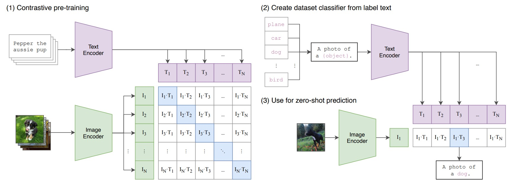

## 次元の壁を打破する

[**Learning Transferable Visual Models From Natural Language Supervision**](https://arxiv.org/abs/2103.00020)

---

以下の画像を説明してみてください：

<figure style={{"width": "60%"}}>

</figure>

- コーヒーがある…ええと、カップの下に本が一冊…それらはテーブルの上に置かれているのかな？
- これは朝のカフェの隅っこ？
- コーヒー色のテーブルと椅子、そしてコーヒー色のコーヒー？（~おい！ちゃんとしろ~）
- ……

実際、この画像は以下の説明文を使って生成されたものです：

> _静かな朝、日差しがカーテンの隙間から優しく木製のシンプルなテーブルに差し込んでいます。テーブルの上には淹れたてのコーヒーが置かれ、その香りと日差しが空気中で交わり、新しい日の温もりと希望を感じさせます。カップの影がテーブルの上に長い影を落とし、窓辺の緑の植物と美しい絵を作り出しています。コーヒーの表面は静かに揺れており、朝の静けさと生活の美しさを物語っているようです。テーブルの隣には開かれた本が静かに横たわり、持ち主の手に渡るのを待っています。この静かな朝、コーヒー、日差し、緑の植物、本が共に温かで静かなシーンを作り出し、それらは生活のシンプルさと美しさを語っているかのようです。_

もしあなたもこの画像を説明しようとしたら、現在、学術界やエンジニアリング分野で使用されている ImageNet データセット、私たちが誇りに思う 2 万を超えるカテゴリー、千万枚の画像がいかに無力に感じるかをはっきりと感じ取れるはずです。

- 同じ画像を説明する方法が無限にあるからです。

## 問題の定義

ImageNet を見てみると、1 枚の画像には階層的なカテゴリーや限られたラベルでその内容を説明することが多いです。しかし、人間の言語と認識能力は、この画像を無限の角度から解釈し、理解することができます。たとえば、色、形、感情、物語などを通じて、豊かな説明を提供することができます。

これが、単一モーダル学習と多モーダル学習の最大の違いです：前者は通常、単一の視点から情報を解析することしかできませんが、後者は異なるタイプの情報を統合し、より豊かで多面的な解釈を提供することができます。

ImageNet の単一ラベルカテゴリーでは、物体間の相互作用、状況背景、あるいは画像から生じる感情など、他の多くの有意義な情報がしばしば見落とされてしまいます。

CLIP の著者の目的は、これらの制限を打破し、テキストや画像など異なるソースや異なる種類の情報を組み合わせることで、モデルの理解と表現能力を豊かにし、人間の認識と理解により近づけることです。

では、どうすればよいのでしょうか？

## 問題解決

### モデルアーキテクチャ

上記の図は、CLIP が提案した事前訓練アーキテクチャです。

仮に、画像-テキストペアがあり、その一例として「かわいい子犬」というテキストと犬の画像があるとします。

1 つの訓練バッチで、CLIP はそのようなペアを複数受け取ります。画像エンコーダは ResNet や ViT を使って画像を処理し、画像特徴を取得します。一方、テキストエンコーダは Transformer を使用してテキストを処理し、テキスト特徴を取得します。

その後、モデルはこれらの特徴を比較して、正しいペア（例えば、犬の画像と「かわいい子犬」のテキスト）のコサイン類似度が最大になるようにし、誤ったペア（例えば、犬の画像と「りんご」のテキスト）のコサイン類似度が最小になるようにします。

その後は？

その後、4 億組の画像-テキストペアを積み重ねて、訓練を開始します！

### 大規模データセット

最初に使用されたデータセットは、主に MS-COCO、Visual Genome、YFCC100M です。

しかし、すぐにこれらのデータセットの規模は現代の要求には小さすぎることがわかりました。たとえば、MS-COCO や Visual Genome は高品質なデータセットですが、訓練用の写真は約 10 万枚しかなく、35 億枚の Instagram 写真を処理する他のコンピュータビジョンシステムと比べると、非常に小さな規模です。

また、YFCC100M は 1 億枚の写真を持っていますが、多くの画像のタイトルや説明情報の品質が非常に低いため、自動生成されたファイル名やカメラの露出設定など、モデルの訓練にはあまり役立ちません。

既存のデータセットが規模も品質も不足しているので、なぜ自分たちで新しいデータセットを作らないのでしょうか？

そこで、著者たちは新しい大規模データセットを作成することに決め、WIT（WebImageText）という名前のデータセットを作りました。このデータセットは、インターネットの公開リソースから収集された 4 億組の画像とテキストで構成されています。

:::tip
データセットのダウンロード先はこちら：[**WIT : Wikipedia-based Image Text Dataset**](https://github.com/google-research-datasets/wit#wit--wikipedia-based-image-text-dataset)
:::

### 訓練の詳細

モデル訓練の詳細に関して、著者たちは 5 種類の ResNet と 3 種類の Vision Transformer モデルを訓練に使用しました。

ResNet シリーズでは、ResNet-50 と ResNet-101 を訓練し、その後、ResNet-50 をベースに、EfficientNet スタイルでモデルスケーリングを行い、RN50x4、RN50x16、RN50x64 の 3 つの異なる規模のモデルを作成しました。これら 3 つのモデルは、ResNet-50 の計算量のそれぞれ 4 倍、16 倍、64 倍です。

ViT モデルに関しては、ViT-B/32、ViT-B/16、ViT-L/14 の 3 つの異なる規模のモデルを訓練しました。各モデルは 32 エポックで訓練され、最適化器として Adam を使用し、解耦重み減衰正則化と余弦アニーリング学習率戦略を適用して、訓練の安定性と効率を確保しました。

初期のハイパーパラメータの設定は、ベースラインの ResNet-50 モデルで、グリッドサーチ、ランダムサーチ、手動調整を組み合わせて行われました。その後、計算資源の制限により、これらのハイパーパラメータは、より大きなモデルに適応するために経験的に調整されました。

訓練の安定性を確保するために、学習可能な温度パラメータ τ は 0.07 で初期化され、logits のスケーリングが 100 を超えないように切り詰めを適用しました。訓練を加速し、メモリを節約するために、非常に大きなミニバッチサイズ 32,768 を採用し、混合精度、勾配チェックポイント、半精度 Adam 統計、および半精度ランダム丸めテキストエンコーダの重みなどの技術を適用しました。

ハードウェアに関して、最も大きな ResNet モデルである RN50x64 の訓練には、592 個の V100 GPU を使用して 18 日間実行する必要があり、最も大きな Vision Transformer モデルの訓練には、256 個の V100 GPU を使用して 12 日間実行する必要がありました。特に、ViT-L/14 モデルの性能を向上させるために、より高解像度の 336 ピクセルで追加の 1 エポックの事前訓練を行い、このモデルを ViT-L/14@336px と識別しました。

:::tip
この 592 個の V100 GPU の規模は、非常に驚異的で、羨ましい限りです。
:::

## 討論

### ゼロショット？

CLIP はある範囲では確かに期待通りの結果を示しましたが、改善が必要な点もいくつか明らかになりました：

1. **特定のデータセットでの優れたパフォーマンス**：

   いくつかの特定のデータセットでは、例えば、基底特徴の表現が比較的明確なデータセットにおいて、ゼロショット CLIP の性能は完全監視型分類器に匹敵するか、またはそれを上回ることがあります。これは、ある状況ではゼロショット学習が効率的な代替手段を提供する可能性があることを示しています。

2. **性能の一致**：

   CLIP と少数サンプルのロジスティック回帰分類器との比較は、CLIP の強力なパフォーマンスを際立たせます。例えば、複数の動物を含む画像分類タスクで、ゼロショット CLIP はテキストによる記述を通じて未見のカテゴリ（例えば、訓練データに含まれていない「シマウマ」）を識別することができる一方で、少数サンプル分類器は同じ性能を達成するためにより多くの訓練データを必要とするかもしれません。

3. **ゼロショット転送効率**：

   異なるデータセットにおけるゼロショット転送効率の違いは、データセットの難易度と多様性を反映しています。例えば、単純なデータセットではゼロショット転送が少数のサンプルで済む一方で、複雑で多様なデータセットでは同じパフォーマンスを達成するためにより多くのサンプルが必要となることがあります。

4. **完全監視分類器との比較**：

   多くのケースでは、完全監視型分類器のパフォーマンスがゼロショット CLIP を上回り、従来の分類タスクでは、完全監視学習が依然としてより安定した選択肢であることを示しています。

5. **性能予測の線形傾向**：

   完全監視型とゼロショットのパフォーマンス間に正の相関が見られることは、ゼロショット学習の性能をさらに改善する可能性があることを示唆しています。例えば、完全監視のデータ量を増やすか、基底特徴の学習を改善することによって、ゼロショット学習のパフォーマンスが向上する可能性があります。

6. **スケーリングモードの考察**：

   CLIP のゼロショット性能の対数線形スケーリング傾向は、モデルサイズ、訓練データの多様性など、複数の要因によって影響を受ける可能性があります。さらに分析を進めることで、これらの傾向に影響を与える具体的な要因を特定し、ゼロショット学習のパフォーマンスを改善する方法を提供できるかもしれません。

### 表現能力はどうか？

以下のいくつかの側面を深く分析することで、CLIP モデルの強みと潜在的な限界についてより明確に理解することができます：

1. **表現品質の評価**：

   CLIP モデルは線形分類器を上手に適合させ、複数のデータセットでその性能をテストすることにより、表現学習の能力を効果的に示しました。しかし、このモデルが未見のデータセットや極端な状況下でも同じ性能を維持できるかどうかについては、さらに探求する必要があります。

2. **線形分類器の有用性**：

   線形分類器を使用した評価により、モデルが事前訓練段階で得た汎用的かつ一般化可能な表現が強調されました。これは有用なフィードバックを提供しますが、モデルの表現が特定の特徴に過度に依存している場合、異なるタスクに対する適応性に影響を与える可能性があるなど、潜在的な欠点も浮き彫りにしました。

3. **モデルの規模と性能**：

   CLIP の異なるモデル規模（例えば、ResNet-50×64 や CLIP ViT）は、モデルの規模と表現能力および計算効率との関連を示しています。しかし、大規模モデルはより多くの計算リソースを必要とするため、リソースが限られたデバイスでの利用に制限が生じる可能性があります。

4. **タスクの多様性**：

   CLIP は、地理位置特定、光学文字認識（OCR）、顔の感情認識、動作認識などの複数のタスクで優れた性能を発揮しています。例えば、OCR タスクでは、CLIP は異なるフォントや色のテキストを効果的に認識できます。しかし、特定のタスクにおいて、より専門的なモデルの方が優れている可能性があるため、さらなる検討が必要です。

5. **より広範なデータセット評価**：

   27 の異なるデータセットでの評価により、CLIP が表現の汎用性と計算効率の面で強力であることが示されましたが、データ偏向の問題が存在する可能性もあり、多様で異なる分布を持つデータセットに対する性能の検証がさらに必要です。

6. **自己監視システムの性能**：

   SimCLRv2 などの自己監視システムと比較して、CLIP は相対的に優れた性能を示しました。しかし、自己監視学習の効率と効果が今後さらに向上するかどうかについては、時間と多方面からのテストが必要です。

7. **先進モデルとの比較**：

   Noisy Student EfficientNet-L2 などの先進的なモデルと比較すると、CLIP は多くのデータセットで優れたパフォーマンスを示していますが、特定のタスクやデータセットにおいては、まだ不足が見られる可能性もあります。

### ドメイン横断は可能か？

深層学習モデルの性能とロバスト性を探る際、ドメイン横断（cross-domain）の能力は重要な評価基準となります。理想的には、モデルは異なるデータセットや分布においても良好な性能を維持すべきです。しかし、前述のように、ImageNet で訓練された多くのモデルは、新しいまたは未見のデータ分布に直面すると、その性能が大幅に低下することが多いです。

従来の ImageNet モデル（例えば、ResNet-101）は、これらの新しいデータセットでの精度が元々の ImageNet 検証セットでの精度に比べてかなり低いです。これらのモデルはドメイン横断性能に大きな欠陥があり、データ分布の偏移に影響されやすいです。

ゼロショット CLIP モデルは、これらの新しいデータセットで従来の ImageNet モデルよりも明らかに優れた性能を示し、ImageNet 精度と分布偏移下での精度の差を効果的に縮小しました。分析によると、ゼロショット分類器は ImageNet 分布に適応後、精度が 9.2％向上しました。しかし、分布偏移の状況に直面した際、精度はわずかに低下しました。

### 人間と比較できるか？

CLIP モデルと人間の性能の差を理解するために、著者は特定のタスクで比較を行いました。彼らは Oxford IIT Pets データセットを選び、5 人の参加者に対して、3669 枚の画像の中で猫または犬の品種ラベルを付けるという課題を与えました。このとき、参加者はどの品種のサンプルも見ていませんでした。別の実験では、参加者に各品種の 1 枚または 2 枚の画像サンプルを参考として提供しました。これにより、著者は人間がいくつかのサンプルを与えられた後、分類精度をどのように改善するのかを理解しようとしました。

結果として、別のデータセットである STL-10 では、人間は 94％の精度に達し、特定のサブセットでは精度が 97〜100％に達することが示され、これが人間のこのタスクにおける強力な能力を示しています。各クラスに 1 枚のサンプルしかない場合、人間の平均パフォーマンスは 54％から 76％に向上しましたが、追加のサンプルは大きな助けにはならなかったものの、混乱を招く画像には非常に役立ちました。これにより、人間は自分の不確実性を認識し、新しい情報に基づいて判断を調整する能力が高いことが示されています。

しかし、CLIP モデルはゼロショット学習において潜在能力を示し、自然分布の偏移テストでも良好な性能を発揮しましたが、少量のサンプル学習においては、人間のパフォーマンスとの間に依然として顕著な差が存在します。研究者は、人間は少量のサンプルを効果的に活用して分類精度を向上させることができる一方で、CLIP モデルはこの点で十分な性能を示していないと指摘しています。特に先験的知識を活用する能力において、人間は CLIP モデルを大きく上回っていることが明らかです。

### モデルは答えを見ていないか？

大規模なインターネットデータセットで事前訓練を行う過程で、無意識のうちに下流の評価データセットとの重複が発生するという問題があります。このような重複は、モデルが評価時に異常に良い結果を示す原因となることがありますが、実際にはその真の一般化能力を反映していない場合があります。

研究で示されたように、いくつかのデータセットは、その独自性や合成の特徴により重複が発生しない場合があります。例えば、MNIST、CLEVR、GTSRB などです。しかし、YFCC100M のような公開データセットを元に構築されたデータセットでは、重複が明らかに存在することがあり、例えば Country211 では、その重複率は 21.5%に達しています。

分析によると、それでもこの重複が精度向上に与える効果は非常に限定的であり、Country211 での精度向上は 0.2%に過ぎません。これは、下流のタスクに関連する特定の情報が、重複したアイテムの訓練テキストでカバーされていないためだと考えられます。また、Kinetics-700 データセットなど、特定の状況では、重複アイテムが実際には無関係な黒い遷移フレームであり、これが重複部分の精度を 20%低下させる結果となりました。

重複分析は微妙で複雑な問題であり、データの重複度合いだけでなく、基底となるデータ分布の変化や他の潜在的な混乱要因にも注意を払う必要があります。例えば、CIFAR-100 データセットでは、画像の解像度が非常に低いため、重複した画像が実際には小さな物体（鳥や飛行機など）の誤報であることがあり、これがクラス分布や重複の難易度の変化を引き起こし、その結果として精度の変動に影響を与える可能性があります。

これらの観察結果は、以前の大規模事前訓練に関する研究の重複分析結果とも一致しています。例えば、Mahajan（2018 年）や Kolesnikov（2019 年）の研究では、類似の重複率と全体的な性能変化の微小性が指摘されています。重要なのは、これらの研究が異なる重複データ削除戦略を比較した結果、著者が選択した方法と代替戦略との間にほとんど違いがないことが示されたことです。これにより、重複分析がモデルの一般化性能を理解し改善するための重要性、また訓練前に重複を認識し対処することの重要性が再強調されました。

著者は論文の中で、探査器が代理訓練タスクでほぼ 100％の精度を示し、手動チェックと閾値調整により非常に高い精度に達したものの、4 億個のサンプルのリコール率を簡単に確認できないため、完璧な評価には限界があることを指摘しています。さらに、重複部分とクリーンな部分の間で基底データ分布の変化が分析に影響を与える可能性もあります。例えば、Kinetics-700 データセットの多くの「重複」部分が実際には黒い遷移フレームであり、これが重複部分の精度を 20％低下させました。

また、著者はより微妙な分布の変化が存在する可能性についても言及しています。例えば、CIFAR-100 データセットでは、画像の解像度が非常に低いため、重複した画像が鳥や飛行機などの小さな物体の誤報である場合があります。この精度の変化は、クラス分布や重複の難易度の変化によって引き起こされる可能性がありますが、残念ながら、これらの変化は過剰適合の影響を隠してしまう可能性があります。

### 制限は何か？

CLIP モデルは一部の励みになる能力を示していますが、依然として多くの重大な制限があります：

1. **性能の制限**

   一部の監視訓練されたデータセットにおいて、ゼロショット CLIP の性能は ResNet-50 特徴を基にした線形分類器と同等ですが、ほとんどのデータセットでは、その性能は現存の技術水準に遠く及びません。拡張方法で改善が見られますが、最先端の性能を達成するには、CLIP の計算量は約 1000 倍増加する必要があり、現行のハードウェア条件では、この拡張は非現実的です。

2. **タスク学習と転送能力**

   CLIP は特定のタスクにおいて依然として低い性能を示しています。例えば、細粒度分類（車種、花の種類、飛行機のバリエーション）や、より抽象的でシステム的なタスク（画像内のオブジェクト数の計算など）を処理する能力に欠けています。

3. **一般化能力**

   CLIP は多くの自然画像の分布で良好な性能を発揮しますが、実際に分布と一致しないデータに直面すると、そのゼロショット性能は大幅に低下します。例えば、CLIP は MNIST の手書き数字認識で 88%の精度しか達成できず、元のピクセルでのロジスティック回帰のベースライン性能はゼロショット CLIP を上回ります。これは、CLIP が深層学習モデルの一般化の脆弱性に関する根本的な問題にほとんど対処できないことを浮き彫りにし、膨大で多様なデータセットを使って訓練し、すべてのデータが効果的に分布することを仮定することがいかに甘い仮定であるかを示しています。MNIST の例がその証拠です。

4. **データと計算効率**

   CLIP モデルは膨大なデータと計算資源を必要とし、その訓練過程は現行のハードウェアにとってはあまりにも大規模で、全ての訓練サイクルを完了するには数百年かかる可能性があります。現行の自己監視学習および自己訓練法は、データ効率を向上させる可能性を示しており、これらの方法を組み合わせることで CLIP のさらなる進展に向けた方向性が提供されるかもしれません。

5. **評価と最適化**

   - 本論文の方法にはいくつか明らかな制限があります。ゼロショットモデルに焦点を当てていますが、研究者は依然として CLIP の開発をガイドするために、完全な検証セットでの性能を繰り返し確認しています。これらの検証セットは通常数千の例を含み、これは真のゼロショットシナリオには不適切です。半監督学習分野でも同様の懸念が提起されています（Oliver ら、2018 年）。
   - ゼロショット設定から少数ショット設定に移行すると、パフォーマンスが直感的に低下し、CLIP の少数ショット学習に関する最適化が改善される必要があることを示しています。

6. **社会的偏見と倫理的考慮**

   CLIP モデルはネット上の画像とテキストのペアを使って訓練されており、これらのデータはフィルタリングや策定を経ていないため、モデルが社会的な偏見を学習する可能性があります。

今後の研究では、CLIP の強力なゼロショット性能と効率的な少数ショット学習方法をどのように組み合わせるかを探求し、より包括的で信頼性の高い視覚と言語理解モデルを実現するための方向性を提供することが求められます。

### データからの悪意

- **バイアス（Bias）**

  本論文では、著者がデータによるバイアスと悪意について深く掘り下げ、さまざまな分析と事例を通じて、これらの問題が社会や個人に与える影響を示しています。異なるソースのデータとその潜在的なバイアスを探ることで、著者は読者や政策立案者にデータの重要性と潜在的リスクについての理解を深めるよう呼びかけています。

  最初に、著者はデータ収集と処理の過程が主観的な影響を受ける可能性があり、その結果としてデータが客観性を欠く場合があることを指摘しています。例えば、データが収集者の主観的なバイアスによって歪められたり、特定の処理方法によって重要な情報が無視されることがあります。

  次に、著者は一連の例を通じて、これらのデータバイアスがさまざまな状況でどのように悪影響を与えるかを説明しています。人種的バイアス、性別差別、経済的不平等といった問題を挙げ、これらの問題がデータバイアスとどのように相互作用して、さらに深刻な社会問題を引き起こすかを解説しています。

  著者はまた、データ自体が無実であっても、適切に処理されなければ深刻な結果を招く可能性があることを警告しています。これらの問題を避けるためには、データガバナンスの仕組みを整備し、データの使用者や政策立案者がデータのリスクを理解し、対応できるようにすることが重要だと強調しています。

  最後に、著者はデータに関わるすべての人々と機関に対して、データの処理と使用に責任を持ち、公正で透明かつ持続可能なデータエコシステムを構築するよう呼びかけ、社会の公正と進歩を促進するよう提案しています。

- **監視（Surveillance）**

  本論文では、著者が普及しつつあるコンピュータビジョンモデルの監視分野での応用と影響についても深く掘り下げています。特に、監視カメラ映像の分類やゼロショットでの有名人認識におけるモデルの性能に焦点を当てています。論文の目的は、これらのモデルの性能と限界を分析し、研究コミュニティに対して将来の影響について理解を深め、監視システムに関する規制やチェックの策定を支援することです。

  まず、著者はモデルが監視カメラ（例えば、CCTV）でキャプチャされた低解像度の画像でどのように機能するかをテストしました。VIRAT データセットと Varadarajan & Odobez が提供したデータを活用し、著者は自ら構築した粗粒度分類と細粒度分類で、12 の異なる映像シーケンスからキャプチャされた 515 枚の監視画像をテストしました。粗分類は画像の主要なテーマを識別するもので、例えば画像が空の駐車場か学校のキャンパスであるかを判断するものです。細粒度分類では、モデルが小さな特徴（例えば、角に立っている人）を識別できるかどうかを判断します。粗分類のタスクでは、モデルは 91.8％の Top-1 精度を達成しましたが、細粒度検出と「圧力テスト」では、精度が 51.1％に低下し、「最も近い」選択肢を誤って選ぶ確率が 40.7％に達しました。

  次に、著者はゼロショットでの有名人認識の性能も検討しました。CelebA データセットを使用して CLIP のゼロショット性能をテストし、特定のタスクに関するデータセットを使わずに、事前に訓練された公開データのみでモデルの ID 検出性能を評価しました。その結果、8,000 枚の「野外」有名人画像を使用したタスクでは、モデルは 100 の可能なカテゴリの中で 59.2％の Top-1 精度を達成しました。しかし、カテゴリ数が 1,000 に増加すると、精度は 43.3％に低下しました。Google の有名人認識などの商業レベルのモデルと比較すると、この性能は競争力に欠けますが、ゼロショット認識機能に基づいて追加のタスク特有のデータセットなしで実行可能であることを示しています。

  最後に、著者は CLIP がゼロショット機能において顕著な利点を持ち、データが比較的少ないタスクに魅力的である一方で、多くのオンデマンド監視タスク（例えば、顔認識）には大規模なデータセットと高性能な監視モデルが存在し、CLIP の相対的な魅力は低いことを指摘しています。また、CLIP は一般的な監視関連のタスク（例えば、物体検出やセマンティックセグメンテーション）には適しておらず、監視タスクにおける利用には限界があります。しかし、CLIP は訓練データへの依存を軽減しており、特定のカスタマイズされたモデルやデータセットがなくても、特定のニッチな監視ユースケースを実現する可能性があり、このようなアプリケーションの構築におけるスキル要件を低減します。

## 結論

本研究は、自然言語処理（NLP）における大規模な事前訓練をコンピュータビジョン分野（CV）に転送することに成功した CLIP モデルの強力な能力を示しました。また、多タスク学習とゼロショット転送における CLIP の能力も明らかにしました。

最後に、論文で言及された貢献と将来の展望を整理します：

1. **貢献**：

   - **多モーダル学習**：CLIP モデルの革新は、画像とテキスト情報を同時に処理できることにあります。大規模な事前訓練と自然言語のプロンプトを使用することで、モデルはさまざまなタスクに対応する学習と適応を実現しました。
   - **ゼロショット転送学習**：自然言語プロンプトを通じて、CLIP モデルは強力なゼロショット転送能力を示し、特定のタスクデータがなくても良好な性能を発揮しました。
   - **スケーラビリティ**：十分な規模で訓練された CLIP モデルは、特定のタスク用監視モデルと同等の性能を発揮し、その訓練と運用のスケーラビリティが証明されました。

2. **将来展望**：

   - **説明能力の不足**：CLIP モデルはテキストと画像情報を統合し、自然言語である程度の説明を提供することができますが、依然として説明能力に限界があります。例えば、高度な抽象レベルでは説明が提供されることがありますが、低レベルや詳細な決定過程の説明が欠けている場合があります。さらに、モデルの内部にある複雑なニューラルネットワークの構造や、訓練データのバイアスによって、その説明が常に正確または信頼できるとは限りません。
   - **性能改善の余地**：CLIP は多くのタスクで強力な性能を示しましたが、特に特定のタスクに特化した監視モデルと比較した場合、改善の余地があることが示唆されています。

また、著者は社会的影響についても深く議論し、プロジェクトに参加したすべての関係者と技術的サポートを提供したソフトウェア開発者に感謝の意を示しました。本研究は、異なる分野の技術探索に貴重な洞察を提供し、今後の多モーダル学習の発展に新たな可能性を開きました。
