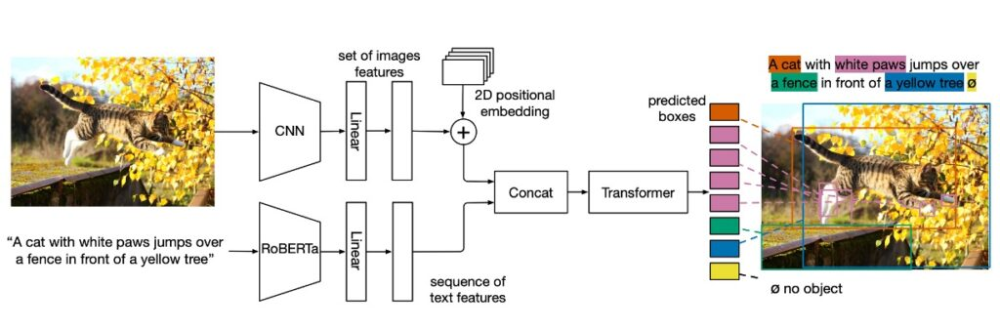
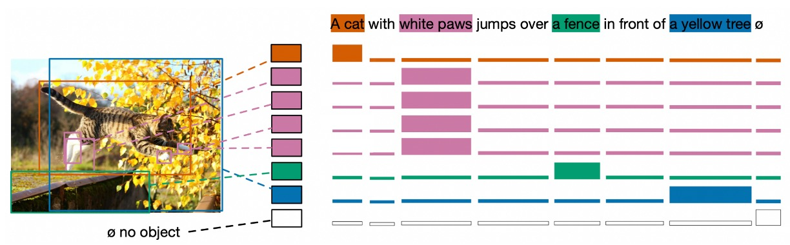
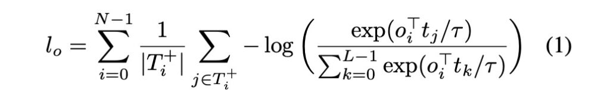
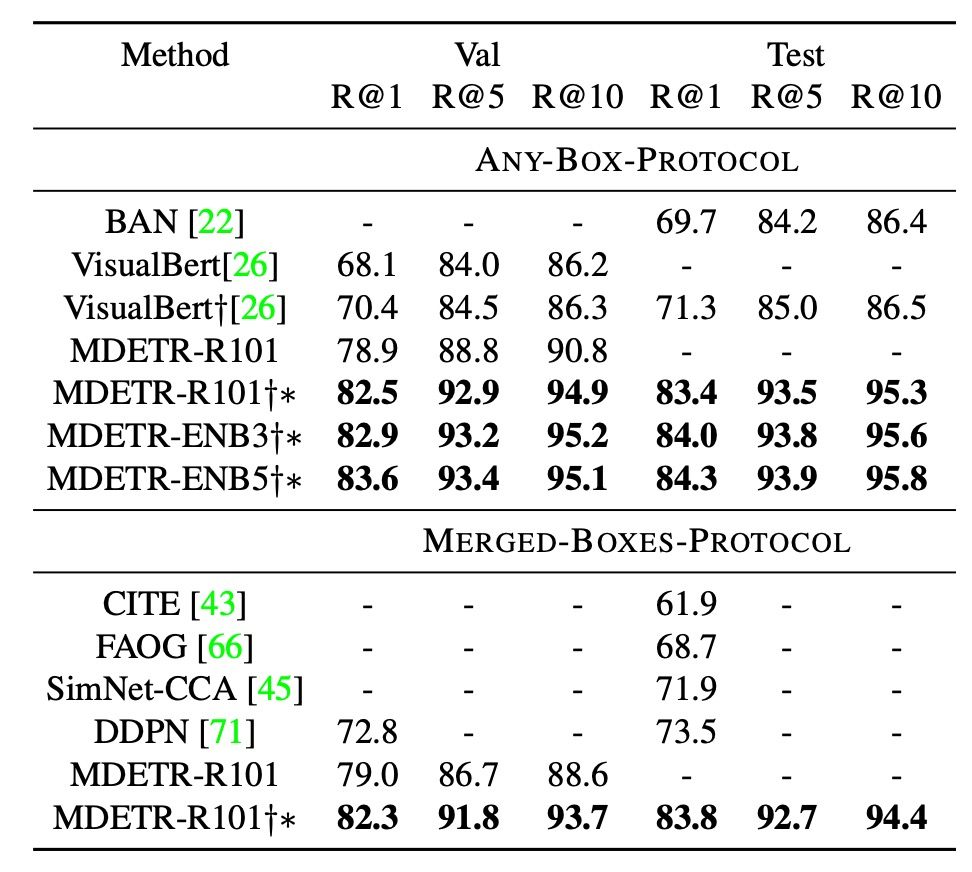
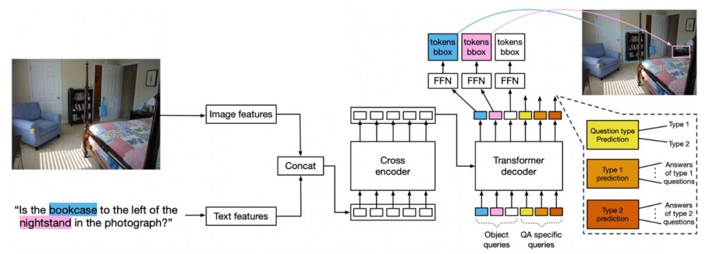

## 継続の芸術

[**MDETR -- Modulated Detection for End-to-End Multi-Modal Understanding**](https://arxiv.org/abs/2104.12763)

---

近年のコンピュータビジョン分野では、物体検出は最前線に立ち、多くの先進的な多モーダル理解システムの中心的役割を果たしてきました。しかし、従来の方法では検出システムがブラックボックスとして固定的な概念で画像を検出するというアプローチが取られており、この方法には固有の限界があります。

明らかな問題の一つは、これらのシステムが多モーダルなコンテキストを効果的に利用して共同訓練することができず、下流のモデルは検出された対象のみを利用できることです。さらに、こうした検出システムはしばしば固定されており、適応性やさらに精緻化する能力に欠けています。もっと重要なのは、これらの検出システムの語彙が非常に制限されており、自由形式のテキストで表現された新しい概念の組み合わせに対しては盲目的であることです。

簡単に言うと、この論文の著者は VL モデル内の物体検出のアーキテクチャを交換したいと考えています。

以前、ViT を使って交換した論文がありましたが、結果はあまり良くありませんでした。

- **[ViLT：君が歌い終わるとき、私は登場](../2102-vilt/index.md)**

ViT を使うのはあまりうまくいかなかったので（ViT は物体検出専用ではないからです）、今回は別の「専用」の物体検出モデル、DETR を使って交換してみることにしました！

- **[DETR：分野横断的なパイオニア](../../object-detection/2005-detr/index.md)**

## 問題の定義

現在、多くの先進的な多モーダル理解システムは物体検出をその中心的な部分として依存していますが、これらの設計には明らかにいくつかの問題があります：

1. **協調訓練の制限**

   多モーダルシステムでは、協調訓練とは、画像、テキスト、音声などの複数の入力ソースからのデータを同時に使用してモデルを訓練することを意味します。システムの一部が他の部分とこの協調訓練を行えない場合、すべての利用可能な情報を十分に活用できない可能性があります。

   例えば、画像と音声の入力を持つモデルがあり、画像検出器のみを独立して訓練し、音声入力を考慮しない場合、音声入力が画像内のオブジェクトに関する重要な情報を提供しても、モデルはそのオブジェクトを正しく認識できない可能性があります。

2. **検出範囲の制限**

   検出システムの主な目的は、画像内の特定のオブジェクトを識別することです。しかし、これらのシステムが既知のオブジェクトにのみ集中し、画像の他の部分を無視する場合、重要なコンテキスト情報を見逃す可能性があります。例えば、複数の人と犬が写っている画像で、検出器が人と犬のみを識別し、背景の公園のシーンを無視した場合、そのシーンがなぜ人と犬がそこにいるのかを説明する重要な情報を提供している可能性があります。

3. **モデルの固化**

   モデルが訓練されて「凍結」された後、それは更新や学習を行いません。これにより、モデルが新しい状況やデータに適応し、最適化するのが妨げられる可能性があります。例えば、検出器が夏の画像で訓練されている場合、冬の画像では微調整を行わないと、雪や厚着をした人々をうまく認識できない可能性があります。

4. **語彙の制限**

   物体検出システムは、訓練データに基づいて特定のクラスや属性を識別します。訓練データに含まれていない新しいオブジェクトや概念に遭遇した場合、識別できない可能性があります。

5. **エンドツーエンドではない設計**

   エンドツーエンドのシステムでは、入力から出力までの連続的な学習と最適化が可能であり、途中のステップがありません。検出器がエンドツーエンドでない場合、他のタスクとの協調訓練が制限される可能性があります。数学的には、このシステムは微分できないため、微分できなければ最適化の機会もないということになります！

## 問題の解決

### MDETR モデル設計

このモデルは非常にシンプルです。まず、テキスト部分には改良された Encoder モデルである RoBERTa を使用します。

テキストの特徴ベクトルを生成した後、それを元の DETR アーキテクチャに Concat の方法で組み込みます。

全体の構成は以下の部分で構成されています：

- **バックボーンの畳み込みエンコーディング**：画像はまず畳み込みバックボーンでエンコードされ、フラット化されます。
- **空間情報**：2D 位置エンコーディングをフラット化されたベクトルに加えることにより、モデルは空間情報を保持します。
- **テキストエンコーディング**：事前学習された Transformer 言語モデルを使用してテキストをエンコードし、入力サイズと同じ隠れベクトルのシーケンスを生成します。
- **モーダル関連の線形投影**：画像とテキストの特徴にモーダル関連の線形投影を適用し、これらの特徴を共有されたエンコード空間に投影します。
- **クロスエンコーダ**：画像とテキスト特徴のシーケンスを連結し、共通の Transformer Encoder に供給します。これはモデルの核心部分です。

### 訓練方法

1. **ソフトトークン予測**

ソフトトークンのアイデアは非常に興味深いです。ソフトトークンは、各検出対象に対応する「範囲」を予測することに焦点を当てています。これは、標準的な物体検出と最も異なる点です。具体的には、各物体のクラス分類を予測するのではなく、原文における物体に対応する「範囲」を予測します。

例えば、説明文が「黒猫と白い犬」であると仮定した場合、モデルは黒い動物を検出したとき、その動物が「黒猫」というテキスト部分とどのように関連しているかを予測しようとします。これは単に独立したトークンやクラスラベルに関するものではなく、テキスト内の一連のトークンに関するもので、これらのトークンは一緒に「範囲」を形成し、特定の物体を表現します。

この方法の利点は、同一のテキストで複数の物体への参照が重複している場合や、複数の物体が同一のテキストに対応している場合でも処理できる点です。

### コントラストアライメント

コントラストアライメントは、視覚的なオブジェクトのエンコード表現が対応するテキストトークンと特徴空間内で近接することを保証することを目的としています。このアライメントは、位置情報に基づく「ソフトトークン予測」よりも強力で、特徴表現に直接作用します。

参考論文に記載されている数式は以下の通りです：

- L：最大トークン数。
- N：最大物体数。
- T+​i：与えられた物体 oi​ に対応するトークン集合。
- Oi+​：与えられたトークン ti​ に対応する物体集合。
- τ：温度パラメータ、直接 0.07 に設定されます。

この数式の概念は非常にシンプルで、つまり「物体とテキストはお互いにうまくアライメントしなければならない」ということです。似ているほど良いということです。

### すべての損失

MDETR の訓練では、上記で言及したコントラスト損失に加えて、従来の DETR 論文に記載されている損失も含まれています。例えば、二項マッチングによるボックス予測損失、L1 損失、GIoU など、すべてを計算に含めます。

### データセット

- **CLEVR**：方法の結果を評価するために使用。
- **Flickr30k**：組み合わせデータセットを構築するために使用された画像。
- **MS COCO**：組み合わせデータセットを構築するために使用された画像。
- **Visual Genome (VG)**：組み合わせデータセットを構築するために使用された画像。
- アノテーションデータは、引用表現データセット、VG 領域、Flickr エンティティ、GQA 訓練バランスセットから取得されています。

### 技術的な詳細

- **事前訓練された調整検出**

  事前訓練の段階では、目標は自由形式のテキストで引用されたすべての物体の検出と整合性を確認することです。

- **データ組み合わせ技術とその重要性**

  - 各画像に対して、提案されたデータセットからその関連するすべてのテキストアノテーションを取得します。異なるアノテーションが同じ画像を参照している場合、それらのアノテーションは統合されます。訓練セットと検証/テストセットの独立性を確保するため、検証またはテストセットに現れるすべての画像は訓練セットから削除されます。
  - このアルゴリズムは、文を組み合わせるために使用され、組み合わせたフレーズやテキストブロック間の重複が少ないことを確認します（GIoU ≤ 0.5）。GIoU は、2 つの長方形領域がどれだけ重なっているかを評価する指標です。組み合わせ後の文の長さは 250 文字以下に制限されます。この方法によって、130 万対の整合した画像-テキストペアを持つ大規模なデータセットが形成されました。
  - このデータ組み合わせ技術を使用する主な理由は 2 つです：
    - **データ効率**：1 つの訓練サンプルに多くの情報を詰め込むことで、データをより効率的に活用できます。
    - **より良い学習信号**：
      - モデルが学習中に、テキスト内で何度も出現する同じ物体のクラス間の曖昧さを識別し、解決する必要があります。
      - 1 つの文のみの状況では、「ソフトトークン予測」のタスクは比較的簡単になります。なぜなら、モデルは通常その文の主題や核心的な意味を簡単に予測でき、画像に依存しなくても済むからです。
      - 複数の文を組み合わせることで、モデルは画像とテキストの関係をより深く探求する必要があり、その結果、予測能力が向上します。

- **モデルアーキテクチャの選定**
  - テキストエンコーダには、事前訓練された RoBERTa-base を使用し、12 層の Transformer エンコーダが含まれています。
  - 視覚的バックボーンには 2 つの選択肢があります：
    - **ResNet-101**：これは Torchvision から取得したもので、ImageNet で事前訓練されています。
    - **EfficientNet シリーズ**：EfficientNetB3 と EfficientNetB5 が使用されました。EfficientNetB3 は ImageNet で 84.1％の Top-1 精度を達成し、EfficientNetB5 は 86.1％の精度を達成しました。
  - また、大量の未ラベルデータを用いた訓練モデルも使用されており、これは Noisy-Student の擬似ラベル技術を活用しています。
  - 訓練の詳細：32 台の V100 GPU を使用し、40 エポックの事前訓練を実施しました。効果的なバッチサイズは 64 で、訓練時間は約 1 週間かかりました。

### 討論

### 下流タスクの表現分析

1. **フレーズグラウンディング**

著者は Flickr30k データセットと特定の訓練/検証/テスト分割を使用しました。評価を行う際、2 つの異なる評価プロトコルを採用し、これらのプロトコルは、1 つのフレーズが画像内の複数の物体を参照する際の問題に対処することを目的としていますが、異なるアプローチを採っており、それぞれに長所と短所があります。

1. **ANY-BOX-プロトコル（任意プロトコル）**

   このプロトコルでは、与えられたフレーズが画像内の複数の異なる物体を参照する場合、予測された境界ボックスは、いずれかの実際の境界ボックスとの交差（IoU）が設定された閾値（通常 0.5）を超える場合に正しいと見なされます。これは、モデルが画像内の任意の参照物体を正しく識別できれば、その予測が正しいと見なされることを意味します。ただし、この方法の問題点は、モデルがすべての参照されたインスタンスを検出したかどうかを評価できないことです。

2. **MERGED-BOXES-プロトコル（合併ボックスプロトコル）**

   このプロトコルでは、フレーズが画像内の複数の物体を参照する場合、そのフレーズに関連するすべての実際の境界ボックスがまず合併され、これらすべてを含む最小の境界ボックスが作成されます。その後、通常の方法で、この合併された境界ボックスを実際の境界ボックスとして IoU を計算します。つまり、モデルの予測は、個々の実際の境界ボックスと一致するのではなく、この合併された境界ボックスと一致する必要があります。この方法の問題点は、これらのインスタンスが画像内で遠く離れている場合に、合併されたボックスが過度に大きくなる可能性があり、個々のインスタンスに対する詳細な理解を失うことです。

3. **結果の比較**

   - ANY-BOX 設定では、最先端の技術と比較して、MDETR は検証セットでの Recall@1 測定で 8.5 ポイントの向上を達成し、追加の事前訓練データを使用することなく成果を上げました。
   - 事前訓練を行い、同じバックボーンネットワークを使用することで、MDETR はテストセットでの最良モデル性能をさらに 12.1 ポイント向上させました。

4. **参照表現理解**

これまでの研究と手法は、通常、画像に関連する事前に抽出された境界ボックスのセットを並べ替える方法に焦点を当ててきました。これらの境界ボックスは、事前訓練されたオブジェクト検出器を使用して得られたものです。

本論文では、より挑戦的な目標を設定しました。すなわち、与えられた参照表現とそれに対応する画像に基づいて、モデルが境界ボックスを予測することを直接訓練するという方法です。これは単に事前に抽出されたボックスを並べ替えるのではなく、モデルが直接予測するというアプローチです。

本モデルは、事前訓練の段階でテキスト内で参照されたすべての物体を識別できるように訓練されています。例えば、「青いドレスを着た女性がバラの茂みの横に立っている」というキャプションに対して、モデルは女性、青いドレス、バラの茂みといったすべての参照された物体の境界ボックスを予測します。しかし、参照表現に関しては、タスクの目的は単一の境界ボックスを返すことであり、それが全体の表現を代表する物体となります。この変化に適応するために、モデルはこの 3 つの特定のデータセットで微調整されました。

上記の表に示されている結果では、この方法が最新の手法よりもすべてのデータセットで顕著に進歩していることが示されています。

3. **視覚的質問応答（VQA）**

このモデルアーキテクチャは VQA タスクにも適用可能ですが、いくつかの設計変更が必要です。

- **モデル設計**
  - クエリのタイプ：物体検出用の 100 個のクエリに加えて、質問タイプに対応するクエリと、質問タイプを予測するためのクエリが導入されました。GQA では、これらの質問タイプは REL、OBJ、GLOBAL、CAT、ATTR として定義されています。
  - 訓練：40 エポックの事前訓練を行い、その後不均衡な GQA 分割で 125 エポックの微調整を行い、最後に均衡分割で 10 エポックの微調整を行いました。
  - 損失戦略：最初の 125 エポックでは、検出損失と QA を同時に訓練しますが、QA 損失にはより大きな重みが与えられます。

このモデルは、物体クエリをデコーダへの入力として学習し、これらのエンコーディングは物体検出に使用されます。推論時には、モデルの特定の部分が質問タイプを予測し、その部分から答えを取得します。

:::tip
この論文では、従来の VQA v2 ではなく、GQA を使用しています。

GQA と VQA v2 は、視覚的質問応答（VQA）のために広く使用される 2 つのデータセットです。両者は、画像を与えて関連する質問に答える点では共通していますが、いくつかの重要な違いがあります：

1. **データ規模とソース**

   - GQA：GQA データセットは Visual Genome データセットに基づいており、約 2200 万の質問-回答ペアを含んでいます。
   - VQA v2：VQA v2 データセットは元の VQA データセットの改良版で、約 120 万の質問-回答ペアを含み、MS COCO と Abstract Scenes データセットに基づいています。

2. **質問と回答の性質**

   - GQA：複雑で組み合わせ的な質問に重点を置き、通常は複数の物体とその間の関係を含みます。回答は通常、複数語の記述的な回答です。
   - VQA v2：質問は非常に多様で、単純なもの（例：「これは何色ですか？」）から比較的複雑なものまであります。回答は通常、1 語または 2 語で表されます。

3. **データの不均衡性**

   - GQA：データセットの設計目的の一つは、VQA での不均衡性問題を解決することです。これにより、モデルが画像内容を理解せずに答えを推測することを防ぎます。
   - VQA v2：VQA v2 は VQA v1 の改良版で、対照画像を追加し、データの偏り問題を解決しようとしています。

4. **シーングラフ**

   - GQA：GQA には、画像内の物体のタイプ、属性、物体間の関係を詳細に記述したシーングラフが含まれています。
   - VQA v2：VQA v2 にはシーングラフが組み込まれていませんが、研究者は他のデータソースや技術を組み合わせてこれらの情報を提供することができます。

5. **タスクの目的**
   - GQA：基本的な VQA タスクに加えて、GQA は多モーダル推論を重視しており、モデルに画像内容と質問の文脈をより深く理解させます。
   - VQA v2：主に基本的な VQA タスクに焦点を当て、モデルの性能を改善し、データ偏り問題に対処します。

簡単に言うと、GQA はより複雑で詳細な物体と関係の記述を提供し、VQA v2 はデータの偏り問題に対処しながら、より多様な質問に対応しています。
:::

4. **性能比較**

- ResNet-101 バックボーンを使用したモデルは、LXMERT や VL-T5 よりも優れた性能を示しました。
- このモデルの性能は、より多くの事前訓練データを使用した OSCAR を超えることができました。
- EfficientNet-B5 バックボーンを使用した MDETR モデルは、さらに高い性能を達成しました。詳細は上表に示されています。

### Few-shot は可能か？

著者たちは、CLIP のゼロショット画像分類での成功に触発され、事前訓練された MDETR モデルを使って、少量のラベル付きデータで物体検出を行う方法をさらに探求しました。CLIP とは異なり、MDETR の事前訓練データセットでは、すべてのターゲットカテゴリのバランスが保証されていません。つまり、そのデータセットには、テキストと整合したボックスが存在しないため、モデルは与えられたテキストに対して常にボックスを予測します。

この設計により、MDETR は本当のゼロショット転送設定で評価することができません。そのため、著者たちは代替戦略として少数ショット設定で評価を行いました。実験には、長尾分布を持つ 1.2k のクラスを含む LVIS データセットが選ばれました。このデータセットでは、ほとんどのクラスにおいて訓練サンプルが非常に少ないです。

この分布に適応するために、MDETR の訓練戦略は以下の通りです：各正のクラスに対して、その画像とクラスのテキスト名を訓練インスタンスとして使用し、さらにそのクラスのすべてのアノテーションを使用します。負のクラスに対しては、クラス名と空のアノテーションのみを提供します。推論時、MDETR は可能なすべてのクラス名をクエリし、各テキストプロンプトで検出されたボックスを統合します。

:::tip
例を挙げてみましょう：

仮に、次の 3 つのクラス「犬」「猫」「魚」があるとします。

手元にあるラベル付きデータは以下の通りです：

- 画像 1 には「犬」が写っており、ラベルは「犬」。
- 画像 2 には「猫」と「魚」が写っており、ラベルはそれぞれ「猫」「魚」。

MDETR の訓練戦略に基づいて：

画像 1 について：

- 画像に「犬」が写っているので、この画像とテキスト「犬」を訓練インスタンスとして使用し、「犬」のラベルを使用。
- 画像には「猫」や「魚」が写っていないため、「猫」と「魚」のクラス名は提供しますが、ラベル（空のラベル）は提供しません。

画像 2 について：

- 画像に「猫」と「魚」が写っているので、この画像、テキスト「猫」と「魚」を訓練インスタンスとして使用し、それぞれのラベル「猫」と「魚」を使用。
- 画像には「犬」が写っていないため、「犬」のクラス名のみを提供し、ラベル（空のラベル）は提供しません。

MDETR が推論を行うと、画像が与えられた場合、クエリを行い、クラス名「犬」「猫」「魚」に対してそれぞれ検出された結果を統合します。例えば、クエリ「犬」でボックスを検出し、「猫」では検出せず、「魚」ではボックスを検出した場合、最終的な結果には「犬」のボックスと「魚」のボックスが含まれます。
:::

著者たちは、LVIS データセットの 3 つのサブセット（1%、10%、100%の画像）で MDETR の微調整を行いました。その結果、2 つのベースライン手法との比較が行われました。1 つは LVIS の完全訓練セットで直接訓練された Mask-RCNN、もう 1 つは MSCOCO で事前訓練し、その後 LVIS のサブセットで微調整された DETR です。驚くべきことに、1%のデータしか使わなくても、MDETR はテキスト事前訓練を活用して、稀少なクラスで完全微調整された DETR を超える性能を達成しました。

さらに、顕著な観察結果として、すべての訓練データで微調整を行った場合、稀少な物体検出性能は、10%のデータでの 20.9 AP から 100%のデータでの 7.5 AP に急降下しました。この大幅な下降は、データ内の極端なクラス不均衡による可能性があります。

## 結論

MDETR の最も魅力的な特徴の 1 つは、その「完全微分可能性」です。

この設計により、モデル全体がエンドツーエンドで訓練可能となり、この一貫性がもたらす効果は、モデル同士がより密接に協調し、全体のパフォーマンスと訓練効率を向上させる機会を提供します。さらに、実際のパフォーマンスにおいて、MDETR は多くのデータセットで信じられないような成果を示し、これにより多モーダル学習の分野でしっかりと地位を確立しました。

また、MDETR の多機能性も大きな注目ポイントです。物体検出において優れた結果を示しただけでなく、Few-shot 検出や視覚的質問応答（VQA）などの他の下流アプリケーションでもその価値を証明しています。

MDETR は、ブラックボックス型物体検出器に依存しない設計方針を提供し、これが多くの研究者に対して正確で効率的なモデルを作成するための道を開くかもしれません。

:::tip
なぜ以前の論文構成では Faster RCNN を繋げなかったのでしょうか？完全微分可能で、素晴らしいですよね？

完全微分可能なモデルは確かに魅力的に聞こえますが、それは多くの計算リソースを必要とする可能性があります。特に、巧妙な設計なしで、単純に、直接的に、無理やり繋げるだけでは、モデルからのペナルティを受ける可能性が高いです：

- **訓練ができない。**

モデル全体が微分可能である場合、その内部構造は非常に複雑になる可能性があり、これにより計算コストが高くなり、訓練の難易度が増します。研究者は調整にもっと多くの時間を費やす必要があり、これはすべてのチームが負担できるわけではありません。
:::
