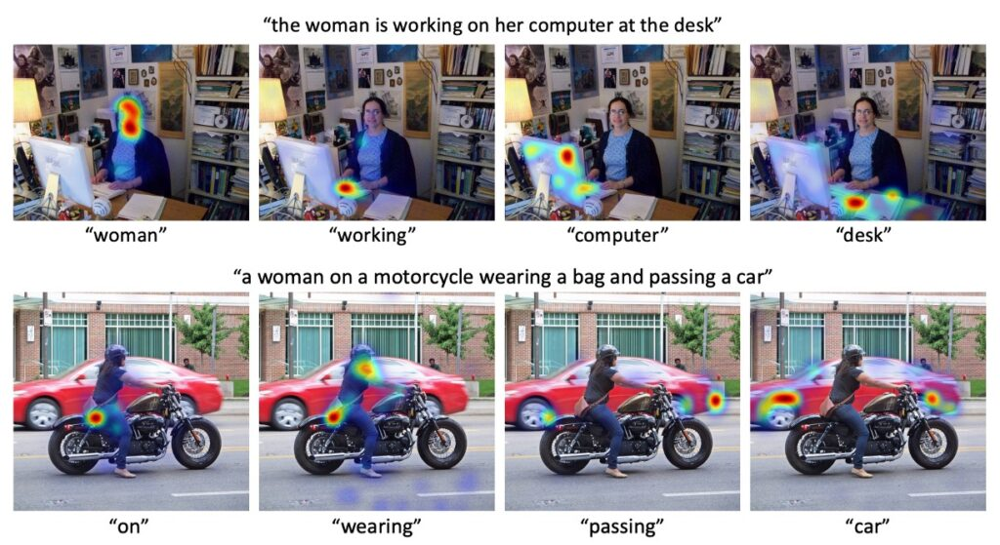

## 純粋な道を追い求める

[**Align before Fuse: Vision and Language Representation Learning with Momentum Distillation**](https://arxiv.org/abs/2107.07651)

---

VQA をうまくこなすためには、物体検出器を使用せざるを得ない。

物体検出器を使いたくない先輩たちは、すでに道に倒れてしまった。

- [**ViLT: あなたが歌い終わった後に私が登場**](../2102-vilt/index.md)
- [**MDETR: 継続の芸術**](../2104-mdetr/index.md)

一つは ViLT 先輩で、物体検出器を取り外して ViT に変更したが、最終的には VQA v2 データセットの検証では特に成果を上げなかった。もう一つは MDETR 先輩で、物体検出器を Faster RCNN から DETR に変更したが、最終的に VQA v2 データセットの結果に関しても特筆すべきものはなかった。

一方で、現在非常に流行している CLIP モデル：

- [**CLIP: 次元の壁を打破する**](../2103-clip/index.md)

これらの方法は、コントラスト損失を用いて事前学習を行い、画像とテキストの表現を独立して学習することに焦点を当てている。しかし、この種の方法は、より複雑な V+L タスクにおいてモデル化能力が欠けている可能性がある。

ええ、我々は論文を見ているだけですが、どうしてこれほど多くの遺憾を見出せるのでしょうか？

## 問題の定義

実際には遺憾ではなく、先人たちが残した謎があってこそ、後人が論文を発表する余地が生まれる。

ALBEF の著者は、先人たちの研究を基に、現在の段階でのいくつかの問題をまとめました：

1. **モーダル空間のエンコーディング問題**

   画像特徴とテキストエンコーディングは、いずれもベクトル形式に変換されていても、通常はそれぞれ独自のベクトル空間に存在します。これは、これらの空間がそれぞれ独自の次元、範囲、特性を持っていることを意味し、したがってこれらの独立した空間での相互作用や関連性を直接捉えるのは難しいということです。

2. **物体検出器の制約**

   物体検出器は事前学習時にバウンディングボックスのアノテーションが必要で、これによりアノテーションのコストが増加し、推論時には高解像度の画像（例えば 600×1000）が必要となり、計算コストと複雑性が増加します。

3. **データノイズの問題**

   現在広く使用されている画像テキストデータセットは主にインターネットから取得されており、これらのデータは多様なソースから来ているため、元々ノイズが含まれていることが多いです。事前学習モデルがこれらのデータセットを使用する際に、モデルがノイズ内の特定のテキストに過剰に適合してしまうリスクがあり、これが実世界での応用における汎化性能を低下させる可能性があります。

これらの問題を総合的に考慮して、著者は ALBEF を提案しました。このモデルは検索と推論タスクで SoTA の結果を達成し、物体検出器に依存せず、ViT を使用しています。

先輩たちの試みとは異なり、今回うまくいった理由の一つは、著者が「知識蒸留」という技術を取り入れたことです。

## 知識蒸留

問題の解決方法を説明する前に、「知識蒸留」について基本的な紹介を行います。

深層学習モデルが様々なタスクで卓越した成果を上げる一方で、モデルのサイズと複雑さも増加しています。しかし、大規模なモデルは多くの計算資源を必要とし、実際のアプリケーションでは特にエッジデバイスやモバイルデバイスでの利用が難しい場合があります。

知識蒸留は、深層学習における技術で、複雑で大規模なモデル（教師モデル）から、より簡単で通常は小さなモデル（学生モデル）に知識を移転することを目的としています。

### 基本原理

1. **ソフトラベル（Soft label）**：蒸留過程では、教師モデルの出力（通常は特定の層の活性化関数の出力や分類確率）がソフトラベルとして使用され、学生モデルの訓練に使用されます。これらのソフトラベルには教師モデルの知識が含まれており、元の「ハード」ラベルよりも多くの情報を提供します。

2. **温度（Temperature）**：ソフトラベルを「柔らかく」するために、通常は「温度」というパラメータが使用されて確率出力を調整します。高い温度はより柔らかな確率分布を引き起こし、学生モデルが学習しやすくなります。

### 実施手順

1. **教師モデルの訓練**

   教師モデルは通常、大規模で多くのパラメータを持つ深層学習モデルで、あるタスクで十分に訓練され、優れたパフォーマンスを達成します。例えば、画像分類タスクでは、教師モデルは深層の畳み込み神経ネットワーク（ResNet-152 や VGG-19 など）である可能性があります。

   :::tip
   **なぜ大きなモデルが必要なのか？**

   大きなモデルはその深さと広さによってより多くの特徴やパターンを捉えることができ、訓練データに対して高い精度を達成します。しかし、それは推論時の計算コストが高く、より多くのストレージスペースを必要とすることを意味します。
   :::

2. **ソフトラベルの生成**

   教師モデルが訓練された後、その予測がソフトラベルとして使用されます。これは基本的に教師モデルの予測を目標として使用し、元のハードラベルを使用しません。

   :::tip
   **ソフトラベルとハードラベルの違い**

   ハードラベルは絶対的で明確な分類ラベル（例えば「犬」や「猫」）です。一方、ソフトラベルは各クラスの確率を提供します。例えば、ある画像に対してハードラベルは「犬」であることを示すだけですが、ソフトラベルはその画像が犬である確率が 0.95、猫である確率が 0.03、その他の動物の確率を示すことがあります。
   :::

   :::tip
   **なぜソフトラベルを使用するのか？**

   ソフトラベルは、より多くの情報と詳細を提供し、モデルが各クラス間の関係や不確実性をより良く理解できるようにします。
   :::

3. **学生モデルの訓練**

   学生モデルは、教師モデルの動作を模倣することを目的としたより小さなモデルです。前のステップで生成されたソフトラベルを使用して訓練することで、学生モデルは教師モデルの意思決定プロセスを学びます。

   実際の蒸留過程では、ソフトラベルと元のハードラベルを組み合わせて学生モデルを訓練することが一般的です。これにより、学生モデルは教師モデルを模倣するだけでなく、元のデータの真のラベルも考慮に入れることができます。学生モデルは通常、教師モデルよりも小さく簡単であり、推論時には速く、リソースが制限された環境に適しています。

4. **拡張と変種**

   - **自己蒸留**

     この戦略では、モデルは自分の予測をソフトラベルとして使用し、再訓練を行います。これは基本的に、モデルが既に学んだ知識を強化しようとするものです。

     - **利点**：シンプルで低コスト：別の独立した教師モデルは必要ありません。モデルの収束を助ける：通常、モデルの収束を加速し、その精度を向上させることができます。
     - **欠点**：モデルは過学習しやすくなる可能性があり、自分の予測に依存し続けることが原因となります。

   - **複数教師による蒸留**

     この戦略では、複数の教師モデルの知識を 1 つの学生モデルに蒸留します。学生モデルは、すべての教師モデルの動作を組み合わせて模倣しようとします。

     - **利点：**
       - 豊富な知識源：複数の教師モデルからの知識が学生モデルをより堅牢で精度高くする可能性があります。
       - 特定のモデルのバイアスを低減：複数の教師モデルを組み合わせることで、単一のモデルのバイアスや誤差から生じる問題を減少させることができます。
     - **欠点：**
       - 計算コストが高い：複数の訓練済み教師モデルが必要です。
       - 複雑さが増す：異なる教師モデルの出力をどのように組み合わせ、重み付けするかを決定するのは、訓練過程の複雑さを増加させる可能性があります。

   - **オンライン蒸留**

     教師モデルと学生モデルは同時に訓練されます。学生モデルは教師モデルから継続的に学び、同時に両者は反復的に更新されます。

     - **利点**：
       - リアルタイム更新：学生モデルは教師モデルの最新の知識を即座に得ることができます。
       - 遅延が低い：一方のモデルの訓練が完了するのを待つ必要はなく、両者の訓練が並行して行われます。
     - **欠点**：
       - 同期の調整が必要：学生モデルと教師モデルの同期更新が挑戦になることがあります。
       - 計算コスト：両方のモデルを同時に訓練するため、計算の要求とコストが増加する可能性があります。

## 問題の解決

### ALBEF モデル設計

知識蒸留の部分を一旦置いておき、その他の構成要素は理解しやすいと思います：

1. **画像エンコーダ**：12 層の Vision Transformer（ViT-B/16）を使用し、初期化には ImageNet-1k の事前学習済みの重みを使用します。
2. **テキストエンコーダ**：6 層の Transformer Encoder を使用し、BERTbase モデルの最初の 6 層で初期化します。
3. **マルチモーダルエンコーダ**：6 層の Transformer Encoder を使用し、BERTbase モデルの後半 6 層で初期化します。

### 事前学習目標

1.  **画像-テキスト対比学習 (ITC)**

    この目標は、融合前により良い単一モーダル表現を学習することを目的としており、画像とテキストのペアの類似度スコアを高めるための類似度関数を学習することです。

    最初に、2 つの線形変換 (gv) と (gw) を使用して、[CLS] 埋め込みを標準化された低次元（256-d）の表現にマッピングします。次に、MoCo の設計方式を参考に、著者は 2 つのキューを使用して、モメンタム単一モーダルエンコーダから最新の M 個の画像-テキスト表現を保存します。その後、各画像とテキストの間で softmax 正規化された画像からテキストへの、そしてテキストから画像への類似度を計算します。画像-テキスト対比損失は(p)と(y)のクロスエントロピー(H)に基づいて定義されます。

    :::tip
    例を挙げてみましょう：

    例えば、システムが画像に基づいてその対応する説明を判断できるように訓練しているとします。

    - **ステップ 1：埋め込み変換**

      最初に、1 枚の画像があり、この画像は深層学習モデルを通じて処理され、1000 次元の画像埋め込みベクトルが得られます。これを[CLS]としてラベル付けします。しかし、このベクトルは大きすぎるため、線形変換(gv)と(gw)を使用して 256 次元のベクトルに縮小します。

    - **ステップ 2：キューの保存**

      現在、1 枚の画像だけでなく、多くの他の画像とテキストも処理しています。最新の M 個の画像とテキストの埋め込みをキューに保存します。これは、最近再生された曲のリストに似ています。

      対比学習では、通常、損失を計算するために正のサンプルと負のサンプルが必要です。正のサンプルは類似した画像とテキストのペアであり、負のサンプルは類似していないペアです。このステップを省略すると、毎回現在のバッチデータから負のサンプルを取得することになります。しかし、このような負のサンプルは十分に多くなかったり、代表的でない可能性があり、学習効果が低下することになります。

    - **ステップ 3：類似度の計算**

      次に、画像と最も類似しているテキストを判断するために、画像埋め込みとキュー内の各テキスト埋め込みとの類似度を計算し、softmax 正規化を使用して各テキストの確率分布を得ます。

      例えば、画像が黄色い小さなアヒルであり、キュー内に「黄色い小さなアヒル」、「赤いバラ」、「緑のリンゴ」の 3 つのテキスト記述があるとします。計算後、類似度は[0.8, 0.1, 0.1]となり、モデルはその画像が「黄色い小さなアヒル」を説明している確率が 80％だと判断します。

    - **ステップ 4：損失の計算**

          現在、正しい説明が「黄色い小さなアヒル」であることが分かっているので、正しい確率分布は[1, 0, 0]です。画像-テキスト対比損失は、モデルの予測確率分布[0.8, 0.1, 0.1]と正しい確率分布[1, 0, 0]との違いをクロスエントロピー(H)を使って計算します。

      :::

2.  **マスク付き言語モデル (MLM)**

    マスク付き言語モデル(MLM)は、深層学習モデルの事前学習戦略の一つで、モデルの言語理解能力とクロスモーダル学習能力を強化することを目的としています。MLM の動作は、ランダムにテキスト内の単語（通常は 15％）を選んでマスクし、コンテキストと関連する補助情報（画像など）を使って、マスクされた単語を予測することです。

    この方法は、単にテキスト内での空欄補充のゲームではありません。その背後にある考え方は、モデルにテキストの文脈を理解させるだけでなく、画像の視覚的内容とそのテキストとの関係も理解させることです。この予測タスクを最適化するようにモデルを訓練することで、モデルは画像とテキストをより深く、より細かく理解する方法を学びます。

3.  **画像-テキストマッチング (ITM)**

    画像-テキストマッチング（ITM）は、モデルがテキスト記述と画像をどのようにマッチングするかを評価するための戦略です。このタスクは、単に一致する項目を見つけることだけでなく、テキストと画像間の深い意味的関連性を評価することも含まれています。

    このタスクを実行するために、モデルは入力に特殊なトークン[CLS]を使用します。このトークンの目的は、モデルに画像とテキストの統合表現を生成させることです。この統合表現は、画像とテキストが一致するかどうかを判断するための単一の視点をモデルに提供します。

    モデルの性能を向上させるために、本論文では一つの戦略が提案されています。それは、ITM タスクのために難易度の高い負のサンプルをサンプリングすることです（これは先に述べた『キューの保存』のステップと同じで、余分な計算は必要なく、少しだけ保存空間を増やすだけです）。つまり、追加の計算コストなしで、モデルが最も間違いやすい負のサンプルを選択することで、いわゆる「ハード」な負のサンプルを使用します。この方法により、モデルはエラーから学びやすくなり、一致と不一致のペアをより効果的に識別できるようになります。

### モメンタム蒸留（MoD, Momentum Distillation）

先ほど多くの事前学習戦略について話しましたが、1 つの問題がまだ解決されていません：

- **ノイズ。**

事前学習の画像とテキストのペアはほとんどがインターネットから取得されており、これらのペアには多くのノイズが含まれており、画像とテキストの関連性が必ずしも明確ではありません。画像-テキスト対比（ITC）学習では、負の例（つまり画像と一致しないテキスト記述）と見なされるテキストが、実際にはその画像と関連がある場合があります。また、マスク付き言語モデル（MLM）では、ある単語が画像をより適切に表現できる場合でも、それが元の注釈と異なれば誤って間違ったものと見なされる可能性があります。現行の ITC および MLM はワンホットラベルを使用して、すべての負の例と見なされる予測に対してペナルティを与えており、これらの予測が実際には正しいかどうかは考慮されていません。

:::tip
要するに、ノイズは先ほど述べた戦略を歪める原因となります！
:::

事前学習の画像とテキストのペアのノイズ問題を解決するために、著者は「モメンタム蒸留（Momentum Distillation）」という戦略を提案しました。この戦略の核心となる考え方は、モメンタムモデルと呼ばれる持続的に進化する「教師モデル」を使用して疑似目標（pseudo-targets）を生成し、それを基に「基礎モデル」を訓練することです。

このモメンタムモデルは固定されているわけではなく、単一モーダルおよびマルチモーダルのエンコーダの指数移動平均（exponential-moving-average, EMA）バージョンで構成されており、これによりモデルは訓練データの最新の傾向に適応し、反映させることができます。

例えば、金色の砂浜が広がり、波が静かに岸辺に打ち寄せ、遠くには遊んでいる子供たちがいる写真があるとしましょう。しかし、この画像のテキスト記述は「金色の砂浜、波が岸を撫で、子供たちが楽しそうに遊んでいて、露店の店主がアイスクリームを売っている。」となっています。

このような場合、従来の方法で学習を行うと、予測された記述に「アイスクリーム」という単語が含まれていない限り、モデルはペナルティを受ける可能性があります。しかし「アイスクリーム」は画像の中で小さな要素に過ぎないため、これが問題となるのは理想的ではありません。

しかし、モメンタム蒸留戦略を使用すると、基礎モデルは訓練中にモメンタムモデル（教師モデル）によって生成された疑似目標を参照します。何度かのイテレーション後、モメンタムモデルは「砂浜」と「波」がこの画像の主要な要素であり、「アイスクリーム」はあくまで副次的なものであると学習しています。そのため、疑似目標を生成する際には、「砂浜」と「波」を重視し、「アイスクリーム」にはあまり重点を置かない可能性があります。こうすることで、基礎モデルは「アイスクリーム」という言葉を欠かしても過度にペナルティを受けることはなく、むしろ「砂浜」や「波」のような画像の主要な特徴を捉えるように促されます。

この戦略は、モデルが画像の主要な要素により注目し、無関係な詳細や副次的な情報に気を取られないようにすることを保証します。

この戦略の具体的な実装では、画像-テキスト対比（ITC）タスクにおいて、著者はまずモメンタム単一モーダルエンコーダによって生成された特徴を使用して画像とテキストの類似度を測定します。この類似度に基づいて、次にソフトな疑似目標を生成します。ITC MoD の損失計算では、従来の ITC 損失だけでなく、モデルの予測と疑似目標間の KL ダイバージェンスも考慮されます。

マスク付き言語モデル（MLM）については、元の MLM 損失に加えて、モデルの予測確率と疑似目標との間の KL ダイバージェンスも考慮されます。最終的に、この戦略は下流のタスクにも拡張され、各タスクの損失は元のタスク損失と KL ダイバージェンスの加重組み合わせとなります。

### データセット

- **ネットワークデータセット**：本研究では、2 つの主要なネットワークデータセットである Conceptual Captions と SBU Captions を使用しました。
- **ドメイン内データセット**：さらに、2 つのドメイン内データセット、COCO と Visual Genome も使用しました。
- すべてのデータセットにおいて、収集されたユニークな画像の総数は 4.0M で、画像-テキストペアの数は 5.1M でした。
- また、この方法がより大規模でノイズを多く含むネットワークデータに適応できるかを検証するために、Conceptual 12M データセットも含まれており、これにより画像の総数は 14.1M に増加しました。

### 技術的詳細

- **モデル構造**：このモデルは、BERTbase（123.7M パラメータ）と ViT-B/16（85.8M パラメータ）で構成されています。
- **ハードウェア構成**：訓練過程では、8 台の NVIDIA A100 GPU を使用しました。
- **訓練詳細**：バッチサイズ 512 で、合計 30 エポックの事前学習を行いました。
- **オプティマイザー**：AdamW を使用し、重みの減衰率は 0.02 に設定しました。
- **学習率戦略**：最初の 1000 イテレーションで学習率を 0 から 1e-4 にウォームアップし、その後、余弦スケジュールに従って 1e-5 に減衰しました。
- **画像処理**：事前学習中は、解像度 256×256 のランダムクロップを使用し、RandAugment を適用しました。微調整時には、画像解像度を 384×384 に引き上げました。
- **その他のパラメータ**：モメンタムモデルの更新モメンタムパラメータは 0.995 で、画像-テキスト対比学習のキューサイズは 65,536 に設定され、最初のエポックでは蒸留重み α が 0 から 0.4 に線形に増加しました。

## 討論

### 知識蒸留の貢献はどれくらいか

本論文の主な焦点は知識蒸留であるため、まずはここで関連するデータを見ていきましょう。

結果から以下の点が観察できます：

1. **画像-テキスト対比学習の向上**：ベースラインの事前学習方法（MLM+ITM）と比較して、画像-テキスト対比学習（ITC）を追加することで、すべての下流タスクにおける性能が明らかに向上しました。
2. **ハードネガティブマイニングの効果**：この戦略は、より情報量の多い訓練サンプルを探すことによって、ITM の性能をさらに強化しました。
3. **モメンタム蒸留の貢献**：モメンタム蒸留を導入したことで、ITC と MLM の学習効果が改善され、すべての下流タスクにおいて性能が向上しました。
4. **ノイズの多いネットワークデータへの対応**：研究結果は、ALBEF がノイズの多いネットワークデータを効果的に処理し、事前学習モデルの性能を向上させることを示しました。

総じて、この研究は、複数の戦略を通じて、モデルの各タスクにおける性能を向上させ、特にノイズデータの処理において優れた成果を上げました。

### CLIP との比較

ゼロショット画像-テキスト検索のテストでは、ALBEF は CLIP や ALIGN のような他の最先端の手法を凌駕する優れた性能を発揮しました。これらはより大きなデータセットで訓練されていますが、それでも ALBEF は優れた結果を示しました。ALBEF の訓練に使用した画像数が 4M から 14M に増加したことで、性能が大幅に向上しました。これにより、ALBEF がより大規模なネットワーク画像-テキストペアデータセットで訓練されることで、さらに性能が向上する可能性が示唆されました。

:::tip
著者は、もし ALIGN のような 1.2B 規模のデータを使った場合、性能がどれだけ向上するかを示唆しています。

実際、私もその結果を試してみたくてたまらないのですが、訓練リソースの制約でその実験はできませんでした。もし将来的に機会があれば、結果をここに載せておきます。
:::

### 各種 V+L の結果

他の V+L 理解タスクの比較において、上表は ALBEF の優れた性能を示しています。わずか 4M の事前学習画像を使用するだけで、ALBEF はすでに最先端の性能を達成しています。14M の事前学習画像を使用すると、その性能は他の方法を大きく上回り、OSCAR のような物体ラベルを使用した方法や、対抗的データ拡張を行った VALLA よりも優れた結果を示しました。

- [**VILLA: 別荘の中の魅影**](../2006-villa/index.md)
- [**Oscar: オスカーのアンカーポイント**](../2004-oscar/index.md)

VILLA と比較して、ALBEF は複数のテストセットで顕著な絶対的な向上を達成しました。例えば、VQA test-std で 2.37%、NLVR2 test-P で 3.84%、SNLI-VE テストで 1.88%の向上を示しました。さらに、ALBEF は物体検出器を必要とせず、低解像度の画像を使用するだけで、推論速度がほとんどの既存手法よりも大幅に速く、例えば NLVR2 で VILLA より 10 倍以上高速です。

:::tip
この比較表では VinVL については触れられていません。

- [**VinVL: 再訪オスカー**](../2101-vinvl/index.md)

VinVL の VQA のスコアは 76.52 / 76.6、NLVR2 のスコアは 82.67 / 83.98 です。

スコアを見る限り、VinVL の方が優れています。

ここで著者がこれについて特に言及していないのは少し残念です。「私たちは推論速度を 10 倍向上させる一方で、同じレベルの精度を維持しています！」と言ってもよかったはずです。それを省略しているのは少し惜しいですね。
:::

### 可視化結果

RefCOCO+の結果では、ALBEF は他の既存の方法に対して明らかに優れた性能を示し、特に弱いテキスト埋め込みを使用した場合に顕著な結果を得ました。ここでは 2 つの ALBEF のバリエーションが可視化分析に使用されています：

- **ALBEF_itc**：画像エンコーダの最後の層の自己注意マップを Grad-CAM を使って可視化し、画像とテキストの類似度を最大化することで勾配を得ます。
- **ALBEF_itm**：マルチモーダルエンコーダの 3 層（特に GT 用に設計された層）の交差注意マップを Grad-CAM で可視化し、画像とテキストのマッチングスコアを最大化することで勾配を得ます。

## 結論

「知識蒸留」技術の明確な制限の 1 つは、「学生モデル」の性能が「教師モデル」に依存することです。なぜなら、学生モデルは教師が提供する知識しか学べず、すべての情報を完全には吸収できない可能性があるからです。したがって、知識蒸留の鍵はしばしばより良い「教師モデル」を見つけることに帰結します。これは重要なテーマですが、今回は深く議論することはありません。

明らかに ALBEF の著者は「知識蒸留」に対して深い理解を持っており、最初に次のことを明確に述べています：

- **知識蒸留はノイズを排除するための手段です。**

その背後にある核心的な仮定は、モデルがノイズを排除し、正しい情報だけを吸収するというものです。

これは非常に理想的な仮定ですが、ノイズ除去の観点から見ると、知識蒸留は強力な戦略である一方で、多くの課題も伴います。例えば、ノイズとは何かを定義すること、元のモデルへの過度の依存、蒸留プロセスのブラックボックス的な特性、および過度の最適化の潜在的な危険性などです。

ALBEF は多くの視覚言語（V+L）タスクで卓越した成果を示し、迅速かつ効率的な推論を提供するだけでなく、この分野における巨大な潜力を強調しています。これは将来の研究に新たな方向性を示唆しており、例えば、知識蒸留をどのように活用してモデルの汎化性能を向上させるか、教師モデルと学生モデル間のギャップをさらに縮小する方法についての研究が必要です。
