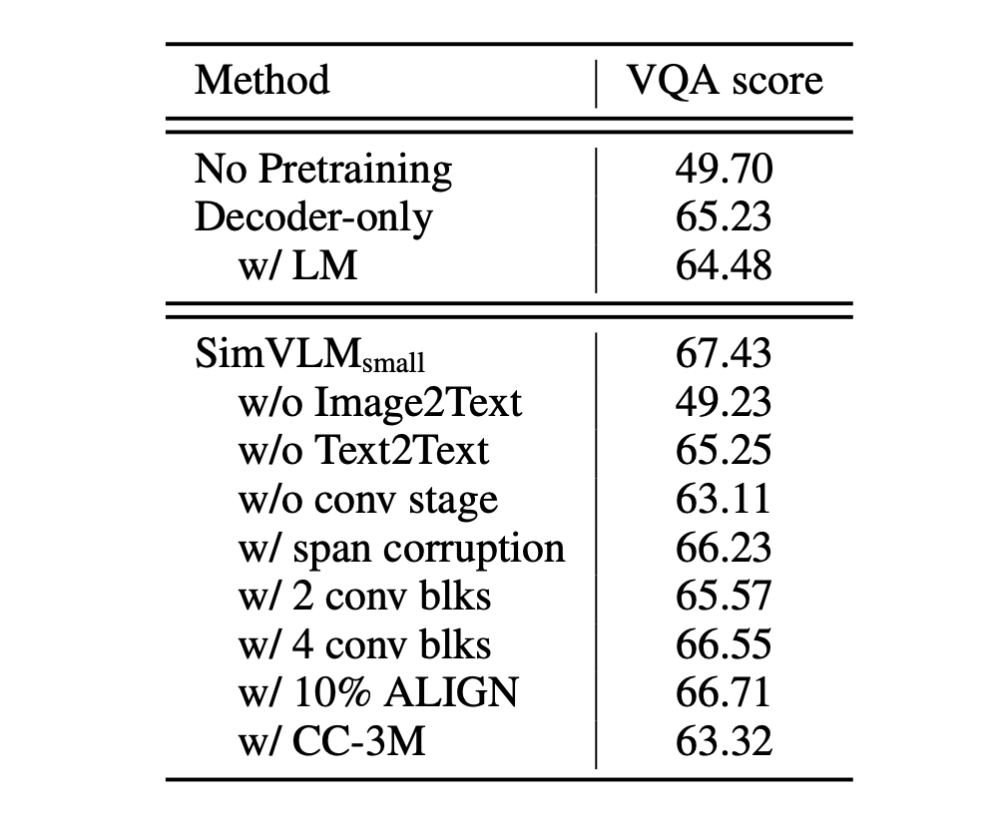

## 少し簡単に

[**SimVLM: Simple Visual Language Model Pretraining with Weak Supervision**](https://arxiv.org/abs/2108.10904)

---

物事が複雑になりすぎると、誰もがそれを避けたくなります：

本当にこんなに複雑にする必要があるのでしょうか？

今、GPT-3 は登場し、非常に優れたパフォーマンスを達成していますが、彼らは物事をこんなに複雑にはしていません！

本論文の著者は、この考えに基づき、もはや従来のエンコーダーアーキテクチャに固執するべきではないと考えています。

もしかすると、私たちは物事をもう少し簡単にすることができるかもしれません？

## 問題の定義

著者が定義した問題は以下の通りです：

1. **事前学習と微調整のパラダイムの欠点**

   - マスク付き言語モデル（MLM）を使用して、大規模な未ラベルテキストコーパスでモデル（例えば BERT）を事前学習し、その後微調整する方法は主流となっていますが、最近の自己回帰型言語モデル（例：GPT-3）は、微調整なしで少量のデータを使用して強力なパフォーマンスを発揮できることを示しています。

2. **マルチモーダル対応の課題**

   - 視覚とテキストのマルチモーダル対応を構築しようとしていますが、画像とテキストの間の整合性を捉えることは容易ではありません。初期の方法は通常、人工的にラベル付けされたデータセットに依存して、物体検出と統合モデルの MLM 事前学習を行っていました。
   - 人間の注釈データの規模は限られているため、従来の方法は複雑な事前学習スキームを使用する必要があり、さらにタスク固有の補助損失を導入する必要があり、VLP の事前学習プロトコル全体が複雑になってしまいました。

3. **ゼロショット能力の欠如**
   - 現在の事前学習と微調整に基づく方法はゼロショット能力において良好なパフォーマンスを示していません。つまり、モデルは未見の新しいタスクへの一般化能力が制限されています。
   - 一部の方法は特定のタスクにのみ焦点を当てているため、汎用の事前学習・微調整表現として使用するのは難しいです。例えば、いくつかの方法は画像分類や画像テキスト検索といった特定のタスクにのみ焦点を当てています。

## 解決問題

### SimVLM モデル設計

1. **PrefixLM**

   単方向言語モデルから得たゼロショット能力のインスピレーションを受けて、著者は「プレフィックス言語モデル」または「PrefixLM」という新しい方法を提案しました。従来の単方向言語モデルとは異なり、PrefixLM にはいくつかの特徴があります：

   - **前置きシーケンスに対する双方向的注意**：

     PrefixLM は前置きシーケンス前の文脈だけでなく、その後の文脈も考慮します。つまり、過去と未来の両方の情報から学習します。

   - **自己回帰的分解の範囲**：

     PrefixLM は、前置きの後の部分に対して自己回帰的分解を行い、次のシーケンスを予測しようとします。

   - **画像をテキストの前置きとして扱う**：

     視覚言語タスクにおいて、PrefixLM のもう一つの重要な特徴は、画像をテキスト記述の前置きとして扱うことです。これは、画像がテキスト記述の前に現れることがよくあるという観察に基づいています。

   :::tip
   例えば、私たちが公園でボールを追いかけている犬の画像を持っているとしましょう。PrefixLM のタスクは、この画像からその内容を記述するテキストを生成することです。処理の流れは次のようになります：

   1. 画像を前置きとして：最初に、画像の特徴表現（例えば、ResNet や VGG などの視覚モデルを通じて）を前置きとしてモデルに入力します。
   2. 簡単なテキスト記述：この画像を前置きとして、例えば「犬が…」という簡単な説明を入力します。
   3. 双方向的な文脈を考慮してデコーダから記述を生成：これは、現在までに生成されたテキスト（例えば、「犬が」）だけでなく、画像の前置き情報も考慮に入れます。したがって、モデルは「犬が」という文脈からだけでなく、画像からも情報を取得します。
   4. 記述の生成を続ける：上記の文脈を考慮して、モデルは「公園でボールを追いかけている」と生成する可能性があります。

   したがって、画像前置きと生成されたテキストを組み合わせることにより、完全な記述「犬が公園でボールを追いかけている」を得ることができます。
   :::

2. **アーキテクチャ設計**

   Transformer をコアアーキテクチャとして使用し、Encoder-Decoder のシーケンス・ツー・シーケンス言語モデルを利用し、視覚モジュールとテキストモジュールを組み合わせています：

   - **視覚モジュール**

     ここでは ViT を使用していますが、いくつかの違いがあります。ViT では最初に線形層を通じて画像のパッチを特徴に変換しますが、ここではその部分を ResNet に置き換えています。元々の ViT は画像の入力のみを受け付けますが、ここでは一部のテキスト入力もトークンシーケンスに組み込んでいます。

   - **テキストモジュール**

     ここでは SentencePiece のトークン化方法、すなわち Byte-Pair Encoding (BPE) 方法を採用しています。この方法では、最初にテキストを文字に分割し、その後、最も一般的な文字対を繰り返し結合して新しい単位を作成し、所定の語彙サイズに達するまで続け、固定語彙で学習を行います。

   :::tip
   おっと！このアーキテクチャ、VL-T5 に似ている！

   VL-T5 のアーキテクチャを見てみましょう：

   

   - 両者ともに Encoder-Decoder を使用
   - 両者ともに Encoder に画像情報とテキスト情報を加えている
   - 実際にはかなり違います！

   一見似ていますが、実際には大きく異なります。

   VL-T5 では、**物体検出器の出力**を使用し、切り取られた画像の部分をモデルに見せます。同時に、2 つのテキスト記述を加えます：

   - 最初のテキスト：プレフィックスとして、モデルが解決すべき問題のタイプを示します。
   - 2 番目のテキスト：問題の本質。

   これらの 2 つのテキストと画像の部分を通じて、モデルは「多数の物体」の中から、テキストに一致する記述を見つけ、デコーダを使用して結果を出力します。

   この設計では、ほとんどの困難が Encoder に残されており、逆に Decoder の立場は非常に微妙です。Decoder を削除し、Encoder の部分に [CLS] トークンを加えて、問題に答えさせても、ほぼ同じパフォーマンスを得られるかもしれません。
   :::

   それでは SimVLM に戻りましょう。SimVLM は問題をすべて Encoder に残していません。私たちには、まるで「事件現場」を作り上げるようなものに見えます。ここでの Decoder は探偵の役割を果たし、Encoder に残された手がかりを使って、次の結果を推理しようとします。

   さらには、著者によると：**ここで言及されている「前置き」の画像の手がかりは、必ずしも画像から来る必要はなく、「画像を記述するテキスト」を前置きとして入力しても全く問題ない！**とのことです。

   この設計の違いにより、後続のタスクでパフォーマンスが約 10 パーセント向上したことがわかりました。

### 事前学習戦略

ここには MLM も、ITM も、あなたが必要だと思っていたものもありません。

著者はここでの事前学習に「PrefixLM」戦略を採用しています。つまり、画像の手がかりを追加した後、GPT のように言葉の連鎖ゲームを行うのです。

あれ？こんなにシンプルで予想外です……

### データセット

- **ALIGN トレーニングデータセット**：画像とその関連する記述やテキスト注釈を含み、「大量のノイズ」を含む大規模なデータセット。このような画像-テキストペアのデータセットは視覚言語事前学習に使用され、マルチモーダル学習タスクをサポートします。
- **Colossal Clean Crawled Corpus (C4)**：C4 は大規模なテキストデータセットで、主に言語モデルの事前学習に使用されます。このデータセットはウェブのテキストから整理され、効率的で大規模な事前学習のために設計されています。

## 討論

### モデルの効果はどうか？

SimVLM はその簡略化された事前学習と微調整方法を使用して優れたパフォーマンスを達成し、事前学習と微調整のプロセスにシームレスに適用できます：

1. **モデル比較**

   - SimVLM は、LXMERT、VL-T5、UNITER、OSCAR、Villa、SOHO、UNIMO、VinVL などの複数の先進的な視覚言語事前学習（VLP）方法と比較されました。
   - マルチモーダルタスクにおいて、SimVLM は比較対象となるすべてのモデルを上回り、新しい SOTA 結果を設定しました。
   - この結果は、SimVLM の生成型事前学習方法が競争力を持っており、弱い監督のシンプルなフレームワークが高品質なマルチモーダル表現を学習できることを示しています。

2. **特定タスクでのパフォーマンス**

   - **判別タスク**

     より小さな容量でも、SimVLMbase は他のすべての方法より優れています。特に、SimVLMhuge は VQA タスクで「初めて 80% を超える」パフォーマンスを達成し、先行の SOTA（VinVL）を約 4 ポイント向上させました。

   - **複雑な視覚言語推論**

     SimVLM は NLVR2 と SNLI-VE で先行方法を上回るパフォーマンスを示しました。

   - **生成タスク**

     SimVLM は特に CoCo 字幕の「Karpathy」5k テスト分割と NoCaps ベンチマークで顕著な改善を見せ、そのパフォーマンスは、より複雑な CIDEr 最適化強化学習方法を使用した先行モデルを上回りました。

   - **画像翻訳**

     SimVLM はまた、Multi30k の英語からドイツ語への画像翻訳タスクで良い結果を示しました。

### ゼロショットのパフォーマンスはどうか？

著者はここで、三つのゼロショットの応用方法を探りました。具体的には：

1. **ゼロショット/少数ショット画像キャプション生成**

   

   SimVLM の事前学習過程は、インターネット上の画像キャプションの目標を解釈するようなものです。ゼロショットまたは少数ショット設定で使用する場合、このモデルの効果は完全な監視型モデルに匹敵します。例えば、「A picture of」というような前置きプロンプトを使用することで、キャプションの質が向上します。モデルは強力な汎化能力を持ち、実世界の概念を認識するだけでなく、視覚入力に対して詳細な説明を提供することができます。

2. **ゼロショットクロスモーダルトランスファー**

   

   SimVLM は、この研究で使用された VLP モデルです。テキストの訓練データは視覚データよりもコストが低いため、モデルは最初にテキストデータで微調整を行い、その後視覚と言語のタスクで評価されました。この方法は、SNLI-VE と Multi30k データセットで確認されました。

   特に SNLI-VE のアプリケーションでは、SimVLM はテキストの NLI データセットで微調整し、その後画像データを入力として使用することで、満足のいくゼロショットトランスファー効果を達成し、他の完全監視型方法と同等のパフォーマンスを示しました。画像特徴が遮蔽され、仮定のみで予測が行われた場合、モデルのパフォーマンスはランダムな推測に似ており、SimVLM がクロスモーダルトランスファーで効果的であることが確認されました。また、モデルは一つのモダリティと言語から別のモダリティと言語に転送できることが示され、クロスドメインおよびクロス言語の能力を証明しました。

3. **オープンエンドビジュアルクエスチョンアンサー**

   

   視覚的な質問応答（VQA）タスクでは、従来の方法は通常、質問を 3,129 の候補回答セットに対して多ラベル分類として定義します。しかし、この方法は固定の回答セットがすべての可能な状況をカバーするのが難しいため、現実のアプリケーションには限界があります。これにより、オープンエンド VQA が挑戦的になります。

   実験結果は、SimVLM がオープンエンド VQA で優れたパフォーマンスを示したことを示しています。SimVLM は、予め定義された候補回答にない質問でも他のベースラインモデルを上回り、部分的な候補回答を使って訓練しても未見の回答に良いパフォーマンスを示しました。しかし、モデルが微調整されていない場合、いくつかの質問に対して意味のある回答を生成できない可能性があります。

### 誰の貢献か？

まず、モデルにデコーダーのみがあり、双方向エンコーダーがない場合、VQA のパフォーマンスが大幅に低下することが確認されました。この結果は、双方向エンコーディングと単方向デコーディング戦略を組み合わせることがモデルのパフォーマンスに良い影響を与える戦略であることを示しています。

次に、事前学習の目標の中で、PrefixLM の方法が他の戦略より優れていることが確認されました。これは PrefixLM の有効性を示すだけでなく、視覚とテキストデータを扱う際に、一貫した統一された目標式を持つことが非常に重要であることを示しています。

また、モデルは訓練過程で弱いアライメントを持つ画像テキストデータが視覚と言語の関係を理解するのに役立つ一方、純粋なテキストコーパスも不可欠であることが分かりました。純粋なテキストコーパスは、言語に関する豊富な情報を提供し、モデルの言語理解能力を深める助けになります。

最後に、視覚言語（VL）タスクにおける畳み込み段階の重要性が強調されました。特に、3 つの畳み込み（conv）ブロックを使用したときに、モデルのパフォーマンスが最も優れていました。この結果は、画像とテキストデータが異なる粒度と特徴を持っているため、モデルアーキテクチャ内でこれらの違いを考慮することが非常に役立つことを示しています。

## 結論

これほどシンプルなアーキテクチャで、これほどの結果が得られるとは。

しかし、このシンプルさが発見や実現が容易であることを意味するわけではありません。SimVLM の成功は、この原則の最良の証明です。この論文が示すのは、効果的な技術戦略だけでなく、今日の複雑な技術世界の中でも、シンプルで直接的な解決策を見つけることが可能であるということです。

多くの人々は複雑な問題には複雑な解決策が必要だと自然に考えがちですが、SimVLM がシンプルな「PrefixLM」戦略で登場したとき、それはこの既存の思考パターンを打破し、その後の研究に明確な方向を示しました。

SimVLM の優れたパフォーマンスに基づき、将来の研究者たちは ViT の視点から最適化を試みるかもしれません。ViT はすでに多くの進化形態を持っていますし、あるいは GPT の戦略をさらに深めて、視覚言語事前学習領域のさらなる発展を推進する可能性もあります。
