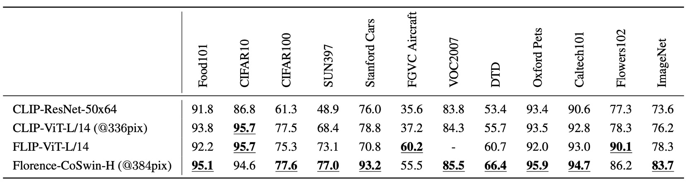
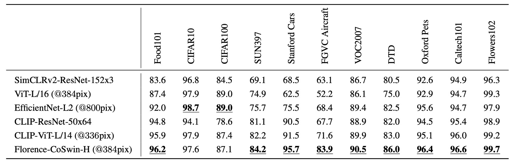
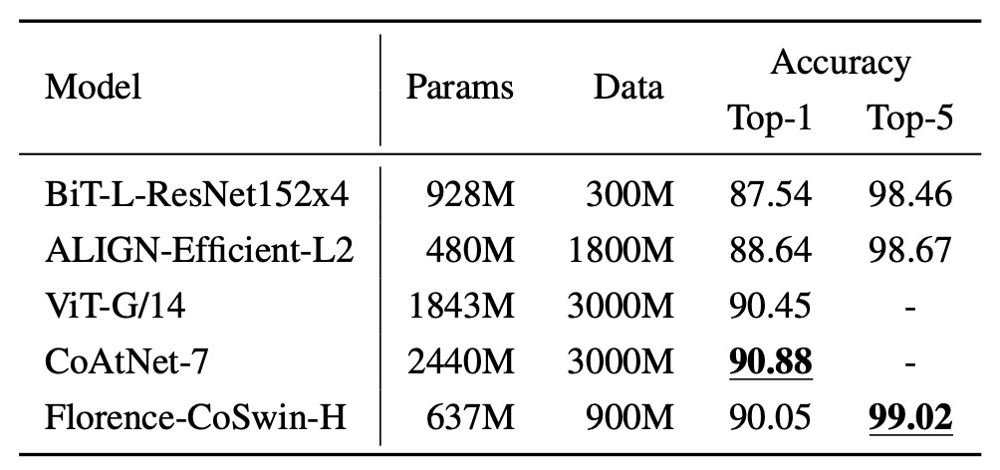

## ルネサンス

[**Florence: A New Foundation Model for Computer Vision**](https://arxiv.org/abs/2111.11432)

---

フィレンツェ、ルネサンス発祥の地。

Microsoft が発行した論文には、大胆で印象的なタイトルが付けられており。

「基盤モデル」とは、自然言語処理の分野で登場した概念だ。原文では「Foundation Model」と記されており、この言葉は、以前「事前学習モデル」として言われていたものを指す。

数年前までは、このモデルを「事前学習モデル」と呼んでいたが、モデルの規模がますます大きく、理解しがたいほどに膨れ上がった結果、事前学習したモデルが非常に多くのことを実行できることがわかり、いくつかのタスクに限定されなくなった。

このようなモデルは「基盤」と呼ばれることがある。それは、さまざまなタスクに対して基本的な特徴表現を提供できるからだ。これにより「基盤モデル」という用語が生まれた。

:::tip
もし、Foundation Model の機会とリスクに興味があれば、以下の論文を読むことをお勧めします：

- [**[21.08] On the Opportunities and Risks of Foundation Models**](https://arxiv.org/abs/2108.07258)

全文 214 ページ、そのうち 160 ページは本文、50 ページは参考文献で非常に実用的です。
:::

この論文がすでにこれほど壮大なタイトルをつけているので、早速本題に入りましょう。

## 定義の問題

自然言語処理分野にはすでに象徴的な基盤モデルが存在しており、著者はコンピュータビジョン分野でも同様の基準を作りたいと考え、その中で「基盤モデル」の問題範囲を定義している。彼らは 3 次元の問題空間を提案している：

1. **空間次元(Space)**：粗い理解（例：シーン分類）から詳細な理解（例：物体検出）へ。
2. **時間次元(Time)**：静的な画像から時間的なシーケンスを含む動的なビデオ理解へ。
3. **モダリティ次元(Modality)**：単純な RGB 画像情報から、テキスト記述、音声、深度情報などを統合した多モーダルへの拡張。

<figure style={{"width": "80%"}}>

</figure>

著者が解決したい問題は、基盤モデルとそれに対応するアダプターを作り、上流の多様で膨大なデータから一般的な表現方法を学習し、追加の学習や変更を最小限に抑えつつ、上述の 3 つの次元におけるさまざまな視覚タスクに適用できるようにすることだ。

言い換えれば、「空間-時間-モダリティ」の範囲において、シーン分類、物体検出、ビデオ内の行動認識、画像とテキストの検索、視覚と言語の交差するタスクなど、さまざまなタスクを処理できるモデルを作りたいということだ。

## 問題解決

### モデルアーキテクチャ

このアーキテクチャ図は非常に明確で、主に 3 つの部分に分かれている：

1. 巨大な訓練データセットを準備する。
2. 最適化された対比学習法を使用して基盤モデルを訓練する。
3. さらに多くの下流タスクのアダプターを事前学習に追加する。

さて、これで論文を読み終わった。（~あれ、違うよね！~）

### 訓練データセット

ALIGN の経験によると、データ量が十分であれば、ゴミデータの影響を無視できる。

:::tip

もし ALIGN モデルに興味があれば、以下の論文を参考にしてください：

- [**[21.02] Scaling Up Visual and Vision-Language Representation Learning With Noisy Text Supervision**](https://arxiv.org/abs/2102.05918)
  :::

そこで、著者はまず非常に大きな画像-テキストデータセット（FLOD-900M）を取得することに成功した。このデータセットには 9 億件の画像-テキストペアが含まれており、約 970 万個のユニークなクエリと、総計 75 億のトークンが含まれている。

### 統一画像テキスト対比学習

最近の CLIP モデルを覚えていますか？

CLIP の訓練アイデアは次の通りです：

- 画像とテキストの記述を正のペア(positive pair)として扱う。
- 他のテキストは負のサンプル(negative examples)として扱う。

この方法の問題点は、インターネット上のデータには「同一のテキスト記述が複数の画像に対応する」場合が多く、CLIP の方法を使用して「1 画像 1 テキスト」とする場合、複数の画像が同一のテキスト記述に対応する場合にうまく適用できないということです。そこで著者は、別の対比学習アーキテクチャである「統一画像テキスト対比学習」を引用しました。

:::tip
UniCL の詳細については、以下の論文を参照してください：

- [**[22.04] Unified Contrastive Learning in Image-Text-Label Space**](https://arxiv.org/pdf/2204.03610)
  :::

原文では Unified Image-Text Contrastive Learning（略称 UniCL）です。

具体的には、各テキスト記述にハッシュタグ（hash key）を作成し、同一のテキスト記述（どれだけ多くの画像に対応していても）は同じラベル$y$にマッピングされます。

もしバッチ内で複数の画像が同一のテキスト記述に対応する場合、これらの画像とそのテキスト記述はすべて正のサンプルとみなされます。つまり、この対比学習では「1 画像 1 テキスト」という制限はなく、「1 テキスト多画像」になり、同一テキスト記述に対応するすべての画像が正のサンプルとなり、他の不一致の組み合わせは依然として負のサンプルです。

数学的には、$f_\theta$を画像エンコーダー、$f_\phi$をテキストエンコーダーとした場合、次のように定義されます。

与えられた画像$x$とその対応するテキスト記述$t$について、まず$f_\theta(x)$と$f_\phi(t)$を特徴ベクトルに変換します。

- 正規化後の画像特徴ベクトルは

  $$
  u = \frac{f_\theta(x)}{\|f_\theta(x)\|}
  $$

- 正規化後のテキスト特徴ベクトルは

  $$
  v = \frac{f_\phi(t)}{\|f_\phi(t)\|}
  $$

次に、学習可能な温度パラメータ$\tau$を定義し、mini-batch $B$を与え、その中の各データにはラベル$y_i$が付与され、全体の損失関数$L$は 2 方向の対比を含みます：

1. 画像からテキストへの対比損失 $L_{i2t}$
2. テキストから画像への対比損失 $L_{t2i}$

最終的な損失は

$$
L = L_{i2t} + L_{t2i}
$$

この 2 方向の対比を通じて、モデルは「画像からテキストを見つける」と「テキストから画像を見つける」のマッチング関係を同時に学習します。

さらに、著者は長文で意味のあるテキスト記述が単語ベースの短い記述よりも学習に有効であることを発見しました。しかし、短いテキスト記述（例えば単語）のみのデータがあるため、彼らは「A photo of the [WORD]」というテンプレートを使ってその記述を延長し、より多くのコンテキスト特徴を提供しました。しかし、この合成されたプロンプトは高階の検索や視覚-言語タスクにやや悪影響を与えることが後に判明しました。そこで、著者は訓練プロセスを 2 段階に分けました：

- 第 1 段階：すべてのデータ（補足された短文を含む）を使って 100 万回訓練する。
- 第 2 段階：人工的なテンプレートを除去した元のテキストデータのみを使って 18 万回訓練し、モデルが自然なテキスト記述に敏感になるようにする。

最後に、高解像度で微調整（8 万回）を行い、画像の入力サイズを$224 \times 224$から$384 \times 384$に拡大しました。これにより、他の大規模な事前訓練方法と同様にモデルの性能が向上しました。

### 双塔型アーキテクチャ

モデルの構造は「Two-Tower」設計を採用しています：

- テキストエンコーダー：12 層の Transformer、CLIP のテキストエンコーダーに似た構造。
- 画像エンコーダー：CoSwin Transformer の階層的な Vision Transformer を使用。

全体で 8.93 億のパラメータを持ち、そのうちテキスト Transformer は 2.56 億、CoSwin-H 画像 Transformer は 6.37 億のパラメータです。

:::tip
CoSwin は Swin Transformer の変種で、線形埋め込みの代わりに畳み込み埋め込みを使用し、特徴抽出の階層性を高め、より精密な画像表現を実現します。
:::

### 下流タスク適応器 - 物体級

<figure style={{"width": "80%"}}>

</figure>

画像レベルの特徴だけでは、物体検出やセグメンテーションなど、精密な位置合わせが必要なタスクには十分でない可能性があります。

そこで、著者は事前学習された Florence の画像エンコーダーに「Dynamic Head」と呼ばれるアダプター、または Dynamic DETR を接続し、画像全体の意味から物体レベルの特徴学習に拡張しました。

Dynamic Head の核心概念は、特徴金字塔、空間次元、チャネル次元を 3 つの注意機構でつなげることです。

3D 特徴テンソル全体に対して多頭注意を直接計算するのは非常に高価ですが、レベルごと、空間ごと、チャネルごとの注意に分解し、順番に積み重ねることで、多次元特徴間の関係を効率よくキャッチすることができます。

また、著者は巨大な物体検出用の事前学習データセット**FLOD-9M**も構築しました。

このデータセットは、COCO、LVIS、OpenImages、Object365 などの有名なデータセットを統合し、ImageNet-22K の偽ラベルボックス拡張データを生成しています。FLOD-9M には、約 896 万枚の画像、25190 の物体クラス、そして 3340 万以上のアノテーションボックスがあります。

:::tip
関連論文は以下の通りです：

- [**[21.06] Dynamic Head: Unifying object detection heads with attentions**](https://ieeexplore.ieee.org/document/9577765)
- [**[21.10] Dynamic DETR: End-to-End Object Detection with Dynamic Attention**](https://ieeexplore.ieee.org/document/9709981)
  :::

### 下流タスク適応器 - 細粒度

<figure style={{"width": "80%"}}>

</figure>

視覚質問応答（VQA）や画像キャプション生成などのタスクでは、より詳細な特徴表現が必要です。

以前の多くの研究では、物体検出器を使用して画像から物体レベルの特徴を抽出し、その後、それらの特徴を融合ネットワークに入れてタスク予測を行っていました。しかし、次世代のアプローチでは、明確な物体ボックスのアノテーションに依存せず、直接グリッド特徴から細粒度の情報を学習しようとしています。

著者は METER を使用して、Florence を細粒度の表現に拡張しました。

方法としては、事前学習された Florence の画像エンコーダー（CoSwin）を METER の元々の画像エンコーダーの代わりに使用し、テキストエンコーダーには事前学習された Roberta を使用しました。また、Co-attention の Transformer モジュールを用いて、画像特徴とテキスト特徴を同時にエンコードし、二つのモダリティ間の関連性を持たせ、最終的に VQA などの下流タスクで微調整を行いました。

:::tip
METER については以前取り上げたので、こちらの記事を参照してください：

- [**[21.11] METER: 鮮やかなダッシュボード**](../2111-meter/index.md)
  :::

### 下流タスク適応器 - 映像

最後に、著者が定義した次元の 1 つは時間、つまりビデオです。

Transformers の自己注意機構は、簡単に映像タスクにも拡張できます。

著者は「Video CoSwin アダプター」を提案し、画像領域で事前学習された CoSwin を映像領域に拡張しました。

映像特徴に適応させるため、彼らは元々の画像のトークン埋め込み方法を 2D 畳み込みから 3D 畳み込みに変更し、空間と時間の次元の特徴を処理できるようにしました。元々の CoSwin では 2D 畳み込みを使ってパッチトークンを生成していましたが、これらの 2D 畳み込みカーネルを 3D 畳み込みカーネルに拡張し、時間的なシーケンスも同時に考慮できるようにしました。

数式で表すと、元々の 2D 畳み込みカーネルのサイズが$K_{h} \times K_{w}$であった場合、映像のために時間次元$T$が加わり、新しい 3D 畳み込みカーネルは$K_{t} \times K_{h} \times K_{w}$となります。

もし 2D の重みが$W_{2D}$であれば、3D の重み$W_{3D}$は次のように初期化されます：

$$
W_{3D}(t,h,w) = \frac{W_{2D}(h,w)}{K_{t}} \quad \text{for } t=1,\dots,K_{t}.
$$

これにより、拡張後の平均と分散が大きく変化しないようにします。

Swin Transformer 構造において、パッチのマージは特徴次元の縮小プロセスです。映像特徴については、著者は 3D 畳み込み形式のパッチマージを使用して、空間と時間の両方で特徴をマージし、異なる時間スライスの特徴がより多く相互作用するようにしました。

Swin Transformer は画像を小さなウィンドウに分割し、そのウィンドウ内で自己注意計算を行い、次の層でウィンドウ位置を変更してクロスウィンドウで特徴を交流します。映像に対しては、著者は 2D のシフトウィンドウを 3D シフトウィンドウに変更し、時間的にもシフトを行うことにしました。

3D 相対位置埋め込みの初期化のため、著者は事前学習された 2D 位置埋め込みを時間次元に沿ってコピーし、各時間スライスの開始時に相対位置埋め込みが 2D バージョンと同じであることを保証しました。

$$
E_{3D}(t,h,w) = E_{2D}(h,w), \quad \forall t
$$

これは、初期状態で異なる時間スライスに同じ 2D 相対位置埋め込みを使用し、その後、訓練を通じてモデルが時間次元の変化を学習することを意味します。

これらの最小限の変更により、多くの層（例えば自己注意層や FFN 層）は 2D の事前学習された重みをそのまま継承できます。最後に、彼らは動的なウィンドウサイズ戦略を採用し、早期段階では小さいウィンドウを使用し、後期段階では大きいウィンドウを使用することでメモリ負担を軽減しました。

:::tip
この部分は Swin Transformer について理解していないと少し難しいかもしれません。もし理解に困った場合は、以前の記事を参照してください：

- [**[21.03] Swin Transformer: 舞踏会の開始**](../../vision-transformers/2103-swin-transformer/index.md)
  :::

### 空間-時間-多モーダル

最初に紹介した図に戻ります：

<figure style={{"width": "80%"}}>

</figure>

1. **空間次元(Space)**：シーン分類や物体検出の視覚理解。
2. **時間次元(Time)**：時間シーケンスを含む動的な映像理解。
3. **モダリティ次元(Modality)**：テキスト記述と画像のマッピング統合。

著者が提案する 3 次元の統合は、上記のプロセスですでに実現されており、非常に精密に統合されています。

## 討論

実験結果部分には十の図表がありますが、いくつかの重要なポイントに絞って見ていきましょう。

### ゼロショット分類遷移

<figure style={{"width": "80%"}}>

</figure>

この実験では Florence モデルを基に、画像とテキストが意味的に一致するかどうかを予測しました。

Florence は 12 のデータセットにおいて、9 つのデータセットで最先端のモデルを超え、ImageNet-1K のゼロショット分類では Top-1 精度 83.74%、Top-5 精度 97.18%を達成しました。

### 線形プローブ分類

<figure style={{"width": "80%"}}>

</figure>

実験方法は、Florence の画像エンコーダーを固定し、追加された線形層のみを調整して、特徴表現の汎化能力を評価しました。

Florence は 11 の分類基準データセットで線形プローブ分類を行い、全体的に現在の技術水準を超えたパフォーマンスを示しましたが、CIFAR10 と CIFAR100 では画像解像度が低いため、若干のパフォーマンス低下が見られました。

### ImageNet-1K 微調整

<figure style={{"width": "80%"}}>

</figure>

実験方法は、クラス名をテキストエンコーダーに入力して特徴埋め込みを取得し、ImageNet のクラステンプレートを使用して記述を拡張するというものです。

結果として、Florence は ImageNet-1K の微調整評価において、BiT および ALIGN を超えたものの、SOTA には若干及ばなかったものの、そのモデルとデータ規模は Florence の 3 倍となっています。

### 画像テキスト検索結果

<figure style={{"width": "90%"}}>

</figure>

Flickr30k と MSCOCO のデータセットでゼロショット転送と微調整評価を行い、画像テキスト検索のパフォーマンスを確認しました。

Florence はゼロショット検索と微調整検索の両方で SOTA を超え、微調整検索の効率がより高く、ALIGN のトレーニングサイクルの 6%〜8%の期間で、全ての現存する方法を上回る結果を得ました。

### 物体検出のゼロショット遷移

物体検出のデータセットには COCO、Object365、Visual Genome が含まれています。上の図の通り、Florence はこれらのデータセットで新しい SOTA を達成しました。

<figure style={{"width": "70%"}}>

</figure>

さらに、11 のクロスドメインデータセットでゼロショット遷移を行い、顕著な効果を得ました：

<figure style={{"width": "90%"}}>

</figure>

監視付き学習と比較して、ゼロショット遷移はまだパフォーマンスに差があるものの、5-shot 微調整および部分的全データセット微調整タスクでは優れたパフォーマンスを示しました（例えば Packages データセット）。

### VQA 評価結果

<figure style={{"width": "80%"}}>

</figure>

- **モデル設定**：
  - 画像エンコーダーを Florence の CoSwin-H に置き換え。
  - テキスト埋め込み層とモダリティ専用埋め込みの重み減衰を削除。
  - ITM と MLM で事前学習を行い、43 サイクル訓練、画像入力サイズは 384。
- **下流タスク**：
  - 視覚質問応答（VQA）：画像コンテンツに基づいて質問に回答（3,129 個の可能な回答）。
  - モデルは二項交差エントロピー損失関数を使用し、10 サイクルの微調整を行い、学習率は$8 \times 10^{-6}$。

VQA データセットにおいて、Florence は test-dev および test-std で新しい SOTA を達成しました。SimVLM（18 億の画像テキストペアを使用）と比較して、Florence はわずか 900 万ペアで事前学習し、データ効率が顕著に向上しました。

## 結論

論文の方向性は「基盤モデル」に焦点を当てていましたが、パラメータ規模（0.6B）としては、まだ少し足りない部分があるようです。

著者は、モデルの規模は現存する数十億パラメータのモデルに達していないものの、実験結果に基づいて Florence はすでに多くのタスクに対応可能であり、空間、時間、クロスモーダルのアプリケーションにおいて優れた転送能力を発揮していると述べています。

「小規模」でのテストで初期成果を上げたことを踏まえ、今後はより大規模なモデルへと展開されることが期待されます。
