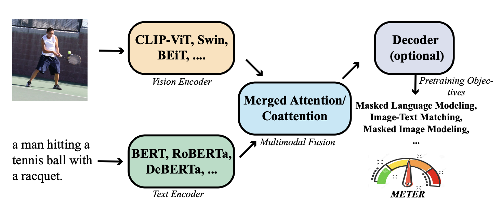

## 鮮やかなダッシュボード

[**An Empirical Study of Training End-to-End Vision-and-Language Transformers**](https://arxiv.org/abs/2111.02387)

---

これはまとめ記事です。

ここでは実験が紹介され、さらに多くの実験が行われることが予想されます。

## 問題の定義

現在の主流の VLP（Vision-and-Language Pre-training）アーキテクチャには、主に 3 つのコンポーネントがあります：

- 1 つ目：視覚エンコーダー、いわゆる ViT（Vision Transformer）です。
- 2 つ目：テキストエンコーダー、最も一般的なのは BERT です。
- 最後に：共エンコーダー、ここでは視覚とテキストをまとめる場所です。

著者は、過去の研究で使用されたアーキテクチャの総まとめを行い、それらを分解して再構成しました。

<figure style={{"width": "90%"}}>

</figure>

要するに、視覚コンポーネントに関する問題です：

まず、効率が悪いこと。

多くの VLP 研究において、多くのモデルはターゲット検出器（例えば Faster RCNN）に依存して、領域特徴を抽出します。これらの検出器は通常、VLP プロセス中に凍結されたままで、これが VLP モデルの能力を制限します。さらに、領域特徴を抽出するプロセスは非常に時間がかかり、これがモデルの効率性と実用性に影響を与える可能性があります。

次に、探索が不十分であること。完全に Transformer に基づいた VLP モデルは、まだ十分に探索されていません。いくつかの ViT モデルは、視覚質問応答（VQA）などの下流タスクにおいて、最先端の性能にまだ追いついていません。

最後に、最適化器の不一致があります。いくつかの研究では、畳み込みニューラルネットワーク（CNN）とテキストのグリッド特徴を直接 Transformer に入力しようとしましたが、最適化器の不一致という問題に直面しました。通常、CNN と Transformer では異なる最適化器が使用されます。最近の研究では、ViT と比較して、CNN は精度と計算コスト（FLOPs）において少し劣ることが示されています。

:::tip
著者が「最適化器の不一致」について言及している部分は、実際には SimVLM のことを指しています。

- [**[21.08]SimVLM：少し簡単に**](../2108-simvlm/index.md)
  :::

## 問題の解決

### METER モデルの設計

<figure style={{"width": "80%"}}>

</figure>

著者はテストユニットをいくつかの部分に分解しました：視覚エンコーダー、テキストエンコーダー、マルチモーダル融合モジュール、アーキテクチャ設計、そして事前学習目標。

1. **Vision Encoder の選定**

   ViT のメカニズムでは、画像は最初に複数のパッチに分割され、これらのパッチが Transformer モデルに入力されて処理されます。

   著者はさまざまな ViT モデルを比較しました。以下がその一部です：

   - **ViT (2020.10)：**
     - [An Image is Worth 16×16 Words: Transformers for Image Recognition at Scale](https://arxiv.org/abs/2010.11929)
   - **DeiT (2020.12)：**
     - [Training data-efficient image transformers & distillation through attention](https://arxiv.org/abs/2012.12877)
   - **CLIP (2021.03)：**
     - [Learning Transferable Visual Models From Natural Language Supervision](https://arxiv.org/abs/2103.00020)
   - **Swin Transformer (2021.03)：**
     - [Hierarchical Vision Transformer using Shifted Windows](https://arxiv.org/abs/2103.14030)
   - **CaiT (2021.03)：**
     - [Going deeper with Image Transformers](https://arxiv.org/abs/2103.17239)
   - **VOLO (2021.06)：**
     - [Vision Outlooker for Visual Recognition](https://arxiv.org/abs/2106.13112)
   - **BEiT (2021.06)：**
     - [BERT Pre-Training of Image Transformers](https://arxiv.org/abs/2106.08254)

2. **Text Encoder の選定**

   著者の目標は、特徴を融合モジュールに送る前に、まずテキストエンコーダーを使用することです。彼らは、BERT、RoBERTa、ELECTRA、ALBERT、DeBERTa など、さまざまな言語モデルを使用してテキストのエンコードを探索しました。言語モデルを変更することに加えて、著者は BERT 埋め込み層で初期化された単純な単語埋め込み検索層も試みました。

   同様に、著者が選んだアーキテクチャも挙げておきます：

   - **BERT (2018.10)**：
     - [Pre-training of Deep Bidirectional Transformers for Language Understanding](https://arxiv.org/abs/1810.04805)
   - **RoBERTa (2019.07)**：
     - [A Robustly Optimized BERT Pretraining Approach](https://arxiv.org/abs/1907.11692)
   - **ALBERT (2019.09)**：
     - [A Lite BERT for Self-supervised Learning of Language Representations](https://arxiv.org/abs/1909.11942)
   - **ELECTRA (2020.03)**：
     - [Pre-training Text Encoders as Discriminators Rather Than Generators](https://arxiv.org/abs/2003.10555)
   - **DeBERTa (2020.06)**：
     - [Decoding-enhanced BERT with Disentangled Attention](https://arxiv.org/abs/2006.03654)

3. **マルチモーダルアーキテクチャ**

   

   VLP モデルはますます人気が高まり、著者は新しい環境でこの 2 つの融合モジュールの影響を再評価しました。どの融合戦略がより効果的であるかを確認するためです。

   - **結合注意モジュール**：このモジュールでは、テキストと視覚特徴が単純に結合され、1 つの Transformer モジュールに入力されます。この方法では、同じ Transformer モジュール内でテキストと視覚情報を同時に処理することができます。
   - **共同注意モジュール**：共同注意モジュールは、テキストと視覚特徴をそれぞれ別々の Transformer モジュールに入力します。このモジュールは交差注意技術を使用して、視覚とテキスト特徴間での相互作用を実現します。

### Encoder-Only vs. Encoder-Decoder

<figure style={{"width": "80%"}}>

</figure>

著者は 2 つの異なるモデルアーキテクチャ、すなわち「エンコーダのみ」アーキテクチャと「エンコーダ-デコーダ」アーキテクチャを比較し、VLP モデルにおけるそれらの適用について議論しました：

- **エンコーダのみアーキテクチャ**：このアーキテクチャでは、クロスモーダル表現（例：視覚とテキスト特徴の組み合わせ）が出力層に直接入力され、最終的な出力が生成されます。VisualBERT はエンコーダのみアーキテクチャを採用した VLP モデルの一例です。
- **エンコーダ-デコーダアーキテクチャ**：VL-T5 や SimVLM などの有名な研究は、エンコーダ-デコーダアーキテクチャの使用を提唱しています。このアーキテクチャでは、クロスモーダル表現は最初にデコーダに入力され、次に出力層に入力されます。この過程でデコーダはエンコーダの表現と以前に生成されたトークンの両方に注目し、自回帰的に出力を生成します。

2 つのアーキテクチャの違いは上の図の通りで、VQA タスクにおいて、エンコーダ-デコーダモデルはテキストをエンコーダに入力し、分類トークンをデコーダに入力します。エンコーダモデルでは、クロスモーダル表現を直接出力層に入力します。

### 事前学習戦略

著者は VLP モデルにおける主要な 3 つの事前学習タスクを挙げ、それぞれを次のように説明しています：掩蔽言語モデル（MLM）、画像-テキスト一致（ITM）、および掩蔽画像モデル（MIM）：

1. **掩蔽言語モデル（MLM）**

   初めは純粋な言語の事前学習から始まり、後に VLP で応用されます。この目的は、画像キャプションペアが与えられたときに、入力トークンの一部をランダムにマスクし、モデルにそのマスクされたトークンを再構築させることです。

2. **画像-テキスト一致（ITM）**

   モデルは、どの画像とキャプションが一致するかを識別する必要があり、通常は 2 クラス分類問題として扱われます。モデルはグローバルなクロスモーダル表現を学習し、分類器を使って一致しているかどうかを予測します。

3. **掩蔽画像モデル（MIM）**

   これは視覚的事前学習モデルで使用される技術で、主に掩蔽言語モデル（MLM）からインスパイアされています。MIM では、モデルの目的は一部の視覚特徴がマスクまたは隠された状態で、それらのマスクされた視覚特徴を再構築または予測することです。

:::tip
ここでは、最近成功した PrefixLM について言及されていませんが、著者が PrefixLM を主流の方法とは考えていない可能性があり、また SimVLM の成功は主に彼らのデータセット規模の大きさによるものと考えられています。そのため、PrefixLM については特別に議論されていません。
:::

### データセット

モデルは、COCO、Conceptual Captions、SBU Captions、Visual Genome の 4 つの一般的なデータセットで事前学習されています。以前の研究に従い、トレーニングデータは約 4M の画像を含んでいます。

### 技術的詳細

- 特に記載がない限り、隠れ層のサイズは 768、ヘッド数は 12 に設定されています。
- 視覚分岐とテキスト分岐間にはデコーダはなく、パラメータの共有もありません。
- 特別な場合を除き、モデルは MLM と ITM のみを使用して事前学習します。
- AdamW を使用して 100,000 ステップの事前学習を行い、下層と上層の学習率はそれぞれ 1e-5 と 5e-5 に設定されています。
- ウォームアップ比率は 10%、学習率は総トレーニングステップの 10%後に線形に 0 まで減衰します。
- 各画像のサイズは 224×224 または 384×384 に調整されます。

## 討論

### モジュールの分割評価

事前学習過程は非常に時間がかかるため、効率を向上させるために、研究者は VLP を行わずに異なるテキストおよび視覚エンコーダを比較することから始めました：

- 特定の事前学習された視覚およびテキストエンコーダを使用してモデルの下層を初期化し、上層はランダムに初期化します。
- デフォルトで選ばれたエンコーダは CLIP-ViT-224/32 と RoBERTa で、ここでの ViT-N/M はそれぞれ画像の解像度とブロックサイズを表します。

1. **テキストエンコーダの評価**

    

    <figure style={{"width": "80%"}}>
    
    </figure>
    

   異なるテキストエンコーダを使用したモデルのパフォーマンスに顕著な違いは見られませんでした。RoBERTa はこの設定において最強のパフォーマンスを達成しているようです。また、Emb-only の結果から、事前学習されたエンコーダが必要であることがわかります。さもなければ、下流タスクのパフォーマンスは低下します。

2. **視覚エンコーダの評価**

    

    <figure style={{"width": "80%"}}>
    
    </figure>
    

   CLIP-ViT-224/16 と Swin Transformer は、この設定で良好な性能を達成できます。しかし、Swin Transformer は VLP なしでテスト開発セット上で 72.38 の VQA スコアを達成しており、事前学習後は一部の VLP モデルと肩を並べることができます。

### V+L 統合評価

<figure style={{"width": "80%"}}>

</figure>

両者を組み合わせることで、VLP アーキテクチャの後、BERT と RoBERTa 間の違いは縮小しましたが、依然として事前学習されたテキストエンコーダの重要性は高いことがわかります（Embed-only と RoBERTa）。

視覚エンコーダに関しては、CLIP-ViT-224/16 と Swin Transformer は非常に良好な性能を達成します。特に CLIP-ViT-224/16 は test-dev/test-std セットでそれぞれ 77.19/77.20 の VQA スコアを達成し、以前の VinVL モデルを上回っています。

:::tip
**論文の著者からのヒント：**

著者はモデルのパフォーマンスを向上させるための興味深いテクニックを提供しています：事前学習されたモデルで初期化されたパラメータを使用するのではなく、ランダムに初期化されたパラメータにはより大きな学習率を使用する方が良いということです。

<figure style={{"width": "80%"}}>

</figure>

モデルのすべての部分に同じ学習率を使用すると、モデルのパフォーマンスが低下する可能性があります。これは、事前学習されたパラメータがすでに視覚と語彙に関する知識を含んでおり、過度に積極的な微調整がこれらの貴重な情報を失わせる可能性があるためです。
:::

### 特徴融合の検討

<figure style={{"width": "80%"}}>

</figure>

著者は、合併アテンションモデルと共通アテンションモデルを設計し、それらのパフォーマンスを比較しました。

実験結果によると、共通アテンションモデルの方が合併アテンションモデルよりも優れたパフォーマンスを示しました。これは、2 つのモードが異なるパラメータセットを保持することが重要であることを示しています。しかし、この結果は、以前の領域ベースの VLP モデルに関する研究結果とは矛盾しており、著者はこれが以下の理由による可能性があると考えています：

1. 領域ベースの VLP モデルの研究結果は、ViT ベースの VLP モデルには直接適用できない場合がある。
2. 領域ベースの VLP モデルのほとんどは、事前学習された視覚エンコーダのみを使用し、事前学習されたテキストエンコーダを含まないため、共通アテンションモデルのような対称的なアーキテクチャはこれらの状況では適用しにくい可能性があります。

一方で、エンコーダとエンコーダ-デコーダアーキテクチャの比較実験では、文献に基づいて T5 スタイルの言語モデリング目標を採用し、15％の入力テキストトークンをマスクし、連続するテキスト範囲をセンチネルマークで置き換えて、デコーダにマスクされたトークンを再構築させるトレーニングが行われました。画像-テキスト一致タスクでは、デコーダに特別なクラスラベルを提供して二値出力を生成しました。

結果として、エンコーダモデルは 2 つの判別タスクでエンコーダ-デコーダモデルよりも優れたパフォーマンスを示しましたが、これは文献の発見と一致しています。しかし、エンコーダ-デコーダアーキテクチャはより柔軟であり、画像キャプションなどのタスクを実行できるため、エンコーダのみのモデルでは難しい場合があります。

### データセットの拡張

<figure style={{"width": "80%"}}>

</figure>

著者は、より多くの画像と大きな視覚バックボーンを使用してモデルの事前学習を行い、このフレームワークのスケーラビリティを検証しました。具体的な事前学習データセットには、COCO、CC、CC12M、SBU、VG の 5 つのデータセットが含まれており、これらは合計で約 1400 万枚の画像と 2000 万枚の画像キャプションペアを提供し、モデルの事前学習に豊富なデータを提供しました。

視覚バックボーンの選択では、CoSwin-Huge が使用され、これにより大量の視覚データを処理する能力が確保されました。テキストバックボーンには RoBERTa-base が選ばれ、テキスト処理が行われ、テキスト情報が効果的にエンコードされることが保証されました。

拡張後の設定により、モデルは VQAv2 で最先端のパフォーマンスを示し、18 億枚の画像で訓練された SimVLM を超えました。この結果は、METER フレームワークが非常に良いスケーラビリティを持ち、データとモデル構造の調整によってより良い結果を達成できることを証明しています。

# 結論

この論文は、エンドツーエンドでフル・トランスフォーマー VLP モデルを訓練する方法を体系的に研究しています。実験結果は、わずか 400 万枚の画像を使用した事前学習で、最先端のモデルが競争力のあるパフォーマンスを得られることを示しています。さらに規模を拡大した場合、METER は VQA で新たな最先端レベルに達しました。

:::tip
著者は V+L モデルを組み合わせる際、同じロジックを統一して使用し、異なるアーキテクチャに最適な調整は行っていません。この「一律の方法」は、各アーキテクチャの独自の利点を十分に発揮できていない可能性があり、また潜在的な問題の発見を妨げているかもしれません。

1. RoBERTa は BERT とは異なり新しい動的 MASK 機構を採用していますが、本論文では一貫して MLM 戦略を使用していますか？視覚エンコーダの部分でも細かな操作が見受けられません。効果的なアーキテクチャを選んで V+L モデルに組み合わせたのみなのでしょうか？

2. SimVLM で採用された PrefixLM が、著者が提案するアーキテクチャで使用された場合、どのような結果になるのでしょうか？異なるテキストと画像バックボーンが組み合わさる場合、それぞれのパラメータ設定や最適化技術を調整して、各アーキテクチャの最適なパフォーマンスを保証するべきではないでしょうか？また、さまざまなマルチモーダル統合戦略を試して、モデルの汎化能力と安定性を検証しましたか？
   :::
