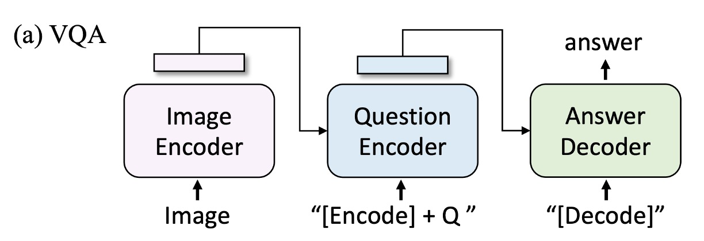
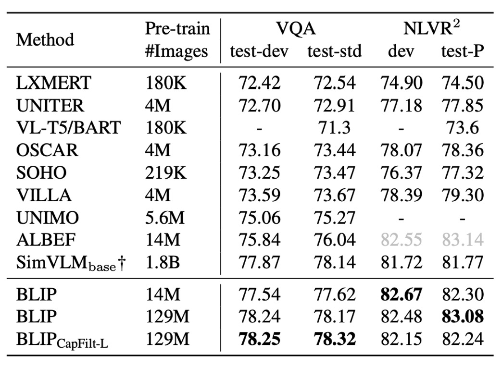

## 合成テキスト技術

[**BLIP: Bootstrapping Language-Image Pre-training for Unified Vision-Language Understanding and Generation**](https://arxiv.org/abs/2201.12086)

---

マルチモーダルモデルは現在、すでに人々の視野にしっかりと根を下ろしています。

ImageNet のランキングを開くと、ほとんどがマルチモーダルアーキテクチャによって占められていることがわかります。

## 問題定義

著者はここ数年の研究文献を振り返り、最近のマルチモーダルモデルにいくつかの欠点があることを発見しました：

1. **訓練データの品質が悪い：**

   CLIP を除いて、比較的有名な論文は ALIGN であり、これは非常に大規模で騒がしいデータセットを基に訓練されたマルチモーダルモデルです。多くの研究が、この訓練方法でも良い結果が得られると指摘していますが、著者はこれは適切な処理方法がないために得られた妥協的な結果に過ぎないと考えています。

2. **アーキテクチャが運命を決定する：**

   マルチモーダルアーキテクチャの選択には通常、2 種類があります。1 つはエンコーダベースのモデル、もう 1 つはエンコーダ-デコーダベースのモデルです。

   エンコーダベースのモデルは、画像キャプションのようなテキスト生成タスクに転送するのが難しいです。一方、エンコーダ-デコーダベースのモデルは、テキスト検索タスクではパフォーマンスが悪いです。

一石二鳥の方法はないのでしょうか？

## 問題の解決

### モデルアーキテクチャ

上の図に基づいて、左から右へと見ていきます：

まず、著者は ViT アーキテクチャを視覚入力のエンコーダとして採用し、出力のシーケンスに特別なトークン`[CLS]`を追加して、画像全体の特徴を表現します。

次に、「理解」と「生成」の能力を持つ統一モデルを訓練するために、著者はマルチモーダルエンコーダ-デコーダーハイブリッドモデル（Multimodal Mixture of Encoder-Decoder, MED）を提案しました。

このモデルには 3 つの機能があります：

1. **テキストエンコーダ**：上図で、左から 2 番目の部分。

   テキストエンコーダは BERT と同様で、テキスト入力の最初に`[CLS]`タグを追加して、文全体を要約します。

   - [**[18.10] BERT: 12 層エンコーダ**](../../transformers//1810-bert/index.md)

2. **画像ベースのテキストエンコーダ**：上図で、左から 3 番目の部分。

   各 Transformer ブロックの自己注意（SA）層と前向きネットワーク（FFN）の間に追加のクロスアテンション（CA）層を挿入して、視覚的な情報を注入します。

   テキストの末尾には`[Encode]`タグを追加し、その出力埋め込みを画像とテキストのマルチモーダル表現として使用します。

   :::tip
   異なる特別なトークンを使用して異なるシーケンスをマークし、モデルが訓練中に現在のタスクが何であるかを認識できるようにします。
   :::

   :::tip
   これは実際には Transformer デコーダのアーキテクチャですが、ここでは入力がテキストで、クロスアテンションの対象が画像から出力された特徴です。
   :::

3. **画像ベースのテキストデコーダ**：

   画像ベースのテキストエンコーダ内の双方向自己注意層を因果自己注意層（Causal Self-Attention）に置き換えます。

   デコードプロセスでは、`[Decode]`タグを使ってシーケンスの開始を示し、終了タグを使ってシーケンスの終了を示します。

   :::tip
   ここも Transformer デコーダのアーキテクチャですが、生成タスクを行うために、自己注意（Self-Attention）を因果自己注意（Causal Self-Attention）に置き換えています。
   :::

## 事前学習目標

アーキテクチャが完成したので、次に事前学習の目標を定義します。

事前学習の過程で、BLIP は 3 つの目標を共同で最適化します。これには、2 つの理解タスクの目標と、1 つの生成タスクの目標が含まれます。

1. **画像-テキスト対比損失 (ITC)**：

   この目標は、正しいペアの画像とテキストが特徴空間で似た表現を持つようにし、誤ったペアの画像とテキスト間の特徴は大きく異なるべきだというものです。この方法により、モデルは関連する画像とテキストを一致させ、不関連なペアを区別できるようになります。

   ITC は、単一モーダルエンコーダを使用して画像とテキストを個別に処理し、モーメンタムエンコーダを導入して特徴を生成します。効果を高めるために、ITC では負のサンプルに含まれる可能性のある正のサンプルを考慮し、ソフトラベルを用いて訓練し、画像とテキスト間の対応関係をより正確に学習させます。

2. **画像-テキスト一致損失 (ITM)**：

   モデルの識別能力を強化するため、50%の確率で一致する画像をランダムに置き換えます。言い換えれば、画像とその対応するテキストが一致しない確率は 50%です。モデルは単一の線形層を使用して、プールされた特徴を二値のクラスに投影し、実際の一致状況との類似度を計算します。最終的な目標は、この一致の負の対数尤度損失を最小化することです。

3. **言語モデル損失 (LM)**：

   画像ベースのテキストデコーダを有効にし、画像のテキスト記述を生成することを目的とします。この損失はクロスエントロピー損失を最適化することによりモデルを訓練し、自己回帰的にテキスト生成の確率を最大化します。広く使用されているマスク付き言語モデル（MLM）損失と比較して、LM 損失はモデルに生成能力を持たせ、視覚情報を一貫したテキスト記述に変換できるようにします。著者は損失計算において、0.1 のラベルスムージング技術を適用しています。

---

マルチタスク学習での訓練効率を向上させるために：

- **著者は、テキストエンコーダとデコーダのすべてのパラメータを自己注意（SA）層を除いて共有しています。**

これは、エンコーディングとデコーディングタスクの主要な違いが自己注意層に集中しているためです。エンコーダは双方向の自己注意を使用して現在の入力の全体的な表現を構築し、デコーダは因果的自己注意を使用してコンテキストに基づいて次のトークンを予測します。

一方、埋め込み層、クロスアテンション層、前向きネットワークはエンコーディングとデコーディングの過程で類似した機能を持っているため、これらの層を共有することで訓練効率が向上し、マルチタスク学習においてパラメータを十分に活用できます。

### CapFilt

先ほど述べたように、著者は最初からノイズの多いデータセットを使用してモデルを訓練することがモデルのパフォーマンスに悪影響を及ぼすと考えていました。

テキストデータの品質を向上させるために、著者は「Captioning and Filtering (CapFilt)」という方法を提案しました。

上のフロー図に示されているように、CapFilt には 2 つのモジュールがあります：

1. **画像記述を生成する「キャプショナー」**：キャプショナーは画像ベースのテキストデコーダで、言語モデル目標で微調整され、入力画像に基づいて合成された記述テキスト（Ts）を生成します。

2. **ノイズ画像-テキストペアをフィルタリングする「フィルター」**：フィルターは画像ベースのテキストエンコーダで、ITC と ITM 目標で微調整され、テキストが画像と一致するかどうかを判断します。

フィルターは、元のネットワークテキスト（Tw）と合成テキスト（Ts）からノイズテキストを削除します。これらのテキストが ITM で一致しないと予測されると、それはノイズと見なされます。

最終的に、著者はフィルタリングされた画像-テキストペアと人工的に注釈を付けたペアを組み合わせて、新しいデータセットを作成し、それを使ってモデルを事前学習します。

### モデル訓練設定

著者は PyTorch を使ってモデルを実装し、2 台の 16-GPU ノードで事前学習を行いました。

- 画像 Transformer は、ImageNet で事前学習された ViT で初期化
- テキスト Transformer は、BERTbase で初期化。

著者は 2 種類の ViT のバリエーションを探求しました：ViT-B/16 と ViT-L/16。特に記載がない限り、本文中の「BLIP」の結果は ViT-B を使用しています。モデルは 20 エポックの事前学習を行い、バッチサイズは 2880（ViT-B）と 2400（ViT-L）です。

オプティマイザは AdamW を使用し、ウェイト減衰を 0.05 に設定し、学習率はウォームアップ段階でそれぞれ 3e-4（ViT-B）と 2e-4（ViT-L）に引き上げ、0.85 のレートで線形に減衰します。事前学習中は、画像をランダムに切り抜いて 224×224 の解像度にし、微調整時には画像解像度を 384×384 に上げます。

著者は 2 つの人工注釈付きデータセット（COCO と Visual Genome）と 3 つのネットワークデータセット（Conceptual Captions、Conceptual 12M、SBU captions）を使用し、合計 1400 万枚の画像でモデルを訓練しました。

## 討論

### CapFilt の効果

このモジュールは本論文の主要な貢献の 1 つであり、その効果をすぐに確認する必要があります。

著者は、異なるデータセットで事前学習されたモデルを比較し、CapFilt が下流タスク、特に画像-テキスト検索と画像キャプションのタスクでどのように効果を発揮するかを示しました。評価は微調整とゼロショット設定で行われました。

1400 万枚の画像が含まれるデータセットにキャプショナーまたはフィルターを適用しただけでも、パフォーマンスの向上が観察されました。両者を組み合わせて使用することで、効果が相乗的に高まり、元のノイズの多いネットワークテキストを使用した場合に比べて、さらに顕著な改善が見られました。

さらに、より大きなデータセットと視覚的なバックボーンを使用することで、CapFilt はさらにパフォーマンスを向上させ、データセットとモデルのスケーラビリティにおける有効性を証明しました。

また、より大きなキャプショナーとフィルターを ViT-L と組み合わせることで、ベースモデルのパフォーマンスも改善されました。

下の図では、著者がいくつかの画像とその対応する生成テキストの例を示しており、質的にキャプショナーが新しいテキスト記述を生成する能力と、フィルターが元のネットワークテキストと合成テキストからノイズを除去する能力を展示しています：

緑色のテキストはフィルターに受け入れられたテキストを示し、赤色のテキストはフィルターに拒否されたテキストを示しています。

### CapFilt における合成テキストの多様性

CapFilt では、著者は**nucleus sampling**を使用して合成された記述テキストを生成しています。

- [**[19.04] The curious case of neural text degeneration**](https://arxiv.org/abs/1904.09751)

Nucleus sampling はランダムなデコード方法で、各トークンは累積確率質量が閾値$p$を超えるトークンセットから抽出されます（実験では$p=0.9$と設定）。

著者はこれを**beam search**と比較しました。beam search は決定的なデコード方法で、最も確率の高いテキスト記述を生成します。nucleus sampling で生成されたテキストはノイズが多いものの、パフォーマンスは明らかに良い結果を示しました。著者は、nucleus sampling で生成されるテキストは多様性と驚きがあり、より多くの新しい情報を含んでいるため、モデルの学習に役立つと推測しています。対照的に、beam search は一般的で安全な記述を生成し、追加的な知識を提供することが少ない傾向があります。

### SOTA モデルとの比較

著者は異なるデータセットと他の SOTA モデルとの比較を行いました。ここでは、いくつかのデータセットに絞って比較を行います。

- **画像-テキスト検索**

  

  著者は COCO および Flickr30K データセットで BLIP の画像からテキストへの検索（TR）およびテキストから画像への検索（IR）能力を評価しました。

  事前学習モデルは ITC と ITM 損失を用いて微調整されます。推論速度を向上させるために、最初に画像とテキストの特徴の類似性に基づいて k 個の候補ペアを選択し、次にその ITM スコアに基づいて候補を再ランク付けします。k の値は 256（COCO）および 128（Flickr30K）に設定されます。

  上の表に示されるように、BLIP は既存の方法に対して顕著な性能向上を達成しました。同じ 1400 万枚の事前学習画像を使用した場合、BLIP は COCO で最良のモデル ALBEF に対して平均 Recall@1 で+2.7%の向上を示しました。

- **画像キャプション**

  

  著者は NoCaps および COCO の 2 つのデータセットで画像キャプションタスクを評価し、COCO で微調整したモデルをテストに使用しました。LM 損失を採用しています。過去の文献に基づき、各記述の最初に「a picture of」というプロンプトを追加すると、わずかなパフォーマンス向上が見られます。

  上の表に示されるように、BLIP は 1400 万枚の事前学習画像を使用した場合、他の方法を大きく上回るパフォーマンスを示しました。1.29 億枚の画像を使用した場合、BLIP の性能は LEMON（2 億枚の画像を使用）の性能に匹敵します。

  :::tip
  上表に示されている LEMON は、大規模な事前学習物体検出器に依存し、より高解像度の入力画像（800×1333）を使用しているため、BLIP のように低解像度（384×384）画像を使用し、検出器に依存しないモデルに比べて推論速度が著しく遅くなります。
  :::

- **視覚質問応答（VQA）**

  

  視覚質問応答タスクでは、モデルが画像と質問に基づいて答えを生成することが求められます。著者は VQA を複数選択の分類タスクとしてではなく、答え生成タスクとして定義しました（過去の研究では VQA は通常、複数選択の分類タスクとして定義されています）。

  そのため、開放型 VQA を実現するために、事前学習モデルを再配置し、最初に画像と質問をマルチモーダル埋め込みにエンコードし、次に答えデコーダに入力します。

  VQA モデルは LM 損失で微調整され、実際の答えを目標として訓練されます。結果は以下の表に示されています。1400 万枚の画像で事前学習された BLIP は、テストセットで ALBEF よりも+1.64%高い性能を示し、1.29 億枚の画像を使用した場合、BLIP は SimVLM よりも優れた性能を示しました。

  

  :::tip
  SimVLM は 13 倍の事前学習データとより大きな視覚バックボーンを使用しました。
  :::

## 結論

著者が提案した CapFilt 方法は、ネットワーク画像-テキストデータにおけるノイズ問題を効果的に解決し、実験によって自動生成された記述とノイズテキストの除去がモデルの性能を大幅に向上させることが証明されました。

さらに、BLIP は複数の下流タスクで優れたパフォーマンスを示し、画像-テキスト検索、画像キャプション、視覚質問応答などの分野でその強力なマルチタスク適応能力を実証しました。多様なデータ生成とノイズ処理の可能性を示すとともに、マルチモーダルモデルの性能向上に向けた新たなアプローチを提供し、今後のマルチモーダルモデルの発展方向を示唆しています。
