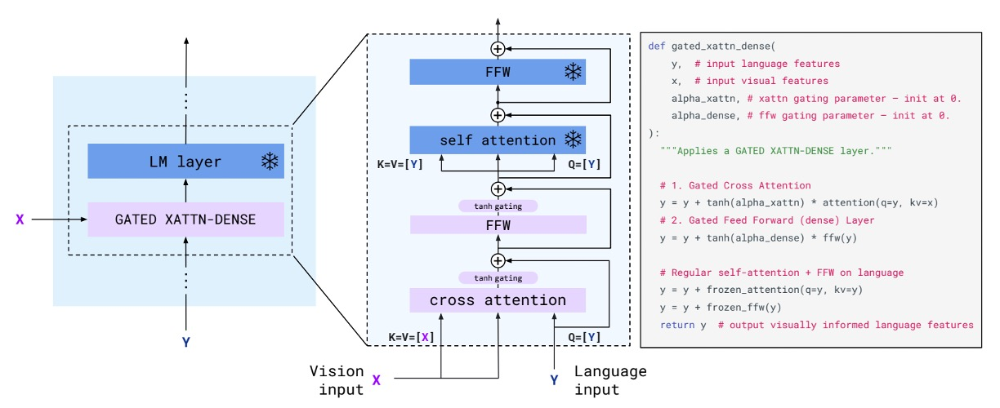

## 図文並び

[**Flamingo: a Visual Language Model for Few-Shot Learning**](https://arxiv.org/abs/2204.14198)

---

以前の論文ではタイトルに無理にキャラクター名などを入れてモデル名にしていたが、今ではそれもなくなり、単に好きな名詞を使うようになった。例えば、この記事のタイトル「フラミンゴ（Flamingo）」のように。

## 問題の定義

近年最も有名なアーキテクチャである CLIP は、対比学習を用いて画像とテキストを埋め込み空間で整列させ、非常に良い結果を得ています。しかし、CLIP は画像-テキスト検索にのみ使用可能で、開かれたタスク、例えば「画像質問応答」や「画像キャプション生成」には対応できません。

一方、GPT-3 は多くの分野で驚くべき成果を上げていますが、GPT-3 は画像入力には対応していません。

これらの事前学習された画像モデルと、言語モデルを組み合わせ、画像とテキストが交差する入力フォーマットを基に、マルチモーダル出力を生成する方法はあるのでしょうか？

## 問題の解決

### モデルアーキテクチャ

<figure style={{"width": "90%"}}>

</figure>

上図は Flamingo モデルのアーキテクチャの概要です。青色の部分は事前学習されたモデルで、パラメータは凍結されています。紫色の部分は新たに追加されたモジュールで、これらは最初から訓練を行います。

:::tip
このアーキテクチャは、以前読んだ Adapter モデルに似ている印象を与えます。

- [**[19.02] Adapter: 参照パラメータを 96%節約する方法**](../../model-tuning/1902-adapter/index.md)
  :::

次に、Flamingo モデルの動作方法をデータフローに沿って見ていきます。

まず、入力される画像を準備します。ここでは、犬と猫の例が示されています。これらの画像は視覚エンコーダを通じて視覚特徴ベクトルに変換されます。

視覚エンコーダについては、効果的な事前学習モデルを適当に選べばよく、ここでは Normalizer-Free ResNet（NFNet）が使用されています。画像は視覚エンコーダを通じて特徴ベクトルに変換され、その後、感覚的再サンプラー（Perceiver Resampler）に入力されます。

ここで、感覚的再サンプラーは特徴のダウンサンプリングと次元調整を行い、視覚特徴ベクトルが言語モデルの入力形式に合わせて調整されます。調整された後、視覚特徴は固定長 64 の視覚トークン（visual tokens）に変換されます。

:::tip
感覚的再サンプラーは、クロスアテンション機構を使用して指定された数の視覚トークンを計算します。
:::

---

次に、上図の右側の部分について説明します。

入力フォーマットは、交互に並べられた画像とテキストのシーケンスです。ここでは、以下のような例が示されています：

- **\<image\> This is a very cute dog. \<image\> This is a very cute**

この図文シーケンスを言語モデルに入力し、「クロスアテンション層」を通じて処理します。著者はこのモジュールにいくつかの改良を加え、「GATED XATTN-DENSE」と名付けています。

このプロセスでは、言語特徴と画像特徴が混合され、最終的に出力結果が次のように生成されます：

- **"a very cute cat."**

:::tip
全体のアーキテクチャは非常にシンプルで理解しやすいです。その後は十分なデータを収集し、モデルを訓練します。
:::

### クロスアテンション層

<figure style={{"width": "90%"}}>

</figure>

先ほど述べた「GATED XATTN-DENSE」について、ここではこのモジュールの設計を詳しく見ていきます。

この設計は、従来の Transformer デコーダアーキテクチャとほとんど変わりませんが、唯一の違いは`tanh gate`機構が追加されていることです。著者はこの機構を理解しやすくするために、実装コードも提供しています。

簡単に言うと、tanh はここで「視覚特徴」にどれだけの重みを「言語特徴」に加えるかを制御します。初期値は 0 で、視覚特徴を使わないことを意味します。訓練過程で、モデルは視覚特徴がテキスト生成に役立つと学習した場合、この重みを調整することになります。

### 訓練データセットと戦略

訓練中、著者は画像/動画注意マスキング機構を使用して、モデルがシーケンス内で視覚入力を逐次的に処理できるようにしました。訓練中は最大 5 枚の画像を使用しますが、評価中には最大 32 対の画像/動画とその対応するテキストを処理できます。

使用された訓練データセットは以下の通りです：

- **M3W（MultiModal Massive-Web）データセット**：約 4300 万のウェブページから抽出された画像とテキストの交互ペア。
- **ALIGN データセット**：18 億枚の画像とその alt テキストのペア。
- **LTIP（Long Text & Image Pairs）データセット**：312 万枚の画像と高品質な長文テキストのペア。
- **VTP（Video & Text Pairs）データセット**：2700 万の短い動画とその対応するテキスト記述。

目標関数は、複数のデータセットにおける加重負の対数尤度を最小化します：

$$
\sum_{m=1}^{M} \lambda_m \cdot \mathbb{E}_{(x, y) \sim \mathcal{D}_m} \left[ -\sum_{\ell=1}^{L} \log p(y_\ell | y_{<\ell}, x_{\leq \ell}) \right],
$$

ここで、$\mathcal{D}_m$は$m$番目のデータセット、$\lambda_m$はその加重係数です。

:::tip
実際にはこれは Cross Entropy Loss で、複数のデータセットを同時に考慮して、各データセットに重みが割り当てられています。
:::

## 討論

この論文の最初で、著者は多数の実験結果を示しています。一緒に見ていきましょう。

### 結果展示

最初の赤いフラミンゴは、この論文のマスコットです。

全体的に見て、結果は非常に良いです。

### 他のモデルとの比較

<figure style={{"width": "90%"}}>

</figure>

Flamingo は、4 つのタスク例を使用するだけで、16 のベンチマークテストで以前のゼロショットおよび少数ショット学習法を大きく上回り、新しいタスクにおける実用性と効率性を示しました。また、モデルのパラメータ規模が大きくなると、少数ショット学習性能が著しく向上します（GPT-3 に似ています）。

Flamingo は、トレーニング中に各シーケンスに最大 5 枚の画像のみを使用しますが、推論時には最大 32 枚の画像や動画を利用でき、その柔軟性を示しています。

### 微調整モデル

<figure style={{"width": "90%"}}>

</figure>

データ注釈を拡張する場合、短期間の微調整（低学習率、視覚エンコーダーを解凍して高解像度処理）を通じて、Flamingo は 5 つの追加ベンチマークテストで新しい最良のパフォーマンスを達成しました。これには VQAv2、VATEX、VizWiz、MSRVTTQA、HatefulMemes が含まれます。

6 つのベンチマークテストで、Flamingo は単一のモデル重みと 32 のタスク特化の例だけで、最良の微調整手法（Fine-Tuned SotA）を上回りました。

### 消融実験

<figure style={{"width": "90%"}}>

</figure>

消融実験は Flamingo-3B モデルで行われ、DEV ベンチマークテストの検証サブセット（4-shot）を使用して、各設計選択の貢献を評価しました。

- **トレーニングデータの構成の重要性**
  - 交差した画像-テキストデータセット M3W を除去すると、パフォーマンスが 17%低下。
  - 従来の画像-テキストペアデータセットを除去すると、パフォーマンスが 9.8%低下。
  - 映像-テキストペアデータセットを除去すると、すべての映像タスクのパフォーマンスに悪影響を与える。
- **勾配蓄積戦略**
  - 勾配蓄積戦略はラウンドロビン更新戦略よりも効果的です。
- **冷起動 tanh ゲートの役割**
  - tanh ゲートメカニズムを除去すると、全体のパフォーマンスが 4.2%低下し、トレーニングの不安定性が生じる。
- **条件付きアーキテクチャの選択**
  - 結果として、GATED XATTN-DENSE は元々の交差注意メカニズムよりもパフォーマンスが良い。
- **計算/メモリとパフォーマンスのトレードオフ**
  - 各層に GATED XATTN-DENSE を挿入すると、パフォーマンスが最良だが計算コストが最も高い。
  - 4 層ごとに挿入すると、トレーニング速度が 66%向上し、パフォーマンスは 1.9%低下する。
- **Perceiver リサンプラーの優位性**
  - Perceiver Resampler vs. MLP vs. Transformer を比較。
  - 結果として、Perceiver Resampler は速度とパフォーマンスで他の方法を上回った。
- **視覚エンコーダの選択**
  - NFNet-F6 vs. CLIP ViT-L/14 vs. NFNet-F0 を比較。
  - 結果として、NFNet-F6 のパフォーマンスは CLIP ViT-L/14（+5.8%）および NFNet-F0（+8.0%）を上回った。
- **言語モデルの凍結の必要性**
  - ゼロから言語モデルをトレーニングすると、パフォーマンスが 12.9%低下する。
  - 言語モデルを微調整すると、パフォーマンスが 8.0%低下し、「災害的忘却」が示される。

## 結論

Flamingo は、画像と映像のタスクに適した汎用モデルであり、特定のタスクに必要なトレーニングデータが非常に少ないという特徴があります。また、このアーキテクチャは柔軟なインタラクション能力を示し、従来の視覚ベンチマークの制限を突破しました。

著者は、大規模な事前訓練された言語モデルと強力な視覚モデルを統合し、汎用的な視覚理解に向けた重要な一歩を踏み出しました。この研究は、今後の研究にとって重要な参考となるでしょう。

:::tip
モデルの幻覚、出力の攻撃的な言語、読める内容、固定観念や差別など、これらの LLM の一般的な問題は、この論文でも例外ではありません。

著者は最後の章で、使用時にこれらの問題に注意するように私たちに警告しています。
:::
