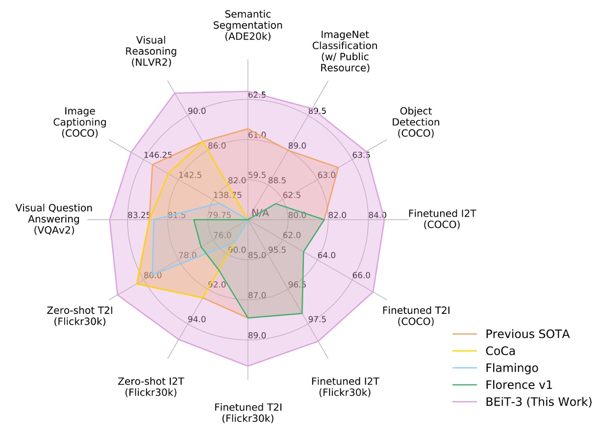

## 英雄见るところ略同じ

[**Image as a Foreign Language: BEiT Pretraining for All Vision and Vision-Language Tasks**](https://arxiv.org/abs/2208.10442)

---

BEiT の象徴的な特徴といえば「離散符号化」だと誰もが知っています。

そのため、この論文を読んだとき、多くの人が自然に「BEiT-3 ではどのような新しい『離散符号化』技術が出てくるのだろう」と期待するでしょう。

しかし実際には、BEiT-3 は「離散符号化」の方法を画像の事前学習に「適用」しただけです。この論文が主に議論したいテーマは、**「テキスト、画像、多モーダルの事前学習タスクを統一的な方法で処理するにはどうすればよいか？」** という点です。

過去の成功を懐かしむのは自然なことですが、そこにあまり執着しないようにしましょう。

## 問題の定義

「画像とテキストを一緒に事前学習する」というアイデア自体は、新しいものではありません。

以前からよくあるアプローチをご存じかもしれません。例えば、複数の事前学習タスクを使用する方法です。画像とテキストの一致（image-text matching）、画像とテキストの検索（retrieval）、さまざまなマスク設計などがあります。

もし記憶にない場合は、以前読んだ BLIP アーキテクチャを見てみましょう：

<figure style={{"width": "80%"}}>

</figure>

モデルは画像ブランチ、テキストブランチなどに分かれ、複数のタスクを介してモーダル間の関係を学習します。この方法は効果的ではあるものの、モデルやデータ規模が大きくなるにつれ、学習プロセスが複雑化し、維持や拡張が難しくなる場合があります。

画像がトークンに変換でき、テキストもトークンに変換できるのであれば、統一的な方法で処理できない理由は何でしょうか？すべてをテキストとして扱えば解決するのではないでしょうか？

以前の研究者も同じことを考えたに違いありません。しかし、実際に有効なアーキテクチャを構築できていないということは、そこに何らかの困難が存在することを示しています。

著者は、この問題を解決するために「マルチパスアーキテクチャ」を採用すべきだと考えています。

## 問題の解決

### モデルアーキテクチャ

<figure style={{"width": "80%"}}>

</figure>

マルチパスアーキテクチャ、またはよりよく知られる名称「混合専門家システム（Mixture-of-Experts, MoE）」は、複数の専門家モデルを組み合わせた手法です。BEiT-3 の提案以前に、このアーキテクチャを多モーダル分野に適用した論文として VLMo が挙げられます。

:::info
VLMo に興味がある方はこちらをご参照ください：

- [**[21.11] VLMo: Unified Vision-Language Pre-Training with Mixture-of-Modality-Experts**](https://arxiv.org/abs/2111.02358)

      

      <figure style={{"width": "90%"}}>
      
      </figure>
      

VLMo では、異なるモダリティごとに対応する事前学習タスクが割り当てられていますが、BEiT-3 ではすべて「マスク予測」方式で統一してモデルを学習させています。
:::

そのため BEiT-3 のアーキテクチャは、VLMo の Multiway Transformers を直接参考にしています。

各 Multiway Transformer モジュールは、共通の自己注意モジュールと、モダリティごとに異なるフィードフォワードネットワーク（モダリティ専門家）を含んでいます。入力トークンのモダリティに基づき、対応する専門家が特徴計算を行います。

著者の実装では、各層に視覚専門家と言語専門家が配置されています。また、最上位の 3 層には視覚と言語の統合を行う「視覚-言語専門家（fusion encoders）」が設定されています。

モダリティ専門家を使用することで、特定モダリティに特化した情報を捉えることが可能になります。一方、共通の自己注意モジュールは異なるモダリティ間の整合性を学習し、多モダリティタスク（例：視覚-言語）において深い統合を実現します。

:::tip
**このシリーズ、Switch Transformer の MoE に似ていませんか？**

- [**[21.01] Switch Transformer**](../../transformers/2101-switch-transformer/index.md)

    

    <figure style={{"width": "70%"}}>
    
    </figure>
    

その通りです！NLP 分野では、MoE アーキテクチャは 2021 年の注目テーマでした。一方、CV 分野では数か月遅れてこのアイデアが多モダリティ分野に応用されました。
:::

### 多モダリティ適応

上図のように、著者は BEiT-3 の「共有 Multiway Transformer」アーキテクチャが、さまざまな下流タスクに応じて「柔軟に切り替え」または「組み合わせ」可能であることを示しています。

- **(a) Vision Encoder (画像エンコーダ)**：画像分類、物体検出、インスタンス分割、セマンティックセグメンテーションなど、画像特徴表現のみを必要とする視覚タスクに対応。
- **(b) Language Encoder (言語エンコーダ)**：テキスト分類、シーケンスラベリング、対話システムなど、言語特徴のみに依存する言語タスクに対応。
- **(c) Fusion Encoder (融合エンコーダ)**：視覚質問応答（VQA）、視覚推論（NLVR2）、画像とテキストの推論など、画像とテキスト間の深い相互作用を必要とするタスクに対応。
- **(d) Dual Encoder (デュアルエンコーダ)**：クロスモダリティ検索（image-text retrieval）など、高効率なマッチングを求めるタスクに対応。たとえば、大量の候補画像の中から指定されたテキストに最も関連する画像を素早く見つけるタスク、またはその逆のタスク。
- **(e) Sequence-to-Sequence Learning (画像からテキストへの生成)**：画像入力からテキスト出力を生成するタスク（例：画像キャプション生成）や、画像とテキストの変換を必要とするアプリケーションに対応。

画像エンコード、テキストエンコード、さらには画像とテキストの統合、検索、生成といった複雑な応用まで、すべて同じアーキテクチャ上で構成可能です。これにより、完全に異なるモデルへ切り替える必要がありません。

### 事前学習タスク

BEiT-3 の事前学習プロセスでは、モデルがランダムに選ばれたテキストトークンや画像パッチをマスクし、それらを復元するよう訓練されます。この方法を通じて、テキストと画像それぞれの表現を学習すると同時に、画像と言語の対応関係も学習します。

訓練時、テキストデータは SentencePiece トークナイザで分割され、画像データは BEiT v2 のトークナイザを使用して離散的なビジュアルトークンに変換され、復元の目標となります。著者は、単一モーダルのテキストトークンを 15%、テキストと画像のペア内のテキストトークンを 50% ランダムにマスクしました。画像については、BEiT のブロックマスク戦略を採用し、40% の画像パッチをマスクしました。

実験では、「マスク予測」タスクのみを使用した場合、対比学習モデルに比べてはるかに小さい事前学習バッチサイズで十分であることが示されました。

:::tip
ここで BEiT v2 を使用しているため、この論文の名称が BEiT-3 となっています。
:::

### モデルと訓練データ

BEiT-3 のパラメータ数は約 19 億（1.9B）で、その内訳は以下の通りです：

- 視覚専門家：6.92 億
- 言語専門家：6.92 億
- 視覚-言語専門家：5200 万
- 共通の自己注意モジュール：3.17 億

アーキテクチャは ViT-giant を参考にしており、40 層の Multiway Transformer で構成されています。各層の隠れ層の次元数は 1408、中間層の次元数は 6144、注意ヘッド数は 16 です。各層には視覚専門家と言語専門家が含まれています。さらに、最上位の 3 層には視覚-言語専門家が追加されており、深いクロスモーダル統合を実現しています。

BEiT-3 の事前学習は「単一モーダル」と「多モーダル」の両データを用いて実施されました。単一モーダルは「純粋な画像」または「純粋なテキスト」のデータ、多モーダルは「画像＋テキスト」のペアデータを指します。

- **多モーダルデータ**：約 1500 万枚の画像と 2100 万組の画像・テキストペアが使用され、以下の公開データセットが含まれています：
  - Conceptual 12M (CC12M)
  - Conceptual Captions (CC3M)
  - SBU Captions (SBU)
  - COCO
  - Visual Genome (VG)
- **単一モーダルデータ**：
  - ImageNet-21K からの 1400 万枚の画像
  - 160GB のテキストコーパス（英語版 Wikipedia、BookCorpus、OpenWebText3、CC-News、Stories）

### 訓練戦略

BEiT-3 の事前学習は 100 万ステップ行われました。各バッチには 6144 個のサンプルが含まれ、その内訳は以下の通りです：

- 2048 枚の画像
- 2048 本のテキスト
- 2048 組の画像・テキストペア

モデルは画像を 14×14 のパッチに分割し、224×224 の解像度で事前学習を実施しました。画像のデータ拡張には BEiT と同様の方法（ランダムスケールクロップ、水平反転、色のジッター）が採用されています。

テキストデータのトークナイザとして SentencePiece を使用し、語彙サイズは 64k です。

その他のハイパーパラメータ設定は以下の通りです：

- AdamW オプティマイザを使用し、設定は $\beta_1=0.9, \beta_2=0.98, \epsilon=1e-6$。
- 学習率はコサインアニーリングで調整。最高学習率は 1e-3 で、最初の 1 万ステップで線形に上昇。
- 重み減衰は 0.05。
- ランダム深さを 0.1 の比率で適用し、過学習を防ぎ、モデルの汎化能力を向上。

:::tip
このバッチサイズは、対比学習を行うモデルに比べてかなり小さいです。対比学習モデルでは、効果的な負サンプル比較のために非常に大きなバッチサイズが必要とされることが一般的です。
:::

## 討論

### 他のモデルとの比較

<figure style={{"width": "90%"}}>

</figure>

著者は、視覚-言語および視覚タスクにおける複数の公開ベンチマークで BEiT-3 を広範に評価しました。

BEiT-3 は多くのタスクで最先端（SoTA）のパフォーマンスを達成し、過去の他モデルを大幅に上回る成果を示しました。詳細な結果は以下の表にまとめられています：

<figure style={{"width": "90%"}}>

</figure>

### モジュール寄与分析

論文ではアブレーションスタディ（消去実験）が提供されておらず、具体的なデータからこのアーキテクチャ内で「どのモジュール」が最も重要な役割を果たしているかを判断することはできません。そのため、以下のように独自に分析を試みます：

- **「膨大なデータ量」は核心的な貢献か？**

  BEiT-3 は大規模な単一モーダルおよび多モーダルデータを用いて事前学習を行っています。これには、ImageNet-21K の 1400 万画像、160GB のテキストデータ、1500 万の画像、2100 万の画像・テキストペアが含まれます。

  確かに大量のデータは、現在の主流の大規模モデルが高い性能を達成するための重要な要素です。しかし、この論文は「データ量」を過度に強調するものではなく、独自の非公開データを使用しているわけでもありません。著者は「大量のデータ」の恩恵だけでなく、「公開データのみを使用した場合でも既存モデルを上回れる方法論の優位性」を重視しています。

  膨大なデータ量は基盤を提供しますが、唯一の革新ではなく、この論文の焦点は「方法論の統一性と有効性」にあります。

---

- **専門家モデルのアーキテクチャ**

  BEiT-3 は各 Transformer 層に vision expert、language expert を持ち、最上位層には vision-language expert が追加され、共通の自己注意モジュールを共有しています。

  この設計は一般的な Mixture-of-Experts (MoE) と異なり、「マルチパスでありながら多くのパラメータを共有する」点に重点があります。これにより視覚と言語が同じモデル内で最大限に相互作用または独立性を保つことが可能です。Multiway 構造は、単一モデルで純視覚パス、純テキストパス、クロスモーダルパスを実現し、エンジニアリング面での利便性とクロスタスク転移の優位性をもたらします。

  ただし、この「マルチパスアーキテクチャ」の設計は VLMo の革新に由来するため、この部分は BEiT-3 の独自の貢献とは言えません。

---

- **統一された学習目標関数**

  著者は、従来の多モーダル事前学習で一般的だった「複数タスク並行」の複雑な方法を改善し、マスクデータモデリング（masked data modeling）1 つだけでクロスモーダル整合性を学習する方法を採用しました。

  このアイデア自体は新規ではなく（BERT や BEiT で採用されている Mask-Then-Predict に類似）、多モーダル領域でも同様の試みがあります。しかし、従来の多くのモデルでは、対比損失（contrastive loss）や画像-テキストマッチング（ITM）といった複数のタスクが必要でした。BEiT-3 は単一の目標関数だけで画像と言語の整合性やクロスモーダル融合を学習でき、大規模な訓練が「シンプル」に進む点が注目に値します。

  著者が「事前学習タスクの簡素化」を追求し、成功させたことは、BEiT-3 が多タスク・多モーダルで優れた性能を発揮する主要な要因であり、論文の主張の中核となっています。

---

- **BEiT に基づく離散的な画像エンコーディング**

  BEiT シリーズは、離散ビジュアルトークン（NLP における語彙トークンに類似）を使用し、画像を直接「MLM」によるマスキングと再構築の対象としています。

  この技術は BEiT v1, v2 から引き継がれたもので、BEiT-3 で初めて提案されたわけではありません。しかし、今回の研究で「画像はもう 1 つの言語として扱える」という可能性がさらに検証されました。離散化された画像エンコードを用いることで、モデルは BERT ライクな事前学習メカニズムでテキストと画像を同時に処理できるようになります。

  従来、CNN や patch embedding を用いて画像マスキングを行っていた手法と比べ、この「離散化画像」の戦略は BEiT-3 の基盤ですが、主な革新は BEiT の前作に起因します。

---

大規模なデータ使用と離散的なビジュアルトークンの採用は、全体の方法論を支える基盤ですが、最も重要な貢献を挙げるなら、「改良された Multiway Transformers アーキテクチャ」による「統一されたマスク目標」による学習だと言えるでしょう。

著者は「大規模データ」や「巨大パラメータ」だけに頼るのではなく、「事前学習タスクの簡略化」と「柔軟で共有可能なマルチエキスパートパス」を通じて、下流タスクでの有効性と利便性を実証しました。

## 結論

本論文では、汎用的な多モーダル基盤モデル BEiT-3 を提案しました。

画像を「外国語」として扱うというコンセプトにより、テキスト、画像、および画像・テキストペアを同一のマスク方式「言語モデリング」で訓練可能にしました。また、Multiway Transformers アーキテクチャを採用することで、異なるモダリティ間での柔軟な切り替えを可能にしました。

現在主流の多モーダル事前学習手法と比較して、BEiT-3 の訓練プロセスは簡潔で、大規模なスケールアップが容易という点で非常に魅力的な設計となっています。
