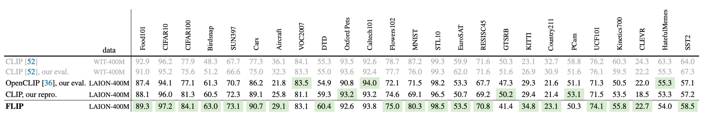
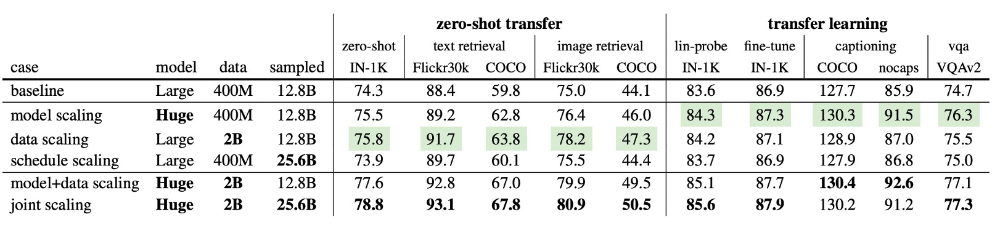

# [22.12] FLIP

## CLIP 二つ目の型

[**Scaling Language-Image Pre-training via Masking**](https://arxiv.org/pdf/2212.00794)

---

これは Meta AI が提案した論文で、主に CLIP の訓練方法を改良し、訓練プロセスをより効率的にしようという目的があります。

## 問題の定義

OpenAI は 2021 年初め頃に CLIP アーキテクチャを提案し、その後、業界で対比学習の応用熱潮を引き起こしました。

CLIP は簡単で使いやすいですが、訓練が難しいです。

ここで言う「訓練が難しい」とは、モデルのアーキテクチャが複雑ということではなく、訓練のスケールが非常に大きいということです。

CLIP の原論文では、彼ら自身が作成した WIP データセットを使用しており、そこには 4 億組の画像とテキストのペアが含まれています。基本的なモデルを訓練するためには、最初から最後まで 592 台の V100 を使用して 18 日間かかるのです！

このような計算資源は、私たちのような個人のエンジニアにとっては、手の届かないほど膨大なもので、到底到達できません。

Meta AI もこれが問題だと考え、FLIP（Fast-CLIP）を提案しました。

## 解決問題

### モデルアーキテクチャ

<figure style={{"width": "70%"}}>

</figure>

FLIP のアーキテクチャは CLIP と同じですが、訓練過程で新しい手法「Masking」を使用しています。

設計のアイデアは非常にシンプルで、訓練中に使用する画像エンコーダが ViT の構造であるならば、MAE の訓練方法を参考にして、一部の画像だけで良いモデルを訓練できるというものです。

そして著者はそのように進め、効果が元の CLIP と同等であることを確認しましたが、訓練時間は 4 倍短縮できました！

そして私たちは嬉しくてこの論文を読み終えました！（~またまた！実際は違う！~）

:::tip
前提となる論文を読んでいない読者は、以下の以前の読書ノートを参考にできます：

- [**[21.03] CLIP: 次元の壁を打破する**](../2103-clip/index.md)
- [**[21.11] MAE: 四分之一の線索**](../../vision-transformers/2111-mae/index.md)
  :::

### マスキング方法

画像マスキングの部分で、著者は MAE と同じ方法を採用し、画像を重ならない小さなブロックに分け、その後大部分のブロックをランダムにマスキングします。比率は 50%または 75%に設定できます。

マスクされた領域はモデルに入力されないため、同じメモリ要求で 2 倍または 4 倍のバッチを使用して訓練できることが、スピードアップの重要な要因となります。

CLIP のアーキテクチャには画像入力とテキスト入力がありますが、ここでは画像部分だけがマスクされ、テキスト入力部分にはマスキングは行いません。テキストエンコーダは小さく、全体のパフォーマンスに影響はないため、著者は消融実験でこの問題を探求しています。

推論時には、完全な画像を直接使用でき、エンコーダを調整する必要はありません。

### 損失関数

ここでは MAE のマスキング方法を使用していますが、MAE の再構築損失は使用していません。著者は消融実験を通じて、再構築損失がゼロショット転送のパフォーマンスに必要ではないことを判断し、デコーダと再構築損失を削除することでスピードを向上させることができました。

そのため、このモデルでは最初から最後まで対比損失のみを使用し、正のサンプルペアは画像とテキストのペア、負のサンプルペアは同一バッチ内の他のサンプルです。画像とテキストエンコーダの出力は線形層を通じて同じ次元の埋め込み空間に投影され、両者の余弦類似度は学習可能な温度パラメータを掛け算し、InfoNCE 損失の入力として使用されます。

InfoNCE の式は次の通りです：

$$
L = -\frac{1}{N} \sum_{i=1}^{N} \log \frac{\exp(\text{sim}(v_i, t_i) / \tau)}{\sum_{j=1}^{N} \exp(\text{sim}(v_i, t_j) / \tau)}
$$

ここで、$N$はバッチサイズ、$v_i$と$t_i$はそれぞれ$i$番目の画像とその対応するテキストの埋め込みベクトル、$\text{sim}(v_i, t_j)$は$v_i$と$t_j$の間の余弦類似度、$\tau$は学習可能な温度パラメータです。

余弦類似度の計算方法は次の通りです：

$$
\text{sim}(v_i, t_j) = \frac{v_i^\top t_j}{\|v_i\| \|t_j\|}
$$

この損失関数は、正のサンプルペア間の類似度を最大化し、負のサンプルペアとの類似度を最小化することを目的としています。バッチ全体のサンプルを計算することで、モデルは関連する画像とテキストを近いベクトル空間に埋め込む方法を学習します。

## 討論

一体、何が改良されたので、CLIP の訓練速度が向上したのでしょうか？

この章では、著者が行った作業について見ていきます。

### 消融実験

1. **画像マスキング比率（Masking Ratio）**

   - モデルは LAION-400M で訓練され、ImageNet-1K の検証セットでゼロショット精度を評価しました。
   - 表 (a) では、画像マスキング比率がモデルのパフォーマンスに与える影響を調べており、バッチサイズも対応してメモリ使用量を維持しています。
     - 50%のマスキングの場合、精度は CLIP のベースラインより 1.2%高くなりました。
     - 75%のマスキング精度はベースラインと同等です。
   - 訓練時間：50%および 75%のマスキングでは、訓練時間がそれぞれ元の 0.50 倍および 0.33 倍に短縮されました。

2. **バッチサイズ（Batch Size）**

   - 表 (b) では、バッチサイズが精度に与える影響を探求しています。
     - バッチサイズを増加させると、精度が安定して向上します。バッチサイズが 16k の場合、50%マスキングモデル（68.5%）はマスキングなしモデル（68.6%）とほぼ同じ精度になります。
     - マスキングは正規化効果をもたらし、過学習のリスクを減少させる可能性があります。
     - マスキング比率が 75%に達し、バッチサイズが固定されている場合、情報損失が原因でパフォーマンスが低下します。
   - バッチサイズの拡大はメモリ要求を大幅に増加させることはありませんが、実際にはメモリの制限が依然としてボトルネックとなります。

3. **テキストマスキング（Text Masking）**

   - 表 (c) では、テキストの 50%をランダムにマスクした場合の精度の低下（2.2%）を示しています。
     - 言語データは情報密度が高いため、大きな比率でマスクするのには向いていません。
     - パディングトークンのマスキングを優先することで、精度の低下を減少させることができます（低下幅は 0.4%）。
   - テキストマスキングによる速度向上は限られており、テキストエンコーダの計算量は総計の 4.4%に過ぎません。そのため、後の実験ではテキストマスキングは行われませんでした。

4. **推論段階のマスキング（Inference Unmasking）**

   - 表 (d) では、ゼロショット設定でもマスクと非マスク間の分布差異を無視しても効果は良好であることが示されています。
     - 推論時にマスクを使用すると、精度が 7.3%低下します。
     - 複数のマスク視点を用いたアンサンブル手法を使用すると、精度低下を減少させることができますが、完全な画像を使用した推論には及びません。

5. **マスク解除微調整（Unmasked Tuning）**

   - 表 (e) では、事前訓練データで 0%マスキングを使用して 0.32 エポックの微調整を行うことで、75%マスキングモデルの精度が 1.3%向上することが示されています。
     - マスク解除微調整は、事前訓練と推論間の分布差異を効果的に縮小することができます。

6. **再構築損失（Reconstruction Loss）**

   - 表 (f) では、再構築損失を追加した影響を探求しています。
     - 再構築ヘッド（reconstruction head）は MAE を参考に設計され、小型のデコーダを使用して画像の正規化されたピクセルを再構築し、再構築損失と対比損失を組み合わせました。
     - 実験結果は、再構築損失を追加するとゼロショット精度および微調整後の精度がわずかに低下することを示しています。最終的に著者は再構築損失を捨て、システムを簡素化し精度を改善しました。

### CLIP との比較

FLIP の有効性を証明するために、著者は FLIP を複数の CLIP ベースラインと比較し、FLIP が CLIP の有力な代替案であることを示しています。比較対象は以下の通りです：

- **原始 CLIP**：非公開データセット WIT-400M で訓練。
- **OpenCLIP**：公開データセット LAION-400M で訓練され、原始 CLIP の忠実な再現。
- **著者による CLIP 再現版**：同じく LAION-400M で訓練され、方法論の違いを分析するための助けとなります。

### ImageNet ゼロショット転送

<figure style={{"width": "80%"}}>

</figure>

上記の表は、ImageNet-1K でのゼロショット精度を比較したものです。

- **著者による CLIP 再現版**：OpenCLIP と同じ LAION-400M で訓練した場合、精度はわずかに高いです。
- **FLIP のパフォーマンス**：最適な設定（バッチサイズ 64k、マスキング比率 50%、マスク解除微調整）を使用すると、ViT-L/14 モデルは**74.6%**の精度を達成し、OpenCLIP より 1.8%、著者の CLIP 再現版より 1.5%高い結果を示しました。
- 原始 CLIP と比較すると、FLIP は依然として 0.7%の差があり、これは主に異なる事前訓練データセットによるものと思われます。

### 他のデータセットでのゼロショット分類

<figure style={{"width": "100%"}}>

</figure>

上記の表は、複数のデータセットでのゼロショット分類結果を比較したものです。

WIT データセットを使用したモデルは、特定のタスク（Aircraft、Country211、SST2 など）でより良いパフォーマンスを示しましたが、LAION データセットを使用したモデルは Birdsnap、SUN397、Cars などで優れていました。ほとんどのタスクで、FLIP は OpenCLIP や著者の CLIP 再現版に対して顕著に優れています（緑色で示されています）。

### ゼロショット検索

<figure style={{"width": "100%"}}>

</figure>

上記の表は、Flickr30k と COCO での画像/テキスト検索のパフォーマンスを比較したものです。

FLIP は、全ての指標で CLIP を上回り、原始 CLIP をも超えています。WIT データセットは、これらの検索タスクで特に優位性はありません。

### モデルのスケーリング

FLIP の訓練速度向上機能を活かし、著者は CLIP を超える最大の設定を探索し、3 つの次元での拡張を研究しました：

1. **モデルスケーリング（Model Scaling）**

   - 画像エンコーダを ViT-L から**ViT-H**に置き換え、パラメータ量は元の約 2 倍に増加し、テキストエンコーダも対応して拡張されます。

2. **データスケーリング（Data Scaling）**

   - 事前訓練データを**LAION-400M**から**LAION-2B**に拡張しました。
   - 訓練時間とデータ量の影響を分けるため、サンプリングデータ量は**12.8B**（400M データで 32 エポック、または 2B データで 6.4 エポックに相当）に固定されました。

3. **訓練スケジュールの拡張（Schedule Scaling）**

   - サンプリングデータ量を**12.8B**から**25.6B**に増加（400M データで 64 エポック）。
   - 各拡張実験では、他の 2 つの軸の設定を固定し、単一の次元の効果を観察しました。

実験結果は以下の通りです：

1. **モデルスケーリング**（Fig. a）：初期から安定した精度向上が見られ、訓練後半では差が縮まります。
2. **データスケーリング**（Fig. b）：初期はベースラインと同等のパフォーマンスですが、訓練が進むにつれて精度が向上します。この設定は追加の計算コストを必要としません。
3. **訓練スケジュール拡張**（Fig. c）：訓練時間が倍増しますが、精度の向上は限られており、むしろ平坦化します。破線は訓練時間を半分にした対比曲線を示し、訓練時間の延長による限界効用が減少していることを示しています。

### 転送能力

上記の表は、異なる拡張戦略が下流タスクに与える影響を詳述しています：

- モデルスケーリングとデータスケーリングは、全ての指標でベースラインを上回り、特定の状況では顕著な向上が見られました。
- 訓練時間を延長しなくても大幅な向上があり、大規模データがより多くの情報を提供することを示しています。

表の倒数第二行に示されているように、モデルとデータの共同拡張は単独の拡張をすべて上回っています：モデルスケーリングで 1.2%向上（74.3%→75.5%）、データスケーリングで 1.5%向上（74.3%→75.8%）、共同拡張で 3.3%向上（77.6%）。これにより、より大きなモデルはより多くのデータが必要であることがわかります。

表の最後の行では、モデル、データ、訓練スケジュールの完全な拡張を示しており、ゼロショット IN-1K の精度が**78.8%**に達し、OpenCLIP の同じ公開データでの最良結果（78.0%）を上回っています。

OpenCLIP は 32B のデータで訓練されていますが、FLIP は 25.6B のみを使用し、速度は 2.5 倍速く、推定で「3,360GPU 日」の訓練コストが節約されます。これにより、FLIP の大規模データとモデルにおける高効率と顕著なコスト優位性が示されています。

## 結論

一連の消融実験と比較分析を通じて、著者は FLIP の有効性を証明しました。FLIP は、大規模データセット上で CLIP モデルを訓練する際に訓練速度を大幅に向上させ、複数のゼロショットタスクで優れたパフォーマンスを達成しました。

時間は金銭であり、誰もが金を無駄にしたくないと考えるべきです。

CLIP を作りたいですか？ここでの FLIP は、明らかにコストパフォーマンスの高い選択肢です。
