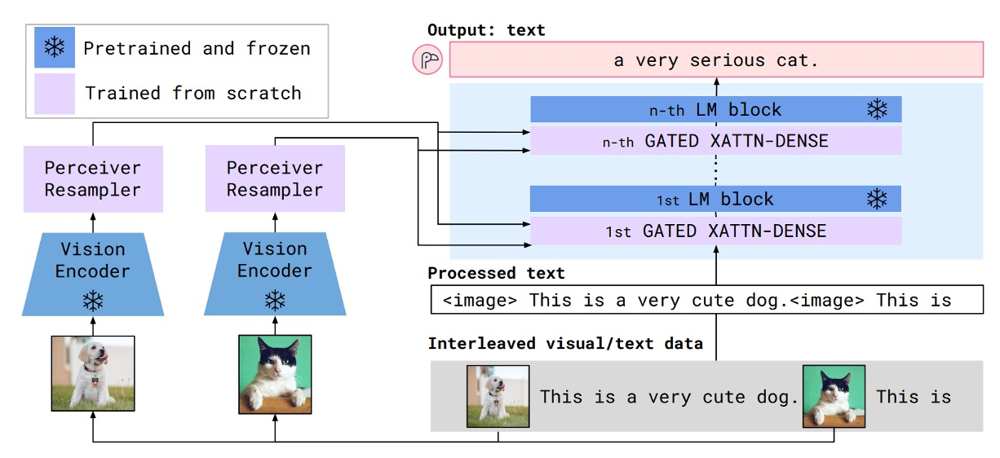
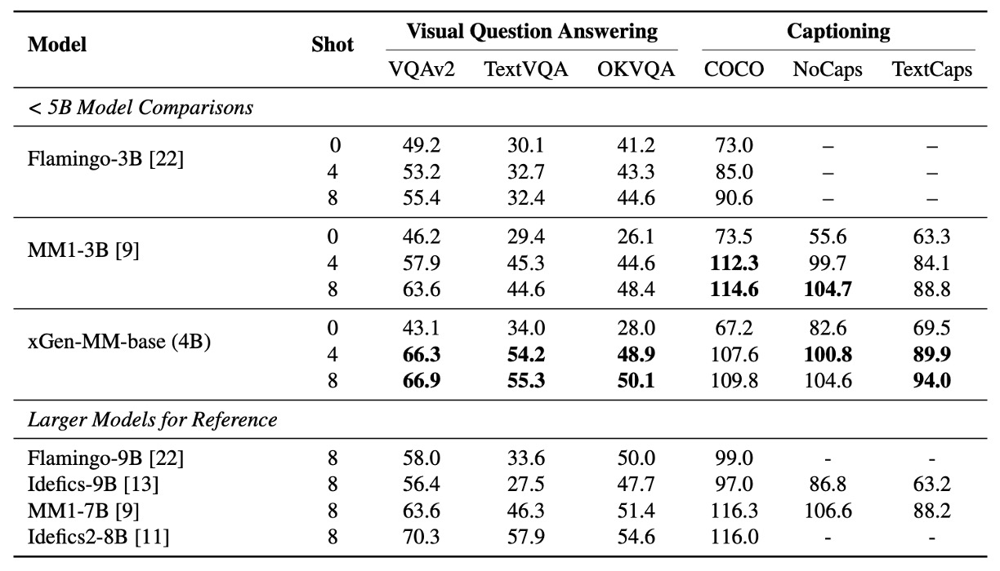
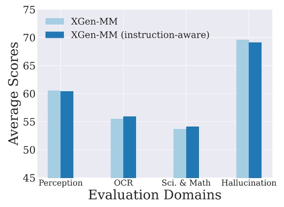

## またの名を BLIP-3

[**xGen-MM (BLIP-3): A Family of Open Large Multimodal Models**](https://arxiv.org/abs/2408.08872)

---

論文のタイトルを決めることは簡単なことではない。

もし過去に非常に成功したモデルがあるのであれば、続編を出すことでさらなる注目を集めることができるかもしれない。しかし、もしさらに大きな成功を収めたいのであれば、全く新しい名前にするべきかもしれない。

だからこそ、今回は著者が「新旧全てを詰め込んで、論文タイトルにしてしまおう！」と考えたのだ。

## 問題定義

BLIP-2 の議論を続ける。

:::tip
もしまだ BLIP-2 を見ていない場合は、こちらを参照してください：

- [**[23.01] BLIP-2: Q-Former 初登場**](../../model-tuning/2301-blip2/index.md)
  :::

著者は Q-Former アーキテクチャと多様な訓練目標（ITM、ITC、ITG 損失）が、大規模訓練の難易度を上げ、BLIP-2 が単一画像入力のみをサポートしており、最も自然なマルチモーダルデータ形式、すなわち言語とテキストが交差する入力データ形式を処理できないことを指摘しています。

では、「交差データ形式」は過去にどのように処理されていたのでしょうか？

これには、もう一つ有名な論文を振り返る必要があります。それが Flamingo です。

:::tip
読者には Flamingo の内容を先に確認することをお勧めします：

- [**[22.04] Flamingo: 図文並記**](../2204-flamingo/index.md)
  :::

Flamingo の構造では、画像とテキストの特徴を統合するためにクロスアテンションモジュールを使用しており、文字と画像の相互入力プロセスを実現しています。そのプロセスは以下のようになります：

<figure style={{"width": "80%"}}>

<figurecaption>Flamingo モデルアーキテクチャ</figurecaption>
</figure>

---

しかし、この記事の著者は Flamingo の設計が複雑すぎると感じ、また Flamingo が採用している「Perceiver Resampler」が Q-Former と概念的に似ているものの、より簡単であると考えています。

そのため、この論文の目標は以下の通りです：

1. Perceiver Resampler を Q-Former の代替案として使用
2. Flamingo のクロスアテンションアーキテクチャを簡略化

最後に、モデルのパフォーマンスを向上させるために、大規模かつ高品質なデータセットを導入し、モデルの訓練基盤を強化しています。

著者は、データ、アーキテクチャ、訓練手法を改善することで、オープンソースとプライベート LMM とのギャップを縮小し、オープンソースリソースを通じて研究と応用の発展を促進し、オープンソースコミュニティがマルチモーダルモデルの潜在能力をより良く探求し活用できるようにしたいと考えています。

## 問題解決

### モデルアーキテクチャ

<figure style={{"width": "80%"}}>

</figure>

先ほど述べたように、著者は言語と画像の交差入力構造をすべて 1 つのデコーダーに統合しようとしています。上図では、雪の結晶はこの部分が凍結されたパラメータであり、訓練には参加しないことを示し、燃えている炎はこの部分が訓練可能であることを示しています。

モデルの主要なモジュールは以下の通りです：

- **Vision Transformer (ViT)**：画像特徴を処理する役割を担います。
- **Vision Token Sampler (Perceiver Resampler)**：画像埋め込み（embeddings）を圧縮するために使用されます。
- **事前訓練された大型言語モデル（phi3-mini）**：マルチモーダル入力の言語処理の中心となります。

データの流れは、画像特徴が ViT によって処理された後、Perceiver Resampler で圧縮され、最後に言語特徴とともに phi3-mini に入力されるというものです。

### 訓練フロー

モデルアーキテクチャはシンプルですが、訓練プロセスは複雑で、4 つの段階に分かれています：

- **第一段階：事前訓練**

  この段階の目的は、次のテキストトークンを予測することです。マルチモーダルデータセットの混合を基に訓練します。基盤となるモデルは約 1000 億のマルチモーダルトークンで訓練され、画像解像度は$384 \times 384$ピクセルです。

- **第二段階：教師あり微調整（SFT）**

  この段階の目的は、事前訓練されたモデルがユーザーのクエリをよりよく理解し、従うようにすることです。公開されている指示に基づく微調整データセット（instruction-following datasets）を使って微調整を行い、過去の研究と同様に、任意解像度の画像トークンサンプリング戦略を採用します。

  :::tip
  この部分については、以下の論文を参考にできます：

  - [**[23.10] Improved baselines with visual instruction tuning**](https://arxiv.org/abs/2310.03744)
  - [**[24.05] What matters when building vision-language models?**](https://arxiv.org/abs/2405.02246)
  - [**[24.06] Cambrian-1: A Fully Open, Vision-Centric Exploration of Multimodal LLMs**](https://arxiv.org/abs/2406.16860)
    :::

- **交差マルチ画像教師あり微調整（Interleaved Multi-Image Supervised Fine-tuning）**

  指示に基づいて微調整された基盤モデルに対して、第二段階の微調整を行い、モデルが複数の画像と単一画像の交差指示を処理できるように訓練します。これもまた、任意解像度の画像トークンサンプリング戦略を採用し、先の SFT 段階と一致します。

- **後訓練（Post-training）**

  モデルの有用性を向上させると同時に、幻覚（hallucination）や有害性（toxicity）を減少させることを目的としています。

  この段階はさらに 2 つのサブ段階に分かれます：

  - **第一サブ段階：直接的な好ましさ最適化（Direct Preference Optimization, DPO）**
    - モデルの有用性と視覚的信頼性（visual faithfulness）を強化します。
  - **第二サブ段階：安全性微調整（Safety Fine-tuning）**
    - モデルの安全性を向上させ、有害な行動のリスクを減らします。

### 事前訓練データセット

<figure style={{"width": "90%"}}>

</figure>

事前訓練のデータセットは、上図のように、マルチモーダルデータセットの混合を使用し、特定の割合でサンプリングされています。内容には以下が含まれます：

- **マルチモーダル交差データセット（Interleaved Dataset Mixture）**

  - MINT-1T： 規模 1 兆トークン（trillion tokens）。
  - OBELICS： HTML ファイルで構成されており、MINT-1T とはドメインカバレッジと前処理方法が少し異なります。

- **キャプションデータセット（Caption Dataset Mixture）**

  - BLIP3-KALE： 大規模高品質キャプションデータセット。
  - BLIP3-OCR-200M： OCR エンジンを使用して 2 億枚の高解像度画像にキャプションを付けたデータセット。

      

      <figure style={{"width": "50%"}}>
      
      </figure>
      

  - BLIP3-GROUNDING-50M： 5000 万枚の画像にキャプションを付け、オブジェクトの位置情報を追加。

      

      <figure style={{"width": "50%"}}>
      
      </figure>
      

  - その他の公開データセットには、Datacomp-1B、CC12M、CC3M、VG、SBU などがあります。

### 教師あり微調データセット

この段階のデータセットは主に以下を含みます：

- **指示に基づく微調整データセット（Instruction-Following Dataset）**
  - 異なる分野からの公開データセットで、マルチモーダル対話、画像キャプション、視覚的質問応答、グラフ/文書理解、そして科学や数学のデータが含まれます。
  - 視覚的指示微調整のために、純粋なテキスト指示データが追加され、100 万件の公開指示データが収集され、1 回の完全訓練（1 エポック）が行われます。
- **マルチ画像指示微調整データセット（Interleaved Multi-Image Instruction Dataset）**
  - 単一画像モデルで微調整を開始し、マルチ画像/交差画像-テキスト指示データを加えて訓練します。
  - モデルが単一画像能力で劣化しないように、単一画像データを一部混ぜてマルチ画像訓練データに追加します。

### 後訓練データセット

後訓練は 2 つの部分に分かれます：

1. **直接的な好ましさ最適化（Direct Preference Optimization, DPO）**

   VLFeedback データセットを使用し、8 万件のマルチモーダル指示が含まれ、高得点のサンプルを選別して好ましさデータセット（62,600 件）を生成します。1 エポックで訓練を行い、低ランク適応（LoRA）を使って LLM の背景重みの 2.5%を更新します。

   :::tip
   LoRA に興味がある場合は、以前読んだ以下の記事を参照できます：

   - [**[21.06] LoRA: 万分の一の LLM**](../../model-tuning/2106-lora/index.md)
     :::

2. **安全性微調整（Safety Fine-tuning）**

   VLGuard データセットを使用し、2,000 件の不安全な画像と指示が含まれます。これにはプライバシー漏洩、敏感な話題（政治、性、暴力など）、詐欺や差別などの不安全な例が含まれます。さらに、安全性と有用性のバランスを取るために、ランダムに 5,000 件の安全な指示データが選ばれ、訓練セットに混ぜられます。

## 討論

### 事前訓練モデル表現

<figure style={{"width": "90%"}}>

</figure>

まず、著者は BLIP-3 と他のマルチモーダルモデルをいくつかのベンチマークで比較し、画像キャプション（Captioning）や視覚的質問応答（VQA）のタスクで、事前訓練されたモデルの少数サンプル学習能力を評価しました。

ここでは主にゼロショット（zero-shot）と少数サンプル（4-shots および 8-shots）の性能を比較しています。

マルチモーダルなコンテキスト学習におけるモデルのパフォーマンスは、同規模の LLM と同等であり、OCR タスクのパフォーマンスにおいて、BLIP-3 は TextCaps、TextVQA、VQA-v2 のベンチマークで MM1-3B を大きく上回り、さらに大規模なモデル（Idefics-9B や MM1-7B など）を超える結果を示しました。

実験テストでは、サンプル数（shots）の増加が性能をさらに向上させることが示され、モデルがコンテキスト分布に適応する能力を示しています。

### 微調整モデルのパフォーマンス

<figure style={{"width": "90%"}}>

</figure>

著者はマルチモーダル（画像-テキスト）のベンチマークテストにおける包括的な評価を行い、以下の能力をカバーしています：

- **一般的な視覚的質問応答（VQA）**：モデルが画像に関連する質問に答える能力を評価。
- **視覚的認識能力**：画像の理解と解析能力をテスト。
- **ドメイン知識テスト**：数学および科学に関連するデータセットでのパフォーマンス。
- **OCR 能力**：テキストが豊富な画像（例えば、ドキュメントやグラフ）を処理する能力。
- **幻覚抑制**：不正確なコンテンツを生成する能力を減少させる能力。

比較対象は 5B 未満のクローズドソースモデルと最先端（SOTA）のオープンソースモデルです。

:::tip
5B 未満のクローズドソースモデルは以下です：

- [**[24.03] MM1: Methods, Analysis & Insights from Multimodal LLM Pre-training**](https://arxiv.org/abs/2403.09611)

最新のオープンソースモデルは以下です：

- [**[23.12] Vila: On pre-training for visual language models**](https://arxiv.org/abs/2312.07533)
- [**[24.04] Phi-3 Technical Report: A Highly Capable Language Model Locally on Your Phone**](https://arxiv.org/abs/2404.14219)
  :::

実験結果により、xGen-MM-instruct は一般的な VQA および視覚的認識のベンチマークテストにおいて以前のベースラインモデルを上回り、卓越したパフォーマンスを示しました。一方、xGen-MM-instruct-interleave は、マルチ画像データで微調整されたにもかかわらず、単一画像ベンチマークでも良好なパフォーマンスを維持し、最高の総合スコアを獲得しました。

:::tip
`interleave`は、微調整データの入力形式が交互に並べられた画像とテキストであり、単独の画像やテキストではないことを意味します。
:::

### 事前訓練データ規模

<figure style={{"width": "90%"}}>

</figure>

著者は、マルチモーダル訓練トークンの数（2B から 100B）が事前訓練の評価指標に与える影響を調査しました。結果は上図の通りです。

- **60B トークン**：画像テキスト記述と OCR（Text-Caps、TextVQA）のタスクでパフォーマンスが顕著に向上。
- **100B トークン**：少数サンプル評価指標（few-shot metrics）において若干の追加的な効果を示すが、効果は減少。

実験結果は、データ規模がパフォーマンス向上に対して限界効用逓減の傾向を示しており、60B が最適な投入対効果の点であることを示唆しています。

### 任意解像度訓練戦略

<figure style={{"width": "70%"}}>

</figure>

画像のダウンサンプリング戦略について、著者は 3 つの異なる戦略を設計しました：

- **任意解像度（any-resolution）**：各画像パッチを個別にダウンサンプリングし、LLM に入力、詳細を多く保持。
- **固定解像度（fixed-resolution）**：すべての画像を視覚エンコーダのデフォルトサイズに調整し、元の縦横比を保持。
- **固定サンプリング（anyres-fixed-sampling）**：すべての画像埋め込み（embeddings）を連結して 1 つのシーケンスとして扱い、統一的にダウンサンプリング。

実験結果は上図の通り、任意解像度戦略が高解像度でテキストが豊富なタスクで最良のパフォーマンスを示し、他の戦略を大きく上回りました。

### 指示感知設計

<figure style={{"width": "70%"}}>

</figure>

著者は、画像のダウンサンプリングプロセスにテキスト指示マークを追加することで、モデルのパフォーマンスが向上するかをテストするため、指示感知視覚トークンサンプリング実験を行いました。

実験結果は上図の通り、ベースラインモデルと比較して指示感知バージョンのパフォーマンスに顕著な差は見られませんでした。著者は、感知器ダウンサンプリング器の構造（交差注意層のみ）では Q-Former の指示感知効果を完全に再現できないと推測しています。

性能差が小さいことを考慮し、モデル設計を簡素化するため、著者は最終的に元の感知器ダウンサンプリング器を保持し、今後の研究で指示感知 VL コネクタの改善の可能性をさらに探求することを提案しています。

### 純粋なテキストデータの多様性

<figure style={{"width": "90%"}}>

</figure>

著者は、純粋なテキストデータの多様性がマルチモーダルモデルのパフォーマンスにどのように影響するか、特にマルチモーダルな数学およびコード関連のベンチマークでのパフォーマンスに焦点を当てて調査しました。

実験設計では、以下の 2 つの純粋なテキストデータセットを比較しました：

- **多様化データ**：対話、数学、コードなどの多領域データを含む。
- **単一タイプデータ**：一般的な対話データのみを含む。

実験結果は上図の通り、数学およびコードデータの追加が関連するベンチマーク（MathVista など）のパフォーマンス向上に貢献することがわかりました。一般的な VQA ベンチマークに対する影響は限定的でした。

著者は、純粋なテキストデータの多様性が特定の領域のパフォーマンスを強化し、特定でない領域のタスクには影響が少ないことを分析しました。マルチモーダル学習において、純粋なテキストデータは依然としてモデルの言語能力を維持するための重要な要素です。

## 結論

著者は、xGen-MM（BLIP-3）という包括的なフレームワークを提案し、これは一連のオープンな大型マルチモーダルモデルを訓練するためのものです。訓練モジュールは精密に設計された大規模データセットの混合に基づき、マルチモーダルコンテキスト学習などの新たな能力を発揮し、マルチモーダルベンチマークテストで印象的な結果を達成しました。

オープンソースとクローズドソースの間の競争は依然として激しく、著者はオープンソースモデル、整理されたデータセット、微調整コードを通じて、研究コミュニティにアクセス可能なマルチモーダル基盤モデルとデータセットを提供し、研究者が LMM の潜在能力と新たな能力をさらに探求し推進することを奨励しています。

:::info
オープンソースプロジェクト：[**salesforce/LAVIS**](https://github.com/salesforce/LAVIS/tree/xgen-mm)
:::
