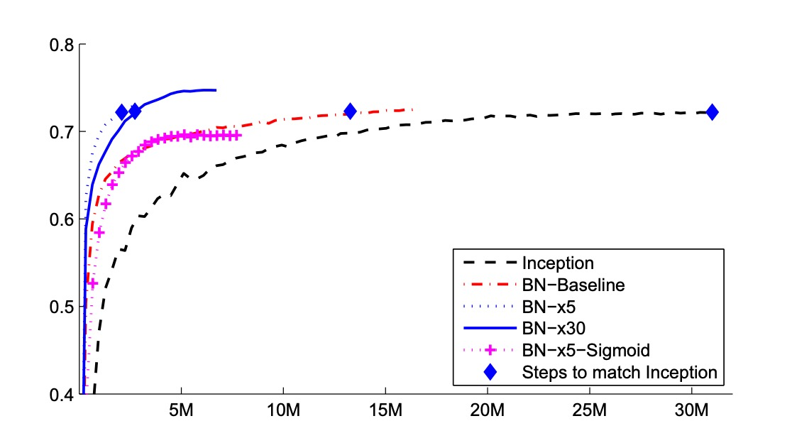

# [15.02] BatchNorm

## バッチ正規化

[**Batch Normalization: Accelerating Deep Network Training by Reducing Internal Covariate Shift**](https://arxiv.org/abs/1502.03167)

---

深層学習は、視覚や音声などの多くの分野で顕著な進展を遂げており、確率的勾配降下法（SGD）とその変種であるモーメンタム（Momentum）や Adagrad は、深層神経ネットワークのトレーニングに非常に効果的な方法であることが証明されています。これらの最適化アルゴリズムは、損失を最小化するためにネットワークのパラメータを調整し、トレーニング中に小さなバッチデータを順次処理することで行われます。

SGD の過程では、通常、毎回 1 つの訓練例を使ってパラメータを更新するのではなく、少量のデータ（ミニバッチ）を使用します。この方法の利点は、まず、ミニバッチの損失勾配が全体の訓練セットの勾配をよく推定しており、バッチサイズが増えるにつれて、この推定の質が向上することです。次に、現代の計算プラットフォームがサポートする並列計算能力により、単一のデータを何度も処理するよりも、バッチ全体のデータを処理する方が効率的であるという点です。

しかし、確率的勾配降下法は、学習率のようなハイパーパラメータを慎重に調整する必要があり、トレーニング中にネットワークが深くなると、小さな変化が増幅され、いわゆる**共変量シフト（Covariate Shift）**を引き起こす可能性があります。

:::tip
これは「現在の層」が「前の層」のパラメータ変化によって引き起こされる入力分布の変化に適応し続ける必要があるという意味です。

例えば次のように考えます：

シグモイド活性化関数を持つ層 $g(x) = \frac{1}{1+\exp(-x)}$ を考えます：

$$z = g(Wu + b)$$

ここで $u$ は層の入力、重み行列 $W$ とバイアスベクトル $b$ は学習すべきパラメータです。

$|x|$ が増加すると、$g'(x)$ はゼロに近づきます。これは、$x = Wu + b$ の絶対値が小さい次元を除き、勾配が $u$ に流れる際に消失し、モデルのトレーニングが遅くなることを意味します。しかし、$x$ は $W$、$b$ とそれ以下のすべての層のパラメータに影響されるため、トレーニング中にパラメータの変化が $x$ の多くの次元を非線形飽和領域に導き、収束速度が遅くなる可能性があります。
:::

## 定義問題

著者は内部共変量転送を以下のように定義しています：

- **訓練過程中のネットワークパラメータの変化によって引き起こされるネットワークの出力分布の変化**。

訓練を改善するために、内部共変量転送を減少させることが望ましいです。層の入力 $x$ の分布を固定することで、訓練速度を加速できると予想されます。

過去の研究によると、ネットワークの訓練は、その入力がホワイトニングされている、すなわち線形変換を通じてゼロ平均および単位分散を持ち、かつ相関がなくなっている場合、収束が速くなることが示されています。各層の入力は前の層の出力に由来するため、各層の入力をホワイトニングすることは有利です。

しかし、これらの修正を最適化ステップと交互に実行すると、勾配降下ステップは正規化が必要な方法でパラメータを更新しようとする可能性があり、これが勾配ステップの効果を減少させます。

例えば、入力が $u$ の層を考え、学習されたバイアス $b$ を加え、出力の平均を引くことで正規化します：$\hat{x} = x - E[x]$、ここで $x = u + b$、$X = \{x_1...N\}$ は $x$ の訓練セットの値で、$E[x] = \frac{1}{N} \sum_{i=1}^N x_i$ です。もし勾配降下ステップが $E[x]$ の $b$ に対する依存を無視した場合、$b \leftarrow b + \Delta b$ で更新されます、ここで $\Delta b \propto -\frac{\partial \ell}{\partial \hat{x}}$。

したがって、$u + (b + \Delta b) - E[u + (b + \Delta b)] = u + b - E[u + b]$ となります。このように、$b$ の更新とその後の正規化変化の組み合わせにより、層の出力と損失は変化しません。訓練が進むにつれて、$b$ は無限に増加し、損失は一定のままになります。正規化が単に中心化だけでなく、スケーリングを行う場合、この問題はさらに悪化します。

---

上記の方法の問題は、勾配降下法が正規化の存在を考慮していないことにあります。

この問題を解決するために、著者は、任意のパラメータ値についてネットワークが常に必要な分布を持つ出力を生成することを保証したいと考えています。これにより、損失がモデルパラメータに関する勾配が正規化およびそのモデルパラメータ $\Theta$ に対する依存関係を考慮するようになります。

$x$ を層の入力ベクトルとし、$X$ を訓練データセット上のこれらの入力の集合とします。正規化は次のように書けます：

$$
\hat{x} = \text{Norm}(x, \chi)
$$

これは、与えられた訓練サンプル $x$ に依存するだけでなく、すべてのサンプル $\chi$ に依存します。

逆伝播において、$$\frac{\partial \text{Norm}(x, \chi)}{\partial x}$$ と $$\frac{\partial \text{Norm}(x, \chi)}{\partial \chi}$$ を計算する必要があります。後者を無視すると、上記の爆発が生じます。

この枠組みでは、共分散行列 $\text{Cov}[x] = E_{x \in X}[xx^T] - E[x]E[x]^T$ とその逆平方根を計算してホワイトニングされた出力 $\text{Cov}[x]^{-1/2}(x - E[x])$ を生成し、これらの変換の導関数を逆伝播のために計算する必要があります。

ホワイトニングされた層入力全体を計算するのは非常に高価であるため、著者は、パラメータ更新後に訓練セット全体を分析することなく、入力正規化を微分可能な方法で実行する代替方法を探し始めました。

:::tip
**ホワイトニング vs 標準化**

- **標準化 (Standardization)**

  標準化はデータ処理において、データの平均を 0、標準偏差を 1 にする方法です。この方法は通常 Z スコア正規化と呼ばれ、計算式は次の通りです：

  $$
  z = \frac{(x - \mu)}{\sigma}
  $$

  ここで $x$ は元のデータ、$\mu$ はデータの平均、$\sigma$ はデータの標準偏差です。標準化後のデータ分布は標準正規分布の特性を持ち、これにより異なる特徴（または異なる次元）を比較しやすくし、特に勾配ベースの最適化方法を用いたモデルの訓練時に処理が容易になります。

- **ホワイトニング (Whitening)**

  ホワイトニングは、データの入力を同じ分散を持つ新しい特徴に変換し、新しい特徴間で相関がない（すなわち特徴間の共分散行列が対角行列である）ことを目的とした高度なデータ前処理技術です。これは単にデータの平均をゼロにし、分散を標準化するだけでなく、入力特徴間の相関を取り除くことも含みます。計算過程は通常、次の手順を含みます：

  1. データのセンタリング（平均を引く）。
  2. データの共分散行列を計算する。
  3. 共分散行列を固有値分解する。
  4. 固有値を使ってデータをスケーリングし、固有ベクトルでデータを回転させて変換後の特徴を互いに独立にします。

  ホワイトニングの効果は、互いに線形無関係な（独立した）特徴を生成することで、主成分分析（PCA）やいくつかの神経ネットワークモデルなど、いくつかのアルゴリズムで非常に有用です。これにより、学習効率や結果の解釈性が改善されます。

標準化は主にデータを共通の尺度に規範化するために使用され、機械学習モデルの訓練に広く適用され、特にデータのスケールに敏感なモデル（例えばサポートベクターマシン（SVM）や神経ネットワーク）において重要です。一方、ホワイトニングは特徴をさらに独立させ、多重共線性の問題を解消するのに役立ちますが、計算が標準化よりも複雑で、固有値分解や行列演算を含みます。

実際のアプリケーションでは、標準化が一般的であり、その計算が簡単であり、通常はほとんどのモデル訓練のニーズを満たすのに十分です。
:::

## 解決問題

各層入力に対する完全なホワイトニング操作の計算コストが高く、完全には微分不可能であるため、著者は 2 つの必要な簡略化を行いました。

まず、層の入力と出力の特徴に対して共通のホワイトニングを行うのではなく、各スカラー特徴を独立に正規化し、ゼロ平均および単位分散にします。入力が $d$ 次元のベクトル $x = (x^{(1)}, \ldots, x^{(d)})$ である層について、各次元を次のように正規化します：

$$
\hat{x}^{(k)} = \frac{x^{(k)} - \mathbb{E}[x^{(k)}]}{\sqrt{\mathrm{Var}[x^{(k)}]}}
$$

ここで、期待値と分散は訓練データセットに基づいて計算されます。

注意すべきは、単純に各層の入力を正規化することが層の表現能力を変える可能性がある点です。例えば、シグモイド関数の入力を正規化すると、非線形領域内に制限されてしまいます。この問題を解決するために、著者はネットワークに挿入する変換が恒等変換を表現できるようにしました。そのために、各活性化値 $x^{(k)}$ に対してパラメータ $\gamma^{(k)}$ と $\beta^{(k)}$ を導入し、正規化された値をスケーリングおよび平行移動します：

$$
y^{(k)} = \gamma^{(k)} \hat{x}^{(k)} + \beta^{(k)}
$$

これらのパラメータは元のモデルのパラメータと一緒に学習され、ネットワークの表現能力を回復させます。

実際、$\gamma^{(k)} = \sqrt{\mathrm{Var}[x^{(k)}]}$ と $\beta^{(k)} = \mathbb{E}[x^{(k)}]$ を設定することで、最適な状況下で元の活性化値を回復できます。

訓練セット全体に基づくバッチ設定では、一般的に訓練セット全体を使用して活性化値を正規化します。しかし、ランダム最適化を使用する場合、これは非現実的です。

したがって、著者は 2 つ目の簡略化を行いました：ランダム勾配訓練では小さなバッチを使用し、各小バッチが各活性化値の平均と分散を推定します。このようにして、正規化に使用される統計量は勾配逆伝播に完全に参加できます。ここで注意すべきは、小バッチ方式では各次元の分散を計算するだけで、共分散行列を計算しない点です；共分散行列が必要となる場合、正規化を行う必要があり、バッチサイズがホワイトニングする活性化値の数より小さい場合、共分散行列が特異となる可能性があります。

サイズが $m$ の小バッチ $B$ を考えます。正規化は各活性化値に独立に適用されるため、特定の活性化値 $x^{(k)}$ に集中し、簡単化のために $k$ を省略します。この活性化値の小バッチにおける $m$ 個の値を $B = \{x_1, \ldots, x_m\}$ とします。

正規化後の値を $\hat{x}_1, \ldots, \hat{x}_m$ とし、それらの線形変換を $y_1, \ldots, y_m$ とします。この変換を BatchNorm 変換 $BN_{\gamma, \beta}$ と呼び、その過程は次の通りです。アルゴリズム内で、$\epsilon$ は数値的安定性のために小バッチの分散に追加される定数です。

<figure style={{"width": "60%"}}>

</figure>

$y = BN_{\gamma, \beta}(x)$ の表現では、パラメータ $\gamma$ と $\beta$ は学習が必要ですが、BN 変換は各訓練サンプルの活性化値を独立に処理するわけではないことに注意する必要があります。代わりに、$BN_{\gamma, \beta}(x)$ は訓練サンプルに依存するだけでなく、小バッチ内の他のサンプルにも依存します。スケーリングと平行移動された値 $y$ は他のネットワーク層に伝達されます。

BN 変換は微分可能な変換であり、正規化された活性化値をネットワークに導入します。これにより、モデルの訓練過程で各層が内部共変量転送の少ない入力分布上で学習を続け、訓練を加速することができます。さらに、これらの正規化された活性化値に適用される学習可能なアフィン変換は、BN 変換が恒等変換を表現できることを可能にし、ネットワークの容量を保持します。

### 学習率の向上

従来の深層神経ネットワークでは、高すぎる学習率が勾配爆発や消失を引き起こし、悪い局所的最小値に陥る原因となります。BatchNorm はこれらの問題の解決に役立ちます。ネットワーク全体で活性化値を正規化することで、パラメータの微小な変化が活性化値や勾配の大きな次優的な変化に増幅されることを防ぎ、訓練が非線形関数の飽和領域に陥るのを防ぎます。

BatchNorm はまた、パラメータのスケールに対して訓練をより堅牢にします。通常、大きな学習率は層のパラメータのスケールを増加させ、その結果、逆伝播過程で勾配を増幅させ、モデルが爆発的になる可能性があります。しかし、BatchNorm を使用することで、層の逆伝播はそのパラメータのスケールに影響されなくなります。

スカラー $a$ に対して、

$$
\mathrm{BN}(W\mathbf{u}) = \mathrm{BN}((aW)\mathbf{u})
$$

が成立し、

$$
\frac{\partial \mathrm{BN}((aW)\mathbf{u})}{\partial \mathbf{u}} = \frac{\partial \mathrm{BN}(W\mathbf{u})}{\partial \mathbf{u}}
$$

$$
\frac{\partial \mathrm{BN}((aW)\mathbf{u})}{\partial (aW)} = \frac{1}{a} \cdot \frac{\partial \mathrm{BN}(W\mathbf{u})}{\partial W}
$$

比例は層のヤコビ行列に影響を与えず、勾配伝播にも影響を与えません。

著者はさらに、BatchNorm が層のヤコビ行列の特異値を 1 に近づける可能性があり、これが訓練に有益であると推測しています。

:::tip
正規化された入力を持つ 2 つの連続層を考え、それらの正規化ベクトル間の変換：$\hat{z} = F(\hat{x})$。

もし$\hat{x}$と$\hat{z}$がガウス分布で無相関であり、$F(\hat{x}) \approx J\hat{x}$ が与えられたモデルパラメータに対する線形変換であると仮定すると、$\hat{x}$と$\hat{z}$は単位共分散を持ち、

$$
I = \mathrm{Cov}[\hat{z}] = J\mathrm{Cov}[\hat{x}]J^T = JJ^T
$$

したがって、$JJ^T = I$ となり、$J$ のすべての特異値は 1 に等しく、これが逆伝播過程で勾配の大きさを保ちます。

実際、変換は線形ではなく、正規化値がガウス分布や独立であることも保証されませんが、著者はそれでも BatchNorm が勾配伝播の改善に寄与することを期待しており、その具体的な影響については今後の研究が必要です。
:::

### Dropout は不要

BatchNorm を使って訓練する場合、訓練サンプルは小バッチ内の他のサンプルとともに観察され、訓練ネットワークは与えられた訓練サンプルに対して確定的な値を生成しなくなります。著者の実験では、この効果がネットワークの汎化に有利であることが分かりました。Dropout は通常、過学習を減らすために使用されますが、BatchNorm を使用した後、Dropout は除去することができます。

## 討論

### MNIST 実験での結果

<figure style={{"width": "80%"}}>

</figure>

内部共変量シフトが訓練に与える影響と、BatchNorm がそれに対抗する能力を検証するために、著者は MNIST データセットで数字の分類問題を扱いました。

ここでは、非常にシンプルなネットワークを使用し、入力は 28x28 のバイナリ画像で、隠れ層は 3 層、各層に 100 個のユニットがあります。各隠れ層は $y = g(Wu + b)$ を計算し、ここで $g$ は Sigmoid 非線形関数、重み$W$は小さなランダムなガウス値で初期化されます。

最後の隠れ層の後には、10 個のユニット（各クラスに 1 つ）の全結合層があり、交差エントロピー損失を使用します。ネットワークは 50,000 ステップで訓練され、各ミニバッチには 60 個のサンプルが含まれています。最後に、ネットワークの各隠れ層に BatchNorm を追加しました。

上の図は、訓練が進むにつれて、2 つのネットワークがテストデータに対する正しい予測率を保持している様子を示しています。BatchNorm を使用したネットワークは、テスト精度が高くなっています。図(b,c)では、各ネットワークの最後の隠れ層での典型的なアクティベーション値の分布がどのように進化するかを示しています。元のネットワークでは、分布は時間とともに著しく変化し、平均値や分散が変動するため、後続の層の訓練が難しくなります。一方、BatchNorm ネットワークでは、分布は訓練中に安定しており、訓練が容易になります。

### ImageNet 実験での結果

<figure style={{"width": "80%"}}>

</figure>

著者は次に、BatchNorm を新しい Inception ネットワークの変種に適用し、ImageNet 分類タスクで訓練を行いました。

実験では、BatchNorm を使用したいくつかの Inception の修正バージョンが評価されました。すべての場合において、BatchNorm は各非線形関数の入力に適用され、残りのアーキテクチャは変更されませんでした。

BatchNorm をネットワークに追加するだけでは、この方法の効果を十分に活用することはできません。そこで、著者はネットワークとその訓練パラメータをさらに変更しました：

- **学習率の増加**：BatchNorm モデルでは、学習率を高くすることで訓練速度が向上し、副作用はありません。
- **Dropout の削除**：前述の通り、BatchNorm は Dropout と同じ目的を達成します。BatchNorm を使用した Inception から Dropout を削除することで、訓練を加速でき、過学習も増加しません。
- **L2 重み正則化の削減**：Inception では、モデルパラメータに対する L2 損失が過学習を抑制していますが、BatchNorm Inception では、この損失の重みが 5 倍削減されました。
- **学習率減衰の加速**：Inception の訓練中、学習率は指数関数的に減衰します。BatchNorm ネットワークは Inception よりも訓練速度が速いため、学習率の減衰速度を 6 倍速くしました。
- **局所応答正規化の削除**：Inception や他のネットワークでは有益ですが、BatchNorm を使用すると必要なくなります。
- **訓練サンプルのシャッフルの徹底**：著者は訓練データをミニバッチ内でシャッフルし、同じサンプルが常に同じミニバッチに現れないようにしました。これにより、検証精度が約 1％向上し、BatchNorm が正則化器として機能するという見解に一致します。
- **光度歪みの削減**：BatchNorm ネットワークは訓練速度が速く、各訓練サンプルの観察回数が少ないため、訓練者は「真実に近い」画像に焦点を当てることができ、歪みが減少しました。

著者は次のネットワークを評価しました。すべてのネットワークは LSVRC2012 訓練データで訓練され、検証データでテストされました：

- **Inception**：最初に説明したアーキテクチャで、初期学習率は 0.0015 です。
- **BN-Baseline**：Inception と同じですが、各非線形関数の前に BatchNorm を適用します。
- **BN-x5**：BatchNorm を使用した Inception。初期学習率は 5 倍に増加し、0.0075 になりました。同じ学習率の増加により、元の Inception のモデルパラメータは機械の限界に達しました。
- **BN-x30**：BN-x5 と似ていますが、初期学習率は 0.045（Inception の 30 倍）です。
- **BN-x5-Sigmoid**：BN-x5 に似ていますが、非線形関数として Sigmoid $g(t) = \frac{1}{1+\exp(-x)}$ を使用します。著者はまた、Sigmoid を使って元の Inception を訓練したが、モデル精度は常にランダムに等しかったと報告しています。

上の図は、訓練ステップ数に対するネットワークの検証精度の変化を示しています。Inception は 3100 万訓練ステップ後に 72.2％の精度に達しました。以下の表は、各ネットワークが同じ 72.2％の精度に達するのに必要な訓練ステップ数と、ネットワークが達成した最高の検証精度とその精度に達するのに必要なステップ数を示しています。

<figure style={{"width": "70%"}}>

</figure>

BatchNorm のみ（BN-Baseline）では、Inception の精度を半分以下の訓練ステップで達成しました。BN-x5 は、Inception よりも 14 倍少ないステップで 72.2％の精度を達成しました。興味深いことに、学習率をさらに高める（BN-x30）と、初期の訓練速度は少し遅くなりますが、最終的に高い精度を達成することができます。600 万ステップ後に 74.8％に達し、Inception が 72.2％に達するのに必要なステップ数の 5 倍少ないです。

さらに、著者は、内部共変量シフトの減少が BatchNorm を使用した深層ネットワークが「Sigmoid を非線形関数として使用して訓練できる」ことを示したと検証しました。BN-x5-Sigmoid は 69.8％の精度に達しました。

:::tip
Sigmoid を使用してネットワークを訓練することは非常に困難であることは周知の事実であり、BatchNorm なしで Sigmoid を使用した Inception は、精度が 1/1000 を超えることはありませんでした。
:::

## 結論

BatchNorm は、各バッチのデータを標準化することによって内部共変量シフト問題を解決します。この方法は、学習過程を安定させるだけでなく、より高い学習率の使用を可能にし、モデル訓練速度を大幅に向上させ、訓練過程で正則化効果を発揮し、過学習を減少させます。

しかし、この技術の効果はバッチサイズに大きく依存します。小さなバッチでは、標準化の安定性が低下し、数値的な安定性の問題を引き起こすことがあります。特に、データの分布が極端な値に近い場合、以前の RepVGG の量子化問題のような問題が発生することがあります：

- [**[22.12] QARepVGG: RepVGG を再び偉大にする**](../../reparameterization/2212-qarepvgg/index.md)

最後に、訓練と推論の段階で BatchNorm の挙動には違いがあり、これはエンジニアがよく遭遇する問題です。訓練時には現在のバッチの統計を使用しますが、推論時には通常、全訓練データセットのグローバルな統計を使用します。この違いは、モデルが訓練時と推論時で異なる性能を示す原因となります。

実際の応用では、BatchNorm を使用する際にこれらの要因を慎重に考慮し、モデルが異なるシナリオにうまく適応できるようにする必要があります。
