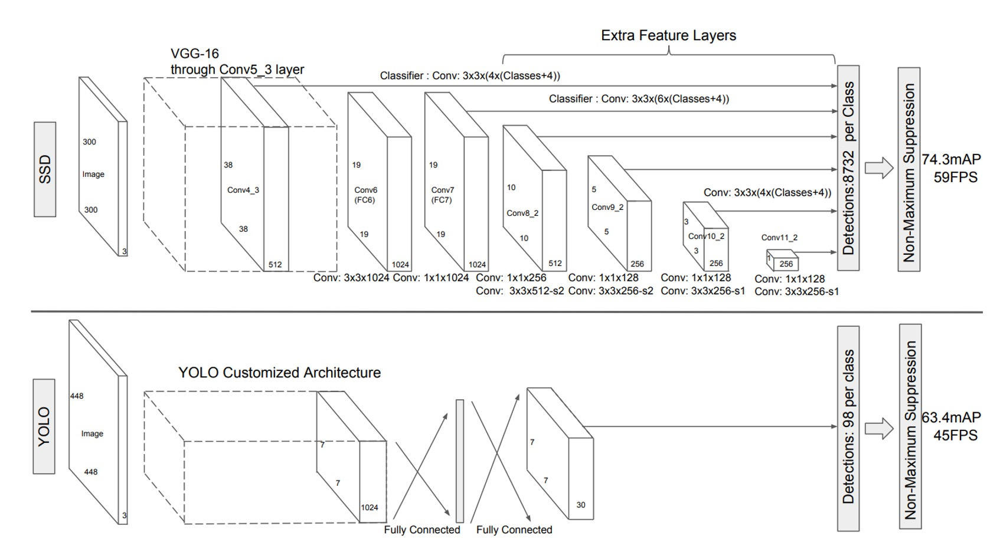
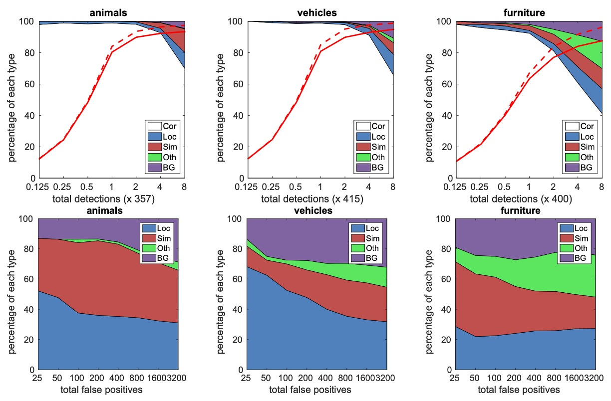

## 時間短縮とプーリングの削減

[**SSD: Single Shot MultiBox Detector**](https://arxiv.org/abs/1512.02325)

---

Faster RCNN は依然として業界の基準です。

最もよく見られる標準的な作業フローは次のようになります：

1. 境界ボックス提案（Bounding Box Proposal）：RPN を使用して候補ボックスを生成。
2. 各ボックスで特徴を再サンプリング（ROI Pooling）
3. 分類器に送信して分類

## 問題の定義

これらの方法は非常に正確ですが、計算量が依然として大きいです。特に、組み込みシステムなどでは、最も高速な検出器である Faster RCNN を使っても、約 7 FPS 程度が限界です。

著者は、効率のボトルネックが各候補ボックスごとに特徴抽出と分類を行う部分にあると考えています。おそらく……

このステップを省略できるかもしれません。

## 問題の解決

### モデルアーキテクチャ

この問題を解決するために、著者は SSD アーキテクチャを提案しました。上図は、SSD と YOLO-v1 の比較図です。

SSD の設計では、地域提案のステップを完全に省略し、各特徴マップのピクセルから直接予測を行う方法に変更しています。

この図は少し抽象的に見えるかもしれませんので、分解して説明します：

1. 最初に VGG をバックボーンとして使用し、最初の 1/8 スケールの特徴マップを抽出します。この特徴マップのサイズは $38 \times 38$ です。

   ここでは、各ピクセルが「検出ボックス」を予測します。異なるアスペクト比で、合計 4 つの検出ボックスを予測します。

   したがって、この層では $38 \times 38 \times 4$、合計$5776$個の検出ボックスを予測します。

   :::tip
   上の図では、出力サイズが $38 \times 38 \times 4 \times (\text{Classes}+4)$ となっているのが見えると思います。この $\text{Classes}+4$ は、各検出ボックスが予測する「物体クラス」（おそらく 21 クラス以上）と「境界ボックス」（Cx, Cy, W, H）を意味します。
   :::

---

2. 次に特徴マップをダウンサンプリングし、$19 \times 19$ の特徴マップを得ます。

   ここでは上記とは異なり、6 つの検出ボックスを予測するため、この層では $19 \times 19 \times 6$、合計$2166$個の検出ボックスを予測します。

---

3. 次に再度ダウンサンプリングを行い、$10 \times 10$ の特徴マップを得ます。

   ここでも 6 つの検出ボックスを予測し、この層では $10 \times 10 \times 6$、合計$600$個の検出ボックスを予測します。

---

4. 次にもう一度ダウンサンプリングを行い、$5 \times 5$ の特徴マップを得ます。

   ここでも 6 つの検出ボックスを予測し、この層では $5 \times 5 \times 6$、合計$150$個の検出ボックスを予測します。

---

5. 次に再度ダウンサンプリングを行い、$3 \times 3$ の特徴マップを得ます。

   ここでは 4 つの検出ボックスを予測し、この層では $3 \times 3 \times 4$、合計$36$個の検出ボックスを予測します。

---

6. 最後にもう一度ダウンサンプリングを行い、$1 \times 1$ の特徴マップを得ます。

   ここでは 4 つの検出ボックスを予測し、この層では $1 \times 1 \times 4$、合計$4$個の検出ボックスを予測します。

---

すべてを合計すると、$5776 + 2166 + 600 + 150 + 36 + 4 = 8732$個の検出ボックスとなります。

:::tip
これは単に文字数を稼ぐためではありません。論文中に$8732$という数字が登場したため、どのようにこの数が出てきたのかが気になり、つい計算してみました。

その後の研究では通常、$1/8$、$1/16$、$1/32$の 3 層の特徴マップが使われることが多く、SSD のように$1/256$の特徴マップを使うケースはあまり見られません。
:::

### 正負サンプルのマッチング戦略

訓練中、各真のラベルボックスに対応する予測を決定する必要があります。

各真のラベルボックスは、複数の予測ボックスの中から選ばれます。これらの予測ボックスは異なる位置、アスペクト比、およびスケールで配置されています。つまり、予測ボックスはさまざまな変化を持ち、画像内のさまざまな形状やサイズの物体をカバーするようになっています。

ここで、著者は **Jaccard 重複度**（交差と和の比率、通常は IoU（Intersection over Union）として知られています）を計算することで、どの予測ボックスが真のラベルボックスと一致するかを決定します。

各真のラベルボックスに対して、まず IoU が最も高い予測ボックスを見つけます。これにより、各真のラベルボックスには少なくとも 1 つの一致する予測ボックスが存在することが保証されます。このステップは、ネットワークがどのように正しく境界ボックスを予測するかを学習できるようにするためです。なぜなら、各真のラベルボックスには必ず予測ボックスが対応するからです。

過去の研究方法と異なり、SSD では第一段階でのマッチングが完了した後、IoU が 0.5 を超えるすべての予測ボックスを対応する真のラベルボックスとマッチングします。このマッチング戦略の利点は、学習問題を簡素化し、ネットワークが 1 つの IoU が最も高いボックスに対してのみ予測を強制するのではなく、重なり合う複数の予測ボックスに対して予測を行えるようにすることです。

このように、適切な予測ボックスが複数存在する場合、ネットワークはより柔軟に学習を行い、予測精度を向上させることができます。

### 訓練目標

SSD の訓練目標は、MultiBox の目標関数に基づいていますが、複数の物体クラスを扱うようにさらに拡張されています。

- [**[13.12] Scalable Object Detection using Deep Neural Networks**](https://arxiv.org/abs/1312.2249)

具体的には、$x_{pij} = \{1, 0\}$を指示変数とし、$i$番目の予測ボックスが$pj$クラスの真のラベルボックスと一致するかどうかを示します。SSD のマッチング戦略では、各真のラベルボックスは複数の予測ボックスにマッチできるため、$\sum_i x_{pij} \geq 1$です。

SSD の総損失関数は、**位置損失**（localization loss, $L_{loc}$）と**信頼損失**（confidence loss, $L_{conf}$）の加重和で構成されます：

$$
L(x, c, l, g) = \frac{1}{N}(L_{conf}(x, c) + \alpha L_{loc}(x, l, g))
$$

ここで、$N$はマッチした予測ボックスの数で、$N=0$の場合、損失は 0 に設定されます。パラメータ$\alpha$は交差検証を通じて 1 に設定されます。

- **位置損失（Localization Loss）**

  位置損失は、**Smooth L1 損失**を使用して、予測された境界ボックス（$l$）と真のラベルボックス（$g$）の差異を測定します。Faster R-CNN と似ており、予測されたボックスの中心点$(cx, cy)$、幅$(w)$、および高さ$(h)$を回帰します。式は次の通りです：

  $$
  L_{loc}(x, l, g) = \sum_{i \in Pos} \sum_{m \in \{cx, cy, w, h\}} x_{ij}^k \cdot smoothL1(l^m_i - \hat{g}^m_j)
  $$

  ここで、真のラベルボックスのオフセット$\hat{g}$は次のように計算されます：

  $$
  \hat{g}^{cx}_j = \frac{g^{cx}_j - d^{cx}_i}{d^w_i}, \quad \hat{g}^{cy}_j = \frac{g^{cy}_j - d^{cy}_i}{d^h_i}
  $$

  $$
  \hat{g}^w_j = \log \frac{g^w_j}{d^w_i}, \quad \hat{g}^h_j = \log \frac{g^h_j}{d^h_i}
  $$

  :::tip
  ここで各項が対応する予測ボックスの幅$d^w_i$と高さ$d^h_i$で割られている理由は、異なるサイズの物体を相対的なスケールに回帰させ、物体の大きさによる回帰差異を防ぎ、回帰問題の安定性と学習可能性を高めるためです。
  :::

- **信頼損失（Confidence Loss）**

  信頼損失は**softmax 損失**に基づいており、予測されたクラススコアと真のクラスとの違いを測定します：

  $$
  L_{conf}(x, c) = - \sum_{i \in Pos} x_{ij}^p \log(\hat{c}^p_i) - \sum_{i \in Neg} \log(\hat{c}^0_i)
  $$

  ここで、$\hat{c}^p_i$はクラス$p$の予測確率で、計算式は次の通りです：

  $$
  \hat{c}^p_i = \frac{\exp(c^p_i)}{\sum_p \exp(c^p_i)}
  $$

### 予測ボックスのスケールとアスペクト比の選択

SSD における予測ボックスのスケールとアスペクト比は慎重に設計されています。もし$m$個の特徴マップを使用して予測を行う場合、各層の特徴マップにおける予測ボックスのスケール$sk$は次の式で計算されます：

$$
s_k = s_{\text{min}} + \frac{s_{\text{max}} - s_{\text{min}}}{m - 1}(k - 1), \quad k \in [1, m]
$$

ここで、$s_{\text{min}} = 0.2$、$s_{\text{max}} = 0.9$です。これは、最も低い層の特徴マップの予測ボックスのスケールが 0.2 で、最も高い層は 0.9、そして中間の層ではスケールが比例的に均等に配置されることを意味します。

予測ボックスは異なるアスペクト比を設定しており、これを$a_r \in \{1, 2, 3, \frac{1}{2}, \frac{1}{3}\}$で表します。

各予測ボックスの幅と高さは次のように計算されます：

$$
w^a_k = s_k \sqrt{a_r}, \quad h^a_k = \frac{s_k}{\sqrt{a_r}}
$$

さらに、アスペクト比が 1 の予測ボックスについては、追加の予測ボックスが設定され、スケールは次のように計算されます：

$$
s'_k = \sqrt{s_k s_{k+1}}
$$

したがって、各特徴マップ位置で合計 6 個の予測ボックスが生成されます。

予測ボックスの中心位置は次のように設定されます：

$$
\left( \frac{i+0.5}{|f_k|}, \frac{j+0.5}{|f_k|} \right)
$$

ここで、$|f_k|$は$k$層の特徴マップのサイズ、$i, j \in [0, |f_k|)$です。

異なる位置、スケール、およびアスペクト比の予測ボックスを組み合わせて予測することにより、SSD はさまざまな大きさと形状の物体をカバーすることができます。例えば、下の図では、犬の真のラベルボックスは 4×4 の特徴マップ上の予測ボックスと一致しますが、8×8 の特徴マップ上の予測ボックスとは一致しません。後者の予測ボックスは犬のサイズとスケールが合わないため、これらの予測ボックスは訓練時に負のサンプルとして扱われます。

## 討論

著者はモデル設計に関して詳細な分析を行い、実験結果も提供しています。それでは、彼らの実験結果を見ていきましょう。

### データ拡張

データ拡張に関しては、上記の表の最初と最後のカラムを参照してください。

SSD は、YOLO と似た広範なサンプリング戦略を採用しています。このデータ拡張戦略により、SSD のパフォーマンス（mAP）は**8.8%**向上しました。その他の方法は、この戦略を十分に活用できない可能性があり、なぜならそれらの特徴プーリングステップ（例えば、ROI プーリング）は、物体の平行移動に対して比較的堅牢で、物体の位置ずれに影響を受けにくいためです。

### 多様な予測ボックス形状

予測ボックスの形状設計は、パフォーマンスに大きな影響を与えます。

デフォルトでは、SSD は各位置に対して 6 つの異なるスケールとアスペクト比の予測ボックス（1/3、1/2、1、2、3）を使用します。

- アスペクト比が 1/3 と 3 の予測ボックスを削除すると、性能が**0.6%**低下しました。
- アスペクト比が 1/2 と 2 の予測ボックスを削除すると、性能がさらに**2.1%**低下しました。

これは、多様な予測ボックス形状を使用することが、ネットワークが境界ボックスを予測しやすくし、精度が向上することを示しています。

### 膨張畳み込み（Atrous Convolution）

SSD は、**Atrous 畳み込み**を使用して速度を向上させています。この畳み込みは、計算量を増やさずに受容野を拡大することができます。Atrous 畳み込みを使用した VGG16 のサブサンプリングバージョンは、完全な VGG16 バージョンに比べて**20%**高速であり、性能はほぼ変わりませんでした。

これは、上層で Atrous 畳み込みを使用することによって、精度を犠牲にすることなく速度を大幅に向上できることを示しています。

### クラス分析

著者は、動物、車両、家具などの異なるクラスに対して詳細な分析を行い、各クラスにおける誤検出（false positives）の分布を調査しました。

上図は、検出数が増加するにつれて、正しい検出と誤検出との比率の変化を示しています。SSD は高い重なり（0.5 IoU）でのリコール率は低いですが、弱い基準（0.1 IoU）ではリコール率が大きく向上しています。

下図は、異なるクラスでの誤検出タイプを示しています。これには、位置が不正確な場合（Loc）、類似したクラスと混同された場合（Sim）、他のクラスと混同された場合（Oth）、および背景（BG）誤検出が含まれます。

これらの図は、SSD モデルが異なる物体サイズ、アスペクト比、およびクラスに対してどのように感受性を持っているかを示しています。

### 物体サイズ分析

著者は、物体の境界ボックスの面積とアスペクト比がモデルのパフォーマンスに与える影響についても探求しました。

異なる物体クラスは、異なるサイズの境界ボックスに対して異なるパフォーマンスを示しました。SSD は中小型物体の検出には少し劣りますが、大型物体の検出には優れたパフォーマンスを発揮します。アスペクト比の違いも物体の検出性能に影響を与え、アスペクト比が極端に大きい物体や極端に小さい物体は精度に影響を与えることがわかりました。これは、予測ボックス設計時にアスペクト比の多様性を考慮する必要があることを示しています。

### COCO データセットでの性能

COCO データセットの物体は、PASCAL VOC データセットの物体よりも通常小さいため、SSD は COCO 上で訓練する際、これらの小さな物体に適応するために、より小さい予測ボックスを選択しました。

- 予測ボックスの最小スケール（$s_{\text{min}}$）は 0.2 から 0.15 に縮小され、conv4_3 層のデフォルトボックススケールはさらに小さく、0.07（300×300 画像で 21 ピクセル）に設定されました。
- SSD512 モデルでは、予測ボックスの最小スケール（$s_{\text{min}}$）を 0.1 に設定し、conv4_3 層では 0.04 に設定されました。
- SSD300 および SSD512 モデルの訓練データは trainval35k データセットから取得されました。
- モデルの訓練は 3 段階に分けて行われました。最初に学習率$10^{-3}$で 16 万回のイテレーション、次に$10^{-4}$で 4 万回のイテレーション、最後に$10^{-5}$で再度 4 万回のイテレーションを実行しました。

---

SSD300 は COCO 上での**mAP@0.5**および**mAP@[0.5:0.95]**が Fast R-CNN を上回りました。SSD300 のmAP@0.75は ION および Faster R-CNN に匹敵しましたが、mAP@0.5では Faster R-CNN にわずかに劣ります。

画像サイズが 512×512 に増加すると、**SSD512**は**mAP@0.5**および**mAP@[0.5:0.95]**で Faster R-CNN を超えました。SSD512 はmAP@0.75で優れたパフォーマンスを発揮し、Faster R-CNN を**5.3%**上回りましたが、mAP@0.5での向上はわずか**1.2%**でした。

**SSD512**は、大型物体の平均精度（AP）および平均リコール率（AR）において大きな向上があり、AP は**4.8%**、AR は**4.6%**の向上を示しました。これは、SSD512 が大きな物体をより良く処理できることを示しています。しかし、SSD512 は小物体に対してはあまり大きな改善がなく、AP は**1.3%**、AR は**2.0%**の向上にとどまりました。これは、SSD が小物体の処理において相対的に弱いことを示しています。

### 可視化結果

## 結論

SSD の最大の利点は、候補領域を生成する必要がなく、ネットワークから直接特徴を抽出して物体検出を行うことです。これにより、精度を保ちながら速度を大幅に向上させることができます。SSD-300 は、毎秒 59 フレームで推論を行い、同時期の YOLO-v1 よりも速く、より精度が高いです。

さらに、SSD は複数の特徴マップからの出力を使用して多尺度物体検出を行います。この設計により、モデルは異なるサイズや形状の物体を効果的に検出できます。

SSD は高効率な物体検出方法として、深く学ぶ価値のある技術です。
