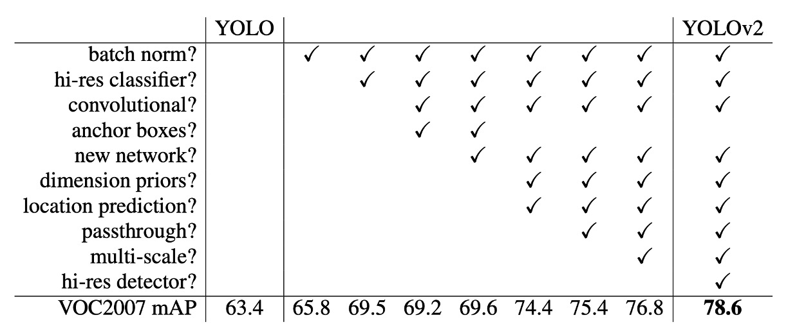

# [16.12] YOLO-V2

## 大量カテゴリの拡張

[**YOLO9000: Better, Faster, Stronger**](https://arxiv.org/abs/1612.08242)

---

## 問題の定義

YOLO v1 を振り返ると、著者は最後の分析章で、YOLO v1 には大量の位置合わせ誤差と低いリコール率の問題があることを指摘しています。

この問題を解決するために、アンカーボックスの概念を導入することが必要だと思われます。

また、最近ではより良いトレーニング方法がいくつか提案されており、著者はこれらの方法も考慮に入れています。

## 解決策

### アンカーボックスの選択

最初にアンカーボックスの選択についてです。以前の方法では、1:1、1:2、2:1 などの固定比率のアンカーボックスを使用していましたが、著者は、特定のデータセットに使用するのであれば、データセット上で最適なアンカーボックスを直接見つけるべきだと考えました。

この方法では、すべてのトレーニングデータの幅と高さの比率を計算し、K-means クラスタリングを使用して最適なアンカーボックスを見つけました。

上の図のように、著者は COCO と VOC のデータセットで N 個のアンカーボックスを見つけ、実験を通じて 5 つのアンカーボックスを使用することで最適なバランスが得られることを発見しました。

### 予測ボックスの設計

Faster R-CNN の論文では、RPN を使用して領域提案を行い、モデルは最終的にオフセットを予測し、このオフセットを使って予測ボックスを修正します。

YOLO の前のバージョンでは、7x7 のグリッドを使用し、各グリッドが 2 つのボックスを予測していましたが、これは制限のない予測空間であり、この設計は Faster R-CNN と比較してモデルにとって負担が大きくなります。そこで、著者はオフセットの概念を導入し、より多くの先行知識を使ってモデルの負担を軽減することにしました。

改良された設計は上図の通り、モデルの予測値は元の$x, y, w, h$から$t_x, t_y, t_w, t_h$に変更され、それぞれの処理方法は以下の通りです：

1. $t_x$と$t_y$はグリッド中心のオフセットを表し、予測結果はシグモイド関数を通して 0 と 1 の間に収まるようになります。これにより、予測された中心がグリッドの範囲を超えることがないようにします。上図の$c_x$と$c_y$はグリッドの左上の座標です。

2. $t_w$と$t_h$は予測ボックスの幅と高さを表し、予測結果は最初に exp 関数を通して正の数に変換され、その後アンカーボックスの幅と高さで掛け算されます。

この段階で、著者はネットワークの入力を元の 448x448 から 416x416 に変更し、グリッドサイズが 13x13 になるようにしました。これにより、グリッド中心がグリッドの交点に落ち、中心点がより正確に予測できるようになりました。この設計により、精度は少し低下しましたが、リコール率は大幅に向上し、81%から 88%に改善されました。

### マルチスケールトレーニング

予測ボックスの設計を調整しただけでなく、著者はマルチスケールトレーニングの概念も導入しました。

モデルのトレーニング過程で、著者は 10 バッチごとにランダムにスケールを選び、32 の倍数で抽出します。例えば、320x320、352x352、384x384 などが使われ、最小のスケールは 320x320、最大のスケールは 608x608 です。

この方法により、モデルは異なるスケールでも優れたパフォーマンスを発揮し、モデルの汎化能力が向上しました。

### Darknet-19

高速な推論速度を得るために、著者は他の既存のバックボーンネットワークを使用せず、自分で設計したネットワーク、Darknet-19 を使用しました。モデルのアーキテクチャは上表の通りです。

VGG に似たこのネットワークは、3x3 の畳み込みカーネルを使用し、各プーリング層の後にチャネル数を倍増させ、バッチ正規化を使用し、最後に全結合層を追加しました。このモデルは ImageNet で訓練され、top1 精度は 76.5%、top5 精度は 93.3%に達しました。トレーニング過程では、標準的な画像拡張技術（ランダムフリッピング、ランダムクロッピングなど）を使用しました。

その後、このモデルはターゲット検出タスクに転送され、元の分類ヘッドを検出ヘッドに変更して微調整を行い、最終的にモデルが完成しました。

### 分類ヘッドの設計

物体検出のカテゴリ数を拡張するために、著者は WordTree の概念を導入しました。

著者は分類と検出データセットを共同で訓練することにより、物体検出と分類の能力を向上させました。この方法は、検出ラベル付きの画像を使用して特定の情報（例えば、境界ボックスの座標や物体の存在）を学習し、カテゴリラベルだけの画像を使用して検出可能な物体カテゴリを拡張します。

この方法が直面する課題の一つは、検出データセットは通常一般的なラベル（例えば「犬」や「船」）しか持たず、分類データセットはより詳細なラベル（例えば、さまざまな犬種）を持つため、両方のデータセットのラベルをどのように統合するかです。従来の分類方法では、softmax 層を使用して全ての可能なカテゴリの最終確率分布を計算し、カテゴリ間が互いに排他的であると仮定しますが、この方法はデータセットを統合する際に問題を引き起こします。そこで、著者は WordNet を使用して WordTree という階層構造を作成し、この問題を解決しました。

WordTree モデルは、WordNet の階層構造を利用して概念を階層的に整理し、より詳細な分類が可能になります。このモデルは各ノードで条件付き確率を予測し、乗算を通じて特定のノードの絶対確率を計算します。例えば、ノーフォーク・テリアが画像に含まれているかを確認するには、根ノードからそのノードまでの経路に沿って、各ノードの条件付き確率を掛け算すればよいのです。

著者はこの階層構造を分類および検出タスクに適用し、YOLO9000 というモデルを訓練しました。このモデルは、COCO 検出データセットと ImageNet 分類データセットを共同訓練し、9000 以上の物体カテゴリをリアルタイムで検出しながら高い精度を維持することができます。実験結果によると、YOLO9000 は ImageNet 検出タスクにおいて、未見のカテゴリに対しても良好な性能を発揮しました。

## 討論

### PASCAL VOC での実験

上表の通り、著者は PASCAL VOC 2007 で実験を行い、結果として YOLOv2 は速度と精度の間で良好なバランスを達成していることが示されました。

- 288×288 の解像度では、YOLOv2 は 90FPS を超える速度を達成し、mAP は Fast R-CNN とほぼ同等でした。これにより、YOLOv2 は小型の GPU、高フレームレートのビデオや複数のビデオストリームに非常に適しています。
- 416×416 の解像度では、YOLOv2 の mAP は 76.8%、速度は 67FPS であり、当時最先端の検出器の 1 つであることは疑いありません。

### V1 から V2 への進化

上表は、著者がどのように異なる設計を通じて YOLO のパフォーマンスを改善したかを示しています。

BatchNorm の追加から始めて、著者はネットワークの深さを増やし、アンカーボックスを増やし、さらに多くのトレーニングデータを使用するなど、段階的に改良を加えました。これらの改善により、YOLOv2 は速度と精度のバランスにおいてさらに優れた結果を出すことができました。

ここで注意すべき点は、アンカーボックスの導入が著者の実験で mAP を低下させることがあったため、最終的にはクラスタリングを使用して最適なアンカーボックスを見つける方法に変更した点です。

## 結論

YOLOv2 はアンカーボックス技術を導入し、小型物体の検出能力を強化しました。また、BatchNorm を使用して特定のデータセットに対する過学習を減少させ、モデルの汎化能力を高めました。同時に、モデルはエンドツーエンドのトレーニングと予測が可能であり、これによりトレーニングプロセスが簡素化され、効率が向上しました。とはいえ、このモデルにはいくつかの欠点もあり、例えば、形状が不規則な物体の位置決定においては、Faster R-CNN などの他の方法よりも精度が劣る可能性があります。

精度はやや低いものの、速度の速さがその欠点を補っており、この点だけでも YOLOv2 は当時最も人気のある物体検出モデルの 1 つとなったことは間違いありません。
