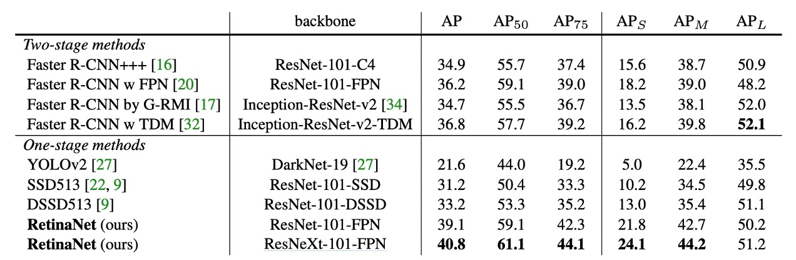
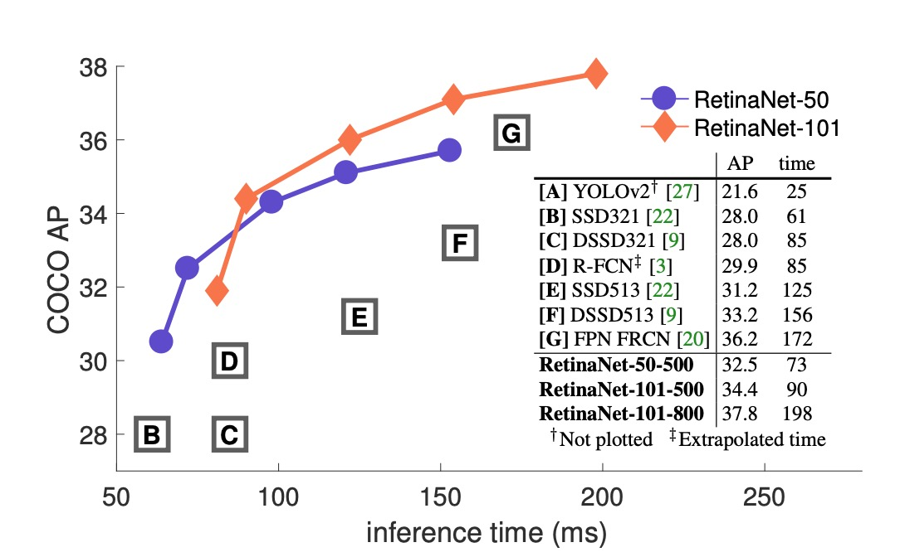
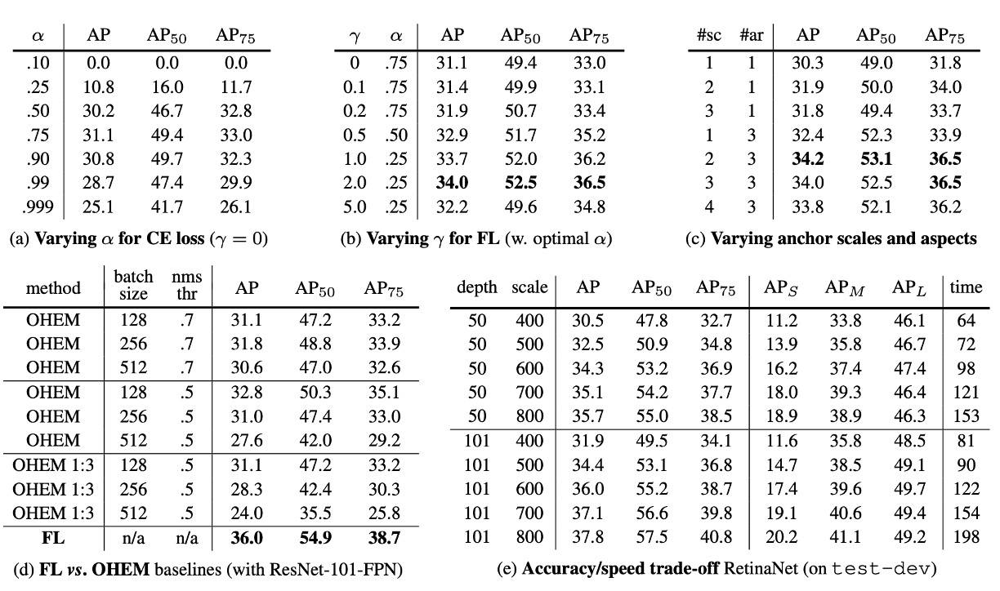

## Focal Loss が重要

[**Focal Loss for Dense Object Detection**](https://arxiv.org/abs/1708.02002)

---

それ以前、従来の R-CNN 法は物体検出の主流を占めていました。速度は遅いものの、精度は非常に高かった。その後の研究では、速度の問題に挑戦するために、SSD や YOLO などの改善策が提案されました。

しかし、これらの新しい方法は確かに推論速度は速いですが、精度が低いのです！

速さを保ちながら、精度も良くする方法はないのでしょうか？

## 問題の定義

なぜ精度が低いのか？

本論文の著者は、その根本的な原因は訓練中の**正負サンプルの不均衡**にあると考えています。

単段階の物体検出方法では、モデルは大量の検出ボックスを出力しますが、そのほとんどは背景です。これにより、正負サンプルの数に大きな差が生じ、モデルが訓練中に有効な勾配を見つけるのが難しくなります。負サンプルの分類は大抵簡単で、役に立つ学習信号を提供しません。

この問題は初めてではなく、すでに研究者によって Hard Negative Mining という方法が提案されています。これは、分類過程で正サンプルとして誤分類されやすい負サンプル（分類が難しい負サンプル）を特に選んで訓練する方法です。これらのサンプルは「ハード負サンプル」と呼ばれます。

しかし、著者はこの方法を採用していません。彼は、これらの方法は効率が低く、訓練の複雑性を増すと考えています。より良い方法は、正負サンプルのバランスを直接損失関数に組み込むことかもしれません。

そのため、彼らは新しい損失関数、**Focal Loss**を提案しました。

## 解決問題

### Focal Loss

交差熵損失（Cross Entropy Loss, CE Loss）は、二項分類問題でよく使用される損失関数です。

その定義は次の通りです：

$$
CE(p, y) =
\begin{cases}
- \log(p) & \text{もし } y = 1 \\
- \log(1 - p) & \text{それ以外の場合}
\end{cases}
$$

ここで、$y \in \{ \pm 1\}$ は真のクラスラベルを示し、$p \in [0, 1]$ はモデルが $y = 1$ であると予測した確率です。

表現を簡単にするために、$p_t$ を次のように定義します：

$$
p_t =
\begin{cases}
p & \text{もし } y = 1 \\
1 - p & \text{それ以外の場合}
\end{cases}
$$

これにより、交差熵損失は次のように再表現できます：

$$
CE(p, y) = CE(p_t) = - \log(p_t)
$$

交差熵損失の顕著な特徴は、分類が簡単なサンプル（$p_t \approx 0.5$）でも無視できない損失値が発生することです。これにより、多くの簡単に分類できるサンプルを処理する際、小さな損失が蓄積し、稀なクラスサンプルの重要性が隠れてしまう可能性があります。

クラス不均衡の問題を解決するために、一般的な方法としては、重み係数 $\alpha \in [0, 1]$ を導入し、クラス $1$ とクラス $-1$ にそれぞれ $\alpha$ と $1 - \alpha$ の重みを与える方法があります。実際には、$\alpha$ はクラスの逆頻度に基づいて設定するか、交差検証で調整します。$p_t$ の定義に似て、$\alpha_t$ を定義し、$\alpha$ バランス交差熵損失を次のように表すことができます：

$$
CE(p_t) = - \alpha_t \log(p_t)
$$

この損失関数は交差熵損失の単純な拡張であり、著者はこれを Focal Loss の実装ベースとして使用しています。

---

$\alpha$ が正負サンプルの重要性をバランスさせることができるものの、簡単なサンプルと難しいサンプルを区別することはできません。

そこで著者は、損失関数を再構築して、簡単に分類できるサンプルの「重みを下げる」ことで、難しい負のサンプルに集中して訓練できるようにする方法を提案しました。

具体的には、交差熵損失にモジュレーション因子 $(1 - p_t)^\gamma$ を追加します。ここで、$\gamma \geq 0$ は調整可能なパラメータです。

そのため、著者は Focal Loss を次のように定義しました：

$$
FL(p_t) = - (1 - p_t)^\gamma \log(p_t)
$$

サンプルが誤分類され、$p_t$ が小さいとき、モジュレーション因子は 1 に近く、損失はほとんど影響を受けません。

一方、$p_t \to 1$ の場合、モジュレーション因子は 0 に近づき、分類が正しいサンプルの損失が減少します。

:::tip
スコアが高いほどモデルの自信が高いことを示しており、そのサンプルはモデルにとって簡単に分類できることを意味します。
:::

パラメータ $\gamma$ は、簡単なサンプルの重みを下げる速度を調整します。$\gamma = 0$ の場合、Focal Loss は交差熵損失と等価です。$\gamma$ が大きくなると、モジュレーション因子の効果が強くなります（実験では、$\gamma = 2$ が最適であることが分かりました）。

実際には、著者は $\alpha$ バランスの Focal Loss の変種を使用しています：

$$
FL(p_t) = - \alpha_t (1 - p_t)^\gamma \log(p_t)
$$

著者はこの形式を実験に使用していますが、非 $\alpha$ バランスの形式よりも若干精度が向上するためです。

分類スコア $p_t$ と対応する損失の関係は、次の図で直感的に理解できます：

図中で、$\gamma = 0$ は通常の交差熵損失を示し、$\gamma = 2$ は著者の実験での最適値です。分類スコア $p_t$ が 0.6 から 1.0 の範囲に対応する簡単なサンプルは、Focal Loss によって損失値が効果的に低減されます。

### モデルアーキテクチャ

Focal Loss の効果がモデルの複雑さに隠れないように、著者は非常にシンプルなモデルアーキテクチャを設計しました。このアーキテクチャは **RetinaNet** と呼ばれます。

RetinaNet は単段階の物体検出モデルで、その主な設計は次の通りです：

- シンプルなバックボーン（例えば ResNet50）を使用。
- シンプルなネック（例えば Feature Pyramid Network, FPN）を使用。
- 後半の 3 層で多尺度の特徴マップを取得し、9 組のアンカーを使用して特徴マップを検出ボックスに変換。

  - アンカーのアスペクト比は 1:2、1:1、2:1 です。各レベルで、著者は元々の 3 つのアスペクト比アンカーに加えて、異なるサイズの 3 つのアンカーを追加しました。これらのサイズは、それぞれ元のアスペクト比アンカーの$2^{0}$、$2^{1/3}$、$2^{2/3}$倍です。これらのサイズを 2 つずつ組み合わせることで、9 つの異なるアンカー比が得られます。

    - **1:2 アスペクト比：**

      - 1:2 $\times 1 = 1:2$
      - 1:2 $\times 1.26 = 1.26:2.52$
      - 1:2 $\times 1.59 = 1.59:3.18$

    - **1:1 アスペクト比：**

      - 1:1 $\times 1 = 1:1$
      - 1:1 $\times 1.26 = 1.26:1.26$
      - 1:1 $\times 1.59 = 1.59:1.59$

    - **2:1 アスペクト比：**

      - 2:1 $\times 1 = 2:1$
      - 2:1 $\times 1.26 = 2.52:1.26$
      - 2:1 $\times 1.59 = 3.18:1.59$

  - 各アンカーには長さ$K$の分類ベクトルと長さ 4 の検出ボックス座標ベクトルが割り当てられます。
  - RPN の分類ルールを使用しますが、正サンプルの閾値は$0.5$以上、負サンプルの閾値は$0.4$以下に調整されます。
  - 各アンカーには 1 つの予測ボックスのみが与えられます。

- 物体検出は 2 つのサブネットワークに分かれ、1 つはクラス予測、もう 1 つは検出ボックス予測を担当し、どちらも全畳み込みネットワーク（FCN）で構成されています。

### 訓練パラメータ設定

1. 推論段階では、RetinaNet は大量の検出ボックスを生成し、これらのボックスは分類ネットワークによって分類され、スコアが最も高い 1000 個の検出ボックスが選ばれます。その後、非極大抑制（NMS）が閾値 0.5 で行われ、最終的な検出結果として出力されます。
2. 著者は、Focal Loss の$\gamma = 2$が最適な効果を発揮すると発見しました。また、$\alpha$の設定はクラスの逆頻度に基づいて行われ、$\gamma$と連動します。この設定では、$\alpha = 0.25$が最適な効果を示しました。
3. RetinaNet は、ResNet-50-FPN、ResNet-101-FPN、ResNeXt-101-FPN などをバックボーンネットワークとして使用しています。
4. RetinaNet は、SGD を最適化アルゴリズムとして使用し、学習率は 0.01 に設定され、60k と 80k のイテレーションでそれぞれ元の 1/10 に減少します。モーメンタムは 0.9、重み減衰は 0.0001 です。
5. 分類タスクでは Focal Loss を使用し、回帰タスクでは Smooth L1 Loss を使用します。トレーニング中、これら 2 つの損失は合算して計算されます。

## 討論

### COCO データセットでの実験結果

RetinaNet は、最近の二段階検出手法と比較して、最も優れた Faster R-CNN モデル（Inception-ResNet-v2-TDM を基にしたもの）を 2.3 ポイント差で超えました。

ResNeXt-32x8d-101-FPN を RetinaNet のバックボーンとして使用すると、結果がさらに 1.7AP 向上し、COCO データセットでの AP は 40 を超えました。

現在の一段階検出方法と比較して、RetinaNet は最も近い競合である DSSD に対して 5.9 ポイント AP の差（39.1 対 33.2）を達成し、さらに速度も速いことが示されました。以下の図にその差が示されています：

### 消融実験

著者は RetinaNet のいくつかの重要な要素について消融実験を行い、結果は次のようになりました：

1. **Balanced Cross Entropy**

   上表（a）では、著者の最初の改善試みとして、前の論文で述べた$\alpha$バランス交差熵損失を使用しています。表には異なる$\alpha$値に対する結果が示されており、$\alpha = 0.75$を設定することで 0.9AP ポイントの改善が見られました。

2. **Focal Loss**

   上表（b）では Focal Loss の結果が示されています。Focal Loss は新たに超パラメータ$\gamma$を導入し、モジュレーション項の強さを制御します。$\gamma = 0$のとき、損失は交差熵損失に等しくなります。$\gamma$が増加することで、損失の形状が変化し、低損失の「簡単な」サンプルがさらに重み付けされます。$\gamma$の増加に伴い、Focal Loss は交差熵損失に対して大きな改善を示します。$\gamma = 2$のとき、Focal Loss は$\alpha$バランス交差熵損失に比べて 2.9AP ポイント向上しました。

   公平な比較のため、著者は各$\gamma$に最適な$\alpha$を見つけました。図表からは、$\gamma$が増加するにつれて、選ばれる$\alpha$値が低くなることが分かります（これは簡単な負サンプルが重み付けされ、正サンプルへの強調が減少するためです）。

3. **高密度な二段階システムは必須ではない**

   上表（c）では、著者が ResNet-50 を使用し、FPN で各空間位置と金字塔レベルで使用されるスケールとアスペクト比アンカーボックスの数をスキャンした結果が示されています。各位置に 1 つの正方形アンカーから 12 個のアンカー（$2^{k/4}$スケール、$k \leq 3$）と 3 つのアスペクト比（0.5, 1, 2）を使用する場合を考慮しました。

   1 つの正方形アンカーのみを使用した場合でも、予想外の良い AP（30.3）が得られました。各位置で 3 つのスケールと 3 つのアスペクト比を使用した場合、AP は 4 ポイント近く向上し（34.0 に達しました）。

   他のすべての実験では、この設定が使用されています。

   最後に著者は、アンカーボックスの数が 6〜9 個を超えると、さらなる改善が見られないことを確認しました。したがって、二段階システムは画像内の任意のボックスを分類できますが、密度が飽和したパフォーマンスにおいては、高密度の二段階システムはメリットをもたらさない可能性があります。

4. **オンライン困難サンプル挖掘（OHEM）**

   上表（d）では、過去の文献で高損失サンプルを含む小さなバッチを構築して二段階検出器のトレーニングを改善する方法が提案されています。OHEM では、各サンプルがその損失でスコア付けされ、非極大抑制（NMS）が適用され、高損失サンプルで小さなバッチを構築します。NMS の閾値とバッチサイズは調整可能なパラメータです。Focal Loss と似て、OHEM は誤分類されたサンプルを強調しますが、FL とは異なり、OHEM は簡単なサンプルを完全に無視します。

   実験での OHEM の最適設定（1:3 比率なし、バッチサイズ 128、NMS は 0.5）では、32.8AP に達し、3.2AP の差が生じ、FL が OHEM よりも効果的であることが示されました。著者は他のパラメータ設定や OHEM の変種も試みましたが、より良い結果は得られませんでした。

   :::tip
   早期の実験で、著者は$p_t$に対してヒンジ損失を使用することも試みました。これにより、$p_t$が特定の値を超えると損失がゼロになります。

   しかし、この結果は不安定で、意味のある結果を得ることはできませんでした。
   :::

5. **より大きなバックボーン**

   上表（e）では、より大きなバックボーンネットワークがより高い精度をもたらす一方で、推論速度が遅くなることが示されています。同様に、入力画像のスケール（短辺で定義される）も同様の影響を与えます。表にはこれらの 2 つの要素の影響が示されています。より高速な推論速度を目指す場合、ネットワークアーキテクチャをさらに最適化する必要があり、これは本文の範囲を超えており、著者は今後の研究に委ねています。

## 結論

RetinaNet は Focal Loss を導入することにより、クラス不均衡の問題を効果的に解決し、モデルが難しい負サンプルに集中して学習できるようになり、検出精度を大幅に向上させました。実験結果は、RetinaNet が COCO データセットで多くの既存の一段階および二段階検出方法を超え、その実際の応用における可能性を示しています。

後続の研究では、YOLO-v3 の著者も Focus Loss を YOLO シリーズに取り入れましたが、RetinaNet ほど顕著な改善は得られませんでした。これにより、Focal Loss の効果は正負サンプルの不均衡の影響に加え、モデルアーキテクチャにも依存する可能性があることが示唆されます。

物体検出の研究にはまだ多くの課題があり、今後の研究に期待が寄せられます。
