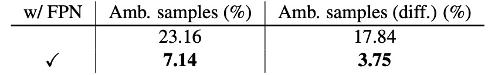

## アンカーレスの世界

[**FCOS: Fully Convolutional One-Stage Object Detection**](https://arxiv.org/abs/1904.01355)

---

この論文は 7,000 件以上の引用があります。

古典的な論文として、必ず読んでおきたい一篇です。

## 問題の定義

物体検出の主流手法は、長年にわたり **anchor-based** が支配してきました。

Faster R-CNN、SSD、YOLOv2/v3 など、どれもアンカーの設計を中心としています。まず多数の候補ボックス（アンカー）を敷き詰め、それが正例か負例かを判定するのです。

この設計は実用的ですが、多くの課題も抱えています。

1. **ハイパーパラメータが多い**：アンカーのサイズ・比率・数、さらに IoU の閾値など、すべて手動で調整が必要です。ちょっと変えるだけで mAP が 4%以上変動することも。
2. **汎用性の低さ**：アンカーの形状は固定されているため、スケールの異なる物体や特殊な形状の物体には弱く、タスクを変えるたびに設計を見直す必要があります。
3. **正例・負例の不均衡**：リコールを確保するため、画像全体に何千・何万ものアンカーを設置しなければならず、大多数が負例となり、訓練が極めて不均衡になります。
4. **計算の複雑さ**：IoU 計算やマッチングルールなど、アンカーが余計な計算コストと複雑さをもたらします。

anchor-free も新しい概念ではありませんが、それぞれの手法には顕著な欠点があります。

例えば、YOLOv1 は物体中心から直接バウンディングボックスを予測しようとしましたが、中心点だけに依存するためリコールが低くなりがちです。CornetNet は角点を使って物体を組み立てますが、後処理が複雑です。DenseBox はピクセル単位で回帰しますが、ボックスの重なりをうまく扱えず、主に文字や顔検出などの特殊分野でしか使われていません。

他にも多くの例があり、枚挙にいとまがありません。

anchor-free の構造は全体的に anchor-based に劣っており、物体検出の分野ではほとんど居場所がありませんでした。

**本当に物体検出は anchor なしでは成り立たないのか？**

本論文の著者は、この膠着状態を打破しようとしました。意味的セグメンテーションのように、すべてのピクセルが予測に参加し、アンカーも複雑なマッチングも必要としない、そんなモデルを目指しました。

つまり、物体検出を **全畳み込み per-pixel 予測** のシンプルなパラダイムに戻したいのです。

## 問題の解決

FCOS のコアとなるアイデアは、物体検出を **per-pixel prediction** に完全に書き換えることです。大量のアンカーを敷いて「候補」として真のバウンディングボックスと照合するのではなく、FCOS は各ピクセル自体を訓練サンプルと見なします。

backbone の第 $i$ 層で特徴マップ $F_i \in \mathbb{R}^{H \times W \times C}$ を得たとし、stride を $s$ とします。

入力画像の ground-truth バウンディングボックスは

$$
B_i = (x^{(i)}_0, y^{(i)}_0, x^{(i)}_1, y^{(i)}_1, c^{(i)}) \in \mathbb{R}^4 \times \{1,2,\dots,C\},
$$

ここで $(x^{(i)}_0, y^{(i)}_0)$ と $(x^{(i)}_1, y^{(i)}_1)$ は左上・右下の座標、$c^{(i)}$ はクラスラベルです。

特徴マップ上の位置 $(x,y)$ を入力画像の座標に写像すると：

$$
(\lfloor \tfrac{s}{2} \rfloor + xs, \; \lfloor \tfrac{s}{2} \rfloor + ys).
$$

この位置がどれかの真のボックス $B_i$ に含まれていれば、それを正例とし、そのクラスラベル $c^* = c^{(i)}$ を与えます。含まれていなければ背景 $c^*=0$ です。

分類以外にも、各位置ごとに 4 次元のベクトルを回帰する必要があります：

$$
t^* = (l^*, t^*, r^*, b^*),
$$

これは各方向（左・上・右・下）への距離を表します。下図のように：

<figure style={{ "width": "70%"}}>

</figure>

$$
l^* = x - x^{(i)}_0, \quad
t^* = y - y^{(i)}_0, \quad
r^* = x^{(i)}_1 - x, \quad
b^* = y^{(i)}_1 - y
$$

もし複数のボックスにまたがる場合は、面積が最小のものを回帰ターゲットとし、重なりによる曖昧さを軽減します。

こうして、**各ピクセルが「ここは何か」「ボックスはどこか」を直接出力できる** ようになり、アンカーは不要となります。

ネットワークの出力設計では、最終層で分類分岐 $p \in \mathbb{R}^C$ と回帰分岐 $t = (l,t,r,b)$ を同時に出力します。

回帰値は正の値でなければならないため、出力側で $\exp(x)$ を使い、任意の実数を $(0,\infty)$ に写像しています。

この設計は構造をシンプルにするだけでなく、出力変数の数を anchor-based 検出器の 9 分の 1 に減らしています。

全体の loss は次のように定義されます：

$$
L(\{p_{x,y}\}, \{t_{x,y}\}) =
\frac{1}{N_{\text{pos}}} \sum_{x,y} L_{\text{cls}}(p_{x,y}, c^*_{x,y}) \; + \;
\frac{\lambda}{N_{\text{pos}}} \sum_{x,y} \mathbf{1}_{\{c^*_{x,y}>0\}} \, L_{\text{reg}}(t_{x,y}, t^*_{x,y})
$$

ここで $L_{\text{cls}}$ は **Focal Loss** で正負例のバランスをとり、$L_{\text{reg}}$ は **IoU loss**、$N_{\text{pos}}$ は正例の数、$\lambda=1$ です。

推論時は、各位置 $(x,y)$ に対して分類スコア $p_{x,y}$ と回帰結果 $t_{x,y}$ を得て、$p_{x,y} > 0.05$ なら候補ボックスとみなし、逆変換で実際の座標に戻します。

ここまでで、FCOS の中核思想、すなわちアンカーを排除し、各ピクセルが直接予測を担当するという発想が理解できたと思います。

しかし、この設計には直ちに二つの課題が浮上します：

1. 特徴マップの stride が大きいと小物体が無視されやすく、リコールが下がる。
2. ボックスが重なると曖昧さが生じ、どのボックスを回帰すべきか判断が難しい。

著者の解決策は **FPN の多段階予測** です。下図のようになります：

<figure style={{ "width": "90%"}}>

</figure>

著者は ${P3, P4, P5, P6, P7}$ の 5 つの段階を利用し、stride はそれぞれ 8、16、32、64、128 です。

物体のサイズに応じて異なるレベルに割り当て、各層ごとに最大回帰範囲（例：$P3$は $\leq64$、$P4$は $[64,128]$ の物体）を設定することで、重なりによる曖昧さを大幅に減らしています。

それでも最後に残る課題は、中心から遠いピクセルは低品質なボックスを生みやすいことです。

そこで著者は軽量な **center-ness 分岐** を導入し、各位置の中心からの偏り度合いを測ります。

位置 $(x,y)$ のターゲット定義は次の通り：

$$
\text{centerness}^* = \sqrt{\frac{\min(l^*, r^*)}{\max(l^*, r^*)} \times \frac{\min(t^*, b^*)}{\max(t^*, b^*)}}
$$

この値は $[0,1]$ の間で、物体中心に近いほど 1 に近くなります。

訓練時は BCE loss を使い、推論時には分類スコアと乗算して低品質なボックスを抑制し、NMS 前に大量の「端の予測」を除外します。

最終的に、FCOS はシンプルな per-pixel 設計に FPN の多段階分配と center-ness による品質制御を組み合わせることで、完全にアンカーを排除しつつ、主流の anchor-based 手法と肩を並べる、あるいはそれを超える性能を発揮しています。

## 議論

著者は **MS COCO** ベンチマークで FCOS を検証し、一般的な手法に従い、訓練に **trainval35k（115K）** を用い、検証に **minival（5K）** でアブレーションを行い、主要な結果を **test-dev（20K）** に提出しています。

特に記載がない限り、Backbone には **ResNet-50** を使用し、オプティマイザとハイパーパラメータは **RetinaNet** の設定（SGD、90K イテレーション、バッチサイズ 16、初期学習率 0.01、60K と 80K イテレーションで 10 倍減衰、weight decay 0.0001、momentum 0.9、入力画像の短辺 800・長辺最大 1333）を踏襲しています。

推論も同様に RetinaNet の後処理とハイパーパラメータを継承し、候補位置の閾値は $p_{x,y}>0.05$ です。FCOS 用に特化したチューニングを行えば、さらに性能向上が可能です。

詳細な分析に入る前に、**Best Possible Recall（BPR）** の厳密な定義を示しておきます。

$$
\text{BPR} \;=\; \frac{\#\{\text{訓練中に少なくとも1つのサンプルに割り当てられたGTボックス}\}}{\#\{\text{すべてのGTボックス}\}} .
$$

### 多段階 FPN とリコール上限

<figure style={{ "width": "70%"}}>

</figure>

まず、著者は FCN 型検出器は stride が大きくリコール不足に陥りやすい点を考慮し、単一層 **P4（stride 16）** で検証しました。この層だけでも FCOS は **BPR = 95.55%** に達し、公式 Detectron 版 **RetinaNet**（低品質マッチ IoU≥0.4）の **90.92%** を大きく上回っています。

次に、**FPN（P3–P7）** を導入すると、FCOS の BPR は **98.40%** にまで向上し、各種低品質マッチを積み重ねてリコールを高める anchor-based の上限に迫ります。

実際の検出器の COCO における最終リコールは 90%を大きく下回るため、この 1%未満の BPR 差はボトルネックにはなりません。事実、FCOS の主要結果でも **AR** は競合モデルを上回っています。

### 重なりによる曖昧なサンプル

<figure style={{ "width": "70%"}}>

</figure>

複数の GT ボックスが空間的に重なった場合、per-pixel 割当ては「同じ位置がどのボックスを回帰すべきか」という曖昧さが生じます。

**P4** のみの場合、minival 上で曖昧サンプルは全正例の **23.16%** を占めます。**FPN** を導入すると、異なるサイズの物体が異なる層に割り当てられるため、曖昧さは **7.14%** に大幅減少します。同クラスの重なり（分類には影響しない）を除外すれば、クラスをまたぐ曖昧率は **17.84%** から **3.75%** に下がります。

推論時、実際に「曖昧位置」から生じる検出ボックスは **2.3%**、クラスをまたぐ場合に限れば **1.5%** まで減ります。

したがって、**多段階割当て＋最小面積ルール** により、曖昧さが最終性能に与える影響は無視できるレベルです。

### Center-ness の必要性と効果

<figure style={{ "width": "70%"}}>

</figure>

FPN を持ってしても、物体中心から離れたピクセルは低品質なボックスを出力しやすい傾向があります。

そこで FCOS は分類ブランチの隣に、単層の **center-ness** ブランチを加え、位置が中心からどれだけ離れているかを正規化して予測します。

$$
\text{centerness}^* \;=\; \sqrt{\frac{\min(l^*,r^*)}{\max(l^*,r^*)}\cdot\frac{\min(t^*,b^*)}{\max(t^*,b^*)}}
$$

訓練では **BCE** で監督し、推論時には $\text{score}=\text{cls}\times\text{centerness}$ で端部予測を抑制、NMS 前に多くの低品質候補を排除します。

アブレーション実験では、**AP が 33.5% から 37.1% に大幅向上** しました。回帰結果から算出した center-ness だけで独立ブランチを持たない場合、この改善は得られず、独立ブランチが必要であることが分かります。

### Anchor-based との公平な比較

<figure style={{ "width": "90%"}}>

</figure>

実装差異を排除するため、FCOS の設定を **RetinaNet** とほぼ同一に調整（**GroupNorm** を削除して勾配クリッピングで安定化、**C5** から **P6/P7** を生成）。

それでも FCOS は **36.3% vs 35.9% AP** で RetinaNet を上回っています。この比較では学習率や NMS 閾値などのハイパーパラメータも RetinaNet をそのまま使用し（anchor-free 用に特化していない）、構造と割当て戦略のシンプルさが主因であることが示されました。著者は、FCOS 専用のチューニングを行えばさらなる向上も期待できると述べています。

### 当時の SOTA との比較

<figure style={{ "width": "90%"}}>

</figure>

実験結果より、**ResNet-101-FPN** では FCOS は RetinaNet より **+2.4 AP**、**ResNeXt-101-64×4d-FPN** を Backbone にすれば **AP 43.2%** と、同じ anchor-free の **CornerNet** を大きく上回ります（CornerNet は角点ペアと埋め込みの学習が必要で、システムも複雑）。

さらに上表の **ほぼゼロコスト** な改良を加えれば、単一モデル・単一スケールテストでも **AP 44.7%** に達します。これは **初めて** anchor-free が明確に anchor-based を超えた事例です。

## 結論

FCOS は物体検出を **per-pixel** の素朴なパラダイムに引き戻しました。proposals も anchors も不要で、各位置が「何か」と「どこか」を同時に学習し、**FPN** の多段階分配でサイズ・重なりの曖昧さを解決、最後にほぼゼロコストの **center-ness** で品質を校正します。

FCOS のインパクトは大きく 3 点あります。

1 つ目は、**タスクアライメントとサンプル割当て** の考え方が大きく発展したこと。ATSS の統計的割当て、PAA／OTA／SimOTA の動的・グローバル最適化、TOOD の分類と回帰の一貫性など、すべてが「ピクセル（位置）＝サンプル」という思想の流れにあります。

2 つ目は、**品質認識型の分類ヘッド** が多様化したこと。center-ness は「IoU／品質認識型分類」（QFL/Varifocal など）に吸収され、回帰も純粋な連続値から**分布型回帰**（DFL など）へ進化。本質的には、滑らかな方法で品質を分類スコアに注入するアプローチです。

3 つ目は、**Transformer 系列**（DETR、Deformable-DETR、DINO、RT-DETR など）が集合マッチングにより検出フローを刷新し、NMS と anchors を排除して新たな主流を作ったことです。ただし、**リアルタイムやエッジデバイス** では、FCOS のような軽量な畳み込みヘッド設計はいまだ堅実なベースラインであり、近年の anchor-free YOLO（v8/10/11 など）のタスクアライメントや品質モデリングにも影響を与えました。

要するに、FCOS の貢献は単なる「アンカーの排除」にとどまりません。検出問題を「各位置が独立して判断し、適切な割当てと正しいスコアリングで良いボックスが自然に浮かび上がる」よう再定義したことにあります。

この後、アンカー設計は退場し、より明快な問題定義と普遍的な設計言語が残されました。
