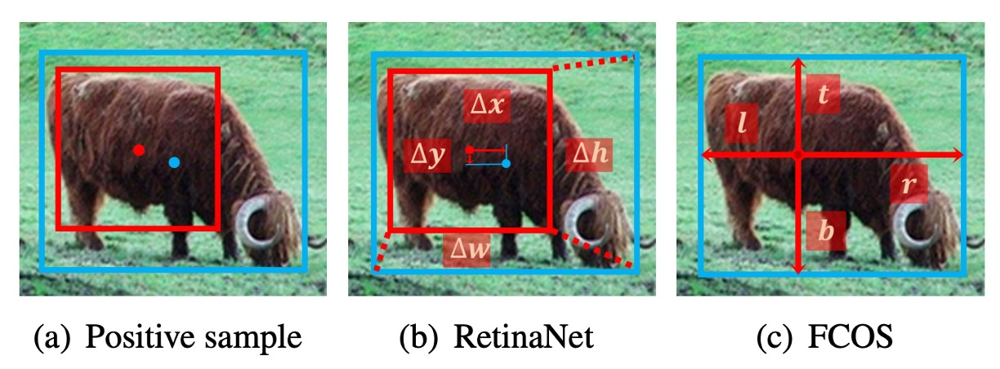

## アンカーの死

[**Bridging the Gap Between Anchor-based and Anchor-free Detection via Adaptive Training Sample Selection**](https://arxiv.org/abs/1912.02424)

---

ここ数年、物体検出の発展は大きく 2 つの流派に分かれてきました：**Anchor-based** と **Anchor-free** です。

**Anchor-based 手法**

- **2 段階検出器**（Faster R-CNN など）は、**RPN で領域提案＋ R-CNN で精密化**という流れで、複数回の回帰を経て、長らく精度面でリードしてきました。
- **1 段階検出器**（SSD、RetinaNet など）は、複数の特徴マップ上にアンカーを敷き詰め、直接分類・回帰を行い、高効率を実現しながらも 2 段階法に徐々に迫る性能を示しています。

**Anchor-free 手法**

- **Keypoint-based**：検出問題をキーポイントの位置推定に変換する方式で、たとえば CornerNet は「左上＋右下」点でボックスを決め、ExtremeNet は 4 つの極値点と中心点を探します。
- **Center-based**：物体の中心や領域を正例とし、そこからボーダーまで回帰する方法で、YOLO、FCOS、FoveaBox などがこのタイプです。

## 問題の定義

この 2 大流派は一見対立しているように見えますが、実はどちらも本質的には同じ問いに答えています：

> **どの位置を「正例」とし、どの位置を「負例」とすべきか？**

**RetinaNet (anchor-based)** と **FCOS (anchor-free, center-based)** を例に取ると、主な違いは 3 点です：

1. **サンプリング単位**：RetinaNet は各位置に複数のアンカー、FCOS は各位置に 1 点のみ。
2. **サンプル定義**：RetinaNet は IoU 閾値で正負を区別、FCOS は空間・スケール規則で区別。
3. **回帰の起点**：RetinaNet はアンカーボックスから開始、FCOS は単一ポイントから外へ推定。

しかし、著者は厳密な実験を通じて以下のことを発見しました：

> **本当に性能差を決定しているのは、「box か point か」ではなく、「正負サンプルの定義方法」だ。**

もし両手法が同じサンプル選択戦略を使えば、最終結果には明確な差は出ません。つまり anchor-based と anchor-free の隔たりは構造の違いではなく、**サンプル割り当て戦略こそが鍵**なのです！

こうして、物体検出のステージ中央に残されたのは、いくつかの問いだけになりました：

- なぜ依然として手動で設定する IoU 閾値や手作り規則で正負を分けなければならないのか？
- 各ターゲットごとの統計的特徴に基づき、モデル自身が選択できないのか？

……その時、あなたは思わず尋ねます。「アンカーはどうなったの？」

ああ、もう死にました。

歴史の証人として、アンカーは博物館に飾っておきましょう。

## 問題解決

著者は 2 つの代表的な手法、**RetinaNet**（anchor-based）と**FCOS**（anchor-free, center-based）を選び、比較を行いました。一見すると両者の構造には多くの違いがありますが、公平に比較するためには「不要なバイアス要素」を一つずつ排除する必要があります。

### 不公平な要素の排除

本質的な違いにフォーカスするため、著者は RetinaNet で各位置に**1 つだけの正方形 anchor**（RetinaNet #A=1）を設置し、その形式を FCOS に極力近づけました。

それでもなお、COCO 上でのパフォーマンスには明確な差がありました：RetinaNet (#A=1) は**32.5% AP**、FCOS は**37.1% AP**でした。

このとき著者は、FCOS がいくつかの「汎用的な改良」を導入していることに気づきました：

- GroupNorm による正規化
- GIoU loss
- centerness branch
- 回帰ターゲットへの stride normalization
- 各 FPN 層ごとに学習可能なスカラー追加

これらのテクニックは anchor-free 特有ではなく、RetinaNet にもそのまま適用可能です。

<figure style={{ "width": "60%"}}>

</figure>

これらの改良を加えると、RetinaNet (#A=1) のパフォーマンスは**37.0% AP**に上昇し、FCOS の**37.8% AP**にほぼ追いつきました。

このアライメント工程は、**見た目上の構造差（anchor box vs. point）は本質ではない**ことを示しています。

### 本当の違いに迫る

すべての「外部要因」を排除したあと、残る違いは 2 つだけです：

1. **サンプル定義**（classification）
2. **回帰起点**（regression）

まずは**サンプル定義**から見てみましょう。

<figure style={{ "width": "90%"}}>

<figurecaption>青いマスが正例、灰色が負例の領域を示す。</figurecaption>
</figure>

---

- RetinaNet は**IoU 閾値**によって正負サンプルを選びます：IoU > $θ_p$ の anchors を正例、IoU < $θ_n$ の anchors を負例、中間領域は無視。
- FCOS は**空間＋スケール条件**を採用：ボックス内の点を候補とし、各層の scale range でフィルタ、最終的な正例を決める。

実験結果：

- RetinaNet (#A=1)が FCOS の「空間＋スケール」ルールを使うと AP は**37.0%→37.8%**に上昇。
- 逆に FCOS が IoU 閾値を使うと AP は**37.8%→36.9%**に低下。

これは、**正負サンプル定義こそが anchor-based と anchor-free の本質的違い**であることを示しています。

---

次は**回帰起点**についてです。

<figure style={{ "width": "90%"}}>

</figure>

- RetinaNet：anchor box からオフセットを予測
- FCOS：1 点から 4 方向の距離を予測

しかし、両者が同じサンプル割り当て戦略を用いれば、この違いは全く重要ではありません。

- RetinaNet (#A=1)と FCOS は同条件下でパフォーマンスにほとんど差がありません。

著者の結論：

- **回帰起点（box か point か）は本質ではなく、本当に効くのは正負サンプル定義である。**

### Adaptive Training Sample Selection

ATSS を説明する前に、いくつかの記号を定義します：

- $\mathcal{G}$：画像内の全 ground-truth (GT)ボックス集合
- $\mathcal{A}$：全 anchors 集合、$L$は FPN の層数、各層の anchors を$\mathcal{A}_i$とする
- $k$：唯一のハイパーパラメータ。各層で**GT 中心に最も近い$k$個の anchor**を候補とする
- $C_g$：ある GT $g$のために集めた候補 anchors（計$k \times L$個）
- $D_g$：候補とその GT の IoU 分布集合
- $m_g$、$v_g$：$D_g$の平均値と標準偏差
- $t_g$：ATSS が GT $g$に設定する自適応 IoU 閾値

  $$
  t_g = m_g + v_g
  $$

---

ATSS は次の新しいアイデアを提示します：

> **各 ground-truth 物体自身が正負サンプルの閾値を自動決定できるようにする。**

具体的な流れは以下の通りです：

1. **候補抽出**：各 GT $g$について各層で$k$個、中心に最も近い anchors を集め、候補集合$C_g$を作成
2. **統計量計算**：候補について IoU 分布$D_g$を算出し、$m_g$と$v_g$を計算
3. **自適応閾値設定**：$t_g = m_g + v_g$とする
4. **正例選出**：IoU ≥ $t_g$かつ中心がボックス内にある anchors を正例集合$\mathcal{P}_g$に加える。同一 anchor が複数 GT に選ばれた場合、IoU が最大の GT に割り当て
5. その他の anchors はすべて負例$\mathcal{N}$とする

---

この設計は多くのメリットをもたらします：

- **中心距離による候補抽出**：anchor-based/anchor-free 問わず、中心に近いものほど質が高い

- **$m_g+v_g$を閾値に使用**：

  - $m_g$が高い → 候補全体の質が良い → 閾値高め
  - $m_g$が低い → 候補全体の質が悪い → 閾値下げて GT の取りこぼし防止
  - $v_g$が高い → 特定層だけ適合 → 閾値上げてその層だけ残す
  - $v_g$が低い → 複数層適合 → 閾値下げて複数層を許容

- **公平性の保持**：統計的に各 GT は約$0.2 \times kL$個の正例を持つ。物体サイズやアスペクト比、位置に依存せず「大きい物体は正例が多い、小さい物体は少ない」という不公平を防ぐ

- **ほぼノンパラメトリック**：唯一の$k$は$7〜17$で安定して高性能。ATSS はほぼ「パラメータレス」な手法といえる

---

ATSS の効果を**anchor-based 検出器**で検証するため、従来のサンプル割り当てを ATSS に置き換えました。

ベースラインは**RetinaNet（#A=1）**です。

その結果、全ての評価指標が向上しました（下表参照）：

<figure style={{ "width": "70%"}}>

</figure>

著者は、この向上は各 GT が統計的特徴に基づいて適切な正例を自動選出できるためだと述べています。

ATSS は**正負サンプル定義のみを変更**し、追加の計算コストはありません。つまり「**ゼロコストで性能向上**」を実現できます。

続いて、ATSS を**anchor-free 検出器**の FCOS にも適用し、2 つのバージョンが派生しました：

1. **Lite バージョン（Center Sampling）**

   - 元の FCOS：ボックス内すべての点を候補にしやすく、低品質な正例を多く含む
   - ATSS Lite：各層で$k=9$個、中心に最も近いもののみ候補に
   - この方法は FCOS 公式実装にも組み込まれ**center sampling**と呼ばれる
   - 実験結果：AP**37.8→38.6**（上表参照）
   - 欠点：scale range パラメータが残る、完全には解消されていない

2. **Full バージョン（ATSS 完全版）**

   - FCOS の点を一時的に辺長$8S$の正方形 anchor（$S$はその層の stride）とみなし、ATSS でサンプル割り当て
   - 回帰は元の FCOS と同じく、点から 4 方向への距離回帰
   - 実験結果（上表参照）：

     | AP   | $AP_{50}$ | $AP_{75}$ | $AP_S$ | $AP_M$ | $AP_L$ |
     | ---- | --------- | --------- | ------ | ------ | ------ |
     | +1.4 | +1.7      | +1.7      | +0.6   | +1.3   | +2.7   |

結果から、**Lite と Full は空間次元の候補は同じ**でも、**スケール次元の処理が異なる**ことが分かります。Full 版は自適応閾値によるサンプル選択で全体的に Lite 版を大きく上回りました。著者は「固定された scale range に頼るより、ATSS で自動決定する方が安定的かつ包括的な性能向上をもたらす」と結論づけています。

## 議論

ATSS の最終的な効果を検証するため、著者は **MS COCO test-dev** 上で他の主流な検出器と比較実験を行いました。

実験設定は以下の通りです：

- **multi-scale training**（画像の短辺を $640 \sim 800$ の範囲でランダムにリサイズ）
- 総学習ステップを **180K** に倍増し、**120K / 160K** で学習率を下げる
- その他の設定は前述の実験と同様

### 既存手法との比較

<figure style={{ "width": "90%"}}>

</figure>

- **ResNet-101** を backbone に用いた場合、ATSS の AP は **43.6%** に達し、同一 backbone の他の検出器すべてを上回った：

  - Cascade R-CNN：42.8%
  - C-Mask R-CNN：42.0%
  - RetinaNet：39.1%
  - RefineDet：36.4%

- より大きな backbone を使うと、

  - ResNeXt-32x8d-101 → **45.1%**
  - ResNeXt-64x4d-101 → **45.6%**

- **SNIP (45.7%)** にほぼ並ぶ（僅か 0.1%差）、しかも SNIP はより複雑な multi-scale 学習・テスト戦略を採用
- **DCN（Deformable Convolutional Networks）** を導入した場合：

  - ResNet-101 → **46.3%**
  - ResNeXt-32x8d-101 → **47.7%**
  - ResNeXt-64x4d-101 → **47.7%**

単一モデル・単一スケールのテストでも **47.7% AP** に到達し、当時の全手法を凌駕。さらに multi-scale テストを加えると、最終的に **50.7% AP** を突破。

ATSS は本質的に「正負サンプル定義」を変えるだけであり、backbone に依存せず普遍的に効果を発揮し、DCN や multi-scale 戦略とも相補的です。

### Anchor 数の議論

<figure style={{ "width": "70%"}}>

</figure>

上記の実験の多くは **RetinaNet (#A=1)** をベースとしていますが、従来の RetinaNet は各位置に **9 個の anchor（3 scales × 3 aspect ratios）** を配置します。

- 伝統的な IoU-based 割り当てでは：

  - RetinaNet (#A=9) → **36.3% AP**
  - 汎用的な改良（GroupNorm、GIoU loss など）を加えると → **38.4% AP**
  - 比較として、RetinaNet (#A=1) は **37.0% AP**
  - **結論**：従来手法では anchor 数を増やすことで性能向上

- しかし **ATSS** を使うと：

  - RetinaNet (#A=9) → **+0.8% AP**（向上幅は限定的）
  - 結果は RetinaNet (#A=1) とほぼ同じ
  - anchor の scales や aspect ratios を 3→1 に減らしても、性能はほぼ変わらない

ATSS の下では、各位置にどれだけ多く anchor を置いても、同じ高品質な正例を選択できる。つまり、**多 anchor 設計のアドバンテージが ATSS 下では消失し、むしろ冗長となる可能性がある**。今後の研究でこの役割の再検討が望まれます。

## 結論

ATSS の最大の貢献は、物体検出の核心を再び「正負サンプルの定義」にフォーカスさせたことです。シンプルな統計的ルールによって、各 GT が自動的にサンプルの境界を決めることができ、もはや IoU 閾値や scale range に頼る必要はありません。

また、ATSS は anchor-based と anchor-free の長年の論争を終わらせ、推論コストを増やすことなく、安定かつ包括的な性能向上を実現しました。

この発想は後続の多くの研究を刺激しました：

- **PAA、OTA/SimOTA**：サンプル割り当てを学習化またはグローバル最適化
- **TOOD / TAL**：分類と回帰のタスクアライメントを強調
- **VFL、GFLv2**：分類スコアに品質情報を明示的に注入

2025 年現在、実運用の多くのモデルは **全局的割り当て（OTA）** や **タスクアライメント（TAL）** へと進化しました。DETR や DINO など Transformer 系アーキテクチャでは、サンプル割り当ては Hungarian matching として再定義されましたが、本質は同じです：

> **どうすれば、モデルが「正しいサンプル」で学習できるか？**

私たちは問題を認識し、そして解決する。

ATSS は間違いなく読む価値のある名作です。
