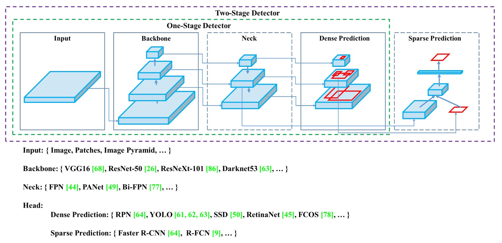
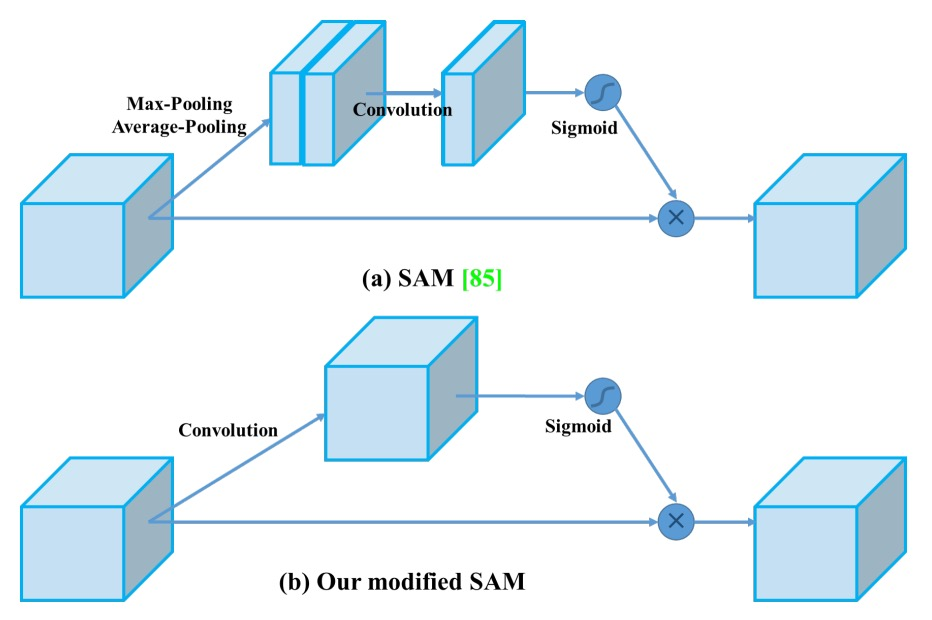
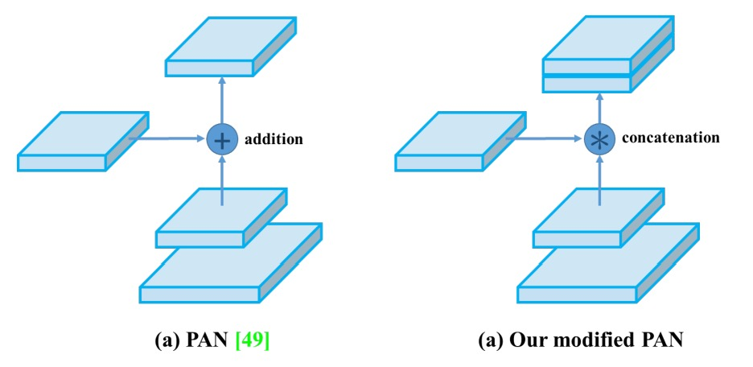
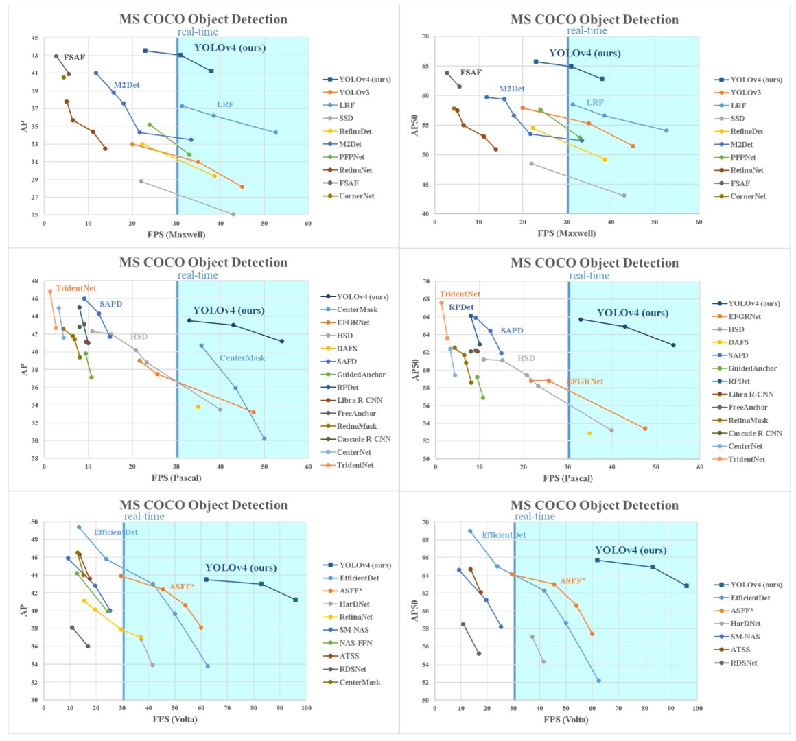

## モデル設計アドバイザー

[**YOLOv4: Optimal Speed and Accuracy of Object Detection**](https://arxiv.org/abs/2004.10934)

---

この論文は工業的なスタイルで書かれており、「物体検出」モデルの使用説明書のように読める。

まずは全体設計から始めて、物体検出モデルをどう作るべきかを学ぼう。

:::tip
YOLO モデルの原著者は v3 までしか開発せず、その後のバージョンは他の派生によるものであるため、後続の番号間には必ずしも関連性がなく、発表年も厳密な順序ではない。

YOLOv4 は台湾の開発チームによるものである。
:::

## モデルの構造概観

<figure style={{ "width": "90%"}}>

</figure>

物体検出器は通常、`Input`、`Backbone`、`Neck`、`Head` の 4 つの主要モジュールで構成される。

それぞれの段階は役割を持ち、互いに連結しつつ自由に組み合わせることができ、まるで積み木のようだ。

- **Input**

  画像の単純入力に加え、多尺度画像ピラミッド、データ拡張、画像切り出し（patching）や解像度変更など様々な強化信号が加わることもあり、入力段階でモデルの対象認識能力を強化することが目的である。

- **Backbone**

  主な特徴抽出モジュールで、多くは画像分類で実績のある VGG、ResNet、DenseNet などの古典的アーキテクチャから、検出タスク向けに設計された CSPDarknet、DetNet などの派生バージョンがある。入力画像を意味情報と視覚情報を持つ深層特徴マップに変換するのが目的である。

- **Neck**

  異なるレベルの特徴マップを統合し、浅い層の位置情報と深い層の意味特徴のバランスをとることを試みる。FPN から PAN、さらに BiFPN、NAS-FPN へと進化し、情報の流れの融合と伝達効率を追求している。

- **Head**

  最終的な分類とバウンディングボックス回帰を行うモジュールで、YOLO や SSD のような密集予測型と、R-CNN シリーズのような疎密予測型の 2 種類に分かれ、性能と精度の主要な戦場でもある。

## 2 つの設計路線

物体検出のアーキテクチャは発展の過程で、二大主流戦略に分かれてきた：二段階（Two-stage）と単段階（One-stage）。

- **二段階構造**（Two-stage）は Faster R-CNN や Libra R-CNN などが代表例で、候補領域（Region Proposals）をまず生成し、続いて分類と境界ボックス回帰を行う。この方法は高い精度と強力な領域モデリング能力を持ち、精密検出を必要とするタスクに向いている。後には RepPoints のような anchor-free 版も登場し、アンカー設計の制約を緩和している。
- **単段階構造**（One-stage）は YOLO、SSD、RetinaNet などで、候補領域を生成せず、画像全体に対して直接密集予測を行い、効率と推論速度の向上を図る。この手法は CenterNet、FCOS、CornerNet などの anchor-free 設計とともに、従来の二段階構造の精度優位性にも挑戦している。

この 2 つの路線の分岐は「速度」と「精度」のトレードオフを象徴しており、YOLOv4 の設計はこのスペクトラム上で最適なバランスを目指している。

## 特徴融合の Neck

Backbone の深さや幅が増すにつれ、多層の特徴を効果的に統合することが予測の鍵となった。

これが Neck モジュールの設計意図であり、意味情報と位置情報を補完的に融合して、Head に意味と空間の詳細を兼ね備えた入力を提供する。代表的な手法は：

- **FPN**（Feature Pyramid Network）はトップダウンの融合構造を開拓し、高層の意味信号を段階的に上方向にアップサンプリングし融合する。
- **PAN**（Path Aggregation Network）はボトムアップの経路を補い、浅層情報のフィードバック能力を強化する。
- **BiFPN / NAS-FPN**は学習可能な重み付きの双方向融合や NAS（ニューラルアーキテクチャサーチ）による最適構成探索で効率と性能をさらに追求する。
- **ASPP / RFB / SAM**のようなモジュールは空間ピラミッド、受容野設計、注意機構を用いて特徴表現能力を強化する。

これらの設計の核心は、速度を過度に犠牲にせずに多尺度理解と特徴表現力を向上させることにある。

## 検出のために生まれた Backbone

モデル設計のモジュール化・交換可能化が進む一方で、物体検出タスク専用の特徴抽出器を骨幹ネットワークから再設計する動きもある。

- **DetNet**や**DetNAS**は分類指向のバックボーンを検出指向に変え、高解像度維持と検出感知能力に注力する。
- **SpineNet**はデータフローの多様性と特徴組み合わせの柔軟性を強調し、NAS で最適ネットワーク構成を探す。
- **HitDetector**はタスク要求から直接設計を起こし、入力から予測までの全体設計を計画し、各モジュールの協調効果を最大化する。

この方向性の発展は、タスク要求が画像分類から位置検出・枠選択へと移行し、単に分類構造を流用するだけでは検出の複雑性に対応できないことを示し、骨幹からの再設計がより効率的な解決策となる可能性を示唆している。

## 訓練最適化テクニック

物体検出の訓練過程では「Bag of Freebies」と呼ばれる技術群が存在する。

これは「**訓練コストは増加するが推論効率に影響を与えない技術**」を意味し、推論速度を犠牲にせずにモデルの精度と汎化能力を高めることが目的である。

この技術群は大きく 3 タイプに分かれる：データ拡張、ラベル処理、損失関数の最適化。

### データ拡張

物体検出モデルの汎化能力は入力データの多様性に大きく依存する。異なる環境下の画像入力に対応するため、データ拡張は最も一般的かつ効果的な手法である。

- **ピクセルレベルの変化**：輝度、コントラスト、彩度、色相、ノイズなどの光学的歪みや、ランダムなスケーリング、切り出し、反転、回転などの幾何学的変換が含まれ、元のピクセル情報は保持しつつ配置や見た目を変える。
- **マスキング強化**：Random Erase、CutOut、Hide-and-Seek、GridMask など、遮蔽シーンをシミュレートするために画像領域をランダムにマスクし、遮蔽下でも目標を識別する力をモデルに学習させる。
- **特徴マスキング**：同様の概念は特徴マップにも適用でき、DropOut、DropConnect、DropBlock などが中間表現のロバスト性と安定性を強化する。
- **複数画像の混合**：MixUp や CutMix は 2 枚の画像を融合・結合し、ラベルを加重調整または面積比率に応じて配分し、複雑なシーン理解力を向上させる。
- **スタイル変換**：Style Transfer GAN は異なるスタイルの画像を生成し、CNN が特定の材質やテクスチャに過度に依存するのを抑制する。

### ラベルスムージングと知識蒸留

入力画像の処理に加え、ラベル操作も無料の最適化の一環である。

分類タスクでは、ラベルは通常 one-hot 形式で表される。この「ハードラベル」は明確だが、意味レベルの曖昧さや柔軟性に欠ける。そこで Label Smoothing が提案され、元のラベルを「ソフトラベル」に変換し、モデルが特定のクラスに過度に自信を持つことを防ぎ、未知データに対する安定性を向上させる。

さらに、知識蒸留を導入し、高性能な Teacher モデルがより細かな出力分布を提供し、Label Refinement Network を通じて学生モデルにクラス間の相対関係を学習させる手法もある。

### 損失関数の最適化

物体検出タスクで極めて重要な境界ボックス回帰問題に対し、従来は MSE や L1/L2 Loss で座標（中心点や対角線など）を直接回帰していた。しかしこれらはボックス全体の幾何構造を無視し、物体のスケール変化にも弱い。

そのため近年は IoU Loss が主流となり、予測ボックスと真実ボックスの重なり領域を損失関数の中心に据え、スケール不変性と意味的一貫性の利点を持つ。

さらに改良版も登場している：

- **GIoU (Generalized IoU)**：最小の包囲ボックスを加味し、IoU が完全に重ならない場合の勾配消失問題を解決。
- **DIoU (Distance IoU)**：中心点距離を組み込み、位置精度を強化。
- **CIoU (Complete IoU)**：重なり率、中心距離、縦横比を同時考慮し、総合的に最良かつ収束速度も速い。

これらの回帰損失改良は収束の安定性を高め、モデルの位置精度向上に不可欠である。

## 精巧なモジュール設計

Bag of Freebies と対をなす、精度向上のもう一つの戦略が**Bag of Specials**である。

これは推論コストを多少増やすが、その計算増加に見合わないほどの精度向上をもたらすため、物体検出において高いコストパフォーマンスを誇る技術群だ。

これらの技術は主に 4 つの視点に分かれ、さらに見落とされがちだが強い影響力を持つ「活性化関数設計」も含む：

**受容野拡張、注意機構、特徴統合モジュール、非極大値抑制（NMS）後処理、活性化関数設計**

### 受容野の拡張

モデルが文脈情報を早期に感知し空間理解力を高めるため、多くのモジュールが受容野拡張を目指す：

- **SPP（Spatial Pyramid Pooling）** モジュールは従来の SPM 概念に由来し、画像分類で多尺度の領域表現を作成するために使われた。YOLOv3 ではこれを畳み込みネットワークに統合し、空間サイズを変えずに複数の MaxPooling（例：k=1,5,9,13）を連結して大幅な受容野拡張を実現。YOLOv3-608 では計算量が 0.5%増加するのみで AP50 が 2.7%向上。
- **ASPP（Atrous Spatial Pyramid Pooling）** は複数の異なる膨張率の 3×3 膨張畳み込みを用い、多尺度の受容野相当の空間認識を行う。
- **RFB（Receptive Field Block）** はさらに多様な膨張率の畳み込みを並列処理し、密かつ広範囲の空間カバーを獲得。SSD 上で推論時間が 7%増加するのみで AP50 が 5.7%向上。

### 注意機構

注意モジュールは重要信号の強度を動的に調整する役割を担い、近年視覚タスク全般で広く使われている：

- **SE（Squeeze-and-Excitation）** モジュールはチャネルレベルの再重み付けに注力し、識別力の高い特徴にモデルを集中させるが、GPU 上の推論負荷は比較的高い。
- **SAM（Spatial Attention Module）** は空間レベルで注意を導入し、入力特徴マップを空間的に重み付け。コストは極めて低く、GPU 推論速度にほとんど影響しない。

### 複数尺度統合

従来はスキップコネクションやハイパーカラムで浅層と深層特徴を連結していたが、FPN を代表とする多尺度融合構造の台頭により、より効率的な融合モジュールが提案されている：

- **SFAM**：SE モジュールを基にチャネル注意を強化。
- **ASFF（Adaptive Spatial Feature Fusion）**：ポイントワイズソフトマックスで異なる尺度の特徴融合重みを決定。
- **BiFPN**：マルチインプット加重残差接続を提案し、尺度ごとに学習可能な融合を実現し、精度と効率の良好なバランスを達成。

### 活性化関数の進化

良い活性化関数は勾配の安定伝播を助け、余分な負担をかけない：

- **ReLU** は従来の sigmoid/tanh の勾配消失問題を解決。
- **LReLU / PReLU** は負の領域の勾配消失問題を克服。
- **ReLU6 / hard-Swish** は量子化ネットワーク向けに最適化。
- **SELU** は自己正規化（self-normalization）をサポート。
- **Swish / Mish** は滑らかで微分可能な関数であり、深層ネットの収束性と精度を向上。

これらの活性化関数は微視的な設計でありながら、大規模ネットワークでは顕著な性能向上につながる。

### NMS（非極大値抑制）後処理

NMS は重複する予測ボックスを除去するための最後のステップ：

- **従来の NMS** は IoU と信頼度スコアで上位のボックスを残すが、遮蔽された物体の信頼度低下問題には弱い。
- **Soft-NMS** はスコアを減衰させることで「過度な除去」を緩和。
- **DIoU-NMS** は中心距離情報を加え、より幾何学的な直感に基づいた選別を行う。

ただし、anchor-free 構造の普及に伴い、FCOS のように NMS を廃止し、損失設計や後処理条件で直接予測選択を行うものもある。

## 解決問題

ついに YOLOv4 本体を見ることができる。

これまで紹介した様々な手法を踏まえると、著者は「速くて良い」構造を見つけ出そうとしていることが分かる。

### アーキテクチャの選択

Backbone 設計において、著者は「分類モデル ≠ 検出モデル」という核心概念から出発し、各種アーキテクチャの異なるタスクにおける性能を再評価した。

彼らは、**CSPResNeXt50** が ImageNet で優秀な成績を示す一方で、MS COCO 検出タスクでは**CSPDarknet53**の方が優れていることを発見した。これは検出タスクが分類タスクよりも厳しい要求を持つためである：

- **より高い入力解像度**：小さなターゲットを識別するため。
- **より深い層数と大きな受容野**：広範な文脈情報をカバーするため。
- **より多いパラメータ容量**：多目標・多尺度シーンに対応するため。

例えば受容野について、CSPResNeXt50 は 16 層の 3×3 畳み込みで 425×425 の受容野だが、CSPDarknet53 は 29 層で 725×725 の受容野を持ち、より大きなパラメータ数（27.6M）と合わせて複雑な検出シーンに対応できる。

そのため YOLOv4 は**CSPDarknet53**を Backbone に選択し、そこに**SPP モジュール**を加えて受容野を強化、さらに**PANet**で多層特徴を融合し、最終的に**YOLOv3 Head**へ接続して予測を行う構成を取った。

この構成のコアは：

- **Backbone**：CSPDarknet53
- **Neck**：SPP + PANet
- **Head**：YOLOv3（アンカーベース）

### 訓練戦略の選択

YOLOv4 の訓練戦略は以下の 2 つの古典的概念に基づく：

- **Bag of Freebies (BoF)**：訓練コストは増やすが推論負荷は増やさない
- **Bag of Specials (BoS)**：推論コストを多少増やして精度を大幅向上させる

訓練構造として、YOLOv4 は収束しにくい活性化関数（PReLU や SELU）、量子化対応の ReLU6 を廃し、効果のバランスが良い**Mish activation**を採用。正規化には複数 GPU 訓練に必要な SyncBN をやめ、単 GPU 訓練に適した\*\*Cross mini-Batch Normalization (CmBN)\*\*を新設計した。

<figure style={{ "width": "80%"}}>

</figure>

深層学習では Batch Normalization（BN）が安定訓練に重要だが、BN は十分なサイズのミニバッチが前提。モデル規模が大きくなったり GPU が 1 枚だけの場合、ミニバッチサイズが小さくなり BN 効果が激減し、不安定になることが多い。

従来は SyncBN（Cross-GPU BN）が複数 GPU 間で統計量を共有し安定化を図っていたが、単 GPU 環境には向かない。

CmBN は「ミニバッチ間」統計量の集約を導入。Mosaic のように 4 枚の画像を一括で訓練に使う際、これらを「拡張サンプル集合」とみなし、BN 計算時に各サブミニバッチで別々に統計し、平均で合成する。

つまり 1 バッチ内に複数の統計情報を持ち、単一サブサンプルの偏りから BN を解放する。小バッチへのデータレベルでの集約補正と似ており、多 GPU 同期なしで BN の一般化安定性を向上させる。

また DropBlock を主要正則化法に選び、CutMix、MixUp、Label Smoothing などの増強と合わせ、訓練で代表的な無料性能向上セットを構成する。

### 追加の増強設計

YOLOv4 の訓練には以下 3 つの重要な最適化がある：

1. **Mosaic データ増強**：

   4 枚の画像を混合しシーン多様性を拡大、BatchNorm がより多くの画像情報を同期処理でき、小バッチでの安定性向上を実現。

   

   <figure style={{ "width": "80%"}}>
   
   </figure>
   

2. **SAT（Self-Adversarial Training）**：

   訓練初期にモデル自身の画像を敵対的に改変し、その変異画像を認識することで、遮蔽や偽装攻撃に対する頑健性を強化。

3. **モジュール改良**：

   - SAM を point-wise 注意力に変更し、細部情報への注目度を上げる。

       

       <figure style={{ "width": "60%"}}>
       
       </figure>
       

   - PANet の shortcut を concat に変え、特徴融合の完全性を強化。

       

       <figure style={{ "width": "60%"}}>
       
       </figure>
       

これらの設計は、データ表現力の強化からモデル認識境界の拡張、訓練安定性の再構築まで、単 GPU 訓練と推論環境に適応した総合的な最適化戦略を成す。

### コンポーネント総覧と技術選定

以上の設計を統合すると、YOLOv4 の最終モジュール選択は以下となる：

**構造構成：**

- **Backbone**：CSPDarknet53
- **Neck**：SPP、PAN
- **Head**：YOLOv3 Head

**訓練技術（Backbone & Detector 用 BoF）：**

- CutMix / Mosaic データ増強
- DropBlock 正則化
- Label smoothing
- CIoU Loss
- CmBN
- SAT
- Grid sensitivity 除去策
- 複数アンカーによる単一 ground truth 対応
- Cosine annealing スケジューラ
- ランダム訓練解像度
- 遺伝的アルゴリズムによる最適パラメータ組合せ

**推論技術（Backbone & Detector 用 BoS）：**

- Mish activation
- CSP モジュール
- 複数入力加重残差接続
- SPP モジュール
- 改良版 SAM
- PAN path aggregation
- DIoU-NMS 後処理戦略

### 実験設定

様々な訓練戦略がモデル性能に与える影響を検証するため、著者は 2 つの標準データセットで大規模実験を行い、分類および検出タスクの訓練・評価を実施した。

**ImageNet（ILSVRC 2012 val）** 画像分類実験のデフォルト訓練設定は以下：

- **訓練ステップ数**：8,000,000 steps
- **バッチサイズ / ミニバッチサイズ**：128 / 32
- **学習率スケジュール**：Polynomial decay、初期学習率 0.1
- **ウォームアップステップ数**：1,000
- **Momentum / Weight decay**：0.9 / 0.005

**Bag of Freebies (BoF)** の設定では以下の戦略を検証：

- MixUp
- CutMix
- Mosaic
- ブラー処理（Blurring）
- ラベルスムージング（Label Smoothing）

**MS COCO（test-dev 2017）** 物体検出実験のデフォルト設定は：

- **訓練ステップ数**：500,500 steps

- **学習率スケジュール**：Step decay

  - 初期学習率：0.01
  - 400,000 および 450,000 ステップで 0.1 倍に減衰

- **Momentum / Weight decay**：0.9 / 0.0005

- **バッチサイズ / ミニバッチサイズ**：64 / 8 または 4（モデル・メモリ容量により調整）

遺伝的アルゴリズムによる最適ハイパーパラメータ探索実験を除き、他すべての実験は同じデフォルト設定を用いた。

ハイパーパラメータ探索では、YOLOv3-SPP 構造と GIoU Loss を用い、min-val 5k サブセットで 300 エポックの探索を実施。最終採用パラメータは以下：

- **学習率**：0.00261
- **Momentum**：0.949
- **IoU 割当閾値**：0.213
- **損失正規化係数**：0.07

すべての実験は**単 GPU 上で実施**され、syncBN などのマルチ GPU 最適化技術は用いられていない。

## 議論

### 分類器訓練における各特徴の影響

<figure style={{ "width": "80%"}}>

</figure>

著者は分類器訓練過程で異なる訓練戦略が最終精度に与える影響を検証し、特に以下の代表的強化技術に注目した：

- ラベルスムージング（Class label smoothing）
- 各種データ増強（Blur 処理、MixUp、CutMix、Mosaic）
- 活性化関数の種類（Leaky ReLU、Swish、Mish）

実験結果（上図）より、分類器訓練において以下がモデル精度を大きく向上させることが明らかとなった：

- **CutMix データ増強**
- **Mosaic データ増強**
- **ラベルスムージング正則化**
- **Mish 活性化関数**

このため、YOLOv4 の分類器訓練戦略（BoF-backbone）には以下を最終採用：

- CutMix
- Mosaic
- ラベルスムージング

さらに実験結果に基づき、補助的活性化関数として**Mish activation**を併用し、分類精度をさらに向上させている。

### 検出器訓練における各特徴の影響

<figure style={{ "width": "80%"}}>

</figure>

著者は異なる訓練戦略が検出器の精度に与える影響をさらに評価し、特に **Bag of Freebies for detector（BoF-detector）** に関する体系的な実験を行った（上表参照）。

YOLOv4 は BoF の選択肢を大幅に拡充し、**推論速度（FPS）を犠牲にせず精度向上が見込める訓練技術**に注力している。

検証済みの BoF-detector 項目は以下：

- **S: Grid Sensitivity Elimination**
  YOLOv3 ではターゲット座標は $b_x = σ(t_x) + c_x$ で定義され、$c_x$ は整数。$t_x$ の値が極端に大きい・小さい時のみ $b_x$ がグリッド端に近づき、これが一部端のターゲットの検出困難を招いていた。
  これを解決するため、sigmoid の出力に 1 以上の係数をかけてグリッド感度の制約を緩和。

- **M: Mosaic データ増強**
  4 枚の画像を結合して入力とし、異なるシーン・スケールのターゲットを同時学習させ、汎化能力を強化。

- **IT: IoU Threshold**
  各 ground truth に対し複数のアンカーを割り当て、IoU(anchor, truth) > threshold の条件を満たすものを活用しサンプル使用率を増加。

- **GA: Genetic Algorithms**
  訓練初期（最初の 10%期間）に遺伝的アルゴリズムで最適超パラメータを探索し、収束安定性とモデル性能を向上。

- **LS: Class Label Smoothing**
  分類タスクにラベルスムージングを適用し、モデルの過信を減らしてクラス間の曖昧な境界を識別。

- **CBN: Cross mini-Batch Normalization (CmBN)**
  単一ミニバッチではなくバッチ全体で統計値を集約し、小バッチ訓練の安定性を向上。

- **CA: Cosine Annealing Scheduler**
  学習率をコサイン関数で動的調整し、より滑らかな学習曲線と良好な収束を実現。

- **DM: Dynamic mini-batch Size**
  低解像度訓練フェーズでミニバッチサイズを動的に増加、ランダム入力サイズ訓練に対応。

- **OA: Optimized Anchors**
  入力解像度（例：512×512）に最適化したアンカー位置・サイズを設定し、割当効率を改善。

- **BBox Regression Loss**
  GIoU、CIoU、DIoU、従来の MSE など複数の境界ボックス損失関数を比較し、各種環境での回帰品質を検証。

---

また、**Bag of Specials for detector** に関する検証も実施（下表参照）：

<figure style={{ "width": "80%"}}>

</figure>

実験項目例：

- **PAN**：パラメータ集約と特徴流通性の向上
- **RFB**：多尺度膨張畳み込みによる受容野拡張
- **SAM**：空間注意機構
- **Gaussian YOLO (G)**：予測ボックスを単一点ではなくガウス分布で推定
- **ASFF**：スケール間の注意的融合戦略

結果から、モデルに**SPP、PAN、SAM**を同時採用すると最適な総合性能が得られる。

### Backbone の違いによる影響

<figure style={{ "width": "80%"}}>

</figure>

著者は異なる Backbone が検出精度に及ぼす影響を調査した（上表参照）。

結果は、**分類性能が最良のモデルが必ずしも検出タスクで優れるわけではない**ことを示す。

具体的には、分類タスクで様々な訓練技術を用いた**CSPResNeXt50**は分類精度が**CSPDarknet53**より高いが、検出器の Backbone として用いると、逆に CSPDarknet53 の方が高い検出性能を示す。

特に、**CSPResNeXt50**に BoF や Mish activation を組み合わせた分類モデルを検出器の初期重みとして使うと精度が低下。一方、**CSPDarknet53**を同様に訓練し Backbone に用いると、分類精度向上に加え検出性能も向上する。

これは、**分類タスクと検出タスクの特徴学習ニーズには本質的な違いがある**ことを示している。

CSPDarknet53 の構造特性と受容野設計が物体検出により適していると結論づけられる。

### ミニバッチサイズの違いによる影響

<figure style={{ "width": "80%"}}>

</figure>

最後に、著者は異なるミニバッチサイズでの訓練影響を分析した（上図参照）。

結果から明確に分かるのは、**BoF と BoS 訓練戦略を導入後、ミニバッチサイズは検出器の最終性能にほとんど影響しなくなる**という点だ。

これは実務上重要な発見である。

従来は訓練の安定性・性能向上のため大容量 GPU メモリを使い大きなバッチサイズが望まれていたが、本研究の Mosaic、CmBN、DropBlock、Label smoothing、SPP、PAN などの訓練・構造最適化により、**小規模ミニバッチでも安定かつ優れた学習効果が維持される**ことが示された。

### ベンチマーク

<figure style={{ "width": "90%"}}>

</figure>

YOLOv4 の最終結果は、他の最先端物体検出器と比較して速度と精度のパレート最適曲線上に位置し、効率と精度の最適なバランスを示している（上図参照）。

現在の主流の高速モデルと高精度モデルの両方を凌駕し、高速推論を保ちつつ先行する高精度モデルと同等かそれ以上の性能を達成。

推論時間計測の GPU アーキテクチャ差を考慮し、Maxwell、Pascal、Volta といった主要 GPU 環境で性能評価を行い、YOLOv4 のスケーラビリティと汎用性も証明した。

古い世代から最新ハードウェアまで幅広く安定した性能を維持し、設計におけるハードウェア親和性の重要性を体現している。

## 結論

YOLOv4 は MS COCO の AP50 評価指標で**現存する全主要モデルを上回り**、推論速度（FPS）でもトップを維持している。

さらに、8〜16GB VRAM の一般消費者向け GPU 上での訓練・展開が可能であり、技術的障壁を大幅に下げ、幅広い応用可能性を持つ。

物体検出に取り組む開発者にとって、この論文は必読であると言える。
