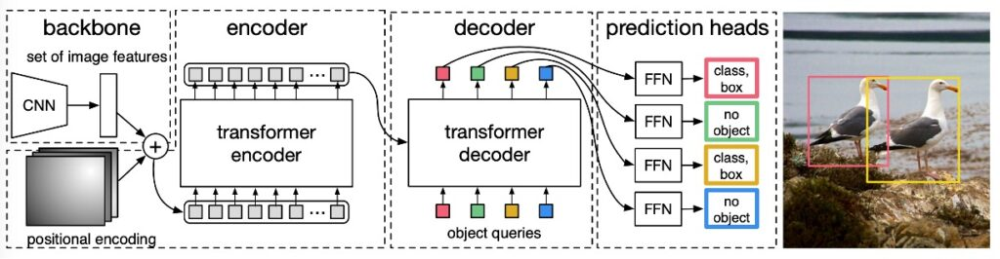
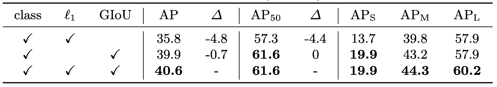

## 跨分野の基盤を築く者

[**End-to-End Object Detection with Transformers**](https://arxiv.org/abs/2005.12872)

---

物体検出はコンピュータビジョン分野の核心的なタスクである。

## 問題の定義

物体検出の領域では、Anchor-based の手法が近年非常に流行している。Faster R-CNN、SSD、YOLO といった構造は、画像上にあらかじめ定義された一組のアンカーボックスを配置し、それぞれのアンカーに対してクラス分類とボックス回帰を行う。

この設計は効果的であるが、多くの問題も抱えている：

- アンカーのサイズやアスペクト比はデータセットの特性に応じて手動設計が必要で、汎用性が限られる。
- 各位置に複数のアンカーが対応し、多数の重複予測が発生するため NMS によるフィルタリングが必須となる。
- ボックスと正解ラベルの整合処理が煩雑で、訓練プロセスが高度に結合されている。

使いづらいと感じる？

ではアンカーを使わない方法はどうか？

不可能ではない。Anchor-free の構造もこのために生まれた。

しかし実際のシーンでは、正確さが何より重要だ。ユーザーは遅くても数秒の遅延なら許容し、システムが複雑でもエンジニアが対応するなら構わない。

**だがモデルの精度が低ければ文句を言う！**

Anchor-free の構造は一般的に精度が劣り、物体検出のベンチマークで顕著な成果を示せていない。

一方、同じ時間軸の隣の領域（NLP）では、最新の Transformer 構造が猛烈に進展し、多くの顕著な成果を上げている。

本論文の著者はこう考えた：

> **複雑な仕組みを捨てて、皆で Transformer を使ってみてはどうか？**

## 解決策

全体構造は論文中の図の通りで、大きく 3 つのモジュールから成る：

1. **CNN backbone**：入力画像から特徴マップを抽出
2. **Transformer encoder-decoder**：画像全体の文脈と物体間の関係をモデル化
3. **Prediction Head（FFN）**：ボックスとクラスを出力

### モデル構造

まず Backbone 部分を見てみる。

Backbone は入力画像 $x_{img} \in \mathbb{R}^{3 \times H_0 \times W_0}$ を CNN で処理し、$f \in \mathbb{R}^{C \times H \times W}$（例：ResNet50 で通常 $C=2048$, $H=W=H_0/32$）を出力する。

続いて $1\times1$ の畳み込みでチャネルを $d$ 次元（例：$d=256$）に削減し、特徴マップ $z_0 \in \mathbb{R}^{d \times H \times W}$ を得る。これを平坦化して長さ $HW$ の系列ベクトルとして Transformer encoder へ送る。

<figure style={{ "width": "60%"}}>

</figure>

Transformer Encoder はよくある標準構造で、各層に MHSA と FFN を含む。また Transformer のトークン間に明確な位置関係がないため、入力段階で固定の位置エンコーディング（例えば sine/cosine）を加えている。

次に Transformer Decoder 部である。出力は $N$ 個の物体を同時に生成し、自己回帰的ではない。物体間に強い依存関係がないため、一括並列で出力可能だ。

各出力位置は学習可能な**object query**（$\in \mathbb{R}^d$）に対応し、多層デコーダが self-attention と encoder-decoder attention を用いて、object query 同士と画像特徴とのやりとりを行う。これにより物体間の全体的推論能力（例えば相対関係や分布の考慮）を獲得する。

最後に予測ヘッドで、各デコーダ出力ノードは 3 層の前方伝播ネットワークに繋がり、

- クラス（K+1 クラスの softmax、「no object」クラス含む）
- 境界ボックス座標（正規化された中心座標と幅・高さ）

を出力する。

ここで予測されるのは「固定長の候補ボックス集合」であり、従来の dense grid やアンカーボックスとは異なるため、集合損失で訓練可能である。

### 損失設計

過去の物体検出の訓練過程では、ほぼ必ず「予測したボックスをどの ground truth に対応させるか？」という問題が避けられなかった。

例えば Faster R-CNN は IoU > 0.5 の proposal を positive とみなし、YOLO 系列はアンカーボックスの中で最も近い対象を割り当てる。これらは「ヒューリスティックな割り当てルール（heuristic assignment）」であり、目的は予測結果と真のラベルを整合させて分類と回帰を学習することである。

DETR はこれを最適化問題として捉え、**Hungarian Algorithm（ハンガリーアルゴリズム）** を用いて最適な組み合わせを計算し、予測を一意に ground truth と対応づける。これにより重複予測や重なり、煩雑な後処理ルールを回避する。

- **Step 1：最適マッチング（二部マッチング）**

  :::tip
  ハンガリーアルゴリズムの紹介は独立した記事としてまとめることができるため、ここでは詳述しない。アルゴリズムに不慣れな読者は以下のリンクを参照されたい：

  - [**Hungarian algorithm**](https://en.wikipedia.org/wiki/Hungarian_algorithm)
    :::

  設定：

  - $y = { y_1, y_2, \dots, y_M }$ は ground truth オブジェクト集合。各 $y_i = (c_i, b_i)$ はクラスとバウンディングボックス。
  - $\hat{y} = { \hat{y}_1, \hat{y}_2, \dots, \hat{y}_N }$ はデコーダ出力予測集合。$N \gg M$ かつ $\hat{y}_j = (\hat{p}_j, \hat{b}_j)$

  集合を合わせるため $y$ に "no object"（$\varnothing$）を $N - M$ 個追加し、長さを等しくする。さらに**マッチングコスト関数 $L_{\text{match}}$** を設計し、予測と真値間の誤差を測る：

  $$
  \hat{\sigma} = \arg\min_{\sigma \in S_N} \sum_{i=1}^N L_{\text{match}}(y_i, \hat{y}_{\sigma(i)})
  $$

  ここで $\sigma$ は $N$ 個予測の順列で、一対一の最適対応を求める。

- **Step 2：マッチングコストの定義**

  各ペア $y_i = (c_i, b_i)$ と予測 $\hat{y}_j = (\hat{p}_j(c), \hat{b}_j)$ のコストは以下から構成：

  - 分類誤差（classification cost）：予測クラス確率 $\hat{p}_j(c_i)$ が低いほどコスト大
  - ボックス誤差（box cost）：予測ボックス $\hat{b}_j$ と真値 $b_i$ の差が大きいほどコスト大

  ただし、**$c_i \ne \varnothing$（物体あり）の場合のみ適用**。

  まとめると：

  $$
  L_{\text{match}}(y_i, \hat{y}_j) = -1_{\{c_i \ne \varnothing\}} \cdot \hat{p}_j(c_i) + 1_{\{c_i \ne \varnothing\}} \cdot L_{\text{box}}(b_i, \hat{b}_j)
  $$

  ここでログ確率ではなく直接確率を使うのは、ボックス損失と同じスケールに揃え最適化時のバランスを取るため。

- **Step 3：最終損失（Hungarian Loss）の計算**

  マッチング完了後、損失を計算：

  $$
  L_{\text{Hungarian}}(y, \hat{y}) = \sum_{i=1}^N \left[ -\log \hat{p}_{\hat{\sigma}(i)}(c_i) + 1_{\{c_i \ne \varnothing\}} L_{\text{box}}(b_i, \hat{b}_{\hat{\sigma}(i)}) \right]
  $$

  - 第一項は分類損失：物体クラス確率が低いほど損失大
  - 第二項はボックス損失（下節参照）
  - $c_i = \varnothing$（背景）の場合は分類損失を 0.1 倍にして重みを下げ、背景サンプル過多による学習偏りを防ぐ（Faster R-CNN のサブサンプリングに類似）。

- **Step 4：ボックス損失の設計（$L_{\text{box}}$）**

  DETR は YOLO/Faster R-CNN のように相対オフセットを予測せず、**正規化された絶対座標のバウンディングボックスを直接予測**する。シンプルだが問題もある：

  > **$\ell_1$ 損失はボックスの大きさに依存し、小さいボックスと大きいボックスでスケールが異なる。**

  これを解決するため、以下二つの損失を組み合わせる：

  - $\ell_1$ 損失：座標差分の絶対値、位置精度向上に寄与
  - **Generalized IoU（GIoU）損失**：ボックスの重なり度合いを尺度に依存せず評価

  まとめた式：

  $$
  L_{\text{box}}(b_i, \hat{b}_j) = \lambda_{\text{IoU}} \cdot L_{\text{GIoU}}(b_i, \hat{b}_j) + \lambda_{\ell_1} \cdot \| b_i - \hat{b}_j \|_1
  $$

  - $\lambda_{\text{IoU}}$, $\lambda_{\ell_1}$ は重みのハイパーパラメータで調整が必要。
  - 全ての損失はバッチ内の物体数で正規化される。

  ***

  :::tip
  GIoU の詳細については以下の文献を参照されたい：

  - [**[19.02] Generalized Intersection over Union: A Metric and A Loss for Bounding Box Regression**](https://arxiv.org/abs/1902.09630)
  :::

まとめると、この損失設計のポイントは：

- **一対一マッチング**：予測は重複せず、一度だけ。後処理は不要。
- **背景処理が簡潔**："no object" クラスで背景を表現し、dense negative sampling 不要。
- **GIoU と $\ell_1$ の組み合わせ**：位置と重なり度合いのバランスを両立。

これが、DETR が見た目はシンプルでも end-to-end 物体検出を実現できる核となる理由である。

### データセット

本研究は COCO 2017 データセットで評価を行った。物体検出とセマンティックセグメンテーションの 2 タスクを含み、訓練画像は約 11.8 万枚、検証画像は 5,000 枚。各画像にはバウンディングボックスとセグメンテーションのアノテーションが付与されている。1 画像あたり平均 7 個、最大 63 個の物体が含まれ、大きさのばらつきも大きい小物体から大物体まで混在しているため、挑戦的な設定である。

モデル評価は Average Precision（AP）を主指標とし、ボックス AP を基準にする。Faster R-CNN との比較では最終エポックの検証結果を使用し、アブレーション実験では最後 10 エポックの中央値を報告した。

### 技術的詳細

モデルの訓練は AdamW オプティマイザを用い、Transformer は初期学習率 1e‑4、Backbone は 1e‑5、重み減衰は 1e‑4 に設定。Transformer の重みは Xavier 初期化、Backbone は ImageNet 事前学習済み ResNet を利用し、BatchNorm 層は凍結。

複数の Backbone 組み合わせを評価し、標準の ResNet‑50（DETR）、ResNet‑101（DETR‑R101）、および dilated convolution を使って特徴解像度を上げた DC5 変種（DETR‑DC5 と DETR‑DC5‑R101）を試した。DC5 は小物体検出性能向上に寄与するが、エンコーダ内の自己注意計算量が 16 倍に増え、全体の FLOPs は約 2 倍となる。

訓練時はマルチスケール強化を採用し、画像の短辺を 480–800 ピクセルにランダムにリサイズし、長辺は 1333 ピクセルを超えないように制限。さらに全域関係学習を強化するためにランダムクロップ（50%の確率でランダム領域を切り出し元のサイズにリサイズ）も用い、約 1AP の性能向上を確認。

推論時にはシンプルだが効果的な工夫として、「no object」予測スロットにおいて 2 番目に高いスコアのクラスが信頼できる場合、そのクラスを採用する戦略を導入し、約 2AP の向上を実現。ドロップアウト率は 0.1、他のハイパーパラメータ詳細は論文付録 A.4 を参照。

## 討論

### これでいいのか？

<figure style={{ "width": "80%"}}>

</figure>

小さい物体の検出が大きく劣化している（$AP_S$：27.2 → 23.7）が、全体としては悪くなさそうに見える。

---

DETR と Faster R-CNN の訓練条件やモデル性能を詳しく比較すると、いくつかの重要な点が見えてくる：

1. **訓練戦略の根本的な違い**

   DETR は Transformer 構造を採用し、AdamW や Adagrad といったスパース更新に適したオプティマイザと組み合わせ、長時間の訓練スケジュールやドロップアウトで学習を安定させている。

   一方、従来の Faster R-CNN は SGD を用い、より控えめなデータ拡張を行う。両者の設計思想は大きく異なる。

2. **公平な比較のための調整**

   Faster R-CNN が公平に競えるよう、著者は以下の強化を加えている：

   - ボックス損失に generalized IoU を追加
   - DETR と同じランダムクロップによるデータ拡張を適用
   - 訓練期間を 9 倍（109 エポック）に延長

   これにより約 1–2 AP の性能向上を得て、実質的なベースラインを構築。

3. **モデル設計とパラメータ数の整合**

   DETR はエンコーダ 6 層＋デコーダ 6 層、幅 256、8 ヘッド設定で、総パラメータ数は Faster R-CNN + FPN とほぼ同等の約 4130 万。内訳は ResNet-50 が 2350 万、Transformer が 1780 万。これによりモデル容量での公平性を担保。

4. **実験結果と主要な観察**

- **全体性能**：COCO val 上で DETR は 42 AP を達成し、調整後の Faster R-CNN とほぼ同等。
- **大物体性能（$AP_L$）**：DETR は明確に優勢（+7.8）、全体性能追随の主因。
- **小物体性能（$AP_S$）**：DETR は劣勢（-5.5）、主要なボトルネック。
- **高解像度強化版（DETR-DC5）**：全体 AP は向上するも小物体検出は Faster R-CNN に届かず。
- **異なる backbone の影響**：ResNet-101 でも同傾向が確認され、比較の一貫性を示す。

まとめると、DETR は長時間訓練と高解像度で、同等パラメータ規模で Faster R-CNN と肩を並べられる。ただし小物体検出は全体注意機構の解像度制約が原因で弱く、後続モデル（例：Deformable DETR）での改善余地がある。

### モデル構成要素の解析

著者は DETR の各構成要素の重要性を詳しく検証している：

1. **エンコーダ層数の影響**

   

   <figure style={{ "width": "90%"}}>
   
   </figure>
   

   エンコーダを除くと、画像レベルの全体自己注意が失われ、総 AP は 3.9 ポイント減、大物体は 6.0 ポイント減少。これはエンコーダが単なる特徴抽出ではなく、全体の文脈を把握し物体の初期区分を担うことを示す。

   最終層エンコーダの注意重み可視化では、インスタンスの初期分離が見られ、デコーダの認識・位置推定を助けている。

   

   <figure style={{ "width": "90%"}}>
   
   </figure>
   

2. **デコーダ層数と NMS の関係**

   

   <figure style={{ "width": "60%"}}>
   
   </figure>
   

   DETR のデコーダは各層ごとに監督があり、独立して予測可能。層数増加により AP は安定的に上昇し、1 層目と最終層で約 +8.2 AP の差。

   初期層は文脈不足により重複予測が多いが、1 層目後の従来型 NMS 適用で改善可能。深層になると重複抑制がモデルにより実現され、NMS 効果は消失し最終層では誤削除のリスクもある。

   注意可視化では、デコーダの attention は局所的で物体の端部（頭や脚など）に集中。エンコーダが既に全体分離を行うため、デコーダは細部分類・位置調整の役割と推察される。

   

   <figure style={{ "width": "90%"}}>
   
   </figure>
   

3. **Transformer 内の FFN の役割**

   各 Transformer ブロックの前方伝播ネットワーク（FFN）はチャネル方向の 1×1 畳み込みに相当。これを全除去するとパラメータは 1780 万 → 480 万に減少、モデルは 4130 万 → 2870 万に縮小。

   しかし AP は 2.3 ポイント低下。単純ながら FFN は意味的分離や特徴変換に重要な役割を果たす。

4. **位置エンコーディングの設計と代替実験**

   

   <figure style={{ "width": "90%"}}>
   
   </figure>
   

   DETR は空間位置エンコーディング（入力画像の位置情報）と出力位置エンコーディング（object query の埋め込み）を用いる。

   出力位置エンコーディングは必須。空間位置エンコーディングの代替試験では、

   - 完全除去で AP は 7.8 下がるが 32+ を維持しある程度の耐性あり。
   - 正弦波型や学習型位置エンコーディングを attention 層に注入するとベースライン比でわずか 1.3 ～ 1.4 の低下。
   - エンコーダのみ空間エンコーディング除去でも AP は 1.3 下がるにとどまる。

   これらは、Transformer が系列構造と親和性が高い一方で、画像処理では明確な空間情報が物体位置・境界学習に不可欠なことを示す。

5. **損失関数の寄与分解**

   

   <figure style={{ "width": "90%"}}>
   
   </figure>
   

   DETR の学習損失は分類損失、L1 損失、GIoU 損失の三部構成。

   分類損失は必須。L1 損失と GIoU 損失の個別検証では、

   - GIoU 単独でもそこそこの精度を保ち位置評価に大きく寄与
   - L1 単独は精度低下が顕著

   併用が最も安定的で効果的。

   これは DETR の損失設計哲学、すなわち複雑な後処理を設計するよりも、マッチングコストや損失段階で空間と意味の両面を評価する方が効率的、を裏付ける。

### モデル挙動分析

上図は COCO 2017 検証セットの全画像予測結果を可視化したもので、ランダムに選んだ 20 個の object query スロットにより予測された全てのバウンディングボックスの位置とサイズの分布を示している。

各予測ボックスは中心座標を [0, 1] × [0, 1] の空間にプロットし、形状に応じて色分けされている：緑は小さいボックス、赤は大きな横長ボックス、青は大きな縦長ボックス。

結果は、各スロットが無差別に動いているのではなく、自然に複数の好みのパターンを形成していることを示す：

- あるスロットは画面の特定領域（例：左上、中央）に集中し、
- また別のスロットは特定のスケールや形状のボックスを好む傾向がある、
- ほぼ全てのスロットに「画像全体サイズの大きなボックスを予測する」パターンがあり、これは COCO の主題的物体（大型車両や建物など）に多く見られる。

このような空間的かつスケール的な分業は明示的な監督なしに、set matching loss による学習の動力で自然発生したものであり、DETR が内部的に「**query ごとの分業による暗黙的構造化予測戦略**」を獲得していることを示している。

アンカーや領域提案に依存せず、各 query スロットが特定のシーン領域や物体スケールに「注目」するという、set-based 手法ならではの独特な振る舞いである。

### 未知物体数に対する一般化能力

<figure style={{ "width": "70%"}}>

</figure>

COCO の多くの画像では同種物体数が限られており、例えば訓練セットに 24 頭以上のキリンが同時に写った例は存在しない。これを踏まえ、著者は 24 頭のキリンを配置した合成画像を作成し、DETR の極端な状況での一般化性能を評価した。

結果、DETR は 24 頭全てを正しく検出できた。これは明確な out-of-distribution テストであり、

- DETR の object query は特定クラスに固定されていないこと、
- モデルの動作は「クラスとスロットの固定結合」ではなく、画像全体に基づいた自由な query-to-object 割当であること

を示している。

これは設計理念と合致する。object query は集合予測の空白スロットであり、その学習行動はマッチング損失と attention によって導かれ、初めから意味的な分業は持たない。しかし最終的には有効で拡張性ある物体分離能力を自発的に獲得している。

## 結論

完全無欠な技術は存在しない。

DETR は小物体検出に明らかなボトルネックを抱え、長時間の訓練や高解像度化を経ても $AP_S$ では伝統的手法に劣る。成熟した Faster R-CNN と比較すると、一部条件下でしか同等の性能に達せず、全てのタスクに万能な解法ではないことを示す。

しかし DETR の価値は「性能での完全勝利」ではなく、革新的な思考と構造の可能性にある。

Transformer を本格的に物体検出へ応用し、anchor や proposal、NMS といった長年の工学的慣習を集合予測と匈牙利マッチングで置き換えた最初の試みである。極度に簡潔な end-to-end 設計は複雑な処理を単一の系列入力と集合出力の変換へ圧縮し、概念の明快さと実装の整然さから高い拡張性と理論的魅力を持つ。

この基盤を発展させた論文は数百篇存在し、繰り返し読む価値のある古典的な一作と言える。
