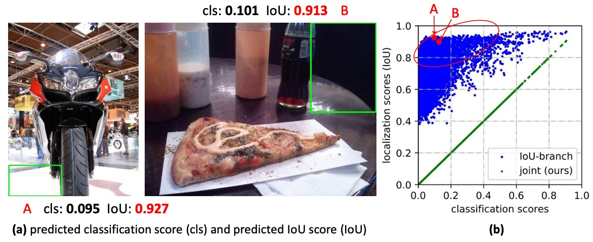

## 融合された焦点

[**Generalized Focal Loss: Learning Qualified and Distributed Bounding Boxes for Dense Object Detection**](https://arxiv.org/abs/2006.04388)

---

この手法は近年の物体検出システムで繰り返し登場しており、ここでその核心概念を確認しておく。

## 問題の定義

物体検出では、常に 2 つのスコアを追い求めている：

- **分類スコア**：このボックスの中身は「何」か？
- **ローカライゼーション品質**：このボックスは「どれだけ正確」か？

主流のワンステージ検出器（dense / one-stage）は、この 2 つの課題を**別々に学習**させる習慣がある。分類はひとつのブランチ、品質（たとえば IoU や centerness）はもうひとつのブランチで扱う。

推論段階になると、すべての候補ボックスを NMS でソートし、**2 つのスコアをそのまま掛け算して最終スコア**として用い、それをもとに最終的な予測を決定する。

<figure style={{ "width": "90%"}}>

</figure>

なぜ「掛け算」なのか？

直感的には、「分類が高い、もしくはローカライゼーションが高い、できれば両方高い」ことを期待するからだ。

0〜1 のスコア空間での掛け算は、どちらか一方が低ければ全体のスコアも一気に下がるので、理にかなっているように見える。

だが、ここに 2 つの構造的問題が隠れている：

1. **学習と推論の不一致**：

   学習時、分類と品質のブランチは互いに独立しており、**モデルは「2 つの積が良くなる」ように明示的に要求されたことがない**。だが推論時には突然積を使ってソートされる。
   もしモデルが言葉を話せるなら、「そんな話は聞いていない！」と叫ぶに違いない。

2. **負例の干渉**：

   品質ブランチは普通**正例**のみに監督が入るが、背景や負例には明確な制約が無い。

   その結果、時々背景ボックスの品質スコアが**不自然に高くなる**ことがある：

   - たとえ分類スコアが低めでも、品質スコアが一時的に高くなると、積の最終スコアが上がり、**正例を押しのけてしまう**。
   - 密なアンカーやポジション全面サンプリングの状況では、この「並び替えのズレ」がより大きな影響となり、NMS の最終判断を狂わせてしまう。

    

    <figure style={{ "width": "90%"}}>
    
    </figure>
    

---

問題はこれだけではない。**バウンディングボックスそのものの表現**についても疑問が残る。

長年、みんなはボックスを「確定した座標」として扱ってきたが、現実世界は不確実性で満ちている：境界の曖昧さ、オクルージョン、アノテーターごとの差異など、ひとつの点で表現するのはあまりにも固定的だ。

以前には**ガウス分布**を導入し、モデルに平均値と分散を学習させることで「不確実性」を表現しようとしたこともある。しかしガウス分布は本質的に対称で形状が一様のため、現実データの**歪み、裾の長さ、あるいは多峰性**に対応するのは苦手だ。

こうしてまた壁にぶつかる：

- **スコア面**：分類とローカライゼーション品質が**それぞれ勝手に話している**。学習目標と推論のソート基準も**一致していない**し、時には負例が割り込んできて混乱する。
- **ボックスの表現**：**過度に確定的**か、**過度に単純化**されていて、データの本当の分布形状を忠実に反映しきれない。

「分類」と「品質」を同じ言語で語らせ、学習と推論を最初から整合させることはできないか？

ボックス分布の形を前提にせず、モデル自身に「もっと汎用的で柔軟な分布表現」を直接学習させることはできないか？

## 問題の解決

本論文の手法を説明する前に、まずは幼い頃に学んだ Focal Loss を復習しておこう。

:::tip
Focal Loss の詳細については、以前のノートも参考にしてほしい：

- [**[17.08] RetinaNet: Focal Loss こそが本質**](../1708-retinanet/index.md)
  :::

### Focal Loss

ワンステージ物体検出において、分類器が最初に直面する課題は**極端なサンプル不均衡**である。

大多数の候補ボックスは背景（negative）であり、本当の前景（positive）はごくわずかしか存在しない。このため、従来のクロスエントロピー損失は「簡単に分類できる大量の背景サンプル」に支配されやすく、モデルは背景を素早く正しく分類できるが、本当に難しい前景サンプルを十分に学習できないという問題があった。

Focal Loss の設計目標は次の通り：

> **簡単なサンプルの寄与を抑制し、困難なサンプルの影響を強調する。**

損失関数の前に「動的なスケーリング因子」$(1-p_t)^{\gamma}$ を掛けることで、「モデルが自信を持って正解できる」サンプルの寄与はほぼゼロになり、逆に「モデルが不確か／間違えやすい」サンプルのみ強調される。

形式は以下の通り：

$$
\mathrm{FL}(p) \;=\; - (1 - p_t)^{\gamma}\,\log p_t,\qquad
p_t \;=\;
\begin{cases}
p, & y=1 \\
1-p, & y=0
\end{cases}
$$

ここで：

- $p \in [0,1]$：モデルが正例であると予測した確率。
- $y \in {0,1}$：正解ラベル。
- $\gamma \ge 0$：簡単なサンプルをどれだけ抑制するかの強度。

この仕組みのポイントは、単なる $y \in {0,1}$ の 2 値処理に留まらず、**連続的なラベル**（$y \in [0,1]$）への拡張にも土台を作った点だ。つまり、単なる「正解／不正解」だけでなく、もっと細かいローカライゼーション品質を考える際にも、Focal Loss の「難例フォーカス」精神がそのまま活かせる。

### Quality Focal Loss

<figure style={{ "width": "90%"}}>

</figure>

Focal Loss のフォーカス機構を理解した上で、さらに次のように考えられる：

> 物体検出においては、「これは何のクラスか？」だけでなく、「どれだけ正確にボックスを描けているか？」も重要だ。

従来は**分類スコアとローカライゼーション品質スコアを別々に学習し、最終的に推論で掛け合わせる**のが普通だった。

だが前述したように、この「後付け合成」方式は、学習と推論の間に不一致を生む：学習では分類しか学ばず、推論時に突然分類と品質を掛け合わせて使うため、両者が本当の意味で協調できていない。

この問題を解決するため、著者は**Quality Focal Loss (QFL)** を提案した。

設計思想は：**最初から「分類 × 品質」の合成スコアをモデルに学ばせる。後から強引に合成しない。**

---

方法として、まず連続ラベルを導入する。

- 正解クラス $c^*$ の該当次元では、**ラベルが単なる $0$ や $1$ ではなく**、候補ボックスと GT の **IoU 値**、すなわち $y \in [0,1]$ になる。

  - $y=0$：そのクラスでない、もしくは品質ゼロ。
  - $y=1$：完全に正解かつ高品質。
  - それ以外：部分的な正解や限定的な品質を表す。

- 負例の全ラベルは $0$（品質 = 0）。

- モデルの出力は該当クラスの **シグモイド確率** $\sigma \in [0,1]$ となる。

---

損失関数として、QFL は 2 段階で目標を達成する：

元のバイナリクロスエントロピー（BCE）を一般化し、Focal のモジュレーション因子を「ラベルとの距離の連続版」に置き換える：

$$
\mathrm{QFL}(\sigma) \;=\; -\,|y-\sigma|^{\beta}\;\big[(1-y)\log(1-\sigma) + y\log\sigma\big], \qquad \beta \ge 0
$$

特徴：

- $\sigma = y$ で $\mathrm{QFL}$ は**グローバル最小**を取る。
- $|y-\sigma|^{\beta}$ が「連続版フォーカス因子」として働き、出力とラベルのズレが大きいほどペナルティが重くなる。
- $y \in {0,1}$ かつ $\beta$ を適切に選べば、**元の Focal Loss** に戻る。

QFL 方式ではモデル出力 $\sigma$ が**すでに分類と品質を統合した信号**となるので、推論時には**そのまま $\sigma$ を使ってソート・NMS** でき、学習と推論の不一致が大きく減る。

:::tip
例を見てみよう。

たとえば「犬（dog）」検出器を訓練しているとしよう。対応するクラスは _dog_ だ。

ある画像の中で、候補ボックス（proposal）と真のボックス（GT）の IoU がそれぞれ異なる場合：

1. **候補ボックス A**：IoU = 0.9（ほぼ完璧、品質は非常に高い）
2. **候補ボックス B**：IoU = 0.4（大まかに合っているが、位置のズレが大きい）
3. **候補ボックス C**：IoU = 0.0（全く一致せず、背景）

---

- **従来の Focal Loss (FL)**

  FL ではラベル $y$ は 2 値のみ：

  - A → $y=1$
  - B → $y=1$（IoU が 0.4 でも「正例」として扱う）
  - C → $y=0$

  モデルは**A と B は同じく正例、C は負例**として学ぶことになる。
  つまり、「A が B よりはるかに優れている」ことをモデルは知らない。訓練信号にその情報が含まれていないからだ。

  ***

- **Quality Focal Loss (QFL)**

  QFL ではラベル $y$ はもはや ${0,1}$ ではなく、候補ボックスの **IoU 値** になる：

  - A → $y=0.9$
  - B → $y=0.4$
  - C → $y=0.0$

  このとき、モデル出力 $\sigma$ は「IoU」に近い値を直接学習することになる：

  - A：$\sigma \approx 0.9$ を学習
  - B：$\sigma \approx 0.4$ を学習
  - C：$\sigma \approx 0.0$ を学習

  つまり、モデルの「分類スコア」出力は**「犬かどうか」と「どれだけ上手く描けたか」を同時に含んでいる**。

---

損失関数の役割を候補ボックス B で見てみよう：

- 正解ラベル $y=0.4$
- モデルの初回予測 $\sigma=0.7$

このとき：

$$
\mathrm{QFL}(0.7) = -\,|0.4-0.7|^\beta \big[(1-0.4)\log(1-0.7) + 0.4 \log(0.7)\big]
$$

- $|0.4-0.7|^\beta$ というフォーカス因子が
  **「真の値との差は 0.3、修正しよう」**とモデルに伝える。
- 括弧内は BCE で、$\sigma$ を $0.4$ に近づける役割。

結果的に $\sigma$ は**真の IoU 値**に徐々に収束し、「犬がいるかどうか」だけでなく「どれだけ正確に描けているか」も同時に学べる。
:::

### Distribution Focal Loss

ここまでで、QFL により分類と品質を一体化することができた。

次に残る課題は：**ボックス位置の回帰**である。

従来の手法では、それぞれの辺（左・右・上・下）のオフセット量を、単一の数値として直接回帰していた。

つまりモデルにこう伝えていたことになる：

> 「正解はたった 1 点。そこをピンポイントで当てなさい。」

一見合理的だが、これは**厳しすぎる**。

現実には、ボックス位置は唯一絶対の答えではないし、データアノテーションにも誤差があり、モデルの予測にも不確実性がある。1 つの数字で回帰するのは、射手に「ど真ん中以外は失格」と言っているようなものだ。

そこで、単点ではなく Gaussian（ガウス分布）で不確実性を表現しようという試みもあった。これは delta より良いものの、Gaussian は**対称的で固定された形状**なので、「ちょっと左寄り」といった柔軟な表現ができない。

著者の発想はこうだ：「モデルに直接答えを出させるより、“自分が考える分布” を出力させよう」

- 回帰できる範囲を、格子状に離散化する（$y_0, y_1, \dots, y_n$）。
- モデルは各格子に対して **softmax 確率分布** を出力する。
- その分布の期待値を回帰結果とする：

$$
\hat{y} = \sum_{i=0}^n S_i \, y_i
$$

こうすることで、モデルは 1 点に執着せず、「このあたりが答え」と幅を持って表現できる。

ただし、このやり方だと、いろんな分布形状が同じ期待値になってしまい、モデルの学習効率が下がる。

<figure style={{ "width": "90%"}}>

</figure>

そこで著者は工夫した：**真値に最も近い 2 つの格子だけを監督する**。

たとえば真値 $y$ が $y_i$ と $y_{i+1}$ の間にある場合、比率で分ける：

- $y_i$ に近ければ $y_i$ に重みを多く与える
- $y_{i+1}$ に近ければ $y_{i+1}$ に重みを多く与える

数式はこうなる：

$$
w_{\text{left}} = \frac{y_{i+1}-y}{y_{i+1}-y_i}, \qquad
w_{\text{right}} = \frac{y-y_i}{y_{i+1}-y_i}
$$

損失関数はシンプルにクロスエントロピー：

$$
\mathrm{DFL} = - \Big[ w_{\text{left}} \log S_i + w_{\text{right}} \log S_{i+1} \Big]
$$

モデルが $S_i = w_{\text{left}}$、$S_{i+1} = w_{\text{right}}$ を学習できれば、期待値は**正確に真の $y$ を再現できる**。

:::tip
先ほどの犬検出の例に戻ろう。ボックスの位置はどう扱えばいいのか？

QFL の例では、「このボックスに犬がいるか、そしてどれだけ正確に描かれているか」が焦点だった。
今度は別の視点で考えてみよう：**たとえば候補ボックス B の IoU=0.4 なのは、右側の境界が外にずれすぎているからだとする**。この場合、モデルにどうやって右端を修正させる？

- **従来の回帰**：モデルに「右端を左へ 7.3 ピクセル動かせ」と直接教える。

  - ただし、アノテーション自体に誤差があるかもしれない。本当に「7.3」でなければダメなのか？

- **DFL のやり方**：
  「7.3」という真値を 7 と 8 の 2 つの格子に分けて、モデルにこう伝える：

  > 「この端が 7 である確率は 0.7、8 である確率は 0.3 だよ。」

こうすることで、モデルの出力分布は真値付近（7 と 8 の間）に集中し、最終的な期待値 $\hat y = 0.7 \times 7 + 0.3 \times 8 = 7.3$ となり、ラベルにぴったり合う形になる。
:::

### Generalized Focal Loss

ここで、QFL と DFL という 2 つの道筋を同じ座標系で見直してみよう。実は、ずっと同じことをやっている：

> **隣り合う 2 つのラベル値の間を、確率で線形補間し、「真値との距離」に応じてペナルティを調整する。**

まず、最小限のローカル座標系を定義する：

1. 連続する 2 つのラベル値 $y_l < y_r$ を取る
2. モデルはそれぞれの確率 $p_l, p_r \ge 0$（かつ $p_l + p_r = 1$）だけを予測する
3. 最終的な連続予測は線形結合で得られる：

   $$
   \hat y \;=\; y_l\,p_l \;+\; y_r\,p_r, \qquad y \in [y_l,\,y_r].
   $$

次に、「**難例にフォーカスする**」という精神を連続的に損失関数へ落とし込む：

$\hat y$ が真値 $y$ から

- 離れるほど、ペナルティを強く
- 近いほど、ペナルティを弱く

こうして生まれたのが **Generalized Focal Loss（GFL）** だ：

$$
\mathrm{GFL}(p_l,p_r)
\;=\;
-\;\big|\,y - (y_l p_l + y_r p_r)\,\big|^{\beta}
\;\Big[\,(y_r - y)\,\log p_l \;+\; (y - y_l)\,\log p_r\,\Big]
$$

この数式には 2 つのカギが同時に含まれている：

- **ソフトラベルのクロスエントロピー**（中括弧；重みは $y$ が $[y_l,y_r]$ のどこに位置するかで決まる）
- **連続版フォーカス因子** $\big|y-\hat y\big|^{\beta}$（真値との絶対距離が大きいほどペナルティが強くなり、$\beta$ で強度を調整）

この式のグローバル最小値は

$$
p_l^* \;=\; \frac{y_r - y}{\,y_r - y_l\,}, \qquad
p_r^* \;=\; \frac{y - y_l}{\,y_r - y_l\,},
$$

となり、このとき $\hat y = y_l p_l^* + y_r p_r^* = y$ すなわち**予測が連続真値にピタリ一致する**。

$\beta$ を大きくすれば、遠く外れた例へのペナルティがより大きくなり、$\beta=0$ であれば純粋なソフトラベルクロスエントロピーになる。

---

ここまでで、GFL は私たちにシンプルな視点を与えてくれた：

> 「2 点間の補間」で連続ラベルを表し、「真値との距離」でフォーカス強度を決める。

分類と品質が**同じ言語を話す**ようになり、ボックス位置も**単点**から**分布**へと進化した。

そしてこれらすべてが、ひとつの簡潔な数式で統一されるのである。

これで本論文の内容はすべて見終わった。

めでたし、めでたし。

## 議論

本論文では **COCO** を用いて完全な評価を行い、一般的な設定に従っている：

- 訓練には **trainval35k (115K)** を使用。
- 検証には **minival (5K)** でアブレーション実験を実施。
- 最終的な主結果は **test-dev (20K)** にて報告。

実装は **mmdetection** のデフォルトハイパーパラメータに基づき、特記なき限りアブレーションには **ResNet-50**、**1× スケジュール（12 エポック）**、**マルチスケールなし** を使用。速度は **RTX 2080Ti、batch=1** で測定。

### QFL は有効か？

<figure style={{ "width": "90%"}}>

</figure>

実験結果は上表の通り：

- **表 (a) 設計比較：統合表現（QFL）は分離・暗黙的方式より優秀。**

  同一の訓練設定・バックボーンで、分類スコアとローカライゼーション品質を単一の統合スコア（QFL による直接監督）にすると、安定して

  - IoU 分岐や centerness 分岐形式の「分離型品質推定」や、分類損失中の暗黙的な重み付け方式

  を上回る。

  これは、「何か」と「どれだけ正確か」を 1 つのスコアで同時に扱う方が、事後的な積より効果的であることを示す。また、分離型品質推定でも、品質指標として IoU の方が centerness より一般に優れている。

- **表 (b) アーキテクチャ横断的な汎用性：どのヘッドでも一貫した増益。**

  QFL を分類ヘッドの学習目標とし、さまざまなワンステージ検出器の元の分類損失を置き換えることで、一貫した精度向上が見られる（表(b)参照）。QFL の効果は特定のアンカー設計やマッチング戦略に依存しない。

  実務では「推論時の掛け算」を除去し、QFL 出力を NMS のスコアとしてそのまま利用できる。

- **表 (c) パラメータ感度：$\beta=2$ が堅実な選択。**

  QFL のフォーカス因子は $|y-\sigma|^{\beta}$ を使う。アブレーションでは $\beta=2$ が最も堅牢で、ズレの大きい難例に有効にフォーカスしつつ、簡単な例を過度に抑制しない（表(c)参照）。

### DFL は有効か？

<figure style={{ "width": "90%"}}>

</figure>

実験結果は上表の通り：

- **表 (a) 分布回帰の優位性：General 分布は Gaussian・Dirac を上回る。**

  ボックス回帰を単点（Dirac）から General 分布へとし、DFL 損失を加えると、さまざまな IoU 閾値で AP が安定して向上、特に高 IoU 閾値（例：0.75）で顕著な伸びを示す。

  定性的には、**境界が曖昧・遮蔽が強い**状況で、General 分布は物体境界をより正確に捉え、Gaussian や Dirac より優れている。四方向の分布形状も不確実性を忠実に反映できる。

- **表 (b)、(c) ハイパーパラメータの堅牢性：$n$ は鈍感、$\Delta$ は小さい方が良い。**

  棒グラフ分析より、回帰ターゲットの分布離散度は **ATSS** で **$n \approx 14\sim16$** が堅牢。**間隔 $\Delta$ は小さく（$\Delta=1$など）** することで細かい量子化と期待値再現精度が保てる。全体的に$n$の感度は低く、調整余地が大きい。

- **学習効率：「確率質量を真値付近に圧縮」**

  DFL は隣接 2 ノードのソフトラベル CE で、**確率を$y$両側に明確に集める**。これは同じ期待値でも形状の異なる非効率分布を回避し、高 IoU 閾値下でのローカライゼーション精度向上・AP 安定向上に直結する。

DFL はボックス回帰を「単一数値推定」から「分布を出力し、期待値で再現」へと進化させる。これにより、**不確実性や遮蔽**にもより合理的な予測が可能となり、**無視できるコストで AP が安定向上**する。

実務では：**$n=14\sim16$、$\Delta=1$** をデフォルトとし、QFL や幾何損失と併用することを推奨。

## 結論

GFL は、**分類とローカライゼーション品質を 1 つの監督可能なスコア（QFL）**に統合し、**ボックスを「単点」から「学習可能な分布（DFL）」へと進化**させた。

前者は学習と推論の不一致という古い問題を修復し、後者は期待値で連続位置を正確に復元しつつ「不確実性」をより正直に表現できる。両者が合わさってできた **Generalized Focal Loss** フレームワークは、当時 COCO 上でワンステージ検出器の精度—速度フロンティアを一段押し広げた。

GFL は「スコアアライメント」と「分布回帰」を**再利用可能な設計言語**にした：

- ワンステージ密集検出では**QFL ＋ DFL に直接差し替えるだけ**で、より信頼できるソーティングとより堅牢な幾何が得られる。
- 「品質即スコア」「ボックス即分布」という発想源としても活用でき、TAL、VFL、さらには E2E アライメント法とも比較可能。

GFL は終着点ではないが、「検出器を書く時の**デフォルトイメージ**」を変え、2025 年現在でもその影響ははっきりと残っている。

---

:::info
**その後の進化（2021–2023）**

コミュニティは一貫して「分類スコアがローカライゼーション品質をどれだけ信頼的に反映できるか」という主軸で進化を続けてきた。

**GFLv2** は「学習したボックス分布」統計そのものから品質を推定し、より信頼できる品質予測を実現した。一方、**VarifocalNet（VFL）** は「IoU-aware 分類スコア」に注力し、IoU を分類ラベル設計に直接取り込むなど、両者とも「スコアアライメント」を徹底して追求している。

この時期には **TOOD / TAL** も登場し、「アサインメントと損失」の両面から分類と回帰の最適サンプルを揃える手法を導入。一階検出器における alignment（整合）は標準的な発想となった。

**2025 年における現状は？**

- **DFL は YOLO 系列でほぼ標準化**：YOLOv8 以降、ボックス回帰に DFL が広く採用され、Ultralytics のトレーニングインターフェースでも `dfl` が明示的な重み項として組み込まれている。続く YOLOv11 のドキュメントや第三者評価でも DFL が損失構成の一つと明記されている。
- **QFL/IoU-aware 分類のコンセプトはより多くの系譜へ浸透**：Transformer 系中心の DETR ファミリーでも、近年の alignment 研究は **QFL / VFL** など IoU-aware な分類設計と alignment 損失の比較評価が進んでいる。
- **ボックス分布／統合スコアは主流ツールボックスの一部に**：MMDetection などの主流実装も GFL head を継続的にメンテし、QFL+DFL の標準化を提供。ATSS/FCOS など一階ベースラインへの置き換えが容易になった。

2024–2025 年の **YOLOv10** は **NMS フリー一体型学習**や一貫性のあるアサインメントに焦点を当て、「スコアアライメント」以外の軸を打ち出したが、その中でもローカライゼーション回帰は DFL やそのバリエーションが頻用されている。

**課題や適用範囲について**

- **QFL は万能ではない**：IoU が品質の良い代理であることを前提とするが、これは多くのデータセットでは成立するものの、極小物体や強いオクルージョン、著しいアノテーション偏差などでは IoU が「粗い」指標に留まる。このため、GFLv2 のようなボックス分布統計に基づく直接品質推定への改良が生まれた。
- **DFL がもたらす離散化ハイパーパラメータ**：ビン数や間隔を選択する必要がある。文献上は **$n\approx14\sim16$、$\Delta=1$** で高い頑健性・低コストが示されているが、超高解像度や極端なロングテール環境では量子化誤差蓄積を防ぐための追加調整が必要な場合もある。
- **新しい E2E 設計との関係性**：DETR/Align 系の「1 対 1 マッチング」体制では、分類—品質のアライメントは主にマッチングや専用損失で担保される傾向がある。GFL の価値はむしろ**ワンステージ密集検出**の領域で、堅牢で導入しやすい代替手段として現役で活用されている。
  :::
