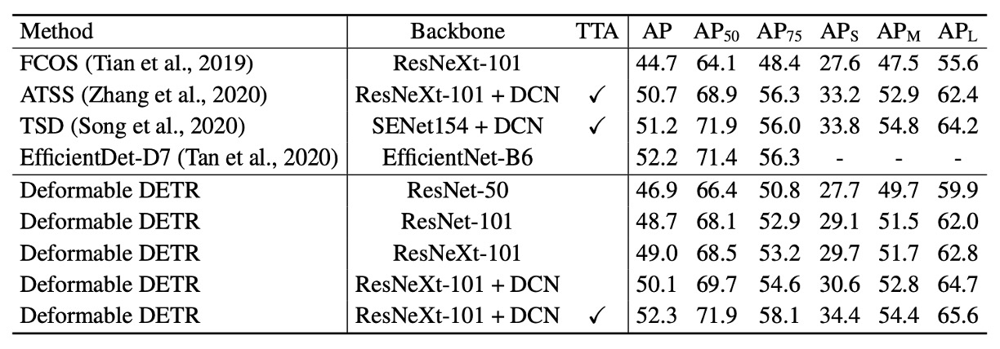

## 可変形な注意力メカニズム

[**Deformable DETR: Deformable Transformers for End-to-End Object Detection**](https://arxiv.org/abs/2010.04159)

---

DETR は研究者にとって非常に良い発展の余地を残しています。

- [**[20.05] DETR: クロスドメインのパイオニア**](../2005-detr/index.md)

DETR では、最も基本的な Transformer アーキテクチャを使用し、最も素朴な物体検出を行っています。その中で特別な工夫はなく、単純に画像を入力して物体の位置とクラスを得ることができます。

なんて素晴らしい論文でしょう！

これからの研究者たちは、このアイデアを基にモデルを改善すれば、論文は次々と出てくるのではないでしょうか？

## 問題の定義

現在の物体検出器と比べて、DETR は非常に遅いです。現在最も人気のある Faster-RCNN と比べると、推論速度は 2 倍遅く、見た目には大きな問題ではないように思えますが、問題は訓練の収束速度が 20 倍遅いことです！

元々 1 日で収束していた訓練が、今では 20 日かかるようになりました。これはどれほど恐ろしいことか！ 時間はどんどん過ぎていき、年を取っていきます。モデルが収束するのを待っている間に、髪の毛が白くなってしまいます。

これは許せません。改善しなければなりません。

## 解決策

著者は問題が Transformer の注意力メカニズムにあると考えました。画像に Transformer を使用する場合、すべてのピクセルが他のすべてのピクセルに対して注意を払うため、大部分の計算リソースが無駄に使われてしまいます。

したがって、元々の Transformer の注意力メカニズムは使用できず、代わりに「可変形の注意力メカニズム」として、可変形畳み込みの考え方を借用して注意力メカニズムを変更しました。

:::tip
この時点では ViT はまだ発表されていなかったため、操作はすべて各ピクセルを基にして行われており、画像のブロックごとに行われているわけではありません。
:::

### 可変形注意力

画像の特徴マップにおいて、各クエリエレメント（Query Element）について、著者は基準点として参照点を選び、その周辺の重要なサンプリングポイントで注意力操作を行います。これは従来の Transformer とは異なり、従来の方法では全ての空間の点に対して注意を計算します。

入力特徴マップが次のようになっていると仮定します：

$$
x
\in \mathbb{R}^{C \times H \times W}
$$

ここで、$C$はチャネル数、$H$と$W$は特徴マップの高さと幅を示します。

クエリエレメント$q$は内容特徴$z_q$と 2D 参照点$p_q$を含み、可変形注意力特徴の計算式は次のようになります：

$$
\text{DeformAttn}(z_q, p_q, x) = \sum_{m=1}^{M} W_m \sum_{k=1}^{K} A_{mqk} \cdot W_m^{\prime} x(p_q + \Delta p_{mqk})
$$

ここで：

- $M$は注意力ヘッド（Attention Head）の数。
- $K$は各クエリポイントに選択されるサンプリング点の数で、これらの点は参照点周辺の小さな領域から選ばれます。
- $A_{mqk}$は第$m$個の注意力ヘッドにおける第$k$個のサンプリング点の注意力重みで、範囲は$[0, 1]$であり、正規化条件を満たします：

  $$
  \sum_{k=1}^{K} A_{mqk} = 1
  $$

- $\Delta p_{mqk}$は第$m$個の注意力ヘッドにおける第$k$個のサンプリング点のオフセットで、これらのオフセットは任意の実数値です。
- $W_m$と$W_m^{\prime}$は学習可能な重み行列で、入力特徴を線形変換します。
- $x(p_q + \Delta p_{mqk})$は位置$p_q + \Delta p_{mqk}$における特徴値で、位置はスコア値（すなわち非整数点）であるため、バイリニア補間を使用して計算されます。

クエリ特徴$z_q$は線形投影操作を経て、$3mk$チャネルのテンソルを出力します：

- 最初の$2mk$チャネルは各サンプリング点のオフセット$\Delta p_{mqk}$をエンコードします。
- 残りの$mk$チャネルは softmax 操作を経て、対応する注意力重み$A_{mqk}$を計算します。

この設計により、オフセットと注意力重みは固定のルールに基づくのではなく、クエリエレメントの特徴から学習されることが保証されます。

### 多尺度計算

現代の物体検出フレームワークでは、物体検出を行うために多尺度特徴マップを使用することが一般的です。可変形注意力モジュールは、自然に多尺度バージョンに拡張でき、複数の特徴マップ層で同時にサンプリングと操作を行うことを可能にします。

入力される多尺度特徴マップを$\{x_l\}_{l=1}^L$と仮定し、各特徴マップ$x_l \in \mathbb{R}^{C \times H_l \times W_l}$であるとします。クエリエレメントの参照点は正規化座標$\hat{p}_q \in [0, 1]^2$で表現され、多尺度可変形注意力モジュールの計算式は次のように定義されます：

$$
\text{MSDeformAttn}(z_q, \hat{p}_q, \{x_l\}_{l=1}^L) =
$$

$$
\sum_{m=1}^{M} W_m \sum_{l=1}^{L} \sum_{k=1}^{K} A_{mlqk} \cdot W_m^{\prime} x_l(\phi_l(\hat{p}_q) + \Delta p_{mlqk})
$$

- $L$ は入力される特徴マップの層数を表します。
- $\phi_l(\hat{p}_q)$ はスケーリング関数で、正規化された座標を第$l$層の特徴マップ上の実際の座標に変換します。
- 他の記号の意味は単一スケールの場合と同様です。

### モデルアーキテクチャ

上の図のように、可変形注意力の問題を解決した後、元々の DETR アーキテクチャの Transformer モジュールを全て取り替えました。

これで、Deformable DETR が完成しました。

:::info
理論知識に興味がない場合は、公式の GitHub で実装を直接確認することができます。

- [**fundamentalvision/Deformable-DETR**](https://github.com/fundamentalvision/Deformable-DETR)

:::

### 訓練戦略

著者は**COCO 2017**データセットで実験を行いました。

まず、バックボーンには**ResNet-50**を使用し、**ImageNet**で事前学習を行いました。ネック部分では、FPN は使用せず、直接多尺度特徴マップから特徴を抽出しています。

可変形注意力の設定：

- 注意力ヘッドの数：**M = 8**
- 各クエリが選択するサンプリングポイントの数：**K = 4**

可変形トランスフォーマーエンコーダのパラメータは、異なる特徴層間で共有されています。

ハイパーパラメータと訓練戦略は主に DETR の設定に従っていますが、以下の点が異なります：

- バウンディングボックス分類には Focal Loss を使用し、損失重みは 2 に設定されています。
- 物体クエリの数を 100 から 300 に増加させました。

モデルは 50 エポックをデフォルトで訓練し、40 エポック目に学習率は元の 0.1 倍に減少します。訓練には Adam オプティマイザーを使用し、基本学習率は$2 \times 10^{-4}$、$\beta_1 = 0.9$、$\beta_2 = 0.999$、重み減衰は$10^{-4}$です。

予測物体クエリの参照点とサンプリングオフセットの線形投影の学習率は、0.1 のスケーリング係数を掛けています。

## 討論

### DETR との比較

上表に基づくと、Faster R-CNN + FPN と比較して、DETR は収束するためにより多くの訓練エポックが必要であり、特に小物体の検出性能が低いことがわかります。DETR と比較して、Deformable DETR は Faster R-CNN と同程度の訓練エポックで、特に小物体検出においてより良い性能を達成しています。

収束曲線の詳細は以下の通りです：

反復的なバウンディングボックス最適化と二段階メカニズムによって、この方法は検出精度をさらに向上させました。

Deformable DETR の FLOPs は Faster R-CNN + FPN と DETR-DC5 と同程度ですが、実行速度は DETR-DC5 よりも 1.6 倍速く、Faster R-CNN + FPN よりも 25％遅いです。

DETR-DC5 の速度が遅い理由は、Transformer の注意力メカニズムにおける大量のメモリアクセスが原因であり、Deformable Attention はこの問題を緩和できますが、無秩序なメモリアクセスの特性により、依然として従来の畳み込みアーキテクチャ（Faster R-CNN）よりも若干遅いです。

### 消融実験

上表は、可変形注意力モジュール内の異なる設計選択に関する消融実験の結果を示しています。

単一スケールの入力を多尺度入力に変更することで、検出精度が効果的に向上し、平均精度（AP）が 1.7%増加し、特に小物体検出（APS）では 2.9%向上しました。サンプリングポイント数$K$を増加させることで、さらに 0.9%の AP 向上が見られました。

多尺度の可変形注意力を使用すると、異なるスケールの層間で情報が交換され、さらに 1.5%の AP 向上が得られます。すでに層間特徴交換が使用されているため、FPN を追加しても性能は向上しません。多尺度注意力を使用せず、$K=1$のとき、可変形注意力モジュールは可変形畳み込みに退化し、精度が顕著に低下します。

### SoTA 比較

上表では、Deformable DETR は反復的なバウンディングボックス最適化と二段階メカニズムを使用しています。

ResNet-101 と ResNeXt-101 を使用した場合、この方法はそれぞれ 48.7 AP と 49.0 AP を達成し、追加の最適化技術は必要ありません。DCN を備えた ResNeXt-101 を使用すると、精度は 50.1 AP に向上します。

テスト時増強（test-time augmentations）を追加すると、52.3 AP に達しました。

:::info
TTA（Test-Time Augmentations）は、テスト時に画像を複数回強化し、その結果を平均する技術です。これにより、モデルの堅牢性が向上し、精度も向上します。
:::

## 結論

Deformable DETR は、従来の DETR と比較して訓練時間を大幅に短縮しました。特に小物体の検出において、DETR よりも顕著な優位性を示しました。

Deformable DETR は、可変形注意力を導入することで運用速度を改善しましたが、無秩序なメモリアクセス特性により、従来の畳み込みニューラルネットワーク（Faster R-CNN など）よりわずかに遅いです。そのため、即時性が求められるアプリケーションでは、速度が依然として考慮すべき問題となります。

Deformable DETR の設計は、より効率的で実用的なエンドツーエンドの物体検出器の変種を探る新たな方向性を開き、広範な研究と応用の可能性を秘めています。
