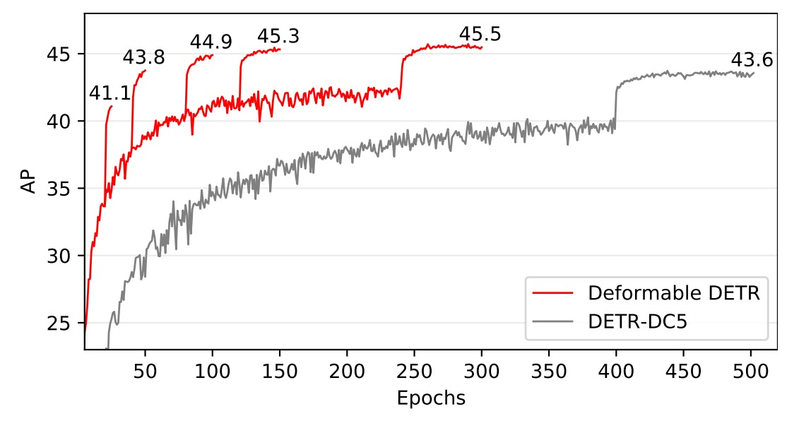

## 可変形な注意力メカニズム

[**Deformable DETR: Deformable Transformers for End-to-End Object Detection**](https://arxiv.org/abs/2010.04159)

---

DETR は研究者にとって非常に自由に発展させられる余地を残している。

それは最も基本的な Transformer 構造のみを用い、最も素朴な物体検出を行っている。中にはスコア向上のためのテクニックは特に使われておらず、ただ単純に画像を入力して物体の位置とクラスを得るだけだ。

なんと美しい論文だろう！

以降の研究者たちはこの考え方を基にモデルを改良すれば、論文が次々と量産されるだろう。

## 問題定義

現行の物体検出器と比べて、DETR はあまりにも遅い。

もし最も流行っている Faster-RCNN と比較すれば、推論速度は 2 倍遅い！

それがどうした？大した問題ではないように思える？

いいえ、問題は推論速度ではなく、訓練の収束速度が 20 倍遅いことだ！

本来 1 日で済む訓練が 20 日かかるとは、なんて恐ろしいことだろう。

時は流れ、若さは失われる。モデルが収束するまでに、髪は白くなってしまう。

これは許されない、必ず改善しなければならない。

## 問題解決

著者は問題の原因を Transformer の注意機構にあると考えた。

画像に Transformer を使う場合、各ピクセルが他のすべてのピクセルに対して注意を払う必要があり、大部分の計算リソースが無駄に消費されている。

したがって、ここで従来の Transformer 注意機構は使えず、「変形可能な畳み込み（Deformable Convolution）」の発想を借りて、元の注意機構を「変形可能な注意機構」に改良した。

:::tip
この時点で ViT はまだ発表されていなかったため、処理は各ピクセル単位で行われており、画像パッチ単位ではなかった。
:::

### 変形可能注意機構

<div align="center">
<figure style={{ "width": "80%"}}>

</figure>
</div>

画像の特徴マップにおいて、各クエリ要素（Query Element）に対し、従来の Transformer と異なり、著者は基準となる参照点を選び、その周囲の重要なサンプリング点で注意操作を行う。

入力特徴マップを次のように仮定する：

$$
x
\in \mathbb{R}^{C \times H \times W}
$$

ここで、$C$はチャネル数、$H$と$W$は特徴マップの高さと幅を表す。

クエリ要素$q$は、内容特徴$z_q$と 2 次元の参照点$p_q$を含み、変形可能注意特徴の計算式は以下の通り：

$$
\text{DeformAttn}(z_q, p_q, x) = \sum_{m=1}^{M} W_m \sum_{k=1}^{K} A_{mqk} \cdot W_m^{\prime} x(p_q + \Delta p_{mqk})
$$

ここで：

- $M$は注意ヘッドの数。
- $K$は各クエリ点が選択するサンプリング点の数で、これらの点は参照点の近傍の小領域から選ばれる。
- $A_{mqk}$は第$m$注意ヘッドにおける第$k$サンプリング点の注意重みで、$\[0,1]$の範囲を取る。
- $\Delta p_{mqk}$は第$m$注意ヘッドにおける第$k$サンプリング点のオフセットで、任意の実数値となり得る。
- $W_m$と$W_m^{\prime}$は学習可能な重み行列で、入力特徴を線形変換する役割を持つ。
- $x(p_q + \Delta p_{mqk})$は位置$p_q + \Delta p_{mqk}$での特徴値を表し、その位置は実数座標（整数点でない）であるため、双線形補間で計算される。

クエリ特徴$z_q$は線形射影を経て、$3mk$チャネルのテンソルを出力する：

- 最初の$2mk$チャネルは各サンプリング点のオフセット$\Delta p_{mqk}$をエンコード。
- 残りの$mk$チャネルは softmax 操作により対応する注意重み$A_{mqk}$を計算。

この設計により、「オフセット」と「注意重み」はいずれもクエリ要素の特徴から学習されるものであり、固定ルールに基づくものではない。

### マルチスケール計算

現代の物体検出フレームワークは通常、マルチスケールの特徴マップを使って物体検出を行う。

変形可能注意モジュールも当然マルチスケールをサポートし、複数の特徴マップ層で同時にサンプリングと操作を行える。

入力のマルチスケール特徴マップを${x_l}_{l=1}^L$とし、各特徴マップ$x_l \in \mathbb{R}^{C \times H_l \times W_l}$とする。

クエリ要素の参照点は正規化座標$\hat{p}_q \in \[0,1]^2$で表され、多尺度の計算式は：

$$
\text{MSDeformAttn}(z_q, \hat{p}_q, \{x_l\}_{l=1}^L) =
$$

$$
\sum_{m=1}^{M} W_m \sum_{l=1}^{L} \sum_{k=1}^{K} A_{mlqk} \cdot W_m^{\prime} x_l(\phi_l(\hat{p}_q) + \Delta p_{mlqk})
$$

- $L$は入力特徴マップの層数。
- $\phi_l(\hat{p}_q)$は正規化座標を$l$層の特徴マップの実座標に変換するスケーリング関数。
- その他の記号は単一スケールの場合と同様。

### モデル構造

<div align="center">
<figure style={{ "width": "80%"}}>

</figure>
</div>

上図のように、変形可能注意問題を解決した後、元の DETR の Transformer モジュールを全て置き換えたことで、Deformable DETR が得られる。

:::info
理論的な知識に興味がない場合は、公式の Github で実装を直接入手できる。

- [**fundamentalvision/Deformable-DETR**](https://github.com/fundamentalvision/Deformable-DETR)
  :::

### コード解析

作者の実装を単独で見てみましょう。MSDeformAttn と一般的な Attention の違いは何か：

```python
class MSDeformAttn(nn.Module):

    def __init__(self, d_model=256, n_levels=4, n_heads=8, n_points=4):
        """
        Multi-Scale Deformable Attention Module
        :param d_model      隠れ次元数
        :param n_levels     特徴レベル数
        :param n_heads      アテンションヘッド数
        :param n_points     各ヘッド・各レベルでのサンプリング点数
        """
        super().__init__()
        if d_model % n_heads != 0:
            raise ValueError('d_modelはn_headsで割り切れる必要がありますが、{}と{}が与えられました'.format(d_model, n_heads))
        _d_per_head = d_model // n_heads
        # CUDA実装の効率化のため、_d_per_headは2のべき乗が望ましい
        if not _is_power_of_2(_d_per_head):
            warnings.warn("MSDeformAttnでは各Attentionヘッドの次元を2のべき乗に設定することを推奨します。")

        self.im2col_step = 64

        self.d_model = d_model
        self.n_levels = n_levels
        self.n_heads = n_heads
        self.n_points = n_points

        self.sampling_offsets = nn.Linear(d_model, n_heads * n_levels * n_points * 2)
        self.attention_weights = nn.Linear(d_model, n_heads * n_levels * n_points)
        self.value_proj = nn.Linear(d_model, d_model)
        self.output_proj = nn.Linear(d_model, d_model)

        self._reset_parameters()

    def _reset_parameters(self):
        constant_(self.sampling_offsets.weight.data, 0.)
        thetas = torch.arange(self.n_heads, dtype=torch.float32) * (2.0 * math.pi / self.n_heads)
        grid_init = torch.stack([thetas.cos(), thetas.sin()], -1)
        grid_init = (grid_init / grid_init.abs().max(-1, keepdim=True)[0]).view(self.n_heads, 1, 1, 2).repeat(1, self.n_levels, self.n_points, 1)
        for i in range(self.n_points):
            grid_init[:, :, i, :] *= i + 1
        with torch.no_grad():
            self.sampling_offsets.bias = nn.Parameter(grid_init.view(-1))
        constant_(self.attention_weights.weight.data, 0.)
        constant_(self.attention_weights.bias.data, 0.)
        xavier_uniform_(self.value_proj.weight.data)
        constant_(self.value_proj.bias.data, 0.)
        xavier_uniform_(self.output_proj.weight.data)
        constant_(self.output_proj.bias.data, 0.)

    def forward(self, query, reference_points, input_flatten, input_spatial_shapes, input_level_start_index, input_padding_mask=None):
        """
        :param query                       (N, Length_{query}, C)
        :param reference_points            (N, Length_{query}, n_levels, 2), 範囲は[0,1]、左上が(0,0)、右下が(1,1)、パディング領域含む
                                        または (N, Length_{query}, n_levels, 4)、追加で(w, h)を含む参照ボックス
        :param input_flatten               (N, \sum_{l=0}^{L-1} H_l \cdot W_l, C)
        :param input_spatial_shapes        (n_levels, 2), [(H_0, W_0), (H_1, W_1), ..., (H_{L-1}, W_{L-1})]
        :param input_level_start_index     (n_levels, ), [0, H_0*W_0, H_0*W_0+H_1*W_1, ...]
        :param input_padding_mask          (N, \sum_{l=0}^{L-1} H_l \cdot W_l), パディング要素はTrue、非パディングはFalse

        :return output                     (N, Length_{query}, C)
        """
        N, Len_q, _ = query.shape
        N, Len_in, _ = input_flatten.shape
        assert (input_spatial_shapes[:, 0] * input_spatial_shapes[:, 1]).sum() == Len_in

        value = self.value_proj(input_flatten)
        if input_padding_mask is not None:
            value = value.masked_fill(input_padding_mask[..., None], float(0))
        value = value.view(N, Len_in, self.n_heads, self.d_model // self.n_heads)
        sampling_offsets = self.sampling_offsets(query).view(N, Len_q, self.n_heads, self.n_levels, self.n_points, 2)
        attention_weights = self.attention_weights(query).view(N, Len_q, self.n_heads, self.n_levels * self.n_points)
        attention_weights = F.softmax(attention_weights, -1).view(N, Len_q, self.n_heads, self.n_levels, self.n_points)
        # N, Len_q, n_heads, n_levels, n_points, 2
        if reference_points.shape[-1] == 2:
            offset_normalizer = torch.stack([input_spatial_shapes[..., 1], input_spatial_shapes[..., 0]], -1)
            sampling_locations = reference_points[:, :, None, :, None, :] \
                                 + sampling_offsets / offset_normalizer[None, None, None, :, None, :]
        elif reference_points.shape[-1] == 4:
            sampling_locations = reference_points[:, :, None, :, None, :2] \
                                 + sampling_offsets / self.n_points * reference_points[:, :, None, :, None, 2:] * 0.5
        else:
            raise ValueError(
                'reference_pointsの最後の次元は2か4である必要がありますが、{}が与えられました。'.format(reference_points.shape[-1]))
        output = MSDeformAttnFunction.apply(
            value, input_spatial_shapes, input_level_start_index, sampling_locations, attention_weights, self.im2col_step)
        output = self.output_proj(output)
        return output
```

構造的に見ると、従来の Attention モジュールは単一の特徴マップを扱うが、ここでは複数レベル（異なる解像度）の特徴をサポートしている。例えば ResNet の FPN からの複数のステージを一つの大きな`input_flatten`に展開し、`input_spatial_shapes`や`input_level_start_index`で各レベルのサイズや位置を示している。

- **各 Query ごとにオフセットを学習**

  ```python
  self.sampling_offsets = nn.Linear(d_model, n_heads * n_levels * n_points * 2)
  ```

  これは各 Query に対して複数のオフセット(dx, dy)を出力し、参照点からどの方向・距離を「見る」かを示す。これらのオフセットは学習によって得られ、事前に決められた固定格子ではない。

  ***

- **Reference Points が「基準位置」を決める**

  ```python
  if reference_points.shape[-1] == 2:
      ...
  elif reference_points.shape[-1] == 4:
      ...
  ```

  注意はもはや Query が画像全体を見るのではなく、指定された`reference_points`を中心にその周囲数点を「局所的に重み付け」している。これらの reference points は Decoder の Query 由来や Encoder の特徴グリッド座標由来である。

  ***

以上が主な違いで、その他は従来の Attention とほぼ変わらない。

### トレーニング戦略

著者は **COCO 2017** データセットで実験を行った。

まずバックボーンに **ResNet-50** を使用し、**ImageNet** で事前学習済み。ネック部分はマルチスケール特徴マップから直接特徴を抽出し、FPN は使っていない。

変形可能注意機構の設定：

- 注意ヘッド数：**M = 8**
- 各クエリが選択するサンプリング点数：**K = 4**

変形可能トランスフォーマーのエンコーダー内のパラメータは異なる特徴層間で共有されている。

ハイパーパラメータとトレーニング戦略は主に DETR の設定に準じているが、以下の点が異なる：

- バウンディングボックス分類に Focal Loss を採用し、損失重みは 2 に設定。
- オブジェクトクエリ数を 100 から 300 に増加。

モデルは 50 エポックで訓練され、40 エポック時に学習率を 0.1 倍に減衰させる。Adam オプティマイザを用い、基本学習率は $2 \times 10^{-4}$、$\beta_1=0.9$、$\beta_2=0.999$、重み減衰は $10^{-4}$。

オブジェクトクエリの参照点とサンプリングオフセットの線形射影の学習率は 0.1 倍のスケールをかけている。

## 議論

### DETR との比較

<div align="center">
<figure style={{ "width": "90%"}}>

</figure>
</div>

上表より、Faster R-CNN + FPN と比べると DETR はより多くのエポックが必要で収束が遅く、小物体検出性能が低い。一方、Deformable DETR は Faster R-CNN とほぼ同等のエポック数で学習可能で、特に小物体検出において優れた性能を示す。

収束曲線の詳細は以下の図を参照：

<div align="center">
<figure style={{ "width": "90%"}}>

</figure>
</div>

反復的なバウンディングボックス最適化と二段階機構により、検出精度がさらに向上している。

Deformable DETR の FLOPs は Faster R-CNN + FPN および DETR-DC5 とほぼ同等だが、動作速度は DETR-DC5 より 1.6 倍高速で、Faster R-CNN + FPN より 25%遅いのみである。

DETR-DC5 が遅い主因は Transformer 注意機構における大量のメモリアクセスであり、Deformable Attention はこの問題を軽減するが、メモリアクセスが非連続的になるため、伝統的な畳み込みよりやや遅い。

### アブレーション実験

<div align="center">
<figure style={{ "width": "90%"}}>

</figure>
</div>

上表は変形注意機構における各種設計選択肢のアブレーション研究。

マルチスケール入力を用いることで、単一スケール入力に比べ平均精度（AP）が 1.7%向上し、特に小物体検出（APS）は 2.9%改善。サンプリング点数$K$の増加でさらに 0.9%の AP 向上が見られる。

マルチスケール変形注意を用いることで異なるスケール間で情報交換が可能となり、追加で 1.5%の AP 向上が得られる。既に層間特徴交換があるため、FPN を導入しても性能向上は見られない。マルチスケール注意を用いず$K=1$の場合、変形注意は変形畳み込みに退化し、精度は大幅に低下する。

### SoTA との比較

<div align="center">
<figure style={{ "width": "90%"}}>

</figure>
</div>

上表の Deformable DETR はすべて反復バウンディングボックス最適化と二段階機構を利用。

ResNet-101 および ResNeXt-101 使用時、48.7 AP と 49.0 AP を達成し、追加の最適化技術は不要。DCN 付き ResNeXt-101 使用時は 50.1 AP に向上。

テスト時増強（TTA）を加えると、52.3 AP を達成。

:::info
TTA（Test-Time Augmentation）はテスト時に画像を複数回強化し、複数の予測結果を平均化する技術であり、モデルの頑健性と精度を向上させる。
:::

## 結論

Deformable DETR は従来の DETR に比べ、トレーニング時間を大幅に短縮。小物体検出性能で明確な優位を示す。

変形注意機構を導入し速度向上を図ったが、非連続的なメモリアクセスにより伝統的な畳み込みネット（Faster R-CNN 等）よりやや遅い。そのため即時性が求められる用途では速度面の課題が残る。

Deformable DETR の設計は、より効率的かつ実用的なエンドツーエンド物体検出器の探求に新たな方向性を示し、広範な研究・応用の可能性を持つ。
