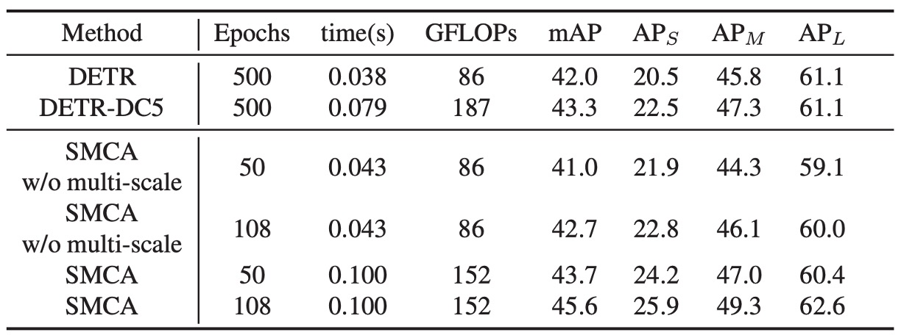

## ガウスを加えよう！

[**Fast Convergence of DETR with Spatially Modulated Co-Attention**](https://arxiv.org/abs/2101.07448)

---

DETR の議論を続けます。

DETR が行っていることは、読者の皆さんもすでに非常に馴染み深いものだと思います。

## 問題の定義

著者は DETR を読んだ後、前の Deformable DETR と同じようなため息をつきました：

- **DETR の収束速度が遅すぎる。**

問題の根源は、DETR のクロスアテンションメカニズムが予測されるバウンディングボックスを考慮していないため、各物体クエリに対して適切なアテンションマップを生成するために何度も反復しなければならないことです。

この考え方に基づけば、クロスアテンションメカニズムを改善することで、DETR の収束速度を向上させることができるかもしれません。

:::tip
Deformable DETR では、最下層のアテンション操作方法が変更されました。

そしてこの論文では、クロスアテンションメカニズムに先験的な知識を追加しています。
:::

## 解決策

### 空間調整共注意力（SMCA）

空間調整共注意力（Spatially Modulated Co-Attention, SMCA）の核心思想は：

**学習可能なクロスアテンションマップと手作業で設計されたクエリ空間の先験的情報を組み合わせること。**

SMCA は、各物体クエリに対応するバウンディングボックスの初期中心と比率を動的に予測し、2D 空間的なガウスに似た重みマップを生成します。重みマップは、物体クエリと画像特徴の共注意特徴マップとの要素ごとの積として掛け算され、視覚的特徴マップからクエリに関連する情報をより効果的に集約します。

:::tip
簡単に言えば、元々の DETR は先験的な知識がなく、収束が遅かったのです。

それならば、少し先験的な知識を与えてあげることで、収束を速くできるのです。
:::

### 初期予測

各物体クエリは、まずその責任物体の中心と比率を動的に予測します。物体クエリ$O_q$の予測中心とスケールはそれぞれ次のように表されます：

$$
c^{\text{norm}}_h, c^{\text{norm}}_w = \text{sigmoid(MLP}(O_q)),
$$

$$
s_h, s_w = \text{FC}(O_q)
$$

ここで、2 層の MLP と sigmoid 関数を通して、物体クエリ$O_q$が$[0, 1] \times [0, 1]$の範囲内で正規化された中心予測を行い、その後逆操作を経て画像内の実際の中心座標を得ます。

物体クエリ$O_q$は、物体の幅と高さの比率も予測し、これを基に 2D ガウス分布の重みマップを生成します。そして、クロスアテンションマップを再調整して、物体予測位置の近くにある特徴に重みを付けて、より効果的に特徴を集約します。

### ガウス重みマップ

物体の中心$c_w, c_h$とスケール$s_w, s_h$を予測した後、SMCA は 2D ガウス重みマップ$G$を生成します。数式は次のように表されます：

$$
G(i, j) = \exp \left( - \frac{(i - c_w)^2}{\beta s_w^2} - \frac{(j - c_h)^2}{\beta s_h^2} \right)
$$

ここで$(i, j) \in [0, W] \times [0, H]$は空間インデックスで、$\beta$はガウス分布の幅を調整するためのハイパーパラメータです。

$G$は中心に近い空間位置に高い重みを与え、中心から遠い位置には低い重みを与えます。

生成された空間先験情報$G$を使用して、SMCA はクロスアテンションマップ$C_i$を調整します。点積アテンションによって生成された各クロスアテンションマップ$C_i$は、次のように調整されます：

$$
C_i = \text{softmax} \left( \frac{K_i^T Q_i}{\sqrt{d}} + \log G \right) V_i
$$

ここで、SMCA は空間重みマップ$G$の対数を点積クロスアテンションに加算し、すべての空間位置に対して softmax 正規化を行います。これにより、予測されたバウンディングボックス周辺の領域に対する重みが強調され、クロスアテンションの空間的な探索範囲が制限され、モデルの収束速度が速くなります。

:::tip
元々のアテンションメカニズムに比べて、ここでは$log G$という項が追加されているだけです。
:::

### 多頭 SMCA

SMCA の多頭調整バージョンでは、異なるクロスアテンションヘッドがそれぞれの空間重みマップに基づいて特定の特徴調整を行います。

各アテンションヘッドは、共有された中心位置$[c_w, c_h]$から始まり、ヘッド特有のオフセット$[\Delta c_{w,i}, \Delta c_{h,i}]$とヘッド特有のスケール$s_{w,i}, s_{h,i}$を予測します。

これにより、ヘッド特有の中心$[c_w + \Delta c_{w,i}, c_h + \Delta c_{h,i}]$とスケールを基にガウス分布の空間重みマップ$G_i$を生成します。

多頭クロスアテンション特徴マップは次のように表されます：

$$
C_i = \text{softmax} \left( \frac{K_i^T Q_i}{\sqrt{d}} + \log G_i \right) V_i
$$

物体検出性能を向上させるために、SMCA は多尺度特徴を統合します。CNN は多尺度の視覚特徴$f_{16}, f_{32}, f_{64}$を抽出し、それぞれのダウンサンプリングレートは 16、32、64 です。計算コストを削減するために、これらの特徴は CNN バックボーンネットワークから直接抽出され、**Feature Pyramid Network (FPN)**は使用されません。

最適なスケールを自動的に選択するために、各物体クエリはスケール選択アテンション重みを生成します：

$$
\alpha_{16}, \alpha_{32}, \alpha_{64} = \text{Softmax}(\text{FC}(O_q))
$$

異なるスケールのクロスアテンション計算の数式は次のようになります：

$$
C_{i,j} = \text{Softmax} \left( \frac{K_{i,j}^T Q_i}{\sqrt{d}} + \log G_i \right) V_{i,j} \odot \alpha_j
$$

$$
C_i = \sum_j C_{i,j}, \quad j \in \{16, 32, 64\}
$$

この仕組みにより、各物体クエリは動的に最も関連性の高いスケールを選択し、無関係なスケール特徴を抑制します。

クロスアテンション計算後、更新された物体クエリ特徴$D \in \mathbb{R}^{N \times C}$がバウンディングボックスと分類スコアの予測に使用されます：

$$
\text{Box} = \text{Sigmoid}(\text{MLP}(D))
$$

$$
\text{Score} = \text{FC}(D)
$$

バウンディングボックス予測は、初期の空間先験情報と組み合わせて、予測された中心位置をさらに調整します：

$$
\text{Box}[:2] = \text{Box}[:2] + [d c_{\text{norm}_h}, c_{\text{norm}_w}]
$$

これにより、バウンディングボックス予測は SMCA で強調されたクロスアテンション領域と密接に関連します。

### 訓練戦略

1. **データセット：**

   - 実験では COCO 2017 データセットを使用して検証を行いました。訓練セットは 118,000 枚の画像、検証セットは 5,000 枚の画像を含んでおり、性能評価には mAP（Mean Average Precision）を使用しています。これは以前の研究と一致します。

2. **実験実装の詳細：**

   - 実験は元の DETR 設定に従っています。特徴抽出には ResNet-50 を使用し、SMCA-R50 としてラベル付けされています。
   - DETR とは異なり、SMCA は 300 個の物体クエリを使用（100 個ではなく）、元の交差エントロピー分類損失を focal loss に置き換え、前景と背景分類における正負サンプルの不均衡を解決しています。focal loss の初期確率は 0.01 に設定され、訓練過程の安定化に役立ちます。

3. **訓練設定：**

   - モデルは 50 エポックで訓練され、40 エポック目に学習率は元の 1/10 に減少します。
   - Transformer エンコーダの初期学習率は$10^{-4}$、事前訓練された ResNet バックボーンの学習率は$10^{-5}$に設定され、AdamW オプティマイザーを使用して最適化されます。
   - 多尺度特徴エンコーディングのデフォルトのダウンサンプリング率は 16、32、64 です。

4. **損失関数とマッチング：**

   - 双方向マッチング過程での分類損失、L1 距離損失、GIoU 損失の係数はそれぞれ 2、5、2 に設定されています。
   - 双方向マッチング後、モデルは分類損失、バウンディングボックス L1 損失、GIoU 損失を最小化して訓練され、損失の係数は前述の通りです。

5. **その他の実験の詳細：**
   - Transformer 層は post-norm 設定を使用しており、以前の研究と一致します。
   - データ増強プロセスではランダムクロッピングを使用し、クロップ後の最大幅または高さは 1333 に設定されています。
   - すべてのモデルは 8 台の V100 GPU で訓練され、各 GPU は 1 枚の画像を担当します。

## 討論

### DETR との比較

<figure style={{ "width": "60%"}}>

</figure>

SMCA は DETR と同じアーキテクチャを共有していますが、デコーダに新しい共注意力調整メカニズムが導入され、空間調整先験情報を生成するための追加の線形ネットワークが加わっています。SMCA の計算コストは、各エポックの訓練時間の増加は非常に少なく、効率的です。

単一スケール特徴を使用する場合、SMCA の自己注意の次元は 256 に設定され、前方ネットワーク（FFN）の中間次元は 2048 です。多尺度特徴を使用する場合、FFN の中間次元は 1024 に設定され、エンコーダでは 5 層の内部尺度と多尺度自己注意層を使用して、DETR と類似のパラメータ数を維持し、公平な比較を行っています。

表に示されたように、「SMCA w/o multi-scale」での 50 エポックの訓練では、単一スケール特徴での mAP は 41.0 であり、多尺度特徴を使用した場合の mAP は 43.7 です。訓練時間を延長すると、単一スケール特徴の SMCA の mAP は 41.0 から 42.7 に、多尺度特徴の SMCA は 43.7 から 45.6 に改善されました。

SMCA の収束速度は、DETR に基づく方法より 10 倍速く、SMCA はより薄い Transformer 層と、拡張のない ResNet バックボーンネットワークで畳み込み操作を使用し、元の拡張畳み込み DETR モデルと同等の効率を発揮します。

### 消融実験

著者は、SMCA の各コンポーネントの重要性を検証するために、さまざまな消融実験を実施しました。

### Head-shared SMCA

<figure style={{ "width": "60%"}}>

</figure>

著者は基線 DETR にヘッド共有の空間調整メカニズムを追加し、学習率、訓練計画、自己注意パラメータなどは基線モデルと同じに保ちました。

結果として、この方法により mAP は 34.8 から 40.2 に向上し、SMCA の有効性が証明されました。これにより、DETR の収束速度が速くなるだけでなく、性能も大幅に向上しました。また、異なるバッチサイズでのテスト結果は、SMCA がバッチサイズに対して敏感ではないことを示しています。

空間調整を行うための多頭機構を使用し、Transformer の各ヘッドを異なる空間重みマップに調整しました。すべてのヘッドは同じ物体中心から始まり、共通の中心に対するオフセットとヘッド固有のスケールを予測します。結果として、多頭空間調整での mAP は 41.0 に達し、ヘッド共有の調整よりもさらに改善されました（40.2 から 41.0 に向上）。

また、固定スケール、高さと幅の共有または独立した予測による空間重みマップもテストされました。ガウス分布スケールを固定した場合（1 に固定）は、mAP は 38.5 となり（基線から 3.7 向上）、物体中心予測の空間調整における役割が確認されました。

### Multi-head SMCA

<figure style={{ "width": "60%"}}>

</figure>

エンコーダに多尺度特徴エンコーディングを導入し、2 層の内部尺度自己注意、1 層の多尺度自己注意、およびさらに 2 層の内部尺度自己注意（「SMCA (2Intra-Multi-2Intra)」としてラベル付け）を使用しました。この設計により、性能は 41.0 から 43.7 に向上しました。もし SSA を除外すると、性能は 42.6 に低下しました。

2Intra-Multi-2Intra 設計を単純に 5 層の内部尺度自己注意層でスタックした場合、性能は 43.3 に低下し、これはスケール間の情報交換が不足しているためです。5 層の内部尺度自己注意エンコーダは 3 層よりも優れていましたが、3 層の多尺度自己注意エンコーダを使用したモデルの方が性能が良好でした。

著者は最終的に 2Intra-Multi-2Intra の組み合わせ設計を選択し、この設計は少ないパラメータで 43.7 の mAP を達成し、Transformer と FFN の重みを共有することでモデルの汎化能力をさらに強化しました。

### 他の SoTA アーキテクチャとの比較

上表では、著者が SMCA と他の物体検出フレームワークとの性能を COCO 2017 検証セットで比較しています。

1. **DETR との比較：**

   - DETR はエンドツーエンドの Transformer を使用して物体検出を行い、DETR-R50 と DETR-DC5-R50 はそれぞれ ResNet-50 と拡張 ResNet-50 を基にした DETR バージョンです。DETR と比較して、SMCA は小、中、大物体の検出性能において、より速い収束速度とより良い性能を示しました。

2. **Faster R-CNN との比較：**

   - Faster R-CNN は FPN（特徴ピラミッドネットワーク）を組み合わせた二段階の物体検出方法です。109 エポックの訓練後、SMCA の mAP（45.6）は Faster R-CNN-FPN-R50（42.0）を超えました。
   - Faster R-CNN は小物体検出に強みがあります（小物体 mAP は 26.6 対 SMCA の 25.9）が、SMCA は大物体の位置決定において強力です（大物体 mAP は 62.6 対 53.4）。これは SMCA の多尺度自己注意機構がすべてのスケールと位置間で情報を伝播できるためです。

3. **Deformable DETR との比較：**

   - Deformable DETR は元々の DETR の自己注意を局所的な可変形注意力に置き換え、エンコーダとデコーダに使用しました。これにより、Deformable DETR は元の DETR より収束速度が速いですが、大物体の検出性能は若干低下しました。
   - Deformable DETR の大物体 mAP は DETR の 61.1 から 58.0 に低下しました。対照的に、SMCA は空間調整共注意力を使用して、共注意力を動的に物体位置近くで検索させ、収束速度を加速し、大物体の検出性能を向上させました（SMCA の大物体 mAP は 60.4、Deformable DETR は 59.0）。
   - SMCA は 50 エポックでの mAP（43.7）が Deformable DETR（43.8）とほぼ同じですが、SMCA は大物体の検出に強く、Deformable DETR は小物体検出に優れています。

4. **UP-DETR との比較：**

   - UP-DETR は未監視学習を使用して DETR の収束速度を加速しました。SMCA は UP-DETR よりも収束速度と性能が優れており、108 エポックで SMCA の mAP は 45.6、UP-DETR は 300 エポックで 42.8 の mAP です。

5. **TSP-FCOS および TSP-RCNN との比較：**

   - TSP-FCOS と TSP-RCNN は DETR のハンガリアンマッチング方法と FCOS および RCNN 検出器を組み合わせ、DETR よりも速い収束速度と良い性能を持っています。
   - Deformable DETR や Faster R-CNN-FPN と同様に、TSP-FCOS と TSP-RCNN は小物体の検出に強みがありますが、大物体の検出では若干劣ります。
   - 短期間の訓練（38 エポック）では、SMCA-R50 の mAP（43.7）は TSP-RCNN（43.8）とほぼ同じで、TSP-FCOS（43.1）より優れています。長期間訓練した場合、SMCA は 108 エポックで 45.6 の mAP を達成し、TSP-RCNN の 96 エポックの 45.0 を超えました。

6. **ResNet-101 バックボーンの比較：**
   - ResNet-50 を ResNet-101 バックボーンに変更すると、性能の向上傾向は ResNet-50 の使用時と類似しています。

## 結論

この論文では、著者が空間調整共注意力（SMCA）メカニズムを DETR フレームワークに組み込み、顕著な性能向上を達成したことを示しています。

元々 500 エポックかかっていた訓練プロセスが 108 エポックに短縮され、mAP は 43.4 から 45.6 に向上しました。これは、SMCA が推論コストを低く抑えつつ、検出精度を向上させることができることを示しています。全体的な特徴情報を探索することによって、SMCA は物体検出において効率と性能の向上の可能性を示しました。

今後も DETR を改良する研究が続きそうですので、引き続き注目していきましょう。
