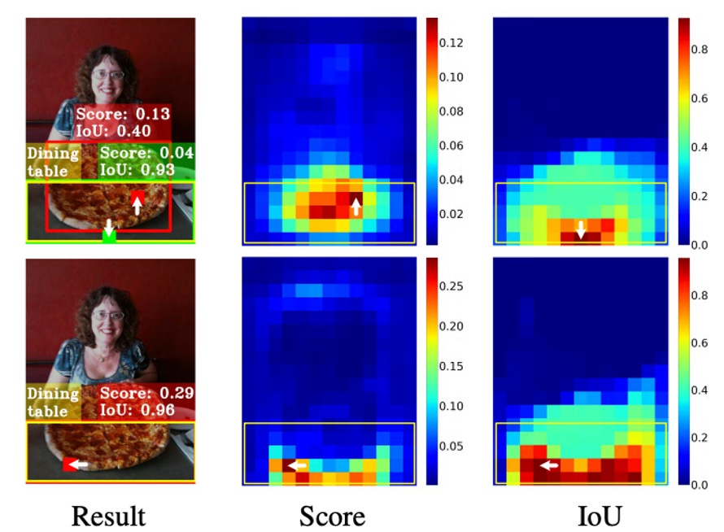
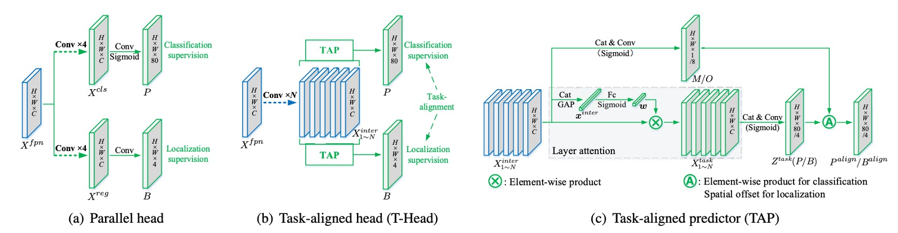
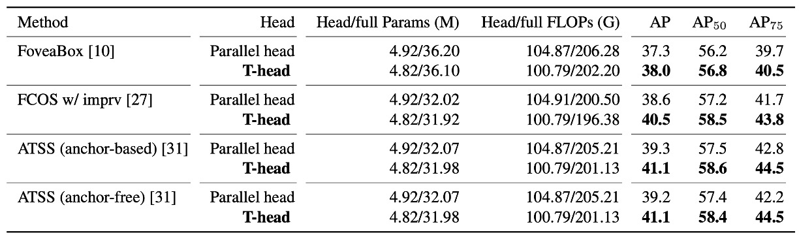
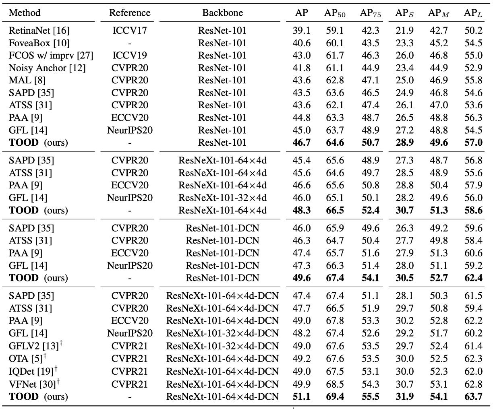
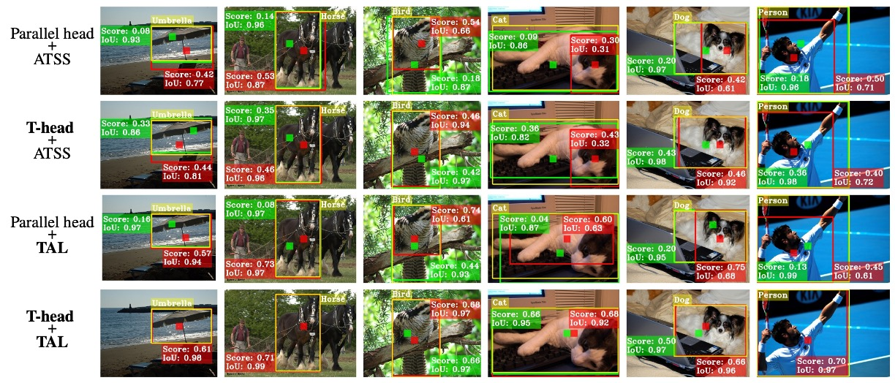

## 錯位の終焉

[**TOOD: Task-aligned One-stage Object Detection**](https://arxiv.org/abs/2108.07755)

---

ATSS の考え方を引き継ぎ、さらにその後の研究を探っていきます。

:::tip
もし ATSS をまだ見ていない場合は、以前のノートを参考にしてください：

- [**[19.12] ATSS: アンカーの死**](../1912-atss/index.md)
  :::

## 問題の定義

物体検出とは何か？多くの人はすぐに答えられるでしょう。

これは二つのサブタスクに分かれています：

- **分類 (Classification)**：物体の最も識別しやすい部分を見つけ、「これは何か」に答える。
- **位置特定 (Localization)**：物体の全体的な境界を正確に描き、「どこにあるか」に答える。

問題は、この二つのタスクは本質的に矛盾を抱えていることです。分類は局所的な顕著な特徴を重視し、位置特定は全体的な輪郭が必要です。モデルが両方を同時に最適化しようとすると、学習される特徴の分布が一致せず、予測時に「言いたいことが食い違う」ことがよくあります。

近年のワンステージ検出器（one-stage detectors）は、「中心仮説」を用いて両者を統一しようとしています。

- **FCOS、ATSS**：centerness ブランチを通じて、中心付近のアンカーのスコアを高め、位置損失の重みも大きくする。
- **FoveaBox**：中心領域自体を正例と定義する。

これらの設計によって確かに精度は向上しましたが、二つの核心的な懸念が残されています：

1. **タスクの独立性**：

   現在の多くの手法は「二重ブランチ構造」を維持しています：一つは分類、もう一つは位置特定を担当。

   その結果、二つのタスク間のやりとりが不足し、次のような状況が発生します：

   - 分類ブランチは「これはテーブルだ！」と言う。
   - 位置特定ブランチは実はピザをより正確に囲む。

   どちらも個別には正しいが、組み合わせると間違っている。

2. **サンプル割り当ての失敗**：

   従来のアンカーベース手法は IoU 閾値で正負サンプルを決め、アンカーフリー手法は幾何学的ルール（中心領域など）によります。

   これらの戦略はいずれも、次の前提を暗に含んでいます：

   > **分類と位置特定は同じサンプル群を共有できる。**

   しかし実際には、分類に最適な点と位置特定に最適な点はしばしば重なりません。

   以下の図を例にします：

   

   <figure style={{ "width": "70%"}}>
   
   </figure>
   

   最適な位置特定ボックス（緑のパッチ）は物体の中心にはなく、最終的に分類スコアの高いがボックス精度の低いアンカー（赤いパッチ）に負けて、NMS 処理で排除されてしまいます。

つまり、**分類と位置特定という二つのタスクは、学習の方向性が異なるだけでなく、「依拠すべきサンプル」も異なっているのです。**

こう考えざるを得ません：

- 両者が本質的に一致しないのであれば、本当に協調させることは可能なのか？
- 同じアンカーで「最も正確なスコア」と「最も正確なボックス」を同時に得ることはできるのか？

それとも、私たちの設計は、根本から間違っていたのでしょうか？

## 問題解決

<figure style={{ "width": "70%"}}>

</figure>

TOOD のアーキテクチャは、著者が提供した図に沿って説明します。

従来手法では、FPN の出力後に直接二つのブランチに分け、それぞれが分類と位置特定を予測していました。その結果、スコアは高いがボックスがずれている予測や、ボックスは正確だがスコアが低く NMS で消される予測がよく生じていました。

ここで著者の発想はとてもシンプルです：**予測段階でこの二つのブランチを明示的に「アライメント（整合）」させること**です。

### タスク間インタラクション特徴

<figure style={{ "width": "90%"}}>

</figure>

FPN の特徴を $X^{fpn}\in\mathbb{R}^{H\times W\times C}$ とします。

TOOD では最初からブランチ分岐せず、まず「**共有バックボーン**」で特徴表現を変換します。

連続して $N$ 層の畳み込み（各層の後に ReLU）を重ね、マルチスケールな**タスク間インタラクション特徴** ${X^{inter}*k}*{k=1}^N$ を得ます：

$$
X^{inter}_k=
\begin{cases}
\delta\!\big(\mathrm{conv}_k(X^{fpn})\big), & k=1\\\\
\delta\!\big(\mathrm{conv}_k(X^{inter}_{k-1})\big), & k>1
\end{cases}
$$

この段階の目的はただ一つ：**分類と位置特定の両方に、同じ領域・同じコンテキスト・同じ受容野の特徴をまず見せること**です。互いに独立しないようにします。

### TAP の階層アテンション

しかし、共有だけでは摩擦が生じます。分類と位置特定が重視する階層は本来異なります。

そこで「**Task-Aligned Predictor（TAP）**」で役割分担します。

${X^{inter}_k}$ から**階層アテンション** $w\in\mathbb{R}^N$ を学習し、「どの層をそのタスクで重視するか」を決定します。

まず ${X^{inter}_k}$ を結合してグローバル平均プーリングし $x^{inter}$ を得て、全結合 2 層＋ Sigmoid で：

$$
w=\sigma\!\Big(\mathrm{fc}_2\big(\delta(\mathrm{fc}_1(x^{inter}))\big)\Big)\, .
$$

「分類」「位置特定」いずれかのタスクで第 $k$ 層特徴を要素ごとにスケーリング：

$$
X^{task}_k = w_k \cdot X^{inter}_k \quad (k=1,\dots,N)\, ,
$$

全ての $X^{task}_k$ を連結し $X^{task}$ として、$1!\times!1$ の畳み込みで最終予測テンソルに：

$$
Z^{task}=\mathrm{conv}_2\!\big(\delta(\mathrm{conv}_1(X^{task}))\big)\, .
$$

ここで、**分類確率マップ** $P\in\mathbb{R}^{H\times W\times C_{\text{cls}}}$（Sigmoid 後）と**ボックス回帰** $B\in\mathbb{R}^{H\times W\times 4}$ を得ます。

$B$ は FCOS/ATSS の「境界までの距離」$(l,t,r,b)$ 形式です。

特徴点（ストライド換算後）が画像座標 $(x,y)$ に対応するとき、復元ボックスは $(x-l,;y-t,;x+r,;y+b)$ となります。

この段階まで、分類と位置特定は同じ特徴上で情報を共有しつつも、自分に最適な階層を利用しています。

### 明示的アライメント：$M$ と $O$

共有だけでは不十分なので、著者は出力段階で二つのタスクを**明示的に結合**します。

**まず、分類アライメント。**

共有特徴 $X^{inter}$ から空間確率マップ $M\in\mathbb{R}^{H\times W\times 1}$ を学習：

$$
M=\sigma\!\big(\mathrm{conv}_2(\delta(\mathrm{conv}_1(X^{inter})))\big)\, .
$$

これを分類確率 $P$ と**幾何平均**し、整合済み分類出力に：

$$
P^{align}=\sqrt{P\times M}\, .
$$

直感的には $M$ は「この位置が両タスクに有利かどうか」の信頼度を示します。

幾何平均を使うことで、一方（極端な $P$ または $M$）が主導しすぎるのを防ぎます。

---

**次に、位置アライメント。**

位置はさらに直接的です：各辺が「一番良い予測点」を**個別に**借ります。

$X^{inter}$ からオフセットマップ $O\in\mathbb{R}^{H\times W\times 8}$ を学習し、4 辺それぞれに $(\Delta i,\Delta j)$ オフセットを与え、$B$ でバイリニアサンプリング：

$$
B^{align}(i,j,c)=B\!\big(i+O(i,j,2c),\;j+O(i,j,2c+1),\;c\big),\quad c\in\{0,1,2,3\}\, .
$$

すなわち、上下左右の各辺が「自分に最も近く正確なアンカー」から値を取ることができ、4 辺は同一ポイントに拘束されません。この工程で**回帰精度向上**と**分類・位置の空間距離短縮**が同時に実現します。

最後に残るのは、モデルを**こうしたアライメントに慣れさせる**仕掛けです。

TOOD は「物差し」 $t$ を設計し、同一アンカーの**分類スコア** $s$ と**位置品質（IoU）** $u$ の両方が良いか測定します：

$$
t = s^{\alpha} \, u^{\beta}\, .
$$

$\alpha,\beta$ で両タスクの重要度を制御します。

この物差しのポイントは：**どちらか一方が悪いと $t$ も上がらない**こと。

著者はこれを二つの場所に使います：**サンプル割り当て**と**損失の重み付け**です。

### タスクアライメントなサンプル割り当て

各真値オブジェクトについて、全アンカーの $t$ を計算し、**上位 $m$ 個**を**正例**、残りを負例とします。

こうして「両タスク整合」がそのまま**正例選定のルール**になります。

以降、モデルは「スコアもボックスも優秀な例」から主に学習し、学習方向が自然とアライメントに向かいます。

### 損失設計

$t$ を直接ソフトターゲットにすると数値不安定（$\alpha,\beta$ が大きいと $t$ が小さくなりすぎる）。

そこで著者は**インスタンスレベル正規化**を採用：同一オブジェクト内の $t$ を適正範囲にリスケーリングし、物体ごとに「どれが一番良いか」の相対性は維持します。

同一インスタンス内の最大 $\hat t$ をそのインスタンスの最大 IoU に揃えます：

$$
\hat t_i \;=\; t_i \cdot \frac{u_{\max}}{t_{\max}+\varepsilon}\, ,\qquad
u_{\max}=\max_k u_k,\ \ t_{\max}=\max_k t_k\, .
$$

これで「難しい物体」（$t$ が全体的に小さい）も無視されず、大きな $\alpha,\beta$ でも学習が枯渇しません。

- **分類損失**

  正例の BCE ラベルを 1 から $\hat t_i$ に置き換え、Focal Loss のような難例調節（$\gamma$ 指数）を加えます：

  $$
  L_{cls}
  =\sum_{i=1}^{N_{pos}} \big|\hat t_i - s_i\big|^{\gamma}\,\mathrm{BCE}(s_i,\hat t_i)
  \;+\;
  \sum_{j=1}^{N_{neg}} s_j^{\gamma}\,\mathrm{BCE}(s_j,0)\, .
  $$

  **正例で不整合（$|\hat t_i-s_i|$ が大きい）ほど重み増加**、負例はスコア低いものを抑制、難負例に集中します。

- **回帰損失**

  正例に $\hat t_i$ を重みとして高品質ボックスに集中します（例として GIoU）：

  $$
  L_{reg}=\sum_{i=1}^{N_{pos}} \hat t_i \, \mathrm{L}_{GIoU}\!\big(b_i,\bar b_i\big)\, .
  $$

  総損失は二つの和（必要に応じて係数追加）：

  $$
  L = L_{cls} + L_{reg}\,
  $$

この指派と重み付けの仕組みが **Task Alignment Learning（TAL）** です。

## 議論

以下のすべての結果は **MS COCO 2017** 上で得られたものです。

**trainval135k（115K）** で訓練し、**minival（5K）** でアブレーション実験、最終結果は **test-dev** で報告。評価指標は **COCO AP**。

モデル構造はすべて **Backbone → FPN → Head**、**単一 anchor/位置**（ATSS と同じ）、プリトレインバックボーンは **ResNet-50/101、ResNeXt-101-64×4d**。T-head のインタラクション層数は **$N=6$**、分類の焦点パラメータは **$\gamma=2$**。

### T-head に切り替える価値はあるか？

<figure style={{ "width": "90%"}}>

</figure>

著者はまず **従来の並列二重ヘッド** を **T-head** に変更し、他の条件は変えずに複数のワンステージベースで A/B テストを行いました。

結果は明快です：**T-head はより少ないパラメータ・FLOPs で、約 +0.7〜+1.9 AP の安定した向上** をもたらします。

この表は二重の意味を読み取るべきです：

- **インタラクション共有 → 層ごとに分業 → 出力でアライメント** というヘッド設計だけでも十分優秀。
- 向上は**一貫**しており偶発的ではない。「まずインタラクション、次いでアライメント」という手法の移植性を示しています。

### TAL の効果テスト

<figure style={{ "width": "60%"}}>

</figure>

次にサンプル割当について、著者は**固定式**（幾何/IoU ルール）と **アダプティブ（学習型）方式** を比較しました。

**TAL** の手法は $t=s^{\alpha}u^{\beta}$ です。

このスケールが **正負割当（Top-$m$**）と **正サンプル重み $\hat t$** を同時に決定します。

実験結果では：**TAL 系列は同じ条件下でより高い AP を達成**。さらに **TAP** を加えると（分業可能なヘッドを追加）**42.5 AP** まで性能が向上しました（表の “+TAP” 行）。

### 完全版 TOOD

<figure style={{ "width": "60%"}}>

</figure>

**T-head + TAL** を組み合わせて、**anchor-free** と **anchor-based** の両方のバージョンで検証：**42.5 AP vs. 42.4 AP**、ほぼ同等。

**ATSS** と比較して、**全体で約 +3.2 AP**。さらに厳しい **AP$_{75}$** でも約 **+3.8** 向上。これは手法で強調された論点に直接対応します：

- **スコアが位置と整合すれば、ボックス品質が向上する**。

また、TOOD の全体向上（+3.3 AP）は「T-head + ATSS」（+1.9）＋「Parallel head + TAL」（+1.1）よりも大きい。つまり、**ヘッドのインタラクション/アライメント** と **TAL の学習ルール** は**補完的**であり、両方合わせてこそ完全なアライメントが得られます。

### SOTA との比較

<figure style={{ "width": "90%"}}>

</figure>

**test-dev**、**単一モデル・単一スケールテスト**、**2× schedule（24 エポック）、scale jitter 480–800** の共通条件下：

- **ResNet-101**：**46.7 AP**；**ResNeXt-101-64×4d**：**48.3 AP**。
- **ATSS** と比較して、約 **+3 AP**；**GFL** と比較して約 **+2 AP**。

さらに論文では **DCN を head タワーの最初の 2 層に導入**した場合、TOOD の向上幅は **$48.3 \rightarrow 51.1$（+2.8 AP）**、**ATSS** は **$45.6 \rightarrow 47.7$（+2.1 AP）**。

つまり TOOD のアライメント設計によって DCN の自由な変形能力がより効果的に活用できるということです。

### 「アライメント」は本当に起こったのか？

<figure style={{ "width": "90%"}}>

</figure>

著者は二つの定量的な観察を行いました：

1. **NMS 無し** で各インスタンスの **分類信頼度トップ 50 の予測** を選び、「分類順位」と「位置順位」それぞれで **PCC（ピアソン相関係数）** を計算、同時に **トップ 10 の IoU 平均** も求めました。

   実験の結果：**T-head と TAL を加えると PCC と IoU がともに上昇**。つまり「**高スコア**」と「**高品質ボックス**」がより**同期**するようになります。

2. **NMS 後** に **正解ボックス（IoU≥0.5）/ 冗長ボックス（IoU≥0.5）/ エラー（0.1\<IoU\<0.5）** の数を統計。**正解ボックスが増え、冗長/エラーが大きく減少**。

これら「アライメント度」の指標と AP を並べると、全体の増益は **約 +3.3 AP** です。

### ミスアライメントはどう改善されたか？

<figure style={{ "width": "90%"}}>

</figure>

最後に著者はビジュアル例を示しています。従来手法では中心付近に高スコアだが精度の低いボックスが多く、本当に正確なボックスは抑えられがちでした。**TOOD** では**高スコアと正確なボックスが一致**し、余分なボックスが消滅します。これはメソッドで登場した 2 つのマップ：**$M$** が不整合位置を抑え、**$O$** が各辺を最も正確な近隣へ微調整するため、NMS の決定が自然にクリアになります。

## 結論

TOOD は長年の分類・位置特定のミスアライメント問題を、一本筋の通った方法で解決しました。

まず T-head で両タスクが同じ視野を共有し、階層アテンションで分業。最後は $M$（分類アライメント）と $O$（位置アライメント）で出力を緊密に結合し、$t=s^{\alpha}u^{\beta}$ によって「サンプル割当」と「損失設計」を統合。「スコアが高い＝ボックスも正確」という習慣をモデルに強制します。

この設計は COCO で 51.1 AP（DCN 設定）を達成し、AP$_{75}$ など厳格な指標でも大幅な向上を示し、論文の主張を裏付けました：

- **アライメントは、より正確なボックスをもたらす。**

一方で、分岐やバイリニアサンプリングにより実装はやや複雑となり、ハイパーパラメータもデータ分布ごとに調整が必要。小物体が多い・ノイズが多い環境では Top-$m$ 割当が局所最適に陥る場合も。また、タスクが segmentation や pose に拡張された際、「共有と分業」のバランスは今後も課題です。

影響の観点では、TOOD は同時期の OTA/SimOTA と共に「スコア × 位置品質」を正例割当の主流ルールとし、品質感知型分類をワンステージ検出器の標準にしました。「まず共有、後分業」という設計も多くのフレームワークに取り入れられ、DCN・可学習オフセットの組合せも TOOD 以降により精緻な応用を獲得しました。

今（2025 年）も、生産現場や OSS フレームワークの基盤として利用され、Task-Aligned 割当・重み付けは多くのモデルで欠かせない選択肢です。その設計思想は様々な YOLO やワンステージモデルの進化に浸透し、DETR 系集合マッチングが成熟してきた現在も、TOOD のアライメント発想は効率的かつ堅実なエンジニアリング解法として輝き続けています。
