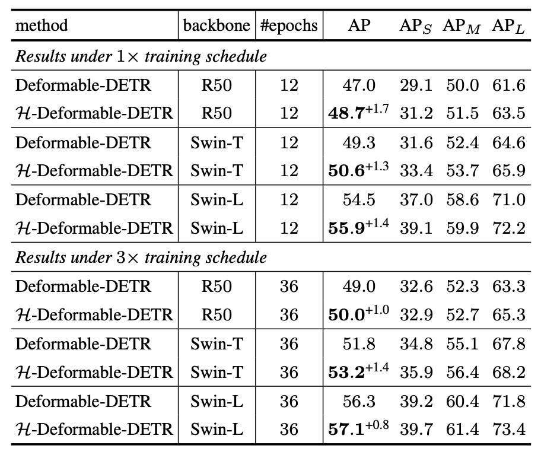

## サイレントクエリの反逆

[**DETRs with Hybrid Matching**](https://arxiv.org/abs/2207.13080)

---

DETR の世界では、大部分のクエリは分類に割り当てられ、沈黙を強いられる。

たとえ真実に近づいていても……申し訳ないが、真実は一つだけで、それ以外は認められない。

## 問題定義

Transformer を物体検出に導入した先駆けである DETR 以降、DETR アーキテクチャは視覚領域における指標的な標準構造として急速に普及した。以下の図に示す通り：

<figure style={{ "width": "80%"}}>

</figure>

その中核となる貢献は、anchor や proposal、NMS などの手動設計コンポーネントを廃し、物体検出問題を「クエリと対象のマッチング」問題として再定式化した点にある。

この設計により処理が簡素化されるだけでなく、構造の移植性や汎化性能も向上し、それに伴うエコシステムが 2D 検出、3D 認識、姿勢推定、ビジュアルトラッキング、セグメンテーションなど多様なタスクで広く応用されている。

この路線の発展により研究者は各モジュールの改良を続けてきた。Deformable-DETR は可変形注意機構を導入し小物体検出や収束速度を改善し、DAB-DETR や DINO シリーズは denoising query によるマッチングの安定化を追求している。

しかし、いかなるアーキテクチャもその学習機構の多くは DETR の「一対一マッチング」原理に基づいている。すなわち、各 ground truth は唯一のクエリにしか割り当てられず、これは NMS を排除するための重要条件の一つである。

しかしこの一対一割り当て戦略は訓練過程で無視できないボトルネックも生んでいる。

例えば一般的な COCO データセットでは、1 画像あたり平均 30 以下のアノテーションボックスに対し、モデルはしばしば 100〜300 のクエリを生成する。この割り当て制度の下、大多数のクエリは最終的に「背景」として分類損失の監督を受けるだけで、バウンディングボックス回帰学習には参加できない。

つまり、訓練中の大部分のクエリは極めて限定的な学習信号しか得られない。推論時にはこれらクエリも予測を出力する可能性があるが、訓練段階での学習余地は大きく制約されている。

さらにこの割り当て制限は、潜在的な正例探索能力を抑制している。

特定クエリが対象物と良好に位置合わせされていても、他クエリに「占有」されているため回帰学習から除外される。このことは訓練データの利用効率低下、空間特徴学習能力の制限を招き、訓練速度の遅さ、正例へのフィッティング不良、資源利用率の低さといった問題を生む。

DN-DETR や DINO-DETR など現行の改良法は「ノイズクエリの追加」により正例監督を強化しようとするが、主にマッチングの安定性向上を目的とし、訓練効率改善が主眼ではない。また多くはノイズ生成方式の設計やクエリ形式の調整を要し、他タスクへの汎用性に欠ける。

そこで問題は、

> **DETR のマッチング利点を維持しつつ、遊休クエリの潜在力を解放し、正例監督範囲を拡大できないか？**

---

## 解決法

DETR の原設計では、1 画像ごとに一組の「クエリ」ベクトルが生成され、これらはデコーダを通じてそれぞれ予測ボックスと分類確率を出力する。最終的にこれら予測は ground truth と一対一でマッチングされ、「特定物体を最適に表現するクエリ」を選出し、そのマッチングに基づいて損失を計算する。

H-DETR が提案する改良は、この一対一メカニズムを破壊せずに、追加で「枝分かれ」を設けることで、多くのクエリも学習に参加可能にすることだ。

具体的には、モデルが同時に 2 組のクエリを訓練する。1 組は元の一対一監督ロジックを維持し、もう 1 組は「一対多」監督方式を採用する。つまり各 ground truth が複数のクエリに対応し、従来「浪費されていた」クエリも訓練時にアノテーションボックスに近づき、正例を学習できる。

### メインブランチ：一対一監督

まず 1 組目のクエリ $Q = {q_1, q_2, ..., q_n}$ に対し、標準 DETR 訓練を行う：

1. クエリは$L$層のデコーダを通り、$L$組の予測 ${P^1, P^2, ..., P^L}$ を得る。
2. 各層予測は ground truth と Hungarian Matching を行い、最適な対応を決定。
3. 損失関数は：

$$
\mathcal{L}_{\text{one2one}} = \sum_{l=1}^{L} \mathcal{L}_{\text{Hungarian}}(P^l, G)
$$

ここで$\mathcal{L}_{\text{Hungarian}}$は分類損失、$L_1$回帰損失、GIoU 損失を含む DETR 標準損失である。

このブランチは DETR の推論簡素化の核となる。

---

### 補助ブランチ：一対多監督

もう 1 つのブランチは、真の目標に近づく機会を増やすため以下を行う：

1. 追加のクエリセット $Q_b = {q_b^1, q_b^2, ..., q_b^T}$ を生成し、一対多学習に用いる。
2. ground truth $G = {g_1, ..., g_m}$ を$K$回繰り返し増強目標集合を作成：

$$
G_b = \{G, G, ..., G\} \quad (K \text{回})
$$

3. 各層予測 ${P_b^1, ..., P_b^L}$ と $G_b$ をマッチングし、損失を計算：

$$
\mathcal{L}_{\text{one2many}} = \sum_{l=1}^{L} \mathcal{L}_{\text{Hungarian}}(P_b^l, G_b)
$$

このブランチは主クエリの推論に干渉せず、訓練効率と学習強度を高めるためのもの。

---

### 総損失と実装詳細

総訓練損失は、

$$
\mathcal{L} = \mathcal{L}_{\text{one2one}} + \lambda \cdot \mathcal{L}_{\text{one2many}}
$$

であり、$\lambda$は両ブランチの重要度を調整する重み係数。

2 組のクエリが計算グラフ上で並列処理できるよう、H-DETR は masked multi-head attention を採用し、クエリ同士の干渉を回避。これにより補助ブランチの訓練コスト増加はほぼ無い。

推論時は一対多ブランチを完全に無視し、メインブランチのみの出力を使用。よって H-DETR は DETR のシンプルさを維持し、NMS 不要でクエリ出力だけで検出を完結させる。

### 他の混合監督形式

「二重ブランチ」訓練構造に加え、H-DETR は訓練の「時間軸」と「層レベル」それぞれで監督方式を動的に切り替える 2 つの変種も提案している。

- **Hybrid Epoch Scheme：隠れた段階切り替え**

  この方式は二重ブランチのように 2 組のクエリを必要とせず、1 組のクエリ $Q_e = {q_1, ..., q_M}$ のみを用い、訓練「段階」に応じてマッチング方式を変える。

  - **初期（ρ 割合の epoch）**：一対多マッチングを用い、各 ground truth を$K$回複製した強化ラベル集合 $G_e$ とマッチング。損失は：

  $$
  \mathcal{L}_{\text{one2many}} = \sum_{l=1}^{L} \mathcal{L}_{\text{Hungarian}}(P_e^l, G_e)
  $$

  - **後期（残りの 1−ρ 割合の epoch）**：一対一監督に戻し、元のラベル $G$ とマッチング。損失は：

  $$
  \mathcal{L}_{\text{one2one}} = \sum_{l=1}^{L} \mathcal{L}_{\text{Hungarian}}(P_e^l, G)
  $$

  この設計意図は、訓練初期に豊富な監督信号でクエリを素早くラベルに近づけ、基礎的な位置推定能力を習得後に一対一独占性へ収束させることにある。

  推論は一対一クエリ出力のみで、DETR の簡潔さを保つ。

---

- **Hybrid Layer Scheme：層内監督切替**

  こちらも単一クエリ集合 $Q = {q_1, ..., q_N}$ を用いるが、epoch ではなくデコーダの「層数」に基づいて監督方法を切り替える。

  - **前半 $L_1$ 層**：一対多監督で、それぞれの層予測 ${P^1, ..., P^{L_1}}$ を複製ラベル集合 $G$ にマッチング。

  $$
  \mathcal{L}_{\text{one2many}} = \sum_{l=1}^{L_1} \mathcal{L}_{\text{Hungarian}}(P^l, G)
  $$

  - **後半 $L_2$ 層**：一対一監督に戻す。損失は：

  $$
  \mathcal{L}_{\text{one2one}} = \sum_{l=L_1+1}^{L_1+L_2} \mathcal{L}_{\text{Hungarian}}(P^l, G)
  $$

  直感的には、前半層で密な監督によりクエリを暖めてラベルに近づけ、後半層で一対一監督により独立予測力と推論整合性を強化する。

  総損失は両者の和：

  $$
  \mathcal{L} = \mathcal{L}_{\text{one2many}} + \mathcal{L}_{\text{one2one}}
  $$

  これによりモデルは層深度に応じて監督密度と推論一貫性を折衷できる。

---

これら 2 つの変種は元の二重ブランチ構造に比べ実装が簡潔で追加クエリパラメータも不要ながら、正例監督を強化する効果を維持する。H-DETR の設計核は、DETR の推論簡潔性を損なわずにより多くの訓練情報を提供し、収束速度とモデル安定性を向上させる点にある。

## 議論

著者はまず、H-DETR が既存の DETR 構造の検出性能を有効に向上させるかを検証した。

COCO と LVIS という 2 つの大規模データセットを用い、改良版の H-Deformable-DETR モデルを異なるバックボーンや訓練期間で評価した。

### COCO ベンチマーク

<figure style={{ "width": "70%"}}>

</figure>

実験結果によると、H-Deformable-DETR は COCO 検証セットにおいて、ResNet-50、Swin-T、Swin-L といった異なる規模のバックボーン、及び 12 または 36 エポックの訓練期間のいずれの場合でも一貫した性能向上を示した。

Swin-T の場合を例に挙げると：

- 12 エポック訓練では、49.3%から 50.6%へ向上。
- 36 エポック訓練では、AP が 51.8%から 53.2%へ上昇。

この結果は、推論構造を変更せず、訓練中の監督戦略のみ調整することで Deformable-DETR に顕著な利益をもたらし、特定のバックボーン規模や訓練期間に依存しない優れた汎化性を持つことを示している。

### LVIS ベンチマーク

<figure style={{ "width": "70%"}}>

</figure>

次に LVIS の実験結果を見る。LVIS は数千クラスを含み極めて長尾分布のデータセットであり、H-DETR の大規模かつ低頻度クラスへの汎化能力を検証する。

LVIS の課題が COCO より難易度が高いにも関わらず、H-DETR は平均で **+0.8 ～+1.0%**の性能向上を維持しており、一対多監督戦略が「少数サンプル」の学習効果を実質的に支援していることが分かる。

### SOTA ベンチマーク

著者は H-Deformable-DETR を近年の代表的な SOTA 手法と比較している。すべてのモデルは単一スケール推論を用い、パラメータ規模が近い Swin-L をバックボーンに選択し、公平性を保った。

総合比較で H-Deformable-DETR は COCO 検証セットで 59.4% AP を達成し、DINO-DETR など強力なベースラインを凌駕した。

この結果は、H-DETR の提案する混合マッチング戦略が他の強化手法と組み合わせても現行最強モデルと渡り合えることを示す。DETR 構造の簡潔さと後処理不要の利点を保持しつつ、学習効率と最終性能に対する監督機構の重要性を強調するものだ。

### 消融実験

<figure style={{ "width": "70%"}}>

</figure>

異なる混合構造の性能を示した。その他の実験は原論文参照。

本実験では以下の 2 点を厳守し公平性を確保：

1. 3 つの戦略はいずれも baseline 比で**正例数を 6 倍に増加**。
2. 3 つとも**合計 1800 クエリ**を使用。

また表中の付記の意味：

- **†印**：訓練・推論共に 1800 クエリ使用。
- **#印**：GPU 上の最適化実装にて測定（詳細は補足資料参照）。

主な観察点：

- **Hybrid Branch**は性能面で最もバランスが良い：

  - 最高の精度向上を実現。
  - 訓練時間も比較的制御可能（baseline 比約+7%）。
  - 推論 FPS、FLOPs、メモリコストも安定。

- **Hybrid Epoch**は段階的に訓練戦略を切り替えるため訓練時間が長くなるが、精度は顕著に向上。実用面ではコストが高い。

- **Hybrid Layer**は性能と精度のバランスを取るが、総じて Hybrid Branch よりやや低い。

## 結論

DETR の革新点は物体検出をクエリマッチング問題に変換し推論を簡素化したことにあるが、その代償として訓練効率は低い。

H-DETR はこの課題に対し、多対一監督を訓練時に導入し学習効率を高める一方、一対一推論の意味的一貫性と構造簡潔性を保持する修正を的確に提案した。この設計は三大エンジニアリング利点を持つ：推論に変更不要、コスト制御可能、モジュール化しやすく任意のクエリ機構タスクへ移植可能性が高い。

---

:::info
関連情報は H-DETR の GitHub ページを参照。興味ある方はぜひ試してみてほしい：

- [**DETRs with Hybrid Matching, CVPR 2023**](https://github.com/HDETR)
  :::
