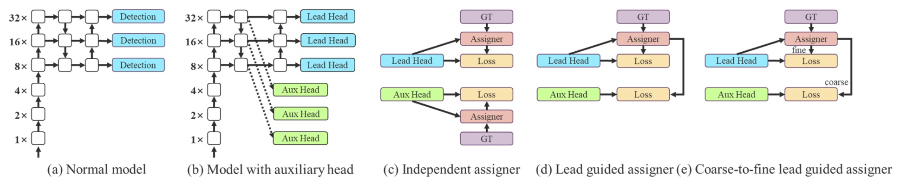
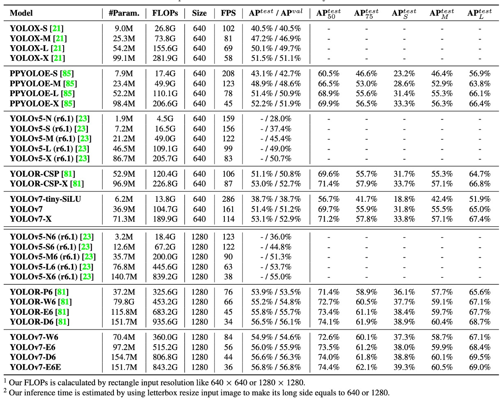

## 脇役の逆襲

[**YOLOv7: Trainable bag-of-freebies sets new state-of-the-art for real-time object detectors**](https://arxiv.org/abs/2207.02696)

---

YOLOv7 の論文の著者チームは台湾の中央研究院出身です。

ところで、なぜ v7 は v6 よりも 2 か月早く公開されたのでしょうか？それは世界中に多くのチームが初代 YOLO の正統な継承者になろうとしているからです。星々が集う YOLO 宇宙へようこそ！

## 問題の定義

リアルタイム物体検出の分野は、常に四つの要素のバランスを取っています：**速度、精度、パラメータ数、展開可能性**。

これらのバランスはシーンによって優先順位が変わります。自動運転では遅延を重視し、組み込み機器では消費電力を気にし、医療画像では精度が最優先です。

過去数年、リアルタイム検出器の設計は大きく二つの方向に分かれました：

一つは「**極限の軽量化**」を追求し、マイクロプロセッサやエッジ CPU 向けに設計されたもの（例：MCUNet、NanoDet）。もう一つは「**高効率なアーキテクチャで性能を絞り出す**」ことで、YOLOX や YOLOR のようにバックボーンの改造、ネックの最適化、特徴融合設計などによって推論速度と精度を向上させています。

これらの方法に共通しているのは：

- **ほぼ全て推論アーキテクチャに着目し、より速い経路でより正確な答えを出そうとしている点です。**

しかし YOLOv7 は逆の道を選びました。

著者はこの論文で、あまり注目されていない切り口を提案しました：

> **モデル構造を変えずに、訓練プロセスを再設計したらどうか？**

この出発点が YOLOv7 のコアコンセプト、「**trainable bag-of-freebies**」を生み出しました。

bag-of-freebies とは、訓練コストだけを増やし、推論コストは増やさない技術のことを指します。

YOLOv7 の革新点は、これらの技術を「訓練可能な」コンポーネントに進化させ、推論構造に手を加えずにモデル性能をさらに高めたところにあります。

この設計はシンプルに聞こえますが、すぐに二つの構造レベルの難題を引き起こしました：

1. **モジュールの重パラメータ化は、訓練と推論の両方に有利になるようにどう設計するべきか？**
2. **動的ラベル割り当て技術を使う際、多層出力間の割り当て整合問題をどう処理するか？**

これらの問題は以前は「訓練の細かい部分」として無視されがちでしたが、YOLOv7 の路線では、これら**訓練過程の非顕在的なボトルネックが設計の主戦場となりました**。

今回は YOLOv7 が焦点を「推論性能」から「訓練効率」へと移したのです。

この時点で思考の順序は静かに逆転しています。

## 問題の解決

### Extended-ELAN

YOLOv7 が導入した最初の設計上のキーポイントは、**E-ELAN（Extended Efficient Layer Aggregation Networks）** と呼ばれるバックボーン構造です。

これは YOLOX が使っていた ELAN 構造をベースにしており、E-ELAN のコア設計理念は以下の通りです：

> **勾配経路の長さを変えずに、パラメータの利用率と特徴表現の多様性を向上させる。**

上図からも明確にわかるように、E-ELAN は元の ELAN の勾配伝播経路を完全に保持しています。

神経ネットワークにおいて、有効な勾配経路は訓練効率と収束能力に直接影響を与えることは周知の事実です。

E-ELAN はこの主幹構造を維持しつつ、以下の重要な改良を加えています：

- **拡張（expand）**：グループ畳み込みを用いてチャネル数とカーディナリティを拡大。
- **再編成（shuffle）**：特徴マップのグループをシャッフル（再配置）。
- **結合（merge）**：グループ化した特徴を融合し、クロスグループ学習を促進。

これらの操作により、各ブロックが学習する特徴がより多様になり、ネットワークのメモリおよび計算密度の効率も高まります。一方で元の ELAN 構造の安定性は損なわれません。

総じて、E-ELAN はバックボーンに対して「計算密度と学習多様性」の双方を最適化する技術と言えます。

### 連結型アーキテクチャのスケーリング

二つ目の設計ポイントは、連結型アーキテクチャに対する複合スケーリング戦略（Compound Model Scaling）です。

以前 EfficientNet で見られたように、モデルスケーリングとはネットワークの幅（width）、深さ（depth）、解像度（resolution）を同時に拡大する手法です。

しかしながら、このスケーリング方法は主に ResNet や PlainNet のような「単一路径」アーキテクチャを対象としています。

一方で、YOLO シリーズは典型的な「マルチブランチかつ層間連結」構造です。あるブロックの深さだけを拡大すると、遷移層の入力チャネル数が変わります。前後でチャネル数が非対称になると、計算資源の無駄やメモリの断片化が発生してしまいます。

:::tip
GPU や TPU が畳み込み演算を行う際は、固定された入力チャネル数とテンソル形状に基づいてスケジューリングを行います。もしあるレイヤーのチャネル数が急激に増加しても、その後の演算でそのチャネルが十分に活用されなければ、「冗長な計算」が発生します。同時に、一部のコアモジュールの実行効率も低下します。

また、PyTorch や TensorRT などの現代的な深層学習システムは、メモリを事前に割り当てようとします。テンソルのサイズが頻繁に変わる（例えば、あるブロックのチャネルが 128 に、別のブロックが 256 になるなど）と、メモリアロケータは不規則なメモリブロックを生成しがちで、最終的に GPU メモリを効率よくパッキングできず、無駄遣いや割り当て失敗を引き起こす可能性があります。
:::

そこで著者が提案した解決策は以下の通りです：

> **深さをスケールアップする際には、幅も連動して調整し、チャネル比率を安定させるべきである。**

この戦略により、非対称なレイヤースケーリングによるリソースの無駄遣いを防ぎ、モデルが元々設計されたハードウェアに対する親和性も維持されます。

具体的な手順は：

1. まず深さ（depth）のスケーリングを行い、ブロック内の積み重ね層数を増やす。
2. 拡張された出力チャネルの変化に合わせて、遷移層（transition layer）の幅（width）も対応的にスケールする。
3. 全体のチャネル比率を維持し、モデルがハードウェア上でメモリの非整列割り当てや計算ボトルネックを起こさないようにする。

これは「結合型スケーリング手法」と呼べるもので、異なる階層のパラメータ変化を同時に考慮することで、高効率な計算を維持しつつモデル規模の拡大を可能にしています。

### トレイナブル BoF

YOLOv7 が提案する **trainable bag-of-freebies** は、単なる既存技術の積み重ねではなく、訓練プロセス自体をモデル最適化の主戦場に押し上げています。

以下、三つの重要な革新点を詳しく見ていきましょう。

1. **Planned Re-parameterized Convolution**

<figure style={{ "width": "80%"}}>

</figure>

再パラメータ化畳み込み（RepConv）は、訓練と推論を分離した構造設計です：

- 訓練時は、3×3 畳み込み、1×1 畳み込み、さらに identity ショートカット（入力を直接通す）という三つのブランチを持ちます；
- 推論時には、これら三経路を単一路径に統合し、追加コストゼロを実現します。

この設計は VGG のような単純構造で効果的であり、収束加速や精度向上に寄与します。

しかし著者は、

> **ResNet や DenseNet のように既にショートカットや特徴連結があるネットワークに RepConv を使うと、精度が著しく低下することを発見しました。**

理由は、ResNet には residual shortcut があり、RepConv の identity 分支が重なることで勾配が干渉しやすくなるからです。

DenseNet では多層出力を concatenation でつなぐ特性上、各層に identity 分支を加えると特徴多様性の学習路線が損なわれ、多様な特徴が学べなくなります。

そこで著者は、

> **ネットワーク構造の性質（residual/concat の有無）に応じて、identity 分支を持たない RepConvN を使う計画的な再パラメータ化を提案しました。**

具体例として、

- PlainNet（残差なし基礎ネットワーク）では完全な 3×3 + 1×1 + identity 三経路の RepConv が有効；
- ResNet や DenseNet では 3×3 + 1×1 のみの RepConvN を使い、勾配伝播の混乱を防ぎます。

---

2. **Coarse-to-Fine ラベル設計**

多層検出ヘッドの訓練にあたり、著者は革新的な監督機構を導入しました：

- **Coarse-to-Fine Label Assignment**。

この機構は二つの重要な役割を持ちます：

- **Lead Head**：最終検出を担う主ヘッド；
- **Auxiliary Head**：浅層学習を補助し収束を助ける補助ヘッド。

従来は各ヘッドに独立したラベル割り当てを行いますが、著者は新たに

> **Lead Head の予測を全体訓練のリーダーとして用いる**という見解を示しました。

具体的な戦略は二つ：

- **Lead Head Guided Label Assigner**：Lead Head の予測結果と ground truth からソフトラベルを作成し、全ヘッドに適用；
- **Coarse-to-Fine Label Assigner**：粗い（coarse）ラベルと細かい（fine）ラベルの二種類を作り、Auxiliary Head にはリコール向上の粗いラベルを、Lead Head には精度向上の細かいラベルを割り当てる。

この戦略の背景は、

- **Lead Head は学習能力が高く指標として適している；**
- **Auxiliary Head は学習能力が低いため、正例条件を緩和しリコールを上げる必要がある；**
- **残差学習の精神で、Lead Head は未学習部分に集中する。**

粗いラベルが悪影響を与えないよう、デコーダーで動的に収束を制御し、訓練中に調節される監督機構としています。

---

3. **その他のトレイナブル Freebies**

最後に、著者は過去に「訓練トリック」として扱われた技術群を **トレイナブルな設計単位** に昇華させました：

- **BN と畳み込み層の融合**：BatchNorm の平均・分散を畳み込みの重みとバイアスに統合し、推論時の計算を簡素化；
- **YOLOR スタイルの暗黙的知識注入**：暗黙ベクトルを畳み込み層に結合し、推論時には固定ベクトル重みとして事前計算可能；
- **EMA（指数移動平均）モデル**：訓練パラメータを滑らかに平均化し、EMA モデルを最終推論モデルとすることで安定性と汎化性能を向上。

これらは新しい技術ではないものの、YOLOv7 ではモデル訓練性能を加速させる役割に再定義され、単なるハイパーパラメータ調整用のブラックボックスでなくなりました。

### 実験設定

YOLOv7 の全実験は **Microsoft COCO 2017** データセットで実施され、以下を重視しています：

- **ImageNet 事前学習を使わず、スクラッチから訓練すること；**
- 訓練に `train2017`、検証とハイパーパラメータ調整に `val2017`、最終評価に `test2017` を使用。

また、用途に応じて以下のモデル群が用意されています：

| モデル名  | 設計目標       | スケーリング技術                        | 備考           |
| --------- | -------------- | --------------------------------------- | -------------- |
| v7-tiny   | エッジデバイス | 軽量化設計                              | LeakyReLU 使用 |
| v7        | 一般 GPU       | Neck 拡張 + 複合スケーリング            | SiLU 使用      |
| v7-W6     | 高性能 GPU     | 複合スケーリング + W6 設計              |                |
| v7-E6/E6E | E-ELAN 構造    | 深化とチャネル拡張 + グループシャッフル | E6E は強化版   |
| v7-D6/X   | クラウドモデル | -                                       | -              |

すべてのスケーリング戦略は前述の複合モデルスケーリング法を用い、チャネルの不整合による計算リソースの浪費を防いでいます。

## 討論

### 旧版 YOLO との比較

<figure style={{ "width": "90%"}}>

</figure>

まずは過去の YOLO シリーズおよび YOLOR との比較結果を見てみましょう（上表参照）。

ここからわかるのは、YOLOv7 はほぼすべての比較項目で「**より小さく、より速く、精度も向上**」を達成していることです。特に小型モデル（tiny）や中型モデル（W6）での性能が顕著です。

### 最新 SOTA モデルとの比較

<figure style={{ "width": "90%"}}>

</figure>

速度と精度のトレードオフにおいて：

- **YOLOv7-tiny-SiLU** は **YOLOv5-N (r6.1)** と比べ、127 fps も高速で、AP が 10.7% 向上
- **YOLOv7** は 161 fps で 51.4% AP を達成。一方 PPYOLOE-L は同等精度時に 78 fps しか出せません。

上位モデル同士の比較では：

- **YOLOv7-X** は **YOLOv5-L (r6.1)** より推論速度が 15 fps 速く、精度は 3.9% 高い
- **YOLOv7-X** は **YOLOv5-X (r6.1)** と比べて 31 fps 高速、パラメータ 22% 削減、計算量 8% 減少しつつ AP は 2.2% 向上

さらに大規模モデル比較：

- **YOLOv7-E6** は **YOLOv5-X6 (r6.1)** に比べ AP が 0.9% 上昇、パラメータ -45%、計算量 -63%、速度 47% 向上
- **YOLOv7-D6** は **YOLOR-E6** とほぼ同じ速度で AP が 0.8% アップ
- **YOLOv7-E6E** は **YOLOR-D6** と同速度で AP が 0.3% 改善

これらの比較から以下が読み取れます：

1. 軽量から大規模モデルまで YOLOv7 は高効率を維持している
2. 事前学習モデルを使わなくてもほとんどの SOTA モデルを凌駕している
3. モデルスケーリング戦略やモジュール設計（RepConvN、Coarse-to-Fine Label Assigner）が実際の性能向上に直結している

YOLOv7 は単なる訓練技術の集合体にとどまらず、実運用ニーズを総合的に考慮したアーキテクチャ設計の模範です。

### 消融実験：モデルスケーリング

モデルスケーリングの一般的手法は以下の三つです：

- **幅（width）のみ拡大**：各層のチャネル数を増やす
- **深さ（depth）のみ拡大**：層やブロック数を増やす
- **複合スケーリング**（EfficientNet など）：depth、width、解像度を同時に調整

著者は特に **連結（concatenation）ベースの構造向けに最適化された手法** を採用しました：

> **計算ブロックの深さを 1.5 倍に拡大し、遷移ブロックの幅を 1.25 倍に同期拡大する。**

この設計は以下の重要ポイントを保つことを目的としています：

- ブロックの出力特徴マップ構造の安定
- 各層間のチャネル整合性
- メモリ断片化の低減とハードウェア計算効率の向上

結果は以下の通りです：

<figure style={{ "width": "70%"}}>

</figure>

- **幅のみ拡大** はシンプルだが効率が悪く、パラメータ増加に見合った精度向上が乏しい
- **深さのみ拡大** は多少精度を伸ばすが、ブロック出力が不整合で計算効率が落ちる
- **複合スケーリング戦略** は最小のパラメータ・計算コストで最大の AP (+0.5%) 改善を実現

この複合モデルスケーリングは単なるサイズ拡大ではなく、ELAN や YOLO スタイルのネットワーク構造に適した幾何学的安定手法です。

### ラベル割り当て戦略

従来の多頭検出器では、**Auxiliary Head** は単に中間層への監督信号として追加され、勾配の伝播を速めて収束を促進する役割に留まっていました。

しかし YOLOv7 の設計はさらに踏み込み、**なぜ補助ヘッドの学習内容も主出力（Lead Head）にリードさせないのか？** という問いを投げかけています。

これがまさに **Assistant Loss for Auxiliary Head** の設計の核であり、Lead Head の予測を用いてより意味的階層のある監督構造を構築しています。

1. **実験 1：3 種のラベル割り当て戦略比較**

   

   <figure style={{ "width": "70%"}}>
   
   </figure>
   

   結果は、

   - **補助損失（assistant loss）を加えるだけで性能が向上する**
   - **Lead Head によるソフトラベル指導（Lead-guided Assigner）が従来方式を上回る**
   - **Coarse-to-Fine 指導戦略が最良で、主ヘッドに精細ラベル、補助ヘッドにリコール重視の粗いラベルを割り当て、監督の階層分業を実現**

   さらに下図は各戦略下での **Objectness Map** の可視化です：

   

   従来法では Auxiliary Head が一貫しない特徴を学習しがちですが、Lead-guided soft label では補助ヘッドと主ヘッドの特徴が整合し、主ヘッドの残余情報学習も助けています。

   中間層から上位層への情報誘導は「残差学習構造」としてネットワーク全体の学習分業と効率を向上させています。

   ***

2. **実験 2：Decoder の上限制約効果**

   

   <figure style={{ "width": "70%"}}>
   
   </figure>
   

   Coarse Label が最終出力に悪影響を及ぼさないように、著者はデコーダーに以下の制約を追加しました：**Coarse Label の objectness スコア上限を設け、ターゲット中心からの距離に応じてスコアを減衰させる**というものです。

   上表の結果から、この設計は Coarse Label に対する許容範囲を広げるだけでなく、モデルが「補助ヘッドに学習させるべき内容」に集中し、不必要なノイズを誤って学習するのを防ぐ効果があることが示されています。

   ***

3. **実験 3：Partial Auxiliary Head 設計**

   

   <figure style={{ "width": "70%"}}>
   
   </figure>
   

   YOLOv7 では、著者はさらに新しい設計を提案しています：**補助ヘッドを最終出力ではなく、E-ELAN の中間層にあるピラミッド（特徴ピラミッド）に接続することです。**

   これには二つの目的があります：

   1. **補助損失が最終特徴の重み更新に直接干渉するのを防ぐこと**
   2. **異なるサイズの物体が異なる層で学習される特徴ピラミッドの分布を維持すること**

   結果、**Partial Coarse-to-Fine 戦略が最良の性能を示し、層ごとの学習目標の明確な境界を保っています。**

Lead Head 主導の監督は単なる情報再利用に留まらず、ネットワーク全体を意味的一貫性と勾配補完性のある訓練経路にしています。

## 結論

YOLOv7 は **訓練プロセスを主役に、推論構造を背景に据えた** 物体検出設計理念の結晶です。

モデルスケーリング、モジュール置換、ラベル割り当てなど、「訓練の細部」と見なされがちな部分を設計の中心に据え、訓練そのものがモデル最適化の鍵であることを示しました。

実務開発者にとって、YOLOv7 の最大の示唆は、**memory alignment（メモリアライメント）、channel matching（チャネル整合）、gradient flow（勾配の流れ）** といったハードウェア指向の設計が実際のデプロイに非常に重要であることを認識する必要がある点です。さらに、モジュール置換（例えば RepConv）を行う際には、単にパラメータ数を見るだけでなく、情報の流れやアーキテクチャの論理も考慮しなければなりません。

これは研究と実装の交差点であり、多くの示唆に富んだ概念を私たちに教えてくれます。
