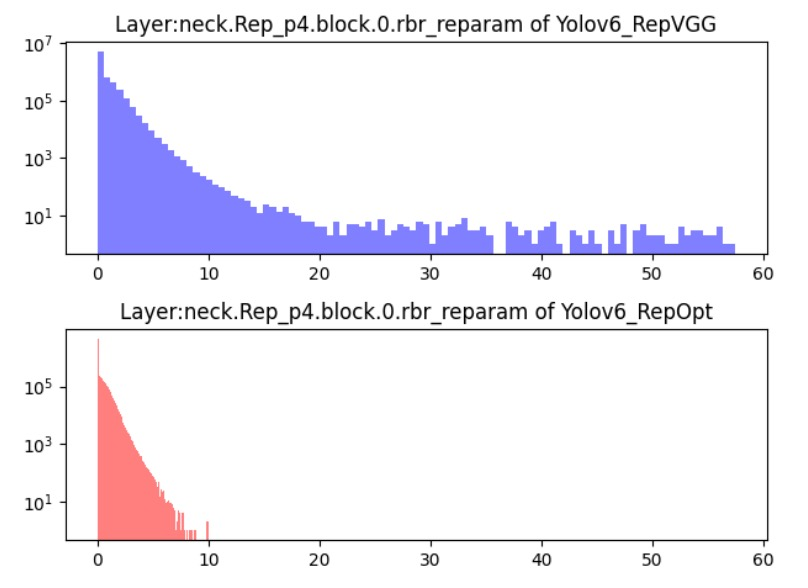
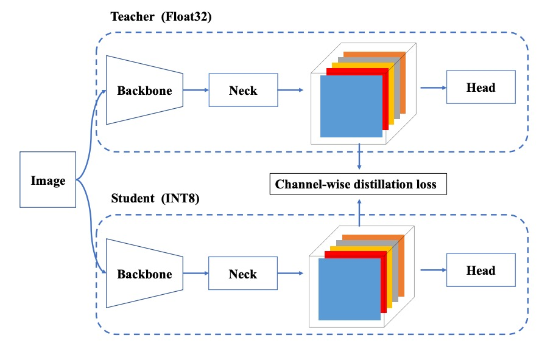

## 再パラメータ化の分かれ道

[**YOLOv6: A Single-Stage Object Detection Framework for Industrial Applications**](https://arxiv.org/abs/2209.02976)

---

YOLOv5 は論文が発表されていないため、直接 v6 を見ていきます。

YOLOv6 は中国の生活サービスプラットフォーム Meituan のコンピュータビジョンチームが主導して開発しました。

## 問題の定義

YOLO シリーズは産業応用において常に非常に高い普及率を誇っています。

その理由はただ一つ、シンプルで高速、かつ十分な精度だからです。

しかし、タスクの種類が増え、展開環境が複雑化するにつれて、かつて「十分で良い」とされていた基本的な仮定が徐々に支えきれなくなってきました。

例えば、アーキテクチャの一貫性という迷信により、小型モデルと大型モデル間で性能拡張に断層が生まれたり、量子化推論の不安定さが再パラメータ化モデルの実際の展開で逆効果をもたらしたりしています。

また、既存の速度報告は高性能 GPU に依存しているため、実際の展開時の遅延性能と期待値に大きなギャップが存在します。さらに、ラベル割り当て、損失設計、知識蒸留などの高度な訓練戦略も理論や局所的な実験段階にとどまり、完全な訓練プロセスを構成できていません。

もっと核心的な問題は、

> **「モデルが十分に速く、十分に正確」と言う時、我々が本当に指しているものは何か？**

それは A100 上でのベンチマークスコアか、T4 上でのリアルタイム応答か？訓練精度曲線の終点か、それとも産業現場で安定的に一ヶ月動作できるか？

これらの問題が積み重なることで、技術的な細部だけでなく設計の観点でも意見の相違が生まれます。

YOLO アーキテクチャを振り返ると、これまでの進化はモジュールの積み重ね、特徴融合、データ拡張技術に偏っていました。しかし、産業展開の門前で、**モデルの量子化可能性、モジュールの再パラメータ化可能性、訓練戦略、ハードウェア親和性**こそが再考すべき核心であることが分かります。

## 問題の解決

YOLOv6 は設計思想を 6 つの戦略的側面に分解し、長年解決されてこなかった 6 つのエンジニアリングボトルネックに対応しています：

1. **ネットワーク設計（Network Design）**
2. **ラベル割り当て（Label Assignment）**
3. **損失関数（Loss Function）**
4. **訓練強化（Industry-handy Improvements）**
5. **量子化と展開（Quantization and Deployment）**
6. **自己蒸留（Self-distillation）**

:::tip
YOLO シリーズはこの論文から再パラメータ化アーキテクチャを導入しています。このアイデアは 2021 年の RepVGG 論文以降に広まりました。まだ RepVGG を読んでいない読者は、以下の当社の以前のノートを参考にしてください：

- [**[21.01] RepVGG: VGG を再び偉大に**](../../reparameterization/2101-repvgg/index.md)
  :::

### ネットワーク設計

物体検出モデルは基本的に三つのコアモジュールに分解できます：

- **Backbone、Neck、Head**。

この部分は誰もがすぐに理解できるでしょう。

Backbone は特徴抽出を担当し、モデルのセマンティック表現力と大部分の計算コストを決定します。Neck は異なるレベルの特徴マップを統合し、多尺度のピラミッド構造を構築します。Head はこれらの特徴マップに基づき分類とボックス予測を行います。

YOLOv6 はこの三者をすべて再設計し、モデル規模に応じて差別化を図っています。コアの理念は：

> **異なるモデルサイズに応じて異なるアーキテクチャを設計する。**

小型モデルには YOLOv6 は **RepBlock** の再パラメータ化モジュールを Backbone の主体として採用しています。この変換機構は RepVGG の設計思想に由来し、**訓練は学習のために設計し、推論は展開に最適化する**ことを目指しています。

<figure style={{ "width": "90%"}}>

</figure>

RepBlock モジュールは上図(a)の通りで、訓練時はマルチブランチ構造を含み特徴表現の学習を助けます。推論段階では単一経路の 3×3 畳み込みに変換され、ハードウェアの計算密度と並列効率を最大化します。特に主流 GPU/CPU 上で良好な性能を発揮します。

しかしモデル規模が大きくなると単一路経路の構造はパラメータ数と計算量が指数的に増加します。そこで YOLOv6 は中〜大型モデル向けに新たな設計 **CSPStackRep Block** を導入しました（上図(c)参照）。これは **CSP 構造** と **RepBlock 再パラメータ化機構** を融合したハイブリッドモジュールです。

内部は 3 つの 1×1 畳み込みと複数の RepBlock の積み重ねで構成され、クロスステージ残差（CSP）を加えて性能の安定化と冗長計算の削減を両立します。この構造は精度と速度のバランスを良好に保ち、特に中大型モデルに適しています。

---

次に Neck 部分を見ていきます。

YOLOv6 は v4/v5 で使われていた **PAN（Path Aggregation Network）** 構造を Neck の主体として継続採用しています。異なる点は小型モデルが RepBlock を用いる一方で、大型モデルは CSPStackRep Block を用い、v5 の CSPBlock を置き換えています。

この構造は作者により **Rep-PAN** と命名され、モデルサイズに応じて幅と深さが動的に調整されます。これにより異なるレベルと空間スケールの特徴が効率的に流れ、推論効率も維持されます。

全体構造は以下の図の通りです。

<figure style={{ "width": "90%"}}>

</figure>

---

最後に Head の設計最適化です。

v5 の結合型設計や YOLOX が導入した追加 2 層の 3×3 畳み込みによる解耦型 Head と比べ、YOLOv6 は解耦型設計の **Efficient Decoupled Head** を採用し、中間の畳み込み層は 1 層に留めています。また Backbone と Neck の幅に応じて全体のチャネル数を調整しています。

さらに YOLOv6 は**アンカーフリー**方式を採用し、アンカーポイントに基づく戦略を取っています。モデルは一組のアンカーボックスを予め定めるのではなく、各点から目標境界までの距離を直接予測します。この手法はデコードがシンプルで汎化性能が高く、後処理コストも低減します。近年のアンカーフリー検出器（FCOS、YOLOX など）で主流の設計路線の一つです。

### ラベル割り当て

ラベル割り当て（Label Assignment）は物体検出の訓練工程における重要なステップです。

これは訓練段階で各 ground-truth オブジェクトを一組のプリセットアンカーや予測点に対応付ける役割を担います。この過程は正負サンプルの分布を決定し、分類と回帰の両ブランチの学習ダイナミクスに直接影響します。

初期の手法は主に幾何学的条件に基づき、IoU ベースの戦略やバウンディングボックス内部判定法など、直感的なロジックでしたが、多尺度オブジェクトや不均一な背景には弱い面がありました。

近年ではラベル割り当てを最適化問題やタスクアライメント問題として捉える高度な手法が登場しています。

1. **SimOTA：理想的な輸送問題、理想的でない収束挙動**

   YOLOv6 の初期バージョンでは **SimOTA** をラベル割り当て戦略に採用していました。

   この方法は OTA（Optimal Transport Assignment）に由来し、ラベル割り当てを全体的な輸送問題としてモデル化し、損失関数を距離尺度として用いて分類と回帰の結果間で最適な割り当てを目指します。

   SimOTA は OTA の簡略版で、コアの思想を残しつつハイパーパラメータの複雑さを軽減しました。しかし実務では以下の問題が観察されました：

   - SimOTA 導入で**訓練時間が大幅に延長**される；
   - 早期段階でモデルが**不安定な揺らぎ**を示し、初期化や学習率に敏感になる。

   これらの理由から、より安定で訓練に優しい代替策を模索することになりました。

2. **TAL：幾何学からセマンティックへのタスクアライメント**

   最終的に採用されたのは **Task Alignment Learning（TAL）** です。

   これは TOOD で提案された手法で、SimOTA とは異なり、割り当て基準を幾何指標（IoU など）に依存せず、分類スコアと予測ボックス品質を統合した単一指標を構築します。これにより分類と回帰の両タスクブランチが割り当て過程で同期的にアライメントされます。

   この設計の主な利点は：

   1. **分類と回帰間のタスク不整合を緩和し、モデル全体の一貫性を向上させる**；
   2. **訓練初期から安定性と収束速度の向上を示し、ハイパーパラメータ調整への依存を減らす**。

   TOOD の元々の構造では T-head と TAP（Task-Aligned Predictor）モジュールも導入されていましたが、PP-YOLOE ではそれらを軽量化した ET-head を採用しています。

   しかし YOLOv6 の実験では ET-head 導入による精度向上は見られず、逆に推論速度の低下を招いたため、Efficient Decoupled Head 設計を維持し、TAL のみラベル割り当てに採用しています。

---

実験結果から、TAL は SimOTA より精度が高いだけでなく、**訓練の安定性を大幅に改善**し、最終的に YOLOv6 のデフォルトのラベル割り当てメカニズムとなりました。

### 損失関数

物体検出タスクは本質的に二つのサブタスクに分かれます：**分類** と **位置特定**。それぞれ分類損失とボックス損失という学習信号に対応します。この二つの損失経路は予測精度に影響を与えるだけでなく、モデル全体の収束速度や安定性にも共同で作用します。

YOLOv6 では、これら二つのサブタスクに対する損失設計について多くの実験を重ね、最終的に最もバランスの取れた組み合わせ戦略を選択しました。

1. **分類損失：正負サンプルの信号強度のバランス**

   分類ブランチにおいて、従来のクロスエントロピー損失は正負サンプルの不均衡時に、モデルが簡単なサンプルを過学習し、難しい少数サンプルを無視しがちでした。これを解決するために Focal Loss が提案され、簡単に分類できるサンプルの損失重みを下げ、難しいサンプルに集中させます。

   さらに以下の拡張がありました：

   - **Quality Focal Loss (QFL)** は分類スコアと予測ボックス品質を統合し分類監督に用いる；
   - **Poly Loss** は損失関数を多項式形式で展開し汎化性能向上を目指す；
   - **VariFocal Loss (VFL)** は非対称に正負サンプルを扱い、正サンプルにより高い信号強度を与え信号分布のバランスを改善。

   実験比較の結果、**YOLOv6 は最終的に VFL を分類損失関数として採用**しました。これは難しいサンプルへの高感度と訓練安定性が主な理由です。

---

2. **ボックス損失：IoU から確率分布へ**

   位置特定損失の設計の核心は、予測ボックスをできるだけ正解ボックスに近づけることです。初期は L1 や L2 損失を使っていましたが、評価指標（IoU など）と整合せず学習が偏ることがわかりました。

   そこで IoU 系列の損失が提案されました：

   - **GIoU、DIoU、CIoU** はそれぞれ外接ボックス面積、中心距離、縦横比などの幾何情報を加味；
   - **SIoU** は対角方向や角度方向の収束挙動をさらに考慮。

   YOLOv6 では以下の方針を取っています：

   - 小型モデル（YOLOv6-N/T）は **SIoU** を使用；
   - 中大型モデルは **GIoU** を採用し安定性と性能のバランスを実現。

   さらに中大型モデルでは **DFL（Distribution Focal Loss）** を導入。これはボックス回帰を確率分布推定として扱い、境界のあいまいや不確実性をよりよく処理可能。ただし計算コストを考慮し、**YOLOv6-M/L のみで利用**し、小型モデルは採用しません。

---

3. **オブジェクト存在損失：効果がなかった設計**

   作者は FCOS や YOLOX に見られるような低品質予測抑制のための **objectness loss** も試みました。しかし YOLOv6 のアンカーフリー構造下では**顕著な効果は得られず**、最終的にモデル本体には組み込まれませんでした。

---

総じて、YOLOv6 の損失設計は**タスクアライメント＋信号強化**の戦略をとっています：

- 分類ブランチは信号の非対称性を重視し、VFL によりモデルの判別力を安定化；
- 回帰ブランチは小型モデルで安定かつ高速学習を重視し、大型モデルで複雑かつ高精度な DFL を許容；
- すべての設計は「学習品質向上と推論効率維持」の両立を原則としています。

### 量子化と展開

産業応用では「速さ」が最重要です。

したがって、**性能を大きく損なわずに推論速度を向上させること**が、モデル設計や訓練以外の現実的な課題となります。

量子化（Quantization）はこの課題に対する主要な解決策です。

しかし、YOLOv6 のように再パラメータ化モジュール（re-parameterization blocks）を多用するアーキテクチャでは、従来の量子化プロセスが適用しにくい問題があります。

「後訓練量子化（PTQ）」を適用すると、精度が特に大幅に低下してしまいます。一方、「量子化認識訓練（QAT）」に切り替えると、訓練段階と推論段階で量子化シミュレータの不整合問題が生じます。

:::info
ここまで読んだところで少し区切ります。

実はこの論文発表後まもなく、再パラメータ化アーキテクチャの量子化問題に焦点を当てた古典的な論文「QARepVGG」が登場しました。

この論文は、量子化問題の原因が BatchNorm の再パラメータ化過程における統計パラメータの問題による崩壊にあることを指摘しています。興味のある方は、以下の当社の過去の論文ノートをご覧ください：

- [**[22.12] QARepVGG: RepVGG を再び偉大に**](../../reparameterization/2212-qarepvgg/index.md)
  :::

現在のところ、YOLOv6 は問題を分解して個別に対応しています。

1. **RepOptimizer：最適化器レベルで再パラメータ化の量子化問題を解決**

   YOLOv6 は **RepOptimizer** を訓練最適化器として使用しています。これは再パラメータ化構造に特化した勾配最適化戦略で、核心は各勾配更新時に構造レベルで再パラメータ化を行い、訓練と展開フェーズの挙動差を根本から整合させることです。

   実験結果は下図の通りで、この方法で訓練されたモデルは特徴分布の範囲が狭くなり、PTQ により適したものになります。大規模な追加ラベルデータなしで、推論が安定した量子化モデルを得られます。

   

   <figure style={{ "width": "70%"}}>
   
   </figure>
   

---

2. **感度分析：float でモデルの弱点を保護**

   RepOptimizer で訓練しても、一部レイヤーで量子化後に精度低下が顕著になることがあります。そこで YOLOv6 は **感度分析（sensitivity analysis）** を用い、層ごとに量子化が特徴マップに与える影響を評価し、最も影響の大きい層を特定します。

   評価指標には以下を用います：

   - **MSE（平均二乗誤差）**
   - **SNR（信号対雑音比）**
   - **コサイン類似度**

   YOLOv6-S モデルに対して分析を行い、影響が最も大きい上位 6 層を float 計算のまま残し、その他の層は安全に量子化する混合精度展開戦略を採用しました。これにより追加の複雑さを増やすことなく安定性が向上します。

---

3. **QAT ＋チャネル単位蒸留**

   

   <figure style={{ "width": "80%"}}>
   
   </figure>
   

   一部の展開環境では、RepOptimizer と混合精度でも十分でない場合があります。その際は量子化認識訓練（QAT）を導入します。YOLOv6 は以下の改良を加えています：

   1. QAT は必ず RepOptimizer 構造の上に構築し、偽量子化器（fake quantizer）の不整合問題を解決する；
   2. チャネル単位蒸留（Channel-wise Distillation）を組み合わせ、FP32 モードの自己出力を教師として量子化訓練を指導。

   この自己蒸留設計によりチャネルレベルの分布学習が改善され、量子化過程で失われがちな細部情報を補完します。

### 実装の詳細

YOLOv6 の訓練フローは基本的に YOLOv5 の設定を踏襲しており、以下の訓練テクニックと戦略を含みます：

- 最適化器：モメンタム付き確率的勾配降下法（SGD with momentum）を使用；
- 学習率調整：コサイン減衰（cosine decay）を採用；
- その他の技術：ウォームアップ初期化、グループ化された weight decay、指数移動平均（EMA）。

データ拡張には広く効果が検証されている強力な手法 **Mosaic** と **Mixup** を用いており、こちらも YOLOv4/YOLOv5 の実装慣例を継承しています。

訓練データは COCO 2017 の訓練セット、検証は COCO 2017 の検証セットを使用。

すべてのモデルは 8 枚の NVIDIA A100 GPU で訓練され、特に記載がない限り速度評価は Tesla T4 上の TensorRT 7.2 環境で統一して測定されています。

## 討論

本論文では自己蒸留の計画と実験に一定の分量が割かれていますが、ここでは篇幅の都合上、重要な結果のみを抜粋して議論します。自己蒸留技術に興味のある読者は、原論文を参照してください。

### 他のアーキテクチャとの比較

<figure style={{ "width": "90%"}}>

</figure>

<figure style={{ "width": "70%"}}>

</figure>

YOLOv6 の核心目標は産業展開に向けた高効率検出器の構築であるため、著者が重視するのは FLOPs やパラメータ数ではなく、実際の展開後の推論効率であり、具体的には：

- **Throughput（FPS）**：バッチサイズ 1 および 32 時の推論フレームレート；
- **Latency（レイテンシ）**：単一画像処理の平均遅延時間。

実験では YOLOv6 シリーズを以下の同種 YOLO アーキテクチャと比較しています：

- YOLOv5
- YOLOX
- PP-YOLOE
- YOLOv7

:::tip
**ちょっと待って、なぜ v6 が v7 と比較できるの？**

それは、v7 のほうが v6 より先に発表されたからです！ようこそ、混沌とした YOLO の世界へ！😱
:::

すべてのモデルのテスト条件は統一されており、**FP16 精度＋ TensorRT 展開＋ Tesla T4 GPU**で行われています。

YOLOv7-Tiny の成績は、公開されているモデルと公式重みを用い、入力サイズ 416 および 640 で再テストされています。

実験結果は上表の通りで、まとめると以下の通りです：

- **YOLOv6-N** は入力サイズ 416 の条件下で、AP が YOLOv5-N / YOLOv7-Tiny に比べてそれぞれ **7.9% / 2.6%** 向上し、throughput と latency の両指標で最高を記録。
- **YOLOv6-S** は YOLOX-S / PP-YOLOE-S と比較し、それぞれ **3.0% / 0.4%** の AP 向上を示し、かつ推論速度も速い。
- 入力サイズ 640 の設定では、**YOLOv6-T** が YOLOv5-S / YOLOv7-Tiny に対し、精度が **2.9%** 向上し、batch size = 1 時の推論速度は **73 / 25 FPS** 高速化。
- **YOLOv6-M** は YOLOv5-M に対して **4.2% AP** 向上し、YOLOX-M / PP-YOLOE-M に比べて **2.7% / 0.6%** 精度が上がり、速度も優位を維持。
- 大型モデル比較では、**YOLOv6-L** が YOLOX-L / PP-YOLOE-L に比べてそれぞれ **2.8% / 1.1% AP** 向上し、同じレイテンシ条件で先行。

また、作者はより高速な変種として **YOLOv6-L-ReLU** を提供。SiLU 活性化関数を ReLU に置換しています。

レイテンシを増やさずに **51.7% AP、レイテンシ 8.8ms** を達成し、**精度・速度両面で YOLOX-L、PP-YOLOE-L、YOLOv7 を上回っています。**

### 消融実験

YOLOv6 の設計選択が最終性能に実際に影響するかを検証するため、著者は系統的な消融実験を行い、以下の三つの側面をカバーしました：**ネットワーク構造、ラベル割り当て、損失関数**。すべての実験は主に YOLOv6-N/S/M モデルをベースに、一貫した訓練・テスト設定下で比較されています。

まず、単一路構造と多分岐構造（CSPStackRep Block）が異なるモデル規模で示す性能を比較。

<figure style={{ "width": "70%"}}>

</figure>

実験結果は以下の通りです：

- YOLOv6-N では、**単一路構造**が精度と推論速度の両面で多分岐構造を上回りました。FLOPs やパラメータ量は多いものの、メモリ使用量が少なく並列性に優れるため、実際の動作はより高速です。
- YOLOv6-S では両構造の性能はほぼ同等。
- YOLOv6-M/L では**多分岐構造**が優れており、著者はチャンネル係数を M で 2/3、L で 1/2 とした CSPStackRep 構造を採用しました。

次に YOLOv6-L の Neck 幅・深さの配置を分析。結果は、狭く深い構造が速度がほぼ同じ場合に広く浅い構造より 0.2%高い AP を示し、これが採用されました。一般に深い構造は受容野が広く物体検出に適しています。

その他の分析は詳細ですが、結論だけ挙げます：

- Conv + SiLU が最高精度を持つ。
- RepConv + ReLU は速度と精度のバランスが良い。
- 解耦 Head（DH）導入で AP が 1.4%向上し計算コストは 5%増に留まる。
- Anchor-free 構造は anchor-based より推論速度が 51%高速。これは出力次元圧縮による。
- Backbone と Neck の統一改良（EB+RN）で AP が 3.6%向上し速度も 21%アップ。
- ハイブリッドチャネルの解耦 Head（HC）は 0.2%の精度と 6.8%の FPS 向上をもたらす。

ラベル割り当て戦略では、**TAL**が最良で、YOLOv6-N で**35.0% AP**を達成し SimOTA より 0.5%高く、訓練も安定。

損失関数設計は VFL、QFL、Focal Loss、Poly Loss で比較し、VFL が YOLOv6-N/S/M でそれぞれ 0.2%、0.3%、0.1%の AP 向上をもたらし、最終的にデフォルトの分類損失とされた。

IoU 系列損失と確率分布損失のテストでは：

- **SIoU**が YOLOv6-N および YOLOv6-T で最高性能。
- **CIoU**が YOLOv6-M で優位。
- DFL は 0.2%〜0.1%の向上をもたらすが小型モデルで推論速度に影響するため、YOLOv6-M/L のみで採用。

物体存在損失に関しては、YOLOv6-N/S/M で導入すると最大 1.1%の AP 低下が見られた。

著者はこれを、TAL 戦略の分類と回帰のタスクアライメントロジックに起因すると考え、object ブランチ追加で二タスクから三タスクに拡張され損失最適化が混乱したため、最終的に「物体存在損失は使用しない」と決定した。

### 量子化結果

YOLOv6 の量子化設計が実際の展開環境で効果を発揮するか検証するため、著者は **YOLOv6-S** を主体に完全な PTQ（後訓練量子化）と QAT（量子化認識訓練）実験を行い、v1.0 および v2.0 のモデルバージョン別にテストを実施しました。すべてのモデルは 300 エポックで訓練されています。

:::tip
v2.0 の最大の改良点は、量子化に敏感な層の除去であり、具体的には一部の複合型活性化関数、ショートカット構造、非整列畳み込みモジュールなどが含まれます。
:::

1. **後訓練量子化（PTQ）**

   まず、**RepOptimizer** 未使用と使用時の PTQ 効果を比較した結果は以下の通りです：

     

     <figure style={{ "width": "70%"}}>
     
     </figure>
     

   RepOptimizer 導入は FP32 の精度には影響しませんが、**INT8 量子化後の精度を明確に改善**しています。特に v1.0 では、35.0%から 40.9%に向上しました。これは特徴分布の収束力を高め、量子化誤差への適応を促進する効果があることを示しています。

---

2. **量子化認識訓練（QAT）**

   YOLOv6 v1.0 に対しては、非感度層に限定した **Partial QAT** を実施。また、Full QAT と Channel-wise Distillation（CW Distill）併用時の比較も行っています：

   

   <figure style={{ "width": "70%"}}>
   
   </figure>
   

   Partial QAT は**全体的に Full QAT を上回る性能**を示し、若干のスループット低下を伴うものの精度を 7.3%向上させています。これは適切な量子化領域の選択が不要な精度損失を効果的に減らすことを裏付けています。

   v2.0 では量子化感度層が再設計・除去されているため、QAT はネットワーク全体で直接実施可能です。グラフ最適化や量子化モジュールの簡素化と組み合わせ、精度と推論速度のさらなる向上を達成しました。

   著者はこのバージョンを PaddleSlim の各種量子化モデルと比較しています：

   

   <figure style={{ "width": "70%"}}>
   
   </figure>
   

   結果、本論文の量子化手法は精度・速度ともに**公開済みの他モデルを上回っており**、YOLOv6 の FP16 モデルと比較しても推論速度が速く、精度差はわずか 0.1%に留まっています。

---

これらの結果は、**RepOptimizer ＋選択的 QAT 戦略＋グラフ最適化＋チャネル蒸留**の組み合わせにより、YOLOv6 が単に量子化可能なだけでなく、**高速かつ高精度な量子化を実現し、実運用に必要な速度と精度の両立を達成している**ことを証明しています。

## 結論

YOLOv6 の主な貢献は以下の通りです：

- モデル規模に応じ、小型モデルには再パラメータ化アーキテクチャ、大型モデルには高効率な多分岐アーキテクチャを設計；
- TAL 割り当てと VFL ＋ SIoU/CIoU ＋ DFL の損失設計で、安定性と精度のバランスを実現；
- 長期訓練、自蒸留、グレーエッジ処理、Mosaic など複数の工学的工夫で性能を強化；
- RepOptimizer と混合精度の PTQ/QAT 戦略を組み合わせ、即時展開可能な量子化検出器を構築。

YOLOv6 は精度・速度の両面で同等モデルを上回り、量子化後も良好な性能を維持。産業向けリアルタイム応用に実用的な解決策を提供しています。
