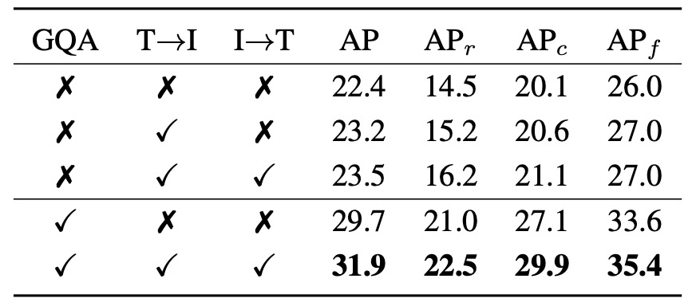

## 名詞の追跡者

[**YOLO-World: Real-Time Open-Vocabulary Object Detection**](https://arxiv.org/abs/2401.17270)

---

YOLO を代表とする物体検出の時代において、速度と効率はもはや新しい議題ではありません。

真に厄介なのは、クラスの閉鎖性です。

## 問題の定義

過去 10 年間で、物体検出の進歩はまさに劇的でした。

我々は R-CNN シリーズが段階的に二段階検出の規則的世界を構築するのを見、SSD や RetinaNet が処理を簡素化し、ピクセル単位で各アンカーに対して対象を問う様子を見ました。また DETR がクエリ設計と Transformer を導入し、「検出」が単なる位置特定ではなく、意味と対話し始めたことも目の当たりにしました。

これら全てのアーキテクチャの中で、YOLO シリーズは常に独自の存在です。

それは計算コストを絶えず圧縮し、極めてシンプルな構造でリアルタイム推論の限界に挑みます：**速く！もっと速く！非常に速く！**

しかし、こうした技術の交代の中で、ほとんど動かされていない事実が一つあります：

> **ほぼすべての主流検出モデルは、依然として「固定語彙」の世界に生きている。**

学習データがモデルが話せる言語を定義し、データセットに「凧（たこ）」がなければ、モデルは凧の姿を識別することを学びません。COCO には 80 カテゴリ、Objects365 には 365 カテゴリありますが、現実世界にはもっと多くの物体が存在し、データセットには名前すらありません。

我々はどのようにしてモデルに「辞書を開く」能力を持たせることができるでしょうか。既知の選択肢の中だけで答えるのではなく。

**Open-Vocabulary Object Detection**（以下 OVD）はまさにこのボトルネックを解決するために誕生しました。固定クラスの境界を超え、単なる画像とラベルの対応を記憶するだけでなく「意味」を理解することを目指しています。

しかし、OVD の試みは毎回多大なコストを伴います。

## 問題の解決

<figure style={{ "width": "90%"}}>

</figure>

YOLO-World のアーキテクチャは上図のとおりです。

YOLO シリーズの慣例である全体設計を保ちつつ、画像はバックボーンでエンコードされ、多尺度特徴融合モジュールへ送り込まれ、最終的に予測ボックスと物体表現を出力します。しかし従来の閉鎖クラス設定とは異なり、YOLO-World は言語エンコーダーとクロスモーダル融合モジュールを導入し、オープンボキャブラリー検出タスクに対応可能な構造としています。

全体の流れは以下の通りです：

1. ユーザー入力のプロンプト（記述文、名詞群、クラスリストなど）が CLIP のテキストエンコーダーで意味ベクトルに変換される。
2. 画像は YOLOv8 の画像エンコーダーで処理され、多尺度画像特徴を抽出する。
3. その後、新規提案の RepVL-PAN を通じて言語特徴と画像特徴を整合・融合させる。
4. 最終的に decoupled head がバウンディングボックスと物体意味表現を同時に出力し、入力語彙と照合する。

この設計により、YOLO-World は固定クラス分類器に依存せず、意味的なマッチングで画像中の入力プロンプトに最も合致する領域を見つけられます。したがって推論段階で語彙を柔軟に切り替え、訓練に存在しなかった物体も処理可能です。

この構造の下で、物体検出は「どのクラスか予測する」から「ここがある語で表現されるものかどうかを判断する」へと変わり始めます。

次に RepVL-PAN の設計を詳しく見ていきます。

### RepVL-PAN

<figure style={{ "width": "70%"}}>

</figure>

図のように、YOLO-World が提案する RepVL-PAN（Re-parameterizable Vision-Language Path Aggregation Network）は、YOLO の多尺度特徴融合段階での画像と言語の相互作用を強化するモジュールです。

従来の PAN は画像特徴間の上下伝播と融合のみを扱いますが、オープンボキャブラリー検出では視覚信号だけで意味マッチングを完結できません。そこで RepVL-PAN は元の画像特徴フローに言語情報を注入し、意味が特徴マップ生成に浸透するように設計されています。

主な 2 つのキーパーツ：

1. **Text-guided CSPLayer**

   YOLO の構造内で CSPLayer は特徴の安定性とチャネル表現力を維持する改良残差積層モジュールです。YOLO-World では語彙意味に応じて各層特徴を調整するテキスト誘導版 CSPLayer を設計しました。

   具体的には、あるスケールの画像特徴 $X_l \in \mathbb{R}^{H \times W \times D}$ とテキストエンコーダからの語彙埋め込み集合 $W = {w_j}_{j=1}^C$ に対して、各位置と意味の類似度を計算し、シグモイド関数で注意重みを形成します：

   $$
   X_l' = X_l \cdot \delta\left( \max_{j \in \{1..C\}} (X_l W_j^\top) \right)^\top
   $$

   ここで $\delta(\cdot)$ は極端な値を抑えるためのシグモイド関数です。この設計により各位置の画像特徴は意味情報に基づき加重され、語彙対応性の高い特徴マップ $X_l'$ が生成されます。

   強化された画像特徴は元の CSPLayer 出力と結合され、次層 PAN ネットワークに送られ、意味に敏感なピラミッド表現を段階的に構築します。

2. **Image-Pooling Attention**

   言語が画像に影響するだけでなく、YOLO-World は画像情報が言語表現を補完する逆経路も設計しました。これは Image-Pooling Attention で実現されます。

   具体的には、各スケールの画像特徴をプーリングして複数の領域ベクトル（例：$3 \times 3$パッチトークン計 27 個）に圧縮し、これらのパッチトークン $\tilde{X} \in \mathbb{R}^{27 \times D}$ を Key と Value にして元の語彙埋め込みに対しマルチヘッド注意で更新します：

   $$
   W' = W + \text{MultiHeadAttention}(W, \tilde{X}, \tilde{X})
   $$

   こうして語彙埋め込みは静的な意味ベクトルではなく、現在の画像文脈を含む意味表現となり、語彙と画像内容の対応力を強化します。

---

この二つの設計は、言語が画像に浸透し、画像が言語を磨くという対称的な意味的フィードバックループを形成します。

最終的にこれら更新された言語特徴と画像特徴は物体検出過程に共に参加し、固定クラス分類器に依存しなくとも安定した意味マッチングを実現します。

また、この仕組みの鍵の一つは再パラメータ化（re-parameterization）に対応していることで、推論時にオフライン語彙を直接モデル重みに変換し、CLIP エンコーダを除去し、計算コストを大幅に削減できる点です。

### 事前学習戦略

言語と画像は異なるモダリティですが、モデルに「語彙が指す対象」を理解させるには、最終的に一つのことを実現しなければなりません：

> **語彙と画像領域の対応関係。**

YOLO-World は region-text 対比学習戦略を採用し、モデルに「ここは犬である」と識別させ、「ここは犬に似ている」だけではないことを学習させようと試みています。

この能力を訓練するために、著者は訓練データの形式を再構築し、各注釈サンプルを以下のように表現しました：

$$
\Omega = \{(B_i, t_i)\}_{i=1}^N
$$

ここで $B_i$ は画像中の第 $i$ 番目の領域のバウンディングボックス、$t_i$ はそれに対応する語彙です。

この語彙はクラス名の名詞であってもよく、記述から抽出した名詞句（noun phrase）であっても構いません。

### 対比学習

フォワードフェーズでは、YOLO-World は各訓練画像に対して$K$個の物体領域を予測し、それぞれに表現ベクトル $e_k$ を持ちます。同時にテキストエンコーダーは入力語彙集合 $T$ から対応する単語ベクトル ${w_j}$ を生成します。

これらベクトル間の類似度を意味のあるものにするため、モデルは以下の式で計算します：

$$
s_{k,j} = \alpha \cdot \text{L2Norm}(e_k) \cdot \text{L2Norm}(w_j)^\top + \beta
$$

ここで $\alpha, \beta$ は訓練安定化のための学習可能なスケールとバイアスパラメータ、L2 正規化は主に方向性（意味）を反映させるために用いられ、スケールの大小は除外されます。

この類似度行列を用いて、モデルは語彙分類タスクを意味的マッチングタスクに変換し、**region-text contrastive loss** を次のように計算します：

$$
\mathcal{L}_{\text{con}} = \text{CrossEntropy}(s_{k,j}, y_{k})
$$

### タスクの分離

全体の訓練過程では、YOLO-World は COCO のような注釈付きデータセットだけでなく、grounding タスクや image-text ペアデータセットのサンプルも使用します。

データ品質の違いを考慮し、著者は指示変数 $\lambda_I$ を用いてボックス回帰損失の使用を制御しています：

- 画像 $I$ が検出や grounding データの場合は IoU 損失と distributed focal loss を計算。
- 画像 $I$ が CC3M などの image-text データの場合は意味マッチングの contrastive loss のみ計算。

全体の損失は次の通りです：

$$
\mathcal{L}(I) = \mathcal{L}_{\text{con}} + \lambda_I \cdot (\mathcal{L}_{\text{iou}} + \mathcal{L}_{\text{dfl}})
$$

この設計により、YOLO-World は品質や出所の異なるデータを柔軟に扱い、汎化能力を維持しつつボックス回帰の精度も保っています。

### 自動注釈

しかし YOLO-World が大規模事前学習を可能にした本当の鍵は、pseudo-labeling（疑似ラベリング）戦略です。

CC3M のような大規模 image-text データセットは豊富な記述を持つ一方で、注釈ボックスがありません。人工的な注釈に依存するのは非現実的です。

そこで YOLO-World は三段階の自動注釈プロセスを採用しました：

1. **単語抽出**：記述から名詞句を抽出（例："a dog running in the park" → "dog", "park"）。
2. **ボックス生成**：事前学習済みの GLIP モデルを用いて、抽出した語彙に基づき画像中に予測ボックスを生成。
3. **フィルタリング**：CLIP で語彙と領域画像の類似度を評価し、信頼性の低い pseudo pair を除去、さらに NMS で冗長ボックスを削除。

最終的に、著者は CC3M から 246,000 枚の画像を整理し、82 万件の pseudo region-text 注釈を生成、YOLO-World の訓練における重要なデータソースとしました。

## 討論

論文の実験設計は、zero-shot、fine-tuning、open-vocabulary segmentation の 3 つの側面を網羅し、YOLO-World の汎化能力、実用価値、拡張性を検証しています。

ここでは主要な結果をいくつか抜粋し、詳細は原論文を参照ください。

### 小規模モデルの汎化能力

<figure style={{ "width": "90%"}}>

</figure>

著者は LVIS データセット上で zero-shot 評価を行い、結果は上図の通りです。括弧内の数値は再パラメータ化前のモデルサイズを示し、推論時にテキストエンコーダが除去され遅延と計算負荷がさらに軽減されていることを意味します。

fine-tuning を一切行わず、YOLO-World-L は LVIS minival にて **35.4 AP / 52 FPS** を達成し、多くの大型アーキテクチャ（GLIP や Grounding DINO など）を精度面で上回るだけでなく、速度面でも実質的にリードしています。

さらに重要なのは、この結果が TensorRT や FP16 の高速化を用いず、純粋な V100 環境で得られたものであり、モデル推論プロセス自体の高効率を示している点です。

この結果からいくつか注目すべき観察があります：

- 大型言語モデルのプロンプトや特殊なヒント技術、後処理を用いずとも、**1000 超の語彙に対し安定した検出が可能**であり、語彙アライメントと意味表現の品質が一定水準に達していること。
- YOLO-World-S は最小構成で **13M パラメータ** にもかかわらず **26.2 AP** を達成し、中規模モデルと遜色ない性能を示しており、構造のスケーラビリティと軽量利用の可能性を証明。

従来の open-vocabulary 検出モデルは巨大なモデル規模や言語モジュールへの依存性により、実用的な展開が難しいケースが多かったが、本結果は汎化能力を犠牲にせずに open-vocabulary 検出を「エッジリアルタイム推論」の範疇に引き込んだ初の例です。

### モジュールのアブレーション実験

<figure style={{ "width": "70%"}}>

</figure>

YOLO-World における RepVL-PAN モジュールの寄与を検証するため、著者は 2 つのコアモジュールに関するアブレーションを設計しました：**Text-guided CSPLayer（T→I）** と **Image-Pooling Attention（I→T）**。それぞれ言語から画像への影響と画像から言語へのフィードバック経路を表します。

表は LVIS での zero-shot 検出性能を 5 設定で示し、

- 「T→I」は Text-guided CSPLayer の有効化、
- 「I→T」は Image-Pooling Attention の有効化、
- 「GQA」は事前学習に言語豊富な GQA データセットを導入したかを意味します。

実験は 2 段階に分かれます。

まず GQA なしの事前学習では、

- **言語モジュールなし（baseline）** 時、AP は **22.4**、rare カテゴリ($AP_r$)は **14.5**。
- **T→I 有効化** で AP は **23.2**、$AP_r$は **15.2** にわずかに向上。
- **T→I と I→T の両方有効化（双方向融合）** で AP は **23.5**、$AP_r$は **16.2** と明確に上昇し、低頻度語彙処理への相乗効果を示す。

これは、事前学習データに豊富な語彙注釈がなくとも、言語モジュールが YOLO に安定した意味アライメント能力を付与していることを示唆。

次に GQA 導入後は、

- GQA のみで言語モジュール無効時に AP は **29.7**、$AP_r$は **21.0** と顕著改善し、GQA の語彙情報が意味認識に寄与することを示す。
- 両言語モジュールと GQA を併用すると最高スコア **31.9 AP / 22.5 AP_r** を達成し、frequent と common カテゴリもそれぞれ **29.9 / 35.4** を記録。

まとめると、

- **T→I は early fusion の語彙指向能力** を提供し、画像特徴を初期から意味に沿わせる。
- **I→T は contextual feedback を補い**、語彙埋め込みを画像文脈に近づける。
- 意味密度の高い事前学習（GQA）では両モジュール効果がさらに顕著化。

これにより YOLO-World は単なるバックボーン積み重ねではなく、PAN 構造に双方向の言語融合経路を設置し、開放語彙に対して安定かつ繊細な意味アライメントを実現しています。

### エンコーダの微調整戦略

<figure style={{ "width": "70%"}}>

</figure>

語彙埋め込み生成には CLIP-base と BERT-base の 2 種のテキストエンコーダを採用し、frozen 状態と fine-tuned 状態の性能比較を行いました。

結果は以下の通りです：

- エンコーダを frozen とした場合、**CLIP-base は BERT-base を大きく上回る**。LVIS の rare カテゴリで差は最大 **+11.1 AP**（14.5 対 3.4）、総合 AP も **14.6→22.4** に上昇。
- BERT-base を微調整すると性能が向上し、AP は **18.3**、rare は **6.6 AP** に改善するも、frozen CLIP には及ばず。
- 逆に CLIP を微調整すると性能が低下し、AP は **22.4→19.3**、$AP_r$は **14.5→8.6** に大幅悪化。

これらは次の示唆を与えます：

- CLIP は大規模画像テキストペアで事前学習されており、視覚文脈に敏感な意味表現を持つため、zero-shot タスクでパラメータ更新不要でも強い汎化力を示す。
- 一方 BERT は言語理解に優れるが画像と共訓練されていないため、視覚実体より抽象的概念に偏り、タスク適応に微調整を要する。
- CLIP の微調整は語彙分布が限定的なデータセットで行うと、本来の意味空間の広さを損ない、open-vocabulary 検出の語彙汎化能力を害する恐れがある。

したがって open-vocabulary 検出設計では、**言語モジュールの「意味の広さ」が「局所的適合」より重要**であり、過度な調整は未知語彙の意味的揺らぎを失わせるリスクをはらみます。

### 下流タスクへの拡張性

<figure style={{ "width": "90%"}}>

</figure>

YOLO-World は検出にとどまらず、**Open-Vocabulary Instance Segmentation（OVIS）** へも拡張されています。すなわち、「何か」を検出するだけでなく「輪郭を描く」ことも要求されます。

実験は以下の 2 つの設定に分かれます：

1. **COCO → LVIS**：COCO（80 クラス）で事前学習し、1203 クラスへの転移性能を測定。
2. **LVIS-base → LVIS**：866 クラスの LVIS-base で訓練し、rare 含む全クラス（337 rare）への汎化を評価。

訓練戦略は 2 種類：

- **segmentation head のみ微調整**：検出バックボーンを維持し、事前学習済みの語彙汎化能力を保持。
- **全モジュール微調整（All）**：分割タスク文脈を包括的に学習するが、zero-shot 柔軟性を犠牲にする可能性。

segmentation head のみ微調整の場合、

- COCO 事前学習では YOLO-World-L が **16.2 AP / 12.4 $AP_r$**。
- より語彙密度高く詳細な LVIS-base で **19.1 AP / 14.2 $AP_r$** に向上。

これは segmentation head が意味事前学習知識を吸収し、バックボーンを変えずとも open-vocabulary 分割タスクに適応できることを示します。

全モデル微調整を許可した場合、

- LVIS-base 訓練下で YOLO-World-L は **28.7 AP** に大幅向上。
- しかし、$AP_r$は 14.2 から 15.0 に僅かに増加し、box $AP_r$は逆に 0.6 低下。rare クラスの語彙汎化能力は低下の兆候。

この結果は典型的な open-vocabulary 課題を示します：

> **特定タスクへの適合を強めるほど、異文脈間の転移能力を犠牲にしやすい。**

全体精度を重視すれば全モデル微調整が有効だが、未知クラスへの安定した意味対応を保つなら、事前学習済み意味構造の維持が望ましい。

マルチモーダルシステムにおいて、**精度と汎化は動的なトレードオフであり、両立が無限に可能な目標ではない**。場面に応じた重み調整が今後の重要な設計選択となるでしょう。

## 結論

RepVL-PAN の双方向融合メカニズムにより、語彙は単なる予測ラベルではなく特徴構築過程に深く関与します。この設計は言語モデルが補助でも画像モデルが主役でもなく、対等な協働構造を成しています。

開発者にとって YOLO-World は次の指針を示します：

- **言語と視覚の融合は大規模マルチモーダルモデルを待つ必要はない。**

  適切な設計と精練された構造で、速度重視の YOLO フレームワーク内でも汎用的な意味アライメントが可能。

- **open-vocabulary タスクはオフラインパイプラインに限定されない。**

  RepVL-PAN のようなモジュールにより、限られたリソース環境でも「語彙定義」を認識できる検出モデルの実装が可能に。

- **再パラメータ化言語モジュール構造は実用的なトレードオフ設計。**

  意味の汎用性を保ちつつ推論コストを制御し、大量展開やエッジデバイスへの導入に不可欠。

本論文の貢献は単に CLIP を YOLO に組み込むことに留まらず、特徴経路レベルで言語と視覚の交差方法を再考し、再パラメータ化設計によって意味アライメントを展開コストの負担から解放しました。

語彙と視覚の融合はもはや高コスト構造の特権ではありません。
