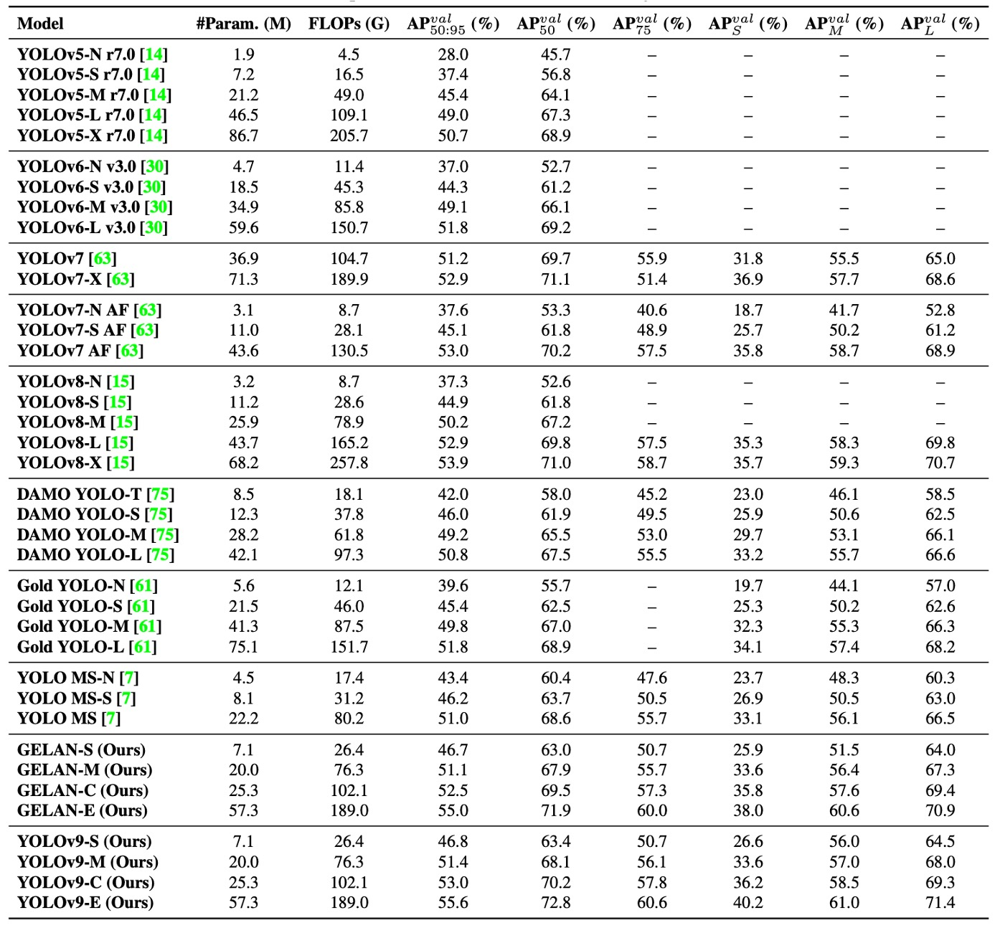

## 制御可能な勾配フロー

[**YOLOv9: Learning What You Want to Learn Using Programmable Gradient Information**](https://arxiv.org/abs/2402.13616)

---

YOLOv8 も論文が発表されていない？

そうであれば、引き続き YOLOv9 の論文を読みましょう。こちらも台湾の中研院が発表した作品です。

## 問題の定義

近年、YOLO シリーズはリアルタイム物体検出分野の事実上の標準となっています。YOLOv3 から YOLOv7 まで、継続的に進化したアーキテクチャ設計により、精度と推論速度の間で良好なバランスを実現し、監視、交通、AR/VR など多様なシーンで広く活用されています。

これらのモデルは主に CSPNet や ELAN をバックボーンモジュールとして採用し、PAN/FPN で特徴融合を行い、YOLO ヘッドや FCOS ヘッドを用いてマルチスケール予測を行います。RT-DETR のような新興の Transformer 構造もありますが、効率性やデプロイ面では依然として YOLO シリーズを超えられていません。

しかし、モデルがますます複雑化する中で、研究者たちは次第に気づきました。収束品質に影響を与える問題は単にアーキテクチャ設計や損失関数の選択だけではなく、より深いボトルネックは情報伝達経路に隠されていると。

> **現代の深層ニューラルネットワークの真の挑戦は、訓練過程における情報のボトルネック（Information Bottleneck）にあります。**

入力データが深層ネットを層ごとに通過する際、元の意味情報は何度も圧縮・変換され、中間層で既に希薄化あるいは失われていることが多いです。この意味情報の劣化現象は、モデル後半の特徴量が目的と正しく関連付けられにくくなり、不安定な勾配を生み、収束が遅く、精度が低下し、場合によっては有効な訓練ができなくなります。

業界ではこの問題に対処するため、主に三つの技術的アプローチが提案されています：

- **可逆的アーキテクチャ**：逆関数を設計し、各層の操作後でも入力情報を完全に保持できるようにする。代表例は RevNet や Res2Net であり、理論上は情報損失を回避できるものの、複雑な構造と追加計算コストが推論効率を制限しています。
- **マスクモデリング（Masked Modeling）**：MAE や BERT が採用する戦略で、マスクされた領域の再構築を通じて重要な意味を学習させる。しかし多くは大規模 Transformer 向けに設計されており、軽量モデルに適用するとパラメータ不足により意味の安定的な復元が難しいです。
- **深層監督（Deep Supervision）**：中間層に補助的な監督信号を挿入し、意味の一貫性を維持させる。この手法は学習の安定性を高める一方、誤った情報の累積を招きやすく、実際には非常に深いネットワークでのみ有効であり、小規模モデルにはむしろ悪影響を及ぼします。

以上の技術はそれぞれ長所があるものの、「情報保持」と「軽量かつ高効率」を同時に満たすことはできず、特にパラメータが限られたリアルタイム用途のモデルにとって、情報ボトルネックは依然として大きな障壁となっています。

:::tip
**「可逆的アーキテクチャ」とは何か？**

可逆的アーキテクチャ（Reversible Architecture）とは、ニューラルネットワーク設計において、順伝播の過程で情報が失われないことを保証する構造です。つまり、ある層の出力が分かれば、その入力を完全に復元できるということです。

詳細な設計理念は以下の論文をご参照ください：

- [**[22.12] Reversible Column Networks**](https://arxiv.org/abs/2212.11696)
  :::

### なぜ意味情報は失われるのか？

従来、モデルの収束困難は「勾配消失」や「勾配飽和」に起因すると考えられてきましたが、BatchNorm や ReLU などの技術によりこれらの問題は大幅に緩和されました。真の問題は「勾配生成に必要な意味情報そのものが既に存在しない」という点にあります。

**情報ボトルネック原理**によれば、データがネットワークの各層で変換されるにつれて、目的タスクとの相互情報量は減少します：

$$
I(X, X) \geq I(Y, X) \geq I(Y, f_θ(X)) \geq \dots \geq I(Y, \hat{Y})
$$

ここで、$I(Y, X)$は入力データに含まれる目的タスクに関連した意味情報を表します。

もしこの情報が順伝播の過程で希釈されると、全体的な情報損失が小さくても、モデルは真に有用な目的関数を学習できなくなります。この現象は**軽量モデルに特に顕著**であり、パラメータ数が少ないために完全な特徴表現が困難で、意味信号がより容易に圧縮・消失してしまいます。

モデル容量を拡大して改善を試みることも可能ですが、「幅を広げて浅くする」アプローチは症状の緩和にしかならず、意味情報の損失や勾配の質の悪化を根本的に解決することはできません。

### 可逆関数の可能性

可逆関数は理論的な解決策を提供します。

ある変換関数 $r_ψ$ に対して逆関数 $v_ζ$ が存在し、以下を満たすならば：

$$
X = v_ζ(r_ψ(X)),\quad I(X, X) = I(X, r_ψ(X)) = I(X, v_ζ(r_ψ(X)))
$$

これは変換過程で情報が失われていないことを意味し、意味信号の完全な流通を保証できます。

しかし実装面では、多くの可逆アーキテクチャが複雑さや学習の不安定性、汎用性の低さといった問題を抱え、リアルタイムタスクへの本格的な適用は困難です。

したがって、我々は以下を満たす新たなアプローチを必要としています：

- **軽量アーキテクチャに適用可能**
- **推論時に追加コストなし**
- **タスク損失や構造モジュールと柔軟に組み合わせ可能**

これらの要求を踏まえ、本稿の著者は情報ボトルネック問題を解決するための革新的な概念を提案しました：

> **Programmable Gradient Information（PGI）**。

続けて見ていきましょう。

## 解決問題

<figure style={{ "width": "90%"}}>

</figure>

情報ボトルネックと勾配品質低下の問題を解決するために、著者は新しい訓練アーキテクチャ：**Programmable Gradient Information（PGI、可編程勾配情報）**を提案しました。

上図のように、この構造は過去の手法（PAN、RevCol、Deep Supervision など）からの経験を活かし、**訓練時に意味情報の欠落を補い、推論時には追加コストなしで展開できる**戦略を設計しています。

### 設計理念

PGI は以下の 3 つの重要なコンポーネントで構成されます：

1. **メインブランチ（Main Branch）**

   - 元のモデル構造であり推論を担当。
   - 実際の展開時にはこの部分のみを保持し、推論効率を維持。

2. **可逆補助ブランチ（Auxiliary Reversible Branch）**

   - 訓練段階で追加の勾配を提供し、情報ボトルネックにより失われた意味特徴を補完。

3. **多階層意味統合（Multi-level Auxiliary Information）**

   - 異なるスケールの予測ヘッドからの監督信号を統合・再構成し、メインブランチに全体的な意味整合性のある勾配を提供。

図 (b) に示されるように、RevCol のような可逆構造は情報完全性を保持できますが推論遅延が大きいです。著者は「メインブランチを可逆化するよりも、訓練時に可逆補助ブランチを導入するほうが良い」と観察しました。

図 (d) はその設計例です。

訓練時、この補助ブランチは入力データの完全な意味経路を模倣し、メインブランチへ明確かつ信頼できる勾配信号を提供します。たとえメインブランチの特徴が圧縮・希釈されても、補助ブランチから正しい修正が得られます。

### 多階層意味統合

従来の深層監督（図 (c)）では各層特徴が異なるタスク（小物体、大物体検出など）に割り当てられ、意味の矛盾を招きます。例えばある層が小物体に注力し大物体を無視すると、メインブランチは重要領域を誤って背景と認識し、訓練信号が歪みます。

この問題を解決するため、PGI は **多階層意味統合モジュール** を導入し、予測ブランチからの勾配をメインブランチに返す前に意味融合ネットワークで統合します。

この設計の利点は：

- 各層特徴が単一物体スケールに限定されず、完全な意味を学習可能。
- 異なる予測ヘッド間の監督衝突を解消。
- 融合構造をカスタマイズでき、意味の深さや範囲を柔軟に調整可能。

PGI により「深層監督」は単なる多点損失ではなく、**多意味整合性を持つ融合訓練戦略**となりました。

### Generalized ELAN

<figure style={{ "width": "90%"}}>

</figure>

PGI フレームワークの能力を最大限に引き出すため、YOLOv9 は新たなバックボーン構造

- **Generalized ELAN（GELAN）**

を同時に導入しました。

図の通り、GELAN は CSPNet と ELAN のアイデアを組み合わせており、

- **CSPNet** はブランチ型勾配制御を提供し特徴再利用を向上、
- **ELAN** は深層畳み込みの積み重ねによる効果的集約を実現しています。

GELAN はさらに ELAN の計算ユニット設計を一般化し、通常畳み込み、深度方向畳み込み、アテンションモジュールなど任意の計算モジュールをサポート、各プラットフォーム条件に応じて最適化可能です。

利点は：

- **モジュール化設計**：スマホ、組み込み機器、サーバ推論に対応可能。
- **安定した勾配経路**：構造上で信号通過機構を内蔵し、PGI と高い親和性を持つ。
- **軽量かつ高効率**：深度方向畳み込みなしでも高いパラメータ効率を実現。

GELAN はメインバックボーンとして PGI の効果を促進し、高効率かつ拡張性のある基盤を築いています。

## 議論

提案された **PGI 訓練機構** と **GELAN 構造** の実用性および汎化能力を検証するために、著者らは MS COCO 2017 データセット上で完全な実験を実施し、現存する複数の最先端リアルタイム物体検出モデルと比較しました。

本研究は YOLOv7 の訓練規則に従い、MS COCO 2017 の標準データセット分割を用いています。全モデルはゼロから訓練され、訓練は合計 **500 エポック**、初期 3 エポックは **リニアウォームアップ** を採用し、その後の学習率はモデル規模に応じた減衰戦略が設計されています。

最終学習の安定化のため、最後の 15 エポックでは **Mosaic データ増強技術** を停止しています。

YOLOv9 の実装は以下の 2 つのバージョンに分かれています：

- **YOLOv9-C / YOLOv9-E**：それぞれ YOLOv7 および Dynamic YOLOv7 を基に構築。
- 元の YOLOv7 で用いられていた **ELAN モジュール** を提案された **GELAN** に置換し、計算単位には **RepConv と CSPNet ブロック** を使用。
- ダウンサンプリングモジュールを簡素化し、Anchor-Free 予測ヘッドも最適化。
- PGI の補助監督設定は YOLOv7 の構造を完全に継承し、多分岐特徴学習設計を保持。

### 既存手法との比較

実験結果は上表の通りで、YOLOv9 は様々なタスク条件下で現行の同等級リアルタイム物体検出モデルを凌駕し、パラメータ数、計算コスト、最終精度いずれにおいても優位を示しています：

- **軽量モデル**（例：YOLO MS-S）に対し、同等精度を維持しつつ、**パラメータ数は約 10%削減**、**計算コストは 5〜15%低減**され、エッジコンピューティング環境での実用性を証明。
- **中規模モデル**（YOLO MS）でもコスト優位性を維持しつつ、精度は **0.4〜0.6% AP 向上**。モデル規模が小さくても優れた効率性を発揮。
- 主流モデル YOLOv7 AF と比較し、YOLOv9-C はパラメータ数を **42%削減**、計算量も **22%減少**。それでいて同等の AP（53%）を達成し、PGI による訓練品質向上を示す。
- 大型モデル YOLOv8-X と比較すると、YOLOv9-E はパラメータ数を **16%減少**、計算量を **27%減少** させつつ、**1.7% AP 向上**。効率的設計と意味的訓練の相乗効果を証明。

これらの結果は、YOLOv9 が**いかなる事前学習モデルや外部データセットに依存せず**、各種リアルタイム物体検出アプリケーションにおいて競争力のある性能を示し、PGI 訓練機構と GELAN 構造の実用性・拡張性を確証しています。

### GELAN 構造の分析

<figure style={{ "width": "70%"}}>

</figure>

まず、著者は GELAN の計算モジュールの交換可能性を調査し、以下 3 種の代替モジュールを比較しました：

- **ResNet ブロック**
- **DarkNet ブロック**
- **CSP ブロック**

結果は、ELAN の畳み込み単位をこれらに置換しても全体性能は安定し、GELAN の柔軟性と移植性の高さを示しています。特に **CSP ブロックは最高性能**を示し、精度を **0.7% AP 向上** させつつ、パラメータ数と計算量も削減。

したがって YOLOv9 は最終的に **CSP を GELAN の核単位として採用**し、性能と軽量化を両立。

さらに、異なるモデル規模における **ELAN モジュール深さ** と **CSP 積層深さ** の性能影響を検証。

<figure style={{ "width": "70%"}}>

</figure>

実験結果：

- ELAN の深さを 1 から 2 に増やすと精度が顕著に向上。
- しかし深さが 2 以上では、ELAN・CSP の積層数増加はパラメータ・計算量に比例した線形的性能向上のみで爆発的な効果はなし。

つまり **GELAN は過度な調整なしで安定性能を実現可能**で、用途や環境に応じた柔軟設計が可能。

実装上、YOLOv9 の各バージョンは以下の深度設定を採用：

- YOLOv9-S：ELAN 深さ 2、CSP 深さ 3
- YOLOv9-M / C：ELAN 深さ 2、CSP 深さ 1

### PGI 訓練戦略の分析

<figure style={{ "width": "70%"}}>

</figure>

PGI は可逆補助分支と多層意味統合の 2 大コンポーネントで構成。

両者について独立および併用のアブレーションを実施し、

- **可逆補助分支（ICN）** は **DHLC linkage** 設計により多層可逆情報を提供し、モデル性能の安定向上に寄与。
- **多層意味統合** は FPN と PAN で検証。PAN は伝統的深層監督（PFH）に似るが効果は非常に深いモデルで顕著。
- **PGI は全モデルサイズで効果を示し、特に ICN との組み合わせで安定性が高い**。設計が情報ボトルネックを補完できていることを示唆。

さらに、YOLOv7 の **Lead-Head Guided Assignment** 技術を PGI の補助監督経路に導入し監督品質を向上、学習効果を増強。

### モデル規模による比較

<figure style={{ "width": "70%"}}>

</figure>

PGI と従来の深層監督を各種モデル規模に適用した実験では、

- **浅いモデルでは深層監督が精度を低下させる傾向**があり、過度監督による特徴誤導が原因と推定。

一般的なモデルでは深層監督は不安定で過学習を招く可能性があるが、PGI は**規模を問わず安定して精度向上**、特に軽量モデルで顕著な効果を示した。

これにより PGI の 2 大貢献が裏付けられる：

1. **軽量・浅層モデルへの補助監督機構の成功適用**
2. **深層モデル訓練への信頼性の高い意味勾配注入による学習効率と収束品質の改善**

### コンポーネント統合の全体像

<figure style={{ "width": "70%"}}>

</figure>

最後に、**YOLOv7 ベースラインモデル**から**YOLOv9-E フルバージョン**まで、コンポーネントを逐次追加した実験結果を示す。

GELAN と PGI を段階的に導入することで、精度・性能・計算コストの全てにおいて明確な改善が認められ、両設計が YOLOv9 に包括的な飛躍をもたらしたことを実証。

## 結論

YOLOv9 の核心的イノベーションは、「勾配フロー」を**プログラム可能な情報伝達機構**に転換した点にある。

PGI によって、訓練は単なる受動的な逆伝播ではなく、能動的な計画へと変わる：

- 意味情報はどのように流れるべきか？
- 勾配はどこから来るべきか？
- 目標はどの層で学習すべきか？

バックボーン構造 GELAN と組み合わせ、YOLOv9 は高精度、低パラメータ数、柔軟な展開性という三大目標を同時に達成した。
