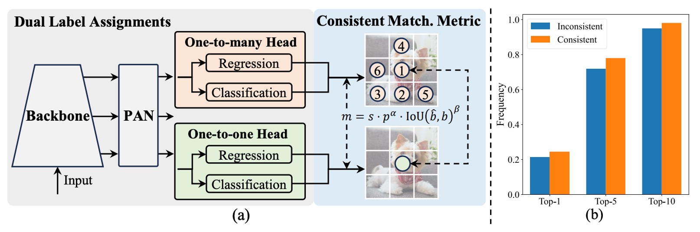
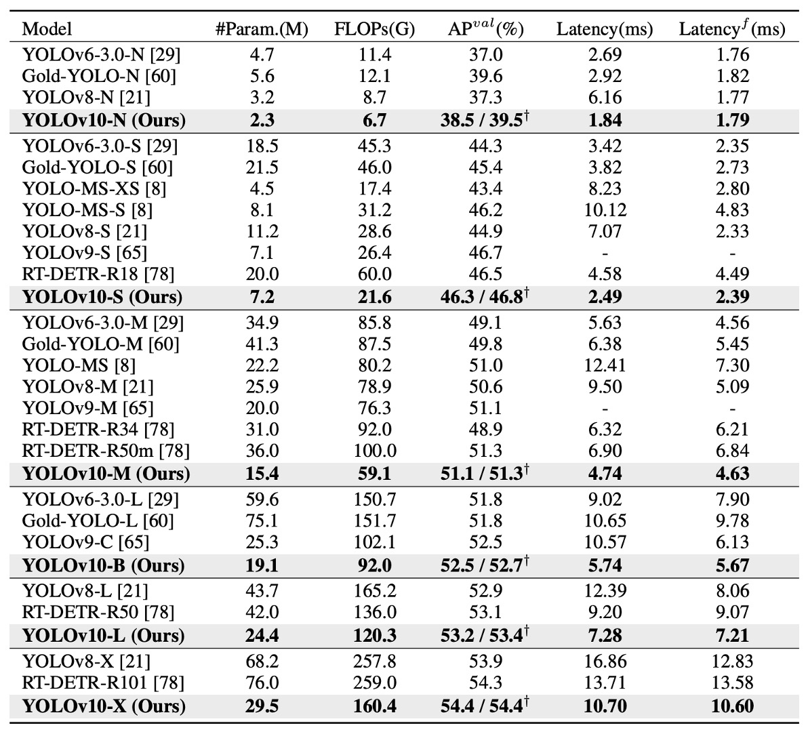
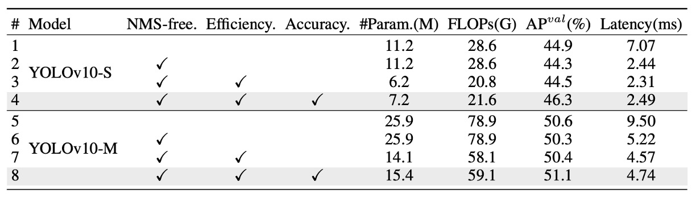

## NMS、さようなら

[**YOLOv10: Real-Time End-to-End Object Detection**](https://arxiv.org/abs/2405.14458)

---

私たちは YOLOv1 から YOLOv9 までを見てきました。

YOLOv10 に至り、ついに NMS の制約から解放されることができました。喜ばしいことです。

## 問題の定義

コンピュータビジョンの分野において、リアルタイム物体検出は欠かせない役割を果たしています。

自動運転車、産業用ロボット、AR/VR からエッジ端末でのリアルタイム解析システムまで、ほぼ全ての応用が極めて低遅延で、高い精度の分類と位置検出を同時に求めています。こうした要求を満たすために、研究コミュニティは次々と新しい手法を生み出し、様々な高効率検出器が雨後の筍のように登場しています。

YOLOv1 からは、バックボーン、ネック、ヘッドを一体化した構造により、従来の複雑な検出器設計を覆しました。

続く YOLOv3、YOLOv4 から YOLOv9 にかけては、**CSPNet**、**PAN**、**ELAN**、**GD** といったモジュールを導入し、特徴抽出や融合能力を継続的に最適化しています。さらに、**YOLOv6 の SimCSPSPPF**、**YOLOv7 の E-ELAN**、**YOLOv9 の GELAN + PGI** などの新技術が、速度を維持しつつ精度の限界を突破しようと試みられています。

しかし、どれだけ革新があっても、多くの YOLO モデルは後処理段階の非極大値抑制（NMS）に依存してしまっています。

これは、訓練段階で one-to-many のアノテーション方式を用いるため、推論時に NMS を使って最適な候補ボックスを選別する必要があるからです。これが遅延を増やし、ハイパーパラメータの感度を高めてしまい、真のエンドツーエンド推論を難しくしています。

NMS の制約から脱するために、DETR を筆頭とするエンドツーエンド構造が注目され始めました。

DETR は Transformer と Hungarian Matching による one-to-one ラベル割当てを行い、後処理に依存しなくなりました。Deformable-DETR、DINO、RT-DETR といった派生モデルも、収束速度や実行効率の改善を進めています。RT-DETR は、DETR をリアルタイム応用に成功させた最初の代表例として、一つの可能性を示しました。

しかし、これらの Transformer ベース設計は本当に CNN を代替できるのでしょうか？

実際には、DETR 構造は NMS を省略したものの、その前向き伝播の遅延は依然として伝統的な CNN 構造より明らかに大きく、特にエッジデバイスでは導入が難しいです。一方で、CNN モデル自身で one-to-one 対応を実現しようとする研究もあり、OneNet、DeFCN、FCOSpss などは各々のサンプル選択器やマッチング機構を提案し、エンドツーエンド検出を目指していますが、成果はまだ完全に満足できるものではありません。

**では、この二者択一から抜け出す可能性はないのでしょうか？**

盲目的に Transformer に追随するのでもなく、従来の YOLO 設計に拘泥するでもなく、「訓練時のアノテーション戦略」と「構造的な効率のボトルネック」という二つの鍵を再考しませんか？あるいは、CNN の利点を維持しながら、一貫性があり軽量で高速かつ高精度な新しいアーキテクチャを設計できないでしょうか？

この論文の著者は、YOLO シリーズがリアルタイム物体検出で直面する課題を根本から解決しようと試みました。

## 解決策

YOLOv10 の技術的な核は大きく二つの主軸に分かれます：

- 一つは、YOLO が NMS の束縛から解放され、真のエンドツーエンド推論に到達すること。
- もう一つは、ネットワーク各部の効率と精度を再評価し、構造そのものから計算の分布を再構築すること。

### 二重アノテーション構造

<figure style={{ "width": "90%"}}>

</figure>

上図の通り、YOLOv10 は従来の YOLO 構造のエンコーダ・デコーダ設計を維持しつつ、デコーダ側（すなわち検出ヘッド）に **one-to-one ヘッド** を追加し、従来の **one-to-many ヘッド** と並行動作させています。両者は同じ backbone と neck を共有し、構造的にほぼ対称です。

訓練時には、one-to-many ヘッドは TAL（Task-Aligned Label Assignment）を用いて伝統的な多重サンプルアノテーションを行い、各 ground truth に対して複数の正例を割り当てて監督密度を高めます。一方で one-to-one ヘッドは各 ground truth に対し予測ボックスを一つだけ割り当て、より正確なサンプルマッチングを学習します。

この設計により、モデルは訓練時に密かつ簡潔な監督信号の双方を享受し、最終的な推論では one-to-one ヘッドのみを残し、one-to-many ブランチを廃止して「NMS 不要」の真の出力フローを実現します。

しかし、二重アノテーションは潜在的な問題も引き起こします。二つのヘッドが異なるサンプルマッチングロジックを用いると、学習する監督信号にズレが生じ、訓練の方向性が分散してしまいます。

:::tip
**あれ、ここの部分、どこかで見たことがある気がしませんか？**

これはまさに H-DETR が行っていることでは？

- [**[22.07] H-DETR: 静かなクエリの反逆**](../2207-h-detr/index.md)

H-DETR では、DETR の one-to-one アノテーション方式を改良するために one-to-many ヘッドを導入し、多様なサンプル分布を学習可能にしています。

今振り返ると、YOLO と DETR シリーズは異なる方向から出発しつつ、最終的には同じ場所に辿り着いたと言えますね。🤣
:::

この問題に対し、著者はシンプルかつ効果的な対策を提案しました：

- **一貫したマッチング基準（Consistent Matching Metric）**。

二つのアノテーション戦略の本質的な違いはマッチングスコアの定義に起因しています。

YOLOv10 はこのスコアを以下の形で統一しています：

$$
m(\alpha, \beta) = s \cdot p^\alpha \cdot \text{IoU}^\beta
$$

ここで、

- $p$ は予測分類スコア、
- $\text{IoU}$ は予測ボックスと ground truth の重なり率、
- $s$ は空間的事前確率（spatial prior）、予測点が ground truth 内にあるかを示す指標、
- $\alpha$、$\beta$ は分類と位置情報の重みを調整するハイパーパラメータです。

もし二つのヘッドで異なる $\alpha$、$\beta$ を用いれば、同一サンプルのスコア順位が異なり、「監督信号の不一致」が起こります。

著者の戦略は、両ヘッドに同じマッチングパラメータを用いさせることで、監督信号を一致させることです。実装上は $\alpha=0.5$、$\beta=6$ をデフォルトとしています。

ここで次の疑問が湧きます：

> **この調整で本当に二つのヘッドは揃ったのでしょうか？**

上図（b）が実験による裏付けを示しています。

図は YOLOv8-S モデルで、one-to-one ヘッドが選択したサンプルが one-to-many ヘッドの Top-1、Top-5、Top-10 にも含まれている割合を示します。

色は設定の違いを表しています：

- オレンジ：不一致マッチング設定（$\alpha=0.5$、$\beta=2$）、
- 青色：一致マッチング設定（$\alpha=0.5$、$\beta=6$）。

結果は、一貫した設定で二つのヘッドの選択サンプル重複率が著しく向上し、特に Top-1 の一致度が顕著に改善されていることを示しています。つまり、one-to-one ヘッドが one-to-many ヘッドと同様に高品質な監督信号をより正確に学習できていることを意味します。

### 効率と精度の最適化

過去の YOLO シリーズは多くのモジュール革新を経てきましたが、全体構造設計の論理については体系的な検証が不足していました。そこで著者はグローバルな視点から効率と精度を同時に最適化し、計算コストの一単位ごとに最大限の価値を発揮できるよう試みました。

YOLO の構造は主に以下の四つに分けられます：

- Stem（初期畳み込み層）；
- Downsampling（ダウンサンプリング層）；
- Stage モジュールの積み重ね；
- Detection Head（検出ヘッド）。

Stem 自体の計算負荷は極めて小さいため、著者は後ろの三つに最適化の焦点を当てました。

1. **分類ヘッドと回帰ヘッド**

   YOLO では分類ヘッドと回帰ヘッドが通常同じ設計を共有しますが、詳細に分析すると両者の計算コストには大きな差があります。YOLOv8-S を例に挙げると、分類ヘッドの FLOPs は 5.95G、パラメータ数は 1.51M に達し、回帰ヘッドの約 2.5 倍の計算量と 2.4 倍のパラメータ量です。

   しかし著者の誤差感度解析によれば、**分類誤差が全体の mAP に与える影響は回帰誤差より遥かに小さい**ことが分かりました。そこで分類ヘッドを 3×3 の深さ方向畳み込み（DW Conv）2 層と 1×1 Conv 1 層に再設計し、基本的な分類能力を保ちつつ計算負荷を大幅に削減しました。

2. **空間とチャネルの分離ダウンサンプリング**

   従来のダウンサンプリングは stride=2 の 3×3 畳み込みを用い、空間解像度低減とチャネル増加を同時に行います。

   一見シンプルですが、計算コストは

   $$
   \mathcal{O}\left(\tfrac{9}{2}HWC^2\right)
   $$

   パラメータ数は

   $$
   \mathcal{O}(18C^2)
   $$

   に達します。

   著者はこれを分離設計に改め、まず pointwise（1×1）畳み込みでチャネル数を調整し、続けて depthwise（3×3）畳み込みでダウンサンプリングを実施しました。

   これにより計算コストは

   $$
   \mathcal{O}\left(2HWC^2 + \tfrac{9}{2}HWC\right)
   $$

   パラメータ数は

   $$
   \mathcal{O}(2C^2 + 18C)
   $$

   まで削減され、より多くの特徴情報を保持しつつ、前方伝播の高速化を実現しています。

- **Rank-Guided Block の設計**

    

    <figure style={{ "width": "90%"}}>
    
    </figure>
    

  YOLOv10 は YOLO モデル内部の構造冗長性を体系的に解析した初の研究です。

  各ステージの最終畳み込み層の重み行列に対し、**数値ランク（numerical rank）**を算出し、出力チャネル数 $C_\text{out}$ で正規化した $\tfrac{r}{C_\text{out}}$ を用いて評価。閾値は最大特異値 $\lambda_{\text{max}}$ の半分としました。

  図 (a) から、**モデルが深くなるほど冗長度が上がり、大きなモデルほどランクが低い**ことがわかります。

  これは後半のモジュールのパラメータ利用効率が極めて悪く、「同一構造を全体に適用すべきではない」という直感を裏付けます。

  そこで著者は新しいモジュール設計「Compact Inverted Block（CIB）」を導入。図 (b) に示す通り、空間混合は depthwise 畳み込みで、チャネル融合は pointwise 畳み込みで行い、計算コストを大幅に削減しました。

  さらに rank-guided な段階的置換戦略を採用。ランクが最も低いステージから順に CIB に置き換え、性能が落ちなければ次の層も置き換え、性能低下が見られれば置換を停止します。これによりモデルは規模に応じて最適な深さ・構造に自動調整され、最高の効率と精度のバランスを実現します。

### 精度志向の強化

効率化だけでなく、YOLOv10 は高次の意味的モデリングと広範囲の受容野による認識力も強化しています。

- **大きな畳み込み核：位置にのみ受容野拡大を適用**

  大きな畳み込み核は遠距離の信号や構造的背景情報を捉えるのに効果的で、深い段階での安全な適用が可能です。しかし全モデルに適用すると、小物体のテクスチャが損なわれ、高解像度層の処理が重くなります。

  そのため著者は深層の CIB に限定して、第 2 の depthwise 畳み込み核を 7×7 に拡大。さらに再パラメータ化技術で 3×3 の分岐を追加し、不安定な最適化問題を解消。推論時にはこの分岐を主経路に融合し、負荷を増やさずに済ませています。

  この大きな畳み込み核は小規模モデル（YOLOv10-S/N）にのみ用いられます。モデルが大きくなると受容野自体が広がるため、大畳み込み核の効果は減少します。

- **PSA モジュール：全注意機構が必要なわけではない**

  自己注意は強力なグローバルモデリング能力を持ちますが、その計算複雑度は $\mathcal{O}(HW^2)$ であり、リアルタイムモデルには向きません。そこで著者は **Partial Self-Attention（PSA）** モジュールを設計しました。

  特徴チャネルを半分に分割し、一方は多頭自己注意（MHSA）と FFN を通し、もう一方はそのまま保持。最後に concat して 1×1 畳み込みで融合します。高速化のために、

  - Q/K の次元を半減し、
  - LayerNorm を BatchNorm に変更、
  - 解像度が最も低いステージ 4 の後のみ挿入

  しています。

  この選択的自己注意により、YOLOv10 は最小限のコストでグローバル情報を導入し、分類精度と意味的一貫性を大幅に向上させました。

### 実装の詳細

本研究は YOLOv8 を基準モデルとして採用しました。理由は二つあります。まず速度と精度のバランスが優れており比較対象として代表的であること。次に複数モデルサイズを公開しており、公平な比較が容易であることです。

YOLOv10 は YOLOv8 のサイズ区分（N / S / M / L / X）を引き継ぎつつ、新たに **YOLOv10-B** を追加しました。これは YOLOv10-M の幅を拡張したモデルで、中間サイズの精度と容量のギャップを埋める目的です。

全モデルは **COCO データセット** 上で訓練・評価され、YOLOv8、YOLOv9 と同様に **スクラッチからの訓練設定** に従っています。

推論性能は全て **NVIDIA T4 GPU + TensorRT FP16 モード** で測定し、公正かつ比較可能な遅延数値を保証しています。

本研究の YOLOv10 モデルは全て **一貫した二重アノテーション訓練戦略** と **構造最適化版** を採用しており、一部の単一変更ではありません。

## 議論

### SOTA 手法との比較

YOLOv10 は複数のモデルサイズにおいて顕著な優位性を示しています。

上表の通り、元の YOLOv8 と比較して、5 つの代表的なサイズ（N / S / M / L / X）で：

- AP が 0.3%～ 1.4%向上；
- パラメータ数が 28%～ 57%削減；
- 計算量が 23%～ 38%減少；
- 推論遅延が最大 70%短縮。

つまり、同じかそれ以下のリソースで YOLOv10 はより高速かつ高精度を実現し、この傾向はモデルが大きくなっても維持されています。これは Rank-Guided Block や PSA といった効率化設計が軽量モデルだけでなく大規模モデルにも効果的であることを示しています。

モデル間比較では：

- **YOLOv10-N / S** は YOLOv6-3.0-N / S を大きく上回り、AP がそれぞれ 1.5 / 2.0 向上、パラメータと計算量は 50%以上削減；
- **YOLOv10-B / M** は YOLOv9-C と YOLO-MS に対し、精度を維持・向上させつつ遅延を 46% / 62%削減し、特に遅延が重要な環境に適応；
- **YOLOv10-L** は Gold-YOLO-L と比べてパラメータが 68%、遅延が 32%減少しながらも AP は 1.4%増加。

これらの結果は、旧 YOLO シリーズや最新の効率的 YOLO 派生モデルに対して、YOLOv10 がより優れた性能と資源効率を示すことを裏付けます。

さらに非 YOLO 系リアルタイム検出器と比較しても、

- **YOLOv10-S** は RT-DETR-R18 より 1.8 倍高速、
- **YOLOv10-X** は RT-DETR-R101 より 1.3 倍高速、
- かつ同等以上の精度を維持しています。

### アブレーション実験

<figure style={{ "width": "90%"}}>

</figure>

各モジュールの独立した寄与を検証するため、YOLOv10-S と YOLOv10-M に対して段階的なアブレーション実験を行いました。上表に示す通り、3 つのコア設計を順に加え、遅延・パラメータ数・計算量・精度への影響を評価しています。

まず YOLOv10-S では、**NMS-free 訓練（＝一貫した二重アノテーション戦略）** のみで、エンドツーエンド遅延を 4.63ms 大幅削減しつつ、**44.3% AP** を維持。性能と精度のバランスに優れることが確認されました。

次に、**効率重視の構造最適化** を YOLOv10-M に導入し、11.8M パラメータと 20.8 GFLOPs を大幅削減、遅延も 0.65ms 短縮。Rank-Guided Block や分離型ダウンサンプリングの効果が明確です。

最後に、精度向上モジュール（large-kernel 畳み込みと PSA）を適用。YOLOv10-S で 1.8 AP、YOLOv10-M で 0.7 AP 向上し、遅延増はそれぞれわずか 0.18ms / 0.17ms に抑えられ、高い性能向上対コスト比を示しました。

### NMS-free は本当に伝統手法を完全に置き換えられるか？

YOLOv10 は NMS-free 訓練で高性能かつ低遅延を達成しましたが、著者は正直に指摘します。従来の NMS と組み合わせた訓練に比べ、精度面で依然若干の差があります。

しかしこの差は固定的ではありません。

モデルが大きくなるほど、両訓練手法間の AP 差は縮小します。YOLOv10-X のような大型モデルでは差はほぼ無視でき、小型の YOLOv10-N では約 1.0% の差が残ります。

この差はどこから来るのか？

one-to-one アノテーションは one-to-many よりも強い識別特徴を必要とします。各 ground truth に対し一つの予測のみ割り当てられるため、特徴埋め込みが明確に分離されていないとマッチングが誤りやすく、監督信号が不安定になり、精度が落ちるのです。

この仮説を検証するため、以下の図を作成しました：

<figure style={{ "width": "90%"}}>

</figure>

COCO 検証セットにおける各アンカー特徴と他アンカーの平均コサイン類似度を解析。

結果は、モデルが大きくなるほどアンカー間の特徴類似度が低下し、特徴空間の分布が分散かつ識別的になることを示します。これは one-to-one マッチング成功の基盤です。

これから、小型モデルは容量制約により十分に分離された特徴空間を学べず、one-to-one 訓練の精度要求に応えにくい。一方大型モデルは識別性に優れ、one-to-many と差のない性能を発揮できると推論されます。

### なぜ軽量化しても性能は落ちないのか？

YOLOv10 の効率重視設計は、軽量化分類ヘッド、空間とチャネルの分離ダウンサンプリング、ランク誘導によるモジュール割り当ての三つの重要な改良を含みます。

これらの改良はパラメータ数・計算量を減らしつつ、ほぼ精度に影響を与えません。

具体的には、分類ヘッドの簡素化は全体の AP に影響しません。なぜなら誤差解析で性能ボトルネックは分類より回帰誤差に起因することが明らかだからです。ダウンサンプリングの改良は不要な特徴損失を防ぎ、0.7% の AP 向上をもたらしました。CIB と rank-guided 設計は重要モジュールの性能低下を回避し、冗長なステージのみ軽量構造に置換することで資源効率を高めました。

### 精度向上しながら遅延はほぼ不変？

効率化の後、YOLOv10 はさらに二つの精度重視モジュール、**large-kernel 畳み込み** と **Partial Self-Attention（PSA）** を導入しました。これらは受容野拡大と意味的モデリング強化を狙いながら、遅延増は極めて小さく、特に小型モデルに効果的です。

例として YOLOv10-S では、7×7 large-kernel と PSA によってそれぞれ 0.4% と 1.4% の AP 向上が得られ、遅延は 0.03ms と 0.15ms の微増に留まりました。

大型モデルは受容野が十分広いため large-kernel の効果は限定的で、小型モデル（YOLOv10-N / S）に限定して適用されます。

PSA は従来の Transformer より軽量で、YOLOv10-S では完全な MHSA より 0.05ms 速く、精度は 0.3% 高いです。これは PSA がチャネルの一部にのみ注意をかけ、冗長を減らしているためです。注意モジュール数が 1 の設定で、効率と精度の最良バランスを実現しています。

## 結論

YOLOv10 は NMS-free 訓練フローと全体構造の簡素化により、リアルタイム物体検出においてよりクリーンな推論パイプラインと優れた速度・精度のトレードオフをもたらしました。

開発者にとって最大の価値は**展開の簡素化**であり、NMS 処理の省略や演算子の集中により、TensorRT、ONNX Runtime など主流推論フレームワーク上での保守・最適化が容易になります。

一方で実際の現場からは二面性も報告されています：

- クラウド GPU や高性能 Jetson Orin では、YOLOv10-M/B が YOLOv8 と同等の AP を維持しつつ 30–40% の計算資源削減を実現し、多数同時ストリームや高並列環境に適する；
- NPU やモバイルデバイスでは、depth-wise や大核畳み込み、PSA など演算子のハード対応度に依存し、推論速度が YOLOv8 や YOLOv9 より劣る場合もある。

現状、NMS-free 訓練は最小モデルで約 1% の AP 差が残っており、小型モデルの特徴識別力向上が今後の課題です。

総じて、展開プラットフォームの演算子対応を踏まえ、使用前には必ず検証を行うことが重要です。
