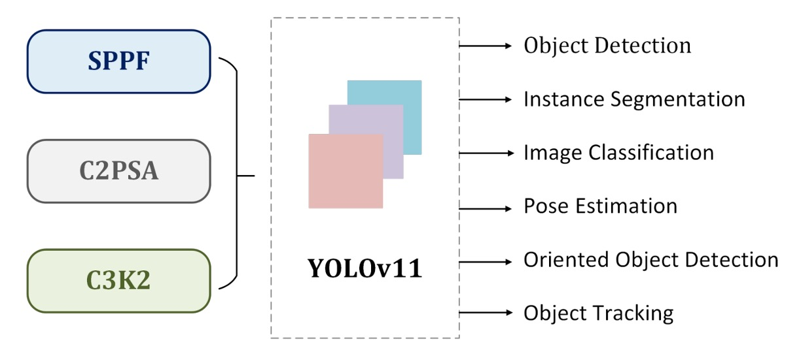

## エンジニアリング最適化版

[**YOLOv11: An Overview of the Key Architectural Enhancements**](https://arxiv.org/abs/2410.17725)

---

Ultralytics が新しいアーキテクチャを発表したときに論文が出るのは珍しいことだ。

何はともあれ、こういう動きは応援すべきだ。

## 問題の定義

物体検出の舞台で、**YOLO** という名前はすでに 10 年間叫ばれてきた。

2015 年、Redmon は「**You Only Look Once**」というスローガンを掲げ、従来主流だった 2 段階検出アーキテクチャをばっさりと捨て、検出を**回帰問題**として一度に分類と位置決めを完了させた。

それ以来、YOLO の各世代は「リアルタイム検出」の代名詞となっている。

しかし、YOLO ファミリーの進化とともに、2 つのコアな問題がすでに表面化していた：

1. **性能と速度のジレンマ**：小さなモデルは速いが精度が低い。大きなモデルは精度が高いが遅い。
2. **マルチタスクの統合**：検出、セグメンテーション、ポーズ推定、回転ボックス、これらのニーズは実務上同時に存在するが、これまでのバージョンではうまく統合できていなかった。

そこで Ultralytics チームは、YOLO を**万能なビジョンシステム**へと進化させようとした。

えっ？そんなに都合のいい話が？一緒に見てみよう。

## 問題の解決

<div align="center">
<figure style={{ "width": "90%"}}>

</figure>
</div>

YOLOv11 は YOLOv9 および YOLOv10 の設計基盤を継承しており、全体の構造は典型的な三段構成を保っている：

- **Backbone → Neck → Head**

徹底的な刷新はなかったものの、いくつかの局所的な改良を通じて、性能と効率のより安定したバランスを目指している。

### Backbone：小規模な置き換え

- **C2f → C3k2**

  以前よく使われていた C2f block が、新しい**C3k2 block**に置き換えられた。

  この変更の目的は単純に「**より速く、より省エネ**」を追求するため。大きな畳み込みを小さな畳み込みに分割し、より小さいカーネルで計算することで計算量とパラメータ数を減らす。効果としては、C3k2 はあまり精度を犠牲にせず、より良いレイテンシ-精度比を実現している。

  :::tip
  構造を描いてみると、大体同じだ。

  つまり、積み重ねていた部分を従来の Bottleneck から C3k モジュールに差し替えただけだ。

    <div style={{display:'flex', gap:'2rem', flexWrap:'wrap'}}>

        <div>
            <h4 style={{textAlign:'center'}}> C2f</h4>

            ```mermaid
            %%{init: {'theme':'base','themeVariables':{
            'fontFamily':'ui-sans-serif, system-ui, -apple-system, Segoe UI, Roboto, Noto Sans, Helvetica, Arial',
            'primaryColor':'#EEF2FF','primaryTextColor':'#0f172a','primaryBorderColor':'#4338ca',
            'lineColor':'#64748b','tertiaryColor':'#F1F5F9'
            }}}%%
            %% -------- C2f：Fast Dual-Conv Bottleneck --------
            flowchart TD
                X["x<br/>C_in × H × W"]
                C1["1×1 Conv<br/>BN + Act<br/>C_in → 2h"]
                SPLIT{{split<br/>2h → h,h}}
                Y0["y0<br/>h × H × W"]
                Y1["y1<br/>h × H × W"]

                subgraph STACK["Bottleneck_f × n"]
                    direction LR
                    Z1["z₁"] --> Z2["z₂"] --> Zn["zₙ"]
                end

                CAT["Concat<br/>y0, y1, z₁…zₙ<br/>(2+n)·h"]
                C2["1×1 Conv<br/>BN + Act<br/>(2+n)·h → C_out"]
                OUT["out<br/>C_out × H × W"]

                X --> C1 --> SPLIT
                SPLIT -->|skip| Y0 --> CAT
                SPLIT -->|stack| Y1 --> Z1
                Zn --> CAT
                CAT --> C2 --> OUT

                classDef tensor fill:#ffffff,stroke:#64748b,stroke-width:1px,rx:6,ry:6;
                classDef op     fill:#eef2ff,stroke:#4338ca,stroke-width:1px,rx:6,ry:6;
                classDef fuse   fill:#ecfccb,stroke:#65a30d,stroke-width:1px,rx:6,ry:6;
                class X,Y0,Y1,Z1,Z2,Zn tensor
                class C1,SPLIT,STACK,C2 op
                class CAT fuse
            ```
        </div>

        <div>
            <h4 style={{textAlign:'center'}}> C3k2</h4>

            ```mermaid
            %%{init: {'theme':'base','themeVariables':{
            'fontFamily':'ui-sans-serif, system-ui, -apple-system, Segoe UI, Roboto, Noto Sans, Helvetica, Arial',
            'primaryColor':'#EEF2FF','primaryTextColor':'#0f172a','primaryBorderColor':'#4338ca',
            'lineColor':'#64748b','tertiaryColor':'#F1F5F9'
            }}}%%
            %% -------- C3k2：C2f 骨架 + C3k 作為內部堆疊單元 --------
            flowchart TD
                X["x<br/>C_in × H × W"]
                C1["1×1 Conv<br/>BN + Act<br/>C_in → 2h"]
                SPLIT{{split<br/>2h → h,h}}
                Y0["y0<br/>h × H × W"]
                Y1["y1<br/>h × H × W"]

                subgraph STACK["C3k × n"]
                    direction LR
                    Z1["z₁"] --> Z2["z₂"] --> Zn["zₙ"]
                end

                CAT["Concat<br/>y0, y1, z₁…zₙ<br/>(2+n)·h"]
                C2["1×1 Conv<br/>BN + Act<br/>(2+n)·h → C_out"]
                OUT["out<br/>C_out × H × W"]

                X --> C1 --> SPLIT
                SPLIT -->|skip| Y0 --> CAT
                SPLIT -->|stack| Y1 --> Z1
                Zn --> CAT
                CAT --> C2 --> OUT

                classDef tensor fill:#ffffff,stroke:#64748b,stroke-width:1px,rx:6,ry:6;
                classDef op     fill:#eef2ff,stroke:#4338ca,stroke-width:1px,rx:6,ry:6;
                classDef fuse   fill:#ecfccb,stroke:#65a30d,stroke-width:1px,rx:6,ry:6;
                class X,Y0,Y1,Z1,Z2,Zn tensor
                class C1,SPLIT,STACK,C2 op
                class CAT fuse
            ```

        </div>

    </div>
    :::

* **SPPF + C2PSA**

  SPPF モジュールの後に、C2PSA（Cross Stage Partial with Spatial Attention）が追加された。

  これにより、モデルは画像の重要な領域により注意を向けることができるようになり、小さな物体や遮蔽物のある物体への対応が向上する。

  ただし、このようなアテンション設計自体は新しいものではなく、「トレンドを追う」選択に近い。

  ---

  :::tip
  恒例として、この新しい C2PSA モジュールについても図を描いてみよう。

    <div style={{display:'flex', gap:'2rem', flexWrap:'wrap'}}>

    <div>
        <h4 style={{textAlign:'center'}}> C2‑PSA</h4>

        ```mermaid
        %%{init: {'theme':'base','themeVariables':{
        'fontFamily':'ui-sans-serif, system-ui, -apple-system, Segoe UI, Roboto, Noto Sans, Helvetica, Arial',
        'primaryColor':'#EEF2FF','primaryTextColor':'#0f172a','primaryBorderColor':'#4338ca',
        'lineColor':'#64748b','tertiaryColor':'#F1F5F9'
        }}}%%
        %% -------- C2‑PSA：1×1 投影 → split → PSA×n → concat → 1×1 fuse --------
        flowchart TD
            X["x<br/>C × H × W"]
            C1["1×1 Conv<br/>BN + Act<br/>C → 2h"]
            SPLIT{{split<br/>2h → h, h}}
            Y0["y0<br/>h × H × W"]
            Y1["y1<br/>h × H × W"]

            subgraph STACK["PSA × n"]
                direction LR
                P1["PSA₁"] --> P2["PSA₂"] --> Pn["PSAₙ"]
            end

            CAT["Concat<br/>2h"]
            C2["1×1 Conv<br/>BN + Act<br/>2h → C"]
            OUT["out<br/>C × H × W"]

            X --> C1 --> SPLIT
            SPLIT -->|skip| Y0 --> CAT
            SPLIT -->|stack| Y1 --> P1
            Pn --> CAT
            CAT --> C2 --> OUT

            classDef tensor fill:#ffffff,stroke:#64748b,stroke-width:1px,rx:6,ry:6;
            classDef op     fill:#eef2ff,stroke:#4338ca,stroke-width:1px,rx:6,ry:6;
            classDef fuse   fill:#ecfccb,stroke:#65a30d,stroke-width:1px,rx:6,ry:6;
            class X,Y0,Y1,P1,P2,Pn tensor
            class C1,SPLIT,STACK,C2 op
            class CAT fuse
        ```

    </div>

    <div>
        <h4 style={{textAlign:'center'}}> PSA（Position‑Sensitive Attention）</h4>

        ```mermaid
        %%{init: {'theme':'base','themeVariables':{
        'fontFamily':'ui-sans-serif, system-ui, -apple-system, Segoe UI, Roboto, Noto Sans, Helvetica, Arial',
        'primaryColor':'#EEF2FF','primaryTextColor':'#0f172a','primaryBorderColor':'#4338ca',
        'lineColor':'#64748b','tertiaryColor':'#F1F5F9'
        }}}%%
        %% -------- PSA：MHSA → Add(res, 可選) → FFN → Add(res, 可選) --------
        flowchart TD
            U["u<br/>h × H × W"]
            MHSA["MHSA（ConvAttention）<br/>QKV → Attn → PE → Proj"]
            ADD1["Add"]
            FFN["FFN<br/>1×1 Conv + Act → 1×1 Conv (no Act)"]
            ADD2["Add"]
            Z["z（Output）<br/>h × H × W"]

            U --> MHSA --> ADD1 --> FFN --> ADD2 --> Z
            U -->|skip| ADD1
            ADD1 -->|skip| ADD2

            classDef tensor fill:#ffffff,stroke:#64748b,stroke-width:1px,rx:6,ry:6;
            classDef op     fill:#eef2ff,stroke:#4338ca,stroke-width:1px,rx:6,ry:6;
            classDef fuse   fill:#ecfccb,stroke:#65a30d,stroke-width:1px,rx:6,ry:6;
            class U,Z tensor
            class MHSA,FFN op
            class ADD1,ADD2 fuse
        ```

    </div>

    <div>
        <h4 style={{textAlign:'center'}}> ConvAttention（PSA 內部 MHSA 細節）</h4>

        ```mermaid
        %%{init: {'theme':'base','themeVariables':{
        'fontFamily':'ui-sans-serif, system-ui, -apple-system, Segoe UI, Roboto, Noto Sans, Helvetica, Arial',
        'primaryColor':'#EEF2FF','primaryTextColor':'#0f172a','primaryBorderColor':'#4338ca',
        'lineColor':'#64748b','tertiaryColor':'#F1F5F9'
        }}}%%
        %% -------- ConvAttention：QKV 投影 → 注意力 → 位置編碼 → 輸出投影 --------
        flowchart TD
            X2["x<br/>C x H x W"]
            QKV["1x1 Conv (QKV proj)<br/>no Act"]
            SPLITQKV{{split<br/>Q: H*d_k<br/>K: H*d_k<br/>V: H*d_v}}
            ATTN["Scaled Dot-Product<br/>softmax( transpose(Q) * K / sqrt(d_k) )"]
            WSUM["Weighted Sum<br/>V * Attn^T"]
            RESHAPE["Reshape<br/>B x C x H x W"]
            PE["3x3 Depth-wise Conv<br/>Positional Enc. (no Act)"]
            ADDPE["Add<br/>positional enc."]
            PROJ["1x1 Conv (output proj)<br/>no Act"]
            Y2["y<br/>C x H x W"]

            X2 --> QKV --> SPLITQKV
            SPLITQKV -->|Q| ATTN
            SPLITQKV -->|K| ATTN
            SPLITQKV -->|V| WSUM
            ATTN --> WSUM --> RESHAPE --> ADDPE --> PROJ --> Y2
            SPLITQKV -->|V| PE --> ADDPE

            classDef tensor fill:#ffffff,stroke:#64748b,stroke-width:1px,rx:6,ry:6;
            classDef op     fill:#eef2ff,stroke:#4338ca,stroke-width:1px,rx:6,ry:6;
            classDef fuse   fill:#ecfccb,stroke:#65a30d,stroke-width:1px,rx:6,ry:6;
            class X2,Y2 tensor
            class QKV,ATTN,WSUM,RESHAPE,PE,PROJ op
            class SPLITQKV op
            class ADDPE fuse
        ```

    </div>

    </div>
    :::

### Neck：特徴融合の小さな修正

Neck の役割は、異なる解像度の特徴を統合することだ。

ここでも YOLOv11 は**C3k2 block**を採用し、さらに C2PSA を組み合わせることで、融合プロセスの効率を若干向上させている。

全体的に見て、この部分の改良によって、YOLOv11 は**速度 − 精度曲線**で v8 や v9 よりも見栄えが良くなった。

### Head：出力層の拡張

Head 部分において、YOLOv11 は大幅な構造変更はせず、**C3k2 block**および CBS（Conv-BN-SiLU）を継続して採用し、最終的にバウンディングボックス・オブジェクト性スコア・分類結果を出力する。

### マルチタスクの統合

YOLOv11 は過去バージョンと比較して、最も顕著な変化は検出アーキテクチャ自体ではなく、「マルチタスクフレームワーク」として正式に位置づけられたことにある。

以下の表を参照：

<div align="center">
<figure style={{ "width": "90%"}}>

</figure>
</div>

標準の物体検出に加えて、Ultralytics はセグメンテーション（segmentation）、ポーズ推定（pose）、回転ボックス（OBB）、分類（classification）も同一システムに統合し、同じ推論・検証・学習・エクスポートインターフェースを提供している。

実際の応用では、このような統合には一定の意義がある。研究者や産業開発者にとって、これまでは異なるタスクごとに別々のツールチェーンや分散した実装に依存する必要があったが、今では YOLOv11 の統一バージョンで完結できる。

ただし注意すべきなのは、YOLOv11 はすべてのタスクで最高の精度を誇るわけではなく、多くの場合「使える・一貫した」レベルを維持しているという点だ。

言い換えれば、その強みは単一タスクの最先端性能ではなく、さまざまなコンピュータビジョンのニーズを一つの入口に集約し、比較的安定したマルチタスクエコシステムを形成している点にある。この位置づけは Ultralytics のプロダクト戦略にも合致し、YOLO シリーズが実務でより広範な用途に対応できる理由となっている。

## 議論

<div align="center">
<figure style={{ "width": "90%"}}>

</figure>
</div>

公式ベンチマークを見ると、YOLOv11 は速度と精度のバランスで前世代よりも整った結果を示している。

異なるサイズのモデル（n、s、m、x）は、COCO 上で YOLOv8、YOLOv9、YOLOv10 よりもわずかに高い mAP を達成し、同時に比較的低いレイテンシーも維持している。特に YOLOv11m は、精度が YOLOv8l に近いにもかかわらず、パラメータ数や計算量がより少なく、この世代が「効率最適化」に本気で取り組んだことがうかがえる。

高レイテンシー帯では、大きなモデル（YOLOv11x）が約 54.5% mAP\@50–95 を達成し、推論時間は 13ms 程度に収まる。一方、低レイテンシー帯では、小さなモデル（YOLOv11s）は 2-6ms の範囲で約 47% mAP を維持している。この分布により、YOLOv11 はリアルタイム用途の多様なニーズに合わせた適切なサイズバリエーションを提供しており、実用上便利だと言える。

### 結論

本論文を読んだ感想としては、YOLOv11 の貢献は方法論的なブレークスルーではなく、エンジニアリング面の微調整にあると言える。

backbone、neck、head すべてに C3k2 モジュールを導入し、パラメータ効率や推論速度の向上、低レイテンシーシナリオでの良好なパフォーマンスを実現した。しかし、これらの変更は YOLO の基本パラダイムを変えるものではなく、あくまで既存設計の最適化に過ぎない。

本来なら、この程度の向上で「次世代アーキテクチャ」とは言えない気もするが……

まあ、リリースされたものは受け入れましょう。
