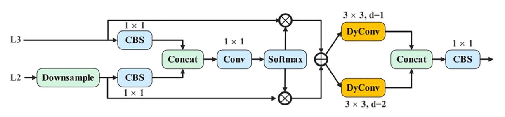
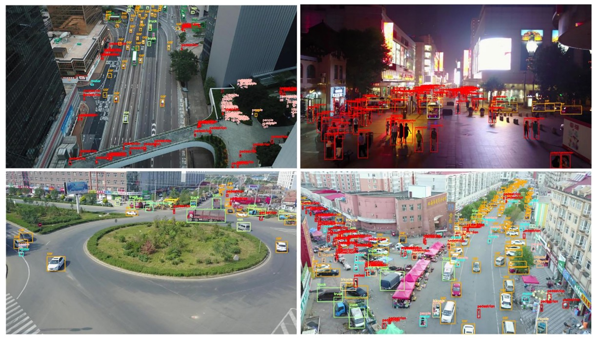

## 私は小さな小鳥です

[**YOLO-Tiny: A lightweight small object detection algorithm for UAV aerial imagery**](https://ietresearch.onlinelibrary.wiley.com/doi/pdfdirect/10.1049/ipr2.13314)

---

ドローンは静かに私たちの生活の隙間に入り込んできました。

しかし、物体検出アルゴリズムにとって、この機械がもたらす問題は非常に厄介です。

## 問題の定義

ドローンは日常のあらゆる隙間に浸透し、空撮点検から災害検知まで、その膨大な映像データは物体検出アルゴリズムに新たな挑戦を突きつけています。

モデルにとって、ドローンが撮影する「空の視点」は過酷な条件に満ちています。画面内の対象物は極めて小さく、サイズも不均一で、背景の干渉や部分的な遮蔽も頻繁に発生し、有効な特徴の認識領域をさらに圧縮しています。同時に、実際の運用環境はしばしば極端なリソース制限を伴い、高性能モデルは正確でも実用が困難です。

現在主流の物体検出手法は性能的に成熟しつつあります。特に YOLO シリーズに代表される単段階検出アルゴリズムはその速度優位性からリアルタイム応用の第一選択肢ですが、元の構造は高高度撮影と小物体検出という二重の要請に直接対応するには難があります。

これまでの改良では、畳み込みモジュールの変更、ピラミッド構造の追加、注意機構の導入や層間融合の実施によって小物体認識の向上を目指すものや、データ拡張、候補枠の初期設定、スケール調整などの学習プロセスに着目するものがありました。

しかし、多くの方法は根本的な課題を解決できていません。つまり、小規模計算資源の端末機器上で、リアルタイムかつ高精度かつ安定して画面内の極めて小さな疑わしいターゲットを認識するには、「モデル圧縮」だけでは到底足りないのです。

本論文はまさにこの問題を出発点とし、YOLOv5s をベースに、UAV 空撮タスク向けに設計された軽量小物体検出アーキテクチャを提案しています。

## 問題の解決

### YOLOv5 の振り返り

YOLOv5 のバックボーン構造では、入力画像は 5 回のダウンサンプリングを経て、異なる解像度の特徴マップ（P1 から P5）が生成され、それぞれのサイズは順に 320、160、80、40、20 です。このピラミッド型特徴マップの設計により、モデルは異なる大きさの物体に対して、それぞれ対応するレベルで予測を行うことが可能です。

標準の YOLOv5 検出構造は P3（80×80）から P5（20×20）までのマルチスケール融合を行い、主に 8×8 ピクセル以上の物体を対象としています。

しかし、ドローンの用途においては、このサイズの閾値は明らかに高すぎます。

VisDrone2019 データセットの統計図は重要な観察を示しています：

<figure style={{ "width": "70%"}}>

</figure>

- 図(a)は対象数の深刻な不均衡を示し、
- 図(b)は多数の対象が極めて小さいサイズ範囲に集中し、
- 図(c)はバウンディングボックスの縦横比が高度に集中しており、
- 図(d)は中下部領域が注釈の密集ホットスポットであることを示します。

言い換えれば、これは「**極度に小物体寄りの空撮タスク**」であり、YOLOv5 の現行設計はこの条件下で構造的な偏りを持っています。予測層は主に P3 から P5 に集中しており、まさに極小ターゲットに対して最も不向きな位置にあります。

過去の研究では、YOLOv5 に P2 検出ヘッド（160×160 の特徴マップ）を追加してより細かな信号を捉えようとしたものがあります。検出性能は向上したものの、パラメータ数と計算量も同時に増大し、リソース制約のある端末には負担が大きすぎました。

別の研究者は別の道を選び、P5 層を削除して中小物体への注力に戻しました。しかしこの簡略化戦略では精度向上は限定的で、ボトルネックを真に突破できませんでした。

本論文の著者はこの構造調整の流れを継続し、さらに**P4 層を削除**して、元々の三重検出構造を P2 と P3 の二層構造に圧縮し、より初期かつ高解像度の特徴マップに集中しています。

しかしこれには別のリスクも伴います：

> **P4 と P5 層は YOLOv5s モデルの総パラメータの 92.1%を占めています。**

ここを除去するとモデル全体のパラメータはほぼ半減し、検出能力も低下してしまいます。

この「過度な軽量化」の問題を回避するため、著者は次の交換戦略を採用しました：

- **P2 と P3 を保持しつつ、モデルの深さと幅を適度に増やす**

これにより特徴抽出と融合の能力を一定水準に維持します。

実際のトレードオフの結果として、著者は**depth=0.67、width=0.75**の構成を選択し、パラメータ数と計算コストのバランスを取っています。この選択はモデルの表現力を十分に保ちつつ、GFLOPs をリソース制限内に抑え、後続のモジュール軽量化の土台を築いています。

### モジュールの軽量化

モデル設計において、パラメータ数、計算コスト（GFLOPs）、および表現能力の三者には明確なトレードオフが存在し、このトレードオフは特にドローンのようなエッジデバイスで顕著です。強い表現力を求めつつ、パラメータは増やせません。

前述の構造調整では、著者は P4 および P5 検出ヘッドを削減し、パラメータ数を**82.05%削減**しましたが、その分モデルの「表現空間」も縮小しました。

この損失を補うために、深さと幅を適度に増やしてパラメータをわずかに回復させ、表現力を取り戻しました。しかしその結果、GFLOPs は**16.0 から 24.2 へと 53.13%増加**しました。さらなる拡張は計算コストを指数関数的に増やし、リソース制約のある環境には明らかに不適切です。

この矛盾を解決するために、著者は高効率なアーキテクチャユニットである

- **動的畳み込み（Dynamic Convolution）**

を導入しました。

YOLOv5 で最もコアな特徴抽出モジュールの一つである C3 構造は、多数の残差パスと畳み込みの積み重ねから成ります。

著者はこれを全面的に新設計の**LW_C3**に置き換え、主な変更点は以下の通りです：

- **LW_C3**：すべての残差ブランチ内の**3×3 通常畳み込み**を**3×3 動的畳み込み**に置換し、構造の深さは維持しつつ静的計算負荷を削減。

    

    <figure style={{ "width": "90%"}}>
    
    </figure>
    

- **LW_Downsample**：元々 1×1 畳み込みでチャネル圧縮およびダウンサンプリングを行っていたモジュールも、stride=2 の動的畳み込みに全面的に切り替え、表現力と受容野制御を強化。

    

    <figure style={{ "width": "90%"}}>
    
    </figure>
    

動的畳み込みの核心は動的パーセプトロン（Dynamic Perceptron）に似ており、

> **各入力$x$に基づき、一組の基底関数から最適な重みの組み合わせを動的に選択する。**

以下のイメージ図の通りです：

<figure style={{ "width": "70%"}}>

</figure>

数式で表すと：

$$
y = g(\tilde{W}(x)^T x + \tilde{b}(x))
$$

ここで

$$
\tilde{W}(x) = \sum_{k=1}^K \pi_k(x) \tilde{W}_k,\quad
\tilde{b}(x) = \sum_{k=1}^K \pi_k(x) \tilde{b}_k
$$

かつ

$$
0 \leq \pi_k(x) \leq 1,\quad \sum_k \pi_k(x) = 1
$$

この$\pi_k(x)$が各入力が第$k$番目の畳み込み核に対する**注意重み**を意味します。

本質的に学習するのは一組の重みではなく、「選択」する仕組みであり、モデルは入力内容に応じてどの特徴抽出戦略に重きを置くかを自己決定します。

この選択機構の実装には一般的な SE（Squeeze-and-Excitation）技術を用い、手順は以下の通りです：

1. **Global Average Pooling** で空間情報を圧縮
2. 全結合層＋シグモイドを経て k 次元の重みベクトル$\pi(x)$を生成
3. その重みを k セットの事前定義畳み込み核に適用し、動的加重畳み込みを完了

入力チャネル数$C_{\mathrm{in}}$、出力チャネル数$C_{\mathrm{out}}$、カーネルサイズ$D_k \times D_k$、カーネル数 k の場合、このモジュールの計算量は：

$$
O_{\mathrm{dynamic}} = K C_{\mathrm{in}} C_{\mathrm{out}} D_k^2 + K C_{\mathrm{out}}
$$

標準畳み込みの

$$
O_{\mathrm{static}} = H W C_{\mathrm{in}} C_{\mathrm{out}} D_k^2
$$

と比べて大幅に削減され、特に画像解像度$H \times W$が大きい時に差が顕著です。

動的畳み込み導入により、パラメータ増加を許容しつつ、GFLOPs コストを局所的に制御可能となりました。

さらに重要なのは、この設計により各特徴点の受容方式が**一律ではなく**、入力文脈に応じて微調整されるため、YOLOv5 の特徴抽出モジュールが初めて意味的適応性を獲得した点です。この微調整能力は小物体検出において特に重要です。

### マルチスケール自適応融合

物体検出において、**マルチスケール特徴融合**はモデルの識別力向上に不可欠な操作です。浅層ネットワークはテクスチャや位置情報を保持し、深層ネットワークは意味的抽象化と対象判別を担います。

理論的には、この両者を融合することで「よく見えて」「理解できる」ことを両立できます。しかし尺度の違いによる意味的断絶があり、単純な連結や加重では真の「統合」にはならず、「積み重ね」に留まってしまいます。

これに対し、著者が提案する **AMSFF（Adaptive Multi-Scale Spatial Feature Fusion）モジュール** は、この融合失敗問題を解決するために設計されました。

下図の構造を参照してください：

<figure style={{ "width": "90%"}}>

</figure>

AMSFF の動作ロジックは、neck 部の浅層 **L2** と深層 **L3** の特徴を例にすると以下の通りです：

1. **尺度合わせ**：L2 特徴をダウンサンプリングし、L3 と空間解像度を揃える。

2. **チャネル調整**：1×1 畳み込みで L2 のチャネル数を L3 に合わせ、要素ごとの演算が可能に。

3. **初期融合**：調整済み L2 と L3 を連結（concat）し、基礎融合テンソルを形成。

4. **重み学習**：1×1 畳み込みを通じて空間適応重みパラメータ $\alpha*{i,j}$ と $\beta*{i,j}$ を算出。Softmax で和が 1 かつ$0,1$の範囲に正規化。

5. **加重融合**：対応する空間位置の重みで加重和を計算し、

   $$
   y^l_{i,j} = \alpha^l_{i,j} \cdot x^{(1 \to l)}_{i,j} + \beta^l_{i,j} \cdot x^{(2 \to l)}_{i,j}
   $$

   ここで $x^{(n \to l)}_{i,j}$ は第$n$層から尺度合わせされた$l$層の位置$(i,j)$の特徴ベクトル、$y^l_{i,j}$ は融合後の新特徴マップです。

6. **意味的拡張**：受容野拡大のため、dilation 率がそれぞれ 1 と 2 の 3×3 動的畳み込みを 2 回適用し、異なる文脈における尺度適応力を強化。

7. **統合出力**：最後に 1×1 の CBS モジュールで融合構造をまとめ、検出ヘッドへの入力とします。

従来の融合法（FPN、PAN、BiFPN など）と比べ、AMSFF の特徴は単なる注意機構の追加ではなく、融合自体を「動的関係構築」として捉えている点にあります。

### 実験設計

本研究の実験には天津大学機械学習・データマイニング研究室が公開する**VisDrone2019**データセットを用いています。

このデータセットはドローンにより様々な天候・照明条件下で撮影され、都市部、郊外、駐車場、道路など多様なシーンを含み、小物体や複雑背景下での識別能力を検証するのに適しています。

VisDrone2019 は 10 クラスの対象を含み、合計**10,209 枚の画像**を収録し、

- 訓練セット：6,471 枚
- 検証セット：548 枚
- テストセット：3,190 枚

と分割されています。

データの特徴は以下の通りです：

- **シーン多様性が高い**：静止撮影から動態追跡まで含む；
- **対象サイズが小さい傾向**：ほとんどのバウンディングボックス面積が 32×32 以下；
- **遮蔽や光線変化が顕著**：モデルの汎化能力に挑戦を与える。

以下の図は四種異なるシーンからのサンプル画像とアノテーションを示しています：

実験は標準的な YOLO 学習フローで行い、環境設定とハイパーパラメータは以下の表の通りです：

<figure style={{ "width": "70%"}}>

</figure>

## 討論

### ネットワーク構造調整比較実験

<figure style={{ "width": "60%"}}>

</figure>

小物体認識に対する各検出ヘッドの影響を評価するため、本研究では **6 種類の異なる構造組み合わせ** を設計し、同一の訓練条件下で比較実験を行いました。具体的な構造の変化は上表の通りで、対応する性能結果は以下の通りです。

<figure style={{ "width": "70%"}}>

</figure>

実験結果から以下の重要な現象が見て取れます：

1. **P2 検出ヘッドの追加**

   元の YOLOv5s 構造に**P2 層（解像度 160×160）を追加**したところ、VisDrone2019 データセット上でモデル性能が明確に向上しました：

   - **mAP\@0.5 が +5.5% 向上**
   - **mAP\@0.5:0.95 が +4.1% 向上**

   これはモデルがより高解像度の特徴対応能力を獲得し、画面内の微小目標をより早期に捉えられることを示します。パラメータ数と GFLOPs はわずかに増加しましたが、全体のコストは許容範囲内です。

2. **P5 検出ヘッドの除去**

   別の実験では、**P5（20×20）層を除去**し、大型物体に関連するパラメータと計算を削減、中小スケール認識にリソースを集中しました：

   - mAP\@0.5 はわずかに +0.5% 増加
   - mAP\@0.5:0.95 は軽微に −0.1% 減少

   パラメータは大幅に削減されましたが、「深層特徴を単純に除去するだけでは性能向上は限定的」であり、むしろ汎化能力がわずかに低下する可能性を示しています。

3. **P4 と P5 の同時除去およびモデルの深さ・幅拡大**

   最終バージョンでは、**P5 と P4 を同時に除去**し、モデルの深さを 0.33 から 0.67 に、幅を 0.5 から 0.75 に拡張して、過度な削減による表現能力低下を補填しました。

   このバージョンの結果は最も顕著で、

   - **mAP\@0.5 が合計 +8.3% 向上**
   - **mAP\@0.5:0.95 が +5.3% 向上**

   P4 と P5 は深層の意味的経路であるものの、小物体検出への寄与は少なく、16 倍・32 倍のダウンサンプリング率により信号が大幅に失われていました。また、単純な圧縮ではなくネットワーク容量の適度な増加が意味的抽出の完全性を保ち、**モデルが微小目標に対してより適切な「文脈的解像力」を持つことを可能にしました。**

この比較実験は、空撮小物体認識タスクにおいて「より多い経路」や「より深い特徴」ではなく、**小さい物を確実に捉えられる層を特定し、そこに十分な容量を与えることが鍵である**ことを示しています。

### 消融実験

<figure style={{ "width": "60%"}}>

</figure>

三つの最適化戦略の個別および総合的な寄与を検証するため、VisDrone2019 で消融実験を実施しました。

最適化の組み合わせは上表に示され、性能結果は以下にまとめられています。

<figure style={{ "width": "70%"}}>

</figure>

各モジュールの貢献は以下の通りです：

1. **構造最適化**

   - mAP\@0.5 +8.3%
   - mAP\@0.5:0.95 +5.3%
   - パラメータ数は元の YOLOv5s より 81.4%減少
   - GFLOPs は 53.1%増加

   P4 と P5 の 2 層（モデルパラメータの 92.1%を占める）を除去し、浅層特徴（P2, P3）で直接検出。不要な深層特徴を省き、モデルの注目をマクロな意味からミクロなディテールへシフト。

   パラメータ不足での劣化を防ぐため、深さ（0.33→0.67）と幅（0.5→0.75）を増やし、一定の抽象能力を保持。

2. **モジュール軽量化**

   - LW_C3：

     - mAP\@0.5 +2.2%
     - mAP\@0.5:0.95 +1.9%
     - GFLOPs 48.2%削減

   - LW_Downsample：

     - mAP\@0.5 +3.9%
     - mAP\@0.5:0.95 +3.0%
     - GFLOPs 11.0%削減

   これら 2 モジュールは約**38.5%パラメータ増**があるものの、動的畳み込みの効果で静的演算量を大幅削減。

3. **AMSFF**

   - mAP\@0.5 +3.4%
   - mAP\@0.5:0.95 +2.6%

   AMSFF は多スケール特徴間の「対話不均衡」問題を解決し、空間適応重み学習で浅層の細部と深層の意味的要素を合理的に分担。小物体検出では意味信号が弱いため、誤った融合は予測ミスを拡大します。

### 他 YOLO モデルとの比較

<figure style={{ "width": "70%"}}>

</figure>

YOLO シリーズは物体検出分野の代名詞であり、エンドツーエンドの高速推論が注目されてきました。YOLOv3 の多スケール予測と Darknet-53 構造から、YOLOv8 の勾配流導入や YOLOv10 の非極大抑制（NMS）除去まで、世代ごとに精度と効率を追求しています。

本研究では小型版に焦点を当て、比較実験で YOLO-Tiny がパラメータ・計算量を大幅に削減しつつも高い精度を維持していることを示しました。

mAP\@0.5 は YOLOv3-Tiny、YOLOv6s、YOLOv8s、YOLOv10s と比べて、それぞれ 23.7%、10.8%、8.3%、9.1%向上。mAP\@0.5:0.95 の向上は 14.4%、5.8%、4.2%、4.9%です。さらにパラメータ数は 60%〜80%、GFLOPs は 30%〜70%削減されています。

### 可視化デモ

左端が原画像、中は YOLOv5s、右端が YOLO-Tiny です。

## 結論

ドローン空撮の極小ターゲットと端末計算制約下において、YOLO-Tiny の構造調整とモジュール設計は実現可能な技術アプローチを示しました。

従来の軽量化モデルは速度と精度のトレードオフを強いられ、特に VisDrone のような環境では小物体特徴が多段階のダウンサンプリングで薄まるため、検出精度が伸び悩みました。

本研究は P5、P4 の大物体検出層を削減し、ネットワークの焦点を P3、P2 の小スケール領域に再設定。動的畳み込みと AMSFF モジュールで信号圧縮と特徴融合を行い、計算負荷を増やさず小物体認識力の向上を目指しました。

実験結果は VisDrone2019 上で有意な mAP 向上とパラメータ・GFLOPs の優位性を示し、小物体構造設計の有効性を証明しました。

ただし発表から日が浅く、著者は学習モジュールを公開しておらず、モデルは公開運用やコミュニティ検証を経ていないため、実際の性能と汎化性は今後の観察が必要です。
