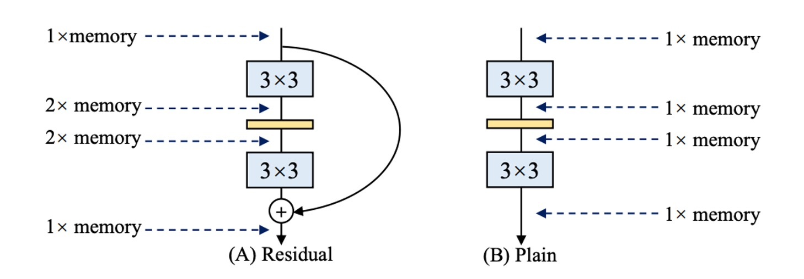
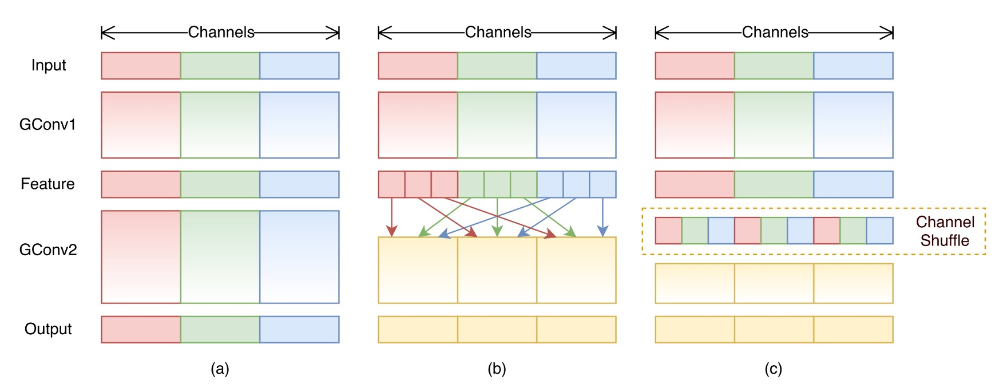
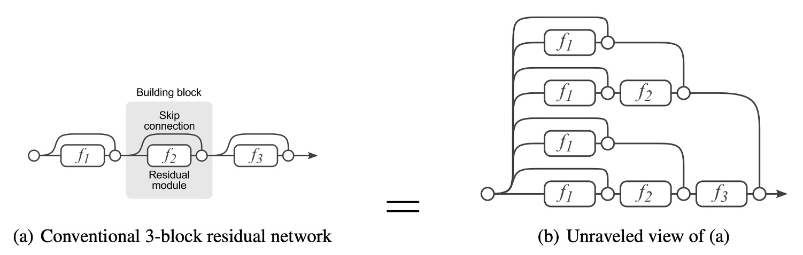
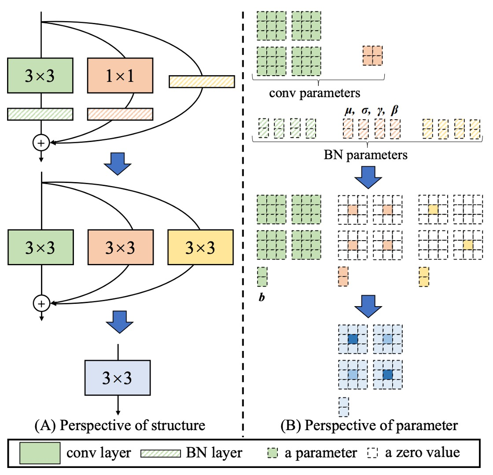
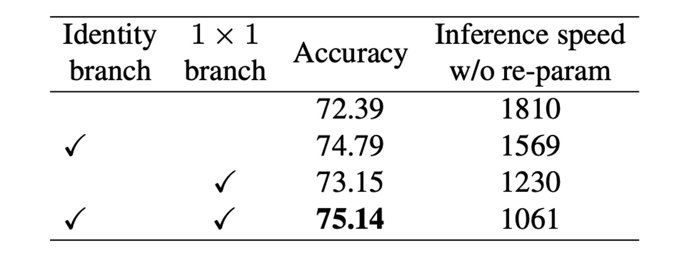
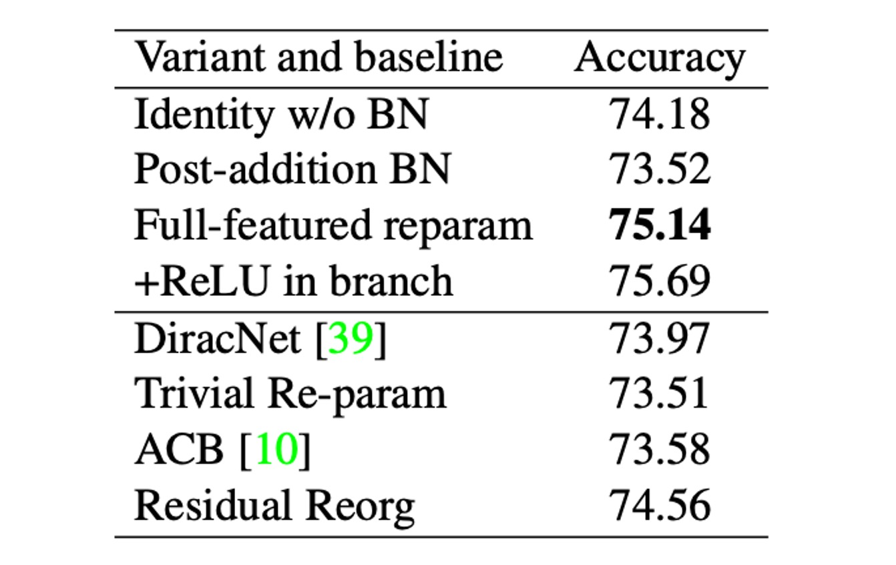

## VGG を再び偉大に

[**RepVGG: Making VGG-style ConvNets Great Again**](https://arxiv.org/abs/2101.03697)

---

**質問：モデルのパラメータ数が少ないほど、速度が速くなるのは正しいですか？**

この質問に対する答えは「いいえ」です。

なぜなら、計算量も考慮しなければならないからです。通常、モデルの計算量は FLOPs（浮動小数点演算回数）を参考にします。

次に質問します： 「**モデルの FLOPs が少ないほど、速度が速くなるのは正しいですか？**」

この質問の答えも「いいえ」です！

## 問題の定義

推論速度に影響を与える要素は他にもたくさんあります！

多くの研究論文では、モデルの FLOPs を減らす方法を探りますが、実際にエンジニアリングで使ってみると、推論速度が速くなるどころか、逆に遅くなることさえあります。

これは典型的な産学ギャップであり、エンジニアとして私たちは計算量のデータに惑わされてはいけません。

### 大量のメモリ使用

Inception、ResNet、DenseNet の登場により、多くの研究は精巧に設計されたアーキテクチャにシフトし、モデルはますます複雑になってきました。その一方で、いくつかのアーキテクチャは NAS（Neural Architecture Search）を基に自動で検索され、また複合スケーリング戦略を使用しています。

これらのネットワークアーキテクチャは精度が高いですが、複雑な分岐がメモリ使用量を増加させます（上の図参照）。

残差構造では、分岐が存在するため、推論時に分岐の結果を格納するために追加のメモリが必要になります。もし複数の分岐があれば（そう、あなたのことですよ、Inception！）、メモリ使用量はさらに大きくなります。

### 推論速度が遅い

いくつかの操作はハードウェアのサポートが不足しており、たとえば MobileNets の深層畳み込みでは、この方法はパラメータ数を約 80％削減できますが、速度は逆に遅くなります：

また、ShuffleNet 内のチャネルシャッフルなど、この操作は計算量が少ないように見えますが、推論速度を低下させる原因となります：

### しかし…

多分岐構造は本当に良い！

**多分岐構造は、モデルが多くの浅いモデルの暗黙的な集合体になることを可能にします。**

- [**[16.05] Residual networks behave like ensembles of relatively shallow networks**](https://arxiv.org/abs/1605.06431)

  

残差接続はショートカットを提供するため、ResNet を例に挙げると、理論的には N 個のブロックに対してモデルは 2N 個のモデルの集合体として解釈できます。なぜなら、各ブロックは 2 つの経路を選択できるからです。

さらに、ショートカットはより良い勾配の流れを提供し、勾配消失による訓練の困難さを緩和することができます。

ResNet の成功は残差接続の有効性を証明しており、それを放棄する理由はありません。

## 解決問題

### モデルアーキテクチャ

上記の問題を解決するために、この論文ではまず ResNet の残差構造を変更しました。

著者は RegVGG ユニットを再定義しました。訓練時にはモデルの性能向上のために多分岐アーキテクチャが必要であり、その構造は上図(b)のようになります：

1. 3x3 の畳み込み
2. 1x1 の畳み込み
3. アイデンティティ接続

しかし、推論時にはすべての分岐を削除する必要があります。これを上図(c)に示しています。

訓練構造をこのように定義した理由は、訓練時に多分岐アーキテクチャの要求を満たしつつ、モデル推論時の要件にも対応できるようにするためです：

- モデルの**再パラメータ化**を行います。

### 再パラメータ化

分岐の削除は単に削除するだけではなく、過去の多くのモデル削減研究は、単に分岐を削除することが性能低下を引き起こすことを示しています。

著者は新たに**再パラメータ化**という方法を提案しました。

RepVGG ユニットでは、各畳み込み演算に Batch Normalization が含まれており、この構造は等価な畳み込み演算に再パラメータ化することができます。

全体のプロセスは以下の図のように進行します：

1. 3x3 畳み込みと BatchNorm を 1 つの等価な畳み込み演算に統合します。
2. 1x1 畳み込みを Zero-padding で拡張し、等価な 3x3 畳み込みにし、その後 BatchNorm と統合して等価な畳み込み演算を得ます。
3. アイデンティティ接続を拡張し、等価な 3x3 畳み込みとして、その後 BatchNorm と統合します。
4. 最後に、3 つの分岐を加算して 1 つの等価な畳み込み演算に統合します。

---

以下は論文で提供された具体的な過程の説明です：

- $W^{(3)} \in \mathbb{R}^{C_2 \times C_1 \times 3 \times 3}$ は、$C_1$個の入力チャネルと$C_2$個の出力チャネルを持つ 3x3 畳み込み層のカーネルを示します。
- $W^{(1)} \in \mathbb{R}^{C_2 \times C_1}$ は、$C_1$個の入力チャネルと$C_2$個の出力チャネルを持つ 1x1 畳み込み層のカーネルを示します。
- $\mu^{(3)}, \sigma^{(3)}, \gamma^{(3)}, \beta^{(3)}$ は、3x3 畳み込み層の後の BN 層の平均、標準偏差、学習可能なスケーリング因子とバイアスを示します。
- $\mu^{(1)}, \sigma^{(1)}, \gamma^{(1)}, \beta^{(1)}$ は、1x1 畳み込み層の後の BN 層の平均、標準偏差、学習可能なスケーリング因子とバイアスを示します。
- $\mu^{(0)}, \sigma^{(0)}, \gamma^{(0)}, \beta^{(0)}$ は、アイデンティティ分岐に関連します。

$M^{(1)} \in \mathbb{R}^{N \times C_1 \times H_1 \times W_1}$ と $M^{(2)} \in \mathbb{R}^{N \times C_2 \times H_2 \times W_2}$ をそれぞれ入力と出力として定義し、$\ast$は畳み込み演算を表します。

もし$C_1 = C_2, H_1 = H_2, W_1 = W_2$であれば、次のようになります：

$$
M^{(2)} = \text{bn}(M^{(1)} \ast W^{(3)}, \mu^{(3)}, \sigma^{(3)}, \gamma^{(3)}, \beta^{(3)})
$$

$$
+ \text{bn}(M^{(1)} \ast W^{(1)}, \mu^{(1)}, \sigma^{(1)}, \gamma^{(1)}, \beta^{(1)})
$$

$$
+ \text{bn}(M^{(1)}, \mu^{(0)}, \sigma^{(0)}, \gamma^{(0)}, \beta^{(0)})
$$

この変換の等価性は、3x3 と 1x1 層が同じストライドを持ち、後者のパディング設定が前者より 1 ピクセル少ないことが必要です。たとえば、3x3 畳み込み層のパディングは 1 で、1x1 畳み込み層のパディングは 0 であるべきです。

:::tip
このアイデアに似た論文は以下です：

- [**[17.06] Diracnets: Training very deep neural networks without skip-connections**](https://arxiv.org/abs/1706.00388)

彼らは異なる畳み込み構造の数学的表現を使用してモデルの最適化を容易にしましたが、RepVGG は実際には訓練時に多分岐モデルを使用し、DiracNets はそうではありません。
:::

### パラメータ設定

最後に RepVGG のパラメータ設定について、著者は幾つかの異なる設定を提供しています。上記の表では、`Layers of each stage`が異なる解像度の特徴マップにおける層数を示しています。

上表では、最初の Stage が 1 層しかないことが分かります。なぜなら、ここでは画像サイズが大きく、計算量を非常に多く消費するからです。ほとんどの計算は第 4 の Stage に集中しており、そこでは 14 層または 16 層が積み重ねられています。

パラメータ a と b はチャンネル数を制御するために使用され、具体的な設定は以下の表に示されています：

## 討論

### ImageNet 性能

この研究で、著者は RepVGG を ImageNet-1K データセット上のいくつかの古典的かつ最先端のモデルと比較しました。

これらのモデルには、VGG-16、ResNet、ResNeXt、EfficientNet、RegNet が含まれ、データセットには 128 万枚の訓練画像と 5 万枚の検証画像が含まれています。

訓練中、軽量および中重量モデルは簡単なデータ増強技術（ランダムクロッピングや左右反転）を使用し、重いモデルは予熱、コサイン学習率退火、ラベルスムージング、mixup、および Autoaugment 技術を追加しました。

著者は 8 台の GPU で訓練を行い、標準的な SGD オプティマイザーとコサイン退火学習率戦略を使用しました。

速度テストの結果、RepVGG は精度と速度の両方で多くの古典的なモデルを上回ることが示されました。例えば、RepVGG-A0 は ResNet-18 と比較して、精度で 1.25％、速度で 33％の改善を見せ、RepVGG-A1 は ResNet-34 より精度で 0.29％、速度で 64％の向上を見せました。

さらに、ResNet-101 や ResNet-152 などの大きなモデルとの比較でも、交差グループ層を持つ RepVGG モデルは顕著な優位性を示しました。

パラメータ効率の観点でも、RepVGG は素晴らしい結果を示しています。VGG-16 と比較して、RepVGG-B2 はパラメータを 42％削減し、実行速度を 10％向上させ、精度は 6.57％増加しました。これは、RepVGG が低パラメータ数を維持しながら、より高い性能を提供できることを示しています。

最後に、RepVGG は最先端のベースラインモデルと比較しても良好な性能を示しました。例えば、RepVGG-A2 は EfficientNetB0 よりも精度で 1.37％高く、実行速度は 59％速いです。また、RepVGG-B1 は RegNetX3.2GF より性能が 0.39％高く、速度もわずかに速いです。

### 消融実験

著者は RepVGG の性能に対する構造的再パラメータ化技術の重要性を検証するため、詳細な実験と消融研究を行いました。

すべてのモデルは、同じ簡単な訓練設定の下で 120 エポックから訓練されました。

まず、著者は RepVGG-B0 の各ブロックから分岐を削除して消融研究を行いました。結果、2 つの分岐を削除した場合、モデルの精度は 72.39％にとどまりました。1x1 分岐を保持すると、精度は 73.15％に向上し、Identity 分岐を保持すると精度は 74.79％になりました。完全な RepVGG-B0 は 75.14％の精度に達しました。

訓練時の推論速度を見ると、構造的再パラメータ化によって恒等接続と 1x1 分岐を削除することにより、顕著な加速が得られました。

---

さらに比較するために、著者は RepVGG-B0 を用いていくつかの変種とベースラインモデルを比較しました（上表参照）。

これらの変種は以下の通りです：

- **Identity w/o BN**：Identity 分岐の BN を削除。
- **Post-addition BN**：3 つの分岐から BN 層を削除し、加算後に BN 層を追加。
- **+ReLU in branches**：各分岐に ReLU を挿入。
- **DiracNet**：慎重に設計された畳み込みカーネルによる再パラメータ化。
- **Trivial Re-param**：3x3 カーネルに恒等カーネルを追加。
- **Asymmetric Convolution Block (ACB)**：別の形式の構造的再パラメータ化。
- **Residual Reorg**：ResNet に似た方法で各ステージを再組織化。

著者は、DiracNet と Trivial Re-param に対する再パラメータ化の優位性は、後者が非線形挙動（BN）を持つ具体的な構造を通じて実際のデータフローに依存しているのに対し、前者は畳み込みカーネルの異なる数学的表現を使用している点にあると考えています。

ACB との比較は、RepVGG の成功が過剰なパラメータ化だけに起因するのではないことを示しています。RepVGG ブロックは単一の畳み込みに等価に変換可能で推論を行いますが、訓練時間が等価であるわけではありません。Residual Reorg との比較では、RepVGG の性能が 0.58％向上し、これはその多くの分岐が寄与した結果です。

これらの実験結果は、構造的再パラメータ化技術が訓練および推論プロセスにおいてモデルの性能に重要な影響を与えることを示しており、強力な通常の ConvNet を訓練するための重要な方法であることを証明しています。

## 結論

構造的再パラメータ化は RepVGG の成功の鍵となる技術の一つです。

この方法により、モデルは訓練時に高い柔軟性を保ちながら、推論時にはより効率的な単一畳み込み層に変換されます。この設計により、RepVGG は高い精度を維持しつつ、推論速度を大幅に向上させることができました。

実験結果は、RepVGG が速度と精度のトレードオフにおいて複数の最先端モデルより優れていることを示しており、高性能計算やリアルタイムアプリケーションにおいて理想的な選択肢となります。

RepVGG は新しい畳み込みニューラルネットワーク設計のアプローチを示しており、著者は性能を犠牲にすることなく設計を簡素化する方法を示しています。そのシンプルで効率的な構造と強力な性能により、畳み込みニューラルネットワークの発展に新たな道を開きました。
