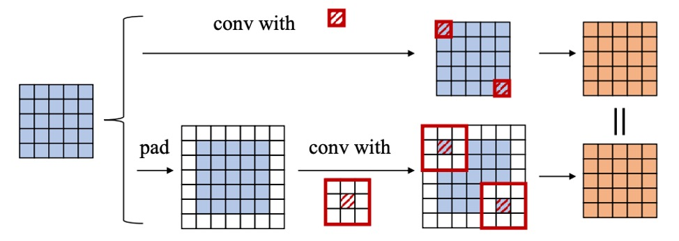
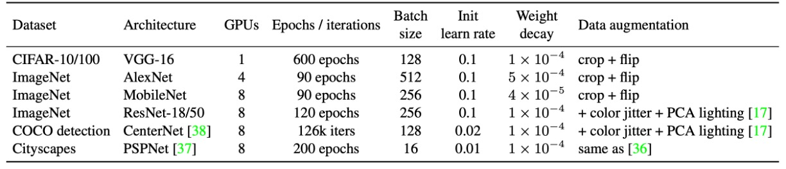

## 六人の弟子

[**Diverse Branch Block: Building a Convolution as an Inception-like Unit**](https://arxiv.org/abs/2103.13425)

---

この論文を読んだ後、ずっと整理する時間がなかった。

今回はこの論文の内容について話したい。

## 問題の定義

RepVGG を覚えていますか？

簡単に振り返ると、「再パラメータ化」（re-parameterization）とは、訓練時に複雑な構造や複数の分岐を使って多様な特徴表現を学習し、モデルが訓練された後にこれらの複雑な構造のパラメータを統合して、簡略化されたモデルに組み込むことです。これにより推論時には「単一路徑畳み込み」のような推論効率を保つことができます。

RepVGG はこの概念の一例であり、全体の概念は以下の図のようになります：

<figure style={{"width": "70%"}}>

</figure>

訓練時には追加の 1×1 畳み込みやアイデンティティ分岐を導入し、最終的にそれらをすべて「凝縮」して純粋な 3×3 畳み込み層にまとめ、推論構造は古典的な VGG のように軽量で効率的になります。

:::tip
もし再パラメータ化（re-parameterization）の概念に馴染みがない場合は、まず RepVGG の論文を読んでください：

- [**[21.01] RepVGG: VGG を再び偉大に**](../2101-repvgg/index.md)
  :::

RepVGG を読んだ後、この分岐設計がもっと多様であっても良いのではないかと感じるかもしれません。

本論文の著者も同じように考えており、モデルが訓練中により多様な特徴を学習できるように、もっと多様な設計方法を見つけられればと思っています：

- **結局のところ、推論段階でそれを一つに統合できるなら、それは考慮に値する！**

上記の目標に基づいて、著者は最終的に「六つ」の解決策を提案しました。

## 問題の解決

<figure style={{"width": "90%"}}>

</figure>

### 第一型：Conv-BN

一般的な畳み込み層は、Batch Normalization（BN）を接続します。つまり「conv → BN」です。

推論時、BN は「同じ出力チャネルに線形変換を行うもの」とみなせます：まずチャネル平均値$\mu_j$を引き、標準偏差$\sigma_j$で割り、その後学習された係数$\gamma_j$で掛け、バイアス$\beta_j$を加えます。

「同次性と加法性」を利用して、BN を前の畳み込み層と統合し、新しい畳み込みカーネルとバイアスに合併できます。統合の式は次のようになります：

$$
F'_j \;\leftarrow\; \frac{\gamma_j}{\sigma_j} \, F_j,\quad
b'_j \;\leftarrow\; -\,\frac{\mu_j \,\gamma_j}{\sigma_j} \;+\; \beta_j.
$$

これにより、推論時に「畳み込み + BN」を明示的に分ける必要はなく、新しい畳み込みカーネル$F'_j$と新しいバイアス$b'_j$をそのまま使用できます。

### 第二型：Branch Add

分岐の加算とは、同じ設定の畳み込み（同じサイズのカーネル、同じチャネル数）からの出力を加算することを指します。

加法性により、二つの畳み込みがそれぞれ「第一型」を経た後、もしそれらの畳み込みカーネルが$F^{(1)}, F^{(2)}$、バイアスが$b^{(1)}, b^{(2)}$であれば、統合結果は次のようになります：

$$
F^{(0)} \;\leftarrow\; F^{(1)} + F^{(2)},\quad
b^{(0)} \;\leftarrow\; b^{(1)} + b^{(2)}
$$

したがって、平行分岐であり、空間が整合していれば、最終的に同じ畳み込みカーネルに加算されます。

### 第三型：Sequential Conv

シーケンシャルな畳み込み層、例えば「1 × 1 conv → BN → K × K conv → BN」の場合も、1 つの等価な K × K 畳み込みに統合できます。統合の過程は以下の通りです：

1. 最初の 1 × 1 conv + BN を 1 つの等価な 1 × 1 畳み込みに統合します（得られるのは$F^{(1)}, b^{(1)}$）。
2. 次に K × K conv + BN をもう 1 つの等価な K × K 畳み込みに統合します（得られるのは$F^{(2)}, b^{(2)}$）。
3. 最後にこれら 2 つの層を統合します。

1 × 1 conv は空間の次元を変えませんが、チャネルの線形結合を変更します。これを「転置」の概念を使って、K × K 畳み込みカーネルに統合できます。同時に、前の層のバイアスは後の層の畳み込みを通過する際、等価的に「累積」して定数項になります。

整理すると、新しい K × K 畳み込み$F^{(0)}, b^{(0)}$が得られ、シーケンシャル層が統合されます。

:::tip
**Padding 問題**

もし両方の層でゼロパディングを行うと、理論的に空間に 1 つのゼロの輪が追加され、前の層の出力と後の層のスライディングウィンドウが一致しなくなります。論文の中で、著者は次の 2 つの解決方法を提案しています：

1. 第一層の畳み込みにのみパディングを適用し、第二層には適用しない。
2. 「$b^{(1)}$でパディングする」ことで一貫性を保つ。

この部分は実装の詳細に関する問題ですが、基本的な原則は空間の整合性を保つことです。
:::

### 第四型：Depth Concat

<figure style={{"width": "50%"}}>

</figure>

Inception のような構造では、「深さ方向の連結」を用いて複数の分岐の出力をチャネル次元で連結することがよくあります。

もしこれらの分岐が「1 つの畳み込み」だけで構成され、空間が整合している場合、単純にそれらの畳み込みカーネルを出力の次元で連結することができます：

$$
F^{(0)} \;\leftarrow\; \mathrm{CONCAT}\bigl(F^{(1)}, F^{(2)}\bigr),
\quad
b^{(0)} \;\leftarrow\; \mathrm{CONCAT}\bigl(b^{(1)}, b^{(2)}\bigr).
$$

これにより、元々のすべての出力チャネルが 1 つの大きな畳み込みに統合されます。グループ畳み込みに関しても同様の手法を適用できますが、チャネルの分割と統合を行う必要があります。

### 第五型：Average Pooling

平均プーリングは実際には特殊な畳み込みとして見ることができます。

もし$K \times K$のプーリングカーネルがあれば、それは「同じサイズの畳み込みカーネルで、中央が定数$1/K^2$、他の位置は 0」と等価です。すなわち：

$$
F_{d,c,:,:} =
\begin{cases}
1/K^2, & \text{if } d=c,\\
0, & \text{otherwise}.
\end{cases}
$$

stride = 1 の時は単なる平滑化であり、stride > 1 の場合はダウンサンプリングが行われます。

したがって、もし 1 つの分岐で平均プーリングを使用していた場合、それを固定パラメータの畳み込みカーネルに変換し、前述の変換（例えば加法性）を使って他の分岐と統合することができます。

### 第六型：Multi-scale Conv

<figure style={{"width": "70%"}}>

</figure>

ネットワーク内に異なるサイズの畳み込みカーネル（例えば、$1 \times 1$、$1 \times K$、$K \times 1$、$k_h \times k_w$など）がある場合、それらは$K \times K$サイズの畳み込みカーネル内で「一部の位置がゼロ」（ゼロパディング）であると見なすことができます。

こうすることで、すべての異なるサイズ（$K \times K$より大きくない限り）は、同じ$K \times K$畳み込みカーネルの次元に「拡張」され、整合性を保ち、最終的に加法的に統合できます。

### 実験パラメータ設定

上記の表に実験設定がまとめられています。

著者は CIFAR-10/100 で標準的なデータ拡張を使用し、画像を 40×40 に拡大し、ランダムに切り取って左右反転を行いました。実行の可能性を迅速に確認するため、VGG-16 を選択し、ACNet に基づいて元々の 2 つの FC 層をグローバル平均プーリングに置き換え、さらに 1 層の 512 ニューロンの FC を接続しました。公平に比較するために、VGG のすべての畳み込み層には BN が追加されました。

ImageNet-1K には 128 万枚の訓練画像と 5 万枚の検証画像が含まれています。小型モデル（AlexNet、MobileNet）は標準的な拡張（ランダム切り取り、反転）を使用し、ResNet-18/50 はさらに色の揺らぎと照明変化を加えました。AlexNet の設計は ACNet と同様で、局所応答正規化（LRN）は含まれず、各畳み込み層後に BN が追加されます。CIFAR と ImageNet の学習率調整はコサインアニーリング（初期値 0.1）が使用されました。

COCO 検出では CenterNet を使用し、126k イテレーションで訓練を行い、初期学習率 0.02、81k と 108k イテレーションで 0.1 倍に減衰しました。Cityscapes のセマンティックセグメンテーションでは PSPNet の公式設定を使用し、ポリ学習率戦略（基準 0.01、指数 0.9）を採用し、合計 200 エポックで実行しました。

すべてのアーキテクチャで、著者は K×K（1 < K < 7）畳み込みとその後の BN を DBB に置き換え、DBB-Net を構築しました。ResNet や AlexNet のような大きな畳み込みカーネル（7×7、11×11 など）は、モデル設計において使用頻度が少ないため、実験には含まれていません。すべてのモデルは同じ設定で訓練され、最終的に DBB-Net は元の構造に戻してテストされました。すべての実験は PyTorch で実行されました。

## 討論

### 他の方法との比較

<figure style={{"width": "70%"}}>

</figure>

実験結果は上記の表に示されています。DBB-Net を追加した後、CIFAR および ImageNet で顕著かつ一貫した性能向上が見られました：

- VGG-16 は CIFAR-10 と CIFAR-100 でそれぞれ 0.67％と 1.67％の向上
- AlexNet は ImageNet で 1.96％の向上
- MobileNet は 0.99％の向上
- ResNet-18/50 はそれぞれ 1.45％/0.57％の向上

その中で、ACNet は理論的には DBB の特殊なケースであり、実験結果では DBB の方が優れた効果を示しました。これにより、Inception のような異なる複雑さのパスを統合することが、単純に多尺度畳み込みによって得られる特徴統合よりも有益であることが示されています。

### 消失実験

<figure style={{"width": "90%"}}>

</figure>

著者は ResNet-18 をベースに一連の消失実験を行い、多様な分岐（diverse connections）と訓練時の非線形性の重要性を検証しました。

実験結果は、DBB の任意の分岐を取り除くと性能が低下することを示しており、これらの分岐が性能向上において不可欠であることが分かります。また、たとえ 3 つの分岐だけを使用しても、精度は 70％以上に達し、多様な構造の有効性を示しています。リソースが限られている場合、1×1 と 1×1−AVG 分岐を使用することで軽量化した DBB を構築できます。精度はわずかに低下しますが、訓練効率の向上を実現できます。

さらに、DBB と重複ブロック（duplicate blocks）を比較した結果、総パラメータ数が同じでも、DBB は単なる重複した畳み込み構造よりも優れていることが分かりました。例えば、(K×K + 1×1)の組み合わせの精度（70.15％）は、double K×K（69.81％）より高く、弱いコンポーネントと強いコンポーネントを組み合わせる方が、同じ強度のコンポーネントが 2 つあるよりも有利であることが示されました。

同様に、(K×K + 1×1 + 1×1−AVG)を含む DBB（70.40％）は、triple K×K（70.29％）よりも優れており、後者の訓練時のパラメータ量は前者の 2.3 倍であるにもかかわらず、リンクの多様性が単純にパラメータ数を増やすことよりも重要であることをさらに証明しています。

これらの向上が単に異なる初期化に起因するものではないことを確認するため、著者は「baseline + init」対照群を構築し、完全な DBB-Net で ResNet-18 を初期化した後、同じ設定で訓練を行いました。最終的な精度（69.67％）は標準初期化のベースラインとほぼ同じであり、モデルの性能向上は初期化戦略によるものではないことが示されました。

最後に、著者は BN が訓練時の非線形性に与える影響を分析しました。

BN をすべての分岐加算後に移動させ、訓練中に純粋な線形ブロックとした場合、性能向上が著しく減少することが分かりました。例えば、(K×K + 1×1) DBB の精度はこの場合 69.83％となり、元の DBB（70.15％）よりも低くなります。これにより、訓練時の非線形性を考慮しなくても、多様な分岐はモデルの性能を向上させることができることが示されましたが、BN を使用した非線形構造が学習能力をさらに強化することもわかりました。

実験では訓練と推論速度も考察され、結果として訓練時のパラメータ量の増加は訓練速度に大きな影響を与えないことが示されました。

## 結論

本研究では、新しい畳み込み神経ネットワークモジュールである**DBB（Diverse Branch Block）**を提案し、単一の畳み込みで多様な分岐を統合する手法を実現しました。

実験により、DBB が推論コストを増加させることなく、既存のアーキテクチャの性能を効果的に向上させることが確認されました。その中でも、多様な接続と訓練時の非線形性が DBB が従来の畳み込み層より優れている主な要因であることが示されました。この研究は、今後のネットワーク設計に新たな方向性を提供し、より柔軟で効率的な畳み込み計算方法を示しました。
