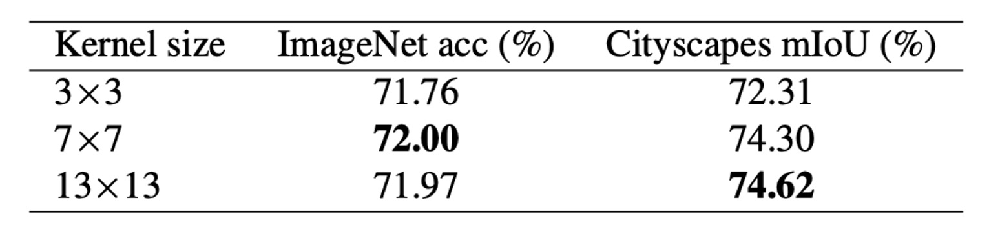
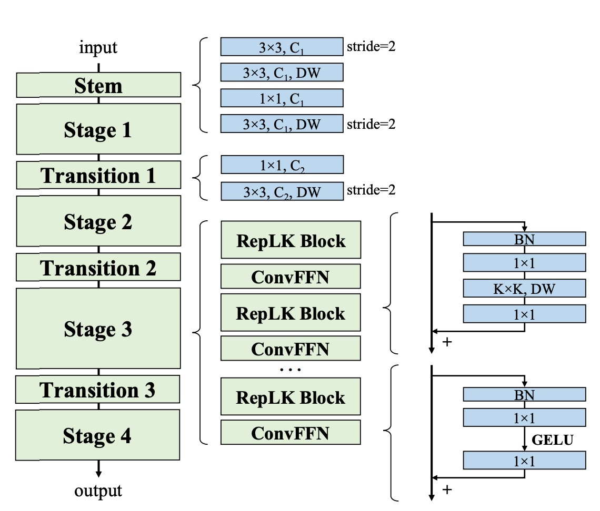

## 巨大なカーネル

[**Scaling Up Your Kernels to 31x31: Revisiting Large Kernel Design in CNNs**](https://arxiv.org/abs/2203.06717)

---

近年、CNN アーキテクチャは ViT によって挑戦を受け、その地位が揺らいでいる。

一部の人々は、ViT が強力な理由はマルチヘッドアテンションメカニズムによるものであり、マルチヘッドアテンションは柔軟であり、帰納的バイアスが少なく、歪みに対して安定していると考えている。

しかし、別のグループは「マルチヘッドアテンション」を排除した後でも性能はほとんど変わらないことに気づき、その性能を「アーキテクチャ」に帰している。

本論文はこれらとは異なり、主に一つの視点に集中している。それは、大きなカーネルの設計である。

## 問題定義

Inceptions などの古典的なモデルを除き、大きなカーネルを使用するモデルは VGG 以降流行していない。

VGG は、複数の小さなカーネルを積み重ねることで同様の効果を得る「受容野」を実現したため、大きなカーネルの設計は次第に注目されなくなった。

最近では大きなカーネルに関する研究もいくつか行われているが、これらの研究は重要な問題に答えていない：

- **なぜ従来の CNN は ViT よりも性能が劣るのか？大きな受容野を作る方法は、CNN と ViT の性能差を縮小する鍵となるのか？**

## 大きなカーネルの使い方

この問題に答えるために、著者は CNN の大きなカーネル設計を体系的に探求し、5 つの経験的なガイドラインをまとめた。

### 深層の大きなカーネルは依然として効率的

大きなカーネルの計算コストが高いと考えられがちだが、カーネルサイズが大きくなると FLOPs の数が倍増する。

しかし、これを深層畳み込みの形式に変更することで、この欠点を大きく克服できる。

一方で、現代の GPU などの並列計算装置は深層畳み込みに対するサポートが不十分で、メモリアクセスのコストが増加する。

既存の深層学習ツールも深層畳み込みのサポートが不十分であり、以下の表から、PyTorch の実装による推論遅延が非常に高いことが分かる。

この問題を解決するために、著者は効率的な PyTorch 実装を再発表した。この実装では、深層畳み込みの遅延が 49.5% から 12.3% に減少し、FLOPs とほぼ比例する。

- [**RepLKNet-pytorch**](https://github.com/DingXiaoH/RepLKNet-pytorch)

### 大きなカーネルは残差接続に依存している

著者は MobileNet-V2 をベンチマークとして使用した。なぜなら、MobileNet-V2 は多くの DW 層を使用しており、既に公開されている 2 つのバリエーション（残差接続あり、なし）があるからだ。大きなカーネルに対応する部分では、すべての DW 3×3 層を 13×13 層に置き換えた。

上表から、大きなカーネルを残差接続のある MobileNet-V2 に適用すると、精度が 0.77% 向上したことが分かる。しかし、残差接続なしでは、大きなカーネルによって精度が 53.98% に低下した。

:::tip
以前に見た論文のように、残差接続はモデルを異なる受容野を持つ多くのモデルの暗黙の集合として機能させるため、より大きな最大受容野から利益を得る一方で、小規模なパターンを捉える能力も失われない。
:::

### 大きなカーネルには再パラメータ化が必要

上表から、カーネルサイズを 9 から 13 に直接増加させると精度が低下するが、再パラメータ化によってこの問題を解決できることが分かる。

ViT が小さなデータセットで最適化の問題を抱えていることはよく知られている。一般的な解決策は、各自己注意ブロックに DW 3×3 畳み込みを追加することであり、これは我々の方法と似ている。これらの戦略は、ネットワークの前で追加の平行移動不変性と局所性を導入することで、小さなデータセットでの最適化を容易にし、一般性を損なわないようにしている。

ViT の挙動と同様に、著者は事前学習データセットが 7300 万枚の画像に増加した場合、再パラメータ化を省略しても性能が低下しないことを発見した。

### 大きなカーネルは下流タスクの性能を大きく向上させる

上表から、MobileNet V2 のカーネルサイズを 3×3 から 9×9 に増加させると、ImageNet の精度が 1.33% 向上し、Cityscapes の mIoU が 3.99% 向上したことが分かる。

別の実験でも似たような傾向が見られた：カーネルサイズが [3, 3, 3, 3] から [31, 29, 27, 13] に増加すると、ImageNet の精度は 0.96% 増加しただけだが、ADE20K 上の mIoU は 3.12% 増加した。この現象は、ImageNet のスコアが似ているモデルでも、下流タスクにおいて非常に異なる能力を持っている可能性があることを示唆している。

この現象を説明する理由は二つある：

1. 大きなカーネル設計は有効な受容野（ERF）を大きく増加させる。多くの研究が「コンテキスト」情報（すなわち大きな ERF）が多くの下流タスク（物体検出やセマンティックセグメンテーションなど）にとって重要であることを証明している。
2. 大きなカーネル設計はネットワークに形状バイアスをもたらす。簡単に言うと、ImageNet の画像はテクスチャや形状に基づいて正しく分類される。しかし、人間は主に形状の手がかりに基づいて物体を認識するため、形状バイアスが強いモデルは下流タスクにおいてうまく転送される可能性が高い。

さらに、最近の研究は、ViT が強い形状バイアスを持つことを示しており、これが ViT が移行タスクで非常に強力である理由の一部を説明している。これに対し、ImageNet 上で訓練された従来の CNN はテクスチャに偏りがちである。

- [**[21.05] Are convolutional neural networks or transformers more like human vision?**](https://arxiv.org/abs/2105.07197)

### 大きなカーネルは小さな特徴マップにも効果的

著者は、MobileNet V2 の最後の段階の DW 畳み込みを 7×7 または 13×13 に拡大した。これにより、カーネルサイズは特徴マップのサイズ（デフォルトは 7×7）と同じかそれ以上になる。上表から、ImageNet での大きなカーネルの性能は向上しなかったが、下流タスクには大きな助けとなり、Cityscapes での mIoU は 74.62% に増加したことがわかる。

その理由として、著者はカーネルサイズが大きくなると、CNN の平行移動不変性が厳密に成立しなくなり、隣接する空間位置の二つの出力はカーネルの重みの一部のみを共有し、異なるマッピングを通じて変換されると考えている。このメカニズムが、大きなカーネルが小さな特徴マップに対して効果的である理由であると示唆している。

## 問題解決

### ネットワークアーキテクチャ

上記の要約に基づき、著者は新しいネットワークアーキテクチャである RepLKNet を提案した。

まず、RepLKNet のアーキテクチャ設計は初期段階でより多くの詳細を捉えることに重点を置いている。これは複数の畳み込み層を使用して実現される。最初の 3×3 畳み込みとダウンサンプリングの後、低レベルのパターンを捉えるために 3×3 の深層可分畳み込み（DW）層が配置され、その後 1×1 の畳み込み層が続き、再び別の DW 3×3 層がダウンサンプリングに使用される。この設計により、初期段階で画像から十分に詳細情報を抽出できることが保証されている。

次に、各段階（1-4）において、RepLKNet には複数の RepLK ブロックが含まれている。これらのブロックは、ショートカットと DW 大きなカーネル畳み込みを利用して性能を向上させる。各 DW 畳み込み層は、より多くの詳細を捉えるために 5×5 のカーネルを使用して再パラメータ化される。

:::tip
この部分は上の図には描かれていないが、性能向上には非常に重要である。これらのブロックの設計により、ネットワークは異なる段階で効率的な特徴抽出と処理能力を維持できる。
:::

さらに、非線形性とチャネル間の情報通信を強化するために、RepLKNet は ConvFFN ブロックを導入している。これらのブロックは、ショートカット、バッチ正規化（BN）、2 つの 1×1 畳み込み層、および GELU 活性化関数で構成され、Transformer や MLP のフィードフォワードネットワーク（FFN）に類似している。

従来の FFN がレイヤー正規化を使用するのに対して、BN は畳み込み操作により効果的に統合でき、推論効率を向上させる。この設計は、Transformer と MLP ネットワークからインスピレーションを受けており、畳み込み神経ネットワークにおいて成功裏に応用されている。

異なる段階間で、RepLKNet は Transition Blocks を使用してチャネルサイズを調整し、ダウンサンプリングを行う。これらのブロックはまず 1×1 畳み込みを使用してチャネルサイズを増加させ、その後 DW 3×3 畳み込みでダウンサンプリングを行い、特徴の十分な抽出と変換を確保する。これらのトランジションブロックの設計により、ネットワークは異なる段階間でスムーズに遷移し、情報の一貫性と完全性を保つことができる。

## 討論

### 大きなカーネルの評価

大きなカーネルが RepLKNet に与える影響を評価するために、著者はいくつかのハイパーパラメータを固定した状態でカーネルサイズを変更し、分類およびセマンティックセグメンテーションの性能を観察した。

結果として、ImageNet ではカーネルサイズを 3 から 13 に増加させると精度が向上したが、さらにカーネルを大きくしても顕著な改善は見られなかった。しかし、ADE20K ではカーネルサイズを 13 から 31 に拡大すると、mIoU が向上し、大きなカーネルが下流タスクにおいて優れた効果を発揮することが明らかになった。

これは、大きなカーネルが一部のタスクでの改善には限界がある一方で、特定のアプリケーションにおいては依然として重要な価値を持つことを示している。

### ImageNet 上の性能

RepLKNet が Swin モデルのアーキテクチャに似ているため、著者は詳細な比較を行った。

ImageNet-1K では、著者は RepLKNet-31B の訓練計画を 300 エポックに拡張し、公平な比較を確保した。その後、384×384 の入力解像度で 30 エポックの微調整を行い、この訓練コストは 384×384 解像度で最初から訓練された Swin-B モデルよりもはるかに低かった。

また、著者は ImageNet-22K で RepLKNet-B と RepLKNet-L モデルを事前学習し、ImageNet-1K で微調整を行った。RepLKNet-XL は著者のプライベートな半監視データセット MegData73M で事前学習された。

著者はまた、同じ 2080Ti GPU 上でバッチサイズ 64 でモデルのスループットをテストした。

---

結果として、非常に大きなカーネルは ImageNet の分類には適さないが、RepLKNet モデルは精度と効率の間で良いバランスを達成していることがわかった。例えば、RepLKNet-31B は ImageNet-1K のみを使用して 84.8% の精度を達成し、Swin-B よりも 0.3% 高く、かつ 43% 高速で動作した。RepLKNet-XL は Swin-L よりも FLOPs が多いにも関わらず、動作速度は速く、このことは大きなカーネル設計が効率面で優れていることを強調している。

### 大きなカーネル CNN は深い小さなカーネルモデルよりも大きな ERF を持つ

著者は、大きなカーネル設計が CNN の性能を顕著に向上させることを証明した。大きなカーネルは一連の小さな畳み込みで表現できるが、例えば、7×7 畳み込みは 3×3 のカーネル 3 つを積み重ねることで表現可能である。これに基づいて次のような疑問が生じる：

- **なぜ、数十または数百の小さな畳み込み層（例えば ResNets）を持つ従来の CNN は、大きなカーネルネットワークよりも性能が劣るのか？**

著者は、単一の大きなカーネルが大きな受容野（ERF）を得るのにおいて、多くの小さなカーネルよりも効果的であると考えている。受容野（ERF）理論によれば、ERF は $O(K\sqrt{L})$ に比例し、ここで K はカーネルサイズ、L は深さ（層数）である。

言い換えれば、**ERF は主にカーネルサイズに影響され、次に深さに影響される**。

---

さらに、深さの増加は最適化の難易度を高める。

人々は ResNets がこの問題を克服していると考えがちだが、実際にはそうではない。いくつかの研究は、ResNets の挙動が浅いネットワークの集合に似ており、深さが増加しても ResNets の ERF は依然として非常に限られていることを示している。

この点を実証するために、著者は実験を行った：

ERF を視覚化するために、著者は簡単で効果的な方法を使用した。

簡単に言うと、著者は集約貢献スコア行列 $A (1024×1024)$ を生成し、入力画像上の対応するピクセルが最後の層で生成される特徴マップの中心点にどの程度貢献するかを測定した。

つまり、**特徴マップ中心点への貢献は、入力画像上のどのピクセルによって決定されるか**を示す。

実験結果は、ResNet では ERF が非常に限られており、深さが増加しても変わらないことを示している。対照的に、RepLKNet では高い貢献をするピクセルがより均等に分布しており、ERF は大きくなっている。

### 形状バイアス

著者は、大きなカーネル設計がより強い形状バイアスをもたらし、これは下流タスクにおいて非常に重要であると指摘している。

著者は、ImageNet-1K または 22K 上で事前学習した RepLKNet-31B と Swin-B の形状バイアス（例えば、形状に基づいて予測を行う割合）と、2 つの小さなカーネルのベースラインである RepLKNet-3 と ResNet-152 を取得した。

上図から、RepLKNet-31B の形状バイアスは Swin Transformer や小さなカーネル CNN よりもはるかに高いことがわかる。著者は、形状バイアスは有効受容野（ERF）と密接に関連しており、自己注意とは関係がないと考えている。このことは以下を説明している：

1. ViT の高い形状バイアスは、グローバルアテンションを採用しているためである。
2. Swin Transformer の低い形状バイアスは、ローカルウィンドウ内でのアテンションを採用しているためである。

### 制限

大きなカーネル設計が ImageNet および下流タスクにおける CNN の性能を大幅に向上させたものの、データとモデル規模が増加するにつれて、RepLKNet は Swin Transformers に対していくつかの面で遅れを取るようになった。

著者は、この差が最適でないハイパーパラメータ調整によるものなのか、データとモデル規模の拡大によって CNN に生じる基本的な欠陥によるものなのかは不明である。

これは今後の研究に委ねられている。

## 結論

本研究では、CNN アーキテクチャの設計において長年無視されてきた大きな畳み込みカーネルを再検討した。

実験を通じて、著者は複数の大きなカーネルを使用することで、数多くの小さなカーネルを使用するよりも効率的に大きな有効受容野（ERF）を得ることができ、これにより CNN の性能が大幅に向上することを証明した。この発見は、CNN と ViT の間の性能差を縮小するのに役立つ。

CNN コミュニティにとって、この研究結果は ERF に特別な注目を払うべきだということを示唆しており、これは高い性能を得るための鍵である可能性がある。ViT コミュニティにとって、この研究は大きな畳み込みカーネルが類似した動作をする多頭自己注意メカニズムの代わりになる可能性があり、自己注意の内在的なメカニズムの理解に役立つかもしれない。

著者は、この仕事が両方のコミュニティ間の相互理解と進歩を促進し、深層学習モデルのアーキテクチャ設計の探求と最適化に関するさらなる研究を刺激することを願っている。
