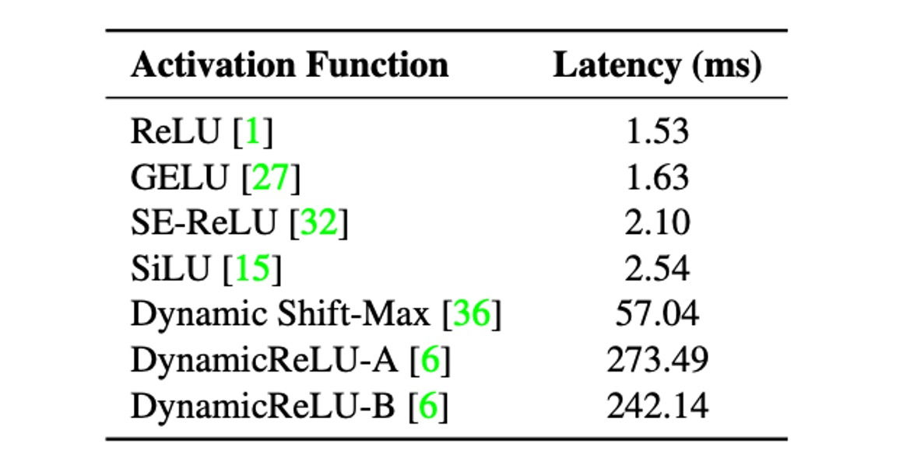

## 一ミリ秒の攻防

[**MobileOne: An Improved One millisecond Mobile Backbone**](https://arxiv.org/abs/2206.04040)

---

再パラメータ化の概念は、2021 年の RepVGG 提出後に注目を集め始めました。

研究者たちは、モデルアーキテクチャで再パラメータ化を適用する方法を模索し、モデルの性能向上を目指しています。

:::tip
**モデル再パラメータ化（Reparameterization）**：

訓練と推論のアーキテクチャを分割し、元のモデルパラメータを新しいパラメータに変換することで、数学的に等価な方法で訓練アーキテクチャを推論アーキテクチャに変換し、モデルの速度と性能を向上させます。
:::

## 問題定義

RepVGG の成功を受けて、著者は再パラメータ化の効果を試すことにし、「再パラメータ化」を目的とした新しい構造ユニットを設計し、iPhone12 上で CoreML を使用して神経ネットワークをデプロイし、ベンチマークテストを行いました。

RepVGG と同様に、MobileOne も訓練時には線形超パラメータ化モデルを使用し、推論時に線形構造を再パラメータ化し、訓練中の正規化を動的に緩和します。

:::tip
モデル再パラメータ化の概念については RepVGG を再度確認することをお勧めします。この MobileOne 論文では、問題の説明部分で新しい情報は述べられていません。

- [**RepVGG: VGG を再び偉大に**](../2101-repvgg/index.md)
  :::

## 問題解決

### ボトルネック分析 - 活性化関数

著者は、活性化関数が遅延に与える影響を分析するため、30 層の畳み込み神経ネットワークを構築し、iPhone12 上で異なる活性化関数を使用してベンチマークテストを行いました。

上表から、すべてのモデルは活性化関数以外のアーキテクチャは同じであるにもかかわらず、遅延に大きな違いがあることが分かります。

これらの遅延の違いは、最近導入された活性化関数によって引き起こされており、これらの活性化関数は、MicroNet のような非常に低 FLOPs モデルでは顕著な精度向上を示すものの、使用することによる遅延コストが非常に高い場合があります。

そのため、MobileOne の設計時には、遅延コストを減らすために ReLU 活性化関数のみを使用することを選びました。

### ボトルネック分析 - アーキテクチャ

次に、2 つの一般的なアーキテクチャ、スキップ接続と Squeeze-Excite モジュールを考慮します。

実行時のパフォーマンスに影響を与える 2 つの主要な要因は、メモリアクセスコストと並列度です。マルチブランチアーキテクチャでは、各ブランチのアクティベーションを保存して次のテンソルを計算する必要があるため、メモリアクセスコストが大幅に増加します。ネットワークの分岐数が少ない場合、このメモリボトルネックを回避できます。同期コストが高いため、強制同期されるアーキテクチャブロック（例えば、Squeeze-Excite ブロックで使用されるグローバルプーリング操作）も実行時間に影響を与えます。

メモリアクセスコストや同期コストなどの隠れたコストを示すために、著者は 30 層の畳み込み神経ネットワークにおいて、スキップ接続と Squeeze-Excite モジュールの使用を排除しました。上表には、各選択肢が遅延に与える影響が示されています。

そのため、MobileOne は推論時に分岐のないアーキテクチャを採用しており、これによりメモリアクセスコストが小さくなります。最大のバリエーションのみで Squeeze-Excite モジュールを使用し、精度を向上させています。

### モデルアーキテクチャ

MobileOne のユニット構造は、以前の研究に似ていますが、違いは RepVGG では ResNet の残差構造を変更して再パラメータ化可能な形式に変換しているのに対し、MobileOne では MobileNet の基本ブロックを再パラメータ化可能な形式に変換している点です。

上図に示されているように、今回は再パラメータ化の対象が深層可分畳み込み（Depthwise Separable Convolution）形式に変更され、最初に 3x3 の深層畳み込みを行い、その後 1x1 の逐点畳み込みを行います。次に、バッチ正規化（BatchNorm）を含む再パラメータ化されたスキップ接続とコピー構造の分岐が導入されます。

推論時、MobileOne モデルには分岐がありません。再パラメータ化プロセスを使用して、それらを削除します。カーネルサイズが K、入力チャネル次元 $C_{in}$、出力チャネル次元 $C_{out}$ の畳み込み層の場合、重み行列は $W' \in \mathbb{R}^{C_{out}\times C_{in}\times K\times K}$、バイアスは $b' \in \mathbb{R}^D$ で表されます。累積標準偏差 $\mu$、スケール $\gamma$、バイアス $\beta$ も考慮されます。

各分岐でバッチ正規化の折りたたみ重みを取得した後、推論時の畳み込み層の重み $W$ とバイアス $b$ の計算方法は以下の通りです：重み $W$ はすべての分岐重み $W_{i}$ の合計であり、すなわち $W = \sum_{i=1}^{M} W_{i}$；バイアス $b$ はすべての分岐バイアス $b_{i}$ の合計であり、すなわち $b = \sum_{i=1}^{M} b_{i}$、ここで $M$ は分岐の数です。

### モデル設定

最近の研究では、モデルの幅、深さ、解像度を調整することで性能が向上することが示されています。上表には 5 種類の異なる幅比が示されています。

MobileOne は深さのスケーリングにおいて MobileNet-V2 と似ており、入力解像度が大きいときには浅い初期段階を使用します。これらの層は後期の段階よりも遅いためです。

MobileOne は推論時にマルチブランチアーキテクチャを使用しないため、マルチブランチアーキテクチャによるデータ転送コストを回避しています。これにより、顕著な遅延コストを追加することなく、モデルパラメータを拡張でき、MobileNet-V2 や EfficientNets などの競争力のあるマルチブランチアーキテクチャと比較して大きな利点となっています。

## 討論

### ImageNet の性能

著者は ImageNet データセットで MobileOne モデルを評価しました。このデータセットには 128 万枚の訓練画像と 1,000 クラスからの 50,000 枚の検証画像が含まれています。

すべてのモデルは 8 台の NVIDIA GPU を搭載したマシンで PyTorch ライブラリを使用してゼロから訓練されました。訓練プロセスでは SGD とモーメンタムオプティマイザーを使用し、300 エポックで訓練され、有効バッチサイズは 256 です。モデルの性能を向上させるために、ラベルスムージング正則化とクロスエントロピー損失が使用され、スムージング因子は 0.1 に設定されています。

初期学習率は 0.1 で、コサインアニーリング戦略を採用し、初期の重み減衰係数は $10^{-4}$ で、最終的に $10^{-5}$ まで減衰します。

大きな MobileOne バリエーション（S2、S3、S4）は AutoAugment 技術を使用して訓練され、より小さなバリエーション（S0、S1）は標準的なデータ拡張手法（ランダムリサイズクロップや水平反転など）を使用しました。

すべてのバージョンの MobileOne は、EMA（指数移動平均）を使用して訓練され、減衰定数は 0.9995 です。

テスト時、すべてのモデルは 224 × 224 の解像度で評価され、パラメータ数は 2,000 万未満で、蒸留技術を使用して訓練されていません。FLOPs 計数は fvcore ライブラリを使用して報告されています。

実験結果は、最小の Transformer アーキテクチャ変種でさえ、モバイルデバイスでの遅延が最大 4 ミリ秒であることを示しました。

最先端の MobileFormer の top-1 精度は 79.3%、遅延は 70.76 ミリ秒であり、MobileOne-S4 の精度は 79.4%、遅延はわずか 1.86 ミリ秒で、速度は 38 倍速くなりました。MobileOne-S3 は top-1 精度で EfficientNet-B0 より 1% 高く、モバイルデバイスでの速度は 11% 向上しました。

他の競合方法と比較しても、MobileOne モデルは CPU と GPU の両方で低遅延を実現しています。

## 結論

本研究では、現代の高性能 CNN で使用されるさまざまなアーキテクチャコンポーネントの効率的なボトルネックを分析し、再パラメータ化された構造を使用することで最適化ボトルネックを改善できることを証明しました。

MobileOne のモデル拡張戦略は、再パラメータ化された構造を使用することで最先端の性能を達成し、モバイルデバイスおよびデスクトップ CPU 上で高い効率を維持しています。

研究成果は、モデルの精度と汎化能力を向上させただけでなく、遅延を大幅に低減し、今後の研究とアプリケーションに重要な参考と基盤を提供しました。
