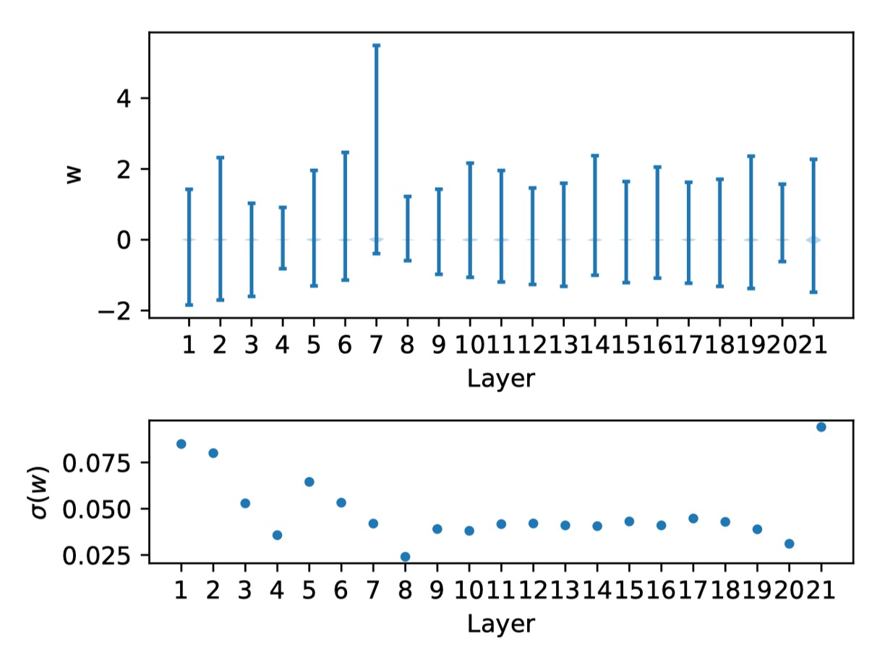
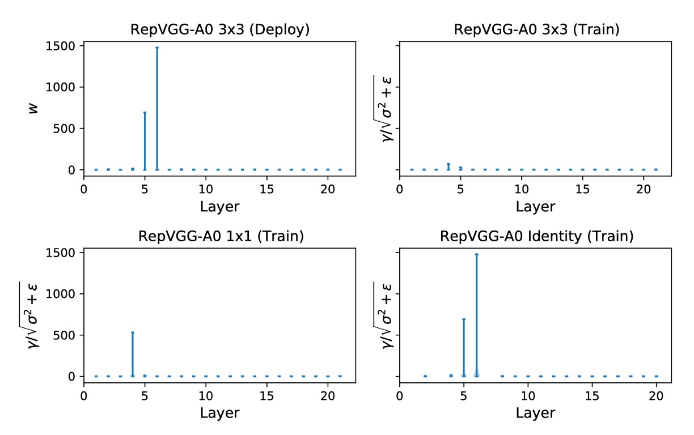
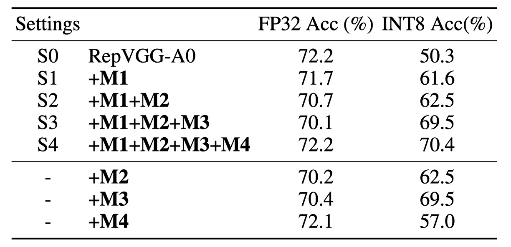
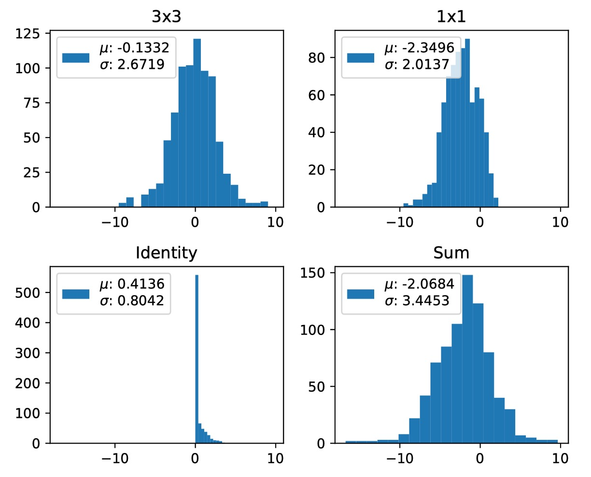

## RepVGG を再び偉大に

[**Make RepVGG Greater Again: A Quantization-Aware Approach**](https://ojs.aaai.org/index.php/AAAI/article/view/29045)

---

RepVGG は訓練段階で複数の分岐形式を使用した過剰パラメータ化ネットワークを利用し、推論プロセスではこれらの分岐を同じように統合して 1 つにする手法を「再パラメータ化」と呼んでいます。

- [**RepVGG: VGG を再び偉大に**](../2101-repvgg/index.md)

## 問題定義

この「再パラメータ化」設計は、低レベルおよび高レベルの視覚タスクで基本的なコンポーネントとして広く使用されており、最近流行のターゲット検出手法（YOLOv6 や YOLOv7 など）もこのようなコンポーネントを基に構築されています。

- [**[22.07] YOLOv7**](https://arxiv.org/abs/2207.02696)
- [**[22.09] YOLOv6**](https://arxiv.org/abs/2209.02976)

しかし…

### RepVGG、それは量子化できない！

量子化は効果的なモデル圧縮方法で、ネットワークの重みや入力データを低精度（通常 INT8）にマッピングして高速計算を行い、計算効率を大幅に向上させます。

- 訓練後量子化（PTQ）は最も一般的な手法で、少数の画像バッチで量子化パラメータを調整し、追加の訓練なしで行えるため広く使用されています。
- 量子化感知訓練（QAT）手法も精度向上のために提案されており、QAT は訓練コードに侵入する必要があり、追加のコストが発生するため、通常は訓練コードがある場合や PTQ で満足な結果が得られない場合に使用されます。

量子化には通常精度低下が伴います。したがって、「あまり影響を与えない」場合に、デプロイ作業で使用することができます。

- **しかし、RepVGG を量子化した後、精度が 20%も低下した！**

これは実用的ではありません！

### まず、なぜ？

---

著者は最初に、公式のコードを使用していくつかの RepVGG モデルの性能を評価しました。上表に示すように、RepVGG-A0 は標準の PTQ（後訓練量子化）を使用した後、ImageNet 検証データセットでの Top-1 精度が 72.4%から 52.2%に大幅に低下し、総計で 20.2%も低下しました！

テンソル $X$ の量子化操作は通常次のように表されます：

$$
Q(X) = Clip(Round(X/\Delta x ))
$$

ここで、$Round$ は天井関数を使用して浮動小数点値を四捨五入し、$Clip$ は量子化範囲外の値を切り捨てます。$\Delta x$ は、テンソルを指定された範囲にマッピングするためのスケーリング係数で、次のように定義されます：

$$
\Delta x = \frac{(x_{max} - x_{min})}{2^{b}-1}
$$

ここで、$x_{max}$ と $x_{min}$ は範囲の境界値で、$X$ の値分布を最適に表現するために選ばれます。量子化誤差の分散は $\sigma^2 = (\Delta x)^2/12$ で計算されます。したがって、問題は $x_{max}$ と $x_{min}$ の間の範囲をどのように減らすかということになります。

実際には、これらはさまざまな方法で選択されます。時には最大値と最小値が直接使用され、例えば重みの量子化であったり、時には量子化誤差の MSE やエントロピーを最適化して選ばれたりします。選択の質は、テンソルの分散や異常値の有無など、多くの要因に依存します。

神経ネットワークでは、量子化が必要であり、精度低下を引き起こす可能性がある主な 2 つの要素は重みと活性化関数です。活性化関数は次の層への入力としても機能するため、誤差が層ごとに蓄積し増加します。したがって、神経ネットワークが良好な量子化性能を発揮するためには、次の 2 つの基本条件が必要です：

- $C1$：重みの分布が量子化に適しており、範囲が適切であること、
- $C2$：活性化の分布（モデルの入力特徴に対する応答）が量子化に適していること。

経験的に、重みや活性化の分布が小さな分散と少数の異常値を持っている場合、量子化に適していると定義され、上記のいずれかの条件に違反すると、量子化性能が悪化します。

著者は次に、RepVGG-A0 モデルの重み分布を示します：

上図は各層の重み分布と対応する標準偏差を示しています。

これらの重みがゼロ付近に均等に分布しており、特別な異常値がないことが確認でき、$C1$ の条件を満たしていることがわかります。これにより著者は、$C2$ をさらに検証し、活性化関数が量子化性能を大きく悪化させているのではないかと分析を続けました。不幸にも、活性化関数は入力に依存しており、学習された重みと結びついています。

そのため、著者は重みや活性化関数の分布に対して仮定をせず、各分岐の偏差を分析しました。

### 正則化による活性化の分散拡大

さらに議論を進める前に、典型的な RepVGG ブロックでの計算操作について説明します。

ここでは、理解を深めるために RepVGG と同じ命名規則を使用します。

ここで $W^{(k)} \in \mathbb{R}^{C_2 \times C_1 \times k \times k}$ は $k \times k$ 畳み込みのカーネルを表し、$C_1$ と $C_2$ はそれぞれ入力チャネルと出力チャネルの数です。RepVGG では、$k \in \{1, 3\}$ です。また、$k \times k$ 畳み込み後の BN 層について、平均 $\mu^{(k)} \in \mathbb{R}^{C_2}$、標準偏差 $\sigma^{(k)} \in \mathbb{R}^{C_2}$、スケール因子 $\gamma^{(k)} \in \mathbb{R}^{C_2}$、バイアス $\beta^{(k)} \in \mathbb{R}^{C_2}$ を使用します。Identity 分岐での BN には、$\mu^{(0)}$, $\sigma^{(0)}$, $\gamma^{(0)}$, $\beta^{(0)}$ を使用します。

$M^{(1)} \in \mathbb{R}^{N \times C_1 \times H_1 \times W_1}$ と $M^{(2)} \in \mathbb{R}^{N \times C_2 \times H_2 \times W_2}$ はそれぞれ入力と出力を表し、$\ast$ は畳み込み演算を示します。

$Y^{(0)}$, $Y^{(1)}$ および $Y^{(3)}$ はそれぞれ Identity、$1 \times 1$ および $3 \times 3$ 分岐の出力です。

一般的な場合、$C_1 = C_2$, $H_1 = H_2$, $W_1 = W_2$ と仮定します。

したがって、出力 $M^{(2)}$ は次のように書けます：

$$
M^{(2)} = BN(M^{(1)} \ast W^{(3)}, \mu^{(3)}, \sigma^{(3)}, \gamma^{(3)}, \beta^{(3)})
$$

$$
+ BN(M^{(1)} \ast W^{(1)}, \mu^{(1)}, \sigma^{(1)}, \gamma^{(1)}, \beta^{(1)})
$$

$$
+ BN(M^{(1)}, \mu^{(0)}, \sigma^{(0)}, \gamma^{(0)}, \beta^{(0)})
$$

次に、$3 \times 3$ 分岐の BN 操作は次のように書けます：

$$
Y^{(3)} = \gamma^{(3)} \odot \frac{M^{(1)} \ast W^{(3)} - \mu^{(3)}}{\sqrt{\sigma^{(3)} \odot \sigma^{(3)} + \epsilon}} + \beta^{(3)}
$$

ここで、$\odot$ は要素ごとの掛け算を示し、$\epsilon$ は数値安定性を確保するための小さな値（デフォルトは $10^{-5}$）です。これにより、BN は入力の統計量（平均と分散）を変更する役割を果たします。

この式において、$\mu$ の変化は量子化誤差に影響を与えませんが、分散の変化は量子化精度に直接影響を与えます。確率論的に言うと、ランダム変数 $X$ とスカラー $\lambda$ が与えられたとき、$\lambda X$ の分散、すなわち $D(\lambda X)$ は $\lambda^2 D(X)$ に等しいです。

$X^{(3)} = M^{(1)} \ast W^{(3)}$ とすると、次のように求められます：

$$
D(Y^{(3)}) = \frac{\gamma^{(3)} \odot \gamma^{(3)}}{\sigma^{(3)} \odot \sigma^{(3)} + \epsilon} \odot D(X^{(3)})
$$

ここで、$\frac{\gamma^{(3)} \odot \gamma^{(3)}}{\sigma^{(3)} \odot \sigma^{(3)} + \epsilon}$ の値は $X^{(3)}$ の分散を拡大または縮小する役割を果たし、これにより量子化性能が向上または悪化します。

:::tip
$1 \times 1$ および Identity 分岐に関しても同様の結論が得られるため、繰り返しません。
:::

上記の分析に基づいて、著者は RepVGG の詳細をさらに掘り下げて検討しました：

重要で見落とされがちなコンポーネントは、特別に設計された重み減衰、いわゆるカスタム $L_2$ です。このコンポーネントは精度を向上させ、量子化を促進します。この特殊設計は、多分岐重みを正則化し、等価融合された畳み込みカーネルを正則化するように機能します。これにより、融合された重みは量子化に適した分布を持つ可能性が高くなります。このカスタム $L_2$ 損失は実質的に次のようになります：

$$
L_{2,\text{custom}} = \frac{\|W_{\text{eq}}\|_2^2}{\frac{\|\gamma^{(3)}\|_2^2}{\sqrt{\sigma^{(3)} \odot \sigma^{(3)} + \epsilon}} + \frac{\|\gamma^{(1)}\|_2^2}{\sqrt{\sigma^{(1)} \odot \sigma^{(1)} + \epsilon}}}
$$

ここで、最適化器は分母を拡大することでこの損失を最小化するように促され、これにより活性化の分散が拡大し、量子化の難しさが生じます。つまり、カスタム $L_2$ は学習された重みが量子化に適したものになるよう助けますが、その代償として活性化の量子化が難しくなります。

分散拡大の問題を解決するための簡単で直接的な方法は、上記の式から分母を取り除くことです。その結果、次のような損失が得られます：

$$
L_{2,\text{custom}}' = \|W_{\text{eq}}\|_2^2
$$

結果は次の表の通りです：

分母項を取り除いた後、FP32 の精度は 71.5% で、ベースラインより 0.7% 低下しましたが、驚くべきことに量子化性能が大幅に向上し、61.2% となりました。

ただし、この方法は依然として不便な等価変換が必要です。別のアプローチとして、通常の $L_2$ を直接適用することを考えました。結果として、シンプルさを除けば、$L_2$ は前述の式をわずかに上回る結果を得ました。

したがって、最終的に著者はこの方法をデフォルトの実装方式（M1）として選択しました。

### 制御できない異常な重み

FP32 精度はベースラインより 0.5% 低いですが、INT8 精度はベースラインより 11.3% 高いです。しかし、この設計は明確な正則化器がなく、活性化の分散を拡大することができないため、依然としてアプリケーションの要求に応えられません。したがって、重みの分布を検査することが直接的な方法です。

まず、融合後の重みを次のように表すことができます：

$$
W = \hat{W}^{(3)} + \hat{W}^{(1)} + \hat{W}^{(0)}
$$

$$
= \frac{\gamma^{(3)}}{\sqrt{\sigma^{2}_{(3)} + \epsilon}} \odot W^{(3)}
$$

$$
+ \frac{\gamma^{(1)}}{\sqrt{\sigma^{2}_{(1)} + \epsilon}} \odot Padding(W^{(1)})
$$

$$
+ \frac{\gamma^{(0)}}{\sqrt{\sigma^{2}_{(0)} + \epsilon}} \odot Padding(W^{(0)})
$$

ここで、$Padding()$ は $3 \times 3$ 畳み込みカーネルの形状に一致させるために使用されます。

このアーキテクチャでは、$W^{(3)}$ と $W^{(1)}$ は訓練可能なパラメータであり、$W^{(0)}$ は固定の単位行列で、訓練中に減衰しません。スカラー $\frac{\gamma^{(3)}}{\sqrt{\sigma^{2}_{(3)} + \epsilon}}$ と $\frac{\gamma^{(1)}}{\sqrt{\sigma^{2}_{(1)} + \epsilon}}$ はそれぞれ $3 \times 3$ と $1 \times 1$ 分岐の畳み込み層の出力に依存します。

**しかし、$\frac{\gamma^{(0)}}{\sqrt{\sigma^{2}_{0} + \epsilon}}$ は最終層の出力に直接依存し、Identity 分岐は特別です。なぜなら、活性化が BatchNorm 層に入力する前に ReLU 層を通過するからです。**

この操作は非常に危険で、もしあるチャネルが完全に活性化されていない場合（つまり、すべてゼロ）、これは非常に小さな $\sigma$ と特異値 $\frac{1}{\sqrt{\sigma^{2}_{(0)} + \epsilon}}$ を生成します。この問題は ReLU を広く使用しているネットワークでよく見られます。

**もしこのようなことが起こると、特異値が融合された畳み込みカーネルの分布を支配し、その量子化の好ましさに大きな影響を与えます。**

これが量子化性能が悪い理由を説明します：なぜなら、$C1$ を違反することが修正不可能な誤差を引き起こすからです。

---

著者はさらに、三つの分岐の $\frac{\gamma}{\sqrt{\sigma^2 + \epsilon}}$ を次の図で示しています。

Layer 5 と 6 における Identity 分岐からの $\frac{\gamma}{\sqrt{\sigma^2 + \epsilon}}$ の最大値はそれぞれ 692.1107 と 1477.3732 です。

著者は三回実験を繰り返しましたが、この現象は何度も発生しました。

:::tip
異なる実験で最大値はランダムに異なる層に現れます。単にこれらの層をスキップするだけでは量子化の問題を解決できません。

著者の分析によれば、RepVGG の量子化誤差はすべての層で累積されるため、一部の解決策では崩壊を緩和できません。この問題を解決するためには、量子化に優しい再パラメータ化構造を設計する必要があります。
:::

## 解決策

著者は普通の $L_2$ 損失に基づき、再パラメータ化構造を変更して上記の問題を解決しました。

著者は Identity および $1 \times 1$ 分岐から BN を削除し、三つの分岐が加算された後に追加の BN を付け加えました。Identity 分岐の BN（M2）を削除することで、異常な制御不能な重みを排除し、$C1$ を満たしました。

著者はこの設定を S2 と命名し、下表の三行目に結果を示しました。

重みの量子化誤差分析は、この設計が確かに $C1$ の要求を満たすことを示しています。このモデルの FP32 精度は 70.7% で低く、INT8 精度は 62.5% で、依然として実用的ではありません。これにより、著者はこれが $C2$ を違反しているかどうかを検証しました。もし $3 \times 3$ と $1 \times 1$ 分岐が同じ平均を持つ場合、加算は分散を拡大しやすくなります。

RepVGG の設計ではこの現象が頻繁に発生します。なぜなら、ReLU が RepVGG で使用されている活性化関数であるからです。一方で、もしほとんどの入力がゼロ以下（死んだニューロン）であれば、これは有害です。逆に、すべての入力がゼロ以上であれば、非線形性を失うため好ましくありません。経験的に、多くの現代の高性能 CNN モデルでは、ReLU の前に通常ゼロ平均を持つものが多いです。

この仮定を取ると、次のように得られます：

$$
E(M^{(2)}) = E(Y^{(1)} + Y^{(3)} + Y^{(0)}) = 0
$$

もし $3 \times 3$ と $1 \times 1$ 分岐が同じ平均を持つ場合、次のようになります：

$$
\beta^{(3)} = \beta^{(1)} = -2E(Y^{(0)})
$$

$E(Y^{(0)}) \ge 0$ に注意してください。三つの分岐を加算すると、分散が拡大しやすいことがわかります（下図参照）。残念ながら、RepVGG の元々の設計ではこの問題が避けられません。

---

分散をより良く制御するために、いくつかの簡単な方法を考慮できます。次の表に示します：

この設計では $1 \times 1$ 分岐の BN を削除しました（M3）。これが最良の性能を発揮し、この設定を S3 と命名しました。この設計では、ImageNet 上で 70.1% の Top-1 FP32 精度と 69.5% の INT8 精度を達成し、量子化性能が大幅に向上しました。

しかし、FP32 精度は依然として低いです。

三つの分岐の加算は共分散転送問題を引き起こすため、著者は三つの分岐が加算された後に追加のバッチ正規化（M4）を付け加えて訓練プロセスを安定させ、この設定を S4 と命名しました。

後置の BN はデプロイ時の等価畳み込みカーネル融合には影響しません。これにより、A0 モデルの FP32 精度は ImageNet 上で 70.1% から 72.2% に向上し、INT8 精度は 70.4% に達しました。

結論として、上記の四つの修正（M1 から M4）が組み合わさった最終的なモデルが QARepVGG であり、その FP32 精度は RepVGG と同等であり、INT8 性能は RepVGG を大きく上回っています。

## 討論

### ImageNet 上での性能

研究結果によると、RepVGG の INT8 精度は大きく影響を受け、FP32 よりも著しく低くなります。

例えば、RepVGG-B0 の top-1 精度は 75.1% から 40.2% に急降下しました。それに対して、本研究の方法は INT8 性能において優れた成果を示し、精度の低下幅は 2% 以下でした。特に、組み込み畳み込みを持つ RepVGG は性能が不調でした。PTQ 後、RepVGG-B2g4 の精度は 78.5% から 13.7% に急降下し、64.8% の減少を見せました。一方、QARepVGG-B2g4 の精度はわずかに 0.7% 低下しただけであり、異なるスケールと変動に対する堅牢性を示しました。

RepOpt-VGG との比較では、RepOpt-VGG は勾配再パラメータ化技術を使用しており、その量子化精度はスケールの探索品質に非常に敏感です。事前学習済みモデルは一部しか公開されていなかったため、著者は RepOpt-VGG-A0/B0 モデルを再訓練しました。

結果、RepOpt-VGG-A0 は ImageNet 上で 70.3% の精度を達成し、RepVGG より 2.1% 低い結果となりました。RepOpt-VGG は改善されたものの、PTQ 精度は依然として低いままでした。これに対し、著者の方法は明らかに RepOpt-VGG より優れており、敏感な超パラメータや追加の訓練コストなしで実現されています。

最後に、著者は NVIDIA の量子化ツールキットを使用して RepVGG で QAT を行い、比較しました。その結果、QAT を搭載した QARepVGG の性能は、RepVGG+QAT よりも著しく優れていることが示されました。すべてのモデルは 10 エポックで訓練され、初期学習率は 0.01 であり、この方法の量子化後の性能における顕著な優位性が確認されました。

## 結論

理論的および定量的な分析を通じて、本研究は RepVGG に基づく有名な再パラメータ化構造の量子化過程における失敗の原因を深く掘り下げました。研究結果は、構造上の欠陥が量子化誤差を避けられず、悪化した結果を累積的に生み出すことを示しました。この問題を解決するために、研究チームは構造を再設計し、QARepVGG を提案しました。この改良された設計は、量子化に適した重みと活性化の分布を生成しました。

QARepVGG は RepVGG の優れた FP32 性能を維持しつつ、最終的なデプロイメントの量子化プロセスを大幅に簡素化しました。この研究は、モデル設計において量子化意識を高めることの重要性を強調しており、モデル全体の性能向上に寄与しています。この設計により、QARepVGG は量子化過程において優れた性能を示し、今後のモデル設計に貴重な参考を提供しています。

:::tip
この論文を最後まで読んだ後、自分が偉大になったような気分になりました...

数式が多いですが、実際には理解しやすい内容です。

読者には、QARepVGG の設計と性能についてより深く理解するために、原文を読むことをお勧めします。
:::
