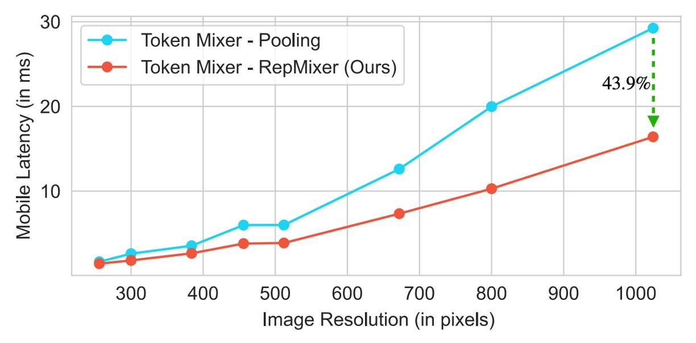
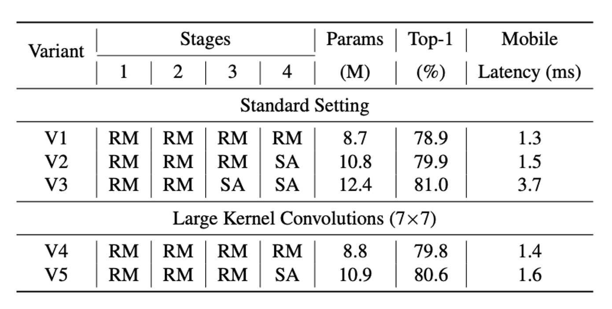

## 再パラメータ化された ViT の実験

[**FastViT: A Fast Hybrid Vision Transformer using Structural Reparameterization**](https://arxiv.org/abs/2303.14189)

---

Apple は MobileOne を発表した後、モデルの再パラメータ化のさらなる可能性を探索し続けています。

前回は MobileNet アーキテクチャに取り組み、今回は ViT（Vision Transformer）です。

:::tip
**モデル再パラメータ化（Reparameterization）**：

訓練と推論のアーキテクチャを分割し、元のモデルパラメータを新しいパラメータに変換することで、数学的に等価な方法で訓練アーキテクチャを推論アーキテクチャに変換し、モデルの速度と性能を向上させます。

この一連の再パラメータ化に関する研究は、RepVGG の提案後に広まりました。この概念を初めて読む場合、RepVGG から始めることを強くお勧めします。再パラメータ化の概念を理解してから、後続の論文は非常に理解しやすくなります。さもないと、この内容を読んでもあまり意味がありません。

- [**RepVGG: VGG を再び偉大に**](../2101-repvgg/index.md)
  :::

## 問題定義

コンピュータビジョン分野での Transformer モデルには、過去数年間でいくつかの設計方向が定まっています。

まず、視覚タスクの多尺度解析のニーズに対応するために、いくつかの層を階層化するという概念が登場します。これは PVT や Swin Transformer から来ている概念です：

- [**[21.02] PVT: 空間縮小注意メカニズム**](../../vision-transformers/2102-pvt/index.md)
- [**[21.03] Swin Transformer: ダンスが始まる**](../../vision-transformers/2103-swin-transformer/index.md)

次に、Token Mixer ブロックと FFN ブロックを組み合わせて基本モジュールを設計します。この概念は MetaFormer から来ているものです：

- [**[21.11] PoolFormer: 必要なのはフレームワーク**](../../vision-transformers/2111-poolformer/index.md)
- [**[22.10] CaFormer: MetaFormer 使用説明書**](../../vision-transformers/2210-caformer/index.md)

本論文の著者は MobileOne を発表した後、このアーキテクチャに注目しました。

- [**[22.06] MobileOne: 一ミリ秒の攻防**](../2206-mobileone/index.md)

では、Vision Transformer シリーズのモデルも再パラメータ化する可能性はあるのでしょうか？

## 問題解決

### モデルアーキテクチャ

FastViT のアーキテクチャは、異なるスケールで動作する 4 つの異なる段階を含んでいます。

- **RepMixer**

  RepMixer は、ConvMixer に導入された畳み込みミキシングの概念に基づいており、そのミキシングブロックは以下のように定義されています：

  - [**[22.01] ConvMixer**](https://arxiv.org/abs/2201.09792)

  $$Y = \text{BN}(\sigma(\text{DWConv}(X))) + X$$

  ここで、$\sigma$ は非線形の活性化関数を表し、BN はバッチ正規化（Batch Normalization）を示し、DWConv は深層畳み込み層です。FastViT は再配置操作を行い、非線形関数を削除して簡略化しています：

  $$Y = \text{DWConv}(\text{BN}(X)) + X$$

  この設計の主な利点は、推論時に単一の深層畳み込み層に再パラメータ化できることです：

  $$Y = \text{DWConv}(X)$$

  この再パラメータ化は、メモリアクセスコストと計算の複雑さを大幅に削減し、PoolFormer の PoolMixer よりも優れた推論性能を発揮します。

  

- **位置エンコーディング**

  FastViT は条件付き位置エンコーディングを採用しており（参照文献は以下）、これらのエンコーディングは入力トークンの局所的な隣接関係に基づいて動的に生成されます。これらのエンコーディングは深層畳み込み演算で生成され、パッチ埋め込みに追加されます。この過程には非線形操作がないため、このブロックは効果的に再パラメータ化できます。

  - [**[21.02] Conditional positional encodings for vision transformers**](https://arxiv.org/abs/2102.10882)
  - [**[21.04] Twins: Revisiting the design of spatial attention in vision transformers**](https://arxiv.org/abs/2104.13840)

- **深層可分畳み込み**

  MobileOne の設計理念を引き継いで、FastViT は密な $k \times k$ 畳み込みを深層可分畳み込み、つまり $k \times k$ の深層畳み込みと $1 \times 1$ のポイント畳み込みに置き換え、再パラメータ化訓練戦略を組み合わせています。

  この方法は訓練時間をほとんど増加させずにモデル容量を向上させます。例えば、FastViT-SA12 と FastViT-SA36 の訓練時間はそれぞれ 6.7% と 4.4% 増加しただけです。

- **大核畳み込み**

  

  RepMixer が自注意トークンミキサーに対して局所的な受容野に制限を持つ問題を解決するため、FastViT は FFN とパッチ埋め込み層に深層大核畳み込みを統合しました。

  実験結果は、上表に示すように、大核畳み込みを統合することでモデル性能と堅牢性が顕著に向上し、この戦略は計算コストを大きく増加させることなく受容野を拡大しました。

### モデル構成

FastViT はさまざまな計算ニーズやアプリケーションシナリオに対応する複数のバリエーションを提供しており、上表に示すように、これらのバリエーションは埋め込み次元、MLP 拡張比率、含まれるモジュールの種類に違いがあります。

具体的な詳細は以下の通りです：

- 埋め込み次元が小さいモデル（例：[64, 128, 256, 512]）には "S" のプレフィックスを付けます。
- 自注意（Self-Attention）層を含むモデルには "SA" のプレフィックスを付けます。
- 埋め込み次元が大きいモデル（例：[76, 152, 304, 608]）には "M" のプレフィックスを付けます。
- MLP 拡張比率が 4 未満のモデルには "T" のプレフィックスを付けます。

表の数字は、FastViT モジュールの総数を示し、FLOP 計算は fvcore ライブラリで算出されています。

### 訓練と評価戦略

著者は ImageNet-1K データセットで実験を行いました。このデータセットには約 130 万枚の訓練画像と 5 万枚の検証画像が含まれています。

このモデルの訓練方法は次の通りです：

- **オプティマイザ**：AdamW
- **訓練エポック数**：300 エポック
- **重み減衰**：0.05
- **ピーク学習率**：$10^{-3}$
- **バッチサイズ**：1024
- **ウォームアップ期間**：5 エポック
- **学習率減衰**：コサインアニーリング
- **実装ツール**：timm ライブラリ
- **訓練ハードウェア**：8 台の NVIDIA A100 GPU

384×384 の入力サイズで 30 エポックの微調整が行われ、具体的な設定は次の通りです：

- **重み減衰**：$10^{-8}$
- **学習率**：$5 \times 10^{-5}$
- **バッチサイズ**：512

著者は FastViT を他の最新のモデルと比較しました。公平を期すために、公式実装された ConvNeXt を修正し、高価な再構成操作を避けました。さらに、LITv2 の導出は、両ライブラリでの可変形畳み込みのサポートが不十分なため、信頼性を欠いています。

## 討論

### ImageNet 上での性能

完全な比較結果は上表に示す通りです：

- **FastViT-MA36**：

  - Top-1 精度：84.9%
  - LITv2-B より 49.3% 小さい
  - 消費 FLOPs は 55.4% 少ない

- **FastViT-S12**：

  - iPhone 12 Pro 上では MobileOne-S4 より 26.3% 高速
  - GPU 上では 26.9% 高速

- **FastViT-MA36**：

  - Top-1 精度：83.9%
  - iPhone 12 Pro 上の最適化された ConvNeXt-B モデルより 1.9 倍高速
  - GPU 上では 2.0 倍高速

- **FastViT-MA36**：

  - Top-1 精度：84.9%
  - GPU 上では NFNet-F1 と同じ速度
  - サイズは 66.7% 小さく
  - 使用 FLOPs は 50.1% 減少
  - モバイルデバイスでの速度は 42.8% 向上

:::tip
これらは iPhone 12 上での実験結果に基づいていますが、後の研究では、FastViT が多くのデバイスで予想外に遅い結果を示したことがわかりました。これは FastViT の一部の演算子が他のデバイスで加速されていないためです。したがって、FastViT を使用する場合、具体的なアプリケーションシナリオとデバイスの特性に応じて選択することをお勧めします。
:::

## 結論

FastViT 通過結構重新參數化和其他改進措施，實現了高效能和低延遲的平衡，且各種應用場景中均展現出穩健的性能。

:::tip
這篇論文沒有比較 CAFormer 的結果，從我們自己對比中，在同等計算量的情況下，CAFormer 的性能要優於 FastViT。

例如：

- CAFormer-S18, MACs 4.1G；FastViT-SA24, MACs 3.8G。
- CAFormer-S18 的 Top-1 精度為 83.6%，而 FastViT-SA24 的 Top-1 精度為 82.6%。

不過在 CAFormer 中沒有重新參數化，因此可以預期速度會慢得多。此外，CAFormer 最小的模型還是很大，不適合部署在行動設備上。FastViT 在這方面佔有優勢，其最小模型的尺寸大約 3.6M 的參數量。
:::

## 結論

FastViT は構造的再パラメータ化とその他の改善策を通じて、高い性能と低遅延のバランスを実現し、さまざまなアプリケーションシナリオで安定した性能を示しました。

:::tip
この論文では CAFormer の結果を比較していませんが、私たちの比較では、同じ計算量の条件下で CAFormer の性能が FastViT より優れていることがわかりました。

例えば：

- CAFormer-S18, MACs 4.1G; FastViT-SA24, MACs 3.8G。
- CAFormer-S18 の Top-1 精度は 83.6%、FastViT-SA24 の Top-1 精度は 82.6% です。

しかし、CAFormer では再パラメータ化が行われていないため、速度はかなり遅くなることが予想されます。さらに、CAFormer の最小モデルでもかなり大きいため、モバイルデバイスへのデプロイには適していません。一方で、FastViT はこの点で優れており、最小モデルのパラメータ数は約 3.6M です。
:::
