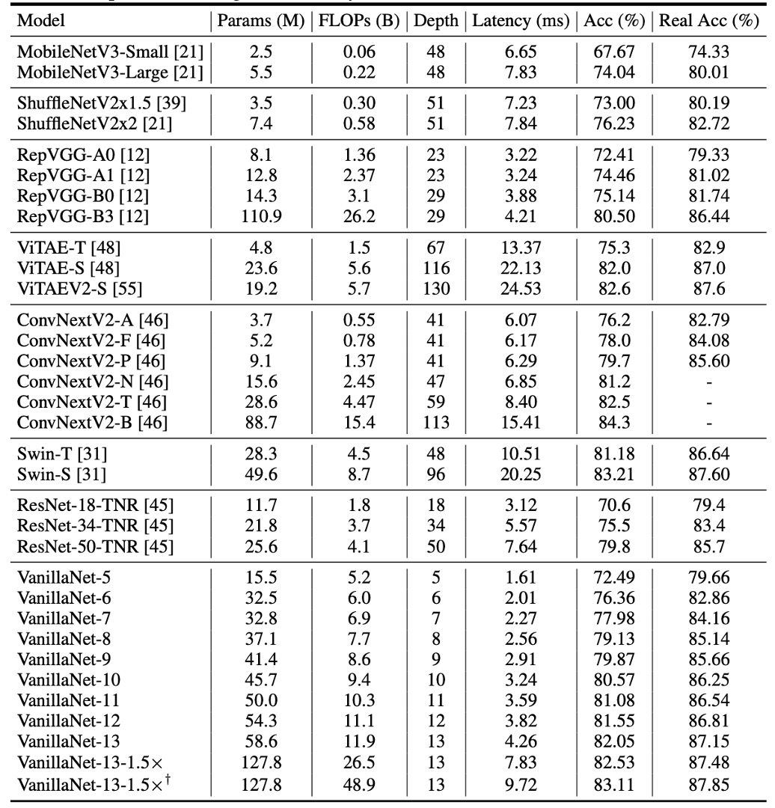
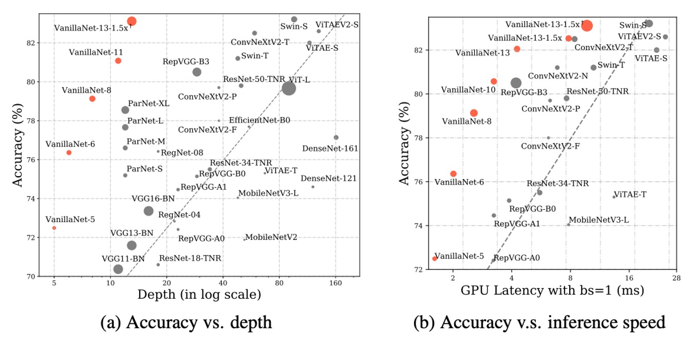

# [23.05] VanillaNet

## バニラシンプルスタイル

[**VanillaNet: the Power of Minimalism in Deep Learning**](https://arxiv.org/abs/2305.12972)

---

深層畳み込みネットワークが十年もの間流行した後、こんなにもシンプルなスタイルの作品を見ることができるとは驚きだ。

## 問題の定義

ここ数年で、コンピュータビジョン分野の研究は急速に進展した。初期の AlexNet から、現在では最新の CNN と Transformer のハイブリッドアーキテクチャに至るまで、目を見張るような進化を遂げてきた。

ImageNet のランキングを更新するために、研究者たちはモデルの複雑さをどんどん高めてきた。その結果、計算コストやリソースの需要は急激に増加した。さらに、複雑なアーキテクチャはデプロイメントにおいても課題を引き起こす。例えば、ResNet は操作時に大量の追加メモリを消費し、Swin Transformer ではシフトウィンドウメカニズムが必要で、CUDA コードの書き直しなどの複雑なエンジニアリングが求められる。

### なぜ非残差畳み込みアーキテクチャは再評価されなくなったのか？

それが言及されているのは、AlexNet と VGG だ。

その理由はみんなよく知っている。深層ネットワーク構造には勾配消失やネットワーク劣化の問題があるからだ。そして、ResNet が提案した残差構造はこの問題を効果的に解決した。そのため、非残差のネットワークアーキテクチャは精度の面で他のモデルに劣ることが避けられない事実となった。

シンプルなアーキテクチャのネットワーク設計は一時的に行き詰まり、あまり注目されなくなった。

AI チップの絶え間ない発展により、現代の GPU は並列計算を軽々と行うことができ、ニューラルネットワークの推論速度のボトルネックはもはや FLOP やパラメータ数ではなくなった。これに対して、モデルが複雑に設計されて深さが大きくなることで、逆に速度の障害となっていることが明らかになった。

この時点で人々は驚き、最後のボトルネックは出発前からすでに静かに決まっていたことに気づいた。

## 問題の解決

### モデルアーキテクチャ


本論文の著者は、普通のニューラルネットワークアーキテクチャを提案し、それを VanillaNet と呼んでいる。上の図のように。

このアーキテクチャを見ると、時間が十年前に戻ったような気分になる：

- AlexNet！君はどうしてここに？

---

現在の深層ネットワークとは異なり、ここでは各ダウンサンプリング段階が「一層」のみとなっている。

Stem 段階では、著者は stride を 4 に設定した$4 \times 4 \times 3 \times C$の畳み込み層を使用し、画像を$C$次元の特徴空間にマッピングする。

第 1 ～ 3 段階では、stride を 2 に設定した MaxPool を使用して特徴マップのサイズを縮小し、チャンネル数を 2 倍に増加させる。

最後の層は全結合層で、分類結果を出力する。この全ての畳み込み層のサイズは$1 \times 1$で、パラメータ数を最小限に抑えている。各畳み込み層の後ろには活性化関数が適用され、BatchNorm が使用されてトレーニングプロセスが安定する。

ここには残差接続も、注意機構も、シフトウィンドウもなく、最も基本的な畳み込みとプーリングだけがある。

### これではうまくいかないのでは？

こんなに質素なアーキテクチャで、どうして良いパフォーマンスが出る可能性があるのか？

著者は、この設計には重要な特性が欠けていることを指摘している：「非線形層」。

私たちは、ニューラルネットワークの強力な点はその非線形性にあることを知っている。これが複雑な関数を適合させる鍵であり、このネットワークの非線形性をどのように向上させるか？この部分については後で見るとして、まずはもう一つの問題、「深さ」について見ていこう。

### 深度訓練戦略

畳み込みニューラルネットワークにおいて、畳み込み層と活性化関数の組み合わせは、ネットワークがデータの非線形特徴を捉えるための鍵となります。

訓練の初期段階では、著者は活性化関数を持つ 2 つの畳み込み層を使用しています。この設計の目的は、ネットワークが初期段階で強い非線形能力を持つようにすることで、データの特徴をより良く学習できるようにすることです。訓練が進むにつれて、活性化関数の非線形性を徐々に弱め、最終的には恒等写像に変換します。

活性化関数の変化全体は、次の式で表すことができます：

$$
A'(x) = (1 - \lambda)A(x) + \lambda x,
$$

ここで、$\lambda$は訓練の進行に伴い変化するハイパーパラメータです。訓練開始時には、$\lambda = 0$となり、このとき$A'(x) = A(x)$となり、活性化関数は最大強度で動作します。訓練が進むにつれて、$\lambda$は徐々に増加し、訓練終了時には$\lambda = 1$となり、$A'(x) = x$となって活性化関数は恒等写像に変わります。

訓練終了時には、活性化関数が恒等写像に変わるため、2 つの畳み込み層は 1 つの畳み込み層として統合され、推論時間が短縮され、モデルの運行効率が向上します。この統合部分は、私たちがよく知っている再パラメータ化のプロセスに戻ります：

- **BatchNorm の統合**：

  最初に、各 BatchNorm 層とその前の畳み込み層を統合します。

  畳み込み層の重みとバイアス行列をそれぞれ$W \in \mathbb{R}^{C_{out} \times C_{in} \times k \times k}$と$B \in \mathbb{R}^{C_{out}}$、バッチ正規化のパラメータ（スケーリング、シフト、平均、分散）をそれぞれ$\gamma, \beta, \mu, \sigma \in \mathbb{R}^{C_{out}}$とします。

  統合後の重みとバイアス行列は次のようになります：

  $$
  W'_i = \frac{\gamma_i}{\sigma_i} W_i, \quad B'_i = \frac{(B_i - \mu_i) \gamma_i}{\sigma_i} + \beta_i,
  $$

  ここで$i$は$i$番目の出力チャネルの値を示します。

- **2 つの$1 \times 1$畳み込み層の統合**：

  バッチ正規化層を統合した後、次に 2 つの$1 \times 1$畳み込み層を統合します。

  $x \in \mathbb{R}^{C_{in} \times H \times W}$および$y \in \mathbb{R}^{C_{out} \times H' \times W'}$を入力と出力の特徴量とし、畳み込みは次のように表せます：

  $$
  y = W * x = W \cdot \text{im2col}(x) = W \cdot X,
  $$

  ここで$*$は畳み込み演算を示し、$\cdot$は行列積を示します。$X$は im2col 操作によって生成され、入力を畳み込みカーネルの形状に対応する行列に変換します。$1 \times 1$畳み込みの場合、im2col 操作は単純なリシェイプ操作になるため、2 つの畳み込み層の重み行列$W_1$と$W_2$は 1 つの行列に統合できます：

  $$
  y = W1 * (W2 * x) = W1 \cdot W2 \cdot \text{im2col}(x) = (W1 \cdot W2) * X,
  $$

  したがって、2 つの$1 \times 1$畳み込み層は推論速度を遅くすることなく統合することができます。

この深度訓練戦略には次のような利点があります：

1. **モデルの非線形能力の向上**：訓練初期に強い非線形活性化関数を使用することで、モデルがデータ中の複雑なパターンを捉えやすくなり、モデルのパフォーマンスが向上します。
2. **簡素化されたモデルへの段階的移行**：訓練が進むにつれて、活性化関数が恒等写像に変わるため、最終的なモデルの構造が簡素化され、推論速度が向上します。
3. **便利な層の統合操作**：訓練終了時に、2 つの畳み込み層を簡単に 1 つに統合でき、計算コストが削減され、モデルの運行効率が向上します。

:::tip
この再パラメータ化のプロセスは、私たちが以前見た RepVGG の概念と同じです。

- [**RepVGG: VGG を再び偉大にする**](../2101-repvgg/index.md)
  :::

### シーケンス情報を取り入れた活性化関数（Series Informed Activation Function）

既存の研究における理論的証明によると、シンプルで浅いネットワークの能力が限られている主な原因は「**非線形性の不足**」にあるとされています。これは深層で複雑なネットワークとは異なり、十分に研究されていない問題です。

実際、ニューラルネットワークの非線形性を向上させる方法は 2 つあります：

1. **非線形活性化層のスタック**
2. **各活性化層の非線形性を強化**

既存のネットワークのトレンドは前者を選んでいますが、これは並列計算能力が過剰な場合に遅延を引き起こします。

---

活性化層の非線形性を向上させる直接的なアイデアは、活性化関数の「直列」スタックです。これは深層ネットワークの核心的なアイデアです。

それに対して、この論文では著者は「並列」スタックを活性化関数に使用しています。

ニューラルネットワークで入力$x$に対する単一の活性化関数を$A(x)$とすると、ReLU や Tanh などの一般的な関数が考えられます。

活性化関数の並列スタックは次のように表現できます：

$$
A_s(x) = \sum_{i=1}^{n} a_i A(x + b_i)
$$

ここで、$n$はスタックする活性化関数の数を示し、$a_i$と$b_i$は各活性化関数のスケーリングとオフセットです。並列スタックにより、活性化関数の非線形性を大幅に強化することができます。この式は数学的には級数として見ることができ、つまり「複数の操作を加える」ことに相当します。

さらに、この級数の近似能力を強化するために、著者は「**級数ベースの関数がその近傍の入力を変化させることによってグローバルな情報を学習できる**」というアイデアを取り入れています。これは BNET の概念に似ています。

- [**[23.01] BNET: Batch normalization with enhanced linear transformation**](https://ieeexplore.ieee.org/document/10012548)

入力特徴量$x \in \mathbb{R}^{H \times W \times C}$が与えられた場合、ここで$H$、$W$、$C$はそれぞれ高さ、幅、チャンネル数を示し、活性化関数は次のように表されます：

$$
A_s(x_{h,w,c}) = \sum_{i,j \in \{-n, n\}} a_{i,j,c} A(x_{i+h,j+w,c} + b_c)
$$

ここで、$h \in \{1, 2, ..., H\}$、$w \in \{1, 2, ..., W\}$、$c \in \{1, 2, ..., C\}$です。

ここで分かるのは、$n = 0$の場合、級数ベースの活性化関数$A_s(x)$は通常の活性化関数$A(x)$に退化することです。これは、この方法が既存の活性化関数に対する汎用的な拡張として見ることができることを意味します。論文中では、著者は GPU 上での推論効率が非常に高いため、ReLU を基本的な活性化関数として使用し、級数を構築しています。

:::tip
少し休憩を挟みましょう。論文を読んでいると、この部分は少し抽象的に感じるかもしれません。

簡単に言えば、一般的なネットワーク設計では、例えば$3 \times 3$の畳み込み層を持ち、その後に ReLU を接続すると、ReLU の受容野は$3 \times 3$です。次に、次の層に$3 \times 3$の畳み込み層を加えて再び ReLU を接続すると、ReLU の受容野は$5 \times 5$に広がり、こうして深層に進むごとに「直列」に受容野が広がっていきます。

では、論文で言及されている「並列」スタックの活性化関数とはどういう意味でしょうか？

それは、直接「畳み込みカーネルのサイズを大きくする」ことで、受容野を広げることを意味します。1 層のスタックは$3 \times 3$の畳み込みに相当し、2 層のスタックは$5 \times 5$の畳み込みに、3 層のスタックは$7 \times 7$の畳み込みに相当します。このようにして受容野が拡大します。

ここでは実装を確認すれば、この概念が明確に理解できるでしょう：

```python
# Ref: VanillaNet
#     https://github.com/huawei-noah/VanillaNet/blob/main/models/vanillanet.py
import torch
import torch.nn as nn

class activation(nn.ReLU):

    def __init__(self, dim, act_num=3, deploy=False):
        super(activation, self).__init__()
        self.act_num = act_num
        self.deploy = deploy
        self.dim = dim
        self.weight = nn.Parameter(torch.randn(dim, 1, act_num*2 + 1, act_num*2 + 1))
        if deploy:
            self.bias = nn.Parameter(torch.zeros(dim))
        else:
            self.bias = None
            self.bn = nn.BatchNorm2d(dim, eps=1e-6)
        weight_init.trunc_normal_(self.weight, std=.02)

    def forward(self, x):
        if self.deploy:
            return nn.functional.conv2d(
                super(activation, self).forward(x),
                self.weight, self.bias, padding=self.act_num, groups=self.dim)
        else:
            return self.bn(nn.functional.conv2d(
                super(activation, self).forward(x),
                self.weight, padding=self.act_num, groups=self.dim))
```

ここでは`def forward(self, x):`の部分を直接見てください。まず入力に ReLU 活性化関数を適用し、その後`nn.functional.conv2d`で畳み込み操作を行っています。この畳み込み操作のカーネルは`self.weight`で、サイズは`act_num*2 + 1`であり、これは`act_num`層の活性化関数がスタックされていることを意味します。

最後に、これらの操作は各チャンネルごとに行われ、上記の`groups=self.dim`パラメータを見ると、PyTorch の`groups`パラメータが示すように、各チャンネルに対して独立した畳み込み操作が行われています。

:::

## 討論

先ほど述べたように、浅層ネットワークの能力が限られている主な原因は「非線形性の不足」であり、並列スタックされた活性化関数を追加することで、これがモデルの性能向上に寄与するのでしょうか？

### 消融実験 - 活性化関数


上の表は、VanillaNet が異なる$n$の数で得られたパフォーマンスを示しています。

元々のネットワーク構造は ImageNet データセットで 60.53％の精度にしか達しませんでしたが、実際には使い物になりません。

$n = 1$では精度が 74.53％に向上し、大きな進展が見られます。そして、$n = 3$では精度と推論速度の最適なバランス点に達しました。

### 消融実験 - 深層訓練戦略


VanillaNet の構造は非常に浅いため、著者はその性能向上のために訓練中の非線形性を増加させることを提案しています。

上の表は、提案された深層訓練技術の有効性を分析したもので、結果は次の通りです：元々の VanillaNet は 75.23％の top-1 精度に達しましたが、これは基準値です。深層訓練技術を使用することで、提案された VanillaNet は 76.36％の精度に到達しました。これらの結果は、浅層ネットワークに対して深層訓練技術が有用であることを示しています。

さらに著者は、深層訓練とシーケンス活性化関数を他のネットワークに適用し、これらの技術の一般化能力を示しました。

上の表には、ImageNet データセットにおける 2 つの古典的な深層ニューラルネットワークである AlexNet と ResNet-50 の結果が報告されています。元々の AlexNet は 57.52％の精度（12 層構造）にしか達しませんでした。

提案された深層訓練とシーケンス活性化関数を適用することにより、AlexNet のパフォーマンスは約 6％向上し、これらの技術が浅層ネットワークに非常に効果的であることを示しています。

一方、構造が比較的複雑な ResNet-50 では、性能の向上はわずかでした。この結果は、深層で複雑なネットワークにはすでに十分な非線形性が備わっており、追加の技術で向上することはないことを示しています。

### 消融実験 - 残差接続


最後に、一般的なネットワーク構造で流行している残差接続の効果はどうでしょうか？

著者は実験を通じて、浅層ネットワーク構造において残差接続を使用しても性能が向上せず、むしろモデルの精度が低下することを示しています。

直感的に理解しやすい説明としては、浅層ネットワークのボトルネックは恒等写像ではなく「弱い非線形性」であるため、ショートカット（残差接続）は非線形性の向上には役立たず、残差接続が活性化関数をスキップして深さを減少させるため、性能が低下してしまうということです。

### ImageNet 上での性能



提案された方法の有効性を示すため、著者は ImageNet データセットで実験を行いました。

このデータセットは 224×224 ピクセルの RGB カラー画像で構成され、128 万枚の訓練画像と 5 万枚の検証画像があり、1000 クラスに分類されています。著者は強い正則化を使用しました。なぜなら、提案された VanillaNet の各層には膨大なパラメータがあり、非線形性の限られた画像から有用な情報を捉えることができるからです。

遅延テストは Nvidia A100 GPU で実行され、著者は異なる層数の VanillaNet アーキテクチャを提案しました。これらのアーキテクチャのパフォーマンスを検証するため、バッチサイズ 1 でテストを行い、AI チップが各ネットワークの処理に十分な計算能力を持っていることを意味します。

この設定の下で、研究は推論速度が FLOPs 数やパラメータ数とはほとんど関係がないことを発見しました。例えば、MobileNetV3-Large の FLOPs は非常に低い（0.22B）にもかかわらず、GPU 遅延は 7.83ms で、11.9B FLOPs を持つ VanillaNet-13 よりも高い結果となっています。

研究はまた、この設定下で推論速度がネットワークの複雑さと層数に高度に関連していることを示しました。例えば、ShuffleNetV2x1.5 と ShuffleNetV2x2 の推論速度はほとんど変わりません（それぞれ 7.23ms と 7.84ms）が、それらのパラメータ数と FLOPs には大きな違い（0.3B と 0.6B）があります。これは、両者の違いはチャンネル数にあるだけだということです。

また、ResNet、VGGNet、VanillaNet を含むシンプルなアーキテクチャが、追加の分岐や複雑なブロック（例えば、圧縮・活性化ブロックや密接接続）を持たなくても最高の推論速度を実現できることがわかりました。



## 結論

VanillaNet は効率性と精度の面で複雑なアーキテクチャを超え、深層学習における極簡方法の可能性を際立たせました。

この研究は、基本的なモデルの既存の規範に挑戦し、洗練された効果的なモデルアーキテクチャの新しい道筋を提供しました。
